<h1 id="Chapter_002" style="color:#42A5F5;">Indice</h1>

##### [Capitulo 2-1 Using Accounts to Record Transactions [Usando Cuentas para Registrar Transacciones]](#675031)

##### [Capitulo 2-1a Chart of Accounts [Catálogo de Cuentas]](#036422)

##### [Capitulo 2-2 Double-Entry Accounting System [Sistema de Contabilidad de Partida Doble]](#634405)

##### [Capitulo 2-2a Balance Sheet Accounts [Cuentas del Balance General]](#237274)

##### [Capitulo 2-2b Income Statement Accounts [Cuentas del Estado de Resultados]](#628626)

##### [Capitulo 2-2c Statement of Stockholders' Equity Accounts (Dividends)](#948821)

##### [Capitulo 2-2d Normal Balances](#424169)

##### [Capitulo 2-2e Journalizing](#488883)

##### [Capitulo 2-3 Posting Journal Entries to Accounts](#357632)

##### [Capitulo 2-4 Trial Balance](#777994)

##### [Capitulo 2-4a Errors Affecting the Trial Balance](#988576)

##### [Capitulo 2-4b Errors Not Affecting the Trial Balance](#839312)

##### [Capitulo 2-5a Let’s Review Chapter Summary](#905868)

##### [Capitulo 2-5b Key Terms](#416104)

<h1 id="675031" style="color:#E65100;">
  <a href="#Chapter_002" style="color:inherit; text-decoration:none;">
    2-1 Using Accounts to Record Transactions [Usando Cuentas para Registrar Transacciones]
  </a>
</h1>

In Chapter 1, the November transactions for NetSolutions were recorded using the accounting equation format shown in Exhibit 1. However, this format is not efficient or practical for companies that have to record thousands or millions of transactions daily. As a result, accounting systems are designed to show the increases and decreases in each accounting equation element as a separate record. This record is called an **account** (An accounting form used to record the increases and decreases in each financial statement item.)
[En el Capítulo 1, las transacciones de noviembre de NetSolutions se registraron utilizando el formato de ecuación contable mostrado en la Figura 1. Sin embargo, este formato no es eficiente ni práctico para empresas que tienen que registrar miles o millones de transacciones diariamente. Como resultado, los sistemas contables están diseñados para mostrar los aumentos y disminuciones en cada elemento de la ecuación contable como un registro separado. Este registro se llama **cuenta** (Una forma contable utilizada para registrar los aumentos y disminuciones en cada elemento del estado financiero).]

---

## Exhibit 1 [Figura 1]

### NetSolutions' November Transactions [Transacciones de noviembre de NetSolutions]

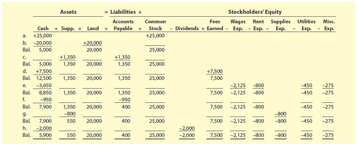


|      	| Cash    	| Supp. 	| Land   	| Accounts Payable 	| Common Stock 	| Dividends 	| Fees Earned 	| Wages Exp. 	| Rent Exp. 	| Supplies Exp. 	| Utilities Exp. 	| Misc. Exp. 	|
|------	|---------	|-------	|--------	|------------------	|--------------	|-----------	|-------------	|------------	|-----------	|---------------	|----------------	|------------	|
| a.   	| 25,000  	|       	|        	|                  	| 25,000       	|           	|             	|            	|           	|               	|                	|            	|
| b.   	| -20,000 	|       	| 20,000 	|                  	|              	|           	|             	|            	|           	|               	|                	|            	|
| Bal. 	| 5,000   	|       	| 20,000 	|                  	| 25,000       	|           	|             	|            	|           	|               	|                	|            	|
| c.   	|         	| 1,350 	|        	| +1,350           	|              	|           	|             	|            	|           	|               	|                	|            	|
| Bal. 	| 5,000   	| 1,350 	| 20,000 	| 1,350            	| 25,000       	|           	|             	|            	|           	|               	|                	|            	|
| d.   	| 7,500   	|       	|        	|                  	|              	|           	| 7,500       	|            	|           	|               	|                	|            	|
| Bal. 	| 12,500  	| 1,350 	| 20,000 	| 1,350            	| 25,000       	|           	| 7,500       	|            	|           	|               	|                	|            	|
| e.   	| -3,650  	|       	|        	|                  	|              	|           	|             	| -2,125     	| -800      	|               	| -450           	| -275       	|
| Bal. 	| -8,850  	| 1,350 	| 20,000 	| 1,350            	| 25,000       	|           	| 7,500       	| -2,125     	| -800      	|               	| -450           	| -275       	|
| f.   	| -950    	|       	|        	| -950             	|              	|           	|             	|            	|           	|               	|                	|            	|
| Bal. 	| 7,900   	| 1,350 	| 20,000 	| 400              	| 25,000       	|           	| 7,500       	| -2,125     	| -800      	|               	| -450           	| -275       	|
| g.   	|         	| -800  	|        	|                  	|              	|           	|             	|            	|           	| -800          	|                	|            	|
| Bal. 	| 7,900   	| 550   	| 20,000 	| 400              	| 25,000       	|           	| 7,500       	| -2,125     	| -800      	| -800          	| -450           	| -275       	|
| h.   	| -2,000  	|       	|        	|                  	|              	| -2,000    	|             	|            	|           	|               	|                	|            	|
| Bal. 	| 5,900   	| 550   	| 20,000 	| 400              	| 25,000       	| -2,000    	| 7,500       	| -2,125     	| -800      	| -800          	| -450           	| -275       	|

To illustrate, the Cash column of Exhibit 1 records the increases and decreases in cash. Likewise, the other columns in Exhibit 1 record the increases and decreases in the other accounting equation elements. Each of these columns can be organized into a separate account.
[Para ilustrar, la columna de Efectivo de la Figura 1 registra los aumentos y disminuciones en efectivo. Del mismo modo, las otras columnas de la Figura 1 registran los aumentos y disminuciones en los otros elementos de la ecuación contable. Cada una de estas columnas puede organizarse en una cuenta separada.]

An account, in its simplest form, has three parts:
[Una cuenta, en su forma más simple, tiene tres partes:]

- A title, which is the name of the accounting equation element recorded in the account [Un título, que es el nombre del elemento de la ecuación contable registrado en la cuenta]
- A space for recording increases in the amount of the element [Un espacio para registrar aumentos en el monto del elemento]
- A space for recording decreases in the amount of the element [Un espacio para registrar disminuciones en el monto del elemento]

---

## The T Account [La Cuenta T]

The account form that follows is called a **T account** (The simplest form of an account, which consists of an account title, a debit side, and a credit side.) because it resembles the letter T. The left side of the account is called the **debit side**, and the right side is called the **credit side**.
[La forma de cuenta que sigue se llama **cuenta T** (La forma más simple de una cuenta, que consiste en un título de cuenta, un lado de débito y un lado de crédito.) porque se parece a la letra T. El lado izquierdo de la cuenta se llama **lado de débito**, y el lado derecho se llama **lado de crédito**.]

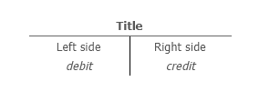

| Title      |        |
| ---------- | ------ |
| Left side  | Right side   |
| Debit| Credit |


The amounts shown in the Cash column of Exhibit 1 would be recorded in a cash account as follows:
[Los montos mostrados en la columna de Efectivo de la Figura 1 se registrarían en una cuenta de efectivo de la siguiente manera:]

> **Note [Nota]:** Amounts entered on the left side of an account are **debits**, and amounts entered on the right side of an account are **credits**.
> [Los montos ingresados en el lado izquierdo de una cuenta son **débitos**, y los montos ingresados en el lado derecho de una cuenta son **créditos**.]

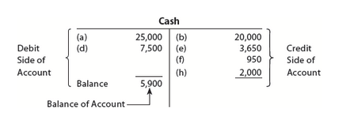

<table style="border-collapse: collapse;" >
<tr>
    <th style="border:none;"></th>
    <th colspan="6"  style="text-align:center; font-size:24px;">Cash[Efectivo]</th>
</tr>
<tr>
    <th rowspan="5"  style="text-align:center; font-size:16px; border-bottom: none;">Debit Side of Account</th>
    <td rowspan="5"
        style="
            font-size:180px;
            font-weight:100;
            line-height:0.7;
            vertical-align:top;
            text-align:center;
            padding:0;
            border:none;
        ">
        {
    </td>
    <th style="text-align:center; border-right: 2px solid white; border: none;">(a)
    </th>
    <th style="text-align:center; border-right: 2px solid white; border-bottom: none;"> 25,000</th>
    <th style="text-align:center; border-bottom: none;">(b)</th>
    <th style="text-align:center; border-bottom: none;">20,000</th>
    <td rowspan="5"
        style="
            font-size:180px;
            font-weight:100;
            line-height:0.7;
            vertical-align:top;
            text-align:center;
            padding:0;
            border:none;
        ">
        }
    </td>
    <th rowspan="5"  style="text-align:center; font-size:16px; border-bottom: none;">Credit Side of Account</th>
</tr>
<tr>
    <th style="text-align:center; border-right: 2px solid white; border: none;">(d)   </th>
    <th style="text-align:center; border-right: 2px solid white; border-bottom: none;"> 7,500</th>
    <th style="text-align:center; border: none;">
        (e)
    </th>
    <th style="text-align:center; border-bottom: none;">
        3,650
    </th>
</tr>
<tr>
    <th style="text-align:center; border-right: 2px solid white; border: none;">
    </th>
    <th style="text-align:center; border-right: 2px solid white; border-bottom: none;">
    </th>
    <th style="text-align:center; border: none;">
        (f)
    </th>
    <th style="text-align:center; border-bottom: none;">
        950
    </th>
</tr>
<tr>
    <th style="text-align:center; border-bottom: none">
    </th>
    <th style="text-align:center; border-right: 2px solid white; border-bottom: 2px solid white;">
    </th>
    <th style="text-align:center; border-bottom: none;">
             (h)     
    </th>
    <th style="text-align:center; border-bottom: 2px solid white;">
        2,000
    </th>
</tr>
<tr>
    <th style="text-align:center; border-right: 2px solid white; border: none;">Balance   </th>
    <th style="text-align:center; border-right: 2px solid white; border-bottom: none;"> 5,900</th>
    <th style="text-align:center; border: none;">
    </th>
    <th style="text-align:center; border-bottom: none;">
    </th>
</tr>
<tr>
    <th colspan="2"  style="text-align:center; border-right: 2px solid white; border: none; font-size:18px;">
        Balance of Account
    </th>
    <th style="font-size:40px; letter-spacing:10px; border:none;">
        ⤴
    </th>
</tr>

</table>

## Cash


| Debit Side of Account  | Credit Side of Account |
|----------------------|------------------------|
|(a) 25,000            |        (b) 20,000      |
|(d) 7,500             |        (e) 3,650       |
|                      |        (f) 950         |
|                      |        (h) 2,000       |
 **Balance** **5,900** |                        |  insertame estos datos

---

## Rules for Recording Transactions [Reglas para Registrar Transacciones]

Recording transactions in accounts must follow certain rules. For example, **increases in assets are recorded on the debit** (Amount entered on the left side of an account.) (left side) of an account. Likewise, **decreases in assets are recorded on the credit** (Amount entered on the right side of an account.) (right side) of an account. The excess of the debits of an asset account over its credits is the **balance of the account** (The amount of the difference between the debits and the credits that have been entered into an account.)
[El registro de transacciones en cuentas debe seguir ciertas reglas. Por ejemplo, **los aumentos en activos se registran en el débito** (Monto ingresado en el lado izquierdo de una cuenta.) (lado izquierdo) de una cuenta. Del mismo modo, **las disminuciones en activos se registran en el crédito** (Monto ingresado en el lado derecho de una cuenta.) (lado derecho) de una cuenta. El exceso de los débitos de una cuenta de activo sobre sus créditos es el **saldo de la cuenta** (El monto de la diferencia entre los débitos y los créditos que se han ingresado en una cuenta).]

To illustrate, the receipt (increase in Cash) of $25,000 in transaction (a) is entered on the debit (left) side of the cash account. The letter or date of the transaction is also entered into the account. That way, if any questions later arise related to the entry, the entry can be traced back to the underlying transaction data. In contrast, the payment (decrease in Cash) of $20,000 to purchase land in transaction (b) is entered on the credit (right) side of the account.
[Para ilustrar, la recepción (aumento en Efectivo) de $25,000 en la transacción (a) se ingresa en el lado de débito (izquierdo) de la cuenta de efectivo. La letra o fecha de la transacción también se ingresa en la cuenta. De esa manera, si surgen preguntas más adelante relacionadas con el asiento, el asiento puede rastrearse hasta los datos de la transacción subyacente. En contraste, el pago (disminución en Efectivo) de $20,000 para comprar terreno en la transacción (b) se ingresa en el lado de crédito (derecho) de la cuenta.]

---

### Cash Account Balance Calculation [Cálculo del Saldo de la Cuenta de Efectivo]

The balance of the cash account of $5,900 is the excess of the debits over the credits, computed as follows:
[El saldo de la cuenta de efectivo de $5,900 es el exceso de los débitos sobre los créditos, calculado de la siguiente manera:]

$$
\text{Debits} = \$25,000 + \$7,500 = \$32,500
$$

$$
\text{Débitos} = \$25,000 + \$7,500 = \$32,500
$$

$$
\text{Credits} = \$20,000 + \$3,650 + \$950 + \$2,000 = \$26,600
$$

$$
\text{Créditos} = \$20,000 + \$3,650 + \$950 + \$2,000 = \$26,600
$$

$$
\text{Balance of Cash as of November 30, 20Y3} = \$32,500 - \$26,600 = \$5,900
$$

$$
\text{Saldo de Efectivo al 30 de noviembre de 20Y3} = \$32,500 - \$26,600 = \$5,900
$$

The balance of the cash account is inserted in the account, in the Debit column. In this way, the balance is identified as a **debit balance**. This balance represents NetSolutions' cash on hand as of November 30, 20Y3. This balance of $5,900 is reported on the November 30, 20Y3, balance sheet for NetSolutions as shown in Exhibit 8 of Chapter 1.
[El saldo de la cuenta de efectivo se inserta en la cuenta, en la columna de Débito. De esta manera, el saldo se identifica como un **saldo deudor**. Este saldo representa el efectivo disponible de NetSolutions al 30 de noviembre de 20Y3. Este saldo de $5,900 se reporta en el balance general del 30 de noviembre de 20Y3 para NetSolutions como se muestra en la Figura 8 del Capítulo 1.]

---

## Link to Apple [Enlace a Apple]

On a recent balance sheet, Apple Inc. reported **$48.8 billion of cash**.
[En un balance general reciente, Apple Inc. reportó **$48.8 mil millones de efectivo**].

---

## T Accounts vs. Formal Accounts [Cuentas T vs. Cuentas Formales]

In an actual accounting system, a more formal account form replaces the T account. Later in this chapter, a four-column account is illustrated. The T account, however, is a simple way to illustrate the effects of transactions on accounts and financial statements. For this reason, T accounts are often used in business to explain transactions.
[En un sistema contable real, una forma de cuenta más formal reemplaza a la cuenta T. Más adelante en este capítulo, se ilustra una cuenta de cuatro columnas. Sin embargo, la cuenta T es una forma sencilla de ilustrar los efectos de las transacciones en las cuentas y los estados financieros. Por esta razón, las cuentas T se utilizan a menudo en los negocios para explicar transacciones.]

Each of the columns in Exhibit 1 can be converted into an account form in a similar manner as was done for the Cash column of Exhibit 1. However, as mentioned earlier, recording increases and decreases in accounts must follow certain rules. These rules are discussed after the chart of accounts is described.
[Cada una de las columnas de la Figura 1 puede convertirse en una forma de cuenta de manera similar a como se hizo para la columna de Efectivo de la Figura 1. Sin embargo, como se mencionó anteriormente, registrar aumentos y disminuciones en cuentas debe seguir ciertas reglas. Estas reglas se discuten después de que se describe el catálogo de cuentas.]

---

## Key Terms [Términos Clave]

| English [Inglés] | Español [Español] |
|------------------|-------------------|
| Account | Cuenta |
| T account | Cuenta T |
| Debit | Débito |
| Credit | Crédito |
| Balance of the account | Saldo de la cuenta |
| Debit balance | Saldo deudor |
| Credit balance | Saldo acreedor |
| Chart of accounts | Catálogo de cuentas |

---

## Key Rules Summary [Resumen de Reglas Clave]

| Element [Elemento] | Increase [Aumento] | Decrease [Disminución] |
|--------------------|--------------------|------------------------|
| Assets [Activos] | Debit [Débito] | Credit [Crédito] |
| Liabilities [Pasivos] | Credit [Crédito] | Debit [Débito] |
| Stockholders' Equity [Patrimonio] | Credit [Crédito] | Debit [Débito] |

---

## Cash Account T Account Example [Ejemplo de Cuenta T de Efectivo]

```
                    Cash [Efectivo]
        Debit (Débito)      |  Credit (Crédito)
        (a)  25,000         |     (b)  20,000
        (d)   7,500         |     (e)   3,650
                            |     (f)     950
                            |     (h)   2,000
        -----------------------------------------
        Total  32,500       |    Total  26,600
        Balance  5,900      |
```

---

## Summary [Resumen]

- An **account** is a record used to track increases and decreases in each element of the accounting equation.
- A **T account** is a simplified version with a debit (left) side and a credit (right) side.
- **Debits** are entered on the left side; **credits** are entered on the right side.
- The **balance** of an account is the difference between total debits and total credits.
- Assets normally have a **debit balance** (debits > credits).
- The T account format is useful for visualizing transactions but is replaced by more formal accounts in actual accounting systems.

---

<h1 id="036422" style="color:#E65100;">
  <a href="#Chapter_002" style="color:inherit; text-decoration:none;">
    2-1a Chart of Accounts [Catálogo de Cuentas]
  </a>
</h1>


A group of accounts for a business entity is called a **ledger** (A group of accounts for a business.). A list of the accounts in the ledger is called a **chart of accounts** (A list of the accounts in the ledger). The accounts are normally listed in the order in which they appear in the financial statements. The balance sheet accounts are listed first, in the order of assets, liabilities, and stockholders' equity. The income statement accounts are then listed in the order of revenues and expenses.
[Un grupo de cuentas para una entidad comercial se llama **libro mayor** (Un grupo de cuentas para un negocio). Una lista de las cuentas en el libro mayor se llama **catálogo de cuentas** (Una lista de las cuentas en el libro mayor). Las cuentas normalmente se enumeran en el orden en que aparecen en los estados financieros. Las cuentas del balance general se enumeran primero, en el orden de activos, pasivos y patrimonio de los accionistas. Luego se enumeran las cuentas del estado de resultados en el orden de ingresos y gastos.]

---

## Assets [Activos]

Assets are resources owned by the business entity. These resources can be physical items, such as cash and supplies, or intangibles that have value. Examples of intangible assets include patent rights, copyrights, and trademarks. Assets also include accounts receivable, prepaid expenses (such as insurance), buildings, equipment, and land.
[Los activos son recursos propiedad de la entidad comercial. Estos recursos pueden ser elementos físicos, como efectivo y suministros, o intangibles que tienen valor. Ejemplos de activos intangibles incluyen derechos de patente, derechos de autor y marcas registradas. Los activos también incluyen cuentas por cobrar, gastos pagados por adelantado (como seguros), edificios, equipo y terreno.]

---

## Liabilities [Pasivos]

Liabilities are debts owed to outsiders (creditors). Liabilities are often identified on the balance sheet by titles that include payable. Examples of liabilities include accounts payable, notes payable, and wages payable. Cash received before services are delivered creates a liability to perform the services. These future service commitments are called unearned revenues. Examples of unearned revenues include magazine subscriptions received by a publisher and tuition received at the beginning of a term by a college.
[Los pasivos son deudas con terceros (acreedores). Los pasivos a menudo se identifican en el balance general por títulos que incluyen "por pagar". Ejemplos de pasivos incluyen cuentas por pagar, documentos por pagar y salarios por pagar. El efectivo recibido antes de que se entreguen los servicios crea una obligación de realizar los servicios. Estos compromisos de servicio futuro se llaman ingresos no devengados. Ejemplos de ingresos no devengados incluyen suscripciones de revistas recibidas por un editor y matrícula recibida al comienzo de un período por una universidad.]

---

## Stockholders' Equity [Patrimonio de los Accionistas]

Stockholders' equity is the stockholders' right to the assets of the business. Stockholders' equity is represented by the balance of the common stock and retained earnings accounts. A dividends account represents distributions of earnings to stockholders.
[El patrimonio de los accionistas es el derecho de los accionistas a los activos del negocio. El patrimonio de los accionistas está representado por el saldo de las cuentas de acciones comunes y ganancias retenidas. Una cuenta de dividendos representa las distribuciones de ganancias a los accionistas.]

---

## Revenues [Ingresos]

Revenues are increases in assets and stockholders' equity as a result of selling services or products to customers. Examples of revenues include fees earned, fares earned, commissions revenue, and rent revenue.
[Los ingresos son aumentos en los activos y el patrimonio de los accionistas como resultado de vender servicios o productos a los clientes. Ejemplos de ingresos incluyen honorarios ganados, tarifas ganadas, ingresos por comisiones e ingresos por alquiler.]

---

## Expenses [Gastos]

Expenses result from using up assets or consuming services in the process of generating revenues. Examples of expenses include wages expense, rent expense, utilities expense, supplies expense, and miscellaneous expense.
[Los gastos resultan del uso de activos o del consumo de servicios en el proceso de generar ingresos. Ejemplos de gastos incluyen gastos de salarios, gastos de alquiler, gastos de servicios públicos, gastos de suministros y gastos varios.]

---

## Illustration of Chart of Accounts [Ilustración del Catálogo de Cuentas]

A chart of accounts should meet the needs of a company's managers and other users of its financial statements. The accounts within the chart of accounts are numbered for use as references. A numbering system is normally used, so that new accounts can be added without affecting other account numbers.
[Un catálogo de cuentas debe satisfacer las necesidades de los gerentes de una empresa y otros usuarios de sus estados financieros. Las cuentas dentro del catálogo de cuentas están numeradas para su uso como referencias. Normalmente se utiliza un sistema de numeración, para que se puedan agregar nuevas cuentas sin afectar otros números de cuenta.]

**Exhibit 2** is NetSolutions' chart of accounts that is used in this chapter. Additional accounts will be introduced in later chapters. In Exhibit 2, each account number has two digits. The first digit indicates the major account group of the ledger in which the account is located. Accounts beginning with 1 represent assets; 2, liabilities; 3, stockholders' equity; 4, revenue; and 5, expenses. The second digit indicates the location of the account within its group.
[La **Figura 2** es el catálogo de cuentas de NetSolutions que se utiliza en este capítulo. Se introducirán cuentas adicionales en capítulos posteriores. En la Figura 2, cada número de cuenta tiene dos dígitos. El primer dígito indica el grupo de cuentas principal del libro mayor en el que se encuentra la cuenta. Las cuentas que comienzan con 1 representan activos; 2, pasivos; 3, patrimonio de los accionistas; 4, ingresos; y 5, gastos. El segundo dígito indica la ubicación de la cuenta dentro de su grupo.]

---

## Exhibit 2 [Figura 2]

### Chart of Accounts for NetSolutions [Catálogo de Cuentas para NetSolutions]

| Account Number [Número de Cuenta] | Account Name [Nombre de la Cuenta] | Account Group [Grupo de Cuenta] |
|-----------------------------------|-------------------------------------|--------------------------------|
| | **1. Assets [Activos]** | |
| 11 | Cash [Efectivo] | Asset |
| 12 | Accounts Receivable [Cuentas por Cobrar] | Asset |
| 14 | Supplies [Suministros] | Asset |
| 15 | Prepaid Insurance [Seguro Pagado por Adelantado] | Asset |
| 17 | Land [Terreno] | Asset |
| 18 | Office Equipment [Equipo de Oficina] | Asset |
| | | |
| | **2. Liabilities [Pasivos]** | |
| 21 | Accounts Payable [Cuentas por Pagar] | Liability |
| 23 | Unearned Rent [Alquiler No Devengado] | Liability |
| | | |
| | **3. Stockholders' Equity [Patrimonio de los Accionistas]** | |
| 31 | Common Stock [Acciones Comunes] | Equity |
| 32 | Retained Earnings [Ganancias Retenidas] | Equity |
| 33 | Dividends [Dividendos] | Equity |
| | | |
| | **4. Revenue [Ingresos]** | |
| 41 | Fees Earned [Honorarios Ganados] | Revenue |
| | | |
| | **5. Expenses [Gastos]** | |
| 51 | Wages Expense [Gastos de Salarios] | Expense |
| 52 | Supplies Expense [Gasto de Suministros] | Expense |
| 53 | Rent Expense [Gasto de Alquiler] | Expense |
| 54 | Utilities Expense [Gasto de Servicios Públicos] | Expense |
| 59 | Miscellaneous Expense [Gastos Varios] | Expense |

---

## Summary of Account Numbering System [Resumen del Sistema de Numeración de Cuentas]

| First Digit [Primer Dígito] | Account Group [Grupo de Cuenta] |
|-----------------------------|--------------------------------|
| 1 | Assets [Activos] |
| 2 | Liabilities [Pasivos] |
| 3 | Stockholders' Equity [Patrimonio de los Accionistas] |
| 4 | Revenue [Ingresos] |
| 5 | Expenses [Gastos] |

---

## Accounts Added for December Transactions [Cuentas Agregadas para las Transacciones de Diciembre]

Each of the columns in Exhibit 1 has been assigned an account number in the chart of accounts shown in Exhibit 2. In addition, the following accounts have been added:
[Cada una de las columnas de la Figura 1 ha sido asignada a un número de cuenta en el catálogo de cuentas mostrado en la Figura 2. Además, se han agregado las siguientes cuentas:]

- Accounts Receivable [Cuentas por Cobrar]
- Prepaid Insurance [Seguro Pagado por Adelantado]
- Office Equipment [Equipo de Oficina]
- Unearned Rent [Alquiler No Devengado]
- Retained Earnings [Ganancias Retenidas]

These accounts will be used in recording NetSolutions' December transactions.
[Estas cuentas se utilizarán para registrar las transacciones de diciembre de NetSolutions.]

---

## Key Terms [Términos Clave]

| English [Inglés] | Español [Español] |
|------------------|-------------------|
| Ledger | Libro mayor |
| Chart of accounts | Catálogo de cuentas |
| Unearned revenues | Ingresos no devengados |
| Dividends account | Cuenta de dividendos |

---

## Key Rules Summary [Resumen de Reglas Clave]

| Account Group [Grupo de Cuenta] | Increase [Aumento] | Decrease [Disminución] | Normal Balance [Saldo Normal] |
|--------------------------------|--------------------|------------------------|-------------------------------|
| Assets [Activos] | Debit [Débito] | Credit [Crédito] | Debit [Débito] |
| Liabilities [Pasivos] | Credit [Crédito] | Debit [Débito] | Credit [Crédito] |
| Stockholders' Equity [Patrimonio] | Credit [Crédito] | Debit [Débito] | Credit [Crédito] |
| Revenue [Ingresos] | Credit [Crédito] | Debit [Débito] | Credit [Crédito] |
| Expenses [Gastos] | Debit [Débito] | Credit [Crédito] | Debit [Débito] |
| Dividends [Dividendos] | Debit [Débito] | Credit [Crédito] | Debit [Débito] |

---

<h1 id="634405" style="color:#E65100;">
  <a href="#Chapter_002" style="color:inherit; text-decoration:none;">
    2-2 Double-Entry Accounting System [Sistema de Contabilidad de Partida Doble]
  </a>
</h1>


All businesses use what is called the **double-entry accounting system** (A system of accounting for recording transactions, based on recording increases and decreases in accounts so that debits equal credits.)
[Todos los negocios utilizan lo que se llama **sistema de contabilidad de partida doble** (Un sistema de contabilidad para registrar transacciones, basado en registrar aumentos y disminuciones en cuentas de modo que los débitos sean iguales a los créditos).]

This system is based on the accounting equation and requires:
[Este sistema se basa en la ecuación contable y requiere:]

- Every business transaction to be recorded in **at least two accounts**.
  [Que cada transacción comercial se registre en **al menos dos cuentas**.]
- The total debits recorded for each transaction to be **equal to** the total credits recorded.
  [Que el total de débitos registrados para cada transacción sea **igual al** total de créditos registrados.]

The double-entry accounting system also has specific **rules of debit and credit** (In the double-entry accounting system, specific rules for recording debits and credits based on the type of account.) for recording transactions in the accounts.
[El sistema de contabilidad de partida doble también tiene **reglas específicas de débito y crédito** (En el sistema de contabilidad de partida doble, reglas específicas para registrar débitos y créditos según el tipo de cuenta) para registrar transacciones en las cuentas.]

---

## Link to Apple [Enlace a Apple]

Apple records transactions using generally accepted accounting principles and double-entry accounting.
[Apple registra transacciones utilizando los principios de contabilidad generalmente aceptados y la contabilidad de partida doble.]

---

## Key Concepts [Conceptos Clave]

| English [Inglés] | Español [Español] |
|------------------|-------------------|
| Double-entry accounting system | Sistema de contabilidad de partida doble |
| Rules of debit and credit | Reglas de débito y crédito |
| Accounting equation | Ecuación contable |

---

## Summary [Resumen]

The **double-entry accounting system** is based on two fundamental principles:
[El **sistema de contabilidad de partida doble** se basa en dos principios fundamentales:]

1. **Every transaction affects at least two accounts** [Cada transacción afecta al menos dos cuentas]
2. **Total debits must equal total credits for each transaction** [Los débitos totales deben ser iguales a los créditos totales para cada transacción]

---

## Rules of Debit and Credit [Reglas de Débito y Crédito]

| Account Type [Tipo de Cuenta] | Increase [Aumento] | Decrease [Disminución] | Normal Balance [Saldo Normal] |
|-------------------------------|--------------------|------------------------|-------------------------------|
| Assets [Activos] | Debit [Débito] | Credit [Crédito] | Debit [Débito] |
| Liabilities [Pasivos] | Credit [Crédito] | Debit [Débito] | Credit [Crédito] |
| Stockholders' Equity [Patrimonio] | Credit [Crédito] | Debit [Débito] | Credit [Crédito] |
| Revenue [Ingresos] | Credit [Crédito] | Debit [Débito] | Credit [Crédito] |
| Expenses [Gastos] | Debit [Débito] | Credit [Crédito] | Debit [Débito] |
| Dividends [Dividendos] | Debit [Débito] | Credit [Crédito] | Debit [Débito] |

---

## The Accounting Equation [La Ecuación Contable]

The double-entry system is based on the accounting equation:
[El sistema de partida doble se basa en la ecuación contable:]

$$
\text{Assets} = \text{Liabilities} + \text{Stockholders' Equity}
$$

$$
\text{Activos} = \text{Pasivos} + \text{Patrimonio de los Accionistas}
$$

This equation must always remain in balance after each transaction.
[Esta ecuación siempre debe permanecer equilibrada después de cada transacción.]

---

## Journal Entry Example [Ejemplo de Asiento de Diario]

To illustrate, the receipt of cash from a client for services would be recorded as:
[Para ilustrar, la recepción de efectivo de un cliente por servicios se registraría como:]

| Account [Cuenta] | Debit [Débito] | Credit [Crédito] |
|-----------------|----------------|------------------|
| Cash [Efectivo] | XXX | |
| Fees Earned [Honorarios Ganados] | | XXX |

In this entry, total debits equal total credits.
[En este asiento, los débitos totales son iguales a los créditos totales.]

---

<h1 id="237274" style="color:#E65100;">
  <a href="#Chapter_002" style="color:inherit; text-decoration:none;">
    2-2a Balance Sheet Accounts [Cuentas del Balance General]

  </a>
</h1>


The debit and credit rules for balance sheet accounts are as follows:
[Las reglas de débito y crédito para las cuentas del balance general son las siguientes:]

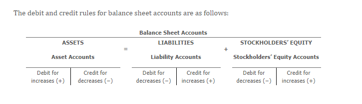</img>

<table style="border-collapse: collapse;" >
<tr>
    <th colspan="8"  style="text-align:center; font-size:24px;">Balance Sheet Accounts [Cuentas del Balance General]</th>
</tr>
<tr>
    <th colspan="2"  style="text-align:center;">Assets [Activos]</th>
    <th rowspan="2" style="border: none;"><span style="font-size:22px; font-weight:bold;">=</span></th>
    <th colspan="2"  style="text-align:center;">Liabilities [Pasivos]</th>
    <th rowspan="2" style="border: none;"><span style="font-size:22px; font-weight:bold;">+</span></th>
    <th colspan="2"  style="text-align:center;">Stockholders' Equity [Patrimonio de los Accionistas]</th>
</tr>
<tr>
    <th colspan="2"  style="text-align:center;">Assets Accounts[Cuenta de Activos] </th>
    <th colspan="2"  style="text-align:center;">Liabilities Accounts[Cuenta de Pasivos]</th>
    <th colspan="2"  style="text-align:center;">Stockholders' Equity Accounts[Cuenta de Patrimonio de los Accionistas]</th>
</tr>
<tr>
    <th style="text-align:center; border-right: 2px solid white; border-bottom: none;">Debit [Débito]</th>
    <th style="text-align:center; border-bottom: none;">Credit [Crédito]</th>
    <th style="border: none;"></th>
    <th style="text-align:center; border-right: 2px solid white; border-bottom: none;">Debit [Débito]</th>
    <th style="text-align:center; border-bottom: none;">Credit [Crédito]</th>
    <th style="border: none;"></th>
    <th style="text-align:center; border-right: 2px solid white; border-bottom: none;">Debit [Débito]</th>
    <th style="text-align:center; border-bottom: none;">Credit [Crédito]</th>
</tr>
<tr>
    <th style="text-align:center; border-right: 2px solid white; border-bottom: none;">
        <span style="font-size:22px; font-weight:bold;">↑</span> Increase [Aumento]
    </th>
    <th style="text-align:center; border-bottom: none;">
        <span style="font-size:22px; font-weight:bold;">↓</span> Decrease [Disminución]
    </th>
    <th style="border: none;"></th>
    <th style="text-align:center; border-right: 2px solid white; border-bottom: none;">
        <span style="font-size:22px; font-weight:bold;">↓</span> Decrease [Disminución]</th>
    <th style="text-align:center; border-bottom: none;">
        <span style="font-size:22px; font-weight:bold;">↑</span> Increase [Aumento]
    </th>
    <th style="border: none;"></th>
    <th style="text-align:center; border-right: 2px solid white; border-bottom: none;">
        <span style="font-size:22px; font-weight:bold;">↓</span> Decrease [Disminución]</th>
    <th style="text-align:center; border-bottom: none;">
        <span style="font-size:22px; font-weight:bold;">↑</span> Increase [Aumento]
    </th>
</tr>
</table>


---

## Assets [Activos]

| Rule [Regla] | Debit [Débito] | Credit [Crédito] |
|--------------|----------------|------------------|
| Increase [Aumento] | ✓ | |
| Decrease [Disminución] | | ✓ |
| Normal Balance [Saldo Normal] | ✓ | |

**Assets normally have a debit balance.**
[Los activos normalmente tienen un saldo deudor.]

---

## Liabilities [Pasivos]

| Rule [Regla] | Debit [Débito] | Credit [Crédito] |
|--------------|----------------|------------------|
| Increase [Aumento] | | ✓ |
| Decrease [Disminución] | ✓ | |
| Normal Balance [Saldo Normal] | | ✓ |

**Liabilities normally have a credit balance.**
[Los pasivos normalmente tienen un saldo acreedor.]

---

## Stockholders' Equity [Patrimonio de los Accionistas]

| Rule [Regla] | Debit [Débito] | Credit [Crédito] |
|--------------|----------------|------------------|
| Increase [Aumento] | | ✓ |
| Decrease [Disminución] | ✓ | |
| Normal Balance [Saldo Normal] | | ✓ |

**Stockholders' equity normally has a credit balance.**
[El patrimonio de los accionistas normalmente tiene un saldo acreedor.]

---

## Summary Table [Tabla Resumen]

| Account Type [Tipo de Cuenta] | Increase [Aumento] | Decrease [Disminución] | Normal Balance [Saldo Normal] |
|-------------------------------|--------------------|------------------------|-------------------------------|
| Assets [Activos] | Debit [Débito] | Credit [Crédito] | Debit [Débito] |
| Liabilities [Pasivos] | Credit [Crédito] | Debit [Débito] | Credit [Crédito] |
| Stockholders' Equity [Patrimonio] | Credit [Crédito] | Debit [Débito] | Credit [Crédito] |

---

## Key Examples [Ejemplos Clave]

### Asset Account [Cuenta de Activo] - Cash [Efectivo]

| | Debit [Débito] | Credit [Crédito] |
|--|----------------|------------------|
| Increase (receipt of cash) [Aumento (recepción de efectivo)] | ✓ | |
| Decrease (payment of cash) [Disminución (pago de efectivo)] | | ✓ |
| Normal balance [Saldo normal] | ✓ | |

### Liability Account [Cuenta de Pasivo] - Accounts Payable [Cuentas por Pagar]

| | Debit [Débito] | Credit [Crédito] |
|--|----------------|------------------|
| Increase (purchase on account) [Aumento (compra a crédito)] | | ✓ |
| Decrease (payment on account) [Disminución (pago a cuenta)] | ✓ | |
| Normal balance [Saldo normal] | | ✓ |

### Stockholders' Equity Account [Cuenta de Patrimonio] - Common Stock [Acciones Comunes]

| | Debit [Débito] | Credit [Crédito] |
|--|----------------|------------------|
| Increase (issuing stock) [Aumento (emisión de acciones)] | | ✓ |
| Decrease (treasury stock) [Disminución (acciones propias)] | ✓ | |
| Normal balance [Saldo normal] | | ✓ |

---

## Visual Representation [Representación Visual]

### Assets [Activos]
```
                   Asset Account [Cuenta de Activo]
        Debit (Débito)                      Credit (Crédito)
    (Normal Balance)
         Increase                                  Decrease
```

### Liabilities [Pasivos]
```
                   Liability Account [Cuenta de Pasivo]
        Debit (Débito)                      Credit (Crédito)
                                           (Normal Balance)
         Decrease                                 Increase
```

### Stockholders' Equity [Patrimonio]
```
              Stockholders' Equity Account [Cuenta de Patrimonio]
        Debit (Débito)                      Credit (Crédito)
                                           (Normal Balance)
         Decrease                                 Increase
```

---

## Key Principles [Principios Clave]

1. **Assets** are increased with debits and decreased with credits.
   [Los **activos** aumentan con débitos y disminuyen con créditos.]

2. **Liabilities** are increased with credits and decreased with debits.
   [Los **pasivos** aumentan con créditos y disminuyen con débitos.]

3. **Stockholders' Equity** is increased with credits and decreased with debits.
   [El **patrimonio de los accionistas** aumenta con créditos y disminuye con débitos.]

---

## Why These Rules? [¿Por qué estas reglas?]

These rules ensure that the accounting equation remains in balance:
[Estas reglas aseguran que la ecuación contable se mantenga en equilibrio:]

$$
\text{Assets} = \text{Liabilities} + \text{Stockholders' Equity}
$$

$$
\text{Activos} = \text{Pasivos} + \text{Patrimonio de los Accionistas}
$$

If assets increase with a debit, then liabilities and equity must increase with credits to maintain equality.
[Si los activos aumentan con un débito, entonces los pasivos y el patrimonio deben aumentar con créditos para mantener la igualdad.]

---

<h1 id="628626" style="color:#E65100;">
  <a href="#Chapter_002" style="color:inherit; text-decoration:none;">
    2-2b Income Statement Accounts [Cuentas del Estado de Resultados]

  </a>
</h1>


The debit and credit rules for income statement accounts are based on their relationship with stockholders' equity. As shown for balance sheet accounts, stockholders' equity accounts are increased by credits. Because revenues increase stockholders' equity, revenue accounts are increased by credits and decreased by debits. Because stockholders' equity accounts are decreased by debits, expense accounts are increased by debits and decreased by credits. Thus, the rules of debit and credit for revenue and expense accounts are as follows:
[Las reglas de débito y crédito para las cuentas del estado de resultados se basan en su relación con el patrimonio de los accionistas. Como se muestra para las cuentas del balance general, las cuentas de patrimonio de los accionistas aumentan con créditos. Debido a que los ingresos aumentan el patrimonio de los accionistas, las cuentas de ingresos aumentan con créditos y disminuyen con débitos. Debido a que las cuentas de patrimonio de los accionistas disminuyen con débitos, las cuentas de gastos aumentan con débitos y disminuyen con créditos. Por lo tanto, las reglas de débito y crédito para las cuentas de ingresos y gastos son las siguientes:]

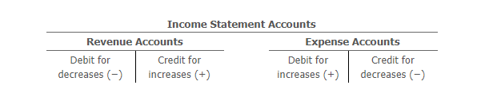</img>

---
<table style="border-collapse: collapse;" >
<tr>
    <th colspan="5"  style="text-align:center; font-size:24px;">Income Statement Accounts [Cuentas del Estado de Resultados]</th>
</tr>
<tr>
    <th colspan="2"  style="text-align:center;">Revenue Accounts [Cuentas de Ingresos]</th>
    <th style="border: none;"></th>
    <th colspan="2"  style="text-align:center;">Expense Accounts [Cuentas de Gastos]</th>
</tr>
<tr>
    <th style="text-align:center; border-right: 2px solid white; border-bottom: none;">Debit [Débito]</th>
    <th style="text-align:center; border-bottom: none;">Credit [Crédito]</th>
    <th style="border: none;"></th>
    <th style="text-align:center; border-right: 2px solid white; border-bottom: none;">Debit [Débito]</th>
    <th style="text-align:center; border-bottom: none;">Credit [Crédito]</th>
</tr>
<tr>
    <th style="text-align:center; border-right: 2px solid white; border-bottom: none;">
        <span style="font-size:22px; font-weight:bold;">↓</span> Decrease [Disminución]</th>
    <th style="text-align:center; border-bottom: none;">
        <span style="font-size:22px; font-weight:bold;">↑</span> Increase [Aumento]
    </th>
    <th style="border: none;"></th>
    <th style="text-align:center; border-right: 2px solid white; border-bottom: none;">
        <span style="font-size:22px; font-weight:bold;">↑</span> Increase [Aumento]
    </th>
    <th style="text-align:center; border-bottom: none;">
        <span style="font-size:22px; font-weight:bold;">↓</span> Decrease [Disminución]
    </th>
</tr>
</table>

## Income Statement Accounts [Cuentas del Estado de Resultados]

| | Revenue Accounts [Cuentas de Ingresos] | Expense Accounts [Cuentas de Gastos] |
|--|----------------------------------------|--------------------------------------|
| **Increase [Aumento]** | Credit [Crédito] (+) | Debit [Débito] (+) |
| **Decrease [Disminución]** | Debit [Débito] (–) | Credit [Crédito] (–) |
| **Normal Balance [Saldo Normal]** | Credit [Crédito] | Debit [Débito] |

---

## Summary of Debit and Credit Rules [Resumen de Reglas de Débito y Crédito]

| Account Type [Tipo de Cuenta] | Increase [Aumento] | Decrease [Disminución] | Normal Balance [Saldo Normal] |
|-------------------------------|--------------------|------------------------|-------------------------------|
| Revenue [Ingresos] | Credit [Crédito] | Debit [Débito] | Credit [Crédito] |
| Expenses [Gastos] | Debit [Débito] | Credit [Crédito] | Debit [Débito] |

---

## Why These Rules? [¿Por qué estas reglas?]

Because revenues increase stockholders' equity, and stockholders' equity increases with credits, revenues increase with credits.
[Debido a que los ingresos aumentan el patrimonio de los accionistas, y el patrimonio de los accionistas aumenta con créditos, los ingresos aumentan con créditos.]

Because expenses decrease stockholders' equity, and stockholders' equity decreases with debits, expenses increase with debits.
[Debido a que los gastos disminuyen el patrimonio de los accionistas, y el patrimonio de los accionistas disminuye con débitos, los gastos aumentan con débitos.]

---

## Visual Representation [Representación Visual]

### Revenue Account [Cuenta de Ingresos]
```
                    Revenue Account [Cuenta de Ingresos]
        Debit (Débito)                      Credit (Crédito)
                                           (Normal Balance)
         Decrease                                 Increase
```

### Expense Account [Cuenta de Gastos]
```
                    Expense Account [Cuenta de Gastos]
        Debit (Débito)                      Credit (Crédito)
        (Normal Balance)
         Increase                                 Decrease
```

---

## Business Insight [Perspectiva Empresarial]

### The Hijacking Receivable [La Cuenta por Cobrar del Secuestro]

A company's chart of accounts should reflect the basic nature of its operations. Occasionally, however, transactions take place that give rise to unusual accounts. The following is a story of one such account.
[El catálogo de cuentas de una empresa debe reflejar la naturaleza básica de sus operaciones. Sin embargo, ocasionalmente ocurren transacciones que dan lugar a cuentas inusuales. La siguiente es la historia de una de esas cuentas.]

Before strict airport security was implemented across the United States, several airlines experienced hijacking incidents. One such incident occurred when a Southern Airways jet en route from Memphis to Miami was hijacked during a stopover in Birmingham, Alabama. The three hijackers boarded the plane in Birmingham armed with handguns and grenades. At gunpoint, the hijackers took the plane, the plane's crew, and the passengers to nine American cities, Toronto, and eventually to Havana, Cuba.
[Antes de que se implementara la seguridad estricta en los aeropuertos de los Estados Unidos, varias aerolíneas experimentaron incidentes de secuestro. Uno de esos incidentes ocurrió cuando un jet de Southern Airways en ruta de Memphis a Miami fue secuestrado durante una escala en Birmingham, Alabama. Los tres secuestradores abordaron el avión en Birmingham armados con pistolas y granadas. Bajo amenaza de armas, los secuestradores llevaron el avión, la tripulación y los pasajeros a nueve ciudades estadounidenses, Toronto y finalmente a La Habana, Cuba.]

During the long flight, the hijackers demanded a ransom of $10 million. Southern Airways, however, was only able to come up with $2 million. Eventually, the pilot talked the hijackers into settling for the $2 million when the plane landed in Chattanooga for refueling.
[Durante el largo vuelo, los secuestradores exigieron un rescate de $10 millones. Sin embargo, Southern Airways solo pudo reunir $2 millones. Finalmente, el piloto convenció a los secuestradores de conformarse con los $2 millones cuando el avión aterrizó en Chattanooga para repostar combustible.]

Upon landing in Havana, the Cuban authorities arrested the hijackers and, after a brief delay, sent the plane, passengers, and crew back to the United States. The hijackers and the $2 million stayed in Cuba.
[Al aterrizar en La Habana, las autoridades cubanas arrestaron a los secuestradores y, después de una breve demora, enviaron el avión, los pasajeros y la tripulación de regreso a los Estados Unidos. Los secuestradores y los $2 millones se quedaron en Cuba.]

How did Southern Airways account for and report the hijacking payment in its subsequent financial statements? As you might have analyzed, the initial entry credited Cash for $2 million. The debit was to an account entitled "Hijacking Payment." This account was reported as a type of receivable under "other assets" on Southern Airways' balance sheet. The company maintained that it would be able to collect the cash from the Cuban government and that, therefore, a receivable existed. In fact, Southern Airways was later repaid $2 million by the Cuban government.
[¿Cómo contabilizó y reportó Southern Airways el pago del secuestro en sus estados financieros posteriores? Como habrás analizado, el asiento inicial acreditó Efectivo por $2 millones. El débito fue a una cuenta titulada "Pago por Secuestro". Esta cuenta se reportó como un tipo de cuenta por cobrar bajo "otros activos" en el balance general de Southern Airways. La empresa mantuvo que podría cobrar el efectivo del gobierno cubano y que, por lo tanto, existía una cuenta por cobrar. De hecho, Southern Airways fue reembolsada más tarde por $2 millones por el gobierno cubano.]

---

## Accounting Entry for the Hijacking Payment [Asiento Contable para el Pago del Secuestro]

| Account [Cuenta] | Debit [Débito] | Credit [Crédito] |
|-----------------|----------------|------------------|
| Hijacking Receivable [Cuenta por Cobrar por Secuestro] | $2,000,000 | |
| Cash [Efectivo] | | $2,000,000 |

---

## Key Takeaways [Conclusiones Clave]

1. **Revenues** increase stockholders' equity and are recorded with **credits**.
   [Los **ingresos** aumentan el patrimonio de los accionistas y se registran con **créditos**.]

2. **Expenses** decrease stockholders' equity and are recorded with **debits**.
   [Los **gastos** disminuyen el patrimonio de los accionistas y se registran con **débitos**.]

3. Unusual transactions can create unique accounts not normally found in a chart of accounts.
   [Las transacciones inusuales pueden crear cuentas únicas que normalmente no se encuentran en un catálogo de cuentas.]

4. The double-entry system still applies: debits must equal credits.
   [El sistema de partida doble todavía se aplica: los débitos deben ser iguales a los créditos.]

---

## Complete Summary of Debit/Credit Rules [Resumen Completo de Reglas de Débito/Crédito]

| Account Type [Tipo de Cuenta] | Increase [Aumento] | Decrease [Disminución] | Normal Balance [Saldo Normal] |
|-------------------------------|--------------------|------------------------|-------------------------------|
| Assets [Activos] | Debit [Débito] | Credit [Crédito] | Debit [Débito] |
| Liabilities [Pasivos] | Credit [Crédito] | Debit [Débito] | Credit [Crédito] |
| Stockholders' Equity [Patrimonio] | Credit [Crédito] | Debit [Débito] | Credit [Crédito] |
| Revenue [Ingresos] | Credit [Crédito] | Debit [Débito] | Credit [Crédito] |
| Expenses [Gastos] | Debit [Débito] | Credit [Crédito] | Debit [Débito] |
| Dividends [Dividendos] | Debit [Débito] | Credit [Crédito] | Debit [Débito] |

---

<h1 id="948821" style="color:#E65100;">
  <a href="#Chapter_002" style="color:inherit; text-decoration:none;">
    2-2c Statement of Stockholders' Equity Accounts (Dividends)
  </a>
</h1>


The debit and credit rules for recording dividends are based on the effect of dividends on stockholders' equity (retained earnings). Since dividends decrease stockholders' equity (retained earnings), the dividends account is increased by debits. Likewise, the dividends account is decreased by credits. Thus, the rules of debit and credit for the dividends account are as follows:

[Las reglas de débito y crédito para registrar dividendos se basan en el efecto de los dividendos sobre el patrimonio de los accionistas (ganancias retenidas). Dado que los dividendos disminuyen el patrimonio de los accionistas (ganancias retenidas), la cuenta de dividendos aumenta con débitos. Asimismo, la cuenta de dividendos disminuye con créditos. Por lo tanto, las reglas de débito y crédito para la cuenta de dividendos son las siguientes:]

---

## Dividends Account [Cuenta de Dividendos]

| Debit for increases (+) | Credit for decreases (-) |
|-------------------------|--------------------------|
| Débito para aumentos (+) | Crédito para disminuciones (-) |

---

## Summary Table [Tabla Resumen]

| Account Type | Increase | Decrease | Normal Balance |
|--------------|----------|----------|----------------|
| Dividends | Debit (+) | Credit (-) | Debit |

---

## Visual Representation (T Account) [Representación Visual (Cuenta T)]

```
                Dividends Account
        Debit (Débito)      |    Credit (Crédito)
        (Normal Balance)    |
          Increase (+)      |      Decrease (-)
```

---

## Key Terms [Términos Clave]

| English | Español |
|---------|---------|
| Dividends | Dividendos |
| Stockholders' equity | Patrimonio de los accionistas |
| Retained earnings | Ganancias retenidas |
| Debit | Débito |
| Credit | Crédito |

---

## Key Insight [Perspectiva Clave]

- **Dividends decrease stockholders' equity** → recorded as a **debit** (increase in the dividends account)
- **Dividends are NOT an expense** → they appear on the **Statement of Stockholders' Equity**, not on the Income Statement
- The dividends account is closed directly to **Retained Earnings** at the end of the period

[**Los dividendos disminuyen el patrimonio de los accionistas** → se registran como un **débito** (aumento en la cuenta de dividendos)
**Los dividendos NO son un gasto** → aparecen en el **Estado de Cambios en el Patrimonio**, no en el Estado de Resultados
La cuenta de dividendos se cierra directamente contra **Ganancias Retenidas** al final del período]

---

<h1 id="424169" style="color:#E65100;">
  <a href="#Chapter_002" style="color:inherit; text-decoration:none;">
    2-2d Normal Balances
  </a>
</h1>


The sum of the increases in an account is usually equal to or greater than the sum of the decreases in the account. Thus, the **normal balance of an account** (The side of an account (debit or credit) in which the balance normally appears based on the type of account and whether it is increased by debits or credits.) is either a debit or credit depending on whether increases in the account are recorded as debits or credits. For example, because asset accounts are increased with debits, asset accounts normally have debit balances. Likewise, liability accounts normally have credit balances.

[La suma de los aumentos en una cuenta suele ser igual o mayor que la suma de las disminuciones en la cuenta. Por lo tanto, el **saldo normal de una cuenta** (El lado de una cuenta (débito o crédito) en el que el saldo aparece normalmente según el tipo de cuenta y si se aumenta con débitos o créditos) es débito o crédito dependiendo de si los aumentos en la cuenta se registran como débitos o créditos. Por ejemplo, debido a que las cuentas de activo aumentan con débitos, las cuentas de activo normalmente tienen saldos deudores. Del mismo modo, las cuentas de pasivo normalmente tienen saldos acreedores.]

The rules of debit and credit and the normal balances of the various types of accounts are summarized in **Exhibit 3**. Debits and credits are sometimes abbreviated as **Dr.** for debit and **Cr.** for credit.

[Las reglas de débito y crédito y los saldos normales de los diversos tipos de cuentas se resumen en la **Figura 3**. Los débitos y créditos a veces se abrevian como **Dr.** para débito y **Cr.** para crédito.]

---

## Exhibit 3 [Figura 3]

### Rules of Debit and Credit, Normal Balances of Accounts
[Reglas de Débito y Crédito, Saldos Normales de las Cuentas]

<!-- IMAGEN: Aquí debe ir la imagen del Exhibit 3 que muestra la tabla resumen -->
<!-- La imagen original tiene coordenadas [122, 500, 851, 828] -->
<!-- Puedes insertarla con:  -->

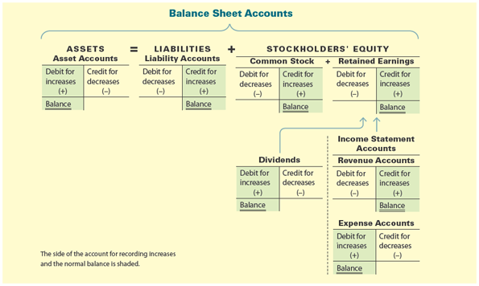

<!-- Fin de la imagen -->
<table style="border-collapse: collapse; width: 100%;">
  <thead>
    <tr>
      <th colspan="17" style="text-align:center; font-size:24px;">Balance Sheet Accounts</th>
    </tr>
  </thead>
  <tbody>
    <!-- Fila 1: Categorías principales -->
    <tr>
      <td colspan="2" style="text-align:center; font-size:24px;">Assets</td>
      <td colspan="1" style="text-align:center; font-size:24px;">=</td>
      <td colspan="2" style="text-align:center; font-size:24px;">Liabilities</td>
      <td colspan="1" style="text-align:center; font-size:24px;">+</td>
      <td colspan="11" style="text-align:center; font-size:24px;">StockHolders' Equity</td>
    </tr>
    <!-- Fila 2: Subcategorías -->
    <tr>
      <td colspan="2" style="text-align:center; font-size:14px;">Assets Accounts</td>
      <td></td>
      <td colspan="2" style="text-align:center; font-size:14px;">Liabilities Accounts</td>
      <td></td>
      <td colspan="2" style="text-align:center; font-size:14px;">Common Stock</td>
      <td colspan="1" style="text-align:center; font-size:24px;">+</td>
      <td colspan="8" style="text-align:center; font-size:14px;">Retained Earnings</td>
    </tr>
    <!-- Fila 3: Debit / Credit -->
    <tr>
      <td style="text-align:center;">Debit</td>
      <td style="text-align:center;">Credit</td>
      <td></td>
      <td style="text-align:center;">Debit</td>
      <td style="text-align:center;">Credit</td>
      <td></td>
      <td style="text-align:center;">Debit</td>
      <td style="text-align:center;">Credit</td>
      <td></td>
      <td colspan="2" style="text-align:center; font-size:14px;">Debit</td>
      <td colspan="6" style="text-align:center; font-size:14px;">Credit</td>
    </tr>
    <!-- Fila 4: increase / decrease -->
    <tr>
      <td style="text-align:center;">increase</td>
      <td style="text-align:center;">decrease</td>
      <td></td>
      <td style="text-align:center;">decrease</td>
      <td style="text-align:center;">increase</td>
      <td></td>
      <td style="text-align:center;">decrease</td>
      <td style="text-align:center;">increase</td>
      <td></td>
      <td colspan="2" style="text-align:center; font-size:14px;">decrease</td>
      <td colspan="7" style="text-align:center; font-size:14px;">increase</td>
    </tr>
    <!-- Fila 5: (+) / (-) -->
    <tr>
      <td style="text-align:center;">(+)</td>
      <td style="text-align:center;">(-)</td>
      <td></td>
      <td style="text-align:center;">(-)</td>
      <td style="text-align:center;">(+)</td>
      <td></td>
      <td style="text-align:center;">(-)</td>
      <td style="text-align:center;">(+)</td>
      <td></td>
      <td colspan="2" style="text-align:center; font-size:14px;">(-)</td>
      <td colspan="7" style="text-align:center; font-size:14px;">(+)</td>
    </tr>
    <!-- Fila 6: Balance (primera fila de balances) -->
    <tr>
      <td style="text-align:center;"><span style="border-bottom:3px double white;">Balance</span></td>
      <td></td>
      <td></td>
      <td></td>
      <td style="text-align:center;"><span style="border-bottom:3px double white;">Balance</span></td>
      <td></td>
      <td></td>
      <td style="text-align:center;"><span style="border-bottom:3px double white;">Balance</span></td>
      <td></td>
      <td colspan="2"></td>
      <td colspan="6" style="text-align:center;"><span style="border-bottom:3px double white;">Balance</span></td>
    </tr>
    <!-- Fila 7: flechas y separación hacia Income Statement -->
    <tr>
      <td></td>
      <td></td>
      <td></td>
      <td></td>
      <td></td>
      <td></td>
      <td></td>
      <td></td>
      <td></td>
      <td colspan="2" style="text-align:center;">↑</td>
      <td colspan="7" style="text-align:center; font-size:14px;">↑</td>
    </tr>
    <!-- Fila 7: flechas y separación hacia Income Statement -->
    <tr>
      <td></td>
      <td></td>
      <td></td>
      <td></td>
      <td></td>
      <td></td>
      <td></td>
      <td></td>
      <td></td>
      <td colspan="2" style="text-align:center;">↑</td>
      <td colspan="7" style="text-align:center; font-size:14px;">Income Statement Accounts</td>
    </tr>
    <!-- Fila 8: Income Statement Accounts -->
    <tr>
      <td></td>
      <td></td>
      <td></td>
      <td></td>
      <td></td>
      <td></td>
      <td></td>
      <td></td>
      <td style="text-align:center; font-size:24px;">-</td>
      <td colspan="2" style="text-align:center; font-size:14px;">Dividends</td>
      <td style="text-align:center; font-size:24px;">+</td>
      <td colspan="2" style="text-align:center; font-size:14px;">Revenue Accounts</td>
      <td style="text-align:center; font-size:24px;">-</td>
      <td colspan="3" style="text-align:center; font-size:14px;">Expenses Accounts</td>
    </tr>
    <!-- Fila 9: Debit / Credit para Income Statement -->
    <tr>
      <td></td>
      <td></td>
      <td></td>
      <td></td>
      <td></td>
      <td></td>
      <td></td>
      <td></td>
      <td></td>
      <td style="text-align:center;">Debit</td>
      <td style="text-align:center;">Credit</td>
      <td></td>
      <td style="text-align:center;">Debit</td>
      <td style="text-align:center;">Credit</td>
      <td></td>
      <td style="text-align:center;">Debit</td>
      <td style="text-align:center;">Credit</td>
    </tr>
    <!-- Fila 10: increase / decrease -->
    <tr>
      <td></td>
      <td></td>
      <td></td>
      <td></td>
      <td></td>
      <td></td>
      <td></td>
      <td></td>
      <td></td>
      <td style="text-align:center;">increase</td>
      <td style="text-align:center;">decrease</td>
      <td></td>
      <td style="text-align:center;">decrease</td>
      <td style="text-align:center;">increase</td>
      <td></td>
      <td style="text-align:center;">increase</td>
      <td style="text-align:center;">decrease</td>
    </tr>
    <!-- Fila 11: (+) / (-) -->
    <tr>
      <td></td>
      <td></td>
      <td></td>
      <td></td>
      <td></td>
      <td></td>
      <td></td>
      <td></td>
      <td></td>
      <td style="text-align:center;">(+)</td>
      <td style="text-align:center;">(-)</td>
      <td></td>
      <td style="text-align:center;">(-)</td>
      <td style="text-align:center;">(+)</td>
      <td></td>
      <td style="text-align:center;">(+)</td>
      <td style="text-align:center;">(-)</td>
    </tr>
    <!-- Fila 12: Balance final -->
    <tr>
      <td></td>
      <td></td>
      <td></td>
      <td></td>
      <td></td>
      <td></td>
      <td></td>
      <td></td>
      <td></td>
      <td style="text-align:center;"><span style="border-bottom:3px double white;">Balance</span></td>
      <td></td>
      <td></td>
      <td></td>
      <td style="text-align:center;"><span style="border-bottom:3px double white;">Balance</span></td>
      <td></td>
      <td style="text-align:center;"><span style="border-bottom:3px double white;">Balance</span></td>
      <td></td>
    </tr>
  </tbody>
</table>

When an account normally having a debit balance has a credit balance, or vice versa, an error may have occurred or an unusual situation may exist. For example, a credit balance in the office equipment account could result only from an error. This is because a business cannot have more decreases than increases of office equipment. On the other hand, a debit balance in an accounts payable account could result from an overpayment.

[Cuando una cuenta que normalmente tiene un saldo deudor tiene un saldo acreedor, o viceversa, puede haber ocurrido un error o puede existir una situación inusual. Por ejemplo, un saldo acreedor en la cuenta de equipo de oficina solo podría resultar de un error. Esto se debe a que una empresa no puede tener más disminuciones que aumentos de equipo de oficina. Por otro lado, un saldo deudor en una cuenta de cuentas por pagar podría resultar de un sobrepago.]

---

## Balance Sheet Accounts [Cuentas del Balance General]

**David Simmons, M.D., organized Simmons Urgent Care Inc.** by investing cash in exchange for common stock. In addition, the clinic purchased medical supplies and office equipment on account.

[**David Simmons, M.D., organizó Simmons Urgent Care Inc.** invirtiendo efectivo a cambio de acciones comunes. Además, la clínica compró suministros médicos y equipo de oficina a crédito.]

**Identify the balance sheet accounts that Simmons Urgent Care used to record these transactions. For each account, indicate if it is an asset, liability, or stockholders' equity account and whether its normal balance is a debit or a credit.**

[**Identifique las cuentas del balance general que Simmons Urgent Care utilizó para registrar estas transacciones. Para cada cuenta, indique si es una cuenta de activo, pasivo o patrimonio de los accionistas y si su saldo normal es débito o crédito.**]

---

### Solution [Solución]

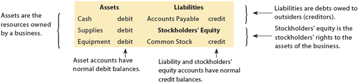</img>

| Transaction [Transacción] | Account [Cuenta] | Type [Tipo] | Normal Balance [Saldo Normal] |
|---------------------------|-----------------|-------------|-------------------------------|
| Invested cash for common stock [Invirtió efectivo por acciones comunes] | Cash [Efectivo] | Asset [Activo] | Debit [Débito] |
| | Common Stock [Acciones Comunes] | Stockholders' Equity [Patrimonio] | Credit [Crédito] |
| Purchased medical supplies on account [Compró suministros médicos a crédito] | Supplies [Suministros] | Asset [Activo] | Debit [Débito] |
| | Accounts Payable [Cuentas por Pagar] | Liability [Pasivo] | Credit [Crédito] |
| Purchased office equipment on account [Compró equipo de oficina a crédito] | Office Equipment [Equipo de Oficina] | Asset [Activo] | Debit [Débito] |
| | Accounts Payable [Cuentas por Pagar] | Liability [Pasivo] | Credit [Crédito] |

---

## Key Terms [Términos Clave]

| English [Inglés] | Español [Español] |
|------------------|-------------------|
| Normal balance | Saldo normal |
| Debit (Dr.) | Débito |
| Credit (Cr.) | Crédito |
| Overpayment | Sobre pago |
| Account | Cuenta |
| Increase | Aumento |
| Decrease | Disminución |

---

## Summary Table [Tabla Resumen]

| Account Type [Tipo de Cuenta] | Normal Balance [Saldo Normal] |
|-------------------------------|-------------------------------|
| Assets [Activos] | Debit [Débito] |
| Liabilities [Pasivos] | Credit [Crédito] |
| Stockholders' Equity [Patrimonio de los Accionistas] | Credit [Crédito] |
| Revenue [Ingresos] | Credit [Crédito] |
| Expenses [Gastos] | Debit [Débito] |
| Dividends [Dividendos] | Debit [Débito] |

---


<h1 id="488883" style="color:#E65100;">
  <a href="#Chapter_002" style="color:inherit; text-decoration:none;">
    2-2e Journalizing
  </a>
</h1>


Using the rules of debit and credit, transactions are initially entered in a record called a journal (The initial record in which the effects of a transaction are recorded.). The journal serves as a record of when transactions occurred and were recorded. To illustrate, the November 20Y3 transactions of NetSolutions from Chapter 1 are used.

[Usando las reglas del débito y el crédito, las transacciones se registran inicialmente en un registro llamado diario (registro inicial donde se anotan los efectos de una transacción). El diario sirve como registro de cuándo ocurrieron y se registraron las transacciones. Para ilustrar, se utilizan las transacciones de noviembre de 20Y3 de NetSolutions del Capítulo 1.]

## Transaction a

**Nov. 1** Chris Clark deposited $25,000 in a bank account in the name of NetSolutions in exchange for common stock.

### Analysis

This transaction increases an asset account and increases a stockholders' equity account. It is recorded in the journal as an increase (debit) to Cash and an increase (credit) to Common Stock.

[Esta transacción aumenta una cuenta de activo y aumenta una cuenta de capital contable. Se registra en el diario como un aumento (débito) a Efectivo y un aumento (crédito) a Acciones Comunes.]

### Journal Entry

<!-- 📍 IMAGEN: Journal Entry para Transaction a (coordenadas [151, 570, 845, 751]) -->

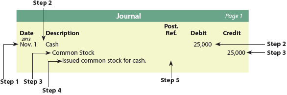

| Date | Account | Debit | Credit |
|------|---------|-------|--------|
| Nov. 1 | Cash | 25,000 | |
| | Common Stock | | 25,000 |

### Accounting Equation Impact

<!-- 📍 IMAGEN: Accounting Equation Impact para Transaction a -->

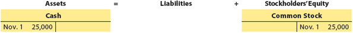

---

**1**

If you make a deposit at the bank, you are said to credit your account. Likewise, when you make a withdrawal, you are said to debit your account. At first, this may seem opposite to the debit and credit normal balance rules. Additions to cash are debits, not credits. However, while the cash in your account is an asset to you, it is a liability to the bank. Thus, when the bank credits your account for a deposit, it is increasing its liability account to you. Likewise, when the bank debits your account for a withdrawal, it is decreasing its liability account to you. Thus, the debit and credit normal balance rules are being followed from the bank's perspective.

[Si haces un depósito en el banco, se dice que acreditan tu cuenta. Del mismo modo, cuando retiras, se dice que debitan tu cuenta. Al principio, esto puede parecer opuesto a las reglas de saldo normal de débito y crédito. Las adiciones a efectivo son débitos, no créditos. Sin embargo, mientras que el efectivo en tu cuenta es un activo para ti, es un pasivo para el banco. Por lo tanto, cuando el banco acredita tu cuenta por un depósito, está aumentando su cuenta de pasivo contigo. Del mismo modo, cuando el banco debita tu cuenta por un retiro, está disminuyendo su cuenta de pasivo contigo. Por lo tanto, las reglas de saldo normal de débito y crédito se siguen desde la perspectiva del banco.]

The transaction is recorded in the journal using the following steps:

**Step 1.** The date of the transaction is entered in the Date column.

**Step 2.** The title of the account to be debited is recorded in the left-hand margin under the Description column, and the amount to be debited is entered in the Debit column.

**Step 3.** The title of the account to be credited is listed below and to the right of the debited account title, and the amount to be credited is entered in the Credit column.

**Step 4.** A brief description may be entered below the credited account.

**Step 5.** The Post. Ref. (Posting Reference) column is left blank when the journal entry is initially recorded. This column is used later in this chapter when the journal entry amounts are transferred to the accounts in the ledger.

[La transacción se registra en el diario usando los siguientes pasos:

**Paso 1.** La fecha de la transacción se ingresa en la columna Fecha.

**Paso 2.** El título de la cuenta a debitar se registra en el margen izquierdo bajo la columna Descripción, y el monto a debitar se ingresa en la columna Débito.

**Paso 3.** El título de la cuenta a acreditar se enumera debajo y a la derecha del título de la cuenta debitada, y el monto a acreditar se ingresa en la columna Crédito.

**Paso 4.** Se puede ingresar una breve descripción debajo de la cuenta acreditada.

**Paso 5.** La columna Post. Ref. (Referencia de Registro) se deja en blanco cuando se registra inicialmente el asiento de diario. Esta columna se usa más adelante en este capítulo cuando los montos del asiento de diario se transfieren a las cuentas del libro mayor.]

The process of recording a transaction in the journal is called **journalizing** (The process of recording a transaction in a journal.). The entry in the journal is called a **journal entry**.

[El proceso de registrar una transacción en el diario se llama **registro en el diario** (journalizing). El asiento en el diario se llama **asiento de diario** (journal entry).]

---

**1.** The form of the journal illustrated is called the **two-column journal** (A form of journal in which there are only two amount columns, one for debits and one for credits.). Other forms of journals are described and illustrated in online Appendix E, Special Journals and Subsidiary Ledgers.

[**1.** La forma del diario ilustrado se llama **diario de dos columnas** (una forma de diario en la que solo hay dos columnas de montos, una para débitos y otra para créditos). Otras formas de diarios se describen e ilustran en el Apéndice E en línea, Diarios Especiales y Libros Auxiliares.]

A useful method for analyzing and journalizing transactions is as follows:

**(a)** Carefully read the description of the transaction to determine whether an asset, a liability, a stockholders' equity, a revenue, an expense, or a dividends account is affected.
**(b)** For each account affected by the transaction, determine whether the account increases or decreases.
**(c)** Determine whether each increase or decrease should be recorded as a debit or a credit, following the rules of debit and credit shown in Exhibit 3.
**(d)** Record the transaction using a journal entry.

[Un método útil para analizar y registrar transacciones es el siguiente:

**(a)** Lea cuidadosamente la descripción de la transacción para determinar si se afecta una cuenta de activo, pasivo, capital contable, ingreso, gasto o dividendos.
**(b)** Para cada cuenta afectada por la transacción, determine si la cuenta aumenta o disminuye.
**(c)** Determine si cada aumento o disminución debe registrarse como débito o crédito, siguiendo las reglas de débito y crédito mostradas en la Figura 3.
**(d)** Registre la transacción usando un asiento de diario.]

**Exhibit 4** summarizes terminology that is often used in describing a transaction along with the related accounts that would be debited and credited.

[La **Figura 4** resume la terminología que se usa a menudo para describir una transacción junto con las cuentas relacionadas que se debitarían y acreditarían.]

## Exhibit 4

### Transaction Terminology and Related Journal Entry Accounts

<!-- 📍 IMAGEN: Exhibit 4 (tabla de terminología) -->

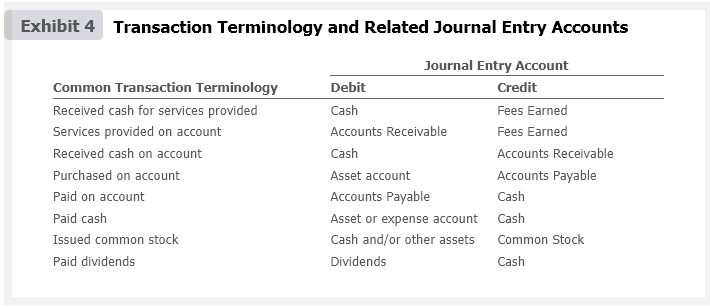

| Common Transaction Terminology | Debit | Credit |
|-------------------------------|-------|--------|
| Received cash for services provided | Cash | Fees Earned |
| Services provided on account | Accounts Receivable | Fees Earned |
| Received cash on account | Cash | Accounts Receivable |
| Purchased on account | Asset account | Accounts Payable |
| Paid on account | Accounts Payable | Cash |
| Paid cash | Asset or expense account | Cash |
| Issued common stock | Cash and/or other assets | Common Stock |
| Paid dividends | Dividends | Cash |

The remaining transactions of NetSolutions for November are analyzed and journalized.

[Las transacciones restantes de NetSolutions para noviembre se analizan y registran en el diario.]

---

## Transaction b

**Nov. 5** NetSolutions paid $20,000 for the purchase of land as a future building site.

### Analysis

This transaction increases one asset account and decreases another. It is recorded in the journal as a $20,000 increase (debit) to Land and a $20,000 decrease (credit) to Cash.

[Esta transacción aumenta una cuenta de activo y disminuye otra. Se registra en el diario como un aumento (débito) de $20,000 a Terreno y una disminución (crédito) de $20,000 a Efectivo.]

### Journal Entry

| Date | Account | Debit | Credit |
|------|---------|-------|--------|
| Nov. 5 | Land | 20,000 | |
| | Cash | | 20,000 |
| *Purchased land for building site.* | | | |

### Accounting Equation Impact

<!-- 📍 IMAGEN: Accounting Equation Impact para Transaction b (coordenadas [152, 686, 826, 802]) -->


---

## Transaction c

**Nov. 10** NetSolutions purchased supplies on account for $1,350.

### Analysis

This transaction increases an asset account and increases a liability account. It is recorded in the journal as a $1,350 increase (debit) to Supplies and a $1,350 increase (credit) to Accounts Payable.

[Esta transacción aumenta una cuenta de activo y aumenta una cuenta de pasivo. Se registra en el diario como un aumento (débito) de $1,350 a Suministros y un aumento (crédito) de $1,350 a Cuentas por Pagar.]

### Journal Entry

| Date | Account | Debit | Credit |
|------|---------|-------|--------|
| Nov. 10 | Supplies | 1,350 | |
| | Accounts Payable | | 1,350 |
| *Purchased supplies on account.* | | | |

### Accounting Equation Impact

<!-- 📍 IMAGEN: Accounting Equation Impact para Transaction c (coordenadas [152, 476, 826, 535]) -->


---

## Transaction d

**Nov. 18** NetSolutions received cash of $7,500 from customers for services provided.

### Analysis

This transaction increases an asset account and increases a revenue account. It is recorded in the journal as a $7,500 increase (debit) to Cash and a $7,500 increase (credit) to Fees Earned.

[Esta transacción aumenta una cuenta de activo y aumenta una cuenta de ingreso. Se registra en el diario como un aumento (débito) de $7,500 a Efectivo y un aumento (crédito) de $7,500 a Ingresos por Servicios.]

### Journal Entry

| Date | Account | Debit | Credit |
|------|---------|-------|--------|
| Nov. 18 | Cash | 7,500 | |
| | Fees Earned | | 7,500 |
| *Received fees from customers.* | | | |

### Accounting Equation Impact

<!-- 📍 IMAGEN: Accounting Equation Impact para Transaction d (coordenadas [153, 146, 824, 204]) -->

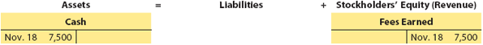

---

## Transaction e

**Nov. 30** NetSolutions incurred the following expenses: wages, $2,125; rent, $800; utilities, $450; and miscellaneous, $275.

### Analysis

This transaction increases various expense accounts and decreases an asset (Cash) account. You should note that regardless of the number of accounts, the sum of the debits is always equal to the sum of the credits in a journal entry. It is recorded in the journal with increases (debits) to the expense accounts (Wages Expense, $2,125; Rent Expense, $800; Utilities Expense, $450; and Miscellaneous Expense, $275) and a decrease (credit) to Cash, $3,650.

[Esta transacción aumenta varias cuentas de gasto y disminuye una cuenta de activo (Efectivo). Debe notar que, independientemente del número de cuentas, la suma de los débitos siempre es igual a la suma de los créditos en un asiento de diario. Se registra en el diario con aumentos (débitos) a las cuentas de gasto (Gastos de Sueldos, $2,125; Gastos de Renta, $800; Gastos de Servicios Públicos, $450; y Gastos Misceláneos, $275) y una disminución (crédito) a Efectivo, $3,650.]

### Journal Entry

| Date | Account | Debit | Credit |
|------|---------|-------|--------|
| Nov. 30 | Wages Expense | 2,125 | |
| | Rent Expense | 800 | |
| | Utilities Expense | 450 | |
| | Miscellaneous Expense | 275 | |
| | Cash | | 3,650 |
| *Paid expenses.* | | | |

### Accounting Equation Impact

<!-- 📍 IMAGEN: Accounting Equation Impact para Transaction e -->

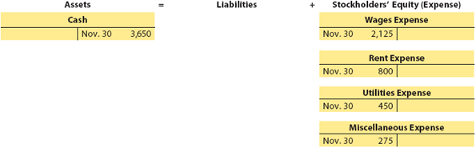

---

## Transaction f

**Nov. 30** NetSolutions paid creditors on account, $950.

### Analysis

This transaction decreases a liability account and decreases an asset account. It is recorded in the journal as a $950 decrease (debit) to Accounts Payable and a $950 decrease (credit) to Cash.

[Esta transacción disminuye una cuenta de pasivo y disminuye una cuenta de activo. Se registra en el diario como una disminución (débito) de $950 a Cuentas por Pagar y una disminución (crédito) de $950 a Efectivo.]

### Journal Entry

| Date | Account | Debit | Credit |
|------|---------|-------|--------|
| Nov. 30 | Accounts Payable | 950 | |
| | Cash | | 950 |
| *Paid creditors on account.* | | | |

### Accounting Equation Impact

<!-- 📍 IMAGEN: Accounting Equation Impact para Transaction f (coordenadas [152, 646, 826, 705]) -->


---

## Transaction g

**Nov. 30** NetSolutions determined that the cost of supplies on hand at November 30 was $550.

### Analysis

NetSolutions purchased $1,350 of supplies on November 10. Thus, $800 ($1,350 - $550) of supplies must have been used during November. This transaction is recorded in the journal as an $800 increase (debit) to Supplies Expense and an $800 decrease (credit) to Supplies.

[NetSolutions compró $1,350 de suministros el 10 de noviembre. Por lo tanto, se deben haber usado $800 ($1,350 - $550) de suministros durante noviembre. Esta transacción se registra en el diario como un aumento (débito) de $800 a Gastos de Suministros y una disminución (crédito) de $800 a Suministros.]

### Journal Entry

| Date | Account | Debit | Credit |
|------|---------|-------|--------|
| Nov. 30 | Supplies Expense | 800 | |
| | Supplies | | 800 |
| *Supplies used during November.* | | | |

### Accounting Equation Impact

<!-- 📍 IMAGEN: Accounting Equation Impact para Transaction g (coordenadas [152, 334, 822, 394]) -->

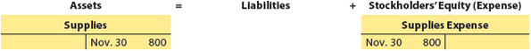

---

## Transaction h

**Nov. 30** Paid dividends, $2,000.

### Analysis

This transaction decreases assets and stockholders' equity. This transaction is recorded in the journal as a $2,000 increase (debit) to Dividends and a $2,000 decrease (credit) to Cash.

[Esta transacción disminuye los activos y el capital contable. Esta transacción se registra en el diario como un aumento (débito) de $2,000 a Dividendos y una disminución (crédito) de $2,000 a Efectivo.]

### Journal Entry

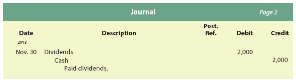</img>

| Date | Account | Debit | Credit |
|------|---------|-------|--------|
| Nov. 30 | Dividends | 2,000 | |
| | &nbsp;&nbsp;&nbsp;&nbsp;Cash | | 2,000 |
|  |&nbsp;&nbsp;&nbsp;&nbsp;&nbsp;&nbsp;&nbsp;*Paid dividends.* | | |

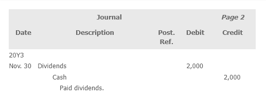</img>

### Accounting Equation Impact

<!-- 📍 IMAGEN: Accounting Equation Impact para Transaction h -->


---

## Ethics in Action

### Will Journalizing Prevent Fraud?

While journalizing transactions reduces the possibility of fraud, it by no means eliminates it. For example, embezzlement can be hidden within the double-entry bookkeeping system by creating fictitious suppliers to whom checks are issued.

[¿El registro en el diario previene el fraude? Si bien registrar transacciones en el diario reduce la posibilidad de fraude, de ninguna manera lo elimina. Por ejemplo, el desfalco puede ocultarse dentro del sistema de contabilidad de partida doble creando proveedores ficticios a quienes se emiten cheques.]

---

## Check up Corner 2-2

### Journal Entries

Selected transactions from Simmons Urgent Care Inc.'s first month of operations are as follows:

**Jan. 1** David Simmons deposited $30,000 in a bank account in the name of Simmons Urgent Care Inc. in exchange for common stock.

**Jan. 2** Purchased medical supplies on account, $6,000.

**Jan. 6** Paid cash to creditors on account, $3,200.

**Jan. 7** Purchased office equipment on account, $62,500.

[Transacciones seleccionadas del primer mes de operaciones de Simmons Urgent Care Inc. son las siguientes:

**1 de enero** David Simmons depositó $30,000 en una cuenta bancaria a nombre de Simmons Urgent Care Inc. a cambio de acciones comunes.

**2 de enero** Compró suministros médicos a crédito, $6,000.

**6 de enero** Pagó efectivo a acreedores a cuenta, $3,200.

**7 de enero** Compró equipo de oficina a crédito, $62,500.]

**Journalize these transactions, and illustrate their impact on the accounting equation using T accounts.**

[Registre estas transacciones en el diario e ilustre su impacto en la ecuación contable usando cuentas T.]

---

### Solution - Check Up Corner 2-2

#### Journal Entries

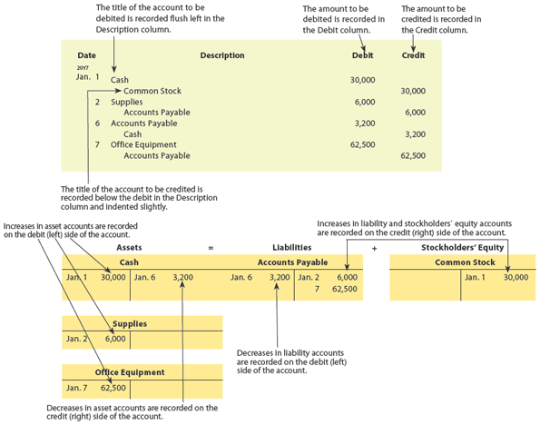</img>

| Date | Account | Debit | Credit |
|------|---------|-------|--------|
| Jan. 1 | Cash | 30,000 | |
| | &nbsp;&nbsp;&nbsp;&nbsp;Common Stock | | 30,000 |
|  |&nbsp;&nbsp;&nbsp;&nbsp;&nbsp;&nbsp;&nbsp;&nbsp;*Invested cash in exchange for common stock.* | | |
| Jan. 2 | Medical Supplies | 6,000 | |
| | &nbsp;&nbsp;&nbsp;&nbsp;Accounts Payable | | 6,000 |
|  |&nbsp;&nbsp;&nbsp;&nbsp;&nbsp;&nbsp;&nbsp;&nbsp;*Purchased medical supplies on account.* | | |
| Jan. 6 | Accounts Payable | 3,200 | |
| | &nbsp;&nbsp;&nbsp;&nbsp;Cash | | 3,200 |
|  |&nbsp;&nbsp;&nbsp;&nbsp;&nbsp;&nbsp;&nbsp;&nbsp;*Paid cash to creditors on account.* | | |
| Jan. 7 | Office Equipment | 62,500 | |
| | &nbsp;&nbsp;&nbsp;&nbsp;Accounts Payable | | 62,500 |
|  |&nbsp;&nbsp;&nbsp;&nbsp;&nbsp;&nbsp;&nbsp;&nbsp;*Purchased office equipment on account.* | | |

&nbsp;&nbsp;&nbsp;&nbsp;&nbsp;&nbsp;&nbsp;&nbsp;

#### T-Accounts

<!-- 📍 IMAGEN: T-Accounts para Check Up Corner 2-2 -->


**Cash**
### Cash (Efectivo)

| Date | Debit | Credit |
|------|-------|--------|
| Jan. 1 | 30,000 | |
| Jan. 6 | | 3,200 |
| **Balance** | **26,800** | |

---

### Medical Supplies (Suministros Médicos)

| Date | Debit | Credit |
|------|-------|--------|
| Jan. 2 | 6,000 | |
| **Balance** | **6,000** | |

---

### Office Equipment (Equipo de Oficina)

| Date | Debit | Credit |
|------|-------|--------|
| Jan. 7 | 62,500 | |
| **Balance** | **62,500** | |

---

### Accounts Payable (Cuentas por Pagar)

| Date | Debit | Credit |
|------|-------|--------|
| Jan. 2 | | 6,000 |
| Jan. 6 | 3,200 | |
| Jan. 7 | | 62,500 |
| **Balance** | | **65,300** |

---

### Common Stock (Acciones Comunes)

| Date | Debit | Credit |
|------|-------|--------|
| Jan. 1 | | 30,000 |
| **Balance** | | **30,000** |

---

<h1 id="357632" style="color:#E65100;">
  <a href="#Chapter_002" style="color:inherit; text-decoration:none;">
    2-3 Posting Journal Entries to Accounts
  </a>
</h1>


As illustrated, a transaction is first recorded in a journal. Periodically, the journal entries are transferred to the accounts in the ledger. The process of transferring the debits and credits from the journal entries to the accounts is called **posting** (The process of transferring the debits and credits from the journal entries to the accounts.)

[Como se ilustró, una transacción se registra primero en un diario. Periódicamente, los asientos de diario se transfieren a las cuentas del libro mayor. El proceso de transferir los débitos y créditos de los asientos de diario a las cuentas se llama **traspaso** (posting).]

**Objective 3** - Describe and illustrate the journalizing and posting of transactions to accounts.

[Objetivo 3 - Describir e ilustrar el registro en el diario y el traspaso de transacciones a las cuentas.]

**posting** (The process of transferring the debits and credits from the journal entries to the accounts.)

[**traspaso** (posting) - El proceso de transferir los débitos y créditos de los asientos de diario a las cuentas.]

The December 20Y3 transactions of NetSolutions are used to illustrate posting from the journal to the ledger. By using the December transactions, an additional review of analyzing and journalizing transactions is provided.

[Las transacciones de diciembre de 20Y3 de NetSolutions se utilizan para ilustrar el traspaso del diario al libro mayor. Al usar las transacciones de diciembre, se proporciona una revisión adicional del análisis y registro en el diario de transacciones.]

---

## Transaction

**Dec. 1** NetSolutions paid a premium of $2,400 for an insurance policy for liability, theft, and fire. The policy covers a one-year period.

### Analysis

Advance payments of expenses, such as for insurance premiums, are assets called prepaid expenses. For NetSolutions, the asset purchased is insurance protection for 12 months. This transaction is recorded as a $2,400 increase (debit) to Prepaid Insurance and a $2,400 decrease (credit) to Cash.

[Los pagos anticipados de gastos, como las primas de seguros, son activos llamados gastos pagados por adelantado. Para NetSolutions, el activo adquirido es protección de seguro por 12 meses. Esta transacción se registra como un aumento (débito) de $2,400 a Seguro Pagado por Adelantado y una disminución (crédito) de $2,400 a Efectivo.]

### Journal Entry

| Date | Account | Debit | Credit |
|------|---------|-------|--------|
| Dec. 1 | Prepaid Insurance | 2,400 | |
| | &nbsp;&nbsp;&nbsp;&nbsp;Cash | | 2,400 |
|  |&nbsp;&nbsp;&nbsp;&nbsp;&nbsp;&nbsp;&nbsp;&nbsp;*Paid premium on one-year policy.* | | |

### Accounting Equation Impact

<!-- 📍 IMAGEN: Accounting Equation Impact para Dec. 1 (coordenadas [153, 246, 825, 377]) -->

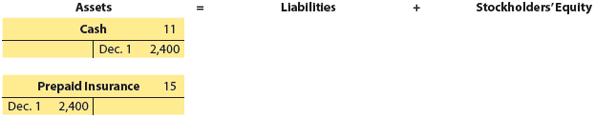

Although T accounts are useful for illustrating the recording and posting of transactions, more formal, multi-column accounts are used in practice. For example, a **four-column account** (A form of account that has Debit and Credit columns for recording transactions as well as Balance (Debit and Credit) columns for indicating the account balance after each transaction.) has Date, Item, and Posting Reference (Post. Ref.) columns as well as Debit and Credit columns for posting transactions. In addition, the four-column account has Balance (Debit and Credit) columns for indicating the current balance of the account, sometimes called a running balance.

[Aunque las cuentas T son útiles para ilustrar el registro y traspaso de transacciones, en la práctica se utilizan cuentas más formales de múltiples columnas. Por ejemplo, una **cuenta de cuatro columnas** (una forma de cuenta que tiene columnas de Débito y Crédito para registrar transacciones, así como columnas de Saldo (Débito y Crédito) para indicar el saldo de la cuenta después de cada transacción) tiene columnas de Fecha, Concepto y Referencia de Traspaso (Post. Ref.), así como columnas de Débito y Crédito para traspasar transacciones. Además, la cuenta de cuatro columnas tiene columnas de Saldo (Débito y Crédito) para indicar el saldo actual de la cuenta, a veces llamado saldo continuo.]

In practice, accounts may take a variety of formats other than the four-column account and may include additional data useful in managing the business. However, to simplify, the four-column account is used in the remainder of this chapter.

[En la práctica, las cuentas pueden tener una variedad de formatos diferentes a la cuenta de cuatro columnas y pueden incluir datos adicionales útiles para administrar el negocio. Sin embargo, para simplificar, la cuenta de cuatro columnas se utiliza en el resto de este capítulo.]

The posting of the preceding December 1 transaction to four-column accounts is shown in Exhibit 5.

[El traspaso de la transacción anterior del 1 de diciembre a cuentas de cuatro columnas se muestra en la Figura 5.]

---

## Exhibit 5

### Diagram of the Recording and Posting of a Debit and a Credit

<!-- 📍 IMAGEN: Exhibit 5 - Diagram of Recording and Posting (página 2-3) -->

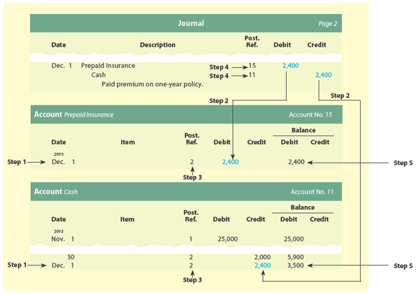

The debits and credits for each journal entry are posted to the accounts in the order in which they occur in the journal. To illustrate, the debit portion of the December 1 journal entry is posted to the prepaid account in Exhibit 5 using the following five steps:

[Los débitos y créditos de cada asiento de diario se traspasan a las cuentas en el orden en que ocurren en el diario. Para ilustrar, la parte de débito del asiento de diario del 1 de diciembre se traspasa a la cuenta de seguro pagado por adelantado en la Figura 5 usando los siguientes cinco pasos:]

**Step 1.** The date (Dec. 1) of the journal entry is entered in the Date column of Prepaid Insurance.

[**Paso 1.** La fecha (Dec. 1) del asiento de diario se ingresa en la columna Fecha de Seguro Pagado por Adelantado.]

**Step 2.** The amount (2,400) is entered into the Debit column of Prepaid Insurance.

[**Paso 2.** El monto (2,400) se ingresa en la columna Débito de Seguro Pagado por Adelantado.]

**Step 3.** The journal page number (2) is entered in the Posting Reference (Post. Ref.) column of Prepaid Insurance.

[**Paso 3.** El número de página del diario (2) se ingresa en la columna Referencia de Traspaso (Post. Ref.) de Seguro Pagado por Adelantado.]

**Step 4.** The account number (15) is entered in the Posting Reference (Post. Ref.) column in the journal.

[**Paso 4.** El número de cuenta (15) se ingresa en la columna Referencia de Traspaso (Post. Ref.) en el diario.]

**Step 5.** The account balance (2,400) is entered in the Balance/Debit column of Prepaid Insurance.

[**Paso 5.** El saldo de la cuenta (2,400) se ingresa en la columna Saldo/Débito de Seguro Pagado por Adelantado.]

As shown in Exhibit 5, the credit portion of the December 1 journal entry is posted to the cash account in a similar manner.

[Como se muestra en la Figura 5, la parte de crédito del asiento de diario del 1 de diciembre se traspasa a la cuenta de efectivo de manera similar.]

The remaining December transactions for NetSolutions are analyzed and journalized in the following paragraphs. These transactions are posted to the ledger later in this chapter. To simplify, some of the December transactions are stated in summary form. For example, cash received for services is normally recorded on a daily basis. However, only summary totals are recorded at the middle and end of the month for NetSolutions.

[Las transacciones restantes de diciembre para NetSolutions se analizan y registran en el diario en los siguientes párrafos. Estas transacciones se traspasarán al libro mayor más adelante en este capítulo. Para simplificar, algunas de las transacciones de diciembre se presentan en forma resumida. Por ejemplo, el efectivo recibido por servicios normalmente se registra diariamente. Sin embargo, para NetSolutions, solo se registran totales resumidos a mediados y al final del mes.]

---

## Transaction

**Dec. 1** NetSolutions paid rent for December, $800. The company from which NetSolutions is renting its office space now requires the payment of rent on the first of each month, rather than at the end of the month.

### Analysis

The advance payment of rent is an asset, much like the advance payment of the insurance premium in the preceding transaction. However, unlike the insurance premium, this prepaid rent will expire in one month. When an asset is purchased with the expectation that it will be used up in a short period of time, such as a month, it is normal to debit an expense account initially. This avoids having to transfer the balance from an asset account (Prepaid Rent) to an expense account (Rent Expense) at the end of the month. Thus, this transaction is recorded as an $800 increase (debit) to Rent Expense and an $800 decrease (credit) to Cash.

[El pago anticipado de renta es un activo, similar al pago anticipado de la prima de seguro en la transacción anterior. Sin embargo, a diferencia de la prima de seguro, esta renta pagada por adelantado expirará en un mes. Cuando se adquiere un activo con la expectativa de que se consumirá en un período corto de tiempo, como un mes, es normal debitar una cuenta de gasto inicialmente. Esto evita tener que transferir el saldo de una cuenta de activo (Renta Pagada por Adelantado) a una cuenta de gasto (Gasto de Renta) al final del mes. Por lo tanto, esta transacción se registra como un aumento (débito) de $800 a Gasto de Renta y una disminución (crédito) de $800 a Efectivo.]

### Journal Entry

| Date | Account | Debit | Credit |
|------|---------|-------|--------|
| Dec. 1 | Rent Expense | 800 | |
| | Cash | | 800 |
| *Paid rent for December.* | | | |

### Accounting Equation Impact

<!-- 📍 IMAGEN: Accounting Equation Impact - Rent Expense -->

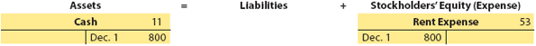

---

## Transaction

**Dec. 1** NetSolutions received an offer from a local retailer to rent the land purchased on November 5. The retailer plans to use the land as a parking lot for its employees and customers. NetSolutions agreed to rent the land to the retailer for three months, with the rent payable in advance. NetSolutions received $360 for three months' rent beginning December 1.

### Analysis

By agreeing to rent the land and accepting the $360, NetSolutions has incurred an obligation (liability) to the retailer. This obligation is to make the land available for use for three months and not to interfere with its use. The liability created by receiving the cash in advance of providing the service is called **unearned revenue** (The liability created by receiving revenue in advance.). As time passes, the unearned rent liability will decrease and will become revenue. Thus, this transaction is recorded as a $360 increase (debit) to Cash and a $360 increase (credit) to Unearned Rent.

[Al acordar alquilar el terreno y aceptar los $360, NetSolutions ha incurrido en una obligación (pasivo) con el minorista. Esta obligación es hacer que el terreno esté disponible para su uso durante tres meses y no interferir con su uso. El pasivo creado al recibir el efectivo antes de proporcionar el servicio se llama **ingreso no devengado** (ingreso diferido) (el pasivo creado al recibir ingresos por adelantado). A medida que pasa el tiempo, el pasivo de renta no devengada disminuirá y se convertirá en ingreso. Por lo tanto, esta transacción se registra como un aumento (débito) de $360 a Efectivo y un aumento (crédito) de $360 a Renta No Devengada.]

### Journal Entry

| Date | Account | Debit | Credit |
|------|---------|-------|--------|
| Dec. 1 | Cash | 360 | |
| | Unearned Rent | | 360 |
| *Received advance payment for three months' rent on land.* | | | |

### Accounting Equation Impact

<!-- 📍 IMAGEN: Accounting Equation Impact - Unearned Rent (coordenadas [153, 602, 825, 655]) -->

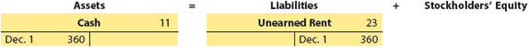

> **Link to Apple:** In a recent balance sheet, Apple reported over $8 billion in unearned revenue, sometimes called deferred revenue.
>
> [**Enlace a Apple:** En un balance general reciente, Apple reportó más de $8 mil millones en ingresos no devengados, a veces llamados ingresos diferidos.]

---

## Transaction

**Dec. 4** NetSolutions purchased office equipment on account from Executive Supply Co. for $1,800.

### Analysis

The asset (Office Equipment) and liability accounts (Accounts Payable) increase. This transaction is recorded as an $1,800 increase (debit) to Office Equipment and an $1,800 increase (credit) to Accounts Payable.

[El activo (Equipo de Oficina) y las cuentas de pasivo (Cuentas por Pagar) aumentan. Esta transacción se registra como un aumento (débito) de $1,800 a Equipo de Oficina y un aumento (crédito) de $1,800 a Cuentas por Pagar.]

### Journal Entry

| Date | Account | Debit | Credit |
|------|---------|-------|--------|
| Dec. 4 | Office Equipment | 1,800 | |
| | Accounts Payable | | 1,800 |
| *Purchased office equipment on account.* | | | |

### Accounting Equation Impact

<!-- 📍 IMAGEN: Accounting Equation Impact - Office Equipment (coordenadas [153, 497, 826, 555]) -->


> **Link to Apple:** In a recent balance sheet, Apple reported equipment, buildings, and land of over $37 billion.
>
> [**Enlace a Apple:** En un balance general reciente, Apple reportó equipo, edificios y terreno por más de $37 mil millones.]

---

## Transaction

**Dec. 6** NetSolutions paid $180 for a newspaper advertisement.

### Analysis

An expense increases, and an asset (Cash) decreases. Expense items that are expected to be minor in amount are normally included as part of the miscellaneous expense. This transaction is recorded as a $180 increase (debit) to Miscellaneous Expense and a $180 decrease (credit) to Cash.

[Un gasto aumenta y un activo (Efectivo) disminuye. Las partidas de gasto que se espera que sean de monto menor normalmente se incluyen como parte de los gastos misceláneos. Esta transacción se registra como un aumento (débito) de $180 a Gastos Misceláneos y una disminución (crédito) de $180 a Efectivo.]

### Journal Entry

| Date | Account | Debit | Credit |
|------|---------|-------|--------|
| Dec. 6 | Miscellaneous Expense | 180 | |
| | Cash | | 180 |
| *Paid for newspaper advertisement.* | | | |

### Accounting Equation Impact

<!-- 📍 IMAGEN: Accounting Equation Impact - Miscellaneous Expense (coordenadas [153, 335, 825, 390]) -->

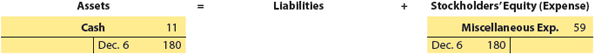

---

## Business Insight

### Computerized Accounting Systems

Computerized accounting systems like QuickBooks, NetSuite, and Sage Intacct are widely used by even the smallest companies. These systems simplify the journalizing process and eliminate the need for manual posting. For example, in a computerized accounting system, when a customer payment is processed, the date, customer name, and payment amount are entered in the "Receive Payment" window. The entered data are automatically journalized and posted to the ledger accounts.

[**Perspectiva de Negocio - Sistemas de Contabilidad Computarizados:** Sistemas de contabilidad computarizados como QuickBooks, NetSuite y Sage Intacct son ampliamente utilizados incluso por las empresas más pequeñas. Estos sistemas simplifican el proceso de registro en el diario y eliminan la necesidad del traspaso manual. Por ejemplo, en un sistema de contabilidad computarizado, cuando se procesa un pago de un cliente, la fecha, el nombre del cliente y el monto del pago se ingresan en la ventana "Recibir Pago". Los datos ingresados se registran automáticamente en el diario y se traspasan a las cuentas del libro mayor.]

---

## Transaction

**Dec. 11** NetSolutions paid creditors $400.

### Analysis

A liability (Accounts Payable) and an asset (Cash) decrease. This transaction is recorded as a $400 decrease (debit) to Accounts Payable and a $400 decrease (credit) to Cash.

[Un pasivo (Cuentas por Pagar) y un activo (Efectivo) disminuyen. Esta transacción se registra como una disminución (débito) de $400 a Cuentas por Pagar y una disminución (crédito) de $400 a Efectivo.]

### Journal Entry

| Date | Account | Debit | Credit |
|------|---------|-------|--------|
| Dec. 11 | Accounts Payable | 400 | |
| | Cash | | 400 |
| *Paid creditors on account.* | | | |

### Accounting Equation Impact

<!-- 📍 IMAGEN: Accounting Equation Impact - Accounts Payable (coordenadas [153, 293, 825, 351]) -->


---

## Transaction

**Dec. 13** NetSolutions paid a receptionist and a part-time assistant $950 for two weeks' wages.

### Analysis

This transaction is similar to the December 6 transaction, where an expense account is increased and Cash is decreased. This transaction is recorded as a $950 increase (debit) to Wages Expense and a $950 decrease (credit) to Cash.

[Esta transacción es similar a la transacción del 6 de diciembre, donde una cuenta de gasto aumenta y Efectivo disminuye. Esta transacción se registra como un aumento (débito) de $950 a Gasto de Sueldos y una disminución (crédito) de $950 a Efectivo.]

### Journal Entry

| Date | Account | Debit | Credit |
|------|---------|-------|--------|
| Dec. 13 | Wages Expense | 950 | |
| | Cash | | 950 |
| *Paid two weeks' wages.* | | | |


### Accounting Equation Impact

<!-- 📍 IMAGEN: Accounting Equation Impact - Accounts Payable (coordenadas [153, 293, 825, 351]) -->

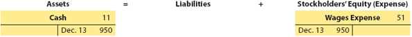


---

## Transaction

**Dec. 16** NetSolutions received $3,100 from fees earned for the first half of December.

### Journal Entry

| Date | Account | Debit | Credit |
|------|---------|-------|--------|
| Dec. 16 | Cash | 3,100 | |
| | Fees Earned | | 3,100 |
| *Received fees from customers.* | | | |

### Accounting Equation Impact

<!-- 📍 IMAGEN: Accounting Equation Impact - Accounts Receivable (coordenadas [153, 664, 822, 718]) -->

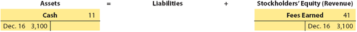

---


## Transaction

**Dec. 16** Fees earned on account totaled $1,750 for the first half of December.

### Analysis

When a business agrees that a customer may pay for services provided at a later date, an account receivable is created. An account receivable is a claim against the customer. An account receivable is an asset, and the revenue is earned even though no cash has been received. Thus, this transaction is recorded as a $1,750 increase (debit) to Accounts Receivable and a $1,750 increase (credit) to Fees Earned.

[Cuando una empresa acuerda que un cliente puede pagar por los servicios proporcionados en una fecha posterior, se crea una cuenta por cobrar. Una cuenta por cobrar es un derecho de cobro contra el cliente. Una cuenta por cobrar es un activo, y el ingreso se gana aunque no se haya recibido efectivo. Por lo tanto, esta transacción se registra como un aumento (débito) de $1,750 a Cuentas por Cobrar y un aumento (crédito) de $1,750 a Ingresos por Servicios.]

### Journal Entry

| Date | Account | Debit | Credit |
|------|---------|-------|--------|
| Dec. 16 | Accounts Receivable | 1,750 | |
| | Fees Earned | | 1,750 |
| *Fees earned on account.* | | | |

### Accounting Equation Impact

<!-- 📍 IMAGEN: Accounting Equation Impact - Accounts Receivable (coordenadas [153, 664, 822, 718]) -->

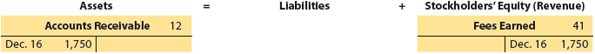
---

## Transaction

**Dec. 20** NetSolutions paid $900 to Executive Supply Co. on the $1,800 debt owed from the December 4 transaction.

### Analysis

This is similar to the transaction of December 11. This transaction is recorded as a $900 decrease (debit) to Accounts Payable and a $900 decrease (credit) to Cash.

[Esto es similar a la transacción del 11 de diciembre. Esta transacción se registra como una disminución (débito) de $900 a Cuentas por Pagar y una disminución (crédito) de $900 a Efectivo.]

### Journal Entry

| Date | Account | Debit | Credit |
|------|---------|-------|--------|
| Dec. 20 | Accounts Payable | 900 | |
| | Cash | | 900 |
| *Paid creditors on account.* | | | |

### Accounting Equation Impact

<!-- 📍 IMAGEN: Accounting Equation Impact - Accounts Payable Dec 20 (coordenadas [153, 314, 825, 372]) -->


> **Link to Apple:** On a recent balance sheet, Apple reported $46 billion in accounts payable.
>
> [**Enlace a Apple:** En un balance general reciente, Apple reportó $46 mil millones en cuentas por pagar.]

---

## Transaction

**Dec. 21** NetSolutions received $650 from customers in payment of their accounts.

### Analysis

When customers pay amounts owed for services they have previously received, one asset increases and another asset decreases. This transaction is recorded as a $650 increase (debit) to Cash and a $650 decrease (credit) to Accounts Receivable.

[Cuando los clientes pagan montos adeudados por servicios que han recibido anteriormente, un activo aumenta y otro activo disminuye. Esta transacción se registra como un aumento (débito) de $650 a Efectivo y una disminución (crédito) de $650 a Cuentas por Cobrar.]

### Journal Entry

| Date | Account | Debit | Credit |
|------|---------|-------|--------|
| Dec. 21 | Cash | 650 | |
| | Accounts Receivable | | 650 |
| *Received cash from customers on account.* | | | |

### Accounting Equation Impact

<!-- 📍 IMAGEN: Accounting Equation Impact - Cash Received on Account (coordenadas [153, 167, 827, 272]) -->

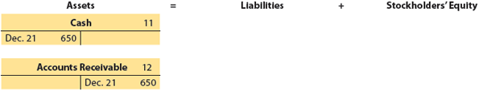

---

## Transaction

**Dec. 23** NetSolutions paid $1,450 for supplies.

### Analysis

One asset account (Supplies) increases, and another asset account (Cash) decreases. This transaction is recorded as a $1,450 increase (debit) to Supplies and a $1,450 decrease (credit) to Cash.

[Una cuenta de activo (Suministros) aumenta, y otra cuenta de activo (Efectivo) disminuye. Esta transacción se registra como un aumento (débito) de $1,450 a Suministros y una disminución (crédito) de $1,450 a Efectivo.]

### Journal Entry

<!-- 📍 IMAGEN: Journal Entry para Dec. 23 (coordenadas [169, 641, 756, 726]) -->


| Date | Account | Debit | Credit |
|------|---------|-------|--------|
| Dec. 23 | Supplies | 1,450 | |
| | Cash | | 1,450 |
| *Paid for supplies.* | | | |

### Accounting Equation Impact


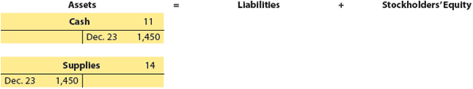

---

## Transaction

**Dec. 27** NetSolutions paid $1,200 for two weeks' wages.

### Analysis

This transaction is similar to the transaction of December 13. This transaction is recorded as a $1,200 increase (debit) to Wages Expense and a $1,200 decrease (credit) to Cash.

[Esta transacción es similar a la transacción del 13 de diciembre. Esta transacción se registra como un aumento (débito) de $1,200 a Gasto de Sueldos y una disminución (crédito) de $1,200 a Efectivo.]

### Journal Entry

| Date | Account | Debit | Credit |
|------|---------|-------|--------|
| Dec. 27 | Wages Expense | 1,200 | |
| | Cash | | 1,200 |
| *Paid two weeks' wages.* | | | |

### Accounting Equation Impact

<!-- 📍 IMAGEN: Accounting Equation Impact - Wages Expense Dec 27 (coordenadas [152, 539, 822, 594]) -->

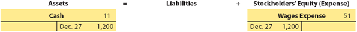

---

## Transaction

**Dec. 31** NetSolutions paid its $310 telephone bill for the month.

### Analysis

This is similar to the transaction of December 6. This transaction is recorded as a $310 increase (debit) to Utilities Expense and a $310 decrease (credit) to Cash.

[Esto es similar a la transacción del 6 de diciembre. Esta transacción se registra como un aumento (débito) de $310 a Gasto de Servicios Públicos y una disminución (crédito) de $310 a Efectivo.]

### Journal Entry

| Date | Account | Debit | Credit |
|------|---------|-------|--------|
| Dec. 31 | Utilities Expense | 310 | |
| | Cash | | 310 |
| *Paid telephone bill.* | | | |

### Accounting Equation Impact

<!-- 📍 IMAGEN: Accounting Equation Impact - Telephone Bill -->

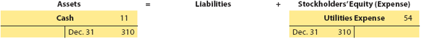

---

## Transaction

**Dec. 31** NetSolutions paid its $225 electric bill for the month.

### Analysis

This is similar to the preceding transaction. This transaction is recorded as a $225 increase (debit) to Utilities Expense and a $225 decrease (credit) to Cash.

[Esto es similar a la transacción anterior. Esta transacción se registra como un aumento (débito) de $225 a Gasto de Servicios Públicos y una disminución (crédito) de $225 a Efectivo.]

### Journal Entry

| Date | Account | Debit | Credit |
|------|---------|-------|--------|
| Dec. 31 | Utilities Expense | 225 | |
| | Cash | | 225 |
| *Paid electric bill.* | | | |

### Accounting Equation Impact

<!-- 📍 IMAGEN: Accounting Equation Impact - Electric Bill -->

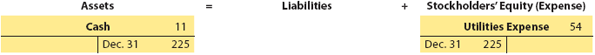

---

## Transaction

**Dec. 31** NetSolutions received $2,870 from fees earned for the second half of December.

### Analysis

This is similar to the transaction of December 16. This transaction is recorded as a $2,870 increase (debit) to Cash and a $2,870 increase (credit) to Fees Earned.

[Esto es similar a la transacción del 16 de diciembre. Esta transacción se registra como un aumento (débito) de $2,870 a Efectivo y un aumento (crédito) de $2,870 a Ingresos por Servicios.]

### Journal Entry

| Date | Account | Debit | Credit |
|------|---------|-------|--------|
| Dec. 31 | Cash | 2,870 | |
| | Fees Earned | | 2,870 |
| *Received fees from customers.* | | | |

### Accounting Equation Impact

<!-- 📍 IMAGEN: Accounting Equation Impact - Fees Earned Dec 31 (coordenadas [152, 544, 824, 599]) -->

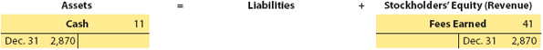

---

## Transaction

**Dec. 31** Fees earned on account totaled $1,120 for the second half of December.

### Analysis

This is similar to the transaction of December 16. This transaction is recorded as a $1,120 increase (debit) to Accounts Receivable and a $1,120 increase (credit) to Fees Earned.

[Esto es similar a la transacción del 16 de diciembre. Esta transacción se registra como un aumento (débito) de $1,120 a Cuentas por Cobrar y un aumento (crédito) de $1,120 a Ingresos por Servicios.]

### Journal Entry

| Date | Account | Debit | Credit |
|------|---------|-------|--------|
| Dec. 31 | Accounts Receivable | 1,120 | |
| | Fees Earned | | 1,120 |
| *Fees earned on account.* | | | |

### Accounting Equation Impact

<!-- 📍 IMAGEN: Accounting Equation Impact - Accounts Receivable Dec 31 (coordenadas [152, 225, 824, 280]) -->

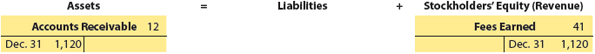

> **Link to Apple:** On a recent balance sheet, Apple reported $23 billion in accounts receivable.
>
> [**Enlace a Apple:** En un balance general reciente, Apple reportó $23 mil millones en cuentas por cobrar.]

---

## Transaction

**Dec. 31** Paid dividends, $2,000.

### Analysis

This transaction decreases stockholders' equity and assets. This transaction is recorded as a $2,000 increase (debit) to Dividends and a $2,000 decrease (credit) to Cash.

[Esta transacción disminuye el capital contable y los activos. Esta transacción se registra como un aumento (débito) de $2,000 a Dividendos y una disminución (crédito) de $2,000 a Efectivo.]

### Journal Entry

| Date | Account | Debit | Credit |
|------|---------|-------|--------|
| Dec. 31 | Dividends | 2,000 | |
| | Cash | | 2,000 |
| *Paid dividends.* | | | |

### Accounting Equation Impact

<!-- 📍 IMAGEN: Accounting Equation Impact - Dividends -->


> **Link to Apple:** In a recent year, Apple paid $14 billion in dividends.
>
> [**Enlace a Apple:** En un año reciente, Apple pagó $14 mil millones en dividendos.]

---

## Exhibit 6

### General Ledger for NetSolutions

<!-- 📍 IMAGEN: Exhibit 6 - General Ledger for NetSolutions (páginas 17-23) -->


**Account Cash - Account No. 11**

| Date | Item | Post. Ref. | Debit | Credit | Balance Debit | Balance Credit |
|------|------|------------|-------|--------|---------------|----------------|
| 20Y3 Nov. 1 | | 1 | 25,000 | | 25,000 | |
| Nov. 5 | | 1 | | 20,000 | 5,000 | |
| Nov. 18 | | 1 | 7,500 | | 12,500 | |
| Nov. 30 | | 1 | | 3,650 | 8,850 | |
| Nov. 30 | | 1 | | 950 | 7,900 | |
| Nov. 30 | | 1 | | 2,000 | 5,900 | |
| Dec. 1 | | 2 | | 2,400 | 3,500 | |
| Dec. 1 | | 2 | | 800 | 2,700 | |
| Dec. 1 | | 2 | 360 | | 3,060 | |
| Dec. 6 | | 2 | | 180 | 2,880 | |
| Dec. 11 | | 2 | | 400 | 2,480 | |
| Dec. 13 | | 2 | | 950 | 1,530 | |
| Dec. 16 | | 3 | 3,100 | | 4,630 | |
| Dec. 20 | | 3 | | 900 | 3,730 | |
| Dec. 21 | | 3 | 650 | | 4,380 | |
| Dec. 23 | | 3 | | 1,450 | 2,930 | |
| Dec. 27 | | 3 | | 1,200 | 1,730 | |
| Dec. 31 | | 3 | | 310 | 1,420 | |
| Dec. 31 | | 4 | | 225 | 1,195 | |
| Dec. 31 | | 4 | 2,870 | | 4,065 | |
| Dec. 31 | | 4 | | 2,000 | 2,065 | |

**Account Accounts Receivable - Account No. 12**

| Date | Item | Post. Ref. | Debit | Credit | Balance Debit | Balance Credit |
|------|------|------------|-------|--------|---------------|----------------|
| 20Y3 Dec. 16 | | 3 | 1,750 | | 1,750 | |
| Dec. 21 | | 3 | | 650 | 1,100 | |
| Dec. 31 | | 4 | 1,120 | | 2,220 | |

**Account Supplies - Account No. 14**

| Date | Item | Post. Ref. | Debit | Credit | Balance Debit | Balance Credit |
|------|------|------------|-------|--------|---------------|----------------|
| 20Y3 Nov. 10 | | 1 | 1,350 | | 1,350 | |
| Nov. 30 | | 1 | | 800 | 550 | |
| Dec. 23 | | 3 | 1,450 | | 2,000 | |

**Account Prepaid Insurance - Account No. 15**

| Date | Item | Post. Ref. | Debit | Credit | Balance Debit | Balance Credit |
|------|------|------------|-------|--------|---------------|----------------|
| 20Y3 Dec. 1 | | 2 | 2,400 | | 2,400 | |

**Account Land - Account No. 17**

| Date | Item | Post. Ref. | Debit | Credit | Balance Debit | Balance Credit |
|------|------|------------|-------|--------|---------------|----------------|
| 20Y3 Nov. 5 | | 1 | 20,000 | | 20,000 | |

**Account Office Equipment - Account No. 18**

| Date | Item | Post. Ref. | Debit | Credit | Balance Debit | Balance Credit |
|------|------|------------|-------|--------|---------------|----------------|
| 20Y3 Dec. 4 | | 2 | 1,800 | | 1,800 | |

**Account Accounts Payable - Account No. 21**

| Date | Item | Post. Ref. | Debit | Credit | Balance Debit | Balance Credit |
|------|------|------------|-------|--------|---------------|----------------|
| 20Y3 Nov. 10 | | 1 | | 1,350 | | 1,350 |
| Nov. 30 | | 1 | 950 | | | 400 |
| Dec. 4 | | 2 | | 1,800 | | 2,200 |
| Dec. 11 | | 2 | 400 | | | 1,800 |
| Dec. 20 | | 3 | 900 | | | 900 |

**Account Unearned Rent - Account No. 23**

| Date | Item | Post. Ref. | Debit | Credit | Balance Debit | Balance Credit |
|------|------|------------|-------|--------|---------------|----------------|
| 20Y3 Dec. 1 | | 2 | | 360 | | 360 |

**Account Common Stock - Account No. 31**

| Date | Item | Post. Ref. | Debit | Credit | Balance Debit | Balance Credit |
|------|------|------------|-------|--------|---------------|----------------|
| 20Y3 Nov. 1 | | 1 | | 25,000 | | 25,000 |

**Account Dividends - Account No. 33**

| Date | Item | Post. Ref. | Debit | Credit | Balance Debit | Balance Credit |
|------|------|------------|-------|--------|---------------|----------------|
| 20Y3 Nov. 30 | | 1 | 2,000 | | 2,000 | |
| Dec. 31 | | 4 | 2,000 | | 4,000 | |

**Account Fees Earned - Account No. 41**

| Date | Item | Post. Ref. | Debit | Credit | Balance Debit | Balance Credit |
|------|------|------------|-------|--------|---------------|----------------|
| 20Y3 Nov. 18 | | 1 | | 7,500 | | 7,500 |
| Dec. 16 | | 3 | | 3,100 | | 10,600 |
| Dec. 16 | | 3 | | 1,750 | | 12,350 |
| Dec. 31 | | 4 | | 2,870 | | 15,220 |
| Dec. 31 | | 4 | | 1,120 | | 16,340 |

**Account Wages Expense - Account No. 51**

| Date | Item | Post. Ref. | Debit | Credit | Balance Debit | Balance Credit |
|------|------|------------|-------|--------|---------------|----------------|
| 20Y3 Nov. 30 | | 1 | 2,125 | | 2,125 | |
| Dec. 13 | | 2 | 950 | | 3,075 | |
| Dec. 27 | | 3 | 1,200 | | 4,275 | |

**Account Supplies Expense - Account No. 52**

| Date | Item | Post. Ref. | Debit | Credit | Balance Debit | Balance Credit |
|------|------|------------|-------|--------|---------------|----------------|
| 20Y3 Nov. 30 | | 1 | 800 | | 800 | |

**Account Rent Expense - Account No. 53**

| Date | Item | Post. Ref. | Debit | Credit | Balance Debit | Balance Credit |
|------|------|------------|-------|--------|---------------|----------------|
| 20Y3 Nov. 30 | | 1 | 800 | | 800 | |
| Dec. 1 | | 2 | 800 | | 1,600 | |

**Account Utilities Expense - Account No. 54**

| Date | Item | Post. Ref. | Debit | Credit | Balance Debit | Balance Credit |
|------|------|------------|-------|--------|---------------|----------------|
| 20Y3 Nov. 30 | | 1 | 450 | | 450 | |
| Dec. 31 | | 3 | 310 | | 760 | |
| Dec. 31 | | 4 | 225 | | 985 | |

**Account Miscellaneous Expense - Account No. 59**

| Date | Item | Post. Ref. | Debit | Credit | Balance Debit | Balance Credit |
|------|------|------------|-------|--------|---------------|----------------|
| 20Y3 Nov. 30 | | 1 | 275 | | 275 | |
| Dec. 6 | | 2 | 180 | | 455 | |

---

## Pathways Challenge
### This Is Accounting!

#### Economic Activity

Coupons (paper or digital) encourage customers to buy products or shop at stores and online websites. A recent study revealed that over 2.2 billion coupons are redeemed per year. Almost one-third of the shoppers using coupons buy more of a product and purchase it sooner.

Assume that you purchase $100 of groceries from Kroger, give the cashier a $10 **Kroger (KR)** discount coupon, and charge your debit card for $90.

#### Critical Thinking/Judgment

**Should Kroger record the sale as $100 or $90?**

Instead of a Kroger coupon, assume the coupon was issued by **General Mills (GIS)**.

**Should Kroger record the sale as $100 or $90?**

---

#### Answer

##### Information/Consequences

**If the $10 coupon is issued by Kroger (KR):**

The sale is recorded as **$90**. In addition, debit card transactions are considered cash transactions. Thus, the sale with a $10 Kroger discount coupon would be recorded by Kroger as follows:

| Account | Debit | Credit |
|---------|-------|--------|
| Cash | 90 | |
| Sales | | 90 |

**If the $10 coupon is issued by General Mills (GIS):**

Kroger would submit the coupon to General Mills for a $10 reimbursement. Thus, Kroger would have an accounts receivable from General Mills, and Kroger would record the sale as **$100**, as follows:

| Account | Debit | Credit |
|---------|-------|--------|
| Cash | 90 | |
| Accounts Receivable | 10 | |
| Sales | | 100 |
---

## Using Data Analytics

### Extracting Data

When a company uses data analytics to solve a problem, it must first extract (gather) relevant data. In many cases, this requires the company to collect data from a variety of sources. For example, a service company analyzing the effectiveness of its marketing efforts might extract data from its customer database as well as publicly available databases, such as those reporting market share and competitor revenue growth.

[**Uso de Analítica de Datos - Extrayendo Datos:** Cuando una empresa utiliza analítica de datos para resolver un problema, primero debe extraer (recopilar) datos relevantes. En muchos casos, esto requiere que la empresa recopile datos de una variedad de fuentes. Por ejemplo, una empresa de servicios que analiza la efectividad de sus esfuerzos de marketing podría extraer datos de su base de datos de clientes, así como de bases de datos disponibles públicamente, como las que informan sobre la participación de mercado y el crecimiento de ingresos de la competencia.]

The nature of the problem to be solved dictates the type of data extracted, which may be quantitative or categorical in nature. Quantitative data can be used to perform mathematical operations, such as computing the average revenue per customer for a service company. Categorical data are often based on occurrences or observations of qualitative data, which is often summarized as a proportion or percentage. For example, a qualitative metric used by airlines is the number of "on-time" arrivals, which is normally reported as a percentage.

[La naturaleza del problema a resolver dicta el tipo de datos extraídos, que pueden ser de naturaleza cuantitativa o categórica. Los datos cuantitativos se pueden usar para realizar operaciones matemáticas, como calcular el ingreso promedio por cliente para una empresa de servicios. Los datos categóricos a menudo se basan en ocurrencias u observaciones de datos cualitativos, que a menudo se resumen como una proporción o porcentaje. Por ejemplo, una métrica cualitativa utilizada por las aerolíneas es el número de llegadas "a tiempo", que normalmente se reporta como un porcentaje.]

The data analytic process of extracting data is in some ways similar to the process of analyzing and recording transactions that is described and illustrated in this chapter. For example, quantitative transaction data (expressed in dollars) are collected and summarized in categorical (asset, liability, stockholders' equity, revenue, and expense) accounts.

[El proceso analítico de datos de extracción de datos es en cierto modo similar al proceso de análisis y registro de transacciones que se describe e ilustra en este capítulo. Por ejemplo, los datos de transacciones cuantitativas (expresados en dólares) se recopilan y resumen en cuentas categóricas (activo, pasivo, capital contable, ingreso y gasto).]

---

<h1 id="777994" style="color:#E65100;">
  <a href="#Chapter_002" style="color:inherit; text-decoration:none;">
    2-4 Trial Balance
  </a>
</h1>


Errors may occur in posting debits and credits from the journal to the ledger. One way to detect such errors is by preparing a **trial balance** (A summary listing of the titles and balances of accounts in the ledger, which is used to verify that debits equal credits.). Double-entry accounting requires that debits must always equal credits. The trial balance verifies this equality.

[Pueden ocurrir errores al traspasar débitos y créditos del diario al libro mayor. Una forma de detectar tales errores es preparando un **balance de comprobación** (un listado resumido de los títulos y saldos de las cuentas en el libro mayor, que se utiliza para verificar que los débitos sean iguales a los créditos). La contabilidad de partida doble requiere que los débitos siempre sean iguales a los créditos. El balance de comprobación verifica esta igualdad.]

**Objective 4** - Prepare an unadjusted trial balance and explain how it can be used to discover errors.

[**Objetivo 4** - Preparar un balance de comprobación no ajustado y explicar cómo se puede usar para descubrir errores.]

The steps in preparing a trial balance are as follows:

[Los pasos para preparar un balance de comprobación son los siguientes:]

**Step 1.** List the name of the company, the title of the trial balance, and the date the trial balance is prepared.

[**Paso 1.** Enumere el nombre de la empresa, el título del balance de comprobación y la fecha en que se prepara el balance de comprobación.]

**Step 2.** List the accounts from the ledger, and enter their debit or credit balance in the Debit or Credit column of the trial balance.

[**Paso 2.** Enumere las cuentas del libro mayor e ingrese su saldo deudor o acreedor en la columna Débito o Crédito del balance de comprobación.]

**Step 3.** Total the Debit and Credit columns of the trial balance.

[**Paso 3.** Sume las columnas de Débito y Crédito del balance de comprobación.]

**Step 4.** Verify that the total of the Debit column equals the total of the Credit column.

[**Paso 4.** Verifique que el total de la columna Débito sea igual al total de la columna Crédito.]

The trial balance for NetSolutions as of December 31, 20Y3, is shown in Exhibit 7. The account balances in Exhibit 7 are taken from the ledger shown in Exhibit 6. Before a trial balance is prepared, each account balance in the ledger must be determined. When the standard four-column account form is used as in Exhibit 6, the balance of each account appears in the Balance column on the same line as the last posting to the account.

[El balance de comprobación de NetSolutions al 31 de diciembre de 20Y3 se muestra en la Figura 7. Los saldos de las cuentas en la Figura 7 se toman del libro mayor mostrado en la Figura 6. Antes de preparar un balance de comprobación, se debe determinar cada saldo de cuenta en el libro mayor. Cuando se utiliza la forma estándar de cuenta de cuatro columnas como en la Figura 6, el saldo de cada cuenta aparece en la columna de Saldo en la misma línea que el último traspaso a la cuenta.]

---

## Exhibit 7

### Trial Balance

<!-- 📍 IMAGEN: Exhibit 7 - Trial Balance (coordenadas [116, 0, 849, 277]) -->

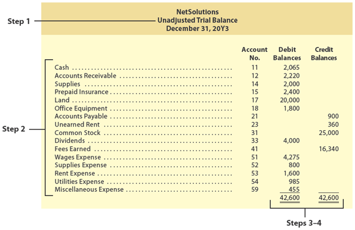

The trial balance shown in Exhibit 7 is titled an **unadjusted trial balance** (A trial balance prepared at the end of an accounting period before adjusting entries are made.). This is to distinguish it from other trial balances that will be prepared in later chapters. These other trial balances include an adjusted trial balance and a post-closing trial balance.

[El balance de comprobación mostrado en la Figura 7 se titula **balance de comprobación no ajustado** (un balance de comprobación preparado al final de un período contable antes de realizar los asientos de ajuste). Esto es para distinguirlo de otros balances de comprobación que se prepararán en capítulos posteriores. Estos otros balances de comprobación incluyen un balance de comprobación ajustado y un balance de comprobación posterior al cierre.]

---

<h1 id="988576" style="color:#E65100;">
  <a href="#Chapter_002" style="color:inherit; text-decoration:none;">
    2-4a Errors Affecting the Trial Balance
  </a>
</h1>


If the trial balance totals are not equal, an error has occurred. In this case, the error must be found and corrected. A method useful in discovering errors is as follows:

[Si los totales del balance de comprobación no son iguales, ha ocurrido un error. En este caso, el error debe encontrarse y corregirse. Un método útil para descubrir errores es el siguiente:]

**1.** If the difference between the Debit and Credit column totals is 10, 100, or 1,000, an error in addition may have occurred. In this case, re-add the trial balance column totals. If the error still exists, recompute the account balances.

[**1.** Si la diferencia entre los totales de las columnas Débito y Crédito es 10, 100 o 1,000, puede haber ocurrido un error de suma. En este caso, vuelva a sumar los totales de las columnas del balance de comprobación. Si el error aún existe, vuelva a calcular los saldos de las cuentas.]

**2.** If the difference between the Debit and Credit column totals can be evenly divisible by 2, the error may be due to the entering of a debit balance as a credit balance, or vice versa. In this case, review the trial balance for account balances of one-half the difference that may have been entered in the wrong column. For example, if the Debit column total is $20,640 and the Credit column total is $20,236, the difference of $404 ($20,640 - $20,236) may be due to a credit account balance of $202 that was entered as a debit account balance.

[**2.** Si la diferencia entre los totales de las columnas Débito y Crédito es divisible uniformemente por 2, el error puede deberse a haber ingresado un saldo deudor como saldo acreedor, o viceversa. En este caso, revise el balance de comprobación en busca de saldos de cuentas equivalentes a la mitad de la diferencia que puedan haber sido ingresados en la columna incorrecta. Por ejemplo, si el total de la columna Débito es $20,640 y el total de la columna Crédito es $20,236, la diferencia de $404 ($20,640 - $20,236) puede deberse a un saldo de cuenta acreedor de $202 que se ingresó como saldo deudor.]

**3.** If the difference between the Debit and Credit column totals is evenly divisible by 9, trace the account balances back to the ledger to see if an account balance was incorrectly copied from the ledger. Two common types of copying errors are **transpositions** and **slides**.

[**3.** Si la diferencia entre los totales de las columnas Débito y Crédito es divisible uniformemente por 9, rastree los saldos de las cuentas hasta el libro mayor para ver si algún saldo de cuenta se copió incorrectamente desde el libro mayor. Dos tipos comunes de errores de copiado son las **transposiciones** y los **desplazamientos** (errores de punto decimal).]

A **transposition** (An error in which the order of the digits is changed, such as writing $542 as $452 or $524.) occurs when the order of the digits is copied incorrectly, such as writing $542 as $452 or $524.

[Una **transposición** (un error en el que se cambia el orden de los dígitos, como escribir $542 como $452 o $524) ocurre cuando el orden de los dígitos se copia incorrectamente, como escribir $542 como $452 o $524.]

In a **slide** (An error in which the entire number is moved one or more spaces to the right or the left, such as writing $542.00 as $54.20 or $5,420.00.) the entire number is copied incorrectly one or more spaces to the right or the left, such as writing $542.00 as $54.20 or $5,420.00. In both cases, the resulting error will be evenly divisible by 9.

[En un **desplazamiento** (error de punto decimal) (un error en el que el número completo se mueve uno o más espacios a la derecha o a la izquierda, como escribir $542.00 como $54.20 o $5,420.00), el número completo se copia incorrectamente uno o más espacios a la derecha o a la izquierda, como escribir $542.00 como $54.20 o $5,420.00. En ambos casos, el error resultante será uniformemente divisible por 9.]

**4.** If the difference between the Debit and Credit column totals is not evenly divisible by 2 or 9, review the ledger to see if an account balance in the amount of the error has been omitted from the trial balance. If the error is not discovered, review the journal postings to see if a posting of a debit or credit may have been omitted.

[**4.** Si la diferencia entre los totales de las columnas Débito y Crédito no es divisible uniformemente por 2 o 9, revise el libro mayor para ver si se ha omitido del balance de comprobación algún saldo de cuenta por el monto del error. Si no se descubre el error, revise los traspasos del diario para ver si se ha omitido el traspaso de un débito o un crédito.]

**5.** If an error is not discovered by the preceding steps, the accounting process must be retraced, beginning with the last journal entry.

[**5.** Si no se descubre un error con los pasos anteriores, se debe retroceder en el proceso contable, comenzando con el último asiento de diario.]

The trial balance does not provide complete proof of the accuracy of the ledger. It indicates only that the debits and the credits are equal. This proof is of value, however, because errors often affect the equality of debits and credits.

[El balance de comprobación no proporciona una prueba completa de la exactitud del libro mayor. Solo indica que los débitos y los créditos son iguales. Esta comprobación tiene valor, sin embargo, porque los errores a menudo afectan la igualdad de débitos y créditos.]

---

<h1 id="839312" style="color:#E65100;">
  <a href="#Chapter_002" style="color:inherit; text-decoration:none;">
    2-4b Errors Not Affecting the Trial Balance
  </a>
</h1>


An error may occur that does not cause the trial balance totals to be unequal. Such an error may be discovered when preparing the trial balance or may be indicated by an unusual account balance. For example, a credit balance in the supplies account indicates an error has occurred. This is because a business cannot have "negative" supplies. When such errors are discovered, they should be corrected. If the error has already been journalized and posted to the ledger, a **correcting journal entry** (An entry that is prepared to correct an error to an entry that has already been journalized and posted.) is normally prepared.

[Puede ocurrir un error que no cause que los totales del balance de comprobación sean desiguales. Tal error puede descubrirse al preparar el balance de comprobación o puede ser indicado por un saldo de cuenta inusual. Por ejemplo, un saldo acreedor en la cuenta de suministros indica que ha ocurrido un error. Esto se debe a que una empresa no puede tener suministros "negativos". Cuando se descubren tales errores, deben corregirse. Si el error ya ha sido registrado en el diario y traspasado al libro mayor, normalmente se prepara un **asiento de diario de corrección** (un asiento que se prepara para corregir un error en un asiento que ya ha sido registrado en el diario y traspasado).]

To illustrate, assume that on May 5 a $12,500 purchase of office equipment for cash was incorrectly journalized and posted as a debit to Supplies and a credit to Cash for $12,500 as follows:

[Para ilustrar, suponga que el 5 de mayo una compra de equipo de oficina por $12,500 en efectivo se registró incorrectamente en el diario y se traspasó como un débito a Suministros y un crédito a Efectivo por $12,500 de la siguiente manera:]

| Date | Account | Debit | Credit |
|------|---------|-------|--------|
| May 5 | Supplies | 12,500 | |
| | Cash | | 12,500 |

The error was discovered on May 31. Before making a correcting journal entry, the journal entry that was made in error is compared to the entry that should have been made. By comparing these two journal entries, the correcting journal entry can be determined, as shown in Exhibit 8.

[El error se descubrió el 31 de mayo. Antes de hacer un asiento de diario de corrección, el asiento de diario que se hizo incorrectamente se compara con el asiento que debería haberse hecho. Al comparar estos dos asientos de diario, se puede determinar el asiento de diario de corrección, como se muestra en la Figura 8.]

---

## Exhibit 8

### Correcting Journal Entry

<!-- 📍 IMAGEN: Exhibit 8 - Correcting Journal Entry -->

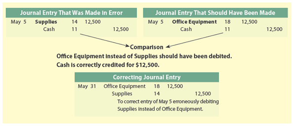

| Entry That Was Made | Entry That Should Have Been Made | Correcting Journal Entry |
|---------------------|--------------------------------|--------------------------|
| Supplies 12,500 | Office Equipment 12,500 | Office Equipment 12,500 |
| Cash 12,500 | Cash 12,500 | Supplies 12,500 |

*Explanation: To correct error in entry of May 5 (purchased office equipment recorded as supplies).*

Exhibit 8 indicates that the correcting journal entry debits Office Equipment and credits Supplies for $12,500. Because correcting journal entries are unusual, an explanation is often inserted below the correcting journal entry. After the correcting journal entry is posted, the office equipment and supplies accounts will have correct balances.

[La Figura 8 indica que el asiento de diario de corrección debita Equipo de Oficina y acredita Suministros por $12,500. Debido a que los asientos de diario de corrección son inusuales, a menudo se inserta una explicación debajo del asiento de diario de corrección. Después de que se traspasa el asiento de diario de corrección, las cuentas de equipo de oficina y suministros tendrán saldos correctos.]

---

## Check up Corner 2-3

### Trial Balance

The accounts of Simmons Urgent Care Inc. as of December 31, 20Y7, are listed in alphabetical order as follows. All accounts have normal balances.

[Las cuentas de Simmons Urgent Care Inc. al 31 de diciembre de 20Y7 se enumeran en orden alfabético a continuación. Todas las cuentas tienen saldos normales.]

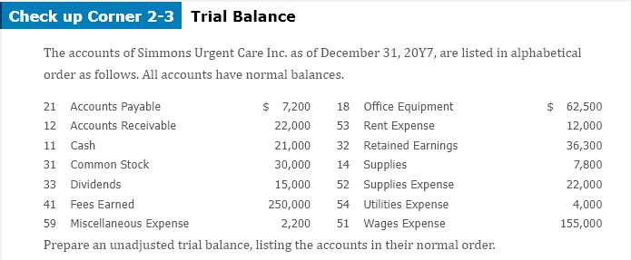</img>

| Account | Balance |
|---------|---------|
| Accounts Payable | $ 7,200 |
| Accounts Receivable | 22,000 |
| Cash | 21,000 |
| Common Stock | 30,000 |
| Dividends | 15,000 |
| Fees Earned | 250,000 |
| Miscellaneous Expense | 2,200 |
| Office Equipment | 62,500 |
| Rent Expense | 12,000 |
| Retained Earnings | 36,300 |
| Supplies | 7,800 |
| Supplies Expense | 22,000 |
| Utilities Expense | 4,000 |
| Wages Expense | 155,000 |

**Prepare an unadjusted trial balance, listing the accounts in their normal order.**

[**Prepare un balance de comprobación no ajustado, enumerando las cuentas en su orden normal.**]

---

### Solution - Check Up Corner 2-3

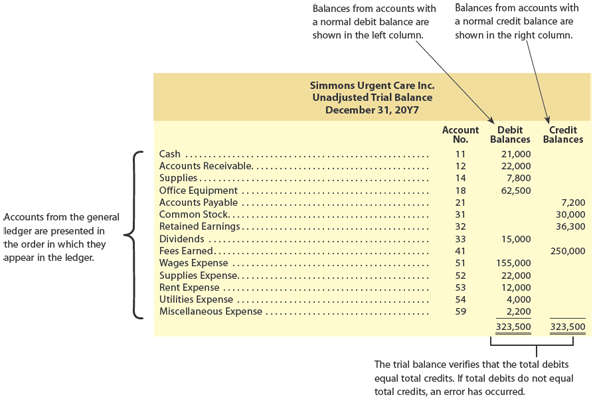</img>

#### Simmons Urgent Care Inc.
#### Unadjusted Trial Balance
#### December 31, 20Y7

| Account | Debit | Credit |
|---------|-------|--------|
| Cash | 21,000 | |
| Accounts Receivable | 22,000 | |
| Supplies | 7,800 | |
| Office Equipment | 62,500 | |
| Accounts Payable | | 7,200 |
| Common Stock | | 30,000 |
| Retained Earnings | | 36,300 |
| Dividends | 15,000 | |
| Fees Earned | | 250,000 |
| Wages Expense | 155,000 | |
| Rent Expense | 12,000 | |
| Supplies Expense | 22,000 | |
| Utilities Expense | 4,000 | |
| Miscellaneous Expense | 2,200 | |
| **Totals** | **323,500** | **323,500** |

---

## Analysis for Decision Making

### Horizontal Analysis

A single item in a financial statement, such as net income, is often useful in interpreting the financial performance of a company. However, a comparison with prior periods often makes the financial information even more useful. For example, comparing net income of the current period with the net income of the prior period will indicate whether the company's operating performance has improved.

[Un solo elemento en un estado financiero, como el ingreso neto, a menudo es útil para interpretar el desempeño financiero de una empresa. Sin embargo, una comparación con períodos anteriores a menudo hace que la información financiera sea aún más útil. Por ejemplo, comparar el ingreso neto del período actual con el ingreso neto del período anterior indicará si el desempeño operativo de la empresa ha mejorado.]

**Objective 5** - Describe and illustrate the use of horizontal analysis in evaluating a company's performance and financial condition.

[**Objetivo 5** - Describir e ilustrar el uso del análisis horizontal en la evaluación del desempeño y la condición financiera de una empresa.]

In **horizontal analysis** (Financial analysis that compares an item in a current statement with the same item in prior statements in terms of the amount and percentage of change.), the amount of each item on a current financial statement is compared with the same item on an earlier statement. The increase or decrease in the amount of the item is computed together with the percent of increase or decrease. When two statements are being compared, the earlier statement is used as the base for computing the amount and the percent of change.

[En el **análisis horizontal** (análisis financiero que compara una partida en un estado actual con la misma partida en estados anteriores en términos del monto y el porcentaje de cambio), el monto de cada partida en un estado financiero actual se compara con la misma partida en un estado anterior. El aumento o disminución en el monto de la partida se calcula junto con el porcentaje de aumento o disminución. Cuando se comparan dos estados, el estado anterior se utiliza como base para calcular el monto y el porcentaje de cambio.]

To illustrate, the horizontal analysis of two income statements for J. Holmes, Attorney-at-Law follows:

[Para ilustrar, a continuación se presenta el análisis horizontal de dos estados de resultados para J. Holmes, Abogado:]

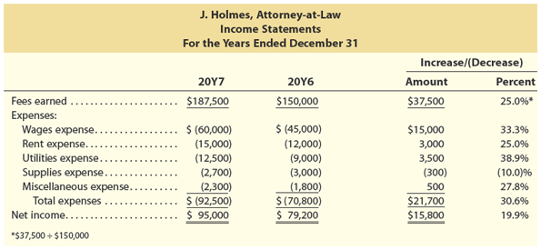</img>

| | 20Y6 | 20Y5 | Amount of Increase (Decrease) | Percent of Increase (Decrease) |
|------ |------|------|-------------------------------|-------------------------------|
| **Fees Earned** | $175,000 | $140,000 | $35,000 | 25.0% |
| **Operating Expenses:** | | | | |
| Wages Expense | 80,000 | 60,000 | 20,000 | 33.3% |
| Rent Expense | 25,000 | 20,000 | 5,000 | 25.0% |
| Utilities Expense | 12,500 | 9,000 | 3,500 | 38.9% |
| Supplies Expense | 5,000 | 6,000 | (1,000) | (16.7%) |
| Miscellaneous Expense | 3,000 | 2,000 | 1,000 | 50.0% |
| **Total Operating Expenses** | 125,500 | 97,000 | 28,500 | 29.4% |
| **Net Income** | $49,500 | $43,000 | $6,500 | 15.1% |

*(Nota: Los porcentajes en el ejemplo original del PDF pueden variar ligeramente; esta tabla refleja el cálculo correcto basado en los montos presentados.)*

The horizontal analysis for J. Holmes, Attorney-at-Law, indicates both favorable and unfavorable changes. The increase in fees earned of 25.0% is favorable as is the decrease in supplies expense. Unfavorable changes include the increase in wages expense, rent expense, utilities expense, and miscellaneous expense. These expenses increased the same as or faster than the increase in revenues, with total operating expenses increasing by 29.4%. Overall, net income increased by $6,500 or 15.1%, a favorable change.

[El análisis horizontal para J. Holmes, Abogado, indica cambios tanto favorables como desfavorables. El aumento en los ingresos por servicios del 25.0% es favorable, al igual que la disminución en el gasto de suministros. Los cambios desfavorables incluyen el aumento en el gasto de sueldos, gasto de renta, gasto de servicios públicos y gasto misceláneo. Estos gastos aumentaron igual o más rápido que el aumento en los ingresos, con un aumento total de los gastos operativos del 29.4%. En general, el ingreso neto aumentó en $6,500 o 15.1%, un cambio favorable.]

The significance of the various increases and decreases in the revenue and expense items should be investigated to see if operations could be further improved. For example, the increase in utilities expense of 38.9% was the result of renting additional office space for use by a part-time law student in performing paralegal services. This explains the increase in rent expense of 25.0% and the increase in wages expense of 33.3%. The increase in revenues of 25.0% reflects the fees generated by the new paralegal.

[La importancia de los diversos aumentos y disminuciones en las partidas de ingresos y gastos debe investigarse para ver si las operaciones podrían mejorarse aún más. Por ejemplo, el aumento en el gasto de servicios públicos del 38.9% fue el resultado de alquilar espacio de oficina adicional para que lo usara un estudiante de derecho a tiempo parcial en la realización de servicios de paralegal. Esto explica el aumento en el gasto de renta del 25.0% y el aumento en el gasto de sueldos del 33.3%. El aumento en los ingresos del 25.0% refleja los honorarios generados por el nuevo paralegal.]

The preceding example illustrates how horizontal analysis can be useful in interpreting and analyzing the income statement. Horizontal analyses can also be performed for the balance sheet, the statement of stockholders' equity, and the statement of cash flows.

[El ejemplo anterior ilustra cómo el análisis horizontal puede ser útil para interpretar y analizar el estado de resultados. Los análisis horizontales también se pueden realizar para el balance general, el estado de cambios en el patrimonio neto y el estado de flujos de efectivo.]

---

## Horizontal Analysis

- Analyze Amazon.com (MAD 2-1) (Continuing company analysis)
- Analyze Chipotle Mexican Grill (MAD 2-2)
- Analyze Vera Bradley, Inc. (MAD 2-3)
- Analyze Target (MAD 2-4)
- Analyze Walmart (MAD 2-5)
- Compare Target and Walmart (MAD 2-6)

---

<h1 id="905868" style="color:#E65100;">
  <a href="#Chapter_002" style="color:inherit; text-decoration:none;">
    2-5a Let’s Review Chapter Summary
  </a>
</h1>

[2-5 Capítulo Revisión - 2-5a Revisemos Resumen del Capítulo]

**1.** The simplest form of an account, a T account, has three parts: (1) a title, which is the name of the item recorded in the account; (2) a left side, called the debit side; and (3) a right side, called the credit side. Periodically, the debits in an account are added, the credits in the account are added, and the balance of the account is determined. The system of accounts that make up a ledger is called a chart of accounts.

[**1.** La forma más simple de una cuenta, una cuenta T, tiene tres partes: (1) un título, que es el nombre de la partida registrada en la cuenta; (2) un lado izquierdo, llamado lado débito; y (3) un lado derecho, llamado lado crédito. Periódicamente, se suman los débitos en una cuenta, se suman los créditos en la cuenta y se determina el saldo de la cuenta. El sistema de cuentas que componen un libro mayor se llama catálogo de cuentas.]

**2.** Transactions are initially entered in a record called a journal. The rules of debit and credit for recording increases or decreases in accounts are shown in Exhibit 3. Each transaction is recorded so that the sum of the debits is always equal to the sum of the credits. The normal balance of an account is indicated by the side of the account (debit or credit) that receives the increases.

[**2.** Las transacciones se registran inicialmente en un registro llamado diario. Las reglas de débito y crédito para registrar aumentos o disminuciones en las cuentas se muestran en la Figura 3. Cada transacción se registra de modo que la suma de los débitos sea siempre igual a la suma de los créditos. El saldo normal de una cuenta está indicado por el lado de la cuenta (débito o crédito) que recibe los aumentos.]

**3.** Transactions are journalized and posted to the ledger using the rules of debit and credit. The debits and credits for each journal entry are posted to the accounts in the order in which they occur in the journal.

[**3.** Las transacciones se registran en el diario y se traspasan al libro mayor utilizando las reglas de débito y crédito. Los débitos y créditos de cada asiento de diario se traspasan a las cuentas en el orden en que ocurren en el diario.]

**4.** A trial balance is prepared by listing the accounts from the ledger and their balances. The totals of the Debit column and Credit column of the trial balance must be equal. If the two totals are not equal, an error has occurred. Errors may occur even though the trial balance totals are equal. Such errors may require a correcting journal entry.

[**4.** Se prepara un balance de comprobación enumerando las cuentas del libro mayor y sus saldos. Los totales de la columna Débito y la columna Crédito del balance de comprobación deben ser iguales. Si los dos totales no son iguales, ha ocurrido un error. Pueden ocurrir errores incluso cuando los totales del balance de comprobación son iguales. Dichos errores pueden requerir un asiento de diario de corrección.]

**5.** In horizontal analysis, the amount of each item on a current financial statement is compared with the same item on an earlier statement. The increase or decrease in the amount of the item is computed together with the percent of increase or decrease. When two statements are being compared, the earlier statement is used as the base for computing the amount and the percent of change. Horizontal analysis can be performed on any of the four financial statements.

[**5.** En el análisis horizontal, el monto de cada partida en un estado financiero actual se compara con la misma partida en un estado anterior. El aumento o disminución en el monto de la partida se calcula junto con el porcentaje de aumento o disminución. Cuando se comparan dos estados, el estado anterior se utiliza como base para calcular el monto y el porcentaje de cambio. El análisis horizontal se puede realizar en cualquiera de los cuatro estados financieros.]

---

<h1 id="416104" style="color:#E65100;">
  <a href="#Chapter_002" style="color:inherit; text-decoration:none;">
    2-5b Key Terms
  </a>
</h1>

## 2-5b Key Terms

| English Term | Español | Definition (English) | Definición (Español) |
|--------------|---------|---------------------|---------------------|
| **account** | cuenta | An accounting form used to record the increases and decreases in each financial statement item. | Forma contable utilizada para registrar los aumentos y disminuciones en cada partida del estado financiero. |
| **account receivable** | cuenta por cobrar | (No definition provided in original) | (No se proporcionó definición en el original) |
| **assets** | activos | (No definition provided in original) | (No se proporcionó definición en el original) |
| **balance of the account** | saldo de la cuenta | The amount of the difference between the debits and the credits that have been entered into an account. | El monto de la diferencia entre los débitos y los créditos que se han ingresado en una cuenta. |
| **chart of accounts** | catálogo de cuentas | A list of the accounts in the ledger. | Una lista de las cuentas en el libro mayor. |
| **common stock** | acciones comunes | (No definition provided in original) | (No se proporcionó definición en el original) |
| **correcting journal entry** | asiento de diario de corrección | An entry that is prepared to correct an error to an entry that has already been journalized and posted. | Un asiento que se prepara para corregir un error en un asiento que ya ha sido registrado en el diario y traspasado. |
| **credit** | crédito | Amount entered on the right side of an account. | Monto ingresado en el lado derecho de una cuenta. |
| **debit** | débito | Amount entered on the left side of an account. | Monto ingresado en el lado izquierdo de una cuenta. |
| **dividends** | dividendos | (No definition provided in original) | (No se proporcionó definición en el original) |
| **double-entry accounting system** | sistema de contabilidad de partida doble | A system of accounting for recording transactions, based on recording increases and decreases in accounts so that debits equal credits. | Un sistema de contabilidad para registrar transacciones, basado en registrar aumentos y disminuciones en las cuentas de modo que los débitos sean iguales a los créditos. |
| **expenses** | gastos | (No definition provided in original) | (No se proporcionó definición en el original) |
| **four-column account** | cuenta de cuatro columnas | A form of account that has Debit and Credit columns for recording transactions as well as Balance (Debit and Credit) columns for indicating the account balance after each transaction. | Una forma de cuenta que tiene columnas de Débito y Crédito para registrar transacciones, así como columnas de Saldo (Débito y Crédito) para indicar el saldo de la cuenta después de cada transacción. |
| **horizontal analysis** | análisis horizontal | Financial analysis that compares an item in a current statement with the same item in prior statements in terms of the amount and percentage of change. | Análisis financiero que compara una partida en un estado actual con la misma partida en estados anteriores en términos del monto y el porcentaje de cambio. |
| **journal** | diario | The initial record in which the effects of a transaction are recorded. | El registro inicial en el cual se registran los efectos de una transacción. |
| **journal entry** | asiento de diario | The record of a transaction entered in a journal, made up of at least one debit and one credit. | El registro de una transacción ingresada en un diario, compuesto por al menos un débito y un crédito. |
| **journalizing** | registro en el diario | The process of recording a transaction in a journal. | El proceso de registrar una transacción en un diario. |
| **ledger** | libro mayor | A group of accounts for a business. | Un grupo de cuentas para un negocio. |
| **liabilities** | pasivos | (No definition provided in original) | (No se proporcionó definición en el original) |
| **normal balance of an account** | saldo normal de una cuenta | The side of an account (debit or credit) in which the balance normally appears based on the type of account and whether it is increased by debits or credits. | El lado de una cuenta (débito o crédito) en el que el saldo aparece normalmente según el tipo de cuenta y si esta aumenta con débitos o créditos. |
| **posting** | traspaso | The process of transferring the debits and credits from the journal entries to the accounts. | El proceso de transferir los débitos y créditos de los asientos de diario a las cuentas. |
| **prepaid expenses** | gastos pagados por adelantado | (No definition provided in original) | (No se proporcionó definición en el original) |
| **retained earnings** | ganancias retenidas | (No definition provided in original) | (No se proporcionó definición en el original) |
| **revenues** | ingresos | (No definition provided in original) | (No se proporcionó definición en el original) |
| **rules of debit and credit** | reglas de débito y crédito | In the double-entry accounting system, specific rules for recording debits and credits based on the type of account. | En el sistema de contabilidad de partida doble, reglas específicas para registrar débitos y créditos según el tipo de cuenta. |
| **slide** | deslizamiento (error de punto decimal) | An error in which the entire number is moved one or more spaces to the right or the left, such as writing $542.00 as $54.20 or $5,420.00. | Un error en el que el número completo se mueve uno o más espacios a la derecha o a la izquierda, como escribir $542.00 como $54.20 o $5,420.00. |
| **stockholders' equity** | capital contable | (No definition provided in original) | (No se proporcionó definición en el original) |
| **T account** | cuenta T | The simplest form of an account, which consists of an account title, a debit side, and a credit side. | La forma más simple de una cuenta, que consiste en un título de cuenta, un lado de débito y un lado de crédito. |
| **transposition** | transposición | An error in which the order of the digits is changed, such as writing $542 as $452 or $524. | Un error en el que se cambia el orden de los dígitos, como escribir $542 como $452 o $524. |
| **trial balance** | balance de comprobación | A summary listing of the titles and balances of accounts in the ledger, which is used to verify that debits equal credits. | Un listado resumido de los títulos y saldos de las cuentas en el libro mayor, que se utiliza para verificar que los débitos sean iguales a los créditos. |
| **two-column journal** | diario de dos columnas | A form of journal in which there are only two amount columns, one for debits and one for credits. | Una forma de diario en la que solo hay dos columnas de montos, una para débitos y otra para créditos. |
| **unadjusted trial balance** | balance de comprobación no ajustado | A trial balance prepared at the end of an accounting period before adjusting entries are made. | Un balance de comprobación preparado al final de un período contable antes de realizar los asientos de ajuste. |
| **unearned revenue** | ingreso no devengado (ingreso diferido) | The liability created by receiving revenue in advance. | El pasivo creado al recibir ingresos por adelantado. |

---
