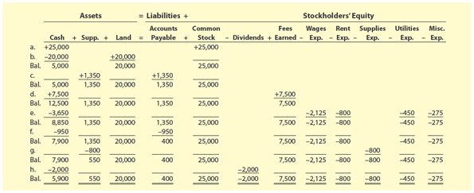
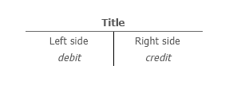
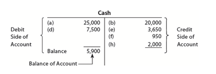
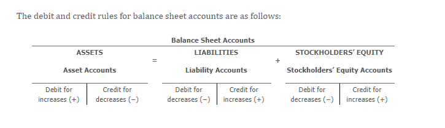
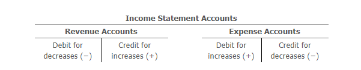

<h1 id="Chapter_002" style="color:#42A5F5;">Indice</h1>

##### [Capitulo 2-1 Using Accounts to Record Transactions [Usando Cuentas para Registrar Transacciones]](#675031)

##### [Capitulo 2-1a Chart of Accounts [Catálogo de Cuentas]](#036422)

##### [Capitulo 2-2 Double-Entry Accounting System [Sistema de Contabilidad de Partida Doble]](#634405)

##### [Capitulo 2-2a Balance Sheet Accounts [Cuentas del Balance General]](#237274)

##### [Capitulo 2-2b Income Statement Accounts [Cuentas del Estado de Resultados]](#628626)

<h1 id="675031" style="color:#E65100;">
  <a href="#Chapter_002" style="color:inherit; text-decoration:none;">
    2-1 Using Accounts to Record Transactions [Usando Cuentas para Registrar Transacciones]
  </a>
</h1>

In Chapter 1, the November transactions for NetSolutions were recorded using the accounting equation format shown in Exhibit 1. However, this format is not efficient or practical for companies that have to record thousands or millions of transactions daily. As a result, accounting systems are designed to show the increases and decreases in each accounting equation element as a separate record. This record is called an **account** (An accounting form used to record the increases and decreases in each financial statement item.)
[En el Capítulo 1, las transacciones de noviembre de NetSolutions se registraron utilizando el formato de ecuación contable mostrado en la Figura 1. Sin embargo, este formato no es eficiente ni práctico para empresas que tienen que registrar miles o millones de transacciones diariamente. Como resultado, los sistemas contables están diseñados para mostrar los aumentos y disminuciones en cada elemento de la ecuación contable como un registro separado. Este registro se llama **cuenta** (Una forma contable utilizada para registrar los aumentos y disminuciones en cada elemento del estado financiero).]

---

## Exhibit 1 [Figura 1]

### NetSolutions' November Transactions [Transacciones de noviembre de NetSolutions]



|      | Cash   | Supp.  | Land   | Accounts Payable | Common Stock | Dividends | Fees Earned | Wages Exp. | Rent Exp. | Supplies Exp. | Utilities Exp. | Misc. Exp. |
|------|--------|--------|--------|------------------|---------------|------------|-------------|-------------|-------------|----------------|----------------|--------------|
| a.   | 25,000 |        |        |                  |               |            | +25,000     |             |             |                |                |              |
| b.   | -20,000| +20,000|        |                  |               |            |             |             |             |                |                |              |
| c.   | -5,000 |        | +5,000 |                  |               |            |             |             |             |                |                |              |
| d.   |        | +1,350 |        | +1,350           |               |            |             |             |             |                |                |              |
|      |        |        |        |                  | 25,000        |            |             |             |             |                |                |              |
| Bal. | 5,000  | 1,350  | 20,000 | 1,350            | 25,000        |            |             |             |             |                |                |              |
| e.   | +7,500 |        |        |                  |               |            | +7,500      |             |             |                |                |              |
| Bal. | 12,500 | 1,350  | 20,000 | 1,350            | 25,000        |            | 7,500       |             |             |                |                |              |
| f.   | -3,650 |        |        |                  |               |            |             | -2,125      | -800        |                | -450           | -275         |
| g.   | -8,850 | +1,350 | 20,000 | +1,350           | 25,000        |            | 7,500       | -2,125      | -800        |                | -450           | -275         |
| h.   | -950   |        |        | -950             |               |            |             |             |             |                |                |              |
| i.   | +400   | +1,350 | 20,000 | +400             | 25,000        |            | 7,500       | -2,125      | -800        |                | -450           | -275         |
| j.   | -2,000 |        |        |                  |               | -2,000     |             |             |             |                |                |              |
| Bal. | 7,900  | 550    | 20,000 | 400              | 25,000        |            | 7,500       | -2,125      | -800        | -800           | -450           | -275         |
| k.   | -2,000 |        |        |                  |               | -2,000     |             |             |             |                |                |              |
| Bal. | 5,900  | 550    | 20,000 | 400              | 25,000        | -2,000     | 7,500       | -2,125      | -800        | -800           | -450           | -275         |

To illustrate, the Cash column of Exhibit 1 records the increases and decreases in cash. Likewise, the other columns in Exhibit 1 record the increases and decreases in the other accounting equation elements. Each of these columns can be organized into a separate account.
[Para ilustrar, la columna de Efectivo de la Figura 1 registra los aumentos y disminuciones en efectivo. Del mismo modo, las otras columnas de la Figura 1 registran los aumentos y disminuciones en los otros elementos de la ecuación contable. Cada una de estas columnas puede organizarse en una cuenta separada.]

An account, in its simplest form, has three parts:
[Una cuenta, en su forma más simple, tiene tres partes:]

- A title, which is the name of the accounting equation element recorded in the account [Un título, que es el nombre del elemento de la ecuación contable registrado en la cuenta]
- A space for recording increases in the amount of the element [Un espacio para registrar aumentos en el monto del elemento]
- A space for recording decreases in the amount of the element [Un espacio para registrar disminuciones en el monto del elemento]

---

## The T Account [La Cuenta T]

The account form that follows is called a **T account** (The simplest form of an account, which consists of an account title, a debit side, and a credit side.) because it resembles the letter T. The left side of the account is called the **debit side**, and the right side is called the **credit side**.
[La forma de cuenta que sigue se llama **cuenta T** (La forma más simple de una cuenta, que consiste en un título de cuenta, un lado de débito y un lado de crédito.) porque se parece a la letra T. El lado izquierdo de la cuenta se llama **lado de débito**, y el lado derecho se llama **lado de crédito**.]



| Title      |        |
| ---------- | ------ |
| Left side  | Right side   |
| Debit| Credit |


The amounts shown in the Cash column of Exhibit 1 would be recorded in a cash account as follows:
[Los montos mostrados en la columna de Efectivo de la Figura 1 se registrarían en una cuenta de efectivo de la siguiente manera:]

> **Note [Nota]:** Amounts entered on the left side of an account are **debits**, and amounts entered on the right side of an account are **credits**.
> [Los montos ingresados en el lado izquierdo de una cuenta son **débitos**, y los montos ingresados en el lado derecho de una cuenta son **créditos**.]



### Cash

| Debit Side of Account  | Credit Side of Account |
|----------------------|------------------------|
|(a) 25,000            |        (b) 20,000      |
|(d) 7,500             |        (e) 3,650       |
|                      |        (f) 950         |
|                      |        (h) 2,000       |
 **Balance** **5,900** |                        | 

---

## Rules for Recording Transactions [Reglas para Registrar Transacciones]

Recording transactions in accounts must follow certain rules. For example, **increases in assets are recorded on the debit** (Amount entered on the left side of an account.) (left side) of an account. Likewise, **decreases in assets are recorded on the credit** (Amount entered on the right side of an account.) (right side) of an account. The excess of the debits of an asset account over its credits is the **balance of the account** (The amount of the difference between the debits and the credits that have been entered into an account.)
[El registro de transacciones en cuentas debe seguir ciertas reglas. Por ejemplo, **los aumentos en activos se registran en el débito** (Monto ingresado en el lado izquierdo de una cuenta.) (lado izquierdo) de una cuenta. Del mismo modo, **las disminuciones en activos se registran en el crédito** (Monto ingresado en el lado derecho de una cuenta.) (lado derecho) de una cuenta. El exceso de los débitos de una cuenta de activo sobre sus créditos es el **saldo de la cuenta** (El monto de la diferencia entre los débitos y los créditos que se han ingresado en una cuenta).]

To illustrate, the receipt (increase in Cash) of $25,000 in transaction (a) is entered on the debit (left) side of the cash account. The letter or date of the transaction is also entered into the account. That way, if any questions later arise related to the entry, the entry can be traced back to the underlying transaction data. In contrast, the payment (decrease in Cash) of $20,000 to purchase land in transaction (b) is entered on the credit (right) side of the account.
[Para ilustrar, la recepción (aumento en Efectivo) de $25,000 en la transacción (a) se ingresa en el lado de débito (izquierdo) de la cuenta de efectivo. La letra o fecha de la transacción también se ingresa en la cuenta. De esa manera, si surgen preguntas más adelante relacionadas con el asiento, el asiento puede rastrearse hasta los datos de la transacción subyacente. En contraste, el pago (disminución en Efectivo) de $20,000 para comprar terreno en la transacción (b) se ingresa en el lado de crédito (derecho) de la cuenta.]

---

### Cash Account Balance Calculation [Cálculo del Saldo de la Cuenta de Efectivo]

The balance of the cash account of $5,900 is the excess of the debits over the credits, computed as follows:
[El saldo de la cuenta de efectivo de $5,900 es el exceso de los débitos sobre los créditos, calculado de la siguiente manera:]

$$
\text{Debits} = \$25,000 + \$7,500 = \$32,500
$$

$$
\text{Débitos} = \$25,000 + \$7,500 = \$32,500
$$

$$
\text{Credits} = \$20,000 + \$3,650 + \$950 + \$2,000 = \$26,600
$$

$$
\text{Créditos} = \$20,000 + \$3,650 + \$950 + \$2,000 = \$26,600
$$

$$
\text{Balance of Cash as of November 30, 20Y3} = \$32,500 - \$26,600 = \$5,900
$$

$$
\text{Saldo de Efectivo al 30 de noviembre de 20Y3} = \$32,500 - \$26,600 = \$5,900
$$

The balance of the cash account is inserted in the account, in the Debit column. In this way, the balance is identified as a **debit balance**. This balance represents NetSolutions' cash on hand as of November 30, 20Y3. This balance of $5,900 is reported on the November 30, 20Y3, balance sheet for NetSolutions as shown in Exhibit 8 of Chapter 1.
[El saldo de la cuenta de efectivo se inserta en la cuenta, en la columna de Débito. De esta manera, el saldo se identifica como un **saldo deudor**. Este saldo representa el efectivo disponible de NetSolutions al 30 de noviembre de 20Y3. Este saldo de $5,900 se reporta en el balance general del 30 de noviembre de 20Y3 para NetSolutions como se muestra en la Figura 8 del Capítulo 1.]

---

## Link to Apple [Enlace a Apple]

On a recent balance sheet, Apple Inc. reported **$48.8 billion of cash**.
[En un balance general reciente, Apple Inc. reportó **$48.8 mil millones de efectivo**].

---

## T Accounts vs. Formal Accounts [Cuentas T vs. Cuentas Formales]

In an actual accounting system, a more formal account form replaces the T account. Later in this chapter, a four-column account is illustrated. The T account, however, is a simple way to illustrate the effects of transactions on accounts and financial statements. For this reason, T accounts are often used in business to explain transactions.
[En un sistema contable real, una forma de cuenta más formal reemplaza a la cuenta T. Más adelante en este capítulo, se ilustra una cuenta de cuatro columnas. Sin embargo, la cuenta T es una forma sencilla de ilustrar los efectos de las transacciones en las cuentas y los estados financieros. Por esta razón, las cuentas T se utilizan a menudo en los negocios para explicar transacciones.]

Each of the columns in Exhibit 1 can be converted into an account form in a similar manner as was done for the Cash column of Exhibit 1. However, as mentioned earlier, recording increases and decreases in accounts must follow certain rules. These rules are discussed after the chart of accounts is described.
[Cada una de las columnas de la Figura 1 puede convertirse en una forma de cuenta de manera similar a como se hizo para la columna de Efectivo de la Figura 1. Sin embargo, como se mencionó anteriormente, registrar aumentos y disminuciones en cuentas debe seguir ciertas reglas. Estas reglas se discuten después de que se describe el catálogo de cuentas.]

---

## Key Terms [Términos Clave]

| English [Inglés] | Español [Español] |
|------------------|-------------------|
| Account | Cuenta |
| T account | Cuenta T |
| Debit | Débito |
| Credit | Crédito |
| Balance of the account | Saldo de la cuenta |
| Debit balance | Saldo deudor |
| Credit balance | Saldo acreedor |
| Chart of accounts | Catálogo de cuentas |

---

## Key Rules Summary [Resumen de Reglas Clave]

| Element [Elemento] | Increase [Aumento] | Decrease [Disminución] |
|--------------------|--------------------|------------------------|
| Assets [Activos] | Debit [Débito] | Credit [Crédito] |
| Liabilities [Pasivos] | Credit [Crédito] | Debit [Débito] |
| Stockholders' Equity [Patrimonio] | Credit [Crédito] | Debit [Débito] |

---

## Cash Account T Account Example [Ejemplo de Cuenta T de Efectivo]

```
                    Cash [Efectivo]
        Debit (Débito)      |  Credit (Crédito)
        (a)  25,000         |     (b)  20,000
        (d)   7,500         |     (e)   3,650
                            |     (f)     950
                            |     (h)   2,000
        -----------------------------------------
        Total  32,500       |    Total  26,600
        Balance  5,900      |
```

---

## Summary [Resumen]

- An **account** is a record used to track increases and decreases in each element of the accounting equation.
- A **T account** is a simplified version with a debit (left) side and a credit (right) side.
- **Debits** are entered on the left side; **credits** are entered on the right side.
- The **balance** of an account is the difference between total debits and total credits.
- Assets normally have a **debit balance** (debits > credits).
- The T account format is useful for visualizing transactions but is replaced by more formal accounts in actual accounting systems.

---

<h1 id="036422" style="color:#E65100;">
  <a href="#Chapter_002" style="color:inherit; text-decoration:none;">
    2-1a Chart of Accounts [Catálogo de Cuentas]
  </a>
</h1>


A group of accounts for a business entity is called a **ledger** (A group of accounts for a business.). A list of the accounts in the ledger is called a **chart of accounts** (A list of the accounts in the ledger). The accounts are normally listed in the order in which they appear in the financial statements. The balance sheet accounts are listed first, in the order of assets, liabilities, and stockholders' equity. The income statement accounts are then listed in the order of revenues and expenses.
[Un grupo de cuentas para una entidad comercial se llama **libro mayor** (Un grupo de cuentas para un negocio). Una lista de las cuentas en el libro mayor se llama **catálogo de cuentas** (Una lista de las cuentas en el libro mayor). Las cuentas normalmente se enumeran en el orden en que aparecen en los estados financieros. Las cuentas del balance general se enumeran primero, en el orden de activos, pasivos y patrimonio de los accionistas. Luego se enumeran las cuentas del estado de resultados en el orden de ingresos y gastos.]

---

## Assets [Activos]

Assets are resources owned by the business entity. These resources can be physical items, such as cash and supplies, or intangibles that have value. Examples of intangible assets include patent rights, copyrights, and trademarks. Assets also include accounts receivable, prepaid expenses (such as insurance), buildings, equipment, and land.
[Los activos son recursos propiedad de la entidad comercial. Estos recursos pueden ser elementos físicos, como efectivo y suministros, o intangibles que tienen valor. Ejemplos de activos intangibles incluyen derechos de patente, derechos de autor y marcas registradas. Los activos también incluyen cuentas por cobrar, gastos pagados por adelantado (como seguros), edificios, equipo y terreno.]

---

## Liabilities [Pasivos]

Liabilities are debts owed to outsiders (creditors). Liabilities are often identified on the balance sheet by titles that include payable. Examples of liabilities include accounts payable, notes payable, and wages payable. Cash received before services are delivered creates a liability to perform the services. These future service commitments are called unearned revenues. Examples of unearned revenues include magazine subscriptions received by a publisher and tuition received at the beginning of a term by a college.
[Los pasivos son deudas con terceros (acreedores). Los pasivos a menudo se identifican en el balance general por títulos que incluyen "por pagar". Ejemplos de pasivos incluyen cuentas por pagar, documentos por pagar y salarios por pagar. El efectivo recibido antes de que se entreguen los servicios crea una obligación de realizar los servicios. Estos compromisos de servicio futuro se llaman ingresos no devengados. Ejemplos de ingresos no devengados incluyen suscripciones de revistas recibidas por un editor y matrícula recibida al comienzo de un período por una universidad.]

---

## Stockholders' Equity [Patrimonio de los Accionistas]

Stockholders' equity is the stockholders' right to the assets of the business. Stockholders' equity is represented by the balance of the common stock and retained earnings accounts. A dividends account represents distributions of earnings to stockholders.
[El patrimonio de los accionistas es el derecho de los accionistas a los activos del negocio. El patrimonio de los accionistas está representado por el saldo de las cuentas de acciones comunes y ganancias retenidas. Una cuenta de dividendos representa las distribuciones de ganancias a los accionistas.]

---

## Revenues [Ingresos]

Revenues are increases in assets and stockholders' equity as a result of selling services or products to customers. Examples of revenues include fees earned, fares earned, commissions revenue, and rent revenue.
[Los ingresos son aumentos en los activos y el patrimonio de los accionistas como resultado de vender servicios o productos a los clientes. Ejemplos de ingresos incluyen honorarios ganados, tarifas ganadas, ingresos por comisiones e ingresos por alquiler.]

---

## Expenses [Gastos]

Expenses result from using up assets or consuming services in the process of generating revenues. Examples of expenses include wages expense, rent expense, utilities expense, supplies expense, and miscellaneous expense.
[Los gastos resultan del uso de activos o del consumo de servicios en el proceso de generar ingresos. Ejemplos de gastos incluyen gastos de salarios, gastos de alquiler, gastos de servicios públicos, gastos de suministros y gastos varios.]

---

## Illustration of Chart of Accounts [Ilustración del Catálogo de Cuentas]

A chart of accounts should meet the needs of a company's managers and other users of its financial statements. The accounts within the chart of accounts are numbered for use as references. A numbering system is normally used, so that new accounts can be added without affecting other account numbers.
[Un catálogo de cuentas debe satisfacer las necesidades de los gerentes de una empresa y otros usuarios de sus estados financieros. Las cuentas dentro del catálogo de cuentas están numeradas para su uso como referencias. Normalmente se utiliza un sistema de numeración, para que se puedan agregar nuevas cuentas sin afectar otros números de cuenta.]

**Exhibit 2** is NetSolutions' chart of accounts that is used in this chapter. Additional accounts will be introduced in later chapters. In Exhibit 2, each account number has two digits. The first digit indicates the major account group of the ledger in which the account is located. Accounts beginning with 1 represent assets; 2, liabilities; 3, stockholders' equity; 4, revenue; and 5, expenses. The second digit indicates the location of the account within its group.
[La **Figura 2** es el catálogo de cuentas de NetSolutions que se utiliza en este capítulo. Se introducirán cuentas adicionales en capítulos posteriores. En la Figura 2, cada número de cuenta tiene dos dígitos. El primer dígito indica el grupo de cuentas principal del libro mayor en el que se encuentra la cuenta. Las cuentas que comienzan con 1 representan activos; 2, pasivos; 3, patrimonio de los accionistas; 4, ingresos; y 5, gastos. El segundo dígito indica la ubicación de la cuenta dentro de su grupo.]

---

## Exhibit 2 [Figura 2]

### Chart of Accounts for NetSolutions [Catálogo de Cuentas para NetSolutions]

| Account Number [Número de Cuenta] | Account Name [Nombre de la Cuenta] | Account Group [Grupo de Cuenta] |
|-----------------------------------|-------------------------------------|--------------------------------|
| | **1. Assets [Activos]** | |
| 11 | Cash [Efectivo] | Asset |
| 12 | Accounts Receivable [Cuentas por Cobrar] | Asset |
| 14 | Supplies [Suministros] | Asset |
| 15 | Prepaid Insurance [Seguro Pagado por Adelantado] | Asset |
| 17 | Land [Terreno] | Asset |
| 18 | Office Equipment [Equipo de Oficina] | Asset |
| | | |
| | **2. Liabilities [Pasivos]** | |
| 21 | Accounts Payable [Cuentas por Pagar] | Liability |
| 23 | Unearned Rent [Alquiler No Devengado] | Liability |
| | | |
| | **3. Stockholders' Equity [Patrimonio de los Accionistas]** | |
| 31 | Common Stock [Acciones Comunes] | Equity |
| 32 | Retained Earnings [Ganancias Retenidas] | Equity |
| 33 | Dividends [Dividendos] | Equity |
| | | |
| | **4. Revenue [Ingresos]** | |
| 41 | Fees Earned [Honorarios Ganados] | Revenue |
| | | |
| | **5. Expenses [Gastos]** | |
| 51 | Wages Expense [Gastos de Salarios] | Expense |
| 52 | Supplies Expense [Gasto de Suministros] | Expense |
| 53 | Rent Expense [Gasto de Alquiler] | Expense |
| 54 | Utilities Expense [Gasto de Servicios Públicos] | Expense |
| 59 | Miscellaneous Expense [Gastos Varios] | Expense |

---

## Summary of Account Numbering System [Resumen del Sistema de Numeración de Cuentas]

| First Digit [Primer Dígito] | Account Group [Grupo de Cuenta] |
|-----------------------------|--------------------------------|
| 1 | Assets [Activos] |
| 2 | Liabilities [Pasivos] |
| 3 | Stockholders' Equity [Patrimonio de los Accionistas] |
| 4 | Revenue [Ingresos] |
| 5 | Expenses [Gastos] |

---

## Accounts Added for December Transactions [Cuentas Agregadas para las Transacciones de Diciembre]

Each of the columns in Exhibit 1 has been assigned an account number in the chart of accounts shown in Exhibit 2. In addition, the following accounts have been added:
[Cada una de las columnas de la Figura 1 ha sido asignada a un número de cuenta en el catálogo de cuentas mostrado en la Figura 2. Además, se han agregado las siguientes cuentas:]

- Accounts Receivable [Cuentas por Cobrar]
- Prepaid Insurance [Seguro Pagado por Adelantado]
- Office Equipment [Equipo de Oficina]
- Unearned Rent [Alquiler No Devengado]
- Retained Earnings [Ganancias Retenidas]

These accounts will be used in recording NetSolutions' December transactions.
[Estas cuentas se utilizarán para registrar las transacciones de diciembre de NetSolutions.]

---

## Key Terms [Términos Clave]

| English [Inglés] | Español [Español] |
|------------------|-------------------|
| Ledger | Libro mayor |
| Chart of accounts | Catálogo de cuentas |
| Unearned revenues | Ingresos no devengados |
| Dividends account | Cuenta de dividendos |

---

## Key Rules Summary [Resumen de Reglas Clave]

| Account Group [Grupo de Cuenta] | Increase [Aumento] | Decrease [Disminución] | Normal Balance [Saldo Normal] |
|--------------------------------|--------------------|------------------------|-------------------------------|
| Assets [Activos] | Debit [Débito] | Credit [Crédito] | Debit [Débito] |
| Liabilities [Pasivos] | Credit [Crédito] | Debit [Débito] | Credit [Crédito] |
| Stockholders' Equity [Patrimonio] | Credit [Crédito] | Debit [Débito] | Credit [Crédito] |
| Revenue [Ingresos] | Credit [Crédito] | Debit [Débito] | Credit [Crédito] |
| Expenses [Gastos] | Debit [Débito] | Credit [Crédito] | Debit [Débito] |
| Dividends [Dividendos] | Debit [Débito] | Credit [Crédito] | Debit [Débito] |

---

<h1 id="634405" style="color:#E65100;">
  <a href="#Chapter_002" style="color:inherit; text-decoration:none;">
    2-2 Double-Entry Accounting System [Sistema de Contabilidad de Partida Doble]
  </a>
</h1>


All businesses use what is called the **double-entry accounting system** (A system of accounting for recording transactions, based on recording increases and decreases in accounts so that debits equal credits.)
[Todos los negocios utilizan lo que se llama **sistema de contabilidad de partida doble** (Un sistema de contabilidad para registrar transacciones, basado en registrar aumentos y disminuciones en cuentas de modo que los débitos sean iguales a los créditos).]

This system is based on the accounting equation and requires:
[Este sistema se basa en la ecuación contable y requiere:]

- Every business transaction to be recorded in **at least two accounts**.
  [Que cada transacción comercial se registre en **al menos dos cuentas**.]
- The total debits recorded for each transaction to be **equal to** the total credits recorded.
  [Que el total de débitos registrados para cada transacción sea **igual al** total de créditos registrados.]

The double-entry accounting system also has specific **rules of debit and credit** (In the double-entry accounting system, specific rules for recording debits and credits based on the type of account.) for recording transactions in the accounts.
[El sistema de contabilidad de partida doble también tiene **reglas específicas de débito y crédito** (En el sistema de contabilidad de partida doble, reglas específicas para registrar débitos y créditos según el tipo de cuenta) para registrar transacciones en las cuentas.]

---

## Link to Apple [Enlace a Apple]

Apple records transactions using generally accepted accounting principles and double-entry accounting.
[Apple registra transacciones utilizando los principios de contabilidad generalmente aceptados y la contabilidad de partida doble.]

---

## Key Concepts [Conceptos Clave]

| English [Inglés] | Español [Español] |
|------------------|-------------------|
| Double-entry accounting system | Sistema de contabilidad de partida doble |
| Rules of debit and credit | Reglas de débito y crédito |
| Accounting equation | Ecuación contable |

---

## Summary [Resumen]

The **double-entry accounting system** is based on two fundamental principles:
[El **sistema de contabilidad de partida doble** se basa en dos principios fundamentales:]

1. **Every transaction affects at least two accounts** [Cada transacción afecta al menos dos cuentas]
2. **Total debits must equal total credits for each transaction** [Los débitos totales deben ser iguales a los créditos totales para cada transacción]

---

## Rules of Debit and Credit [Reglas de Débito y Crédito]

| Account Type [Tipo de Cuenta] | Increase [Aumento] | Decrease [Disminución] | Normal Balance [Saldo Normal] |
|-------------------------------|--------------------|------------------------|-------------------------------|
| Assets [Activos] | Debit [Débito] | Credit [Crédito] | Debit [Débito] |
| Liabilities [Pasivos] | Credit [Crédito] | Debit [Débito] | Credit [Crédito] |
| Stockholders' Equity [Patrimonio] | Credit [Crédito] | Debit [Débito] | Credit [Crédito] |
| Revenue [Ingresos] | Credit [Crédito] | Debit [Débito] | Credit [Crédito] |
| Expenses [Gastos] | Debit [Débito] | Credit [Crédito] | Debit [Débito] |
| Dividends [Dividendos] | Debit [Débito] | Credit [Crédito] | Debit [Débito] |

---

## The Accounting Equation [La Ecuación Contable]

The double-entry system is based on the accounting equation:
[El sistema de partida doble se basa en la ecuación contable:]

$$
\text{Assets} = \text{Liabilities} + \text{Stockholders' Equity}
$$

$$
\text{Activos} = \text{Pasivos} + \text{Patrimonio de los Accionistas}
$$

This equation must always remain in balance after each transaction.
[Esta ecuación siempre debe permanecer equilibrada después de cada transacción.]

---

## Journal Entry Example [Ejemplo de Asiento de Diario]

To illustrate, the receipt of cash from a client for services would be recorded as:
[Para ilustrar, la recepción de efectivo de un cliente por servicios se registraría como:]

| Account [Cuenta] | Debit [Débito] | Credit [Crédito] |
|-----------------|----------------|------------------|
| Cash [Efectivo] | XXX | |
| Fees Earned [Honorarios Ganados] | | XXX |

In this entry, total debits equal total credits.
[En este asiento, los débitos totales son iguales a los créditos totales.]

---

<h1 id="237274" style="color:#E65100;">
  <a href="#Chapter_002" style="color:inherit; text-decoration:none;">
    2-2a Balance Sheet Accounts [Cuentas del Balance General]

  </a>
</h1>


The debit and credit rules for balance sheet accounts are as follows:
[Las reglas de débito y crédito para las cuentas del balance general son las siguientes:]

</img>

---

## Assets [Activos]

| Rule [Regla] | Debit [Débito] | Credit [Crédito] |
|--------------|----------------|------------------|
| Increase [Aumento] | ✓ | |
| Decrease [Disminución] | | ✓ |
| Normal Balance [Saldo Normal] | ✓ | |

**Assets normally have a debit balance.**
[Los activos normalmente tienen un saldo deudor.]

---

## Liabilities [Pasivos]

| Rule [Regla] | Debit [Débito] | Credit [Crédito] |
|--------------|----------------|------------------|
| Increase [Aumento] | | ✓ |
| Decrease [Disminución] | ✓ | |
| Normal Balance [Saldo Normal] | | ✓ |

**Liabilities normally have a credit balance.**
[Los pasivos normalmente tienen un saldo acreedor.]

---

## Stockholders' Equity [Patrimonio de los Accionistas]

| Rule [Regla] | Debit [Débito] | Credit [Crédito] |
|--------------|----------------|------------------|
| Increase [Aumento] | | ✓ |
| Decrease [Disminución] | ✓ | |
| Normal Balance [Saldo Normal] | | ✓ |

**Stockholders' equity normally has a credit balance.**
[El patrimonio de los accionistas normalmente tiene un saldo acreedor.]

---

## Summary Table [Tabla Resumen]

| Account Type [Tipo de Cuenta] | Increase [Aumento] | Decrease [Disminución] | Normal Balance [Saldo Normal] |
|-------------------------------|--------------------|------------------------|-------------------------------|
| Assets [Activos] | Debit [Débito] | Credit [Crédito] | Debit [Débito] |
| Liabilities [Pasivos] | Credit [Crédito] | Debit [Débito] | Credit [Crédito] |
| Stockholders' Equity [Patrimonio] | Credit [Crédito] | Debit [Débito] | Credit [Crédito] |

---

## Key Examples [Ejemplos Clave]

### Asset Account [Cuenta de Activo] - Cash [Efectivo]

| | Debit [Débito] | Credit [Crédito] |
|--|----------------|------------------|
| Increase (receipt of cash) [Aumento (recepción de efectivo)] | ✓ | |
| Decrease (payment of cash) [Disminución (pago de efectivo)] | | ✓ |
| Normal balance [Saldo normal] | ✓ | |

### Liability Account [Cuenta de Pasivo] - Accounts Payable [Cuentas por Pagar]

| | Debit [Débito] | Credit [Crédito] |
|--|----------------|------------------|
| Increase (purchase on account) [Aumento (compra a crédito)] | | ✓ |
| Decrease (payment on account) [Disminución (pago a cuenta)] | ✓ | |
| Normal balance [Saldo normal] | | ✓ |

### Stockholders' Equity Account [Cuenta de Patrimonio] - Common Stock [Acciones Comunes]

| | Debit [Débito] | Credit [Crédito] |
|--|----------------|------------------|
| Increase (issuing stock) [Aumento (emisión de acciones)] | | ✓ |
| Decrease (treasury stock) [Disminución (acciones propias)] | ✓ | |
| Normal balance [Saldo normal] | | ✓ |

---

## Visual Representation [Representación Visual]

### Assets [Activos]
```
                   Asset Account [Cuenta de Activo]
        Debit (Débito)                      Credit (Crédito)
    (Normal Balance)
         Increase                                  Decrease
```

### Liabilities [Pasivos]
```
                   Liability Account [Cuenta de Pasivo]
        Debit (Débito)                      Credit (Crédito)
                                           (Normal Balance)
         Decrease                                 Increase
```

### Stockholders' Equity [Patrimonio]
```
              Stockholders' Equity Account [Cuenta de Patrimonio]
        Debit (Débito)                      Credit (Crédito)
                                           (Normal Balance)
         Decrease                                 Increase
```

---

## Key Principles [Principios Clave]

1. **Assets** are increased with debits and decreased with credits.
   [Los **activos** aumentan con débitos y disminuyen con créditos.]

2. **Liabilities** are increased with credits and decreased with debits.
   [Los **pasivos** aumentan con créditos y disminuyen con débitos.]

3. **Stockholders' Equity** is increased with credits and decreased with debits.
   [El **patrimonio de los accionistas** aumenta con créditos y disminuye con débitos.]

---

## Why These Rules? [¿Por qué estas reglas?]

These rules ensure that the accounting equation remains in balance:
[Estas reglas aseguran que la ecuación contable se mantenga en equilibrio:]

$$
\text{Assets} = \text{Liabilities} + \text{Stockholders' Equity}
$$

$$
\text{Activos} = \text{Pasivos} + \text{Patrimonio de los Accionistas}
$$

If assets increase with a debit, then liabilities and equity must increase with credits to maintain equality.
[Si los activos aumentan con un débito, entonces los pasivos y el patrimonio deben aumentar con créditos para mantener la igualdad.]

---

<h1 id="628626" style="color:#E65100;">
  <a href="#Chapter_002" style="color:inherit; text-decoration:none;">
    2-2b Income Statement Accounts [Cuentas del Estado de Resultados]

  </a>
</h1>


The debit and credit rules for income statement accounts are based on their relationship with stockholders' equity. As shown for balance sheet accounts, stockholders' equity accounts are increased by credits. Because revenues increase stockholders' equity, revenue accounts are increased by credits and decreased by debits. Because stockholders' equity accounts are decreased by debits, expense accounts are increased by debits and decreased by credits. Thus, the rules of debit and credit for revenue and expense accounts are as follows:
[Las reglas de débito y crédito para las cuentas del estado de resultados se basan en su relación con el patrimonio de los accionistas. Como se muestra para las cuentas del balance general, las cuentas de patrimonio de los accionistas aumentan con créditos. Debido a que los ingresos aumentan el patrimonio de los accionistas, las cuentas de ingresos aumentan con créditos y disminuyen con débitos. Debido a que las cuentas de patrimonio de los accionistas disminuyen con débitos, las cuentas de gastos aumentan con débitos y disminuyen con créditos. Por lo tanto, las reglas de débito y crédito para las cuentas de ingresos y gastos son las siguientes:]

</img>

---
<table style="border-collapse: collapse;" >
<tr>
    <th colspan="5"  style="text-align:center;">Income Statement Accounts [Cuentas del Estado de Resultados]</th>
</tr>
<tr>
    <th colspan="2"  style="text-align:center;">Revenue Accounts [Cuentas de Ingresos]</th>
    <th style="border: none;"></th>
    <th colspan="2"  style="text-align:center;">Expense Accounts [Cuentas de Gastos]</th>
</tr>
<tr>
    <th style="text-align:center; border-right: 2px solid white; border-bottom: none;">Debit [Débito]</th>
    <th style="text-align:center; border-bottom: none;">Credit [Crédito]</th>
    <th style="border: none;"></th>
    <th style="text-align:center; border-right: 2px solid white; border-bottom: none;">Debit [Débito]</th>
    <th style="text-align:center; border-bottom: none;">Credit [Crédito]</th>
</tr>
<tr>
    <th style="text-align:center; border-right: 2px solid white; border-bottom: none;">Decrease [Disminución]</th>
    <th style="text-align:center; border-bottom: none;">Increase [Aumento]</th>
    <th style="border: none;"></th>
    <th style="text-align:center; border-right: 2px solid white; border-bottom: none;">
        Increase [Aumento]
    </th>
    <th style="text-align:center; border-bottom: none;">Decrease [Disminución]</th>
</tr>
</table>

## Income Statement Accounts [Cuentas del Estado de Resultados]

| | Revenue Accounts [Cuentas de Ingresos] | Expense Accounts [Cuentas de Gastos] |
|--|----------------------------------------|--------------------------------------|
| **Increase [Aumento]** | Credit [Crédito] (+) | Debit [Débito] (+) |
| **Decrease [Disminución]** | Debit [Débito] (–) | Credit [Crédito] (–) |
| **Normal Balance [Saldo Normal]** | Credit [Crédito] | Debit [Débito] |

---

## Summary of Debit and Credit Rules [Resumen de Reglas de Débito y Crédito]

| Account Type [Tipo de Cuenta] | Increase [Aumento] | Decrease [Disminución] | Normal Balance [Saldo Normal] |
|-------------------------------|--------------------|------------------------|-------------------------------|
| Revenue [Ingresos] | Credit [Crédito] | Debit [Débito] | Credit [Crédito] |
| Expenses [Gastos] | Debit [Débito] | Credit [Crédito] | Debit [Débito] |

---

## Why These Rules? [¿Por qué estas reglas?]

Because revenues increase stockholders' equity, and stockholders' equity increases with credits, revenues increase with credits.
[Debido a que los ingresos aumentan el patrimonio de los accionistas, y el patrimonio de los accionistas aumenta con créditos, los ingresos aumentan con créditos.]

Because expenses decrease stockholders' equity, and stockholders' equity decreases with debits, expenses increase with debits.
[Debido a que los gastos disminuyen el patrimonio de los accionistas, y el patrimonio de los accionistas disminuye con débitos, los gastos aumentan con débitos.]

---

## Visual Representation [Representación Visual]

### Revenue Account [Cuenta de Ingresos]
```
                    Revenue Account [Cuenta de Ingresos]
        Debit (Débito)                      Credit (Crédito)
                                           (Normal Balance)
         Decrease                                 Increase
```

### Expense Account [Cuenta de Gastos]
```
                    Expense Account [Cuenta de Gastos]
        Debit (Débito)                      Credit (Crédito)
        (Normal Balance)
         Increase                                 Decrease
```

---

## Business Insight [Perspectiva Empresarial]

### The Hijacking Receivable [La Cuenta por Cobrar del Secuestro]

A company's chart of accounts should reflect the basic nature of its operations. Occasionally, however, transactions take place that give rise to unusual accounts. The following is a story of one such account.
[El catálogo de cuentas de una empresa debe reflejar la naturaleza básica de sus operaciones. Sin embargo, ocasionalmente ocurren transacciones que dan lugar a cuentas inusuales. La siguiente es la historia de una de esas cuentas.]

Before strict airport security was implemented across the United States, several airlines experienced hijacking incidents. One such incident occurred when a Southern Airways jet en route from Memphis to Miami was hijacked during a stopover in Birmingham, Alabama. The three hijackers boarded the plane in Birmingham armed with handguns and grenades. At gunpoint, the hijackers took the plane, the plane's crew, and the passengers to nine American cities, Toronto, and eventually to Havana, Cuba.
[Antes de que se implementara la seguridad estricta en los aeropuertos de los Estados Unidos, varias aerolíneas experimentaron incidentes de secuestro. Uno de esos incidentes ocurrió cuando un jet de Southern Airways en ruta de Memphis a Miami fue secuestrado durante una escala en Birmingham, Alabama. Los tres secuestradores abordaron el avión en Birmingham armados con pistolas y granadas. Bajo amenaza de armas, los secuestradores llevaron el avión, la tripulación y los pasajeros a nueve ciudades estadounidenses, Toronto y finalmente a La Habana, Cuba.]

During the long flight, the hijackers demanded a ransom of $10 million. Southern Airways, however, was only able to come up with $2 million. Eventually, the pilot talked the hijackers into settling for the $2 million when the plane landed in Chattanooga for refueling.
[Durante el largo vuelo, los secuestradores exigieron un rescate de $10 millones. Sin embargo, Southern Airways solo pudo reunir $2 millones. Finalmente, el piloto convenció a los secuestradores de conformarse con los $2 millones cuando el avión aterrizó en Chattanooga para repostar combustible.]

Upon landing in Havana, the Cuban authorities arrested the hijackers and, after a brief delay, sent the plane, passengers, and crew back to the United States. The hijackers and the $2 million stayed in Cuba.
[Al aterrizar en La Habana, las autoridades cubanas arrestaron a los secuestradores y, después de una breve demora, enviaron el avión, los pasajeros y la tripulación de regreso a los Estados Unidos. Los secuestradores y los $2 millones se quedaron en Cuba.]

How did Southern Airways account for and report the hijacking payment in its subsequent financial statements? As you might have analyzed, the initial entry credited Cash for $2 million. The debit was to an account entitled "Hijacking Payment." This account was reported as a type of receivable under "other assets" on Southern Airways' balance sheet. The company maintained that it would be able to collect the cash from the Cuban government and that, therefore, a receivable existed. In fact, Southern Airways was later repaid $2 million by the Cuban government.
[¿Cómo contabilizó y reportó Southern Airways el pago del secuestro en sus estados financieros posteriores? Como habrás analizado, el asiento inicial acreditó Efectivo por $2 millones. El débito fue a una cuenta titulada "Pago por Secuestro". Esta cuenta se reportó como un tipo de cuenta por cobrar bajo "otros activos" en el balance general de Southern Airways. La empresa mantuvo que podría cobrar el efectivo del gobierno cubano y que, por lo tanto, existía una cuenta por cobrar. De hecho, Southern Airways fue reembolsada más tarde por $2 millones por el gobierno cubano.]

---

## Accounting Entry for the Hijacking Payment [Asiento Contable para el Pago del Secuestro]

| Account [Cuenta] | Debit [Débito] | Credit [Crédito] |
|-----------------|----------------|------------------|
| Hijacking Receivable [Cuenta por Cobrar por Secuestro] | $2,000,000 | |
| Cash [Efectivo] | | $2,000,000 |

---

## Key Takeaways [Conclusiones Clave]

1. **Revenues** increase stockholders' equity and are recorded with **credits**.
   [Los **ingresos** aumentan el patrimonio de los accionistas y se registran con **créditos**.]

2. **Expenses** decrease stockholders' equity and are recorded with **debits**.
   [Los **gastos** disminuyen el patrimonio de los accionistas y se registran con **débitos**.]

3. Unusual transactions can create unique accounts not normally found in a chart of accounts.
   [Las transacciones inusuales pueden crear cuentas únicas que normalmente no se encuentran en un catálogo de cuentas.]

4. The double-entry system still applies: debits must equal credits.
   [El sistema de partida doble todavía se aplica: los débitos deben ser iguales a los créditos.]

---

## Complete Summary of Debit/Credit Rules [Resumen Completo de Reglas de Débito/Crédito]

| Account Type [Tipo de Cuenta] | Increase [Aumento] | Decrease [Disminución] | Normal Balance [Saldo Normal] |
|-------------------------------|--------------------|------------------------|-------------------------------|
| Assets [Activos] | Debit [Débito] | Credit [Crédito] | Debit [Débito] |
| Liabilities [Pasivos] | Credit [Crédito] | Debit [Débito] | Credit [Crédito] |
| Stockholders' Equity [Patrimonio] | Credit [Crédito] | Debit [Débito] | Credit [Crédito] |
| Revenue [Ingresos] | Credit [Crédito] | Debit [Débito] | Credit [Crédito] |
| Expenses [Gastos] | Debit [Débito] | Credit [Crédito] | Debit [Débito] |
| Dividends [Dividendos] | Debit [Débito] | Credit [Crédito] | Debit [Débito] |

---


