<h1 id="Chapter_003" style="color:#42A5F5;">Indice</h1>

##### [Capitulo 3-1 Nature of the Adjusting Process](#981689)

##### [Capitulo 3-1a Accrual and Cash Bases of Accounting](#522418)

##### [Capitulo 3-1b Revenue and Expense Recognition](#816241)

##### [Capitulo 3-1d Types of Accounts Requiring Adjustment](#908043)

##### [Capitulo 3-2 Adjusting Entries for Accruals](#005754)

##### [Capitulo 3-2a Accrued Revenues](#958794)

##### [Capitulo 3-2b Accrued Expenses](#630167)

##### [Capitulo 3-3 Adjusting Entries for Deferrals](#135573)

##### [Capitulo 3-3a Unearned Revenues](#645914)

##### [Capitulo 3-3b Prepaid Expenses](#029898)

##### [Capitulo 3-4 Adjusting Entries for Depreciation](#592509)

##### [Capitulo 3-5 Summary of Adjusting Process](#273483)

##### [Capitulo 3-6 Adjusted Trial Balance](#557276)

##### [Capitulo 3-7a Let’s Review Chapter Summary](#176918)

##### [Capitulo 3-7b Key Terms](#708093)

<h1 id="981689" style="color:#E65100;">
  <a href="#Chapter_003" style="color:inherit; text-decoration:none;">
    3-1 Nature of the Adjusting Process
  </a>
</h1>

In Chapter 2, the November and December transactions for NetSolutions were recorded using the double-entry accounting system. After the transactions were recorded, an unadjusted trial balance was prepared on December 31 verifying that the total debit balances equal the total credit balances. Before financial statements can be prepared, however, some accounts on the unadjusted trial balance must be adjusted. These adjustments are necessary because the transactions for NetSolutions were recorded using the accrual basis of accounting.

[En el Capítulo 2, las transacciones de noviembre y diciembre de NetSolutions se registraron utilizando el sistema de contabilidad de partida doble. Después de registrar las transacciones, se preparó un balance de comprobación no ajustado el 31 de diciembre verificando que los totales de los saldos deudores sean iguales a los totales de los saldos acreedores. Sin embargo, antes de que se puedan preparar los estados financieros, algunas cuentas del balance de comprobación no ajustado deben ser ajustadas. Estos ajustes son necesarios porque las transacciones de NetSolutions se registraron utilizando el basis de acumulación (o devengo) de contabilidad.]

**Objective 1** - Describe the nature of the adjusting process.

[**Objetivo 1** - Describir la naturaleza del proceso de ajuste.]

---

<h1 id="522418" style="color:#E65100;">
  <a href="#Chapter_003" style="color:inherit; text-decoration:none;">
    3-1a Accrual and Cash Bases of Accounting
  </a>
</h1>

Under the **accrual basis of accounting** (A basis of accounting under which revenues and expenses are reported on the income statement in the period in which they are earned or incurred.), revenues are reported on the income statement in the period in which a service has been performed or a product has been delivered. Cash may or may not be received from customers during this period. For example, a cleaning company will record revenue after it cleans an office building, even if it is not paid for several weeks. The accrual basis of accounting also requires expenses to be recorded when they are incurred, not necessarily when cash is paid.

[Bajo el **basis de acumulación (o devengo)** (un basis de contabilidad bajo el cual los ingresos y gastos se reportan en el estado de resultados en el período en el que se ganan o incurren), los ingresos se reportan en el estado de resultados en el período en el que se ha realizado un servicio o se ha entregado un producto. El efectivo puede o no ser recibido de los clientes durante este período. Por ejemplo, una empresa de limpieza registrará ingresos después de limpiar un edificio de oficinas, incluso si no recibe el pago hasta varias semanas después. El basis de acumulación también requiere que los gastos se registren cuando se incurre en ellos, no necesariamente cuando se paga el efectivo.]

**Link to Netflix:** Netflix uses the accrual basis of accounting in preparing its financial statements.

[**Enlace a Netflix:** Netflix utiliza el basis de acumulación al preparar sus estados financieros.]

Although generally accepted accounting principles (GAAP) require the accrual basis of accounting, most individuals and some businesses use the cash basis of accounting. Under the **cash basis of accounting** (A basis of accounting under which revenues and expenses are reported on the income statement in the period in which cash is received or paid.), revenues and expenses are reported on the income statement in the period in which cash is received or paid. For example, fees are recorded when cash is received from clients; likewise, wages are recorded when cash is paid to employees. The net income (or net loss) is the difference between the cash receipts (revenues) and the cash payments (expenses).

[Aunque los principios de contabilidad generalmente aceptados (GAAP) requieren el basis de acumulación, la mayoría de los individuos y algunas empresas utilizan el **basis de efectivo** (un basis de contabilidad bajo el cual los ingresos y gastos se reportan en el estado de resultados en el período en el que se recibe o paga el efectivo). Bajo este basis, los ingresos y gastos se reportan en el estado de resultados en el período en el que se recibe o paga el efectivo. Por ejemplo, los honorarios se registran cuando se recibe efectivo de los clientes; del mismo modo, los sueldos se registran cuando se paga efectivo a los empleados. El ingreso neto (o pérdida neta) es la diferencia entre los recibos de efectivo (ingresos) y los pagos de efectivo (gastos).]

Small service businesses may use the cash basis because they have few receivables and payables. For example, attorneys, physicians, and real estate agents may use the cash basis. For them, the cash basis provides financial statements similar to those of the accrual basis. For most large businesses, however, the cash basis will not provide accurate financial statements for user needs. For this reason, the accrual basis is required by GAAP and is used in this text.

[Las pequeñas empresas de servicios pueden usar el basis de efectivo porque tienen pocas cuentas por cobrar y por pagar. Por ejemplo, abogados, médicos y agentes de bienes raíces pueden usar el basis de efectivo. Para ellos, el basis de efectivo proporciona estados financieros similares a los del basis de acumulación. Para la mayoría de las grandes empresas, sin embargo, el basis de efectivo no proporcionará estados financieros precisos para las necesidades de los usuarios. Por esta razón, el basis de acumulación es requerido por los GAAP y se utiliza en este texto.]

---

<h1 id="816241" style="color:#E65100;">
  <a href="#Chapter_003" style="color:inherit; text-decoration:none;">
    3-1b Revenue and Expense Recognition
  </a>
</h1>

To be useful for decision making, financial statements must be provided on a periodic basis. As a result, the economic life of a business is divided into time periods such as a month, quarter of a year, or full year. Under accrual accounting, the net income of a period is reported using revenue and expense recognition principles.

[Para ser útiles para la toma de decisiones, los estados financieros deben proporcionarse de manera periódica. Como resultado, la vida económica de un negocio se divide en períodos de tiempo, como un mes, un trimestre del año o un año completo. Bajo la contabilidad de acumulación (o devengo), el ingreso neto de un período se reporta utilizando los principios de reconocimiento de ingresos y gastos.]

Under the **revenue recognition principle**, revenues are recorded when earned, which is when the services have been performed or products have been delivered to customers. Revenue is normally measured as the assets are received, such as cash or accounts receivable.

[Bajo el **principio de reconocimiento de ingresos**, los ingresos se registran cuando se ganan, es decir, cuando se han realizado los servicios o se han entregado los productos a los clientes. Los ingresos normalmente se miden a medida que se reciben los activos, como efectivo o cuentas por cobrar.]

**Link to Netflix:** Netflix's primary source of revenue is from monthly membership fees, which customers pay at the beginning of each month. The revenue is recorded as the monthly viewing period expires.

[**Enlace a Netflix:** La fuente principal de ingresos de Netflix son las cuotas mensuales de membresía, que los clientes pagan al comienzo de cada mes. Los ingresos se registran a medida que expira el período de visualización mensual.]

Under the **expense recognition principle**, the expenses incurred in generating revenue must be reported in the same period as the related revenue. This is also called the **matching principle** (A concept of accounting in which expenses are matched with the revenue generated during a period by those expenses.). By matching revenues and expenses, net income or loss for the period is properly reported on the income statement. Adjusting entries are required to properly match revenues and expenses.

[Bajo el **principio de reconocimiento de gastos**, los gastos incurridos para generar ingresos deben reportarse en el mismo período que los ingresos relacionados. Esto también se llama el **principio de correspondencia** (un concepto contable en el que los gastos se corresponden con los ingresos generados durante un período por esos gastos). Al corresponder los ingresos y los gastos, el ingreso neto o la pérdida neta del período se reportan adecuadamente en el estado de resultados. Se requieren asientos de ajuste para corresponder adecuadamente los ingresos y los gastos.]

**Link to Netflix:** Netflix acquires streaming content (such as a film) to be viewed over a specific period of time for a fixed cost. Netflix begins expensing the cost when the content is first available for viewing.

[**Enlace a Netflix:** Netflix adquiere contenido de transmisión (como una película) para ser visto durante un período de tiempo específico por un costo fijo. Netflix comienza a gastar el costo cuando el contenido está disponible por primera vez para su visualización.]

---

<h1 id="033693" style="color:#E65100;">
  <a href="#Chapter_003" style="color:inherit; text-decoration:none;">
    3-1c The Adjusting Process
  </a>
</h1>

At the end of an accounting period, an unadjusted trial balance is prepared to verify that the total debit balances equal the total credit balances. Many of these account balances are reported in the financial statements without change. For example, the balances of the cash and land accounts are normally the amounts reported on the balance sheet.

[Al final de un período contable, se prepara un balance de comprobación no ajustado para verificar que los totales de los saldos deudores sean iguales a los totales de los saldos acreedores. Muchos de estos saldos de cuentas se reportan en los estados financieros sin cambios. Por ejemplo, los saldos de las cuentas de efectivo y terreno son normalmente los montos reportados en el balance general.]

Some accounts on the unadjusted trial balance, however, require adjustments for the following reasons:

[Sin embargo, algunas cuentas en el balance de comprobación no ajustado requieren ajustes por las siguientes razones:]

- **Some expenses are not recorded daily.** For example, the daily use of supplies would require many entries with small amounts. Also, the amount of supplies on hand on a day-to-day basis is normally not needed.

[**Algunos gastos no se registran diariamente.** Por ejemplo, el uso diario de suministros requeriría muchos asientos con montos pequeños. Además, el monto de suministros disponibles día a día normalmente no es necesario.]

- **Some revenues and expenses are incurred as time passes rather than as separate transactions.** For example, rent received in advance (unearned rent) expires and becomes revenue with the passage of time. Likewise, prepaid insurance expires and becomes an expense with the passage of time.

[**Algunos ingresos y gastos se incurren a medida que pasa el tiempo en lugar de como transacciones separadas.** Por ejemplo, la renta recibida por adelantado (renta no devengada) expira y se convierte en ingreso con el paso del tiempo. Del mismo modo, el seguro pagado por adelantado expira y se convierte en gasto con el paso del tiempo.]

- **Some revenues and expenses may be unrecorded at the end of the accounting period.** For example, a company may have provided services to customers that it has not billed or recorded at the end of the accounting period. Likewise, a company may not pay its employees until the next accounting period even though the employees have earned their wages in the current period.

[**Algunos ingresos y gastos pueden no estar registrados al final del período contable.** Por ejemplo, una empresa puede haber proporcionado servicios a clientes que no ha facturado ni registrado al final del período contable. Del mismo modo, una empresa puede no pagar a sus empleados hasta el siguiente período contable, incluso si los empleados han ganado sus sueldos en el período actual.]

The analysis and updating of accounts at the end of the period before the financial statements are prepared is called the **adjusting process** (An analysis and updating of the accounts when financial statements are prepared). The journal entries that bring the accounts up to date at the end of the accounting period are called **adjusting entries** (The journal entries that bring the accounts up to date at the end of the accounting period). All adjusting entries affect at least one income statement account and one balance sheet account. Thus, an adjusting entry will always involve a revenue or an expense account and an asset or a liability account.

[El análisis y actualización de las cuentas al final del período antes de que se preparen los estados financieros se llama **proceso de ajuste** (un análisis y actualización de las cuentas cuando se preparan los estados financieros). Los asientos de diario que actualizan las cuentas al final del período contable se llaman **asientos de ajuste** (los asientos de diario que actualizan las cuentas al final del período contable). Todos los asientos de ajuste afectan al menos una cuenta del estado de resultados y una cuenta del balance general. Por lo tanto, un asiento de ajuste siempre involucrará una cuenta de ingreso o gasto y una cuenta de activo o pasivo.]

---

<h1 id="908043" style="color:#E65100;">
  <a href="#Chapter_003" style="color:inherit; text-decoration:none;">
    3-1d Types of Accounts Requiring Adjustment
  </a>
</h1>

The two general classifications of accounts requiring adjustment are as follows:

[Las dos clasificaciones generales de cuentas que requieren ajuste son las siguientes:]

- **Accruals** (Devengos)
- **Deferrals** (Diferimientos)

---

## Accruals

An **accrual** (A revenue that has been earned or an expense that has been incurred but has not been recorded.) occurs when revenue has been earned or an expense has been incurred but has not been recorded. If the accrual is for revenue, the adjusting entry debits an asset (Accounts Receivable) and credits a revenue account. If the accrual is for an expense, the adjusting entry debits an expense account and credits a related liability account such as Accounts Payable or Wages Payable. Exhibit 1 summarizes the accounting for accruals.

[Un **devengo** (un ingreso que se ha ganado o un gasto en el que se ha incurrido pero que no se ha registrado) ocurre cuando se ha ganado un ingreso o se ha incurrido en un gasto pero no se ha registrado. Si el devengo es por ingreso, el asiento de ajuste debita un activo (Cuentas por Cobrar) y acredita una cuenta de ingreso. Si el devengo es por un gasto, el asiento de ajuste debita una cuenta de gasto y acredita una cuenta de pasivo relacionada, como Cuentas por Pagar o Sueldos por Pagar. La Figura 1 resume la contabilidad para los devengos.]

---

## Exhibit 1

### Accruals

[**Figura 1** - Devengos]

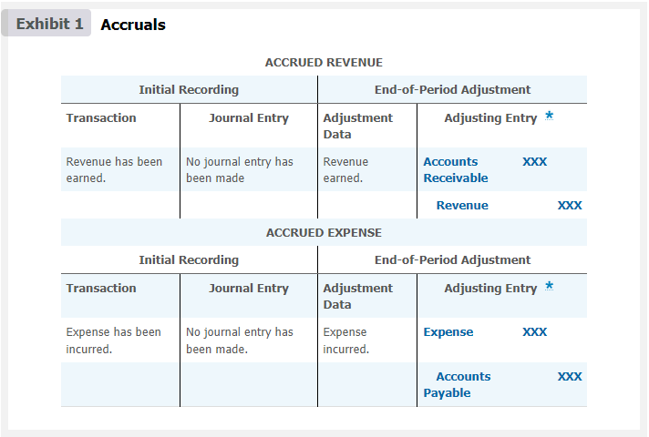</img>

<table><thead>
  <tr>
    <th colspan="6">ACCRUED REVENUE</th>
  </tr></thead>
<tbody>
  <tr>
    <td colspan="2">Initial Recording</td>
    <td colspan="4">End-of-Period Adjustment</td>
  </tr>
  <tr>
    <td>Transaction</td>
    <td>Journal Entry</td>
    <td>Adjustment Data</td>
    <td colspan="3">Adjusting Entry</td>
  </tr>
  <tr>
    <td>Revenue has been earned</td>
    <td>No journal entry has been made</td>
    <td>Revenue earned</td>
    <td>Accounts Receivable</td>
    <td>XXX</td>
    <td></td>
  </tr>
  <tr>
    <td></td>
    <td></td>
    <td></td>
    <td>Revenue</td>
    <td></td>
    <td>XXX</td>
  </tr>
  <tr>
    <td colspan="6"></td>
  </tr>
  <tr>
    <td colspan="6">ACCRUED EXPENSE</td>
  </tr>
  <tr>
    <td colspan="2">Initial Recording</td>
    <td colspan="4">End-of-Period Adjustment</td>
  </tr>
  <tr>
    <td>Transaction</td>
    <td>Journal Entry</td>
    <td>Adjustment Data</td>
    <td colspan="3">Adjusting Entry</td>
  </tr>
  <tr>
    <td>Expense has been incurred</td>
    <td>No journal entry has been made</td>
    <td>Expense incurred</td>
    <td>Expense</td>
    <td>XXX</td>
    <td></td>
  </tr>
  <tr>
    <td></td>
    <td></td>
    <td></td>
    <td>Accounts Payable</td>
    <td></td>
    <td>XXX</td>
  </tr>
</tbody></table>

---

## Deferrals

A **deferral** (A future revenue or expense initially recorded as a liability or asset.) occurs when cash related to a future revenue or expense has been initially recorded as a liability or an asset. If the cash received is related to future revenue, it is initially recorded as a liability called unearned revenue. The adjusting entry in the period when the revenue is earned debits an unearned revenue account and credits a revenue account. If the cash paid is related to a future expense, it is initially recorded as an asset called prepaid expense. The adjusting entry in the period when the expense is incurred debits an expense account and credits a prepaid expense (asset) account. Exhibit 2 summarizes the accounting for deferrals.

[Un **diferimiento** (un ingreso o gasto futuro inicialmente registrado como un pasivo o activo) ocurre cuando el efectivo relacionado con un ingreso o gasto futuro se ha registrado inicialmente como un pasivo o un activo. Si el efectivo recibido está relacionado con ingresos futuros, se registra inicialmente como un pasivo llamado ingreso no devengado (o diferido). El asiento de ajuste en el período cuando se gana el ingreso debita una cuenta de ingreso no devengado y acredita una cuenta de ingreso. Si el efectivo pagado está relacionado con un gasto futuro, se registra inicialmente como un activo llamado gasto pagado por adelantado. El asiento de ajuste en el período cuando se incurre en el gasto debita una cuenta de gasto y acredita una cuenta de gasto pagado por adelantado (activo). La Figura 2 resume la contabilidad para los diferimientos.]

---

## Exhibit 2

### Deferrals

[**Figura 2** - Diferimientos]

<table><thead>
  <tr>
    <th colspan="8">ACCRUED REVENUE</th>
  </tr></thead>
<tbody>
  <tr>
    <td colspan="4">Initial Recording</td>
    <td colspan="4">End-of-Period Adjustment</td>
  </tr>
  <tr>
    <td>Transaction</td>
    <td colspan="3">Journal Entry</td>
    <td>Adjustment Data</td>
    <td colspan="3">Adjusting Entry</td>
  </tr>
  <tr>
    <td rowspan="2">Cash has been&nbsp;&nbsp;received for revenue that will be earned in a future period.</td>
    <td>Cash</td>
    <td>XXX</td>
    <td></td>
    <td>Revenue has been earned.</td>
    <td>Unearned Revenue</td>
    <td>XXX</td>
    <td></td>
  </tr>
  <tr>
    <td>Unearned Revenue</td>
    <td></td>
    <td>XXX</td>
    <td></td>
    <td>Revenue</td>
    <td></td>
    <td>XXX</td>
  </tr>
  <tr>
    <td colspan="8"></td>
  </tr>
  <tr>
    <td colspan="8">PREPAID EXPENSE</td>
  </tr>
  <tr>
    <td colspan="4">Initial Recording</td>
    <td colspan="4">End-of-Period Adjustment</td>
  </tr>
  <tr>
    <td>Transaction</td>
    <td colspan="3">Journal Entry</td>
    <td>Adjustment Data</td>
    <td colspan="3">Adjusting Entry</td>
  </tr>
  <tr>
    <td rowspan="2">Cash has been paid for a future expense.</td>
    <td>Prepaid Expense</td>
    <td>XXX</td>
    <td></td>
    <td>Prepaid expense has been used to generate revenue.</td>
    <td>Expense</td>
    <td>XXX</td>
    <td></td>
  </tr>
  <tr>
    <td>Cash</td>
    <td></td>
    <td>XXX</td>
    <td></td>
    <td>Prepaid Expense</td>
    <td></td>
    <td>XXX</td>
  </tr>
</tbody></table>

---

<h1 id="005754" style="color:#E65100;">
  <a href="#Chapter_003" style="color:inherit; text-decoration:none;">
    3-2 Adjusting Entries for Accruals
  </a>
</h1>

To illustrate adjusting entries, the December 31, 20Y3, unadjusted trial balance of NetSolutions, shown in Exhibit 3, is used.

[Para ilustrar los asientos de ajuste, se utiliza el balance de comprobación no ajustado del 31 de diciembre de 20Y3 de NetSolutions, que se muestra en la Figura 3.]

**Objective 2** - Journalize adjusting entries for accruals.

[**Objetivo 2** - Registrar en el diario los asientos de ajuste para devengos.]

---

## Exhibit 3

### Unadjusted Trial Balance for NetSolutions

[**Figura 3** - Balance de Comprobación No Ajustado para NetSolutions]

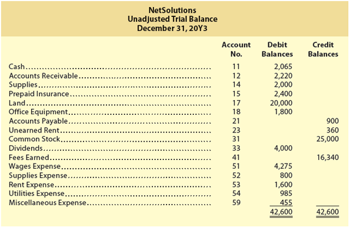</img>

## **NetSolutions**
**Unadjusted Trial Balance**

**December 31, 20Y3**

| Account No. | | Debit Balances | Credit Balances |
|-------------|---------------------|---------------|----------------|
| 11 | Cash | 2,065 | |
| 12 | Accounts Receivable | 2,220 | |
| 14 | Supplies | 2,000 | |
| 15 | Prepaid Insurance | 2,400 | |
| 17 | Land | 20,000 | |
| 18 | Office Equipment | 1,800 | |
| 21 | Accounts Payable | | 900 |
| 23 | Unearned Rent | | 360 |
| 31 | Common Stock | | 25,000 |
| 33 | Dividends | 4,000 | |
| 41 | Fees Earned | | 16,340 |
| 51 | Wages Expense | 4,275 | |
| 52 | Supplies Expense | 800 | |
| 53 | Rent Expense | 1,600 | |
| 54 | Utilities Expense | 985 | |
| 59 | Miscellaneous Expense | 455 | |
| | **Totals** | **42,600** | **42,600** |

An expanded chart of accounts for NetSolutions is shown in Exhibit 4. The additional accounts used in this chapter are highlighted. The rules of debit and credit shown in Exhibit 3 of Chapter 2 are used to record the adjusting entries.

[Un catálogo de cuentas expandido para NetSolutions se muestra en la Figura 4. Las cuentas adicionales utilizadas en este capítulo están resaltadas. Las reglas de débito y crédito mostradas en la Figura 3 del Capítulo 2 se utilizan para registrar los asientos de ajuste.]

---

## Exhibit 4

### Expanded Chart of Accounts for NetSolutions

[**Figura 4** - Catálogo de Cuentas Expandido para NetSolutions]

<table><thead>
  <tr>
    <th colspan="2">Balance Sheet Accounts</th>
    <th colspan="2">Income Statement Accounts</th>
  </tr></thead>
<tbody>
  <tr>
    <td colspan="2">1. Assets (Activos)</td>
    <td colspan="2">4. Revenue (Ingresos)</td>
  </tr>
  <tr>
    <td></td>
    <td>11 Cash</td>
    <td></td>
    <td>41 Fees Earned</td>
  </tr>
  <tr>
    <td></td>
    <td>12 Accounts Receivable</td>
    <td></td>
    <td style="color: #ac8e2b;"><b>42 Rent Revenue</b></td>
  </tr>
  <tr>
    <td></td>
    <td>14 Supplies</td>
    <td></td>
    <td>5. Expenses (Gastos)</td>
  </tr>
  <tr>
    <td></td>
    <td>15 Prepaid Insurance</td>
    <td></td>
    <td>51 Wages Expense</td>
  </tr>
  <tr>
    <td></td>
    <td>17 Land</td>
    <td></td>
    <td>52 Supplies Expense</td>
  </tr>
  <tr>
    <td></td>
    <td>18 Office Equipment</td>
    <td></td>
    <td>53 Rent Expense</td>
  </tr>
  <tr>
    <td></td>
    <td style="color: #ac8e2b;"><b>19 Accumulated Depreciation—Office Equipment</b></td>
    <td></td>
    <td>54 Utilities Expense</td>
  </tr>
  <tr>
    <td colspan="2">2. Liabilities (Pasivos)</td>
    <td></td>
    <td style="color: #ac8e2b;"><b>55 Insurance Expense</b></td>
  </tr>
  <tr>
    <td></td>
    <td>21 Accounts Payable</td>
    <td></td>
    <td style="color: #ac8e2b;"><B>56 Depreciation Expense</b></td>
  </tr>
  <tr>
    <td></td>
    <td style="color: #ac8e2b;"><b>22 Wages Payable</b></td>
    <td></td>
    <td>59 Miscellaneous Expense</td>
  </tr>
  <tr>
    <td></td>
    <td>23 Unearned Rent</td>
    <td></td>
    <td></td>
  </tr>
  <tr>
    <td colspan="2">3. Stockholders' Equity (Capital Contable)</td>
    <td></td>
    <td></td>
  </tr>
  <tr>
    <td></td>
    <td>31 Common Stock</td>
    <td></td>
    <td></td>
  </tr>
  <tr>
    <td></td>
    <td>32 Retained Earnings</td>
    <td></td>
    <td></td>
  </tr>
  <tr>
    <td></td>
    <td>33 Dividends</td>
    <td></td>
    <td></td>
  </tr>
</tbody></table>

---

<h1 id="958794" style="color:#E65100;">
  <a href="#Chapter_003" style="color:inherit; text-decoration:none;">
    3-2a Accrued Revenues
  </a>
</h1>

During an accounting period, some revenues are recorded only when cash is received. Thus, at the end of an accounting period, there may be revenue that has been earned but has not been recorded. In such cases, the revenue is recorded by increasing (debiting) an asset account and increasing (crediting) a revenue account.

[Durante un período contable, algunos ingresos se registran solo cuando se recibe el efectivo. Por lo tanto, al final de un período contable, puede haber ingresos que se han ganado pero que no se han registrado. En tales casos, el ingreso se registra aumentando (debitando) una cuenta de activo y aumentando (acreditando) una cuenta de ingreso.]

To illustrate, assume that NetSolutions signed an agreement with Dankner Co. on December 15. The agreement provides that NetSolutions will answer computer questions and render assistance to Dankner Co.'s employees. The services will be billed to Dankner Co. on the fifteenth of each month at a rate of $20 per hour. As of December 31, NetSolutions had provided 25 hours of assistance to Dankner Co. The revenue of $500 (25 hours × $20) will be billed on January 15. However, NetSolutions earned the revenue in December.

[Para ilustrar, suponga que NetSolutions firmó un acuerdo con Dankner Co. el 15 de diciembre. El acuerdo establece que NetSolutions responderá preguntas de computación y brindará asistencia a los empleados de Dankner Co. Los servicios se facturarán a Dankner Co. el día quince de cada mes a una tarifa de $20 por hora. Al 31 de diciembre, NetSolutions había proporcionado 25 horas de asistencia a Dankner Co. El ingreso de $500 (25 horas × $20) se facturará el 15 de enero. Sin embargo, NetSolutions ganó el ingreso en diciembre.]

The claim against the customer for payment of the $500 is an account receivable (an asset). Thus, the accounts receivable account is increased (debited) by $500, and the fees earned account is increased (credited) by $500. The adjusting journal entry and T accounts are as follows:

[El derecho de cobro contra el cliente por el pago de los $500 es una cuenta por cobrar (un activo). Por lo tanto, la cuenta de cuentas por cobrar se aumenta (debita) en $500, y la cuenta de ingresos por servicios se aumenta (acredita) en $500. El asiento de diario de ajuste y las cuentas T son los siguientes:]

---

## Adjusting Journal Entry

[**Asiento de Diario de Ajuste**]

| Date | Account | Debit | Credit |
|------|---------|-------|--------|
| Dec. 31 | Accounts Receivable | 500 | |
| | Fees Earned | | 500 |
| *Accrued fees (25 hrs. × $20)* | | | |

---

## Accounting Equation Impact

<!-- 📍 IMAGEN: Accounting Equation Impact (coordenadas [151, 732, 825, 844]) -->

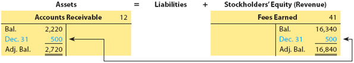

The adjusting entry is highlighted in the T accounts to separate it from other transactions. After the adjusting entry is posted, Accounts Receivable has a balance of $2,720 and Fees Earned has a balance of $16,840.

[El asiento de ajuste está resaltado en las cuentas T para separarlo de otras transacciones. Después de que se traspasa el asiento de ajuste, Cuentas por Cobrar tiene un saldo de $2,720 e Ingresos por Servicios tiene un saldo de $16,840.]

---

## Effects of Omitting the Adjusting Entry

[**Efectos de Omitir el Asiento de Ajuste**]

If the adjustment for the accrued revenue ($500) is not recorded, Fees Earned and the net income will be understated by $500 on the income statement. On the balance sheet, assets (Accounts Receivable) and stockholders' equity (Retained Earnings) will be understated by $500. The effects of omitting this adjusting entry are as follows:

[Si el ajuste por el ingreso devengado ($500) no se registra, los Ingresos por Servicios y el ingreso neto estarán subestimados en $500 en el estado de resultados. En el balance general, los activos (Cuentas por Cobrar) y el capital contable (Ganancias Retenidas) estarán subestimados en $500. Los efectos de omitir este asiento de ajuste son los siguientes:]

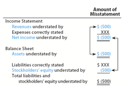</img>

| Financial Statement | Account | Effect of Omission |
|---------------------|---------|-------------------|
| **Income Statement** | Fees Earned | Understated by $500 |
| **Income Statement** | Net Income | Understated by $500 |
| **Balance Sheet** | Accounts Receivable (Assets) | Understated by $500 |
| **Balance Sheet** | Retained Earnings (Stockholders' Equity) | Understated by $500 |

---

<h1 id="630167" style="color:#E65100;">
  <a href="#Chapter_003" style="color:inherit; text-decoration:none;">
    3-2b Accrued Expenses
  </a>
</h1>

Some types of services used in earning revenues are paid for after the service has been performed. For example, wages expense is used hour by hour but is paid only daily, weekly, biweekly, or monthly. At the end of the accounting period, the amount of such accrued but unpaid items is an expense and a liability.

[Algunos tipos de servicios utilizados para generar ingresos se pagan después de que el servicio se ha realizado. Por ejemplo, el gasto de sueldos se utiliza hora por hora, pero se paga solo diariamente, semanalmente, quincenalmente o mensualmente. Al final del período contable, el monto de tales partidas devengadas pero no pagadas es un gasto y un pasivo.]

For example, if the last day of the employees' pay period is not the last day of the accounting period, an accrued expense (wages expense) and the related liability (wages payable) must be recorded by an adjusting entry. This adjusting entry is necessary so that expenses are properly matched to the period in which they were incurred in earning revenue.

[Por ejemplo, si el último día del período de pago de los empleados no es el último día del período contable, se debe registrar un gasto devengado (gasto de sueldos) y el pasivo relacionado (sueldos por pagar) mediante un asiento de ajuste. Este asiento de ajuste es necesario para que los gastos se correspondan adecuadamente con el período en el que se incurrieron para generar ingresos.]

To illustrate, NetSolutions pays its employees biweekly. During December, NetSolutions paid wages of $950 on December 13 and $1,200 on December 27. These payments covered pay periods ending on those days as shown in Exhibit 5.

[Para ilustrar, NetSolutions paga a sus empleados quincenalmente. Durante diciembre, NetSolutions pagó sueldos de $950 el 13 de diciembre y $1,200 el 27 de diciembre. Estos pagos cubrieron períodos de pago que terminaban en esos días, como se muestra en la Figura 5.]

---

## Exhibit 5

### Accrued Wages

[**Figura 5** - Sueldos Devengados]

<!-- 📍 IMAGEN: Exhibit 5 - Accrued Wages (coordenadas [126, 486, 768, 886]) -->

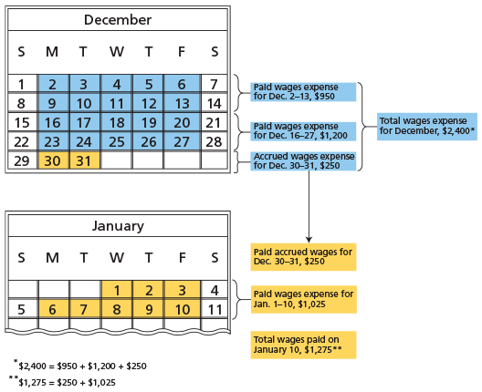

**Calendar of Pay Periods:**

| Payment Date | Pay Period Covered | Amount |
|--------------|-------------------|--------|
| Dec. 13 | Through Dec. 13 | $950 |
| Dec. 27 | Through Dec. 27 | $1,200 |
| Jan. 10 | Through Jan. 10 | $1,275 |

**December 31 Accrual:** As of December 31, NetSolutions owes $250 of wages to employees for Monday and Tuesday, December 30 and 31.

[**Devengo al 31 de diciembre:** Al 31 de diciembre, NetSolutions debe $250 de sueldos a los empleados por el lunes y martes, 30 y 31 de diciembre.]

Thus, the wages expense account is increased (debited) by $250, and the wages payable account is increased (credited) by $250. The adjusting journal entry and T accounts are as follows:

[Por lo tanto, la cuenta de gasto de sueldos se aumenta (debita) en $250, y la cuenta de sueldos por pagar se aumenta (acredita) en $250. El asiento de diario de ajuste y las cuentas T son los siguientes:]

---

## Adjusting Journal Entry

[**Asiento de Diario de Ajuste**]

| Date | Account | Debit | Credit |
|------|---------|-------|--------|
| Dec. 31 | Wages Expense | 250 | |
| | Wages Payable | | 250 |
| *Accrued wages.* | | | |

---

## Accounting Equation Impact

<!-- 📍 IMAGEN: Accounting Equation Impact (coordenadas [151, 243, 840, 377]) -->

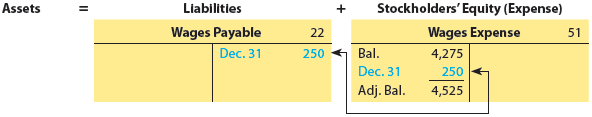

After the adjusting entry is posted, the debit balance of the wages expense account is $4,525. This balance of $4,525 is the wages expense for two months, November and December. The credit balance of $250 in Wages Payable is the liability for wages owed on December 31.

[Después de que se traspasa el asiento de ajuste, el saldo deudor de la cuenta de gasto de sueldos es de $4,525. Este saldo de $4,525 es el gasto de sueldos para dos meses, noviembre y diciembre. El saldo acreedor de $250 en Sueldos por Pagar es el pasivo por sueldos adeudados al 31 de diciembre.]

As shown in Exhibit 5, NetSolutions paid wages of $1,275 on January 10. This payment includes the $250 of accrued wages recorded on December 31. Thus, on January 10, the wages payable account is decreased (debited) by $250. Also, the wages expense account is increased (debited) by $1,025 ($1,275 - $250), which is the wages expense for January 1-10. Finally, the cash account is decreased (credited) by $1,275. The journal entry for the payment of wages on January 10 follows:

[Como se muestra en la Figura 5, NetSolutions pagó sueldos de $1,275 el 10 de enero. Este pago incluye los $250 de sueldos devengados registrados el 31 de diciembre. Por lo tanto, el 10 de enero, la cuenta de sueldos por pagar se disminuye (debita) en $250. Además, la cuenta de gasto de sueldos se aumenta (debita) en $1,025 ($1,275 - $250), que es el gasto de sueldos del 1 al 10 de enero. Finalmente, la cuenta de efectivo se disminuye (acredita) en $1,275. El asiento de diario para el pago de sueldos del 10 de enero es el siguiente:]

| Date | Account | Debit | Credit |
|------|---------|-------|--------|
| Jan. 10 | Wages Expense | 1,025 | |
| | Wages Payable | 250 | |
| | Cash | | 1,275 |

---

## Effects of Omitting the Adjusting Entry

[**Efectos de Omitir el Asiento de Ajuste**]

If the adjustment for wages ($250) is not recorded, Wages Expense will be understated by $250, and the net income will be overstated by $250 on the income statement. On the balance sheet, liabilities (Wages Payable) will be understated by $250, and stockholders' equity (Retained Earnings) will be overstated by $250. The effects of omitting this adjusting entry are as follows:

[Si el ajuste por sueldos ($250) no se registra, el Gasto de Sueldos estará subestimado en $250, y el ingreso neto estará sobrestimado en $250 en el estado de resultados. En el balance general, los pasivos (Sueldos por Pagar) estarán subestimados en $250, y el capital contable (Ganancias Retenidas) estará sobrestimado en $250. Los efectos de omitir este asiento de ajuste son los siguientes:]

| Financial Statement | Account | Effect of Omission |
|---------------------|---------|-------------------|
| **Income Statement** | Wages Expense | Understated by $250 |
| **Income Statement** | Net Income | Overstated by $250 |
| **Balance Sheet** | Liabilities (Wages Payable) | Understated by $250 |
| **Balance Sheet** | Stockholders' Equity (Retained Earnings) | Overstated by $250 |
| **Balance Sheet** | Assets | Correctly stated |
| **Balance Sheet** | Total Liabilities + Stockholders' Equity | Correctly stated |

---

**Link to Netflix:** On a recent balance sheet, Netflix reported accrued expenses and other liabilities of $843 million.

[**Enlace a Netflix:** En un balance general reciente, Netflix reportó gastos devengados y otros pasivos de $843 millones.]

---

## Check Up Corner 3-1

### Adjusting Entries for Accruals

[**Esquina de Verificación 3-1 - Asientos de Ajuste para Devengos**]

The following data were accumulated for preparing the adjusting entries for Atlanta Rhythm Company:

[Los siguientes datos se acumularon para preparar los asientos de ajuste para Atlanta Rhythm Company:]

1. At the end of the year, $13,680 of fees have been earned, but have not been billed to clients.

2. Wages of $12,500 are paid on Friday for a five-day workweek. The accounting period ends on Thursday, December 31.

**Journalize the adjusting entries necessary on December 31, the end of the accounting period.**

[**Registre en el diario los asientos de ajuste necesarios al 31 de diciembre, al final del período contable.**]

---

### Solution - Check Up Corner 3-1

[**Solución - Esquina de Verificación 3-1**]

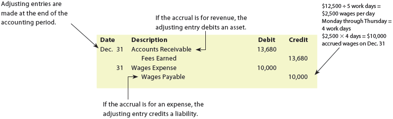</img>

| Date | Account | Debit | Credit |
|------|---------|-------|--------|
| Dec. 31 | Accounts Receivable | 13,680 | |
| | Fees Earned | | 13,680 |
| *Accrued fees earned but not billed.* | | | |
| Dec. 31 | Wages Expense | 10,000 | |
| | Wages Payable | | 10,000 |
| *Accrued wages ($12,500 × 4/5 = $10,000 for Monday-Thursday).* | | | |

*Note: If the accounting period ends on Thursday and wages are paid on Friday for a five-day workweek, employees have worked 4 days (Monday-Thursday) of the 5-day week. Therefore, the accrued wages are: $12,500 × 4/5 = $10,000.*

---

<h1 id="135573" style="color:#E65100;">
  <a href="#Chapter_003" style="color:inherit; text-decoration:none;">
    3-3 Adjusting Entries for Deferrals
  </a>
</h1>

The unadjusted trial balance for NetSolutions in Exhibit 3 indicates Unearned Rent of $360. In addition, Exhibit 3 indicates that NetSolutions has prepaid assets consisting of Supplies of $2,000 and Prepaid Insurance of $2,400. Each of these deferrals requires an adjusting entry.

[El balance de comprobación no ajustado para NetSolutions en la Figura 3 indica Renta No Devengada de $360. Además, la Figura 3 indica que NetSolutions tiene activos pagados por adelantado que consisten en Suministros de $2,000 y Seguro Pagado por Adelantado de $2,400. Cada uno de estos diferimientos requiere un asiento de ajuste.]

**Objective 3** - Journalize adjusting entries for deferrals.

[**Objetivo 3** - Registrar en el diario los asientos de ajuste para diferimientos.]

## Exhibit 3

</img>

---

<h1 id="645914" style="color:#E65100;">
  <a href="#Chapter_003" style="color:inherit; text-decoration:none;">
    3-3a Unearned Revenues
  </a>
</h1>

The December 31 unadjusted trial balance of NetSolutions indicates a balance in the unearned rent account of $360. This balance represents the receipt of three months' rent on December 1 for December, January, and February. At the end of December, one month's rent has been earned. Thus, the unearned rent account is decreased (debited) by $120, and the rent revenue account is increased (credited) by $120. The $120 represents the rental revenue for one month ($360 ÷ 3). The adjusting journal entry and T accounts are as follows:

[El balance de comprobación no ajustado del 31 de diciembre de NetSolutions indica un saldo en la cuenta de renta no devengada de $360. Este saldo representa la recepción de tres meses de renta el 1 de diciembre para diciembre, enero y febrero. Al final de diciembre, se ha ganado un mes de renta. Por lo tanto, la cuenta de renta no devengada se disminuye (debita) en $120, y la cuenta de ingresos por renta se aumenta (acredita) en $120. Los $120 representan el ingreso por renta de un mes ($360 ÷ 3). El asiento de diario de ajuste y las cuentas T son los siguientes:]

---

## Adjusting Journal Entry

[**Asiento de Diario de Ajuste**]

| Date | Account | Debit | Credit |
|------|---------|-------|--------|
| Dec. 31 | Unearned Rent | 120 | |
| | Rent Revenue | | 120 |
| *Rent earned ($360 ÷ 3 months).* | | | |

---

## Accounting Equation Impact

<!-- 📍 IMAGEN: Accounting Equation Impact (coordenadas [151, 537, 843, 655]) -->

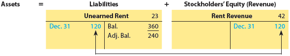

After the adjusting entry is posted, the unearned rent account has a credit balance of $240. This balance is a liability that will become revenue in a future period. Rent Revenue has a balance of $120, which is revenue of the current period.

[Después de que se traspasa el asiento de ajuste, la cuenta de renta no devengada tiene un saldo acreedor de $240. Este saldo es un pasivo que se convertirá en ingreso en un período futuro. Ingresos por Renta tiene un saldo de $120, que es ingreso del período actual.]

---

## Effects of Omitting the Adjusting Entry

[**Efectos de Omitir el Asiento de Ajuste**]

If the preceding adjustment of unearned rent and rent revenue is not recorded, the financial statements prepared on December 31 will be misstated. On the income statement, Rent Revenue and the net income will be understated by $120. On the balance sheet, liabilities (Unearned Rent) will be overstated by $120, and stockholders' equity (Retained Earnings) will be understated by $120. The effects of omitting this adjusting entry are as follows:

[Si el ajuste anterior de renta no devengada e ingresos por renta no se registra, los estados financieros preparados al 31 de diciembre estarán incorrectos. En el estado de resultados, los Ingresos por Renta y el ingreso neto estarán subestimados en $120. En el balance general, los pasivos (Renta No Devengada) estarán sobrestimados en $120, y el capital contable (Ganancias Retenidas) estará subestimado en $120. Los efectos de omitir este asiento de ajuste son los siguientes:]

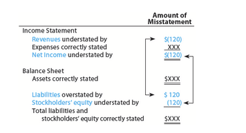</img>

| Financial Statement | Account | Effect of Omission |
|---------------------|---------|-------------------|
| **Income Statement** | Rent Revenue | Understated by $120 |
| **Income Statement** | Net Income | Understated by $120 |
| **Balance Sheet** | Liabilities (Unearned Rent) | Overstated by $120 |
| **Balance Sheet** | Stockholders' Equity (Retained Earnings) | Understated by $120 |

---

## Business Insight

### Earning Revenues from Season Tickets

[**Perspectiva de Negocio - Generación de Ingresos por Boletos de Temporada**]

Madison Square Garden Company (MSG) owns the New York Knicks basketball team and the New York Rangers hockey team. The company sells season tickets prior to the season. The amounts received for season tickets are recognized as unearned revenue, a current liability. MSG recognizes revenue and reduces unearned revenue as the games are played through the season.

[Madison Square Garden Company (MSG) es propietaria del equipo de baloncesto New York Knicks y del equipo de hockey New York Rangers. La empresa vende boletos de temporada antes de la temporada. Los montos recibidos por los boletos de temporada se reconocen como ingresos no devengados, un pasivo corriente. MSG reconoce ingresos y reduce los ingresos no devengados a medida que se juegan los partidos durante la temporada.]

---

**Link to Netflix:** On a recent balance sheet, Netflix reported deferred revenue of $925 million, which consisted primarily of billed membership fees that will be recorded as revenue in the next month.

[**Enlace a Netflix:** En un balance general reciente, Netflix reportó ingresos diferidos de $925 millones, que consistían principalmente en cuotas de membresía facturadas que se registrarán como ingresos en el próximo mes.]

---

<h1 id="029898" style="color:#E65100;">
  <a href="#Chapter_003" style="color:inherit; text-decoration:none;">
    3-3b Prepaid Expenses
  </a>
</h1>

The December 31, 20Y3, unadjusted trial balance of NetSolutions indicates a balance in the supplies account of $2,000. In addition, the prepaid insurance account has a balance of $2,400. Each of these accounts requires an adjusting entry.

[El balance de comprobación no ajustado del 31 de diciembre de 20Y3 de NetSolutions indica un saldo en la cuenta de suministros de $2,000. Además, la cuenta de seguro pagado por adelantado tiene un saldo de $2,400. Cada una de estas cuentas requiere un asiento de ajuste.]

---

## Supplies

[**Suministros**]

The balance in NetSolutions' supplies account on December 31 is $2,000. Some of these supplies (paper, envelopes, etc.) were used during December, and some are still on hand (not used). If either amount is known, the other can be determined. It is normally easier to determine the cost of the supplies on hand at the end of the month than to record daily supplies used.

[El saldo en la cuenta de suministros de NetSolutions al 31 de diciembre es de $2,000. Algunos de estos suministros (papel, sobres, etc.) se usaron durante diciembre, y algunos aún están disponibles (no usados). Si se conoce cualquiera de los dos montos, el otro puede determinarse. Normalmente es más fácil determinar el costo de los suministros disponibles al final del mes que registrar los suministros usados diariamente.]

Assuming that on December 31 the amount of supplies on hand is $760, the amount to be transferred from the asset account to the expense account is $1,240, computed as follows:

[Suponiendo que al 31 de diciembre el monto de suministros disponibles es de $760, el monto a transferir de la cuenta de activo a la cuenta de gasto es de $1,240, calculado de la siguiente manera:]

| Concept | Amount |
|---------|--------|
| Supplies available during December (balance of account) | $2,000 |
| Supplies on hand, December 31 | (760) |
| **Supplies used (amount of adjustment)** | **$1,240** |

At the end of December, the supplies expense account is increased (debited) for $1,240 and the supplies account is decreased (credited) for $1,240 to record the supplies used during December. The adjusting journal entry and T accounts for Supplies and Supplies Expense are as follows:

[Al final de diciembre, la cuenta de gasto de suministros se aumenta (debita) en $1,240 y la cuenta de suministros se disminuye (acredita) en $1,240 para registrar los suministros usados durante diciembre. El asiento de diario de ajuste y las cuentas T para Suministros y Gasto de Suministros son los siguientes:]

---

### Adjusting Journal Entry - Supplies

[**Asiento de Diario de Ajuste - Suministros**]

| Date | Account | Debit | Credit |
|------|---------|-------|--------|
| Dec. 31 | Supplies Expense | 1,240 | |
| | Supplies | | 1,240 |
| *Supplies used ($2,000 – $760).* | | | |

---

### Accounting Equation Impact - Supplies

| Assets | = | Liabilities | + | Stockholders' Equity (Expense) |
|--------|---|-------------|---|-------------------------------|
| Bal. 2,000 | | | | |
| Dec. 31 1,240 | | | | |
| Bal. 800 | | | | |

After the adjusting entry is recorded and posted, the supplies account has a debit balance of $760. This balance is an asset that will become an expense in a future period.

[Después de que se registra y traspasa el asiento de ajuste, la cuenta de suministros tiene un saldo deudor de $760. Este saldo es un activo que se convertirá en gasto en un período futuro.]

---

## Business Insight

### Sports Signing Bonus

[**Perspectiva de Negocio - Bono por Firma Deportiva**]

The National Football League (NFL), National Basketball Association (NBA), and National Hockey League (NHL) all have team salary caps that are used to create parity in the sports league. The salary cap limits the total salaries that a team can pay each year. Teams use signing bonuses as a way to reduce the impact of salaries on the salary cap. Under cap rules, the bonus is spread over the length of the player's contract. For example, if a player receives a $6 million bonus for a six-year contract, the player will receive the complete $6 million upon signing the contract, but only $1 million will be applied to the salary cap for each year of the contract. This is similar to how GAAP also accounts for the bonus. The bonus is treated as a prepaid salary expense that is amortized over the life of the contract. If a player is released prior to the end of the contract, any remaining unamortized balance is expensed immediately.

[La National Football League (NFL), la National Basketball Association (NBA) y la National Hockey League (NHL) tienen límites salariales de equipo que se utilizan para crear paridad en la liga deportiva. El límite salarial limita los salarios totales que un equipo puede pagar cada año. Los equipos utilizan bonos por firma como una forma de reducir el impacto de los salarios en el límite salarial. Bajo las reglas del límite, el bono se distribuye a lo largo de la duración del contrato del jugador. Por ejemplo, si un jugador recibe un bono de $6 millones por un contrato de seis años, el jugador recibirá los $6 millones completos al firmar el contrato, pero solo $1 millón se aplicará al límite salarial por cada año del contrato. Esto es similar a cómo los GAAP también contabilizan el bono. El bono se trata como un gasto de salario pagado por adelantado que se amortiza durante la vida del contrato. Si un jugador es liberado antes del final del contrato, cualquier saldo no amortizado restante se gasta inmediatamente.]

---

**Link to Netflix:** On a recent balance sheet, Netflix reported $181 million of prepaid expenses.

[**Enlace a Netflix:** En un balance general reciente, Netflix reportó $181 millones de gastos pagados por adelantado.]

---

## Prepaid Insurance

[**Seguro Pagado por Adelantado**]

The debit balance of $2,400 in NetSolutions' prepaid insurance account represents a December 1 prepayment of insurance for 12 months. At the end of December, the insurance expense account is increased (debited), and the prepaid insurance account is decreased (credited) by $200, the insurance for one month. The adjusting journal entry and T accounts for Prepaid Insurance and Insurance Expense are as follows:

[El saldo deudor de $2,400 en la cuenta de seguro pagado por adelantado de NetSolutions representa un pago anticipado de seguro el 1 de diciembre por 12 meses. Al final de diciembre, la cuenta de gasto de seguro se aumenta (debita), y la cuenta de seguro pagado por adelantado se disminuye (acredita) en $200, el seguro de un mes. El asiento de diario de ajuste y las cuentas T para Seguro Pagado por Adelantado y Gasto de Seguro son los siguientes:]

---

### Adjusting Journal Entry - Prepaid Insurance

[**Asiento de Diario de Ajuste - Seguro Pagado por Adelantado**]

| Date | Account | Debit | Credit |
|------|---------|-------|--------|
| Dec. 31 | Insurance Expense | 200 | |
| | Prepaid Insurance | | 200 |
| *Insurance expired ($2,400 ÷ 12).* | | | |

---

### Accounting Equation Impact - Prepaid Insurance

<!-- 📍 IMAGEN: Accounting Equation Impact para Prepaid Insurance (coordenadas [154, 30, 824, 145]) -->

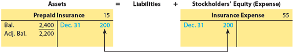

After the adjusting entry is recorded and posted, the prepaid insurance account has a debit balance of $2,200. This balance is an asset that will become an expense in future periods. The insurance expense account has a debit balance of $200, which is an expense of the current period.

[Después de que se registra y traspasa el asiento de ajuste, la cuenta de seguro pagado por adelantado tiene un saldo deudor de $2,200. Este saldo es un activo que se convertirá en gasto en períodos futuros. La cuenta de gasto de seguro tiene un saldo deudor de $200, que es un gasto del período actual.]

---

## Effects of Omitting Adjusting Entries for Prepaid Expenses

[**Efectos de Omitir los Asientos de Ajuste para Gastos Pagados por Adelantado**]

If the preceding adjustments for supplies ($1,240) and insurance ($200) are not recorded, the financial statements prepared as of December 31 will be misstated. On the income statement, Supplies Expense and Insurance Expense will be understated by a total of $1,440 ($1,240 + $200), and net income will be overstated by $1,440. On the balance sheet, Supplies and Prepaid Insurance will be overstated by a total of $1,440. Because net income increases retained earnings, stockholders' equity will also be overstated by $1,440 on the balance sheet. The effects of omitting these adjusting entries on the income statement and balance sheet are as follows:

[Si los ajustes anteriores por suministros ($1,240) y seguro ($200) no se registran, los estados financieros preparados al 31 de diciembre estarán incorrectos. En el estado de resultados, el Gasto de Suministros y el Gasto de Seguro estarán subestimados en un total de $1,440 ($1,240 + $200), y el ingreso neto estará sobrestimado en $1,440. En el balance general, Suministros y Seguro Pagado por Adelantado estarán sobrestimados en un total de $1,440. Debido a que el ingreso neto aumenta las ganancias retenidas, el capital contable también estará sobrestimado en $1,440 en el balance general. Los efectos de omitir estos asientos de ajuste en el estado de resultados y el balance general son los siguientes:]

<!-- 📍 IMAGEN: Efectos de omitir los asientos de ajuste (coordenadas [126, 438, 635, 676]) -->

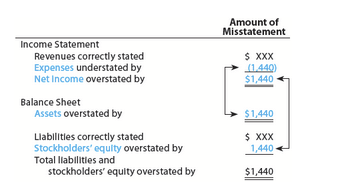

| Financial Statement | Account | Effect of Omission |
|---------------------|---------|-------------------|
| **Income Statement** | Supplies Expense | Understated by $1,240 |
| **Income Statement** | Insurance Expense | Understated by $200 |
| **Income Statement** | Net Income | Overstated by $1,440 |
| **Balance Sheet** | Supplies (Assets) | Overstated by $1,240 |
| **Balance Sheet** | Prepaid Insurance (Assets) | Overstated by $200 |
| **Balance Sheet** | Stockholders' Equity | Overstated by $1,440 |

---

## Ethics in Action

### Free Issue

[**Ética en Acción - Emisión Gratuita**]

Office supplies are often available to employees on a "free issue" basis. This means that employees do not have to "sign" for the release of office supplies but merely obtain the necessary supplies from a local storage area as needed. Just because supplies are easily available, however, doesn't mean they can be taken for personal use. There are many instances where employees have been terminated for taking supplies home for personal use.

[Los suministros de oficina a menudo están disponibles para los empleados en una base de "emisión gratuita". Esto significa que los empleados no tienen que "firmar" por la liberación de los suministros de oficina, sino que simplemente obtienen los suministros necesarios de un área de almacenamiento local según sea necesario. Sin embargo, el hecho de que los suministros estén fácilmente disponibles no significa que puedan ser tomados para uso personal. Hay muchos casos en los que los empleados han sido despedidos por llevar suministros a casa para uso personal.]

---

## Prepaid Expenses That Expire Entirely in One Period

[**Gastos Pagados por Adelantado que Expiran Completamente en un Período**]

Payments for prepaid expenses are sometimes made at the beginning of the period in which they will be entirely used or consumed. To illustrate, the following December 1 transaction of NetSolutions is used:

[Los pagos por gastos pagados por adelantado a veces se realizan al comienzo del período en el que se usarán o consumirán por completo. Para ilustrar, se utiliza la siguiente transacción del 1 de diciembre de NetSolutions:]

**Dec. 1** NetSolutions paid rent of $800 for the month.

[**1 de diciembre** NetSolutions pagó renta de $800 por el mes.]

On December 1, the rent payment of $800 represents Prepaid Rent. However, the Prepaid Rent expires daily, and at the end of December there will be no asset left. In such cases, the payment of $800 is recorded as Rent Expense rather than as Prepaid Rent. In this way, no adjusting entry is needed at the end of the period.

[El 1 de diciembre, el pago de renta de $800 representa Renta Pagada por Adelantado. Sin embargo, la Renta Pagada por Adelantado expira diariamente, y al final de diciembre no quedará ningún activo. En tales casos, el pago de $800 se registra como Gasto de Renta en lugar de como Renta Pagada por Adelantado. De esta manera, no se necesita un asiento de ajuste al final del período.]

---

## Check Up Corner 3-2

### Adjusting Entries for Deferrals

[**Esquina de Verificación 3-2 - Asientos de Ajuste para Diferimientos**]

Selected unadjusted account balances for Atlanta Rhythm Company on December 31 are as follows:

[Saldos de cuentas no ajustados seleccionados para Atlanta Rhythm Company al 31 de diciembre son los siguientes:]

| | Debit Balances | Credit Balances |
|--|---------------|-----------------|
| Supplies | $ 2,700 | |
| Prepaid Insurance | 12,000 | |
| Unearned Fees | | $ 44,900 |

The following adjustment data were accumulated on December 31:

[Los siguientes datos de ajuste se acumularon al 31 de diciembre:]

- Supplies on hand at December 31, $1,100.
- Insurance premiums expired during the year, $10,000.
- Unearned fees on December 31, $15,600.

**Journalize the adjusting entries necessary on December 31.**

[**Registre en el diario los asientos de ajuste necesarios al 31 de diciembre.**]

---

### Solution - Check Up Corner 3-2

[**Solución - Esquina de Verificación 3-2**]

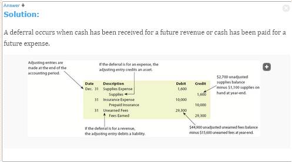</img>

| Date | Account | Debit | Credit |
|------|---------|-------|--------|
| Dec. 31 | Supplies Expense | 1,600 | |
| | Supplies | | 1,600 |
| *Supplies used ($2,700 – $1,100).* | | | |
| Dec. 31 | Insurance Expense | 10,000 | |
| | Prepaid Insurance | | 10,000 |
| *Insurance premiums expired during the year.* | | | |
| Dec. 31 | Unearned Fees | 29,300 | |
| | Fees Earned | | 29,300 |
| *Unearned fees earned ($44,900 – $15,600).* | | | |

---

<h1 id="592509" style="color:#E65100;">
  <a href="#Chapter_003" style="color:inherit; text-decoration:none;">
    3-4 Adjusting Entries for Depreciation
  </a>
</h1>

**Objective 4** - Journalize adjusting entries for depreciation.

[**Objetivo 4** - Registrar en el diario los asientos de ajuste para depreciación.]

**Fixed assets** (Physical resources that are owned and used by a business and are permanent or have a long life; long-term or relatively permanent tangible assets such as equipment, machinery, buildings, and land that are used in normal business operations.) are physical resources that are owned and used by a business and are permanent or have a long life. Examples of fixed assets include land, buildings, and equipment. In a sense, fixed assets are a type of long-term prepaid expense. However, because of their unique nature and long life, they are discussed separately from other prepaid expenses.

[Los **activos fijos** (recursos físicos que son propiedad de un negocio y son utilizados por él, y son permanentes o tienen una larga vida; activos tangibles a largo plazo o relativamente permanentes como equipo, maquinaria, edificios y terreno que se utilizan en las operaciones normales del negocio) son recursos físicos que son propiedad de un negocio y son utilizados por él, y son permanentes o tienen una larga vida. Ejemplos de activos fijos incluyen terreno, edificios y equipo. En cierto sentido, los activos fijos son un tipo de gasto pagado por adelantado a largo plazo. Sin embargo, debido a su naturaleza única y larga vida, se discuten por separado de otros gastos pagados por adelantado.]

Fixed assets, such as office equipment, are used to generate revenue much like supplies are used to generate revenue. Unlike supplies, however, there is no visible reduction in the quantity of the equipment. Instead, as time passes, the equipment loses its ability to provide useful services. This decrease in usefulness is called **depreciation** (The systematic periodic transfer of the cost of a fixed asset to an expense account during its expected useful life.)

[Los activos fijos, como el equipo de oficina, se utilizan para generar ingresos de manera similar a como los suministros se utilizan para generar ingresos. A diferencia de los suministros, sin embargo, no hay una reducción visible en la cantidad del equipo. En cambio, a medida que pasa el tiempo, el equipo pierde su capacidad para proporcionar servicios útiles. Esta disminución en la utilidad se llama **depreciación** (la transferencia periódica sistemática del costo de un activo fijo a una cuenta de gasto durante su vida útil esperada).]

All fixed assets, except land, lose their usefulness and, thus, are said to **depreciate** (To lose value or usefulness over time.). As a fixed asset depreciates, a portion of its cost should be recorded as an expense. This periodic expense is called **depreciation expense** (The portion of the cost of a fixed asset that is recorded as an expense each year of its useful life.)

[Todos los activos fijos, excepto el terreno, pierden su utilidad y, por lo tanto, se dice que se **deprecian** (perder valor o utilidad con el tiempo). A medida que un activo fijo se deprecia, una parte de su costo debe registrarse como un gasto. Este gasto periódico se llama **gasto de depreciación** (la porción del costo de un activo fijo que se registra como un gasto cada año de su vida útil).]

The adjusting entry to record depreciation expense is similar to the adjusting entry for supplies used. The depreciation expense account is increased (debited) for the amount of depreciation. However, the fixed asset account is not decreased (credited). This is because both the original cost of a fixed asset and the depreciation recorded since its purchase are reported on the balance sheet. Instead, an account entitled **Accumulated Depreciation** (The contra asset account credited when recording the depreciation of a fixed asset.) is increased (credited).

[El asiento de ajuste para registrar el gasto de depreciación es similar al asiento de ajuste para los suministros usados. La cuenta de gasto de depreciación se aumenta (debita) por el monto de la depreciación. Sin embargo, la cuenta del activo fijo no se disminuye (acredita). Esto se debe a que tanto el costo original de un activo fijo como la depreciación registrada desde su compra se reportan en el balance general. En su lugar, se aumenta (acredita) una cuenta llamada **Depreciación Acumulada** (la cuenta de activo de contra que se acredita al registrar la depreciación de un activo fijo).]

Accumulated depreciation accounts are called **contra accounts** (An account offset against another account.), or **contra asset accounts** (An account offset against another account.). This is because accumulated depreciation accounts are deducted from their related fixed asset accounts on the balance sheet. The normal balance of a contra account is opposite to the account from which it is deducted. Because the normal balance of a fixed asset account is a debit, the normal balance of an accumulated depreciation account is a credit.

[Las cuentas de depreciación acumulada se llaman **cuentas de contra** (una cuenta que se compensa con otra cuenta), o **cuentas de contra de activo** (una cuenta que se compensa con otra cuenta). Esto se debe a que las cuentas de depreciación acumulada se deducen de sus cuentas de activo fijo relacionadas en el balance general. El saldo normal de una cuenta de contra es opuesto a la cuenta de la que se deduce. Debido a que el saldo normal de una cuenta de activo fijo es un débito, el saldo normal de una cuenta de depreciación acumulada es un crédito.]

---

## Contra Asset Accounts

[**Cuentas de Contra de Activo**]

The normal titles for fixed asset accounts and their related contra asset accounts are as follows:

[Los títulos normales para las cuentas de activo fijo y sus cuentas de contra de activo relacionadas son los siguientes:]

| Fixed Asset Account | Contra Asset Account |
|---------------------|----------------------|
| Land | None — Land is not depreciated. |
| Buildings | Accumulated Depreciation — Buildings |
| Store Equipment | Accumulated Depreciation — Store Equipment |
| Office Equipment | Accumulated Depreciation — Office Equipment |

---

## Adjusting Entry for Depreciation - NetSolutions

The December 31, 20Y3, unadjusted trial balance of NetSolutions (Exhibit 3) indicates that NetSolutions owns two fixed assets: land and office equipment. Land does not depreciate; however, an adjusting entry is recorded for the depreciation of the office equipment for December. Assume that the office equipment depreciates $50 during December. The depreciation expense account is increased (debited) by $50, and the accumulated depreciation—office equipment account is increased (credited) by $50. The adjusting journal entry and T accounts are as follows:

[El balance de comprobación no ajustado del 31 de diciembre de 20Y3 de NetSolutions (Figura 3) indica que NetSolutions posee dos activos fijos: terreno y equipo de oficina. El terreno no se deprecia; sin embargo, se registra un asiento de ajuste para la depreciación del equipo de oficina para diciembre. Suponga que el equipo de oficina se deprecia $50 durante diciembre. La cuenta de gasto de depreciación se aumenta (debita) en $50, y la cuenta de depreciación acumulada—equipo de oficina se aumenta (acredita) en $50. El asiento de diario de ajuste y las cuentas T son los siguientes:]

---

### Adjusting Journal Entry - Depreciation

| Date | Account | Debit | Credit |
|------|---------|-------|--------|
| Dec. 31 | Depreciation Expense | 50 | |
| | Accumulated Depreciation—Office Equipment | | 50 |
| *Depreciation on office equipment.* | | | |

---

### Accounting Equation Impact

<!-- 📍 IMAGEN: Accounting Equation Impact para Depreciation (coordenadas [151, 810, 824, 938]) -->

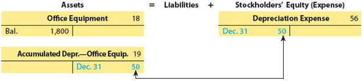

After the adjusting journal entry is recorded and posted, the office equipment account still has a debit balance of $1,800. This is the original cost of the office equipment that was purchased on December 4. The accumulated depreciation—office equipment account has a credit balance of $50. The difference between these two balances is the cost of the office equipment that has not yet been depreciated. This amount, called the **book value of the asset** (The difference between the cost of a fixed asset and its accumulated depreciation.), or **net book value** (The difference between the cost of a fixed asset and its accumulated depreciation.), is computed as follows:

[Después de que se registra y traspasa el asiento de diario de ajuste, la cuenta de equipo de oficina aún tiene un saldo deudor de $1,800. Este es el costo original del equipo de oficina que se compró el 4 de diciembre. La cuenta de depreciación acumulada—equipo de oficina tiene un saldo acreedor de $50. La diferencia entre estos dos saldos es el costo del equipo de oficina que aún no se ha depreciado. Este monto, llamado el **valor en libros del activo** (la diferencia entre el costo de un activo fijo y su depreciación acumulada), se calcula de la siguiente manera:]

---

### Book Value Calculation

[**Cálculo del Valor en Libros**]

| Formula | Calculation |
|---------|-------------|
| Book Value of Asset | Cost of Asset – Accumulated Depreciation of Asset |
| Book Value of Office Equipment| Cost of Office Equipment – Accumulated Depr. of Office Equipment |
||$1,800 – $50|
||$1,750|

$$

\text{Book Value of Asset} = \text{Cost of Asset – Accumulated Depreciation of Asset}

$$

$$

\text{Book Value of Office Equipment} = \text{Cost of Office Equipment } – \text{ Accumulated Depr. of Office Equipment}

$$

$$

\text{Book Value of Office Equipment} = \$1,800 – \$50

$$

$$

\text{Book Value of Office Equipment} = \$1,750

$$
---

## Balance Sheet Presentation

[**Presentación en el Balance General**]

The office equipment and its related accumulated depreciation are reported on the December 31, 20Y3, balance sheet as follows:

[El equipo de oficina y su depreciación acumulada relacionada se reportan en el balance general del 31 de diciembre de 20Y3 de la siguiente manera:]

|                          	| **Debit** 	| **Credit** 	|
|--------------------------	|:---------:	|:----------:	|
| Office equipment         	|   $1,800  	|            	|
| Accumulated depreciation 	|    (50)   	| **$1,750** 	|

---

**Link to Netflix:** On a recent balance sheet, Netflix reported property, plant, and equipment of $981 million, accumulated depreciation of $416 million, and a net book value of $565 million.

[**Enlace a Netflix:** En un balance general reciente, Netflix reportó propiedades, planta y equipo de $981 millones, depreciación acumulada de $416 millones, y un valor en libros neto de $565 millones.]

---

## Market Value vs. Book Value

[**Valor de Mercado vs. Valor en Libros**]

The market value of a fixed asset usually differs from its book value. This is because depreciation is an allocation method, not a valuation method. That is, depreciation allocates the cost of a fixed asset to expense over its estimated life. Depreciation does not measure changes in market values, which vary from year to year. Thus, on December 31, 20Y3, the market value of NetSolutions' office equipment could be more or less than $1,750.

[El valor de mercado de un activo fijo generalmente difiere de su valor en libros. Esto se debe a que la depreciación es un método de asignación, no un método de valoración. Es decir, la depreciación asigna el costo de un activo fijo al gasto a lo largo de su vida estimada. La depreciación no mide los cambios en los valores de mercado, que varían de un año a otro. Por lo tanto, al 31 de diciembre de 20Y3, el valor de mercado del equipo de oficina de NetSolutions podría ser más o menos de $1,750.]

---

## Effects of Omitting the Depreciation Adjustment

[**Efectos de Omitir el Ajuste de Depreciación**]

If the adjustment for depreciation ($50) is not recorded, Depreciation Expense on the income statement will be understated by $50, and the net income will be overstated by $50. On the balance sheet, assets (the book value of Office Equipment) and stockholders' equity (Retained Earnings) will be overstated by $50. The effects of omitting the adjustment for depreciation are as follows:

[Si el ajuste por depreciación ($50) no se registra, el Gasto de Depreciación en el estado de resultados estará subestimado en $50, y el ingreso neto estará sobrestimado en $50. En el balance general, los activos (el valor en libros del Equipo de Oficina) y el capital contable (Ganancias Retenidas) estarán sobrestimados en $50. Los efectos de omitir el ajuste por depreciación son los siguientes:]

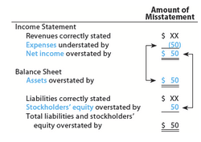</img>

| Financial Statement | Account | Effect of Omission |
|---------------------|---------|-------------------|
| **Income Statement** | Depreciation Expense | Understated by $50 |
| **Income Statement** | Net Income | Overstated by $50 |
| **Balance Sheet** | Assets (Book Value of Office Equipment) | Overstated by $50 |
| **Balance Sheet** | Stockholders' Equity (Retained Earnings) | Overstated by $50 |

---

## Check Up Corner 3-3

### Depreciation

[**Esquina de Verificación 3-3 - Depreciación**]

Selected account balances for Atlanta Rhythm Company on December 31 are as follows:

[Saldos de cuentas seleccionados para Atlanta Rhythm Company al 31 de diciembre son los siguientes:]

| | Debit Balances | Credit Balances |
|--|---------------|-----------------|
| Equipment | $40,000 | |
| Accumulated Depreciation—Equipment | | $12,000 |

Depreciation on equipment during the year is $4,000.

[La depreciación del equipo durante el año es de $4,000.]

**a. Journalize the adjusting entry necessary for depreciation on December 31.**
**b. Compute the book value of the equipment that will be reported on the balance sheet.**

[**a. Registre en el diario el asiento de ajuste necesario para la depreciación al 31 de diciembre.**
**b. Calcule el valor en libros del equipo que se reportará en el balance general.**]

---

### Solution - Check Up Corner 3-3

[**Solución - Esquina de Verificación 3-3**]

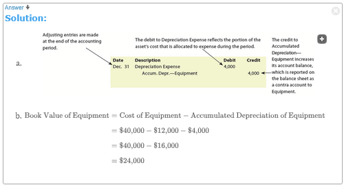</img>

**a. Adjusting Journal Entry**

| Date | Account | Debit | Credit |
|------|---------|-------|--------|
| Dec. 31 | Depreciation Expense | 4,000 | |
| | Accumulated Depreciation—Equipment | | 4,000 |
| *Depreciation on equipment.* | | | |

**b. Book Value Calculation**
[**Cálculo del Valor en Libros**]

| Formula | Calculation |
|---------|-------------|
| Book Value of Asset | Cost of Asset – Accumulated Depreciation of Asset |
| Book Value of Office Equipment| Cost of Office Equipment – Accumulated Depr. of Office Equipment |
||$40,000 – ($12,000 + $4,000)|
||$40,000 – $12,000 - $4,000|
||$40,000 – $16,000|
||$24,000|

---

<h1 id="273483" style="color:#E65100;">
  <a href="#Chapter_003" style="color:inherit; text-decoration:none;">
    3-5 Summary of Adjusting Process
  </a>
</h1>

A summary of the basic types of adjusting entries is shown in Exhibit 6. The adjusting entries for NetSolutions are shown in Exhibit 7. The adjusting entries are dated as of the last day of the period. However, because collecting the adjustment data requires time, the entries are usually recorded at a later date. An explanation is normally included with each adjusting entry.

[Un resumen de los tipos básicos de asientos de ajuste se muestra en la Figura 6. Los asientos de ajuste para NetSolutions se muestran en la Figura 7. Los asientos de ajuste se fechan como el último día del período. Sin embargo, debido a que la recopilación de los datos de ajuste requiere tiempo, los asientos generalmente se registran en una fecha posterior. Normalmente se incluye una explicación con cada asiento de ajuste.]

**Objective 5** - Summarize the adjusting process.

[**Objetivo 5** - Resumir el proceso de ajuste.]

---

## Exhibit 6

### Summary of Adjustments

[**Figura 6** - Resumen de Ajustes]

<!-- 📍 IMAGEN: Exhibit 6 - Summary of Adjustments (páginas 1-4) -->

| **ACCRUED REVENUES** [INGRESOS DEVENGADOS] | | | | | |
|---------------------------------------------|--|--|--|--|--|
| **Examples** [Ejemplos] | Services performed but not billed, interest to be received [Servicios realizados pero no facturados, intereses por cobrar] | | | | |
| **Reason for Adjustment** [Razón del Ajuste] | Services have been provided to the customer, but have not been billed or recorded. Interest has been earned, but has not been received or recorded. [Se han proporcionado servicios al cliente, pero no se han facturado ni registrado. Se han ganado intereses, pero no se han recibido ni registrado.] | | | | |
| **Adjusting Entry** [Asiento de Ajuste] | Asset [Activo] / Revenue [Ingreso] | Dr. Accounts Receivable [Debitar Cuentas por Cobrar] | Cr. Fees Earned [Acreditar Ingresos por Servicios] | | |
| **Examples from NetSolutions** [Ejemplos de NetSolutions] | 500 | | | | |
| **Financial Statement Impact if Adjusting Entry Is Omitted** [Impacto en los Estados Financieros si se Omite el Asiento de Ajuste] | | | | | |
| Income Statement: [Estado de Resultados:] | Revenues: Understated [Ingresos: Subestimados] | Expenses: No effect [Gastos: Sin efecto] | Net income: Understated [Ingreso neto: Subestimado] | | |
| Balance Sheet: [Balance General:] | Assets: Understated [Activos: Subestimados] | Liabilities: No effect [Pasivos: Sin efecto] | Stockholders' equity (Retained Earnings): Understated [Capital contable (Ganancias Retenidas): Subestimado] | | |

---

| **ACCRUED EXPENSES** [GASTOS DEVENGADOS] | | | | | |
|-------------------------------------------|--|--|--|--|--|
| **Examples** [Ejemplos] | Wages incurred but not paid, interest incurred but not paid [Sueldos incurridos pero no pagados, intereses incurridos pero no pagados] | | | | |
| **Reason for Adjustment** [Razón del Ajuste] | Services or costs have been incurred, but have not been paid or recorded. [Se han incurrido en servicios o costos, pero no se han pagado ni registrado.] | | | | |
| **Adjusting Entry** [Asiento de Ajuste] | Expense [Gasto] / Liability [Pasivo] | Dr. Expense [Debitar Gasto] | Cr. Liability (Wages Payable, Accounts Payable, etc.) [Acreditar Pasivo (Sueldos por Pagar, Cuentas por Pagar, etc.)] | | |
| **Examples from NetSolutions** [Ejemplos de NetSolutions] | 250 | | | | |
| **Financial Statement Impact if Adjusting Entry Is Omitted** [Impacto en los Estados Financieros si se Omite el Asiento de Ajuste] | | | | | |
| Income Statement: [Estado de Resultados:] | Revenues: No effect [Ingresos: Sin efecto] | Expenses: Understated [Gastos: Subestimados] | Net income: Overstated [Ingreso neto: Sobrestimado] | | |
| Balance Sheet: [Balance General:] | Assets: No effect [Activos: Sin efecto] | Liabilities: Understated [Pasivos: Subestimados] | Stockholders' equity (Retained Earnings): Overstated [Capital contable (Ganancias Retenidas): Sobrestimado] | | |

---

| **DEFERRED REVENUES (UN-EARNED REVENUES)** [INGRESOS DIFERIDOS (NO DEVENGADOS)] | | | | | |
|----------------------------------------------------------------------------------|--|--|--|--|--|
| **Examples** [Ejemplos] | Rent received in advance, subscriptions collected in advance [Renta recibida por adelantado, suscripciones cobradas por adelantado] | | | | |
| **Reason for Adjustment** [Razón del Ajuste] | Cash was received in advance, but the service has not yet been provided. Part of the liability has been earned during the period. [Se recibió efectivo por adelantado, pero el servicio aún no se ha proporcionado. Parte del pasivo se ha ganado durante el período.] | | | | |
| **Adjusting Entry** [Asiento de Ajuste] | Liability [Pasivo] / Revenue [Ingreso] | Dr. Unearned Revenue [Debitar Ingreso No Devengado] | Cr. Revenue [Acreditar Ingreso] | | |
| **Examples from NetSolutions** [Ejemplos de NetSolutions] | 120 | | | | |
| **Financial Statement Impact if Adjusting Entry Is Omitted** [Impacto en los Estados Financieros si se Omite el Asiento de Ajuste] | | | | | |
| Income Statement: [Estado de Resultados:] | Revenues: Understated [Ingresos: Subestimados] | Expenses: No effect [Gastos: Sin efecto] | Net income: Understated [Ingreso neto: Subestimado] | | |
| Balance Sheet: [Balance General:] | Assets: No effect [Activos: Sin efecto] | Liabilities: Overstated [Pasivos: Sobrestimados] | Stockholders' equity (Retained Earnings): Understated [Capital contable (Ganancias Retenidas): Subestimado] | | |

---

| **DEFERRED EXPENSES (PREPAID EXPENSES)** [GASTOS DIFERIDOS (PAGADOS POR ADELANTADO)] | | | | | |
|--------------------------------------------------------------------------------------|--|--|--|--|--|
| **Examples** [Ejemplos] | Supplies used, insurance expired, depreciation of equipment [Suministros usados, seguro vencido, depreciación de equipo] | | | | |
| **Reason for Adjustment** [Razón del Ajuste] | Cash was paid in advance, but the expense has not yet been incurred. Part of the asset has been used up during the period. [Se pagó efectivo por adelantado, pero el gasto aún no se ha incurrido. Parte del activo se ha consumido durante el período.] | | | | |
| **Adjusting Entry** [Asiento de Ajuste] | Expense [Gasto] / Asset [Activo] | Dr. Expense [Debitar Gasto] | Cr. Asset (Supplies, Prepaid Insurance, Accumulated Depreciation) [Acreditar Activo (Suministros, Seguro Pagado por Adelantado, Depreciación Acumulada)] | | |
| **Examples from NetSolutions** [Ejemplos de NetSolutions] | Supplies: $1,240 / Insurance: $200 / Depreciation: $50 [Suministros: $1,240 / Seguro: $200 / Depreciación: $50] | | | | |
| **Financial Statement Impact if Adjusting Entry Is Omitted** [Impacto en los Estados Financieros si se Omite el Asiento de Ajuste] | | | | | |
| Income Statement: [Estado de Resultados:] | Revenues: No effect [Ingresos: Sin efecto] | Expenses: Understated [Gastos: Subestimados] | Net income: Overstated [Ingreso neto: Sobrestimado] | | |
| Balance Sheet: [Balance General:] | Assets: Overstated [Activos: Sobrestimados] | Liabilities: No effect [Pasivos: Sin efecto] | Stockholders' equity (Retained Earnings): Overstated [Capital contable (Ganancias Retenidas): Sobrestimado] | | |

---

## Exhibit 7

### Adjusting Entries for NetSolutions

[**Figura 7** - Asientos de Ajuste para NetSolutions]

<!-- 📍 IMAGEN: Exhibit 7 - Adjusting Entries (página 5) -->

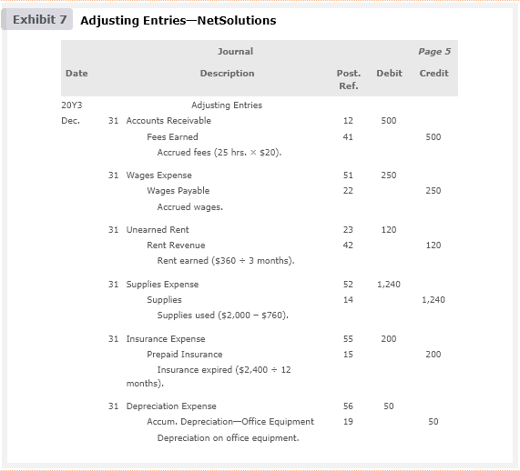

| Date [Fecha] | Description [Descripción] | Debit [Débito] | Credit [Crédito] |
|--------------|---------------------------|----------------|------------------|
| 20Y3 | **Adjusting Entries** [**Asientos de Ajuste**] | | |
| Dec. 31 [31 de dic.] | Accounts Receivable [Cuentas por Cobrar] | 500 | |
| | Fees Earned [Ingresos por Servicios] | | 500 |
| | *Accrued fees (25 hrs. × $20).* [*Honorarios devengados (25 hrs. × $20).*] | | |
| Dec. 31 [31 de dic.] | Wages Expense [Gasto de Sueldos] | 250 | |
| | Wages Payable [Sueldos por Pagar] | | 250 |
| | *Accrued wages.* [*Sueldos devengados.*] | | |
| Dec. 31 [31 de dic.] | Unearned Rent [Renta No Devengada] | 120 | |
| | Rent Revenue [Ingresos por Renta] | | 120 |
| | *Rent earned ($360 ÷ 3 months).* [*Renta ganada ($360 ÷ 3 meses).*] | | |
| Dec. 31 [31 de dic.] | Supplies Expense [Gasto de Suministros] | 1,240 | |
| | Supplies [Suministros] | | 1,240 |
| | *Supplies used ($2,000 – $760).* [*Suministros usados ($2,000 – $760).*] | | |
| Dec. 31 [31 de dic.] | Insurance Expense [Gasto de Seguro] | 200 | |
| | Prepaid Insurance [Seguro Pagado por Adelantado] | | 200 |
| | *Insurance expired ($2,400 ÷ 12 months).* [*Seguro vencido ($2,400 ÷ 12 meses).*] | | |
| Dec. 31 [31 de dic.] | Depreciation Expense [Gasto de Depreciación] | 50 | |
| | Accumulated Depreciation—Office Equipment [Depreciación Acumulada—Equipo de Oficina] | | 50 |
| | *Depreciation on office equipment.* [*Depreciación del equipo de oficina.*] | | |

---

## Business Insight

### Microsoft's Deferred Revenues

[**Perspectiva de Negocio - Ingresos Diferidos de Microsoft**]

Microsoft Corporation (MSFT) develops, manufactures, licenses, and supports a wide range of computer software products, including Windows® operating systems, Word®, Excel®, and the Xbox® gaming system. When Microsoft sells its products, it incurs an obligation to support its software with technical support and periodic updates. As a result, not all the revenue is earned on the date of sale; some of the revenue on the date of sale is unearned. The portion of revenue related to support services, such as updates and technical support, is earned as time passes and support is provided to customers. Thus, each year Microsoft makes adjusting entries transferring some of its unearned revenue to revenue. The following excerpts were taken from recent financial statements of Microsoft:

[Microsoft Corporation (MSFT) desarrolla, fabrica, licencia y respalda una amplia gama de productos de software informático, incluidos los sistemas operativos Windows®, Word®, Excel® y el sistema de juegos Xbox®. Cuando Microsoft vende sus productos, incurre en una obligación de respaldar su software con soporte técnico y actualizaciones periódicas. Como resultado, no todos los ingresos se ganan en la fecha de venta; parte de los ingresos en la fecha de venta no se han devengado. La parte de los ingresos relacionada con servicios de soporte, como actualizaciones y soporte técnico, se gana a medida que pasa el tiempo y se proporciona soporte a los clientes. Por lo tanto, cada año Microsoft realiza asientos de ajuste transfiriendo parte de sus ingresos no devengados a ingresos. Los siguientes extractos fueron tomados de estados financieros recientes de Microsoft:]

| | Year 2 [Año 2] | Year 1 [Año 1] |
|--|----------------|----------------|
| Unearned revenue (in millions) [Ingresos no devengados (en millones)] | $37,206 | $32,720 |

The Year 2 balance is equal to 30% of Year 2 revenues, indicating the significant impact of unearned revenue to Microsoft's operating results. During Year 3, Microsoft expects to recognize $32,676 of revenue from the $37,206 of unearned revenue. At the same time, Microsoft will record additional unearned revenue from Year 3 sales.

[El saldo del Año 2 es igual al 30% de los ingresos del Año 2, lo que indica el impacto significativo de los ingresos no devengados en los resultados operativos de Microsoft. Durante el Año 3, Microsoft espera reconocer $32,676 de ingresos de los $37,206 de ingresos no devengados. Al mismo tiempo, Microsoft registrará ingresos no devengados adicionales de las ventas del Año 3.]

---

## Exhibit 8

### Ledger with Adjusting Entries - NetSolutions

[**Figura 8** - Libro Mayor con Asientos de Ajuste - NetSolutions]

<!-- 📍 IMAGEN: Exhibit 8 - Ledger with Adjusting Entries (páginas 6-7) -->
<!-- Imágenes individuales con coordenadas: -->
<!-- [122, 71, 463, 149] -->
<!-- [122, 230, 463, 317] -->
<!-- [122, 330, 463, 417] -->
<!-- [122, 438, 463, 537] -->
<!-- [514, 0, 851, 92] -->
<!-- [514, 102, 851, 217] -->
<!-- [514, 231, 851, 317] -->
<!-- [514, 327, 851, 403] -->
<!-- [514, 414, 851, 500] -->

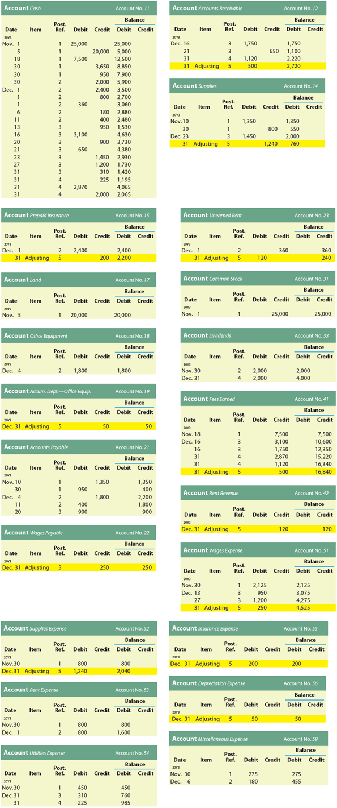

| Account Cash [Cuenta Efectivo] 	|   	|   	|   	|   	| Account No. 11 [Cuenta No. 11] 	|   	|
|-----------------:	|--------------------:	|-----------------------------:	|-------------------:	|---------------------:	|---------------------------------:	|-----------------------------------:	|

| **Date [Fecha]** 	| **Item [Concepto]** 	| **Post. Ref. [Ref. Trasp.]** 	| **Debit [Débito]** 	| **Credit [Crédito]** 	| **Balance Debit [Saldo Débito]** 	| **Balance Credit [Saldo Crédito]** 	|
|-----------------:	|--------------------:	|-----------------------------:	|-------------------:	|---------------------:	|---------------------------------:	|-----------------------------------:	|
|      20Y3 Nov. 1 	|                     	|                            1 	|             25,000 	|                      	|                           25,000 	|                                    	|
|           Nov. 5 	|                     	|                            1 	|                    	|               20,000 	|                            5,000 	|                                    	|
|          Nov. 18 	|                     	|                            1 	|              7,500 	|                      	|                           12,500 	|                                    	|
|          Nov. 30 	|                     	|                            1 	|                    	|                3,650 	|                            8,850 	|                                    	|
|          Nov. 30 	|                     	|                            1 	|                    	|                  950 	|                            7,900 	|                                    	|
|          Nov. 30 	|                     	|                            1 	|                    	|                2,000 	|                            5,900 	|                                    	|
|           Dec. 1 	|                     	|                            2 	|                    	|                2,400 	|                            3,500 	|                                    	|
|           Dec. 1 	|                     	|                            2 	|                    	|                  800 	|                            2,700 	|                                    	|
|           Dec. 1 	|                     	|                            2 	|                360 	|                      	|                            3,060 	|                                    	|
|           Dec. 6 	|                     	|                            2 	|                    	|                  180 	|                            2,880 	|                                    	|
|          Dec. 11 	|                     	|                            2 	|                    	|                  400 	|                            2,480 	|                                    	|
|          Dec. 13 	|                     	|                            2 	|                    	|                  950 	|                            1,530 	|                                    	|
|          Dec. 16 	|                     	|                            3 	|              3,100 	|                      	|                            4,630 	|                                    	|
|          Dec. 20 	|                     	|                            3 	|                    	|                  900 	|                            3,730 	|                                    	|
|          Dec. 21 	|                     	|                            3 	|                650 	|                      	|                            4,380 	|                                    	|
|          Dec. 23 	|                     	|                            3 	|                    	|                1,450 	|                            2,930 	|                                    	|
|          Dec. 27 	|                     	|                            3 	|                    	|                1,200 	|                            1,730 	|                                    	|
|          Dec. 31 	|                     	|                            3 	|                    	|                  310 	|                            1,420 	|                                    	|
|          Dec. 31 	|                     	|                            4 	|                    	|                  225 	|                            1,195 	|                                    	|
|          Dec. 31 	|                     	|                            4 	|              2,870 	|                      	|                            4,065 	|                                    	|
|          Dec. 31 	|                     	|                            4 	|                    	|                2,000 	|                            2,065 	|                                    	|

| Account Accounts Receivable [Cuenta Cuentas por Cobrar] | Account No. 12 [Cuenta No. 12] |
|---------------------------------------------------------|-------------------------------|

| Date [Fecha] | Item [Concepto] | Post. Ref. [Ref. Trasp.] | Debit [Débito] | Credit [Crédito] | Balance Debit [Saldo Débito] | Balance Credit [Saldo Crédito] |
|--------------|----------------|------------------|----------------|------------------|---------------------------|-----------------------------|
| 20Y3 Dec. 16 | | 3 | 1,750 | | 1,750 | |
| Dec. 21 | | 3 | | 650 | 1,100 | |
| Dec. 31 | | 4 | 1,120 | | 2,220 | |
| Dec. 31 | Adjusting [Ajuste] | 5 | 500 | | 2,720 | |

| Account Supplies [Cuenta Suministros] | Account No. 14 [Cuenta No. 14] |
|---------------------------------------|-------------------------------|

| Date [Fecha] | Item [Concepto] | Post. Ref. [Ref. Trasp.] | Debit [Débito] | Credit [Crédito] | Balance Debit [Saldo Débito] | Balance Credit [Saldo Crédito] |
|--------------|----------------|------------------|----------------|------------------|---------------------------|-----------------------------|
| 20Y3 Nov. 10 | | 1 | 1,350 | | 1,350 | |
| Nov. 30 | | 1 | | 800 | 550 | |
| Dec. 23 | | 3 | 1,450 | | 2,000 | |
| Dec. 31 | Adjusting [Ajuste] | 5 | | 1,240 | 760 | |

| Account Prepaid Insurance [Cuenta Seguro Pagado por Adelantado] | Account No. 15 [Cuenta No. 15] |
|-----------------------------------------------------------------|-------------------------------|

| Date [Fecha] | Item [Concepto] | Post. Ref. [Ref. Trasp.] | Debit [Débito] | Credit [Crédito] | Balance Debit [Saldo Débito] | Balance Credit [Saldo Crédito] |
|--------------|----------------|------------------|----------------|------------------|---------------------------|-----------------------------|
| 20Y3 Dec. 1 | | 2 | 2,400 | | 2,400 | |
| Dec. 31 | Adjusting [Ajuste] | 5 | | 200 | 2,200 | |

| Account Land [Cuenta Terreno] | Account No. 17 [Cuenta No. 17] |
|--------------------------------|-------------------------------|

| Date [Fecha] | Item [Concepto] | Post. Ref. [Ref. Trasp.] | Debit [Débito] | Credit [Crédito] | Balance Debit [Saldo Débito] | Balance Credit [Saldo Crédito] |
|--------------|----------------|------------------|----------------|------------------|---------------------------|-----------------------------|
| 20Y3 Nov. 5 | | 1 | 20,000 | | 20,000 | |

| Account Office Equipment [Cuenta Equipo de Oficina] | Account No. 18 [Cuenta No. 18] |
|-----------------------------------------------------|-------------------------------|

| Date [Fecha] | Item [Concepto] | Post. Ref. [Ref. Trasp.] | Debit [Débito] | Credit [Crédito] | Balance Debit [Saldo Débito] | Balance Credit [Saldo Crédito] |
|--------------|----------------|------------------|----------------|------------------|---------------------------|-----------------------------|
| 20Y3 Dec. 4 | | 2 | 1,800 | | 1,800 | |

| Account Accum. Depr.—Office Equip. [Cuenta Depreciación Acumulada—Equipo de Oficina] | Account No. 19 [Cuenta No. 19] |
|----------------------------------------------------------------------------------------|-------------------------------|

| Date [Fecha] | Item [Concepto] | Post. Ref. [Ref. Trasp.] | Debit [Débito] | Credit [Crédito] | Balance Debit [Saldo Débito] | Balance Credit [Saldo Crédito] |
|--------------|----------------|------------------|----------------|------------------|---------------------------|-----------------------------|
| 20Y3 Dec. 31 | Adjusting [Ajuste] | 5 | | 50 | | 50 |

| Account Accounts Payable [Cuenta Cuentas por Pagar] | Account No. 21 [Cuenta No. 21] |
|-----------------------------------------------------|-------------------------------|

| Date [Fecha] | Item [Concepto] | Post. Ref. [Ref. Trasp.] | Debit [Débito] | Credit [Crédito] | Balance Debit [Saldo Débito] | Balance Credit [Saldo Crédito] |
|--------------|----------------|------------------|----------------|------------------|---------------------------|-----------------------------|
| 20Y3 Nov. 10 | | 1 | | 1,350 | | 1,350 |
| Nov. 30 | | 1 | 950 | | | 400 |
| Dec. 4 | | 2 | | 1,800 | | 2,200 |
| Dec. 11 | | 2 | 400 | | | 1,800 |
| Dec. 20 | | 3 | 900 | | | 900 |

| Account Wages Payable [Cuenta Sueldos por Pagar] | Account No. 22 [Cuenta No. 22]|
|-----------------------------------------------------|-------------------------------|

| Date [Fecha] | Item [Concepto] | Post. Ref. [Ref. Trasp.] | Debit [Débito] | Credit [Crédito] | Balance [Saldo] |
|--------------|----------------|--------------------------|----------------|------------------|-----------------|
| Dec. 31 | Adjusting [Ajuste] | 5 | | 250 | 250 |

|Account Supplies Expense [Cuenta Gasto de Suministros] | Account No. 52 [Cuenta No. 52]|
|-----------------------------------------------------|-------------------------------|

| Date [Fecha] | Item [Concepto] | Post. Ref. [Ref. Trasp.] | Debit [Débito] | Credit [Crédito] | Balance [Saldo] |
|--------------|----------------|--------------------------|----------------|------------------|-----------------|
| 20Y3 Nov. 30 | | 1 | 800 | | 800 |
| Dec. 31 | Adjusting [Ajuste] | 5 | 1,240 | | 2,040 |

| Account Rent Expense [Cuenta Gasto de Renta] | Account No. 53 [Cuenta No. 53]|
|-----------------------------------------------------|-------------------------------|

| Date [Fecha] | Item [Concepto] | Post. Ref. [Ref. Trasp.] | Debit [Débito] | Credit [Crédito] | Balance [Saldo] |
|--------------|----------------|--------------------------|----------------|------------------|-----------------|
| 20Y3 Nov. 30 | | 1 | 800 | | 800 |
| Dec. 1 | | 2 | 800 | | 1,600 |

| Account Utilities Expense [Cuenta Gasto de Servicios Públicos] | Account No. 54 [Cuenta No. 54]|
|-----------------------------------------------------|-------------------------------|

| Date [Fecha] | Item [Concepto] | Post. Ref. [Ref. Trasp.] | Debit [Débito] | Credit [Crédito] | Balance [Saldo] |
|--------------|----------------|--------------------------|----------------|------------------|-----------------|
| 20Y3 Nov. 30 | | 1 | 450 | | 450 |
| Dec. 31 | | 3 | 310 | | 760 |
| Dec. 31 | | 4 | 225 | | 985 |

| Account Unearned Rent [Cuenta Renta No Devengada] | Account No. 23 [Cuenta No. 23] |
|---------------------------------------------------|-------------------------------|

| Date [Fecha] | Item [Concepto] | Post. Ref. [Ref. Trasp.] | Debit [Débito] | Credit [Crédito] | Balance Debit [Saldo Débito] | Balance Credit [Saldo Crédito] |
|--------------|----------------|------------------|----------------|------------------|---------------------------|-----------------------------|
| 20Y3 Dec. 1 | | 2 | | 360 | | 360 |
| Dec. 31 | Adjusting [Ajuste] | 5 | 120 | | | 240 |

| Account Common Stock [Cuenta Acciones Comunes] | Account No. 31 [Cuenta No. 31] |
|------------------------------------------------|-------------------------------|

| Date [Fecha] | Item [Concepto] | Post. Ref. [Ref. Trasp.] | Debit [Débito] | Credit [Crédito] | Balance Debit [Saldo Débito] | Balance Credit [Saldo Crédito] |
|--------------|----------------|------------------|----------------|------------------|---------------------------|-----------------------------|
| 20Y3 Nov. 1 | | 1 | | 25,000 | | 25,000 |

| Account Dividends [Cuenta Dividendos] | Account No. 33 [Cuenta No. 33] |
|---------------------------------------|-------------------------------|

| Date [Fecha] | Item [Concepto] | Post. Ref. [Ref. Trasp.] | Debit [Débito] | Credit [Crédito] | Balance Debit [Saldo Débito] | Balance Credit [Saldo Crédito] |
|--------------|----------------|------------------|----------------|------------------|---------------------------|-----------------------------|
| 20Y3 Nov. 30 | | 1 | 2,000 | | 2,000 | |
| Dec. 31 | | 4 | 2,000 | | 4,000 | |

| Account Fees Earned [Cuenta Ingresos por Servicios] | Account No. 41 [Cuenta No. 41] |
|-----------------------------------------------------|-------------------------------|

| Date [Fecha] | Item [Concepto] | Post. Ref. [Ref. Trasp.] | Debit [Débito] | Credit [Crédito] | Balance Debit [Saldo Débito] | Balance Credit [Saldo Crédito] |
|--------------|----------------|------------------|----------------|------------------|---------------------------|-----------------------------|
| 20Y3 Nov. 18 | | 1 | | 7,500 | | 7,500 |
| Dec. 16 | | 3 | | 3,100 | | 10,600 |
| Dec. 16 | | 3 | | 1,750 | | 12,350 |
| Dec. 31 | | 4 | | 2,870 | | 15,220 |
| Dec. 31 | | 4 | | 1,120 | | 16,340 |
| Dec. 31 | Adjusting [Ajuste] | 5 | | 500 | | 16,840 |

| Account Rent Revenue [Cuenta Ingresos por Renta] | Account No. 42 [Cuenta No. 42] |
|--------------------------------------------------|-------------------------------|

| Date [Fecha] | Item [Concepto] | Post. Ref. [Ref. Trasp.] | Debit [Débito] | Credit [Crédito] | Balance Debit [Saldo Débito] | Balance Credit [Saldo Crédito] |
|--------------|----------------|--------------------------|----------------|------------------|------------------------------|-------------------------------|
| Dec. 31 | Adjusting [Ajuste] | 5 | | 120 | | 120 |

| Account Wages Expense [Cuenta Gasto de Sueldos] | Account No. 51 [Cuenta No. 51] |
|------------------------------------------------|-------------------------------|

| Date [Fecha] | Item [Concepto] | Post. Ref. [Ref. Trasp.] | Debit [Débito] | Credit [Crédito] | Balance Debit [Saldo Débito] | Balance Credit [Saldo Crédito] |
|--------------|----------------|--------------------------|----------------|------------------|------------------------------|-------------------------------|
| Nov. 30 | | 1 | 2,125 | | 2,125 | |
| Dec. 13 | | 3 | 950 | | 3,075 | |
| Dec. 27 | | 3 | 1,200 | | 4,275 | |
| Dec. 31 | Adjusting [Ajuste] | 5 | 250 | | 4,525 | |

| Account Insurance Expense [Cuenta Gasto de Seguro] | Account No. 55 [Cuenta No. 55] |
|----------------------------------------------------|-------------------------------|

| Date [Fecha] | Item [Concepto] | Post. Ref. [Ref. Trasp.] | Debit [Débito] | Credit [Crédito] | Balance Debit [Saldo Débito] | Balance Credit [Saldo Crédito] |
|--------------|----------------|--------------------------|----------------|------------------|------------------------------|-------------------------------|
| Dec. 31 | Adjusting [Ajuste] | 5 | 200 | | 200 | |

| Account Depreciation Expense [Cuenta Gasto de Depreciación] | Account No. 56 [Cuenta No. 56] |
|------------------------------------------------------------|-------------------------------|

| Date [Fecha] | Item [Concepto] | Post. Ref. [Ref. Trasp.] | Debit [Débito] | Credit [Crédito] | Balance Debit [Saldo Débito] | Balance Credit [Saldo Crédito] |
|--------------|----------------|--------------------------|----------------|------------------|------------------------------|-------------------------------|
| Dec. 31 | Adjusting [Ajuste] | 5 | 50 | | 50 | |

| Account Miscellaneous Expense [Cuenta Gastos Misceláneos] | Account No. 59 [Cuenta No. 59] |
|----------------------------------------------------------|-------------------------------|

| Date [Fecha] | Item [Concepto] | Post. Ref. [Ref. Trasp.] | Debit [Débito] | Credit [Crédito] | Balance Debit [Saldo Débito] | Balance Credit [Saldo Crédito] |
|--------------|----------------|--------------------------|----------------|------------------|------------------------------|-------------------------------|
| Nov. 30 | | 1 | 275 | | 275 | |
| Dec. 6 | | 2 | 180 | | 455 | |

---

## Using Data Analytics

### Transforming Data

[**Uso de Analítica de Datos - Transformando Datos**]

When a company uses data analytics to solve a problem, it must not only extract relevant data but also transform the raw data. Transforming raw data involves the process of cleansing and assembling the extracted data into a data set. Extracted data may include erroneous or missing data, including values that are not meaningful such as outliers. The process of transforming the data evaluates, resolves, and "cleans" the data of erroneous and missing values. Once the extracted data are cleansed, they are combined into a data set for analysis.

[Cuando una empresa utiliza analítica de datos para resolver un problema, no solo debe extraer datos relevantes sino también transformar los datos en bruto. Transformar los datos en bruto implica el proceso de limpiar y ensamblar los datos extraídos en un conjunto de datos. Los datos extraídos pueden incluir datos erróneos o faltantes, incluidos valores que no son significativos, como valores atípicos. El proceso de transformar los datos evalúa, resuelve y "limpia" los datos de valores erróneos y faltantes. Una vez que los datos extraídos están limpios, se combinan en un conjunto de datos para su análisis.]

The data analytic process of transforming data is similar to the adjusting process that is described and illustrated in this chapter. For example, the unadjusted accounts must be transformed (updated) into adjusted accounts. In addition, the accounts must be evaluated (cleansed) for any erroneous or missing accounts. For example, a credit balance in supplies indicates an error.

[El proceso analítico de datos de transformación de datos es similar al proceso de ajuste que se describe e ilustra en este capítulo. Por ejemplo, las cuentas no ajustadas deben transformarse (actualizarse) en cuentas ajustadas. Además, las cuentas deben evaluarse (limpiarse) en busca de cuentas erróneas o faltantes. Por ejemplo, un saldo acreedor en suministros indica un error.]

---

<h1 id="557276" style="color:#E65100;">
  <a href="#Chapter_003" style="color:inherit; text-decoration:none;">
    3-6 Adjusted Trial Balance
  </a>
</h1>

After the adjusting entries are posted, an **adjusted trial balance** (The trial balance prepared after all the adjusting entries have been posted.) is prepared. The adjusted trial balance verifies the equality of the total debit and credit balances before the financial statements are prepared. If the adjusted trial balance does not balance, an error has occurred. However, as discussed in Chapter 2, errors may occur even though the adjusted trial balance totals agree. For example, if an adjusting entry were omitted, the adjusted trial balance totals would still agree.

[Después de que se traspasan los asientos de ajuste, se prepara un **balance de comprobación ajustado** (el balance de comprobación preparado después de que todos los asientos de ajuste han sido traspasados). El balance de comprobación ajustado verifica la igualdad de los totales de los saldos deudores y acreedores antes de que se preparen los estados financieros. Si el balance de comprobación ajustado no cuadra, ha ocurrido un error. Sin embargo, como se discutió en el Capítulo 2, pueden ocurrir errores incluso cuando los totales del balance de comprobación ajustado coinciden. Por ejemplo, si se omitiera un asiento de ajuste, los totales del balance de comprobación ajustado aún coincidirían.]

**Objective 6** - Prepare an adjusted trial balance.

[**Objetivo 6** - Preparar un balance de comprobación ajustado.]

Exhibit 9 shows the adjusted trial balance for NetSolutions as of December 31, 20Y3. Chapter 4 discusses how financial statements, including a classified balance sheet, are prepared from an adjusted trial balance.

[La Figura 9 muestra el balance de comprobación ajustado para NetSolutions al 31 de diciembre de 20Y3. El Capítulo 4 discute cómo se preparan los estados financieros, incluido un balance general clasificado, a partir de un balance de comprobación ajustado.]

---

## Exhibit 9

### Adjusted Trial Balance

[**Figura 9** - Balance de Comprobación Ajustado]

<!-- 📍 IMAGEN: Exhibit 9 - Adjusted Trial Balance (página 1) -->

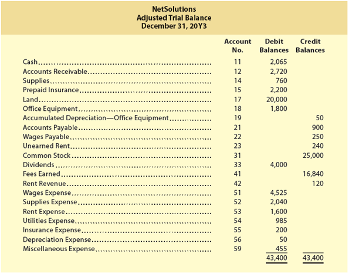

<table><thead>
  <tr>
    <th colspan="4">NetSolutions&nbsp;&nbsp;</th>
  </tr></thead>
<tbody>
  <tr>
    <td colspan="4">Adjusted Trial Balance&nbsp;&nbsp;</td>
  </tr>
  <tr>
    <td colspan="4">December 31, 20Y3&nbsp;&nbsp;</td>
  </tr>
  <tr>
    <td>Account No.</td>
    <td></td>
    <td>Debit Balances</td>
    <td>Credit Balances</td>
  </tr>
  <tr>
    <td>11</td>
    <td>Cash [Efectivo]</td>
    <td>2,065</td>
    <td></td>
  </tr>
  <tr>
    <td>12</td>
    <td>Accounts Receivable [Cuentas por Cobrar]</td>
    <td>2,720</td>
    <td></td>
  </tr>
  <tr>
    <td>14</td>
    <td>Supplies [Suministros]</td>
    <td>760</td>
    <td></td>
  </tr>
  <tr>
    <td>15</td>
    <td>Prepaid Insurance [Seguro Pagado por Adelantado]</td>
    <td>2,200</td>
    <td></td>
  </tr>
  <tr>
    <td>17</td>
    <td>Land [Terreno]</td>
    <td>20,000</td>
    <td></td>
  </tr>
  <tr>
    <td>18</td>
    <td>Office Equipment [Equipo de Oficina]</td>
    <td>1,800</td>
    <td></td>
  </tr>
  <tr>
    <td>19</td>
    <td>Accumulated Depreciation—Office Equipment [Depreciación Acumulada—Equipo de Oficina]</td>
    <td></td>
    <td>50</td>
  </tr>
  <tr>
    <td>21</td>
    <td>Accounts Payable [Cuentas por Pagar]</td>
    <td></td>
    <td>900</td>
  </tr>
  <tr>
    <td>22</td>
    <td>Wages Payable [Sueldos por Pagar]</td>
    <td></td>
    <td>250</td>
  </tr>
  <tr>
    <td>23</td>
    <td>Unearned Rent [Renta No Devengada]</td>
    <td></td>
    <td>240</td>
  </tr>
  <tr>
    <td>31</td>
    <td>Common Stock [Acciones Comunes]</td>
    <td></td>
    <td>25,000</td>
  </tr>
  <tr>
    <td>33</td>
    <td>Dividends [Dividendos]</td>
    <td>4,000</td>
    <td></td>
  </tr>
  <tr>
    <td>41</td>
    <td>Fees Earned [Ingresos por Servicios]</td>
    <td></td>
    <td>16,840</td>
  </tr>
  <tr>
    <td>42</td>
    <td>Rent Revenue [Ingresos por Renta]</td>
    <td></td>
    <td>120</td>
  </tr>
  <tr>
    <td>51</td>
    <td>Wages Expense [Gasto de Sueldos]</td>
    <td>4,525</td>
    <td></td>
  </tr>
  <tr>
    <td>52</td>
    <td>Supplies Expense [Gasto de Suministros]</td>
    <td>2,040</td>
    <td></td>
  </tr>
  <tr>
    <td>53</td>
    <td>Rent Expense [Gasto de Renta]</td>
    <td>1,600</td>
    <td></td>
  </tr>
  <tr>
    <td>54</td>
    <td>Utilities Expense [Gasto de Servicios Públicos]</td>
    <td>985</td>
    <td></td>
  </tr>
  <tr>
    <td>55</td>
    <td>Insurance Expense [Gasto de Seguro]</td>
    <td>200</td>
    <td></td>
  </tr>
  <tr>
    <td>56</td>
    <td>Depreciation Expense [Gasto de Depreciación]</td>
    <td>50</td>
    <td></td>
  </tr>
  <tr>
    <td>59</td>
    <td>Miscellaneous Expense [Gastos Misceláneos]</td>
    <td>455</td>
    <td></td>
  </tr>
  <tr>
    <td></td>
    <td>Totals[Totales]</td>
    <td>43,400</td>
    <td>43,400</td>
  </tr>
</tbody></table>

---

## Pathways Challenge

### This Is Accounting!

### Economic Activity

[**Desafío Pathways - ¡Esto es Contabilidad! - Actividad Económica**]

Delta Air Lines (DAL) offers air transportation service to destinations throughout the world and serves more than 180 million passengers each year. In an effort to retain and increase passenger loyalty, Delta encourages its passengers to join its SkyMiles (frequent flyer) program. Passengers earn mileage credits for award travel as well as earn "elite" status that includes early boarding and free checked baggage. SkyMiles credits never expire.

[Delta Air Lines (DAL) ofrece servicio de transporte aéreo a destinos en todo el mundo y sirve a más de 180 millones de pasajeros cada año. En un esfuerzo por retener y aumentar la lealtad de los pasajeros, Delta anima a sus pasajeros a unirse a su programa SkyMiles (viajero frecuente). Los pasajeros ganan créditos de millas para viajes de recompensa, así como también obtienen estado "élite" que incluye abordaje temprano y equipaje facturado gratis. Los créditos de SkyMiles nunca expiran.]

Assume that during December 20Y6 you flew on Delta Air Lines using a ticket you purchased for $1,000 that earned 2,000 mileage credits that you plan to use in 20Y7.

[Suponga que durante diciembre de 20Y6 voló en Delta Air Lines usando un boleto que compró por $1,000 que ganó 2,000 créditos de millas que planea usar en 20Y7.]

### Critical Thinking/Judgment

[**Pensamiento Crítico/Juicio**]

**Should Delta record $1,000 as revenue for 20Y6?**

[**¿Debería Delta registrar $1,000 como ingreso para 20Y6?**]

**How should Delta account for the 2,000 mileage credits?**

[**¿Cómo debería Delta contabilizar los 2,000 créditos de millas?**]

**Can you think of an adjusting entry related to the 2,000 mileage credits for the year ending December 31, 20Y6, that Delta might have to record?**

[**¿Puede pensar en un asiento de ajuste relacionado con los 2,000 créditos de millas para el año que termina el 31 de diciembre de 20Y6 que Delta podría tener que registrar?**]

---

### Solution

[**Solución**]

**Question 1:** Delta should **not** record the full $1,000 as revenue in 20Y6. A portion of the ticket price relates to the future obligation of providing the mileage credits (the SkyMiles) that will be used in 20Y7. Under the revenue recognition principle, revenue is recognized only when the service is provided or the obligation is fulfilled.

[**Pregunta 1:** Delta **no** debería registrar los $1,000 completos como ingreso en 20Y6. Una parte del precio del boleto se relaciona con la obligación futura de proporcionar los créditos de millas (los SkyMiles) que se usarán en 20Y7. Bajo el principio de reconocimiento de ingresos, los ingresos se reconocen solo cuando se proporciona el servicio o se cumple la obligación.]

**Question 2:** Delta should account for the mileage credits as **unearned revenue** (deferred revenue). When the ticket is sold, Delta receives cash but has a future obligation to provide travel services when the credits are redeemed. Therefore, a portion of the ticket price should be recorded as a liability (Unearned Revenue) and recognized as revenue only when the credits are used or expire.

[**Pregunta 2:** Delta debería contabilizar los créditos de millas como **ingresos no devengados** (ingresos diferidos). Cuando se vende el boleto, Delta recibe efectivo pero tiene una obligación futura de proporcionar servicios de viaje cuando los créditos se canjeen. Por lo tanto, una parte del precio del boleto debe registrarse como un pasivo (Ingresos No Devengados) y reconocerse como ingreso solo cuando los créditos se usen o expiren.]

**Question 3:** Yes, Delta would record an adjusting entry to recognize a portion of the unearned revenue as earned, based on the estimated value of the mileage credits that have been used or expired during the period. The adjusting entry would be:

[**Pregunta 3:** Sí, Delta registraría un asiento de ajuste para reconocer una parte de los ingresos no devengados como ganados, basado en el valor estimado de los créditos de millas que se han usado o han expirado durante el período. El asiento de ajuste sería:]

| Account [Cuenta] | Debit [Débito] | Credit [Crédito] |
|------------------|----------------|------------------|
| Unearned Revenue [Ingresos No Devengados] | XXX | |
| Revenue [Ingresos] | | XXX |
| *To recognize revenue for mileage credits used during the period.* [*Para reconocer ingresos por créditos de millas usados durante el período.*] | | |

---

## Analysis for Decision Making

### Vertical Analysis

[**Análisis para la Toma de Decisiones - Análisis Vertical**]

Comparing each item on a financial statement with a total amount from the same statement is useful in analyzing relationships within the financial statement.

[Comparar cada partida en un estado financiero con un monto total del mismo estado es útil para analizar las relaciones dentro del estado financiero.]

**Objective 7** - Describe and illustrate the use of vertical analysis in evaluating a company's performance and financial condition.

[**Objetivo 7** - Describir e ilustrar el uso del análisis vertical en la evaluación del desempeño y la condición financiera de una empresa.]

**Vertical analysis** (An analysis that compares each item in a current statement with a total or key amount within the same statement.) is the term used to describe such comparisons.

[**Análisis vertical** (un análisis que compara cada partida en un estado actual con un monto total o clave dentro del mismo estado) es el término utilizado para describir tales comparaciones.]

In vertical analysis of a balance sheet, each asset item is stated as a percent of the total assets. Each liability and stockholders' equity item is stated as a percent of total liabilities and stockholders' equity. In vertical analysis of an income statement, each item is stated as a percent of revenues or fees earned.

[En el análisis vertical de un balance general, cada partida de activo se expresa como un porcentaje del total de activos. Cada partida de pasivo y capital contable se expresa como un porcentaje del total de pasivos y capital contable. En el análisis vertical de un estado de resultados, cada partida se expresa como un porcentaje de los ingresos o ingresos por servicios.]

Vertical analysis is also useful for analyzing changes in financial statements over time. To illustrate, a vertical analysis of two years of income statements for J. Holmes, Attorney-at-Law, follows:

[El análisis vertical también es útil para analizar cambios en los estados financieros a lo largo del tiempo. Para ilustrar, a continuación se presenta un análisis vertical de dos años de estados de resultados para J. Holmes, Abogado:]

---

### Vertical Analysis Example

[**Ejemplo de Análisis Vertical**]

<table><thead>
  <tr>
    <th colspan="6">J. Holmes, Attorney-at-Law</th>
  </tr></thead>
<tbody>
  <tr>
    <td colspan="6">Income Statements</td>
  </tr>
  <tr>
    <td colspan="6">For the Years Ended December 31</td>
  </tr>
  <tr>
    <td colspan="2">Item</td>
    <td>Amount</td>
    <td>Percent*</td>
    <td>Amount</td>
    <td>Percent*</td>
  </tr>
  <tr>
    <td colspan="2">Fees earned [Ingresos por Servicios]</td>
    <td>$187,500</td>
    <td>100.0%</td>
    <td>$150,000</td>
    <td>100.0%</td>
  </tr>
  <tr>
    <td colspan="2">Expenses [Gastos]</td>
    <td></td>
    <td></td>
    <td></td>
    <td></td>
  </tr>
  <tr>
    <td></td>
    <td>Wages expense</td>
    <td>$60,000</td>
    <td>32.0%</td>
    <td>$45,000</td>
    <td>30.0%</td>
  </tr>
  <tr>
    <td></td>
    <td>Rent expense</td>
    <td>$15,000</td>
    <td>8.0%</td>
    <td>$12,000</td>
    <td>8.0%</td>
  </tr>
  <tr>
    <td></td>
    <td>Utilities expense</td>
    <td>$12,500</td>
    <td>6.7%</td>
    <td>$9,000</td>
    <td>6.0%</td>
  </tr>
  <tr>
    <td></td>
    <td>Supplies expense</td>
    <td>$2,700</td>
    <td>1.4%</td>
    <td>$3,000</td>
    <td>2.0%</td>
  </tr>
  <tr>
    <td></td>
    <td>Miscellaneous expense</td>
    <td>$2,300</td>
    <td>1.2%</td>
    <td>$1,800</td>
    <td>1.2%</td>
  </tr>
  <tr>
    <td></td>
    <td>Total expenses</td>
    <td>$92,500</td>
    <td>49.3%</td>
    <td>$70,800</td>
    <td>47.2%</td>
  </tr>
  <tr>
    <td colspan="2">Net income</td>
    <td>$95,000</td>
    <td>50.7%</td>
    <td>$79,200</td>
    <td>52.8%</td>
  </tr>
</tbody></table>

*Rounded to one decimal place*

The preceding vertical analysis indicates both favorable and unfavorable changes affecting the income statement of J. Holmes, Attorney-at-Law. The increase in wages expense of 2.0% (32.0% – 30.0%) is an unfavorable change, as is the increase in utilities expense of 0.7% (6.7% – 6.0%). A favorable change is the decrease in supplies expense of 0.6% (2.0% – 1.4%). Rent expense and miscellaneous expense as a percent of fees earned were constant. The net result of these changes is that net income decreased as a percent of fees earned from 52.8% to 50.7%.

[El análisis vertical anterior indica cambios tanto favorables como desfavorables que afectan el estado de resultados de J. Holmes, Abogado. El aumento en el gasto de sueldos del 2.0% (32.0% – 30.0%) es un cambio desfavorable, al igual que el aumento en el gasto de servicios públicos del 0.7% (6.7% – 6.0%). Un cambio favorable es la disminución en el gasto de suministros del 0.6% (2.0% – 1.4%). El gasto de renta y los gastos misceláneos como porcentaje de los ingresos por servicios se mantuvieron constantes. El resultado neto de estos cambios es que el ingreso neto disminuyó como porcentaje de los ingresos por servicios del 52.8% al 50.7%.]

The analysis of the various percentages shown for J. Holmes, Attorney-at-Law, can be enhanced by comparisons with industry averages. Such averages are published by trade associations and financial information services. Any major differences between industry averages should be investigated.

[El análisis de los diversos porcentajes mostrados para J. Holmes, Abogado, puede mejorarse con comparaciones con promedios de la industria. Dichos promedios son publicados por asociaciones comerciales y servicios de información financiera. Cualquier diferencia importante entre los promedios de la industria debe investigarse.]

---

## Make a Decision

### Vertical Analysis

[**Tome una Decisión - Análisis Vertical**]

- Analyze Amazon.com (MAD 3-1) (Continuing company analysis)
- Analyze Netflix (MAD 3-2)
- Analyze World Wrestling Entertainment (MAD 3-3)
- Analyze Chipotle Mexican Grill (MAD 3-4)
- Analyze Nike (MAD 3-5)

---

<h1 id="176918" style="color:#E65100;">
  <a href="#Chapter_003" style="color:inherit; text-decoration:none;">
    3-7a Let’s Review Chapter Summary
  </a>
</h1>

[**3-7 Revisión del Capítulo - 3-7a Revisemos el Resumen del Capítulo**]

**1.** The accrual basis of accounting requires that revenues are reported in the period in which they are earned and expenses are matched with the revenues they generate. The updating of accounts at the end of the accounting period is called the adjusting process. Each adjusting entry affects an income statement and balance sheet account. The two general classifications for accounts requiring adjustment are accruals and deferrals. Accruals include accrued revenues and accrued expenses. Deferrals include unearned revenues and prepaid expenses.

[**1.** El método de acumulación (o devengo) requiere que los ingresos se reporten en el período en el que se ganan y que los gastos se correspondan con los ingresos que generan. La actualización de las cuentas al final del período contable se llama proceso de ajuste. Cada asiento de ajuste afecta una cuenta del estado de resultados y una cuenta del balance general. Las dos clasificaciones generales para las cuentas que requieren ajuste son los devengos y los diferimientos. Los devengos incluyen ingresos devengados y gastos devengados. Los diferimientos incluyen ingresos no devengados y gastos pagados por adelantado.]

**2.** Adjusting entries for accruals include accrued revenues and expenses. The adjusting entry for an accrued revenue debits Accounts Receivable and credits a revenue account such as Fees Earned. The adjusting entry for an accrued expense debits an expense account such as Wages Expense and credits a liability account such as Wages Payable.

[**2.** Los asientos de ajuste para devengos incluyen ingresos y gastos devengados. El asiento de ajuste para un ingreso devengado debita Cuentas por Cobrar y acredita una cuenta de ingreso como Ingresos por Servicios. El asiento de ajuste para un gasto devengado debita una cuenta de gasto como Gasto de Sueldos y acredita una cuenta de pasivo como Sueldos por Pagar.]

**3.** Adjusting entries for deferrals include unearned revenues and prepaid expenses. The adjusting entry for an unearned revenue debits an unearned revenue account such as Unearned Rent and credits a revenue account such as Rent Revenue. The adjusting entry for a prepaid expense debits an expense account such as Supplies Expense and credits an asset account such as Supplies.

[**3.** Los asientos de ajuste para diferimientos incluyen ingresos no devengados y gastos pagados por adelantado. El asiento de ajuste para un ingreso no devengado debita una cuenta de ingreso no devengado como Renta No Devengada y acredita una cuenta de ingreso como Ingresos por Renta. El asiento de ajuste para un gasto pagado por adelantado debita una cuenta de gasto como Gasto de Suministros y acredita una cuenta de activo como Suministros.]

**4.** The adjusting entry for depreciation of a fixed asset debits Depreciation Expense and credits a contra asset account, Accumulated Depreciation. The book value of a fixed asset equals its cost less its accumulated depreciation. Land is a fixed asset that does not depreciate.

[**4.** El asiento de ajuste para la depreciación de un activo fijo debita Gasto de Depreciación y acredita una cuenta de contra activo, Depreciación Acumulada. El valor en libros de un activo fijo es igual a su costo menos su depreciación acumulada. El terreno es un activo fijo que no se deprecia.]

**5.** A summary of adjustments, including the type of adjustment, reason for the adjustment, the adjusting entry, and the effect of omitting an adjustment on the financial statements, is shown in Exhibit 6.

[**5.** Un resumen de los ajustes, que incluye el tipo de ajuste, la razón del ajuste, el asiento de ajuste y el efecto de omitir un ajuste en los estados financieros, se muestra en la Figura 6.]

**6.** After all of the adjusting entries have been posted, the equality of the total debit balances and the total credit balances is verified by an adjusted trial balance.

[**6.** Después de que todos los asientos de ajuste han sido traspasados, la igualdad de los totales de los saldos deudores y los saldos acreedores se verifica mediante un balance de comprobación ajustado.]

**7.** Vertical analysis compares each item on a financial statement with a total amount from the same statement. It is useful in analyzing relationships within the financial statement. In vertical analysis of a balance sheet, each asset item is stated as a percent of the total assets. Each liability and stockholders' equity item is stated as a percent of total liabilities and stockholders' equity. In vertical analysis of an income statement, each item is stated as a percent of revenues or fees earned.

[**7.** El análisis vertical compara cada partida en un estado financiero con un monto total del mismo estado. Es útil para analizar las relaciones dentro del estado financiero. En el análisis vertical de un balance general, cada partida de activo se expresa como un porcentaje del total de activos. Cada partida de pasivo y capital contable se expresa como un porcentaje del total de pasivos y capital contable. En el análisis vertical de un estado de resultados, cada partida se expresa como un porcentaje de los ingresos o ingresos por servicios.]

---

<h1 id="708093" style="color:#E65100;">
  <a href="#Chapter_003" style="color:inherit; text-decoration:none;">
    3-7b Key Terms
  </a>
</h1>

## 3-7b Key Terms

[**3-7b Términos Clave**]

| English Term | Español | Definition (English) | Definición (Español) |
|--------------|---------|---------------------|---------------------|
| **accrual** | devengo | A revenue that has been earned or an expense that has been incurred but has not been recorded. | Un ingreso que se ha ganado o un gasto en el que se ha incurrido pero que no se ha registrado. |
| **accrual basis of accounting** | método de acumulación (o devengo) | A basis of accounting under which revenues and expenses are reported on the income statement in the period in which they are earned or incurred. | Un método de contabilidad bajo el cual los ingresos y gastos se reportan en el estado de resultados en el período en el que se ganan o incurren. |
| **Accumulated Depreciation** | Depreciación Acumulada | The contra asset account credited when recording the depreciation of a fixed asset. | La cuenta de contra activo que se acredita al registrar la depreciación de un activo fijo. |
| **adjusted trial balance** | balance de comprobación ajustado | The trial balance prepared after all the adjusting entries have been posted. | El balance de comprobación preparado después de que todos los asientos de ajuste han sido traspasados. |
| **adjusting entries** | asientos de ajuste | The journal entries that bring the accounts up to date at the end of the accounting period. | Los asientos de diario que actualizan las cuentas al final del período contable. |
| **adjusting process** | proceso de ajuste | An analysis and updating of the accounts when financial statements are prepared. | Un análisis y actualización de las cuentas cuando se preparan los estados financieros. |
| **book value of the asset** | valor en libros del activo | The difference between the cost of a fixed asset and its accumulated depreciation. | La diferencia entre el costo de un activo fijo y su depreciación acumulada. |
| **cash basis of accounting** | método de efectivo | A basis of accounting under which revenues and expenses are reported on the income statement in the period in which cash is received or paid. | Un método de contabilidad bajo el cual los ingresos y gastos se reportan en el estado de resultados en el período en el que se recibe o paga el efectivo. |
| **contra accounts** | cuentas de contra | An account offset against another account. | Una cuenta que se compensa con otra cuenta. |
| **deferral** | diferimiento | A future revenue or expense initially recorded as a liability or asset. | Un ingreso o gasto futuro inicialmente registrado como un pasivo o activo. |
| **depreciate** | depreciarse | To lose value or usefulness over time. | Perder valor o utilidad con el tiempo. |
| **depreciation** | depreciación | The systematic periodic transfer of the cost of a fixed asset to an expense account during its expected useful life. | La transferencia periódica sistemática del costo de un activo fijo a una cuenta de gasto durante su vida útil esperada. |
| **depreciation expense** | gasto de depreciación | The portion of the cost of a fixed asset that is recorded as an expense each year of its useful life. | La porción del costo de un activo fijo que se registra como un gasto cada año de su vida útil. |
| **expense recognition principle** | principio de reconocimiento de gastos | The principle that requires expenses to be reported in the same period as the revenues they helped generate. | El principio que requiere que los gastos se reporten en el mismo período que los ingresos que ayudaron a generar. |
| **fixed assets** | activos fijos | Physical resources that are owned and used by a business and are permanent or have a long life; long-term or relatively permanent tangible assets such as equipment, machinery, buildings, and land that are used in normal business operations. | Recursos físicos que son propiedad de un negocio y son utilizados por él, y son permanentes o tienen una larga vida; activos tangibles a largo plazo o relativamente permanentes como equipo, maquinaria, edificios y terreno que se utilizan en las operaciones normales del negocio. |
| **matching principle** | principio de correspondencia | A concept of accounting in which expenses are matched with the revenue generated during a period by those expenses. | Un concepto contable en el que los gastos se corresponden con los ingresos generados durante un período por esos gastos. |
| **prepaid expense** | gasto pagado por adelantado | An asset created when a business pays cash for expenses in advance of their use or consumption. | Un activo creado cuando un negocio paga efectivo por gastos antes de su uso o consumo. |
| **revenue recognition principle** | principio de reconocimiento de ingresos | The principle that requires revenues to be recorded when earned, which is when services have been performed or products have been delivered to customers. | El principio que requiere que los ingresos se registren cuando se ganan, es decir, cuando se han realizado los servicios o se han entregado los productos a los clientes. |
| **unearned revenue** | ingreso no devengado (ingreso diferido) | The liability created by receiving revenue in advance. | El pasivo creado al recibir ingresos por adelantado. |
| **vertical analysis** | análisis vertical | An analysis that compares each item in a current statement with a total or key amount within the same statement. | Un análisis que compara cada partida en un estado actual con un monto total o clave dentro del mismo estado. |

---
