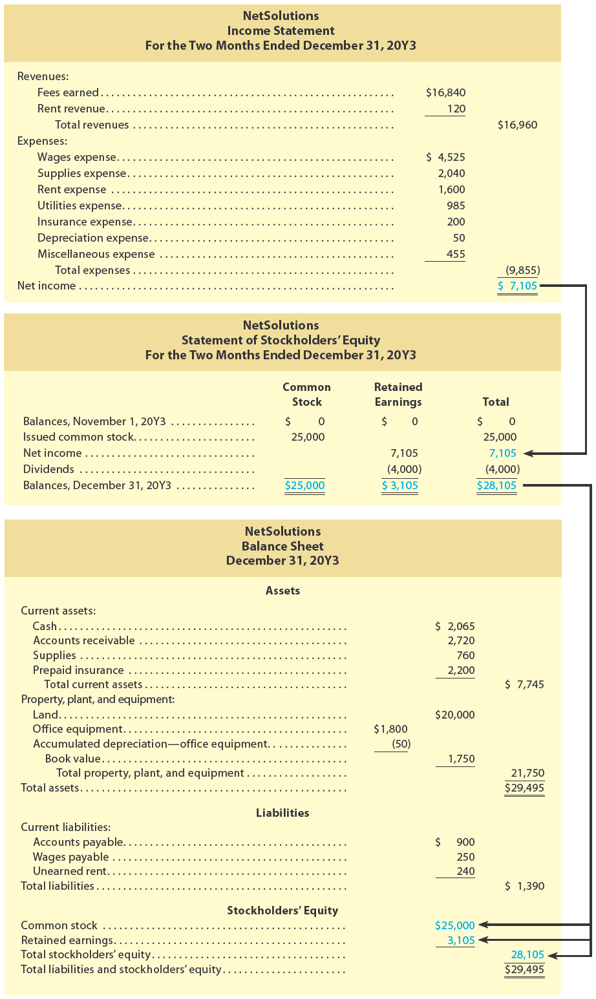

<h1 id="Chapter_004" style="color:#42A5F5;">Indice</h1>

##### [Capitulo 4-1 Flow of Accounting Information](#197654)

##### [Capitulo 4-2 Financial Statements](#910205)

---

<h1 id="197654" style="color:#E65100;">
  <a href="#Chapter_004" style="color:inherit; text-decoration:none;">
    4-1 Flow of Accounting Information
  </a>
</h1>

The process of adjusting the accounts and preparing financial statements is one of the most important in accounting. Using the NetSolutions illustration from Chapters 1, 2, and 3 and an end-of-period spreadsheet, the flow of accounting data in adjusting accounts and preparing financial statements is summarized in Exhibit 1.

[El proceso de ajustar las cuentas y preparar los estados financieros es uno de los más importantes en la contabilidad. Utilizando la ilustración de NetSolutions de los Capítulos 1, 2 y 3 y una hoja de cálculo de fin de período, el flujo de los datos contables en el ajuste de cuentas y la preparación de estados financieros se resume en la Figura 1.]

**Objective 1** - Describe the flow of accounting information from the unadjusted trial balance into the adjusted trial balance and financial statements.

[**Objetivo 1** - Describir el flujo de la información contable desde el balance de comprobación no ajustado hacia el balance de comprobación ajustado y los estados financieros.]

---

## Exhibit 1

### End-of-Period Spreadsheet and Flow of Accounting Data—NetSolutions

[**Figura 1** - Hoja de Cálculo de Fin de Período y Flujo de Datos Contables—NetSolutions]

<!-- 📍 IMAGEN: Exhibit 1 - End-of-Period Spreadsheet and Flow of Accounting Data (coordenadas [122, 399, 843, 812]) -->

The end-of-period spreadsheet in Exhibit 1 begins with the unadjusted trial balance. The unadjusted trial balance verifies that the total of the debit balances equals the total of the credit balances. If the trial balance totals are unequal, an error has occurred. Any errors must be found and corrected before the end-of-period process can continue.

[La hoja de cálculo de fin de período en la Figura 1 comienza con el balance de comprobación no ajustado. El balance de comprobación no ajustado verifica que el total de los saldos deudores sea igual al total de los saldos acreedores. Si los totales del balance de comprobación son desiguales, ha ocurrido un error. Cualquier error debe ser encontrado y corregido antes de que el proceso de fin de período pueda continuar.]

The adjustments for NetSolutions from Chapter 3 are shown in the Adjustments columns of the spreadsheet. Cross-referencing (by letters) the debit and credit of each adjustment is useful in reviewing the effect of the adjustments on the unadjusted account balances. The

[Los ajustes para NetSolutions del Capítulo 3 se muestran en las columnas de Ajustes de la hoja de cálculo. La referencia cruzada (mediante letras) del débito y crédito de cada ajuste es útil para revisar el efecto de los ajustes en los saldos de las cuentas no ajustadas.]

---

**1.** The revenue and expense accounts (spreadsheet lines 20-28) flow into the income statement.

[**1.** Las cuentas de ingresos y gastos (líneas 20-28 de la hoja de cálculo) fluyen hacia el estado de resultados.]

**2.** The common stock and dividends accounts (spreadsheet lines 18 and 19) flow into the statement of stockholders' equity. The net income of $7,105 also flows into the statement of stockholders' equity from the income statement.

[**2.** Las cuentas de acciones comunes y dividendos (líneas 18 y 19 de la hoja de cálculo) fluyen hacia el estado de cambios en el capital contable. El ingreso neto de $7,105 también fluye hacia el estado de cambios en el capital contable desde el estado de resultados.]

**3.** The asset and liability accounts (spreadsheet lines 8-17) flow into the balance sheet. The end-of-period common stock and retained earnings also flow into the balance sheet from the statement of stockholders' equity.

[**3.** Las cuentas de activo y pasivo (líneas 8-17 de la hoja de cálculo) fluyen hacia el balance general. Las acciones comunes y las ganancias retenidas de fin de período también fluyen hacia el balance general desde el estado de cambios en el capital contable.]

To summarize, Exhibit 1 illustrates the process by which accounts are adjusted. In addition, Exhibit 1 illustrates how the adjusted accounts flow into the financial statements. The financial statements for NetSolutions can be prepared directly from Exhibit 1.

[Para resumir, la Figura 1 ilustra el proceso mediante el cual se ajustan las cuentas. Además, la Figura 1 ilustra cómo las cuentas ajustadas fluyen hacia los estados financieros. Los estados financieros para NetSolutions se pueden preparar directamente a partir de la Figura 1.]

The spreadsheet in Exhibit 1 is not required. However, many accountants prepare such a spreadsheet, sometimes called a work sheet, as part of the normal end-of-period process. The primary advantage in doing so is that it allows managers and accountants to see the effect of adjustments on the financial statements. This is especially useful for adjustments that depend upon estimates. Such estimates and their effect on the financial statements are discussed in later chapters.

[La hoja de cálculo en la Figura 1 no es obligatoria. Sin embargo, muchos contadores preparan dicha hoja de cálculo, a veces llamada hoja de trabajo, como parte del proceso normal de fin de período. La ventaja principal de hacerlo es que permite a los gerentes y contadores ver el efecto de los ajustes en los estados financieros. Esto es especialmente útil para ajustes que dependen de estimaciones. Dichas estimaciones y su efecto en los estados financieros se discuten en capítulos posteriores.]

---

<h1 id="910205" style="color:#E65100;">
  <a href="#Chapter_004" style="color:inherit; text-decoration:none;">
    4-2 Financial Statements
  </a>
</h1>

Using the adjusted trial balance shown in Exhibit 1, the financial statements for NetSolutions can be prepared. The income statement, the statement of stockholders' equity, and the balance sheet are shown in Exhibit 2.

[Utilizando el balance de comprobación ajustado mostrado en la Figura 1, se pueden preparar los estados financieros para NetSolutions. El estado de resultados, el estado de cambios en el capital contable y el balance general se muestran en la Figura 2.]

**Objective 2** - Prepare financial statements from adjusted account balances.

[**Objetivo 2** - Preparar estados financieros a partir de los saldos de cuentas ajustados.]

---

## Exhibit 2

### Financial Statements - NetSolutions

[**Figura 2** - Estados Financieros - NetSolutions]

<!-- 📍 IMAGEN: Exhibit 2 - Financial Statements (NetSolutions) (página 1) -->

---

### NetSolutions
### Income Statement
### For the Month Ended December 31, 20Y3

[**NetSolutions**
**Estado de Resultados**
**Para el Mes Terminado el 31 de Diciembre de 20Y3**]

<table><thead>
  <tr>
    <th colspan="3"></th>
    <th>Debits</th>
    <th>Creditd</th>
  </tr></thead>
<tbody>
  <tr>
    <td colspan="3">Revenues: [Ingresos:]</td>
    <td></td>
    <td></td>
  </tr>
  <tr>
    <td></td>
    <td colspan="2">Fees earned [Ingresos por Servicios]</td>
    <td>$16,840</td>
    <td></td>
  </tr>
  <tr>
    <td></td>
    <td colspan="2">Rent revenue [Ingresos por Renta]</td>
    <td>120</td>
    <td></td>
  </tr>
  <tr>
    <td></td>
    <td></td>
    <td>Total revenues [Total de ingresos]</td>
    <td></td>
    <td>$16,960</td>
  </tr>
  <tr>
    <td colspan="3">Expenses: [Gastos:]</td>
    <td></td>
    <td></td>
  </tr>
  <tr>
    <td></td>
    <td colspan="2">Wages expense [Gasto de Sueldos]</td>
    <td>$4,525</td>
    <td></td>
  </tr>
  <tr>
    <td></td>
    <td colspan="2">Supplies expense [Gasto de Suministros]</td>
    <td>2,040</td>
    <td></td>
  </tr>
  <tr>
    <td></td>
    <td colspan="2">Rent expense [Gasto de Renta]</td>
    <td>1,600</td>
    <td></td>
  </tr>
  <tr>
    <td></td>
    <td colspan="2">Utilities expense [Gasto de Servicios Públicos]</td>
    <td>985</td>
    <td></td>
  </tr>
  <tr>
    <td></td>
    <td colspan="2">Insurance expense [Gasto de Seguro]</td>
    <td>200</td>
    <td></td>
  </tr>
  <tr>
    <td></td>
    <td colspan="2">Depreciation expense [Gasto de Depreciación]</td>
    <td>50</td>
    <td></td>
  </tr>
  <tr>
    <td></td>
    <td colspan="2">Miscellaneous expense [Gastos Misceláneos]</td>
    <td>455</td>
    <td></td>
  </tr>
  <tr>
    <td></td>
    <td></td>
    <td>Total expenses [Total de gastos]</td>
    <td></td>
    <td>$9,855</td>
  </tr>
  <tr>
    <td colspan="3">Net income [Ingreso neto]</td>
    <td></td>
    <td>$7,105</td>
  </tr>
</tbody></table>

---

### NetSolutions
### Statement of Stockholders' Equity
### For the Month Ended December 31, 20Y3

[**NetSolutions**
**Estado de Cambios en el Capital Contable**
**Para el Mes Terminado el 31 de Diciembre de 20Y3**]

| | Common Stock [Acciones Comunes] | Retained Earnings [Ganancias Retenidas] | Total [Total] |
|--|----------------|----------------|---------------|
| Balances, November 1, 20Y3 [Saldos, 1 de Noviembre de 20Y3] | $0 | $0 | $0 |
| Issued common stock [Emisión de acciones comunes] | 25,000 | | 25,000 |
| Net income [Ingreso neto] | | 7,105 | 7,105 |
| Dividends [Dividendos] | | (4,000) | (4,000) |
| **Balances, December 31, 20Y3** [**Saldos, 31 de Diciembre de 20Y3**] | **$25,000** | **$3,105** | **$28,105** |

---

### NetSolutions
#### Balance Sheet
#### December 31, 20Y3

[**NetSolutions**
**Balance General**
**31 de Diciembre de 20Y3**]

<table><thead>
  <tr>
    <th colspan="7">Assets [Activos]</th>
  </tr></thead>
<tbody>
  <tr>
    <td colspan="4">Current assets: [Activos corrientes:]</td>
    <td>Sub Amount</td>
    <td>Amount</td>
    <td>Total</td>
  </tr>
  <tr>
    <td></td>
    <td colspan="3">Cash [Efectivo]</td>
    <td></td>
    <td>$2,065</td>
    <td></td>
  </tr>
  <tr>
    <td></td>
    <td colspan="3">Accounts receivable [Cuentas por Cobrar]</td>
    <td></td>
    <td>2,720</td>
    <td></td>
  </tr>
  <tr>
    <td></td>
    <td colspan="3">Supplies [Suministros]</td>
    <td></td>
    <td>760</td>
    <td></td>
  </tr>
  <tr>
    <td></td>
    <td colspan="3">Prepaid insurance [Seguro Pagado por Adelantado]</td>
    <td></td>
    <td>2,200</td>
    <td></td>
  </tr>
  <tr>
    <td></td>
    <td></td>
    <td colspan="2">Total current assets [Total de activos corrientes]</td>
    <td></td>
    <td></td>
    <td>$7,745</td>
  </tr>
  <tr>
    <td colspan="4">Property, plant, and equipment: [Propiedades, planta y equipo:]</td>
    <td></td>
    <td></td>
    <td></td>
  </tr>
  <tr>
    <td></td>
    <td colspan="3">Land [Terreno]</td>
    <td></td>
    <td>20,000</td>
    <td></td>
  </tr>
  <tr>
    <td></td>
    <td colspan="3">Office equipment [Equipo de Oficina]</td>
    <td>1,800</td>
    <td></td>
    <td></td>
  </tr>
  <tr>
    <td></td>
    <td colspan="3">Accumulated depreciation [Depreciación Acumulada]</td>
    <td>(50)</td>
    <td></td>
    <td></td>
  </tr>
  <tr>
    <td></td>
    <td></td>
    <td colspan="2">Book value</td>
    <td></td>
    <td>1,750</td>
    <td></td>
  </tr>
  <tr>
    <td></td>
    <td></td>
    <td></td>
    <td>Total property, plant, and equipment [Total de propiedades, planta y equipo]</td>
    <td></td>
    <td></td>
    <td>$21,750</td>
  </tr>
  <tr>
    <td colspan="4">Total assets [Total de activos]</td>
    <td></td>
    <td></td>
    <td>$29,495</td>
  </tr>
  <tr>
    <td></td>
    <td></td>
    <td></td>
    <td></td>
    <td></td>
    <td></td>
    <td></td>
  </tr>
  <tr>
    <td colspan="7">Liabilities [Pasivos]</td>
  </tr>
  <tr>
    <td colspan="4">Current liabilities: [Pasivos corrientes:]</td>
    <td></td>
    <td></td>
    <td></td>
  </tr>
  <tr>
    <td></td>
    <td colspan="3">Accounts payable [Cuentas por Pagar]</td>
    <td></td>
    <td>$900</td>
    <td></td>
  </tr>
  <tr>
    <td></td>
    <td colspan="3">Wages payable [Sueldos por Pagar]</td>
    <td></td>
    <td>250</td>
    <td></td>
  </tr>
  <tr>
    <td></td>
    <td colspan="3">Unearned rent [Renta No Devengada]</td>
    <td></td>
    <td>240</td>
    <td></td>
  </tr>
  <tr>
    <td colspan="4">Total current liabilities [Total de pasivos corrientes]</td>
    <td></td>
    <td></td>
    <td>$1,390</td>
  </tr>
  <tr>
    <td></td>
    <td></td>
    <td></td>
    <td></td>
    <td></td>
    <td></td>
    <td></td>
  </tr>
  <tr>
    <td colspan="7">Stockholders' Equity [Capital Contable]</td>
  </tr>
  <tr>
    <td colspan="4">Common stock [Acciones Comunes]</td>
    <td></td>
    <td>$25,000</td>
    <td></td>
  </tr>
  <tr>
    <td colspan="4">Retained earnings [Ganancias Retenidas]</td>
    <td></td>
    <td>3,105</td>
    <td></td>
  </tr>
  <tr>
    <td colspan="4">Total stockholders' equity [Total de capital contable]</td>
    <td></td>
    <td></td>
    <td>$28,105</td>
  </tr>
  <tr>
    <td></td>
    <td></td>
    <td></td>
    <td></td>
    <td></td>
    <td></td>
    <td></td>
  </tr>
  <tr>
    <td colspan="4">Total liabilities and stockholders' equity [Total de pasivos y capital contable]</td>
    <td></td>
    <td></td>
    <td>$29,495</td>
  </tr>
</tbody></table>

---

