<h1 id="Chapter_004" style="color:#42A5F5;">Indice</h1>

##### [Capitulo 4-1 Flow of Accounting Information](#197654)

##### [Capitulo 4-2 Financial Statements](#910205)

##### [Capitulo 4-2a Income Statement](#553573)

##### [Capitulo 4-2b Statement of Stockholders’ Equity](#365616)

##### [Capitulo 4-2c Balance Sheet](#048098)

##### [Capitulo 4-2d Statement of Cash Flows](#243026)

##### [Capitulo 4-3 Closing Entries](#880976)

##### [Capitulo 4-3a Journalizing and Posting Closing Entries](#378102)

##### [Capitulo 4-3b Post-Closing Trial Balance](#800653)

##### [Capitulo 4-4 Accounting Cycle](#816565)

##### [Capitulo 4-5 Illustration of the Accounting Cycle](#440234)

##### [Capitulo 4-5a Step 1. Analyzing and Recording Transactions in the Journal](#480126)

##### [Capitulo 4-5b Step 2. Posting Transactions to the Ledger](#916852)

##### [Capitulo 4-5c Step 3. Preparing an Unadjusted Trial Balance](#068737)

##### [Capitulo 4-5d Step 4. Assembling and Analyzing Adjustment Data](#659468)

##### [Capitulo 4-5e Step 5. Preparing an Optional End-of-Period Spreadsheet](#005342)

##### [Capitulo 4-5f Step 6. Journalizing and Posting Adjusting Entries](#449074)

##### [Capitulo 4-5g Step 7. Preparing an Adjusted Trial Balance](#483886)

##### [Capitulo 4-5h Step 8. Preparing the Financial Statements](#802542)

##### [Capitulo 4-5i Step 9. Journalizing and Posting Closing Entries](#291343)

##### [Capitulo 4-5j Step 10. Preparing a Post-Closing Trial Balance](#839184)

##### [Capitulo 4-6 Why Is the Accrual Basis of Accounting Required by GAAP?](#992322)

##### [Capitulo 4-7 Appendix 1 End-of-Period Spreadsheet](#509305)

##### [Capitulo 4-7a Step 1. Enter the Title](#873627)

##### [Capitulo 4-7b Step 2. Enter the Unadjusted Trial Balance](#177279)

##### [Capitulo 4-7c Step 3. Enter the Adjustments](#926532)

##### [Capitulo 4-7d Step 4. Enter the Adjusted Trial Balance](#491924)

---

<h1 id="197654" style="color:#E65100;">
  <a href="#Chapter_004" style="color:inherit; text-decoration:none;">
    4-1 Flow of Accounting Information
  </a>
</h1>


The process of adjusting the accounts and preparing financial statements is one of the most important in accounting. Using the NetSolutions illustration from Chapters 1, 2, and 3 and an end-of-period spreadsheet, the flow of accounting data in adjusting accounts and preparing financial statements is summarized in Exhibit 1.

[El proceso de ajustar las cuentas y preparar los estados financieros es uno de los más importantes en la contabilidad. Utilizando la ilustración de NetSolutions de los Capítulos 1, 2 y 3 y una hoja de cálculo de fin de período, el flujo de los datos contables en el ajuste de cuentas y la preparación de estados financieros se resume en la Figura 1.]

**Objective 1** - Describe the flow of accounting information from the unadjusted trial balance into the adjusted trial balance and financial statements.

[**Objetivo 1** - Describir el flujo de la información contable desde el balance de comprobación no ajustado hacia el balance de comprobación ajustado y los estados financieros.]

---

## Exhibit 1

### End-of-Period Spreadsheet and Flow of Accounting Data—NetSolutions

[**Figura 1** - Hoja de Cálculo de Fin de Período y Flujo de Datos Contables—NetSolutions]

<!-- 📍 IMAGEN: Exhibit 1 - End-of-Period Spreadsheet and Flow of Accounting Data (coordenadas [122, 399, 843, 812]) -->


The end-of-period spreadsheet in Exhibit 1 begins with the unadjusted trial balance. The unadjusted trial balance verifies that the total of the debit balances equals the total of the credit balances. If the trial balance totals are unequal, an error has occurred. Any errors must be found and corrected before the end-of-period process can continue.

[La hoja de cálculo de fin de período en la Figura 1 comienza con el balance de comprobación no ajustado. El balance de comprobación no ajustado verifica que el total de los saldos deudores sea igual al total de los saldos acreedores. Si los totales del balance de comprobación son desiguales, ha ocurrido un error. Cualquier error debe ser encontrado y corregido antes de que el proceso de fin de período pueda continuar.]

The adjustments for NetSolutions from Chapter 3 are shown in the Adjustments columns of the spreadsheet. Cross-referencing (by letters) the debit and credit of each adjustment is useful in reviewing the effect of the adjustments on the unadjusted account balances. The

[Los ajustes para NetSolutions del Capítulo 3 se muestran en las columnas de Ajustes de la hoja de cálculo. La referencia cruzada (mediante letras) del débito y crédito de cada ajuste es útil para revisar el efecto de los ajustes en los saldos de las cuentas no ajustadas.]

---

**1.** The revenue and expense accounts (spreadsheet lines 20-28) flow into the income statement.

[**1.** Las cuentas de ingresos y gastos (líneas 20-28 de la hoja de cálculo) fluyen hacia el estado de resultados.]

**2.** The common stock and dividends accounts (spreadsheet lines 18 and 19) flow into the statement of stockholders' equity. The net income of $7,105 also flows into the statement of stockholders' equity from the income statement.

[**2.** Las cuentas de acciones comunes y dividendos (líneas 18 y 19 de la hoja de cálculo) fluyen hacia el estado de cambios en el capital contable. El ingreso neto de $7,105 también fluye hacia el estado de cambios en el capital contable desde el estado de resultados.]

**3.** The asset and liability accounts (spreadsheet lines 8-17) flow into the balance sheet. The end-of-period common stock and retained earnings also flow into the balance sheet from the statement of stockholders' equity.

[**3.** Las cuentas de activo y pasivo (líneas 8-17 de la hoja de cálculo) fluyen hacia el balance general. Las acciones comunes y las ganancias retenidas de fin de período también fluyen hacia el balance general desde el estado de cambios en el capital contable.]

To summarize, Exhibit 1 illustrates the process by which accounts are adjusted. In addition, Exhibit 1 illustrates how the adjusted accounts flow into the financial statements. The financial statements for NetSolutions can be prepared directly from Exhibit 1.

[Para resumir, la Figura 1 ilustra el proceso mediante el cual se ajustan las cuentas. Además, la Figura 1 ilustra cómo las cuentas ajustadas fluyen hacia los estados financieros. Los estados financieros para NetSolutions se pueden preparar directamente a partir de la Figura 1.]

The spreadsheet in Exhibit 1 is not required. However, many accountants prepare such a spreadsheet, sometimes called a work sheet, as part of the normal end-of-period process. The primary advantage in doing so is that it allows managers and accountants to see the effect of adjustments on the financial statements. This is especially useful for adjustments that depend upon estimates. Such estimates and their effect on the financial statements are discussed in later chapters.

[La hoja de cálculo en la Figura 1 no es obligatoria. Sin embargo, muchos contadores preparan dicha hoja de cálculo, a veces llamada hoja de trabajo, como parte del proceso normal de fin de período. La ventaja principal de hacerlo es que permite a los gerentes y contadores ver el efecto de los ajustes en los estados financieros. Esto es especialmente útil para ajustes que dependen de estimaciones. Dichas estimaciones y su efecto en los estados financieros se discuten en capítulos posteriores.]

---


<h1 id="910205" style="color:#E65100;">
  <a href="#Chapter_004" style="color:inherit; text-decoration:none;">
    4-2 Financial Statements
  </a>
</h1>


Using the adjusted trial balance shown in Exhibit 1, the financial statements for NetSolutions can be prepared. The income statement, the statement of stockholders' equity, and the balance sheet are shown in Exhibit 2.

[Utilizando el balance de comprobación ajustado mostrado en la Figura 1, se pueden preparar los estados financieros para NetSolutions. El estado de resultados, el estado de cambios en el capital contable y el balance general se muestran en la Figura 2.]

**Objective 2** - Prepare financial statements from adjusted account balances.

[**Objetivo 2** - Preparar estados financieros a partir de los saldos de cuentas ajustados.]

---

## Exhibit 2

### Financial Statements - NetSolutions

[**Figura 2** - Estados Financieros - NetSolutions]

<!-- 📍 IMAGEN: Exhibit 2 - Financial Statements (NetSolutions) (página 1) -->


---

### NetSolutions
### Income Statement
### For the Month Ended December 31, 20Y3

[**NetSolutions**
**Estado de Resultados**
**Para el Mes Terminado el 31 de Diciembre de 20Y3**]

<table><thead>
  <tr>
    <th colspan="3"></th>
    <th>Debits</th>
    <th>Creditd</th>
  </tr></thead>
<tbody>
  <tr>
    <td colspan="3">Revenues: [Ingresos:]</td>
    <td></td>
    <td></td>
  </tr>
  <tr>
    <td></td>
    <td colspan="2">Fees earned [Ingresos por Servicios]</td>
    <td>$16,840</td>
    <td></td>
  </tr>
  <tr>
    <td></td>
    <td colspan="2">Rent revenue [Ingresos por Renta]</td>
    <td>120</td>
    <td></td>
  </tr>
  <tr>
    <td></td>
    <td></td>
    <td>Total revenues [Total de ingresos]</td>
    <td></td>
    <td>$16,960</td>
  </tr>
  <tr>
    <td colspan="3">Expenses: [Gastos:]</td>
    <td></td>
    <td></td>
  </tr>
  <tr>
    <td></td>
    <td colspan="2">Wages expense [Gasto de Sueldos]</td>
    <td>$4,525</td>
    <td></td>
  </tr>
  <tr>
    <td></td>
    <td colspan="2">Supplies expense [Gasto de Suministros]</td>
    <td>2,040</td>
    <td></td>
  </tr>
  <tr>
    <td></td>
    <td colspan="2">Rent expense [Gasto de Renta]</td>
    <td>1,600</td>
    <td></td>
  </tr>
  <tr>
    <td></td>
    <td colspan="2">Utilities expense [Gasto de Servicios Públicos]</td>
    <td>985</td>
    <td></td>
  </tr>
  <tr>
    <td></td>
    <td colspan="2">Insurance expense [Gasto de Seguro]</td>
    <td>200</td>
    <td></td>
  </tr>
  <tr>
    <td></td>
    <td colspan="2">Depreciation expense [Gasto de Depreciación]</td>
    <td>50</td>
    <td></td>
  </tr>
  <tr>
    <td></td>
    <td colspan="2">Miscellaneous expense [Gastos Misceláneos]</td>
    <td>455</td>
    <td></td>
  </tr>
  <tr>
    <td></td>
    <td></td>
    <td>Total expenses [Total de gastos]</td>
    <td></td>
    <td>$9,855</td>
  </tr>
  <tr>
    <td colspan="3">Net income [Ingreso neto]</td>
    <td></td>
    <td>$7,105</td>
  </tr>
</tbody></table>

---

### NetSolutions
### Statement of Stockholders' Equity
### For the Month Ended December 31, 20Y3

[**NetSolutions**
**Estado de Cambios en el Capital Contable**
**Para el Mes Terminado el 31 de Diciembre de 20Y3**]

| | Common Stock [Acciones Comunes] | Retained Earnings [Ganancias Retenidas] | Total [Total] |
|--|----------------|----------------|---------------|
| Balances, November 1, 20Y3 [Saldos, 1 de Noviembre de 20Y3] | $0 | $0 | $0 |
| Issued common stock [Emisión de acciones comunes] | 25,000 | | 25,000 |
| Net income [Ingreso neto] | | 7,105 | 7,105 |
| Dividends [Dividendos] | | (4,000) | (4,000) |
| **Balances, December 31, 20Y3** [**Saldos, 31 de Diciembre de 20Y3**] | **$25,000** | **$3,105** | **$28,105** |

---

### NetSolutions
#### Balance Sheet
#### December 31, 20Y3

[**NetSolutions**
**Balance General**
**31 de Diciembre de 20Y3**]


<table><thead>
  <tr>
    <th colspan="7">Assets [Activos]</th>
  </tr></thead>
<tbody>
  <tr>
    <td colspan="4">Current assets: [Activos corrientes:]</td>
    <td>Sub Amount</td>
    <td>Amount</td>
    <td>Total</td>
  </tr>
  <tr>
    <td></td>
    <td colspan="3">Cash [Efectivo]</td>
    <td></td>
    <td>$2,065</td>
    <td></td>
  </tr>
  <tr>
    <td></td>
    <td colspan="3">Accounts receivable [Cuentas por Cobrar]</td>
    <td></td>
    <td>2,720</td>
    <td></td>
  </tr>
  <tr>
    <td></td>
    <td colspan="3">Supplies [Suministros]</td>
    <td></td>
    <td>760</td>
    <td></td>
  </tr>
  <tr>
    <td></td>
    <td colspan="3">Prepaid insurance [Seguro Pagado por Adelantado]</td>
    <td></td>
    <td>2,200</td>
    <td></td>
  </tr>
  <tr>
    <td></td>
    <td></td>
    <td colspan="2">Total current assets [Total de activos corrientes]</td>
    <td></td>
    <td></td>
    <td>$7,745</td>
  </tr>
  <tr>
    <td colspan="4">Property, plant, and equipment: [Propiedades, planta y equipo:]</td>
    <td></td>
    <td></td>
    <td></td>
  </tr>
  <tr>
    <td></td>
    <td colspan="3">Land [Terreno]</td>
    <td></td>
    <td>20,000</td>
    <td></td>
  </tr>
  <tr>
    <td></td>
    <td colspan="3">Office equipment [Equipo de Oficina]</td>
    <td>1,800</td>
    <td></td>
    <td></td>
  </tr>
  <tr>
    <td></td>
    <td colspan="3">Accumulated depreciation [Depreciación Acumulada]</td>
    <td>(50)</td>
    <td></td>
    <td></td>
  </tr>
  <tr>
    <td></td>
    <td></td>
    <td colspan="2">Book value</td>
    <td></td>
    <td>1,750</td>
    <td></td>
  </tr>
  <tr>
    <td></td>
    <td></td>
    <td></td>
    <td>Total property, plant, and equipment [Total de propiedades, planta y equipo]</td>
    <td></td>
    <td></td>
    <td>$21,750</td>
  </tr>
  <tr>
    <td colspan="4">Total assets [Total de activos]</td>
    <td></td>
    <td></td>
    <td>$29,495</td>
  </tr>
  <tr>
    <td></td>
    <td></td>
    <td></td>
    <td></td>
    <td></td>
    <td></td>
    <td></td>
  </tr>
  <tr>
    <td colspan="7">Liabilities [Pasivos]</td>
  </tr>
  <tr>
    <td colspan="4">Current liabilities: [Pasivos corrientes:]</td>
    <td></td>
    <td></td>
    <td></td>
  </tr>
  <tr>
    <td></td>
    <td colspan="3">Accounts payable [Cuentas por Pagar]</td>
    <td></td>
    <td>$900</td>
    <td></td>
  </tr>
  <tr>
    <td></td>
    <td colspan="3">Wages payable [Sueldos por Pagar]</td>
    <td></td>
    <td>250</td>
    <td></td>
  </tr>
  <tr>
    <td></td>
    <td colspan="3">Unearned rent [Renta No Devengada]</td>
    <td></td>
    <td>240</td>
    <td></td>
  </tr>
  <tr>
    <td colspan="4">Total current liabilities [Total de pasivos corrientes]</td>
    <td></td>
    <td></td>
    <td>$1,390</td>
  </tr>
  <tr>
    <td></td>
    <td></td>
    <td></td>
    <td></td>
    <td></td>
    <td></td>
    <td></td>
  </tr>
  <tr>
    <td colspan="7">Stockholders' Equity [Capital Contable]</td>
  </tr>
  <tr>
    <td colspan="4">Common stock [Acciones Comunes]</td>
    <td></td>
    <td>$25,000</td>
    <td></td>
  </tr>
  <tr>
    <td colspan="4">Retained earnings [Ganancias Retenidas]</td>
    <td></td>
    <td>3,105</td>
    <td></td>
  </tr>
  <tr>
    <td colspan="4">Total stockholders' equity [Total de capital contable]</td>
    <td></td>
    <td></td>
    <td>$28,105</td>
  </tr>
  <tr>
    <td></td>
    <td></td>
    <td></td>
    <td></td>
    <td></td>
    <td></td>
    <td></td>
  </tr>
  <tr>
    <td colspan="4">Total liabilities and stockholders' equity [Total de pasivos y capital contable]</td>
    <td></td>
    <td></td>
    <td>$29,495</td>
  </tr>
</tbody></table>

---

<h1 id="553573" style="color:#E65100;">
  <a href="#Chapter_004" style="color:inherit; text-decoration:none;">
    4-2a Income Statement
  </a>
</h1>


The income statement is prepared directly from the Adjusted Trial Balance columns of the Exhibit 1 spreadsheet, beginning with fees earned of $16,840. The expenses in the income statement in Exhibit 2 are listed in order of size, beginning with the larger items. Miscellaneous expense is the last item, regardless of its amount.

[El estado de resultados se prepara directamente a partir de las columnas del Balance de Comprobación Ajustado de la hoja de cálculo de la Figura 1, comenzando con los ingresos por servicios de $16,840. Los gastos en el estado de resultados de la Figura 2 se enumeran en orden de tamaño, comenzando con las partidas de mayor monto. Los gastos misceláneos son el último elemento, independientemente de su monto.]

## Exhibit 2

### Financial Statements - NetSolutions

[**Figura 2** - Estados Financieros - NetSolutions]

<!-- 📍 IMAGEN: Exhibit 2 - Financial Statements (NetSolutions) (página 1) -->


---

**Link to Zynga:** On a recent income statement, Zynga reported a net income from operations of $15.5 million.

[**Enlace a Zynga:** En un estado de resultados reciente, Zynga reportó un ingreso neto de operaciones de $15.5 millones.]

---

<h1 id="365616" style="color:#E65100;">
  <a href="#Chapter_004" style="color:inherit; text-decoration:none;">
    4-2b Statement of Stockholders’ Equity
  </a>
</h1>


The statement of stockholders' equity is prepared by entering the beginning balances for common stock and retained earnings as of November 1, 20Y3. Since NetSolutions began operations on November 1, these balances are zero in Exhibit 2.

[El estado de cambios en el capital contable se prepara ingresando los saldos iniciales de acciones comunes y ganancias retenidas al 1 de noviembre de 20Y3. Dado que NetSolutions comenzó operaciones el 1 de noviembre, estos saldos son cero en la Figura 2.]

The common stock of $25,000 that was issued during the period is entered in the Common Stock column. During the period, NetSolutions earned net income of $7,105, which increases retained earnings and is therefore entered in the Retained Earnings column. NetSolutions paid dividends of $4,000 during the period, which reduces retained earnings and is therefore entered as a deduction in the Retained Earnings column. Entries in each row are added across and the total is entered in the Total column. Finally, all of the columns are totaled to arrive at the ending balances for Common Stock and Retained Earnings and the total of stockholders' equity as of December 31, 20Y3.

[Las acciones comunes de $25,000 que se emitieron durante el período se ingresan en la columna de Acciones Comunes. Durante el período, NetSolutions obtuvo un ingreso neto de $7,105, lo que aumenta las ganancias retenidas y, por lo tanto, se ingresa en la columna de Ganancias Retenidas. NetSolutions pagó dividendos de $4,000 durante el período, lo que reduce las ganancias retenidas y, por lo tanto, se ingresa como una deducción en la columna de Ganancias Retenidas. Las entradas en cada fila se suman horizontalmente y el total se ingresa en la columna Total. Finalmente, todas las columnas se totalizan para llegar a los saldos finales de Acciones Comunes y Ganancias Retenidas y el total del capital contable al 31 de diciembre de 20Y3.]

For the following period, the beginning balances of Common Stock and Retained Earnings for NetSolutions are the ending balances that were reported for the previous period. For example, assume that during 20Y4, NetSolutions issued no additional common stock, earned net income of $149,695 and paid dividends of $24,000. The statement of stockholders' equity for the year ending December 31, 20Y4, for NetSolutions would be as follows:

[Para el siguiente período, los saldos iniciales de Acciones Comunes y Ganancias Retenidas de NetSolutions son los saldos finales que se reportaron para el período anterior. Por ejemplo, suponga que durante 20Y4, NetSolutions no emitió acciones comunes adicionales, obtuvo un ingreso neto de $149,695 y pagó dividendos de $24,000. El estado de cambios en el capital contable para el año que termina el 31 de diciembre de 20Y4 para NetSolutions sería el siguiente:]

---

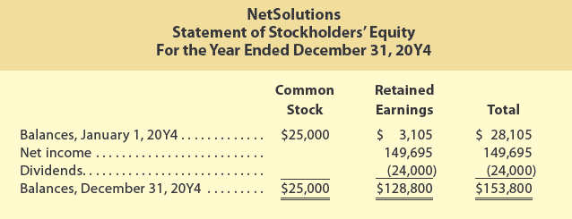</img>

### NetSolutions
### Statement of Stockholders' Equity
### For the Year Ended December 31, 20Y4

[**NetSolutions**
**Estado de Cambios en el Capital Contable**
**Para el Año Terminado el 31 de Diciembre de 20Y4**]

| | Common Stock [Acciones Comunes] | Retained Earnings [Ganancias Retenidas] | Total [Total] |
|--|----------------|----------------|---------------|
| Balances, January 1, 20Y4 [Saldos, 1 de Enero de 20Y4] | $25,000 | $3,105 | $28,105 |
| Net income [Ingreso neto] | | 149,695 | 149,695 |
| Dividends [Dividendos] | | (24,000) | (24,000) |
| **Balances, December 31, 20Y4** [**Saldos, 31 de Diciembre de 20Y4**] | **$25,000** | **$128,800** | **$153,800** |

---

**Link to Zynga:** Zynga does not pay dividends and on recent financial statements reported a net income of $15.5 million and a retained earnings deficit (debit balance) of $1.8 billion.

[**Enlace a Zynga:** Zynga no paga dividendos y en estados financieros recientes reportó un ingreso neto de $15.5 millones y un déficit de ganancias retenidas (saldo deudor) de $1.8 mil millones.]

---

<h1 id="048098" style="color:#E65100;">
  <a href="#Chapter_004" style="color:inherit; text-decoration:none;">
    4-2c Balance Sheet
  </a>
</h1>

The balance sheet is prepared directly from the Adjusted Trial Balance columns of the Exhibit 1 spreadsheet, beginning with cash of $2,065. The asset and liability amounts are taken from the spreadsheet. The common stock and retained earnings amounts are taken from the statement of stockholders' equity, as illustrated in Exhibit 2.

[El balance general se prepara directamente a partir de las columnas del Balance de Comprobación Ajustado de la hoja de cálculo de la Figura 1, comenzando con el efectivo de $2,065. Los montos de activos y pasivos se toman de la hoja de cálculo. Los montos de acciones comunes y ganancias retenidas se toman del estado de cambios en el capital contable, como se ilustra en la Figura 2.]

The balance sheet in Exhibit 2 shows subsections for assets and liabilities. Such a balance sheet is a **classified balance sheet**. These subsections are described next.

[El balance general en la Figura 2 muestra subsecciones para activos y pasivos. Tal balance general es un **balance general clasificado**. Estas subsecciones se describen a continuación.]

---

## Assets

[**Activos**]

Assets are commonly divided into two sections on the balance sheet: (1) current assets and (2) property, plant, and equipment.

[Los activos se dividen comúnmente en dos secciones en el balance general: (1) activos corrientes y (2) propiedades, planta y equipo.]

### Current Assets

[**Activos Corrientes**]

Cash and other assets that are expected to be converted to cash or sold or used up usually within one year or less, through the normal operations of the business, are called **current assets** (Cash and other assets that are expected to be converted to cash or sold or used up, usually within one year or less, through the normal operations of the business.). In addition to cash, the current assets may include notes receivable, accounts receivable, supplies, and other prepaid expenses.

[El efectivo y otros activos que se espera que se conviertan en efectivo o se vendan o consuman generalmente dentro de un año o menos, a través de las operaciones normales del negocio, se llaman **activos corrientes** (efectivo y otros activos que se espera que se conviertan en efectivo o se vendan o consuman, generalmente dentro de un año o menos, a través de las operaciones normales del negocio). Además del efectivo, los activos corrientes pueden incluir notas por cobrar, cuentas por cobrar, suministros y otros gastos pagados por adelantado.]

**Notes receivable** (A customer's written promise to pay an amount and possibly interest at an agreed-upon rate; amounts that customers owe for which a formal, written instrument of credit has been issued.) are amounts that customers owe. They are written promises to pay the amount of the note and interest. Accounts receivable are also amounts customers owe, but they are less formal than notes. Accounts receivable normally result from providing services or selling merchandise on account. Notes receivable and accounts receivable are current assets because they are usually converted to cash within one year or less.

[Las **notas por cobrar** (promesa escrita de un cliente para pagar un monto y posiblemente intereses a una tasa acordada; montos que los clientes deben para los cuales se ha emitido un instrumento formal de crédito por escrito) son montos que los clientes deben. Son promesas escritas de pagar el monto de la nota y los intereses. Las cuentas por cobrar también son montos que los clientes deben, pero son menos formales que las notas. Las cuentas por cobrar normalmente resultan de proporcionar servicios o vender mercancías a crédito. Las notas por cobrar y las cuentas por cobrar son activos corrientes porque generalmente se convierten en efectivo dentro de un año o menos.]

---

### Ethics in Action

#### CEO's Health?

[**Ética en Acción - ¿La Salud del CEO?**]

How much and what information to disclose in financial statements and to investors presents a common ethical dilemma for managers and accountants. For example, Steve Jobs, co-founder and CEO of Apple Inc. (AAPL), had been diagnosed and treated for pancreatic cancer. Apple Inc. had insisted that the status of Steve Jobs's health was a "private" matter and did not have to be disclosed to investors. Apple maintained this position even though Jobs was a driving force behind Apple's innovation and financial success. Steve Jobs's health deteriorated significantly, however, and that disclosure was eventually provided. On October 5, 2011, Steve Jobs died at the age of 56.

[¿Cuánta información y qué información revelar en los estados financieros y a los inversores presenta un dilema ético común para los gerentes y contadores. Por ejemplo, Steve Jobs, cofundador y CEO de Apple Inc. (AAPL), había sido diagnosticado y tratado por cáncer de páncreas. Apple Inc. había insistido en que el estado de salud de Steve Jobs era un asunto "privado" y no tenía que ser divulgado a los inversores. Apple mantuvo esta posición a pesar de que Jobs era una fuerza impulsora detrás de la innovación y el éxito financiero de Apple. Sin embargo, la salud de Steve Jobs se deterioró significativamente, y esa divulgación finalmente se proporcionó. El 5 de octubre de 2011, Steve Jobs falleció a la edad de 56 años.]

---

### Property, Plant, and Equipment

[**Propiedades, Planta y Equipo**]

**Property, plant, and equipment** (Long-term or relatively permanent tangible assets such as equipment, machinery, and buildings that are used in normal business operations.) section may also be described as fixed assets or plant assets. These assets include equipment, machinery, buildings, and land. With the exception of land, as discussed in Chapter 3, fixed assets depreciate over a period of time. The original cost, accumulated depreciation, and book value of each major type of fixed asset are normally reported on the balance sheet or in the notes to the financial statements.

[La sección de **propiedades, planta y equipo** (activos tangibles a largo plazo o relativamente permanentes como equipo, maquinaria y edificios que se utilizan en las operaciones normales del negocio) también puede describirse como activos fijos o activos planta. Estos activos incluyen equipo, maquinaria, edificios y terreno. Con la excepción del terreno, como se discutió en el Capítulo 3, los activos fijos se deprecian a lo largo de un período de tiempo. El costo original, la depreciación acumulada y el valor en libros de cada tipo importante de activo fijo normalmente se reportan en el balance general o en las notas a los estados financieros.]

---

**Link to Zynga:** On a recent balance sheet, Zynga reported current assets of $747 million; property, plant, and equipment and other assets of $1,400 million; and total assets of $2,147 million.

[**Enlace a Zynga:** En un balance general reciente, Zynga reportó activos corrientes de $747 millones; propiedades, planta y equipo y otros activos de $1,400 millones; y activos totales de $2,147 millones.]

---

## Liabilities

[**Pasivos**]

Liabilities are the amounts the business owes to creditors. Liabilities are commonly divided into two sections on the balance sheet: (1) current liabilities and (2) long-term liabilities.

[Los pasivos son los montos que el negocio debe a los acreedores. Los pasivos se dividen comúnmente en dos secciones en el balance general: (1) pasivos corrientes y (2) pasivos a largo plazo.]

### Current Liabilities

[**Pasivos Corrientes**]

Liabilities that will be due within a short time (usually one year or less) and that are to be paid out of current assets are called **current liabilities** (Liabilities that will be due within a short time (usually one year or less) and that are to be paid out of current assets.). The most common liabilities in this group are notes payable and accounts payable. Other current liabilities may include wages payable, interest payable, taxes payable, and unearned fees.

[Los pasivos que vencerán en un corto plazo (generalmente un año o menos) y que se pagarán con activos corrientes se llaman **pasivos corrientes** (pasivos que vencerán en un corto plazo (generalmente un año o menos) y que se pagarán con activos corrientes). Los pasivos más comunes en este grupo son las notas por pagar y las cuentas por pagar. Otros pasivos corrientes pueden incluir sueldos por pagar, intereses por pagar, impuestos por pagar e ingresos no devengados.]

### Long-Term Liabilities

[**Pasivos a Largo Plazo**]

Liabilities that will not be due for a long time (usually more than one year) are called **long-term liabilities** (Liabilities that will not be due for a long time (usually more than one year).). If NetSolutions had long-term liabilities, they would be reported below the current liabilities. As long-term liabilities come due and are to be paid within one year, they are reported as current liabilities. If they are to be renewed rather than paid, they would continue to be reported as long term. When an asset is pledged as security for a liability, the obligation may be called a mortgage note payable or a mortgage payable.

[Los pasivos que no vencerán en un largo plazo (generalmente más de un año) se llaman **pasivos a largo plazo** (pasivos que no vencerán en un largo plazo (generalmente más de un año)). Si NetSolutions tuviera pasivos a largo plazo, se reportarían debajo de los pasivos corrientes. Cuando los pasivos a largo plazo vencen y deben pagarse dentro de un año, se reportan como pasivos corrientes. Si se van a renovar en lugar de pagar, continuarían reportándose como a largo plazo. Cuando un activo se pignora como garantía de un pasivo, la obligación puede llamarse nota por pagar hipotecaria o hipoteca por pagar.]

---

**Link to Zynga:** On a recent balance sheet, Zynga reported current liabilities of $480 million, long-term and other liabilities of $70 million, and total liabilities of $550 million.

[**Enlace a Zynga:** En un balance general reciente, Zynga reportó pasivos corrientes de $480 millones, pasivos a largo plazo y otros pasivos de $70 millones, y pasivos totales de $550 millones.]

---

## Stockholders' Equity

[**Capital Contable**]

The stockholders' right to the assets of the business is presented on the balance sheet below the Liabilities section. The stockholders' equity of NetSolutions consists of common stock and retained earnings. The stockholders' equity is added to the total liabilities, and this total must be equal to the total assets.

[El derecho de los accionistas sobre los activos del negocio se presenta en el balance general debajo de la sección de Pasivos. El capital contable de NetSolutions consiste en acciones comunes y ganancias retenidas. El capital contable se suma al total de pasivos, y este total debe ser igual al total de activos.]

---

**Link to Zynga:** On a recent balance sheet, Zynga reported common stock of $3,505 million, a retained earnings deficit of $1,908 million, and total stockholders' equity of $1,597 million.

[**Enlace a Zynga:** En un balance general reciente, Zynga reportó acciones comunes de $3,505 millones, un déficit de ganancias retenidas de $1,908 millones, y un capital contable total de $1,597 millones.]

---

<h1 id="243026" style="color:#E65100;">
  <a href="#Chapter_004" style="color:inherit; text-decoration:none;">
    4-2d Statement of Cash Flows
  </a>
</h1>


The statement of cash flows that would accompany NetSolutions' financial statements in Exhibit 2 is shown in Appendix 2 of this chapter. While the income statement, statement of stockholders' equity, and balance sheet can be prepared from the Adjusted Trial Balance columns of Exhibit 1, the statement of cash flows is prepared by analyzing the cash account. In doing so, each cash transaction is classified as an operating, investing, or financing activity. In practice, however, the statement of cash flows is normally prepared using a different, more complex method called the indirect method. The indirect method is described and illustrated in Chapter 13, "Statement of Cash Flows." For this reason, any further discussion of the statement of cash flows is delayed until Chapter 13.

[El estado de flujos de efectivo que acompañaría a los estados financieros de NetSolutions en la Figura 2 se muestra en el Apéndice 2 de este capítulo. Mientras que el estado de resultados, el estado de cambios en el capital contable y el balance general se pueden preparar a partir de las columnas del Balance de Comprobación Ajustado de la Figura 1, el estado de flujos de efectivo se prepara analizando la cuenta de efectivo. Al hacerlo, cada transacción de efectivo se clasifica como una actividad de operación, inversión o financiamiento. En la práctica, sin embargo, el estado de flujos de efectivo normalmente se prepara utilizando un método diferente y más complejo llamado método indirecto. El método indirecto se describe e ilustra en el Capítulo 13, "Estado de Flujos de Efectivo". Por esta razón, cualquier discusión adicional sobre el estado de flujos de efectivo se pospone hasta el Capítulo 13.]

---

## Check Up Corner 4-1

### Financial Statements from Adjusted Trial Balance

[**Esquina de Verificación 4-1 - Estados Financieros a partir del Balance de Comprobación Ajustado**]

The following account balances were taken from the adjusted trial balance for Laser Corrective Vision Company, a health care company, for the fiscal year ended December 31, 20Y2:

[Los siguientes saldos de cuentas se tomaron del balance de comprobación ajustado para Laser Corrective Vision Company, una empresa de atención médica, para el año fiscal terminado el 31 de diciembre de 20Y2:]

| Account [Cuenta] | Balance [Saldo] |
|------------------|-----------------|
| Common Stock [Acciones Comunes] | $175,000 |
| Miscellaneous Expense [Gastos Misceláneos] | $8,500 |
| Depreciation Expense [Gasto de Depreciación] | $25,000 |
| Rent Expense [Gasto de Renta] | $20,000 |
| Dividends [Dividendos] | $6,000 |
| Salaries Expense [Gasto de Sueldos] | $165,000 |
| Fees Earned [Ingresos por Servicios] | $312,000 |
| Supplies Expense [Gasto de Suministros] | $15,500 |
| Insurance Expense [Gasto de Seguro] | $6,000 |
| Utilities Expense [Gasto de Servicios Públicos] | $12,000 |

On January 1, 20Y2, Retained Earnings had a balance of $100,000. During 20Y2, common stock of $50,000 was issued.

[El 1 de enero de 20Y2, las Ganancias Retenidas tenían un saldo de $100,000. Durante 20Y2, se emitieron acciones comunes por $50,000.]

**Prepare an income statement and statement of stockholders' equity for Laser Corrective Vision.**

[**Prepare un estado de resultados y un estado de cambios en el capital contable para Laser Corrective Vision.**]

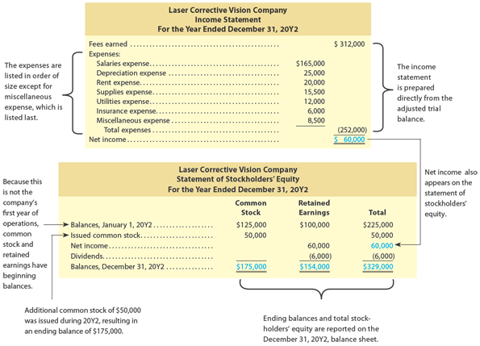</img>

---

<table><thead>
  <tr>
    <th colspan="5">Laser Corrective Vision Company</th>
  </tr></thead>
<tbody>
  <tr>
    <td colspan="5">Income Statement</td>
  </tr>
  <tr>
    <td colspan="5">For the Year Ended December 31, 20Y2</td>
  </tr>
  <tr>
    <td colspan="5"></td>
  </tr>
  <tr>
    <td colspan="3">Revenues: [Ingresos:]</td>
    <td></td>
    <td></td>
  </tr>
  <tr>
    <td></td>
    <td colspan="2">Fees earned [Ingresos por Servicios]</td>
    <td></td>
    <td>$312,000</td>
  </tr>
  <tr>
    <td colspan="3">Expenses: [Gastos:]</td>
    <td></td>
    <td></td>
  </tr>
  <tr>
    <td></td>
    <td colspan="2">Salaries expense [Gasto de Sueldos]</td>
    <td>$165,000</td>
    <td></td>
  </tr>
  <tr>
    <td></td>
    <td colspan="2">Depreciation expense [Gasto de Depreciación]</td>
    <td>25,000</td>
    <td></td>
  </tr>
  <tr>
    <td></td>
    <td colspan="2">Rent expense [Gasto de Renta]</td>
    <td>20,000</td>
    <td></td>
  </tr>
  <tr>
    <td></td>
    <td colspan="2">Supplies expense [Gasto de Suministros]</td>
    <td>15,500</td>
    <td></td>
  </tr>
  <tr>
    <td></td>
    <td colspan="2">Utilities expense [Gasto de Servicios Públicos]</td>
    <td>12,000</td>
    <td></td>
  </tr>
  <tr>
    <td></td>
    <td colspan="2">Insurance expense [Gasto de Seguro]</td>
    <td>6,000</td>
    <td></td>
  </tr>
  <tr>
    <td></td>
    <td colspan="2">Miscellaneous expense [Gastos Misceláneos]</td>
    <td>8,500</td>
    <td></td>
  </tr>
  <tr>
    <td></td>
    <td></td>
    <td>Total expenses [Total de gastos]</td>
    <td></td>
    <td>($252,000)</td>
  </tr>
  <tr>
    <td colspan="3">Net income [Ingreso neto]</td>
    <td></td>
    <td>$60,000</td>
  </tr>
</tbody></table>

---

#### Laser Corrective Vision Company
#### Statement of Stockholders' Equity
#### For the Year Ended December 31, 20Y2

[**Laser Corrective Vision Company**
**Estado de Cambios en el Capital Contable**
**Para el Año Terminado el 31 de Diciembre de 20Y2**]

| | Common Stock [Acciones Comunes] | Retained Earnings [Ganancias Retenidas] | Total [Total] |
|--|----------------|----------------|---------------|
| Balances, January 1, 20Y2 [Saldos, 1 de Enero de 20Y2] | $125,000 | $100,000 | $225,000 |
| Issued common stock [Emisión de acciones comunes] | 50,000 | | 50,000 |
| Net income [Ingreso neto] | | 60,000 | 60,000 |
| Dividends [Dividendos] | | (6,000) | (6,000) |
| **Balances, December 31, 20Y2** [**Saldos, 31 de Diciembre de 20Y2**] | **$175,000** | **$154,000** | **$329,000** |

---

<h1 id="880976" style="color:#E65100;">
  <a href="#Chapter_004" style="color:inherit; text-decoration:none;">
    4-3 Closing Entries
  </a>
</h1>


As discussed in Chapter 3, the adjusting entries are recorded in the journal at the end of the accounting period. For NetSolutions, the adjusting entries are shown in Exhibit 7 of Chapter 3. After the adjusting entries are posted to NetSolutions' ledger, shown later in this chapter, the ledger agrees with the data reported on the financial statements shown in Exhibit 2.

[Como se discutió en el Capítulo 3, los asientos de ajuste se registran en el diario al final del período contable. Para NetSolutions, los asientos de ajuste se muestran en la Figura 7 del Capítulo 3. Después de que los asientos de ajuste se traspasan al libro mayor de NetSolutions, que se muestra más adelante en este capítulo, el libro mayor concuerda con los datos reportados en los estados financieros mostrados en la Figura 2.]

The balances of the accounts reported on the balance sheet are carried forward from year to year. Because they are relatively permanent, these accounts are called **permanent accounts** (Term for balance sheet accounts because they are relatively permanent with balances that carry forward from year to year.) or **real accounts** (Term for balance sheet accounts because they are relatively permanent with balances that carry forward from year to year.). For example, Cash, Accounts Receivable, Equipment, Accumulated Depreciation, Accounts Payable, Common Stock, and Retained Earnings are permanent accounts.

[Los saldos de las cuentas reportadas en el balance general se trasladan de un año a otro. Debido a que son relativamente permanentes, estas cuentas se llaman **cuentas permanentes** (término para las cuentas del balance general porque son relativamente permanentes con saldos que se trasladan de un año a otro) o **cuentas reales** (término para las cuentas del balance general porque son relativamente permanentes con saldos que se trasladan de un año a otro). Por ejemplo, Efectivo, Cuentas por Cobrar, Equipo, Depreciación Acumulada, Cuentas por Pagar, Acciones Comunes y Ganancias Retenidas son cuentas permanentes.]

The balances of the accounts reported on the income statement are not carried forward from year to year. Also, the balance of the dividends account, which is reported on the statement of stockholders' equity, is not carried forward. Because these accounts report amounts for only one period, they are called **temporary accounts** (Term for income statement accounts because their balances relate to only one period and are not carried forward to the next period.) or **nominal accounts** (Term for income statement accounts because their balances relate to only one period and are not carried forward to the next period.). Temporary accounts are not carried forward because they relate only to one period. For example, the Fees Earned of $16,840 and Wages Expense of $4,525 for NetSolutions shown in Exhibit 2 are for the two months ending December 31, 20Y3, and should not be carried forward to 20Y4.

[Los saldos de las cuentas reportadas en el estado de resultados no se trasladan de un año a otro. Además, el saldo de la cuenta de dividendos, que se reporta en el estado de cambios en el capital contable, no se traslada. Debido a que estas cuentas reportan montos para un solo período, se llaman **cuentas temporales** (término para las cuentas del estado de resultados porque sus saldos se relacionan con un solo período y no se trasladan al siguiente período) o **cuentas nominales** (término para las cuentas del estado de resultados porque sus saldos se relacionan con un solo período y no se trasladan al siguiente período). Las cuentas temporales no se trasladan porque se relacionan solo con un período. Por ejemplo, los Ingresos por Servicios de $16,840 y el Gasto de Sueldos de $4,525 para NetSolutions que se muestran en la Figura 2 son para los dos meses que terminan el 31 de diciembre de 20Y3 y no deben trasladarse a 20Y4.]

At the beginning of the next period, temporary accounts should have zero balances. To achieve this, temporary account balances are transferred to permanent accounts at the end of the accounting period. The journal entries that transfer these balances are called **closing entries** (The journal entries that transfer the balances of temporary accounts to permanent accounts at the end of the accounting period.). The transfer process is called the **closing process** (The process of transferring the balances of temporary accounts to permanent accounts at the end of the accounting period.) and is sometimes referred to as **closing the books** (The process of transferring the balances of temporary accounts to permanent accounts at the end of the accounting period.).

[Al comienzo del siguiente período, las cuentas temporales deben tener saldos cero. Para lograr esto, los saldos de las cuentas temporales se transfieren a cuentas permanentes al final del período contable. Los asientos de diario que transfieren estos saldos se llaman **asientos de cierre** (los asientos de diario que transfieren los saldos de las cuentas temporales a cuentas permanentes al final del período contable). El proceso de transferencia se llama **proceso de cierre** (el proceso de transferir los saldos de las cuentas temporales a cuentas permanentes al final del período contable) y a veces se conoce como **cerrar los libros** (el proceso de transferir los saldos de las cuentas temporales a cuentas permanentes al final del período contable).]

## Notes

The closing process involves the following two steps:

[El proceso de cierre implica los siguientes dos pasos:]

**Step 1:** Revenue and expense account balances are transferred to the retained earnings account.

[**Paso 1:** Los saldos de las cuentas de ingresos y gastos se transfieren a la cuenta de ganancias retenidas.]

**Step 2:** The balance of the dividends account is transferred to the retained earnings account.

[**Paso 2:** El saldo de la cuenta de dividendos se transfiere a la cuenta de ganancias retenidas.]

---

## International Connection

### IFRS International Differences

[**Conexión Internacional - Diferencias Internacionales de IFRS**]

Financial statements prepared under accounting practices in other countries often differ from those prepared under generally accepted accounting principles in the United States. This is to be expected because cultures and market structures differ from country to country.

[Los estados financieros preparados bajo prácticas contables en otros países a menudo difieren de aquellos preparados bajo los principios de contabilidad generalmente aceptados en los Estados Unidos. Esto es de esperar porque las culturas y las estructuras de mercado difieren de un país a otro.]

To illustrate, BMW Group prepares its financial statements under International Financial Reporting Standards as adopted by the European Union. In doing so, BMW's balance sheet reports fixed assets first, followed by current assets. It also reports stockholders' equity before the liabilities. In contrast, balance sheets prepared under U.S. accounting principles report current assets followed by fixed assets and current liabilities followed by long-term liabilities and stockholders' equity. The U.S. form of balance sheet is organized to emphasize creditor interpretation and analysis. For example, current assets and current liabilities are presented first to facilitate their interpretation and analysis by creditors. Likewise, to emphasize their importance, liabilities are reported before stockholders' equity.

[Para ilustrar, BMW Group prepara sus estados financieros bajo las Normas Internacionales de Información Financiera (IFRS) adoptadas por la Unión Europea. Al hacerlo, el balance general de BMW reporta los activos fijos primero, seguidos de los activos corrientes. También reporta el capital contable antes que los pasivos. En contraste, los balances generales preparados bajo los principios contables de EE. UU. reportan los activos corrientes seguidos de los activos fijos y los pasivos corrientes seguidos de los pasivos a largo plazo y el capital contable. La forma de balance general de EE. UU. está organizada para enfatizar la interpretación y el análisis de los acreedores. Por ejemplo, los activos corrientes y los pasivos corrientes se presentan primero para facilitar su interpretación y análisis por parte de los acreedores. Del mismo modo, para enfatizar su importancia, los pasivos se reportan antes que el capital contable.]

Regardless of these differences, the basic principles underlying the accounting equation and the double-entry accounting system are the same in Germany and the United States. Even though differences in recording and reporting exist, the accounting equation holds true: The total assets still equal the total liabilities and stockholders' equity.

[Independientemente de estas diferencias, los principios básicos que subyacen a la ecuación contable y al sistema de contabilidad de partida doble son los mismos en Alemania y los Estados Unidos. Aunque existen diferencias en el registro y la presentación de informes, la ecuación contable se cumple: los activos totales siguen siendo iguales a los pasivos totales y al capital contable.]

The two closing journal entries required by the closing process are as follows:

[Los dos asientos de diario de cierre requeridos por el proceso de cierre son los siguientes:]

**Closing Entry (1):** Debit each revenue account for its balance, credit each expense account for its balance, and credit (net income) or debit (net loss) the retained earnings account.

[**Asiento de Cierre (1):** Debitar cada cuenta de ingreso por su saldo, acreditar cada cuenta de gasto por su saldo, y acreditar (ingreso neto) o debitar (pérdida neta) la cuenta de ganancias retenidas.]

**Closing Entry (2):** Debit the retained earnings account for the balance of the dividends account and credit the dividends account for its balance.

[**Asiento de Cierre (2):** Debitar la cuenta de ganancias retenidas por el saldo de la cuenta de dividendos y acreditar la cuenta de dividendos por su saldo.]

Exhibit 3 diagrams the closing process.

[La Figura 3 diagrama el proceso de cierre.]

---

## Exhibit 3

### The Closing Process

[**Figura 3** - El Proceso de Cierre]

<!-- 📍 IMAGEN: Exhibit 3 - The Closing Process (coordenadas [206, 0, 770, 354]) -->

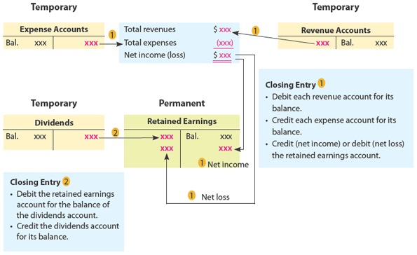

Closing entries are recorded in the journal and are dated as of the last day of the accounting period. In the journal, closing entries are recorded immediately following the adjusting entries. The caption, **Closing Entries**, is often inserted above the closing entries to separate them from the adjusting entries.

[Los asientos de cierre se registran en el diario y se fechan como el último día del período contable. En el diario, los asientos de cierre se registran inmediatamente después de los asientos de ajuste. La leyenda **Asientos de Cierre** a menudo se inserta encima de los asientos de cierre para separarlos de los asientos de ajuste.]

---


## Ejercicio de ejemplo


---

## 1. Balance del período anterior (Beginning Balance)

Este es el balance al final del período pasado.

| **Balance Sheet (Previous Period)** | Amount     |
| ----------------------------------- | ---------- |
| **Assets**                          |            |
| Cash                                | 12,000     |
| Accounts Receivable                 | 3,000      |
| Equipment                           | 5,000      |
| **Total Assets**                    | **20,000** |
| **Liabilities**                     |            |
| Accounts Payable                    | 6,000      |
| **Stockholders’ Equity**            |            |
| Common Stock                        | 10,000     |
| Retained Earnings                   | 4,000      |
| **Total Liabilities + Equity**      | **20,000** |

Ecuación:

```text
20,000 = 6,000 + 14,000
```

---

## 2. Transacciones del período actual

Durante el año ocurren estas operaciones:

### A) Se prestan servicios y entra efectivo

```text
Dr Cash                 9,000
    Cr Service Revenue     9,000
```

Balance parcial:

Cash = 21,000

---

### B) Se paga renta

```text
Dr Rent Expense        2,500
    Cr Cash               2,500
```

Balance parcial:

Cash = 18,500

---

### C) Se pagan salarios

```text
Dr Salary Expense      3,500
    Cr Cash               3,500
```

Balance parcial:

Cash = 15,000

---

### D) Se pagan dividendos

```text
Dr Dividends          1,000
    Cr Cash              1,000
```

Balance parcial:

Cash = 14,000

---

## 3. Trial Balance antes del cierre

Aquí todavía existen cuentas temporales.

| Account             | Debit  | Credit |
| ------------------- | ------ | ------ |
| Cash                | 14,000 |        |
| Accounts Receivable | 3,000  |        |
| Equipment           | 5,000  |        |
| Accounts Payable    |        | 6,000  |
| Common Stock        |        | 10,000 |
| Retained Earnings   |        | 4,000  |
| Service Revenue     |        | 9,000  |
| Rent Expense        | 2,500  |        |
| Salary Expense      | 3,500  |        |
| Dividends           | 1,000  |        |

Totales:

```text
Debits = 29,000
Credits = 29,000
```

---

## 4. Income Statement

Calculamos el resultado del período.

```text
Service Revenue                9,000

Expenses:
 Rent Expense               (2,500)
 Salary Expense            (3,500)

-----------------------------------
Net Income                  3,000
```

---

## 5. Closing Entries

Se usan para cerrar cuentas temporales.

---

### Paso 1 — Cerrar Revenue hacia Income Summary

```text
Dr Service Revenue          9,000
    Cr Income Summary          9,000
```

Income Summary:

| Debit | Credit |
| ----- | ------ |
|       | 9,000  |

---

### Paso 2 — Cerrar Expenses hacia Income Summary

```text
Dr Income Summary          6,000
    Cr Rent Expense            2,500
    Cr Salary Expense         3,500
```

Income Summary queda:

| Debit | Credit |
| ----- | ------ |
| 6,000 | 9,000  |

Saldo crédito = 3,000 profit

---

### Paso 3 — Transferir utilidad a Retained Earnings

```text
Dr Income Summary         3,000
    Cr Retained Earnings     3,000
```

Income Summary queda en 0.

---

### Paso 4 — Cerrar Dividends

```text
Dr Retained Earnings      1,000
    Cr Dividends             1,000
```

---

## 6. Actualización de Retained Earnings

Saldo anterior:

```text
Retained Earnings = 4,000
```

Agregar utilidad:

```text
+ Net Income = 3,000
```

Restar dividendos:

```text
- Dividends = 1,000
```

Resultado final:

```text
Retained Earnings = 6,000
```

---

## 7. Balance Sheet después del cierre (Correcto)

Las cuentas temporales desaparecen:

* Revenue = 0
* Expenses = 0
* Dividends = 0
* Income Summary = 0

Quedan solo cuentas permanentes.

| **Balance Sheet (After Closing)** | Amount     |
| --------------------------------- | ---------- |
| **Assets**                        |            |
| Cash                              | 14,000     |
| Accounts Receivable               | 3,000      |
| Equipment                         | 5,000      |
| **Total Assets**                  | **22,000** |
| **Liabilities**                   |            |
| Accounts Payable                  | 6,000      |
| **Stockholders’ Equity**          |            |
| Common Stock                      | 10,000     |
| Retained Earnings                 | 6,000      |
| **Total Liabilities + Equity**    | **22,000** |

Verificación:

```text
Assets = 22,000

Liabilities = 6,000
Common Stock = 10,000
Retained Earnings = 6,000

Total = 22,000
```

Correcto.

---

## 8. Flujo completo de información

```text
Previous Balance Sheet
        ↓
Transactions
        ↓
Journal Entries
        ↓
Trial Balance
        ↓
Income Statement
        ↓
Closing Entries
        ↓
Income Summary
        ↓
Retained Earnings Updated
        ↓
After Closing Balance Sheet
```

---

### Qué debes recordar para examen

**Cuentas temporales**

* Service Revenue
* Expenses
* Dividends
* Income Summary

**Cuentas permanentes**

* Cash
* Accounts Receivable
* Equipment
* Accounts Payable
* Common Stock
* Retained Earnings

**Closing Entries solo mueven información dentro de Equity; no generan dinero nuevo.**

---

<h1 id="378102" style="color:#E65100;">
  <a href="#Chapter_004" style="color:inherit; text-decoration:none;">
    4-3a Journalizing and Posting Closing Entries
  </a>
</h1>


A flowchart of the two closing entries for NetSolutions is shown in Exhibit 4. The balances in the accounts are those shown in the Adjusted Trial Balance columns of the end-of-period spreadsheet shown in Exhibit 1.

[Un diagrama de flujo de los dos asientos de cierre para NetSolutions se muestra en la Figura 4. Los saldos en las cuentas son los que se muestran en las columnas del Balance de Comprobación Ajustado de la hoja de cálculo de fin de período que se muestra en la Figura 1.]

## Exhibit 4

### Flowchart of Closing Entries for NetSolutions

[**Figura 4** - Diagrama de Flujo de los Asientos de Cierre para NetSolutions]

<!-- 📍 IMAGEN: Exhibit 4 - Flowchart of Closing Entries (coordenadas [206, 0, 770, 354]) -->

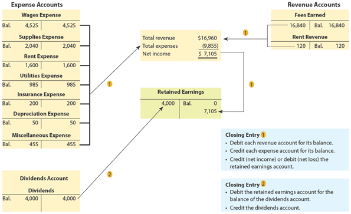


The closing entries for NetSolutions are shown in Exhibit 5. The account titles and balances for these entries may be obtained from the end-of-period spreadsheet, the adjusted trial balance, the income statement, the statement of stockholders' equity, or the ledger.

[Los asientos de cierre para NetSolutions se muestran en la Figura 5. Los títulos de las cuentas y los saldos para estos asientos pueden obtenerse de la hoja de cálculo de fin de período, el balance de comprobación ajustado, el estado de resultados, el estado de cambios en el capital contable o el libro mayor.]

## Exhibit 5

### Closing Entries, NetSolutions

[**Figura 5** - Asientos de Cierre, NetSolutions]

<!-- 📍 IMAGEN: Exhibit 5 - Closing Entries (página 2) -->


| Date | Account | Post. Ref. | Debit | Credit |
|------|---------|------------|-------|--------|
| Dec. 31 | Fees Earned | 41 | 16,840 | |
| | Rent Revenue | 42 | 120 | |
| | Wages Expense | 51 | | 4,525 |
| | Supplies Expense | 52 | | 2,040 |
| | Rent Expense | 53 | | 1,600 |
| | Utilities Expense | 54 | | 985 |
| | Insurance Expense | 55 | | 200 |
| | Depreciation Expense | 56 | | 50 |
| | Miscellaneous Expense | 59 | | 455 |
| | Retained Earnings | 32 | | 7,105 |
| | *Closing entry (1)* | | | |
| Dec. 31 | Retained Earnings | 32 | 4,000 | |
| | Dividends | 33 | | 4,000 |
| | *Closing entry (2)* | | | |


- The revenue, expense, and dividends accounts will have zero balances.

[- Las cuentas de ingresos, gastos y dividendos tendrán saldos cero.]

---

## Exhibit 6

### Ledger with Closing Entries—NetSolutions

[**Figura 6** - Libro Mayor con Asientos de Cierre—NetSolutions]

<!-- 📍 IMAGEN: Exhibit 6 - Ledger with Closing Entries (páginas 3-9) -->


#### Account Cash - Account No. 11

| Date | Item | Post. Ref. | Debit | Credit | Balance Debit | Balance Credit |
|------|------|------------|-------|--------|---------------|----------------|
| 20Y3 Nov. 1 | | 1 | 25,000 | | 25,000 | |
| Nov. 5 | | 1 | | 20,000 | 5,000 | |
| Nov. 18 | | 1 | 7,500 | | 12,500 | |
| Nov. 30 | | 1 | | 3,650 | 8,850 | |
| Nov. 30 | | 1 | | 950 | 7,900 | |
| Nov. 30 | | 1 | | 2,000 | 5,900 | |
| Dec. 1 | | 2 | | 2,400 | 3,500 | |
| Dec. 1 | | 2 | | 800 | 2,700 | |
| Dec. 1 | | 2 | 360 | | 3,060 | |
| Dec. 6 | | 2 | | 180 | 2,880 | |
| Dec. 11 | | 2 | | 400 | 2,480 | |
| Dec. 13 | | 2 | | 950 | 1,530 | |
| Dec. 16 | | 3 | 3,100 | | 4,630 | |
| Dec. 20 | | 3 | | 900 | 3,730 | |
| Dec. 21 | | 3 | 650 | | 4,380 | |
| Dec. 23 | | 3 | | 1,450 | 2,930 | |
| Dec. 27 | | 3 | | 1,200 | 1,730 | |
| Dec. 31 | | 3 | | 310 | 1,420 | |
| Dec. 31 | | 4 | | 225 | 1,195 | |
| Dec. 31 | | 4 | 2,870 | | 4,065 | |
| Dec. 31 | | 4 | | 2,000 | 2,065 | |

#### Account Accounts Receivable - Account No. 12

| Date | Item | Post. Ref. | Debit | Credit | Balance Debit | Balance Credit |
|------|------|------------|-------|--------|---------------|----------------|
| 20Y3 Dec. 16 | | 3 | 1,750 | | 1,750 | |
| Dec. 21 | | 3 | | 650 | 1,100 | |
| Dec. 31 | | 4 | 1,120 | | 2,220 | |
| Dec. 31 | Adjusting | 5 | 500 | | 2,720 | |

#### Account Supplies - Account No. 14

| Date | Item | Post. Ref. | Debit | Credit | Balance Debit | Balance Credit |
|------|------|------------|-------|--------|---------------|----------------|
| 20Y3 Nov. 10 | | 1 | 1,350 | | 1,350 | |
| Nov. 30 | | 1 | | 800 | 550 | |
| Dec. 23 | | 3 | 1,450 | | 2,000 | |
| Dec. 31 | Adjusting | 5 | | 1,240 | 760 | |

#### Account Prepaid Insurance - Account No. 15

| Date | Item | Post. Ref. | Debit | Credit | Balance Debit | Balance Credit |
|------|------|------------|-------|--------|---------------|----------------|
| 20Y3 Dec. 1 | | 2 | 2,400 | | 2,400 | |
| Dec. 31 | Adjusting | 5 | | 200 | 2,200 | |

#### Account Land - Account No. 17

| Date | Item | Post. Ref. | Debit | Credit | Balance Debit | Balance Credit |
|------|------|------------|-------|--------|---------------|----------------|
| 20Y3 Nov. 5 | | 1 | 20,000 | | 20,000 | |

#### Account Office Equipment - Account No. 18

| Date | Item | Post. Ref. | Debit | Credit | Balance Debit | Balance Credit |
|------|------|------------|-------|--------|---------------|----------------|
| 20Y3 Dec. 4 | | 2 | 1,800 | | 1,800 | |

#### Account Accumulated Depreciation—Office Equipment - Account No. 19

| Date | Item | Post. Ref. | Debit | Credit | Balance Debit | Balance Credit |
|------|------|------------|-------|--------|---------------|----------------|
| 20Y3 Dec. 31 | Adjusting | 5 | | 50 | | 50 |

#### Account Accounts Payable - Account No. 21

| Date | Item | Post. Ref. | Debit | Credit | Balance Debit | Balance Credit |
|------|------|------------|-------|--------|---------------|----------------|
| 20Y3 Nov. 10 | | 1 | | 1,350 | | 1,350 |
| Nov. 30 | | 1 | 950 | | | 400 |
| Dec. 4 | | 2 | | 1,800 | | 2,200 |
| Dec. 11 | | 2 | 400 | | | 1,800 |
| Dec. 20 | | 3 | 900 | | | 900 |

#### Account Wages Payable - Account No. 22

| Date | Item | Post. Ref. | Debit | Credit | Balance Debit | Balance Credit |
|------|------|------------|-------|--------|---------------|----------------|
| 20Y3 Dec. 31 | Adjusting | 5 | | 250 | | 250 |

#### Account Unearned Rent - Account No. 23

| Date | Item | Post. Ref. | Debit | Credit | Balance Debit | Balance Credit |
|------|------|------------|-------|--------|---------------|----------------|
| 20Y3 Dec. 1 | | 2 | | 360 | | 360 |
| Dec. 31 | Adjusting | 5 | 120 | | | 240 |

#### Account Common Stock - Account No. 31

| Date | Item | Post. Ref. | Debit | Credit | Balance Debit | Balance Credit |
|------|------|------------|-------|--------|---------------|----------------|
| 20Y3 Nov. 1 | | 1 | | 25,000 | | 25,000 |

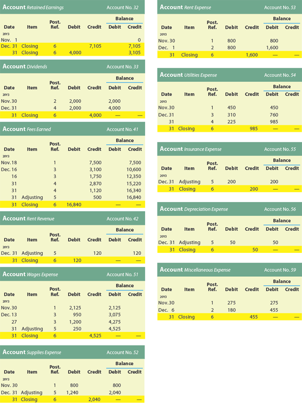</img>

#### Account Retained Earnings - Account No. 32

| Date | Item | Post. Ref. | Debit | Credit | Balance Debit | Balance Credit |
|------|------|------------|-------|--------|---------------|----------------|
| 20Y3 Nov. 1 | | | | | | 0 |
| Dec. 31 | Closing | 6 | | 7,105 | | 7,105 |
| Dec. 31 | Closing | 6 | 4,000 | | | 3,105 |

#### Account Dividends - Account No. 33

| Date | Item | Post. Ref. | Debit | Credit | Balance Debit | Balance Credit |
|------|------|------------|-------|--------|---------------|----------------|
| 20Y3 Nov. 30 | | 1 | 2,000 | | 2,000 | |
| Dec. 31 | | 4 | 2,000 | | 4,000 | |
| Dec. 31 | Closing | 6 | | 4,000 | | — |

#### Account Fees Earned - Account No. 41

| Date | Item | Post. Ref. | Debit | Credit | Balance Debit | Balance Credit |
|------|------|------------|-------|--------|---------------|----------------|
| 20Y3 Nov. 18 | | 1 | | 7,500 | | 7,500 |
| Dec. 16 | | 3 | | 3,100 | | 10,600 |
| Dec. 16 | | 3 | | 1,750 | | 12,350 |
| Dec. 31 | | 4 | | 2,870 | | 15,220 |
| Dec. 31 | | 4 | | 1,120 | | 16,340 |
| Dec. 31 | Adjusting | 5 | | 500 | | 16,840 |
| Dec. 31 | Closing | 6 | 16,840 | | | — |

#### Account Rent Revenue - Account No. 42

| Date | Item | Post. Ref. | Debit | Credit | Balance Debit | Balance Credit |
|------|------|------------|-------|--------|---------------|----------------|
| 20Y3 Dec. 31 | Adjusting | 5 | | 120 | | 120 |
| Dec. 31 | Closing | 6 | 120 | | | — |

#### Account Wages Expense - Account No. 51

| Date | Item | Post. Ref. | Debit | Credit | Balance Debit | Balance Credit |
|------|------|------------|-------|--------|---------------|----------------|
| 20Y3 Nov. 30 | | 1 | 2,125 | | 2,125 | |
| Dec. 13 | | 3 | 950 | | 3,075 | |
| Dec. 27 | | 3 | 1,200 | | 4,275 | |
| Dec. 31 | Adjusting | 5 | 250 | | 4,525 | |
| Dec. 31 | Closing | 6 | | 4,525 | — | |

#### Account Supplies Expense - Account No. 52

| Date | Item | Post. Ref. | Debit | Credit | Balance Debit | Balance Credit |
|------|------|------------|-------|--------|---------------|----------------|
| 20Y3 Nov. 30 | | 1 | 800 | | 800 | |
| Dec. 31 | Adjusting | 5 | 1,240 | | 2,040 | |
| Dec. 31 | Closing | 6 | | 2,040 | — | |

#### Account Rent Expense - Account No. 53

| Date | Item | Post. Ref. | Debit | Credit | Balance Debit | Balance Credit |
|------|------|------------|-------|--------|---------------|----------------|
| 20Y3 Nov. 30 | | 1 | 800 | | 800 | |
| Dec. 1 | | 2 | 800 | | 1,600 | |
| Dec. 31 | Closing | 6 | | 1,600 | — | |

#### Account Utilities Expense - Account No. 54

| Date | Item | Post. Ref. | Debit | Credit | Balance Debit | Balance Credit |
|------|------|------------|-------|--------|---------------|----------------|
| 20Y3 Nov. 30 | | 1 | 450 | | 450 | |
| Dec. 31 | | 3 | 310 | | 760 | |
| Dec. 31 | | 4 | 225 | | 985 | |
| Dec. 31 | Closing | 6 | | 985 | — | |

#### Account Insurance Expense - Account No. 55

| Date | Item | Post. Ref. | Debit | Credit | Balance Debit | Balance Credit |
|------|------|------------|-------|--------|---------------|----------------|
| 20Y3 Dec. 31 | Adjusting | 5 | 200 | | 200 | |
| Dec. 31 | Closing | 6 | | 200 | — | |

#### Account Depreciation Expense - Account No. 56

| Date | Item | Post. Ref. | Debit | Credit | Balance Debit | Balance Credit |
|------|------|------------|-------|--------|---------------|----------------|
| 20Y3 Dec. 31 | Adjusting | 5 | 50 | | 50 | |
| Dec. 31 | Closing | 6 | | 50 | — | |

#### Account Miscellaneous Expense - Account No. 59

| Date | Item | Post. Ref. | Debit | Credit | Balance Debit | Balance Credit |
|------|------|------------|-------|--------|---------------|----------------|
| 20Y3 Nov. 30 | | 1 | 275 | | 275 | |
| Dec. 6 | | 2 | 180 | | 455 | |
| Dec. 31 | Closing | 6 | | 455 | — | |


As shown in Exhibit 6, the closing entries are normally identified in the ledger as "Closing." In addition, a line is often inserted in both balance columns after a closing entry is posted. This separates next period's revenue, expense, and dividend transactions from those of the current period. Next period's transactions will be posted directly below the closing entry.

[Como se muestra en la Figura 6, los asientos de cierre normalmente se identifican en el libro mayor como "Cierre". Además, a menudo se inserta una línea en ambas columnas de saldo después de que se traspasa un asiento de cierre. Esto separa las transacciones de ingresos, gastos y dividendos del próximo período de las del período actual. Las transacciones del próximo período se traspasarán directamente debajo del asiento de cierre.]

---

## Business Insight

### Temporary Accounts on Your Pay Stub

[**Perspectiva de Negocio - Cuentas Temporales en su Talón de Pago**]

At the end of every pay period, employees receive a paycheck (or direct deposit) and a pay stub. The pay stub might look something like this:

[Al final de cada período de pago, los empleados reciben un cheque (o depósito directo) y un talón de pago. El talón de pago podría verse algo como esto:]

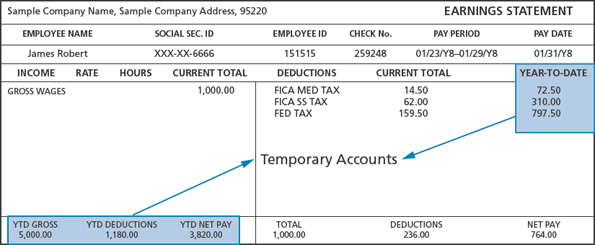</img>

<table style="undefined;table-layout: fixed; width: 1078px"><colgroup>
<col style="width: 162px">
<col style="width: 119px">
<col style="width: 117px">
<col style="width: 106px">
<col style="width: 139px">
<col style="width: 127px">
<col style="width: 171px">
<col style="width: 137px">
</colgroup>
<thead>
  <tr>
    <th colspan="6">Sample Company Name, Sample Company Address, 95220</th>
    <th colspan="2">EARNINGS STATEMENT</th>
  </tr></thead>
<tbody>
  <tr>
    <td colspan="2">EMPLOYEE NAME</td>
    <td colspan="2">SOCIAL SEC. ID</td>
    <td>EMPLOYEE ID</td>
    <td>CHECK No.</td>
    <td>PAY PERIOD</td>
    <td>PAY DATE</td>
  </tr>
  <tr>
    <td colspan="2">James Robert</td>
    <td colspan="2">XXX-XX-6666</td>
    <td>151515</td>
    <td>259248</td>
    <td>01/23/18-01/29/18</td>
    <td>01/31/18</td>
  </tr>
  <tr>
    <td>INCOME</td>
    <td>RATE</td>
    <td>HOURS</td>
    <td>CURRENT TOTAL</td>
    <td>DEDUCTIONS</td>
    <td colspan="2">CURRENT TOTAL</td>
    <td>YEAR-TO-DATE</td>
  </tr>
  <tr>
    <td>GROSS WAGES</td>
    <td></td>
    <td></td>
    <td>1,000.00</td>
    <td>FICA MED TAX</td>
    <td colspan="2">14.50</td>
    <td>72.50</td>
  </tr>
  <tr>
    <td></td>
    <td></td>
    <td></td>
    <td></td>
    <td>FICA SS TAX</td>
    <td colspan="2">62.00</td>
    <td>310.00</td>
  </tr>
  <tr>
    <td></td>
    <td></td>
    <td></td>
    <td></td>
    <td>FED TAX</td>
    <td colspan="2">159.50</td>
    <td>797.50</td>
  </tr>
  <tr>
    <td></td>
    <td></td>
    <td></td>
    <td></td>
    <td></td>
    <td colspan="2"></td>
    <td></td>
  </tr>
  <tr>
    <td>YTD GROSS</td>
    <td colspan="2">YTD DEDUCTIONS</td>
    <td>YTD NET PAY</td>
    <td>TOTAL</td>
    <td colspan="2">DEDUCTIONS</td>
    <td>NET PAY</td>
  </tr>
  <tr>
    <td>5,000.00</td>
    <td colspan="2">1,180.00</td>
    <td>3,820.00</td>
    <td>1,000.00</td>
    <td colspan="2">236.00</td>
    <td>764.00</td>
  </tr>
</tbody></table>

Each of the year-to-date accounts shown on the pay stub are temporary accounts. Each account describes the increases and decreases in the net cash received for the employee's work over the year. Increases are the gross pay, while decreases are deductions, such as Medicare taxes, social security taxes, and federal withholding taxes (FICA MED TAX, FICA SS TAX, and FED TAX in the illustration). These amounts are accumulated so that year-to-date summaries are provided as the year progresses. This is similar to income statement accounts that accumulate revenues and expenses over the period. At the end of the year, all of the year-to-date accounts are reset to zero to prepare for the next year's accumulation. This is similar to closing income statement accounts, which are also set to zero at the beginning of the new period.

[Cada una de las cuentas de año a la fecha que se muestran en el talón de pago son cuentas temporales. Cada cuenta describe los aumentos y disminuciones en el efectivo neto recibido por el trabajo del empleado durante el año. Los aumentos son el salario bruto, mientras que las disminuciones son deducciones, como impuestos de Medicare, impuestos de seguridad social e impuestos federales retenidos (FICA MED TAX, FICA SS TAX y FED TAX en la ilustración). Estos montos se acumulan para que se proporcionen resúmenes de año a la fecha a medida que avanza el año. Esto es similar a las cuentas del estado de resultados que acumulan ingresos y gastos durante el período. Al final del año, todas las cuentas de año a la fecha se restablecen a cero para prepararse para la acumulación del próximo año. Esto es similar al cierre de las cuentas del estado de resultados, que también se establecen en cero al comienzo del nuevo período.]

---

## Check Up Corner 4-2

### Closing Entries

[**Esquina de Verificación 4-2 - Asientos de Cierre**]

After the accounts have been adjusted at December 31, the end of the year, the following balances are taken from the ledger of Wyatt Services Co.:

[Después de que las cuentas han sido ajustadas al 31 de diciembre, al final del año, los siguientes saldos se toman del libro mayor de Wyatt Services Co.:]

| Account | Balance |
|---------|---------|
| Retained Earnings | $615,850 |
| Dividends | 25,000 |
| Fees Earned | 380,450 |
| Wages Expense | 250,000 |
| Rent Expense | 65,000 |
| Supplies Expense | 18,250 |
| Miscellaneous Expense | 6,200 |

**Journalize the closing entries.**

[**Registre en el diario los asientos de cierre.**]

---

### Solution - Check Up Corner 4-2

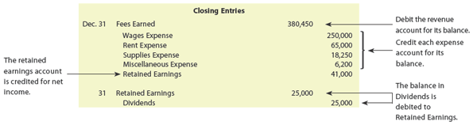</img>

[**Solución - Esquina de Verificación 4-2**]

| Date | Account | Debit | Credit |
|------|---------|-------|--------|
| Dec. 31 | Fees Earned | 380,450 | |
| | Wages Expense | | 250,000 |
| | Rent Expense | | 65,000 |
| | Supplies Expense | | 18,250 |
| | Miscellaneous Expense | | 6,200 |
| | Retained Earnings | | 41,000 |
| | *Closing entry (1)* | | |
| Dec. 31 | Retained Earnings | 25,000 | |
| | Dividends | | 25,000 |
| | *Closing entry (2)* | | |


---

## Ejemplo

Aquí tienes el **ejemplo completo con Balance Inicial + Journalizing + Posting Closing Entries + Balance Final**, todo conectado como en examen.

---

## 📊 1. BALANCE SHEET INICIAL (Beginning Balance)

| **Balance Sheet (Before Closing)** | Amount     |
| ---------------------------------- | ---------- |
| **Assets**                         |            |
| Cash                               | 12,000     |
| Accounts Receivable                | 3,000      |
| Equipment                          | 5,000      |
| **Total Assets**                   | **20,000** |
| **Liabilities**                    |            |
| Accounts Payable                   | 6,000      |
| **Stockholders’ Equity**           |            |
| Common Stock                       | 10,000     |
| Retained Earnings                  | 4,000      |
| **Total L + E**                    | **20,000** |

---

## 📌 2. TRANSACCIONES DEL PERÍODO

```text id="t1"
Service Revenue = 10,000
Rent Expense = 3,000
Salary Expense = 4,000
Dividends = 1,000
```

---

## 📈 3. INCOME STATEMENT

```text id="t2"
Service Revenue              10,000

Expenses:
 Rent Expense              (3,000)
 Salary Expense            (4,000)

-----------------------------------
Net Income                 3,000
```

---

## 🧾 4. JOURNALIZING CLOSING ENTRIES

---

### ✔️ 1. Cerrar ingresos

```text id="j1"
Dr Service Revenue        10,000
    Cr Income Summary        10,000
```

---

### ✔️ 2. Cerrar gastos

```text id="j2"
Dr Income Summary         7,000
    Cr Rent Expense          3,000
    Cr Salary Expense        4,000
```

---

### ✔️ 3. Cerrar Income Summary (Net Income)

```text id="j3"
Dr Income Summary         3,000
    Cr Retained Earnings     3,000
```

---

### ✔️ 4. Cerrar Dividends

```text id="j4"
Dr Retained Earnings      1,000
    Cr Dividends             1,000
```

---

## 📚 5. POSTING (Libro Mayor)

---

### 📌 Income Summary Ledger

```text id="p1"
Income Summary
-------------------------
Debit | Credit
7,000 | 10,000
Balance = 3,000 Credit
```

---

### 📌 Service Revenue Ledger

```text id="p2"
Service Revenue
-------------------------
Debit | Credit
10,000 | 10,000
Balance = 0
```

---

### 📌 Rent Expense Ledger

```text id="p3"
Rent Expense
-------------------------
Debit | Credit
3,000 | 3,000
Balance = 0
```

---

### 📌 Salary Expense Ledger

```text id="p4"
Salary Expense
-------------------------
Debit | Credit
4,000 | 4,000
Balance = 0
```

---

### 📌 Retained Earnings Ledger

```text id="p5"
Retained Earnings
-------------------------
Debit | Credit
1,000 | 3,000
New Balance = 6,000
```

---

### 📌 Dividends Ledger

```text id="p6"
Dividends
-------------------------
Debit | Credit
1,000 | 1,000
Balance = 0
```

---

## 🔁 6. EFECTO EN RETAINED EARNINGS

```text id="r1"
Beginning RE = 4,000
+ Net Income = 3,000
- Dividends  = 1,000
---------------------
Ending RE = 6,000
```

---

## 📊 7. BALANCE SHEET FINAL (After Closing)

| **Balance Sheet (After Closing)** | Amount     |
| --------------------------------- | ---------- |
| **Assets**                        |            |
| Cash                              | 14,000     |
| Accounts Receivable               | 3,000      |
| Equipment                         | 5,000      |
| **Total Assets**                  | **22,000** |
| **Liabilities**                   |            |
| Accounts Payable                  | 6,000      |
| **Stockholders’ Equity**          |            |
| Common Stock                      | 10,000     |
| Retained Earnings                 | 6,000      |
| **Total L + E**                   | **22,000** |

---

## 🧠 RESUMEN CLAVE

```text id="k1"
1. Balance inicial
2. Transacciones
3. Income Statement
4. Journalizing closing entries
5. Posting to ledger
6. Retained Earnings update
7. New Balance Sheet
```

---

## 💡 IDEA IMPORTANTE

* Closing entries NO crean dinero nuevo
* Solo transfieren información a Retained Earnings
* Todo termina con cuentas temporales en 0

---

<h1 id="800653" style="color:#E65100;">
  <a href="#Chapter_004" style="color:inherit; text-decoration:none;">
    4-3b Post-Closing Trial Balance
  </a>
</h1>

A post-closing trial balance is prepared after the closing entries have been posted. The purpose of the post-closing (after closing) trial balance is to verify that the ledger is in balance at the beginning of the next period. The accounts and amounts should agree exactly with the accounts and amounts listed on the balance sheet at the end of the period. The post-closing trial balance for NetSolutions is shown in Exhibit 7.

[Un balance de comprobación posterior al cierre se prepara después de que los asientos de cierre han sido traspasados. El propósito del balance de comprobación posterior al cierre (después del cierre) es verificar que el libro mayor esté en equilibrio al comienzo del próximo período. Las cuentas y los montos deben concordar exactamente con las cuentas y los montos enumerados en el balance general al final del período. El balance de comprobación posterior al cierre para NetSolutions se muestra en la Figura 7.]

---

## Exhibit 7

### Post-Closing Trial Balance, NetSolutions

[**Figura 7** - Balance de Comprobación Posterior al Cierre, NetSolutions]

<!-- 📍 IMAGEN: Exhibit 7 - Post-Closing Trial Balance (página 1) -->

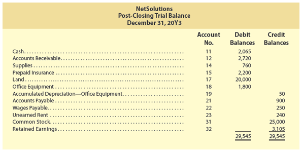

## NetSolutions
**Post-Closing Trial Balance**

**December 31, 20Y3**
| Account No. | | Debit Balances | Credit Balances |
|-------------|---------------------|---------------|-----------------|
| 11 | Cash | 2,065 | |
| 12 | Accounts Receivable | 2,720 | |
| 14 | Supplies | 760 | |
| 15 | Prepaid Insurance | 2,200 | |
| 17 | Land | 20,000 | |
| 18 | Office Equipment | 1,800 | |
| 19 | Accumulated Depreciation—Office Equipment | | 50 |
| 21 | Accounts Payable | | 900 |
| 22 | Wages Payable | | 250 |
| 23 | Unearned Rent | | 240 |
| 31 | Common Stock | | 25,000 |
| 32 | Retained Earnings | | 3,105 |
| | **Totals** | **29,545** | **29,545** |


---

<h1 id="816565" style="color:#E65100;">
  <a href="#Chapter_004" style="color:inherit; text-decoration:none;">
    4-4 Accounting Cycle
  </a>
</h1>


The accounting process that begins with analyzing and journalizing transactions and ends with the post-closing trial balance is called the **accounting cycle** (The accounting process that begins with analyzing and journalizing transactions and ends with the post-closing trial balance.). The steps in the accounting cycle are as follows:

[El proceso contable que comienza con el análisis y registro de transacciones en el diario y termina con el balance de comprobación posterior al cierre se llama **ciclo contable** (el proceso contable que comienza con el análisis y registro de transacciones en el diario y termina con el balance de comprobación posterior al cierre). Los pasos en el ciclo contable son los siguientes:]

**Step 1.** Transactions are analyzed and recorded in the journal.

[**Paso 1.** Las transacciones se analizan y registran en el diario.]

**Step 2.** Transactions are posted to the ledger.

[**Paso 2.** Las transacciones se traspasan al libro mayor.]

**Step 3.** An unadjusted trial balance is prepared.

[**Paso 3.** Se prepara un balance de comprobación no ajustado.]

**Step 4.** Adjustment data are assembled and analyzed.

[**Paso 4.** Se reúnen y analizan los datos de ajuste.]

**Step 5.** An optional end-of-period spreadsheet is prepared.

[**Paso 5.** Se prepara una hoja de cálculo de fin de período opcional.]

**Step 6.** Adjusting entries are journalized and posted to the ledger.

[**Paso 6.** Los asientos de ajuste se registran en el diario y se traspasan al libro mayor.]

**Step 7.** An adjusted trial balance is prepared.

[**Paso 7.** Se prepara un balance de comprobación ajustado.]

**Step 8.** Financial statements are prepared.

[**Paso 8.** Se preparan los estados financieros.]

**Step 9.** Closing entries are journalized and posted to the ledger.

[**Paso 9.** Los asientos de cierre se registran en el diario y se traspasan al libro mayor.]

**Step 10.** A post-closing trial balance is prepared.

[**Paso 10.** Se prepara un balance de comprobación posterior al cierre.]

Exhibit 8 illustrates the accounting cycle in graphic form. It also illustrates how the accounting cycle begins with transactions that flow through the accounting system into the financial statements.

[La Figura 8 ilustra el ciclo contable en forma gráfica. También ilustra cómo el ciclo contable comienza con transacciones que fluyen a través del sistema contable hacia los estados financieros.]

---

## Exhibit 8

### Accounting Cycle

[**Figura 8** - Ciclo Contable]

<!-- 📍 IMAGEN: Exhibit 8 - Accounting Cycle (páginas 2-3) -->

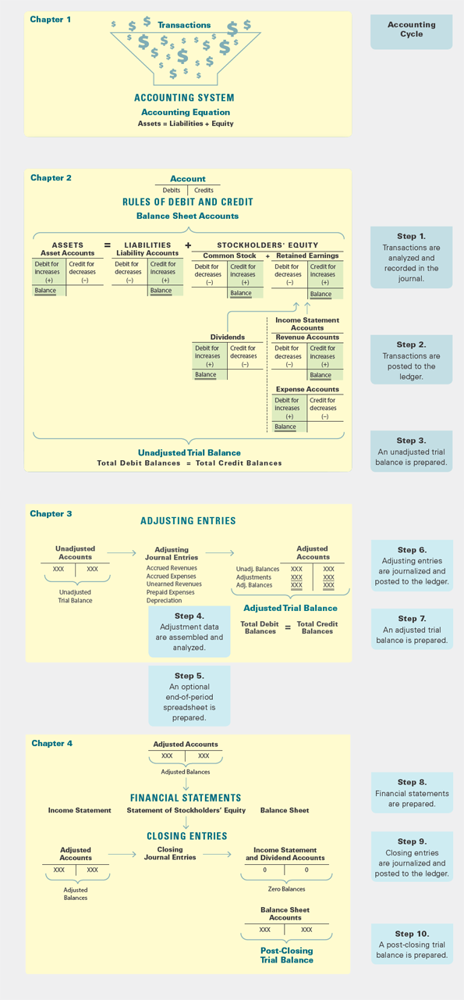


## Pathways Challenge

### This Is Accounting!

### Economic Activity

[**Desafío Pathways - ¡Esto es Contabilidad! - Actividad Económica**]

Financial statements report the results of operations for a period of time and the financial condition as of a specific date. However, a company usually does not report (issue) its financial statements for several weeks or months after the end of its fiscal year. This is because time is needed to adjust the accounts, prepare the financial statements, and have the financial statements examined (audited) by an independent certified public accounting (CPA) firm. During this time, significant business transactions or events may occur. For example, on February 13, 2019, the board of directors of The Cheesecake Factory Incorporated (CAKE) declared a dividend. The dividend was declared after its fiscal year ended on January 1, 2019, but before the financial statements were reported.

[Los estados financieros reportan los resultados de las operaciones durante un período de tiempo y la condición financiera a una fecha específica. Sin embargo, una empresa generalmente no reporta (emite) sus estados financieros durante varias semanas o meses después del final de su año fiscal. Esto se debe a que se necesita tiempo para ajustar las cuentas, preparar los estados financieros y hacer que los estados financieros sean examinados (auditados) por una firma independiente de contadores públicos certificados (CPA). Durante este tiempo, pueden ocurrir transacciones o eventos comerciales significativos. Por ejemplo, el 13 de febrero de 2019, la junta directiva de The Cheesecake Factory Incorporated (CAKE) declaró un dividendo. El dividendo se declaró después de que su año fiscal terminara el 1 de enero de 2019, pero antes de que se reportaran los estados financieros.]


---

<h1 id="440234" style="color:#E65100;">
  <a href="#Chapter_004" style="color:inherit; text-decoration:none;">
    4-5 Illustration of the Accounting Cycle
  </a>
</h1>


In this section, the complete accounting cycle for one period is illustrated. Assume that for several years Kelly Pitney has operated a part-time consulting business from her home. As of April 1, 20Y8, Kelly decided to move to rented quarters and to operate the business on a full-time basis. The business will be known as Kelly Consulting. During April, Kelly Consulting entered into the following transactions:

[En esta sección, se ilustra el ciclo contable completo para un período. Suponga que durante varios años Kelly Pitney ha operado un negocio de consultoría a tiempo parcial desde su casa. A partir del 1 de abril de 20Y8, Kelly decidió mudarse a un local alquilado y operar el negocio a tiempo completo. El negocio se llamará Kelly Consulting. Durante abril, Kelly Consulting realizó las siguientes transacciones:]

**Objective 5** - Illustrate the accounting cycle for one period.

[**Objetivo 5** - Ilustrar el ciclo contable para un período.]

---

**Apr. 1.** The following assets were received from Kelly Pitney in exchange for common stock: cash, $13,100; accounts receivable, $3,000; supplies, $1,400; and office equipment, $12,500. There were no liabilities received.

[**1 de abril.** Los siguientes activos fueron recibidos de Kelly Pitney a cambio de acciones comunes: efectivo, $13,100; cuentas por cobrar, $3,000; suministros, $1,400; y equipo de oficina, $12,500. No se recibieron pasivos.]

**Apr. 1.** Paid three months' rent on a lease rental contract, $4,800.

[**1 de abril.** Pagó tres meses de renta por adelantado en un contrato de arrendamiento, $4,800.]

**Apr. 2.** Paid the premiums on property and casualty insurance policies, $1,800.

[**2 de abril.** Pagó las primas de las pólizas de seguro de propiedad y de accidentes, $1,800.]

**Apr. 4.** Received cash from clients as an advance payment for services to be provided and recorded it as unearned fees, $5,000.

[**4 de abril.** Recibió efectivo de clientes como pago anticipado por servicios a proporcionar y lo registró como honorarios no devengados, $5,000.]

**Apr. 5.** Purchased additional office equipment on account from Office Station Co., $2,000.

[**5 de abril.** Compró equipo de oficina adicional a crédito de Office Station Co., $2,000.]

**Apr. 6.** Received cash from clients on account, $1,800.

[**6 de abril.** Recibió efectivo de clientes a cuenta, $1,800.]

**Apr. 10.** Paid cash for a newspaper advertisement, $120.

[**10 de abril.** Pagó efectivo por un anuncio en el periódico, $120.]

**Apr. 12.** Paid Office Station Co. for part of the debt incurred on April 5, $1,200.

[**12 de abril.** Pagó a Office Station Co. por parte de la deuda incurrida el 5 de abril, $1,200.]

**Apr. 12.** Recorded services provided on account for the period April 1-12, $4,200.

[**12 de abril.** Registró servicios prestados a crédito por el período del 1 al 12 de abril, $4,200.]

**Apr. 14.** Paid part-time receptionist for two weeks' salary, $750.

[**14 de abril.** Pagó a la recepcionista de medio tiempo por dos semanas de salario, $750.]

**Apr. 17.** Recorded cash from cash clients for fees earned during the period April 1-16, $6,250.

[**17 de abril.** Registró efectivo de clientes en efectivo por honorarios ganados durante el período del 1 al 16 de abril, $6,250.]

**Apr. 18.** Paid cash for supplies, $800.

[**18 de abril.** Pagó efectivo por suministros, $800.]

**Apr. 20.** Recorded services provided on account for the period April 13-20, $2,100.

[**20 de abril.** Registró servicios prestados a crédito por el período del 13 al 20 de abril, $2,100.]

**Apr. 24.** Recorded cash from cash clients for fees earned for the period April 17-24, $3,850.

[**24 de abril.** Registró efectivo de clientes en efectivo por honorarios ganados durante el período del 17 al 24 de abril, $3,850.]

**Apr. 26.** Received cash from clients on account, $5,600.

[**26 de abril.** Recibió efectivo de clientes a cuenta, $5,600.]

**Apr. 27.** Paid part-time receptionist for two weeks' salary, $750.

[**27 de abril.** Pagó a la recepcionista de medio tiempo por dos semanas de salario, $750.]

**Apr. 29.** Paid telephone bill for April, $130.

[**29 de abril.** Pagó la factura de teléfono de abril, $130.]

**Apr. 30.** Paid electricity bill for April, $200.

[**30 de abril.** Pagó la factura de electricidad de abril, $200.]

**Apr. 30.** Recorded cash from cash clients for fees earned for the period April 25-30, $3,050.

[**30 de abril.** Registró efectivo de clientes en efectivo por honorarios ganados durante el período del 25 al 30 de abril, $3,050.]

**Apr. 30.** Recorded services provided on account for the remainder of April, $1,500.

[**30 de abril.** Registró servicios prestados a crédito por el resto de abril, $1,500.]

**Apr. 30.** Paid dividends, $6,000.

[**30 de abril.** Pagó dividendos, $6,000.]

---

<h1 id="480126" style="color:#E65100;">
  <a href="#Chapter_004" style="color:inherit; text-decoration:none;">
    4-5a Step 1. Analyzing and Recording Transactions in the Journal
  </a>
</h1>


The first step in the accounting cycle is to analyze and record transactions in the journal using the double-entry accounting system. As illustrated in Chapter 2, transactions are analyzed and journalized as follows:

[El primer paso en el ciclo contable es analizar y registrar las transacciones en el diario utilizando el sistema de contabilidad de partida doble. Como se ilustró en el Capítulo 2, las transacciones se analizan y registran en el diario de la siguiente manera:]

**Step 1.** Carefully read the description of the transaction to determine whether an asset, liability, common stock, retained earnings, dividends, revenue, or expense account is affected.

[**Paso 1.** Lea cuidadosamente la descripción de la transacción para determinar si se afecta una cuenta de activo, pasivo, acciones comunes, ganancias retenidas, dividendos, ingreso o gasto.]

**Step 2.** For each account affected by the transaction, determine whether the account increases or decreases.

[**Paso 2.** Para cada cuenta afectada por la transacción, determine si la cuenta aumenta o disminuye.]

**Step 3.** Determine whether each increase or decrease should be recorded as a debit or a credit, following the rules of debit and credit shown in Exhibit 3 of Chapter 2.

[**Paso 3.** Determine si cada aumento o disminución debe registrarse como un débito o un crédito, siguiendo las reglas de débito y crédito mostradas en la Figura 3 del Capítulo 2.]

**Step 4.** Record the transaction using a journal entry.

[**Paso 4.** Registre la transacción usando un asiento de diario.]

The company's chart of accounts is useful in determining which accounts are affected by the transaction. The chart of accounts for Kelly Consulting is shown in Exhibit 9.

[El catálogo de cuentas de la empresa es útil para determinar qué cuentas se ven afectadas por la transacción. El catálogo de cuentas para Kelly Consulting se muestra en la Figura 9.]

---

## Exhibit 9

### Chart of Accounts for Kelly Consulting

[**Figura 9** - Catálogo de Cuentas para Kelly Consulting]

| Account No. | Account Name | | Account No. | Account Name |
|-------------|--------------|--|-------------|--------------|
| 11 | Cash | | 31 | Common Stock |
| 12 | Accounts Receivable | | 32 | Retained Earnings |
| 14 | Supplies | | 33 | Dividends |
| 15 | Prepaid Rent | | 41 | Fees Earned |
| 16 | Prepaid Insurance | | 51 | Salary Expense |
| 18 | Office Equipment | | 52 | Rent Expense |
| 19 | Accumulated Depreciation | | 53 | Supplies Expense |
| 21 | Accounts Payable | | 54 | Depreciation Expense |
| 22 | Salaries Payable | | 55 | Insurance Expense |
| 23 | Unearned Fees | | 59 | Miscellaneous Expense |

After analyzing each of Kelly Consulting's transactions for April, the journal entries are recorded as shown in Exhibit 10.

[Después de analizar cada una de las transacciones de Kelly Consulting para abril, los asientos de diario se registran como se muestra en la Figura 10.]

---

## Exhibit 10

### Journal Entries for April, Kelly Consulting

[**Figura 10** - Asientos de Diario para Abril, Kelly Consulting]

<!-- 📍 IMAGEN: Exhibit 10 - Journal Entries for April (páginas 2-5) -->


**Journal Page 1**

| Date | Description | Post. Ref. | Debit | Credit |
|------|-------------|------------|-------|--------|
| 20Y8 Apr. 1 | Cash | 11 | 13,100 | |
| | Accounts Receivable | 12 | 3,000 | |
| | Supplies | 14 | 1,400 | |
| | Office Equipment | 18 | 12,500 | |
| | Common Stock | 31 | | 30,000 |
| | *Investment in exchange for common stock.* | | | |
| Apr. 1 | Prepaid Rent | 15 | 4,800 | |
| | Cash | 11 | | 4,800 |
| | *Paid three months' rent.* | | | |
| Apr. 2 | Prepaid Insurance | 16 | 1,800 | |
| | Cash | 11 | | 1,800 |
| | *Paid insurance premiums.* | | | |
| Apr. 4 | Cash | 11 | 5,000 | |
| | Unearned Fees | 23 | | 5,000 |
| | *Received advance payment for services.* | | | |
| Apr. 5 | Office Equipment | 18 | 2,000 | |
| | Accounts Payable | 21 | | 2,000 |
| | *Purchased office equipment on account.* | | | |
| Apr. 6 | Cash | 11 | 1,800 | |
| | Accounts Receivable | 12 | | 1,800 |
| | *Received cash from clients on account.* | | | |
| Apr. 10 | Miscellaneous Expense | 59 | 120 | |
| | Cash | 11 | | 120 |
| | *Paid for newspaper advertisement.* | | | |
| Apr. 12 | Accounts Payable | 21 | 1,200 | |
| | Cash | 11 | | 1,200 |
| | *Paid part of debt to Office Station Co.* | | | |
| Apr. 12 | Accounts Receivable | 12 | 4,200 | |
| | Fees Earned | 41 | | 4,200 |
| | *Recorded services provided on account.* | | | |
| Apr. 14 | Salary Expense | 51 | 750 | |
| | Cash | 11 | | 750 |
| | *Paid receptionist's salary.* | | | |

---

**Journal Page 2**

| Date | Description | Post. Ref. | Debit | Credit |
|------|-------------|------------|-------|--------|
| 20Y8 Apr. 17 | Cash | 11 | 6,250 | |
| | Fees Earned | 41 | | 6,250 |
| | *Recorded fees earned from cash clients.* | | | |
| Apr. 18 | Supplies | 14 | 800 | |
| | Cash | 11 | | 800 |
| | *Purchased supplies for cash.* | | | |
| Apr. 20 | Accounts Receivable | 12 | 2,100 | |
| | Fees Earned | 41 | | 2,100 |
| | *Recorded services provided on account.* | | | |
| Apr. 24 | Cash | 11 | 3,850 | |
| | Fees Earned | 41 | | 3,850 |
| | *Recorded fees earned from cash clients.* | | | |
| Apr. 26 | Cash | 11 | 5,600 | |
| | Accounts Receivable | 12 | | 5,600 |
| | *Received cash from clients on account.* | | | |
| Apr. 27 | Salary Expense | 51 | 750 | |
| | Cash | 11 | | 750 |
| | *Paid receptionist's salary.* | | | |
| Apr. 29 | Miscellaneous Expense | 59 | 130 | |
| | Cash | 11 | | 130 |
| | *Paid telephone bill.* | | | |
| Apr. 30 | Miscellaneous Expense | 59 | 200 | |
| | Cash | 11 | | 200 |
| | *Paid electricity bill.* | | | |
| Apr. 30 | Cash | 11 | 3,050 | |
| | Fees Earned | 41 | | 3,050 |
| | *Recorded fees earned from cash clients.* | | | |
| Apr. 30 | Accounts Receivable | 12 | 1,500 | |
| | Fees Earned | 41 | | 1,500 |
| | *Recorded services provided on account.* | | | |
| Apr. 30 | Dividends | 33 | 6,000 | |
| | Cash | 11 | | 6,000 |
| | *Paid dividends.* | | | |


---

<h1 id="916852" style="color:#E65100;">
  <a href="#Chapter_004" style="color:inherit; text-decoration:none;">
    4-5b Step 2. Posting Transactions to the Ledger
  </a>
</h1>

# 4-5b Step 2. Posting Transactions to the Ledger

Periodically, the transactions recorded in the journal are posted to the accounts in the ledger. The debits and credits for each journal entry are posted to the accounts in the order in which they occur in the journal. As illustrated in Chapters 2 and 3, journal entries are posted to the accounts using the following four steps:

[Periódicamente, las transacciones registradas en el diario se traspasan a las cuentas del libro mayor. Los débitos y créditos de cada asiento de diario se traspasan a las cuentas en el orden en que ocurren en el diario. Como se ilustró en los Capítulos 2 y 3, los asientos de diario se traspasan a las cuentas utilizando los siguientes cuatro pasos:]

**Step 1.** The date is entered in the Date column of the account.

[**Paso 1.** La fecha se ingresa en la columna Fecha de la cuenta.]

**Step 2.** The amount is entered into the Debit or Credit column of the account.

[**Paso 2.** El monto se ingresa en la columna Débito o Crédito de la cuenta.]

**Step 3.** The journal page number is entered in the Posting Reference column.

[**Paso 3.** El número de página del diario se ingresa en la columna Referencia de Traspaso (Post. Ref.).]

**Step 4.** The account number is entered in the Posting Reference (Post. Ref.) column in the journal.

[**Paso 4.** El número de cuenta se ingresa en la columna Referencia de Traspaso (Post. Ref.) en el diario.]

The journal entries for Kelly Consulting have been posted to the ledger shown in Exhibit 18.

[Los asientos de diario para Kelly Consulting han sido traspasados al libro mayor que se muestra en la Figura 18.]

<!-- 📍 IMAGEN: Exhibit 18 - Ledger (páginas 2 en adelante) -->

## Exhibit 18

### Ledger, Kelly Consulting

[**Figura 18** - Libro Mayor, Kelly Consulting]


#### Account Cash - Account No. 11

| Date | Item | Post. Ref. | Debit | Credit | Balance Debit | Balance Credit |
|------|------|------------|-------|--------|---------------|----------------|
| 20Y8 Apr. 1 | | 1 | 13,100 | | 13,100 | |
| Apr. 1 | | 1 | | 4,800 | 8,300 | |
| Apr. 2 | | 1 | | 1,800 | 6,500 | |
| Apr. 4 | | 1 | 5,000 | | 11,500 | |
| Apr. 6 | | 1 | 1,800 | | 13,300 | |
| Apr. 10 | | 1 | | 120 | 13,180 | |
| Apr. 12 | | 1 | | 1,200 | 11,980 | |
| Apr. 14 | | 1 | | 750 | 11,230 | |
| Apr. 17 | | 2 | 6,250 | | 17,480 | |
| Apr. 18 | | 2 | | 800 | 16,680 | |
| Apr. 24 | | 2 | 3,850 | | 20,530 | |
| Apr. 26 | | 2 | 5,600 | | 26,130 | |
| Apr. 27 | | 2 | | 750 | 25,380 | |
| Apr. 29 | | 2 | | 130 | 25,250 | |
| Apr. 30 | | 2 | | 200 | 25,050 | |
| Apr. 30 | | 2 | 3,050 | | 28,100 | |
| Apr. 30 | | 2 | | 6,000 | 22,100 | |


#### Account Accounts Receivable - Account No. 12

| Date | Item | Post. Ref. | Debit | Credit | Balance Debit | Balance Credit |
|------|------|------------|-------|--------|---------------|----------------|
| 20Y8 Apr. 1 | | 1 | 3,000 | | 3,000 | |
| Apr. 6 | | 1 | | 1,800 | 1,200 | |
| Apr. 12 | | 1 | 4,200 | | 5,400 | |
| Apr. 20 | | 2 | 2,100 | | 7,500 | |
| Apr. 26 | | 2 | | 5,600 | 1,900 | |
| Apr. 30 | | 2 | 1,500 | | 3,400 | |


#### Account Supplies - Account No. 14

| Date | Item | Post. Ref. | Debit | Credit | Balance Debit | Balance Credit |
|------|------|------------|-------|--------|---------------|----------------|
| 20Y8 Apr. 1 | | 1 | 1,400 | | 1,400 | |
| Apr. 18 | | 2 | 800 | | 2,200 | |
| Apr. 30 | Adjusting | 3 | | 850 | 1,350 | |


#### Account Prepaid Rent - Account No. 15

| Date | Item | Post. Ref. | Debit | Credit | Balance Debit | Balance Credit |
|------|------|------------|-------|--------|---------------|----------------|
| 20Y8 Apr. 1 | | 1 | 4,800 | | 4,800 | |
| Apr. 30 | Adjusting | 3 | | 1,600 | 3,200 | |


#### Account Prepaid Insurance - Account No. 16

| Date | Item | Post. Ref. | Debit | Credit | Balance Debit | Balance Credit |
|------|------|------------|-------|--------|---------------|----------------|
| 20Y8 Apr. 2 | | 1 | 1,800 | | 1,800 | |
| Apr. 30 | Adjusting | 3 | | 300 | 1,500 | |


#### Account Office Equipment - Account No. 18

| Date | Item | Post. Ref. | Debit | Credit | Balance Debit | Balance Credit |
|------|------|------------|-------|--------|---------------|----------------|
| 20Y8 Apr. 1 | | 1 | 12,500 | | 12,500 | |
| Apr. 5 | | 1 | 2,000 | | 14,500 | |


#### Account Accumulated Depreciation - Account No. 19

| Date | Item | Post. Ref. | Debit | Credit | Balance Debit | Balance Credit |
|------|------|------------|-------|--------|---------------|----------------|
| 20Y8 Apr. 30 | Adjusting | 3 | | 330 | | 330 |


#### Account Accounts Payable - Account No. 21

| Date | Item | Post. Ref. | Debit | Credit | Balance Debit | Balance Credit |
|------|------|------------|-------|--------|---------------|----------------|
| 20Y8 Apr. 5 | | 1 | | 2,000 | | 2,000 |
| Apr. 12 | | 1 | 1,200 | | | 800 |


#### Account Salaries Payable - Account No. 22

| Date | Item | Post. Ref. | Debit | Credit | Balance Debit | Balance Credit |
|------|------|------------|-------|--------|---------------|----------------|
| 20Y8 Apr. 30 | Adjusting | 3 | | 120 | | 120 |


#### Account Unearned Fees - Account No. 23

| Date | Item | Post. Ref. | Debit | Credit | Balance Debit | Balance Credit |
|------|------|------------|-------|--------|---------------|----------------|
| 20Y8 Apr. 4 | | 1 | | 5,000 | | 5,000 |
| Apr. 30 | Adjusting | 3 | 2,500 | | | 2,500 |


#### Account Common Stock - Account No. 31

| Date | Item | Post. Ref. | Debit | Credit | Balance Debit | Balance Credit |
|------|------|------------|-------|--------|---------------|----------------|
| 20Y8 Apr. 1 | | 1 | | 30,000 | | 30,000 |


#### Account Retained Earnings - Account No. 32

| Date | Item | Post. Ref. | Debit | Credit | Balance Debit | Balance Credit |
|------|------|------------|-------|--------|---------------|----------------|
| 20Y8 Apr. 1 | | | | | | 0 |
| Apr. 30 | Closing | 4 | | 18,300 | | 18,300 |
| Apr. 30 | Closing | 4 | 6,000 | | | 12,300 |


#### Account Dividends - Account No. 33

| Date | Item | Post. Ref. | Debit | Credit | Balance Debit | Balance Credit |
|------|------|------------|-------|--------|---------------|----------------|
| 20Y8 Apr. 30 | | 2 | 6,000 | | 6,000 | |
| Apr. 30 | Closing | 4 | | 6,000 | — | — |


#### Account Fees Earned - Account No. 41

| Date | Item | Post. Ref. | Debit | Credit | Balance Debit | Balance Credit |
|------|------|------------|-------|--------|---------------|----------------|
| 20Y8 Apr. 12 | | 1 | | 4,200 | | 4,200 |
| Apr. 17 | | 2 | | 6,250 | | 10,450 |
| Apr. 20 | | 2 | | 2,100 | | 12,550 |
| Apr. 24 | | 2 | | 3,850 | | 16,400 |
| Apr. 30 | | 2 | | 3,050 | | 19,450 |
| Apr. 30 | | 2 | | 1,500 | | 20,950 |
| Apr. 30 | Adjusting | 3 | | 2,500 | | 23,450 |
| Apr. 30 | Closing | 4 | 23,450 | | — | — |


#### Account Salary Expense - Account No. 51

| Date | Item | Post. Ref. | Debit | Credit | Balance Debit | Balance Credit |
|------|------|------------|-------|--------|---------------|----------------|
| 20Y8 Apr. 14 | | 1 | 750 | | 750 | |
| Apr. 27 | | 2 | 750 | | 1,500 | |
| Apr. 30 | Adjusting | 3 | 120 | | 1,620 | |
| Apr. 30 | Closing | 4 | | 1,620 | — | — |


#### Account Rent Expense - Account No. 52

| Date | Item | Post. Ref. | Debit | Credit | Balance Debit | Balance Credit |
|------|------|------------|-------|--------|---------------|----------------|
| 20Y8 Apr. 30 | Adjusting | 3 | 1,600 | | 1,600 | |
| Apr. 30 | Closing | 4 | | 1,600 | — | — |


#### Account Supplies Expense - Account No. 53

| Date | Item | Post. Ref. | Debit | Credit | Balance Debit | Balance Credit |
|------|------|------------|-------|--------|---------------|----------------|
| 20Y8 Apr. 30 | Adjusting | 3 | 850 | | 850 | |
| Apr. 30 | Closing | 4 | | 850 | — | — |


#### Account Depreciation Expense - Account No. 54

| Date | Item | Post. Ref. | Debit | Credit | Balance Debit | Balance Credit |
|------|------|------------|-------|--------|---------------|----------------|
| 20Y8 Apr. 30 | Adjusting | 3 | 330 | | 330 | |
| Apr. 30 | Closing | 4 | | 330 | — | — |


#### Account Insurance Expense - Account No. 55

| Date | Item | Post. Ref. | Debit | Credit | Balance Debit | Balance Credit |
|------|------|------------|-------|--------|---------------|----------------|
| 20Y8 Apr. 30 | Adjusting | 3 | 300 | | 300 | |
| Apr. 30 | Closing | 4 | | 300 | — | — |


#### Account Miscellaneous Expense - Account No. 59

| Date | Item | Post. Ref. | Debit | Credit | Balance Debit | Balance Credit |
|------|------|------------|-------|--------|---------------|----------------|
| 20Y8 Apr. 10 | | 1 | 120 | | 120 | |
| Apr. 29 | | 2 | 130 | | 250 | |
| Apr. 30 | | 2 | 200 | | 450 | |
| Apr. 30 | Closing | 4 | | 450 | — | — |

---

<h1 id="068737" style="color:#E65100;">
  <a href="#Chapter_004" style="color:inherit; text-decoration:none;">
    4-5c Step 3. Preparing an Unadjusted Trial Balance
  </a>
</h1>


An unadjusted trial balance is prepared to determine whether any errors have been made in posting the debits and credits to the ledger. The unadjusted trial balance shown in Exhibit 11 does not provide complete proof of the accuracy of the ledger. It indicates only that the debits and the credits are equal. This proof is of value, however, because errors often affect the equality of debits and credits. If the two totals of a trial balance are not equal, an error has occurred that must be discovered and corrected.

[Se prepara un balance de comprobación no ajustado para determinar si se han cometido errores al traspasar los débitos y créditos al libro mayor. El balance de comprobación no ajustado que se muestra en la Figura 11 no proporciona una prueba completa de la exactitud del libro mayor. Solo indica que los débitos y los créditos son iguales. Esta comprobación tiene valor, sin embargo, porque los errores a menudo afectan la igualdad de débitos y créditos. Si los dos totales de un balance de comprobación no son iguales, ha ocurrido un error que debe ser descubierto y corregido.]

---

## Exhibit 11

### Unadjusted Trial Balance, Kelly Consulting

[**Figura 11** - Balance de Comprobación No Ajustado, Kelly Consulting]

<!-- 📍 IMAGEN: Exhibit 11 - Unadjusted Trial Balance (página 1) -->

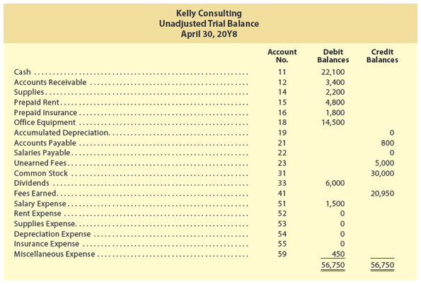

## Kelly Consulting

**Unadjusted Trial Balance**

**April 30, 20Y8**
| Account No. | | Debit Balances | Credit Balances |
|-------------|---------------------|---------------|-----------------|
| 11 | Cash | 22,100 | |
| 12 | Accounts Receivable | 3,400 | |
| 14 | Supplies | 2,200 | |
| 15 | Prepaid Rent | 4,800 | |
| 16 | Prepaid Insurance | 1,800 | |
| 18 | Office Equipment | 14,500 | |
| 19 | Accumulated Depreciation | | 0 |
| 21 | Accounts Payable | | 800 |
| 22 | Salaries Payable | | 0 |
| 23 | Unearned Fees | | 5,000 |
| 31 | Common Stock | | 30,000 |
| 33 | Dividends | 6,000 | |
| 41 | Fees Earned | | 20,950 |
| 51 | Salary Expense | 1,500 | |
| 52 | Rent Expense | 0 | |
| 53 | Supplies Expense | 0 | |
| 54 | Depreciation Expense | 0 | |
| 55 | Insurance Expense | 0 | |
| 59 | Miscellaneous Expense | 450 | |
| | **Totals** | **56,750** | **56,750** |

The unadjusted account balances shown in Exhibit 11 were taken from Kelly Consulting's ledger, before any adjusting entries were recorded.

[Los saldos de cuentas no ajustados que se muestran en la Figura 11 fueron tomados del libro mayor de Kelly Consulting, antes de que se registrara cualquier asiento de ajuste.]

---

<h1 id="659468" style="color:#E65100;">
  <a href="#Chapter_004" style="color:inherit; text-decoration:none;">
    4-5d Step 4. Assembling and Analyzing Adjustment Data
  </a>
</h1>


Before the financial statements can be prepared, the accounts must be updated. The four types of accounts that normally require adjustment include accrued revenues, accrued expenses, unearned revenues, and prepaid expenses. In addition, depreciation expense must be recorded for fixed assets other than land. The following data have been assembled on April 30, 20Y8, for analysis of possible adjustments for Kelly Consulting:

[Antes de que se puedan preparar los estados financieros, las cuentas deben ser actualizadas. Los cuatro tipos de cuentas que normalmente requieren ajuste incluyen ingresos devengados, gastos devengados, ingresos no devengados y gastos pagados por adelantado. Además, el gasto de depreciación debe registrarse para activos fijos distintos del terreno. Los siguientes datos se han reunido el 30 de abril de 20Y8 para el análisis de posibles ajustes para Kelly Consulting:]

**a.** Insurance expired during April is $300.

[**a.** El seguro vencido durante abril es de $300.]

**b.** Supplies on hand on April 30 are $1,350.

[**b.** Los suministros disponibles el 30 de abril son de $1,350.]

**c.** Depreciation of office equipment for April is $330.

[**c.** La depreciación del equipo de oficina para abril es de $330.]

**d.** Accrued receptionist salary on April 30 is $120.

[**d.** El salario devengado de la recepcionista al 30 de abril es de $120.]

**e.** Rent expired during April is $1,600.

[**e.** La renta vencida durante abril es de $1,600.]

**f.** Unearned fees on April 30 are $2,500.

[**f.** Los honorarios no devengados al 30 de abril son de $2,500.]

---

<h1 id="005342" style="color:#E65100;">
  <a href="#Chapter_004" style="color:inherit; text-decoration:none;">
    4-5e Step 5. Preparing an Optional End-of-Period Spreadsheet
  </a>
</h1>


Although an end-of-period spreadsheet is not required, it is useful in showing the flow of accounting information from the unadjusted trial balance to the adjusted trial balance. In addition, an end-of-period spreadsheet is useful in analyzing the impact of proposed adjustments on the financial statements. The end-of-period spreadsheet for Kelly Consulting is shown in Exhibit 12.

[Aunque una hoja de cálculo de fin de período no es obligatoria, es útil para mostrar el flujo de la información contable desde el balance de comprobación no ajustado hasta el balance de comprobación ajustado. Además, una hoja de cálculo de fin de período es útil para analizar el impacto de los ajustes propuestos en los estados financieros. La hoja de cálculo de fin de período para Kelly Consulting se muestra en la Figura 12.]

---

## Exhibit 12

### End-of-Period Spreadsheet, Kelly Consulting

[**Figura 12** - Hoja de Cálculo de Fin de Período, Kelly Consulting]

<!-- 📍 IMAGEN: Exhibit 12 - End-of-Period Spreadsheet (páginas 1-2) -->

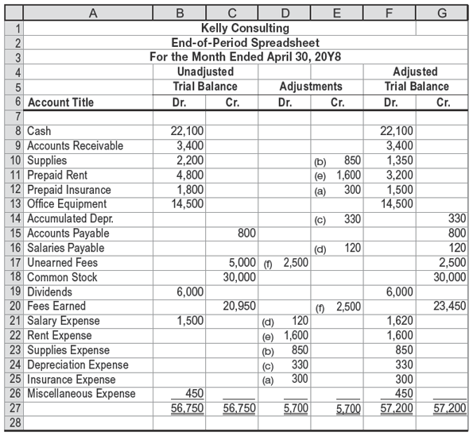

<table><thead>
  <tr>
    <th colspan="7" style="text-align:center;">Kelly Consulting</th>
  </tr></thead>
<tbody>
  <tr>
    <td colspan="7" style="text-align:center;">End-of-Period Spreadsheet</td>
  </tr>
  <tr>
    <td colspan="7" style="text-align:center;">For the Month Ended April 30, 20Y8</td>
  </tr>
  <tr>
    <td></td>
    <td colspan="2" style="text-align:center;">Unadjusted Trial Balance</td>
    <td colspan="2" style="text-align:center;"></td>
    <td colspan="2" style="text-align:center;">Adjusted</td>
  </tr>
  <tr>
    <td></td>
    <td colspan="2" style="text-align:center;">Trial Balance</td>
    <td colspan="2" style="text-align:center;">Adjustments</td>
    <td colspan="2" style="text-align:center;">Trial Balance</td>
  </tr>
  <tr>
    <td style="text-align:center;">Account Title</td>
    <td style="text-align:center;">Dr.</td>
    <td style="text-align:center;">Cr.</td>
    <td style="text-align:center;">Dr.</td>
    <td style="text-align:center;">Cr.</td>
    <td style="text-align:center;">Dr.</td>
    <td style="text-align:center;">Cr.</td>
  </tr>
  <tr>
    <td>Cash</td>
    <td>22,100</td>
    <td></td>
    <td></td>
    <td></td>
    <td>22,100</td>
    <td></td>
  </tr>
  <tr>
    <td>Accounts Receivable</td>
    <td>3,400</td>
    <td></td>
    <td></td>
    <td></td>
    <td>3,400</td>
    <td></td>
  </tr>
  <tr>
    <td>Supplies</td>
    <td>2,200</td>
    <td></td>
    <td>(b) 850</td>
    <td></td>
    <td>1,350</td>
    <td></td>
  </tr>
  <tr>
    <td>Prepaid Rent</td>
    <td>4,800</td>
    <td></td>
    <td>(e) 1,600</td>
    <td></td>
    <td>3,200</td>
    <td></td>
  </tr>
  <tr>
    <td>Prepaid Insurance</td>
    <td>1,800</td>
    <td></td>
    <td>(a) 300</td>
    <td></td>
    <td>1,500</td>
    <td></td>
  </tr>
  <tr>
    <td>Office Equipment</td>
    <td>14,500</td>
    <td></td>
    <td></td>
    <td></td>
    <td>14,500</td>
    <td></td>
  </tr>
  <tr>
    <td>Accumulated Depreciation</td>
    <td></td>
    <td></td>
    <td>(c) 330</td>
    <td></td>
    <td></td>
    <td>330</td>
  </tr>
  <tr>
    <td>Accounts Payable</td>
    <td></td>
    <td>800</td>
    <td></td>
    <td></td>
    <td></td>
    <td>800</td>
  </tr>
  <tr>
    <td>Salaries Payable</td>
    <td></td>
    <td></td>
    <td>(d) 120</td>
    <td></td>
    <td></td>
    <td>120</td>
  </tr>
  <tr>
    <td>Unearned Fees</td>
    <td></td>
    <td>5,000</td>
    <td>(f) 2,500</td>
    <td></td>
    <td></td>
    <td>2,500</td>
  </tr>
  <tr>
    <td>Common Stock</td>
    <td></td>
    <td>30,000</td>
    <td></td>
    <td></td>
    <td></td>
    <td>30,000</td>
  </tr>
  <tr>
    <td>Dividends</td>
    <td>6,000</td>
    <td></td>
    <td></td>
    <td></td>
    <td>6,000</td>
    <td></td>
  </tr>
  <tr>
    <td>Fees Earned</td>
    <td></td>
    <td>20,950</td>
    <td></td>
    <td>(f) 2,500</td>
    <td></td>
    <td>23,450</td>
  </tr>
  <tr>
    <td>Salary Expense</td>
    <td>1,500</td>
    <td></td>
    <td>(d) 120</td>
    <td></td>
    <td>1,620</td>
    <td></td>
  </tr>
  <tr>
    <td>Rent Expense</td>
    <td></td>
    <td></td>
    <td>(e) 1,600</td>
    <td></td>
    <td>1,600</td>
    <td></td>
  </tr>
  <tr>
    <td>Supplies Expense</td>
    <td></td>
    <td></td>
    <td>(b) 850</td>
    <td></td>
    <td>850</td>
    <td></td>
  </tr>
  <tr>
    <td>Depreciation Expense</td>
    <td></td>
    <td></td>
    <td>(c) 330</td>
    <td></td>
    <td>330</td>
    <td></td>
  </tr>
  <tr>
    <td>Insurance Expense</td>
    <td></td>
    <td></td>
    <td>(a) 300</td>
    <td></td>
    <td>300</td>
    <td></td>
  </tr>
  <tr>
    <td>Miscellaneous Expense</td>
    <td>450</td>
    <td></td>
    <td></td>
    <td></td>
    <td>450</td>
    <td></td>
  </tr>
  <tr>
    <td></td>
    <td>56,750</td>
    <td>56,750</td>
    <td>5,700</td>
    <td>5,700</td>
    <td>57,200</td>
    <td>57,200</td>
  </tr>
  <tr>
    <td></td>
    <td></td>
    <td></td>
    <td></td>
    <td></td>
    <td></td>
    <td></td>
  </tr>
</tbody></table>


---

<h1 id="449074" style="color:#E65100;">
  <a href="#Chapter_004" style="color:inherit; text-decoration:none;">
    4-5f Step 6. Journalizing and Posting Adjusting Entries
  </a>
</h1>


Based on the adjustment data shown in Step 4, adjusting entries for Kelly Consulting are prepared as shown in Exhibit 13. Each adjusting entry affects at least one income statement account and one balance sheet account. Explanations for each adjustment including any computations are normally included with each adjusting entry.

[Con base en los datos de ajuste mostrados en el Paso 4, se preparan los asientos de ajuste para Kelly Consulting como se muestra en la Figura 13. Cada asiento de ajuste afecta al menos una cuenta del estado de resultados y una cuenta del balance general. Normalmente se incluyen explicaciones para cada ajuste, incluidos los cálculos, con cada asiento de ajuste.]

---

## Exhibit 13

### Adjusting Entries, Kelly Consulting

[**Figura 13** - Asientos de Ajuste, Kelly Consulting]

<!-- 📍 IMAGEN: Exhibit 13 - Adjusting Entries (páginas 1-2) -->


| Date | Description | Post. Ref. | Debit | Credit |
|------|-------------|------------|-------|--------|
| 20Y8 Apr. 30 | **Adjusting Entries** | | | |
| | Insurance Expense | 55 | 300 | |
| | Prepaid Insurance | 16 | | 300 |
| | *Expired insurance.* | | | |
| Apr. 30 | Supplies Expense | 53 | 850 | |
| | Supplies | 14 | | 850 |
| | *Supplies used ($2,200 – $1,350).* | | | |
| Apr. 30 | Depreciation Expense | 54 | 330 | |
| | Accumulated Depreciation | 19 | | 330 |
| | *Depreciation of office equipment.* | | | |
| Apr. 30 | Salary Expense | 51 | 120 | |
| | Salaries Payable | 22 | | 120 |
| | *Accrued receptionist salary.* | | | |
| Apr. 30 | Rent Expense | 52 | 1,600 | |
| | Prepaid Rent | 15 | | 1,600 |
| | *Rent expired during April.* | | | |
| Apr. 30 | Unearned Fees | 23 | 2,500 | |
| | Fees Earned | 41 | | 2,500 |
| | *Fees earned ($5,000 – $2,500).* | | | |

Each of the adjusting entries shown in Exhibit 13 is posted to Kelly Consulting's ledger shown in Exhibit 18. The adjusting entries are identified in the ledger as "Adjusting."

[Cada uno de los asientos de ajuste mostrados en la Figura 13 se traspasa al libro mayor de Kelly Consulting que se muestra en la Figura 18. Los asientos de ajuste se identifican en el libro mayor como "Ajuste".]

---

<h1 id="483886" style="color:#E65100;">
  <a href="#Chapter_004" style="color:inherit; text-decoration:none;">
    4-5g Step 7. Preparing an Adjusted Trial Balance
  </a>
</h1>

# 4-5g Step 7. Preparing an Adjusted Trial Balance

After the adjustments have been journalized and posted, an adjusted trial balance is prepared to verify the equality of the total of the debit and credit balances. This is the last step before preparing the financial statements. If the adjusted trial balance does not balance, an error has occurred and must be found and corrected. The adjusted trial balance for Kelly Consulting as of April 30, 20Y8, is shown in Exhibit 14.

[Después de que los ajustes han sido registrados en el diario y traspasados, se prepara un balance de comprobación ajustado para verificar la igualdad del total de los saldos deudores y acreedores. Este es el último paso antes de preparar los estados financieros. Si el balance de comprobación ajustado no cuadra, ha ocurrido un error y debe ser encontrado y corregido. El balance de comprobación ajustado para Kelly Consulting al 30 de abril de 20Y8 se muestra en la Figura 14.]

---

## Exhibit 14

### Adjusted Trial Balance, Kelly Consulting

[**Figura 14** - Balance de Comprobación Ajustado, Kelly Consulting]

<!-- 📍 IMAGEN: Exhibit 14 - Adjusted Trial Balance (página 1) -->

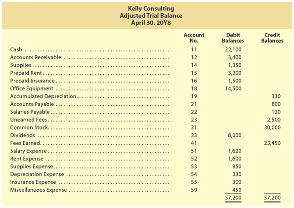

| | Kelly Consulting | | |
| | Adjusted Trial Balance | | |
| | April 30, 20Y8 | | |
| Account No. | | Debit Balances | Credit Balances |
|-------------|---------------------|---------------|-----------------|
| 11 | Cash | 22,100 | |
| 12 | Accounts Receivable | 3,400 | |
| 14 | Supplies | 1,350 | |
| 15 | Prepaid Rent | 3,200 | |
| 16 | Prepaid Insurance | 1,500 | |
| 18 | Office Equipment | 14,500 | |
| 19 | Accumulated Depreciation | | 330 |
| 21 | Accounts Payable | | 800 |
| 22 | Salaries Payable | | 120 |
| 23 | Unearned Fees | | 2,500 |
| 31 | Common Stock | | 30,000 |
| 33 | Dividends | 6,000 | |
| 41 | Fees Earned | | 23,450 |
| 51 | Salary Expense | 1,620 | |
| 52 | Rent Expense | 1,600 | |
| 53 | Supplies Expense | 850 | |
| 54 | Depreciation Expense | 330 | |
| 55 | Insurance Expense | 300 | |
| 59 | Miscellaneous Expense | 450 | |
| | **Totals** | **57,200** | **57,200** |


---

<h1 id="802542" style="color:#E65100;">
  <a href="#Chapter_004" style="color:inherit; text-decoration:none;">
    4-5h Step 8. Preparing the Financial Statements
  </a>
</h1>


The most important outcome of the accounting cycle is the financial statements. The income statement is prepared first, followed by the statement of stockholders' equity and then the balance sheet. The statements can be prepared directly from the adjusted trial balance, the end-of-period spreadsheet, or the ledger. The net income or net loss shown on the income statement is reported on the statement of stockholders' equity along with any dividends. The ending retained earnings is reported on the balance sheet with common stock as part of stockholders' equity. Stockholders' equity is then added with total liabilities to equal total assets.

[El resultado más importante del ciclo contable son los estados financieros. El estado de resultados se prepara primero, seguido del estado de cambios en el capital contable y luego el balance general. Los estados pueden prepararse directamente a partir del balance de comprobación ajustado, la hoja de cálculo de fin de período o el libro mayor. El ingreso neto o la pérdida neta que se muestra en el estado de resultados se reporta en el estado de cambios en el capital contable junto con los dividendos. Las ganancias retenidas finales se reportan en el balance general con las acciones comunes como parte del capital contable. El capital contable se suma luego con los pasivos totales para igualar los activos totales.]

The financial statements for Kelly Consulting are shown in Exhibit 15. Kelly Consulting earned net income of $18,300 for April. As of April 30, 20Y8, Kelly Consulting has total assets of $45,720, total liabilities of $3,420, and total stockholders' equity of $42,300.

[Los estados financieros para Kelly Consulting se muestran en la Figura 15. Kelly Consulting obtuvo un ingreso neto de $18,300 para abril. Al 30 de abril de 20Y8, Kelly Consulting tiene activos totales de $45,720, pasivos totales de $3,420 y capital contable total de $42,300.]

---

## Exhibit 15

### Financial Statements, Kelly Consulting

[**Figura 15** - Estados Financieros, Kelly Consulting]

<!-- 📍 IMAGEN: Exhibit 15 - Financial Statements (páginas 1-2) -->

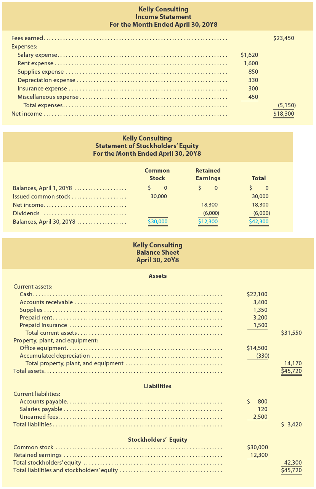

---

#### Kelly Consulting
#### Income Statement
#### For the Month Ended April 30, 20Y8

<table><thead>
  <tr>
    <th colspan="4">Revenues: [Ingresos:]</th>
    <th></th>
    <th>Total</th>
  </tr></thead>
<tbody>
  <tr>
    <td></td>
    <td colspan="3">Fees earned [Ingresos por Servicios]</td>
    <td></td>
    <td>$23,450</td>
  </tr>
  <tr>
    <td colspan="4">Expenses: [Gastos:]</td>
    <td></td>
    <td></td>
  </tr>
  <tr>
    <td></td>
    <td colspan="3">Salary expense [Gasto de Sueldos]</td>
    <td>$1,620</td>
    <td></td>
  </tr>
  <tr>
    <td></td>
    <td colspan="3">Rent expense [Gasto de Renta]</td>
    <td>1,600</td>
    <td></td>
  </tr>
  <tr>
    <td></td>
    <td colspan="3">Supplies expense [Gasto de Suministros]</td>
    <td>850</td>
    <td></td>
  </tr>
  <tr>
    <td></td>
    <td colspan="3">Depreciation expense [Gasto de Depreciación]</td>
    <td>330</td>
    <td></td>
  </tr>
  <tr>
    <td></td>
    <td colspan="3">Insurance expense [Gasto de Seguro]</td>
    <td>300</td>
    <td></td>
  </tr>
  <tr>
    <td></td>
    <td colspan="3">Miscellaneous expense [Gastos Misceláneos]</td>
    <td>450</td>
    <td></td>
  </tr>
  <tr>
    <td></td>
    <td></td>
    <td colspan="2">Total expenses [Total de gastos]</td>
    <td></td>
    <td>$5,150</td>
  </tr>
  <tr>
    <td colspan="4">Net income [Ingreso neto]</td>
    <td></td>
    <td>$18,300</td>
  </tr>
</tbody></table>

---

#### Kelly Consulting
#### Statement of Stockholders' Equity
#### For the Month Ended April 30, 20Y8

| | Common Stock [Acciones Comunes] | Retained Earnings [Ganancias Retenidas] | Total [Total] |
|--|----------------|----------------|---------------|
| Balances, April 1, 20Y8 [Saldos, 1 de Abril de 20Y8] | $0 | $0 | $0 |
| Issued common stock [Emisión de acciones comunes] | 30,000 | | 30,000 |
| Net income [Ingreso neto] | | 18,300 | 18,300 |
| Dividends [Dividendos] | | (6,000) | (6,000) |
| **Balances, April 30, 20Y8** [**Saldos, 30 de Abril de 20Y8**] | **$30,000** | **$12,300** | **$42,300** |

---

#### Kelly Consulting
#### Balance Sheet
#### April 30, 20Y8

<table><thead>
  <tr>
    <th colspan="4">Assets [Activos]</th>
    <th>Amount</th>
    <th>Total</th>
  </tr></thead>
<tbody>
  <tr>
    <td></td>
    <td colspan="3">Current assets: [Activos corrientes:]</td>
    <td></td>
    <td></td>
  </tr>
  <tr>
    <td></td>
    <td></td>
    <td colspan="2">Cash [Efectivo]</td>
    <td>22,100</td>
    <td></td>
  </tr>
  <tr>
    <td></td>
    <td></td>
    <td colspan="2">Accounts receivable [Cuentas por Cobrar]</td>
    <td>3,400</td>
    <td></td>
  </tr>
  <tr>
    <td></td>
    <td></td>
    <td colspan="2">Supplies [Suministros]</td>
    <td>1,350</td>
    <td></td>
  </tr>
  <tr>
    <td></td>
    <td></td>
    <td colspan="2">Prepaid rent [Renta Pagada por Adelantado]</td>
    <td>3,200</td>
    <td></td>
  </tr>
  <tr>
    <td></td>
    <td></td>
    <td colspan="2">Prepaid insurance [Seguro Pagado por Adelantado]</td>
    <td>1,500</td>
    <td></td>
  </tr>
  <tr>
    <td></td>
    <td></td>
    <td></td>
    <td>Total current assets [Total de activos corrientes]</td>
    <td></td>
    <td>31,550</td>
  </tr>
  <tr>
    <td></td>
    <td colspan="3">Property, plant, and equipment: [Propiedades, planta y equipo:]</td>
    <td></td>
    <td></td>
  </tr>
  <tr>
    <td></td>
    <td></td>
    <td colspan="2">Office equipment [Equipo de Oficina]</td>
    <td>14,500</td>
    <td></td>
  </tr>
  <tr>
    <td></td>
    <td></td>
    <td colspan="2">Less: Accumulated depreciation [Menos: Depreciación Acumulada]</td>
    <td>(330)</td>
    <td></td>
  </tr>
  <tr>
    <td></td>
    <td></td>
    <td></td>
    <td>Total property, plant, and equipment [Total de propiedades, planta y equipo]</td>
    <td></td>
    <td>14,170</td>
  </tr>
  <tr>
    <td colspan="4">Total assets [Total de activos]</td>
    <td></td>
    <td>45,720</td>
  </tr>
  <tr>
    <td colspan="6"></td>
  </tr>
  <tr>
    <td colspan="4">Liabilities [Pasivos]</td>
    <td>Amount</td>
    <td>Total</td>
  </tr>
  <tr>
    <td></td>
    <td colspan="3">Current liabilities: [Pasivos corrientes:]</td>
    <td></td>
    <td></td>
  </tr>
  <tr>
    <td></td>
    <td></td>
    <td colspan="2">Accounts payable [Cuentas por Pagar]</td>
    <td>800</td>
    <td></td>
  </tr>
  <tr>
    <td></td>
    <td></td>
    <td colspan="2">Salaries payable [Sueldos por Pagar]</td>
    <td>120</td>
    <td></td>
  </tr>
  <tr>
    <td></td>
    <td></td>
    <td colspan="2">Unearned fees [Honorarios No Devengados]</td>
    <td>2,500</td>
    <td></td>
  </tr>
  <tr>
    <td colspan="4">Total current liabilities [Total de pasivos corrientes]</td>
    <td></td>
    <td>3,420</td>
  </tr>
  <tr>
    <td colspan="6"></td>
  </tr>
  <tr>
    <td colspan="4">Stockholders' Equity [Capital Contable]</td>
    <td>Amount</td>
    <td>Total</td>
  </tr>
  <tr>
    <td></td>
    <td colspan="3">Common stock [Acciones Comunes]</td>
    <td>30,000</td>
    <td></td>
  </tr>
  <tr>
    <td></td>
    <td colspan="3">Retained earnings [Ganancias Retenidas]</td>
    <td>12,300</td>
    <td></td>
  </tr>
  <tr>
    <td></td>
    <td colspan="3">Total stockholders' equity [Total de capital contable]</td>
    <td></td>
    <td>42,300</td>
  </tr>
  <tr>
    <td colspan="6"></td>
  </tr>
  <tr>
    <td></td>
    <td colspan="3">Total Liabilities and Stockholders' Equity [Total de pasivos y capital contable]</td>
    <td></td>
    <td>45,720</td>
  </tr>
</tbody></table>

---

<h1 id="291343" style="color:#E65100;">
  <a href="#Chapter_004" style="color:inherit; text-decoration:none;">
    4-5i Step 9. Journalizing and Posting Closing Entries
  </a>
</h1>


As described earlier in this chapter, two closing entries are required at the end of an accounting period. These two closing entries are as follows:

[Como se describió anteriormente en este capítulo, se requieren dos asientos de cierre al final de un período contable. Estos dos asientos de cierre son los siguientes:]

**Closing Entry (1):** Debit each revenue account for its balance, credit each expense account for its balance, and credit (net income) or debit (net loss) the retained earnings account.

[**Asiento de Cierre (1):** Debitar cada cuenta de ingreso por su saldo, acreditar cada cuenta de gasto por su saldo, y acreditar (ingreso neto) o debitar (pérdida neta) la cuenta de ganancias retenidas.]

**Closing Entry (2):** Debit the retained earnings account for the balance of the dividends account, and credit the dividends account for its balance.

[**Asiento de Cierre (2):** Debitar la cuenta de ganancias retenidas por el saldo de la cuenta de dividendos, y acreditar la cuenta de dividendos por su saldo.]

The two closing entries for Kelly Consulting are shown in Exhibit 16. The closing entries are posted to Kelly Consulting's ledger as shown in Exhibit 18. After the closing entries are posted, Kelly Consulting's ledger has the following characteristics:

[Los dos asientos de cierre para Kelly Consulting se muestran en la Figura 16. Los asientos de cierre se traspasan al libro mayor de Kelly Consulting como se muestra en la Figura 18. Después de que se traspasan los asientos de cierre, el libro mayor de Kelly Consulting tiene las siguientes características:]

- The balance of Retained Earnings of $12,300 agrees with the amount reported on the statement of stockholders' equity and the balance sheet.
- The revenue, expense, and dividends accounts will have zero balances.

[- El saldo de Ganancias Retenidas de $12,300 coincide con el monto reportado en el estado de cambios en el capital contable y el balance general.
- Las cuentas de ingresos, gastos y dividendos tendrán saldos cero.]

---

## Exhibit 16

### Closing Entries, Kelly Consulting

[**Figura 16** - Asientos de Cierre, Kelly Consulting]

<!-- 📍 IMAGEN: Exhibit 16 - Closing Entries (páginas 1-2) -->

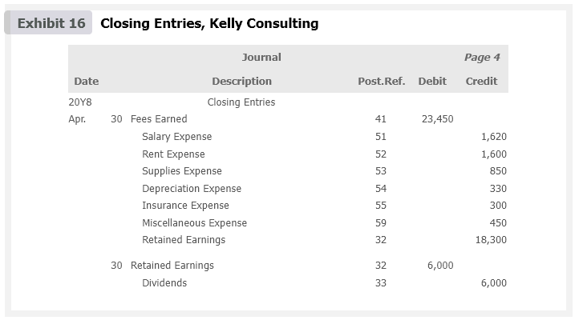

| Date | Description | Post. Ref. | Debit | Credit |
|------|-------------|------------|-------|--------|
| 20Y8 Apr. 30 | **Closing Entries** | | | |
| | Fees Earned | 41 | 23,450 | |
| | Salary Expense | 51 | | 1,620 |
| | Rent Expense | 52 | | 1,600 |
| | Supplies Expense | 53 | | 850 |
| | Depreciation Expense | 54 | | 330 |
| | Insurance Expense | 55 | | 300 |
| | Miscellaneous Expense | 59 | | 450 |
| | Retained Earnings | 32 | | 18,300 |
| | *Closing entry (1)* | | | |
| Apr. 30 | Retained Earnings | 32 | 6,000 | |
| | Dividends | 33 | | 6,000 |
| | *Closing entry (2)* | | | |

The closing entries are normally identified in the ledger as "Closing." In addition, a line is often inserted in both balance columns after a closing entry is posted. This separates next period's revenue, expense, and dividend transactions from those of the current period.

[Los asientos de cierre normalmente se identifican en el libro mayor como "Cierre". Además, a menudo se inserta una línea en ambas columnas de saldo después de que se traspasa un asiento de cierre. Esto separa las transacciones de ingresos, gastos y dividendos del próximo período de las del período actual.]

---

<h1 id="839184" style="color:#E65100;">
  <a href="#Chapter_004" style="color:inherit; text-decoration:none;">
    4-5j Step 10. Preparing a Post-Closing Trial Balance
  </a>
</h1>

A post-closing trial balance is prepared after the closing entries have been posted. The purpose of the post-closing trial balance is to verify that the ledger is in balance at the beginning of the next period. The accounts and amounts in the post-closing trial balance should agree exactly with the accounts and amounts listed on the balance sheet at the end of the period.

[Se prepara un balance de comprobación posterior al cierre después de que los asientos de cierre han sido traspasados. El propósito del balance de comprobación posterior al cierre es verificar que el libro mayor esté en equilibrio al comienzo del próximo período. Las cuentas y los montos en el balance de comprobación posterior al cierre deben concordar exactamente con las cuentas y los montos enumerados en el balance general al final del período.]

The post-closing trial balance for Kelly Consulting is shown in Exhibit 17. The balances shown in the post-closing trial balance are taken from the ending balances in the ledger shown in Exhibit 18. These balances agree with the amounts shown on Kelly Consulting's balance sheet in Exhibit 15.

[El balance de comprobación posterior al cierre para Kelly Consulting se muestra en la Figura 17. Los saldos mostrados en el balance de comprobación posterior al cierre se toman de los saldos finales en el libro mayor que se muestra en la Figura 18. Estos saldos concuerdan con los montos mostrados en el balance general de Kelly Consulting en la Figura 15.]

---

## Exhibit 17

### Post-Closing Trial Balance, Kelly Consulting

[**Figura 17** - Balance de Comprobación Posterior al Cierre, Kelly Consulting]

<!-- 📍 IMAGEN: Exhibit 17 - Post-Closing Trial Balance (página 1) -->

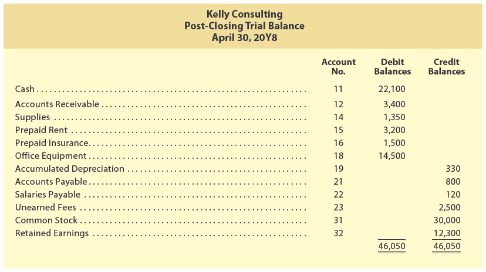

| | Kelly Consulting | | |
| | Post-Closing Trial Balance | | |
| | April 30, 20Y8 | | |
| Account No. | | Debit Balances | Credit Balances |
|-------------|---------------------|---------------|-----------------|
| 11 | Cash | 22,100 | |
| 12 | Accounts Receivable | 3,400 | |
| 14 | Supplies | 1,350 | |
| 15 | Prepaid Rent | 3,200 | |
| 16 | Prepaid Insurance | 1,500 | |
| 18 | Office Equipment | 14,500 | |
| 19 | Accumulated Depreciation | | 330 |
| 21 | Accounts Payable | | 800 |
| 22 | Salaries Payable | | 120 |
| 23 | Unearned Fees | | 2,500 |
| 31 | Common Stock | | 30,000 |
| 32 | Retained Earnings | | 12,300 |
| | **Totals** | **46,050** | **46,050** |

---

## Exhibit 18

### Ledger, Kelly Consulting

[**Figura 18** - Libro Mayor, Kelly Consulting]

<!-- 📍 IMAGEN: Exhibit 18 - Ledger (páginas 2-12) -->


#### Account Cash - Account No. 11

| Date | Item | Post. Ref. | Debit | Credit | Balance Debit | Balance Credit |
|------|------|------------|-------|--------|---------------|----------------|
| 20Y8 Apr. 1 | | 1 | 13,100 | | 13,100 | |
| Apr. 1 | | 1 | | 4,800 | 8,300 | |
| Apr. 2 | | 1 | | 1,800 | 6,500 | |
| Apr. 4 | | 1 | 5,000 | | 11,500 | |
| Apr. 6 | | 1 | 1,800 | | 13,300 | |
| Apr. 10 | | 1 | | 120 | 13,180 | |
| Apr. 12 | | 1 | | 1,200 | 11,980 | |
| Apr. 14 | | 1 | | 750 | 11,230 | |
| Apr. 17 | | 2 | 6,250 | | 17,480 | |
| Apr. 18 | | 2 | | 800 | 16,680 | |
| Apr. 24 | | 2 | 3,850 | | 20,530 | |
| Apr. 26 | | 2 | 5,600 | | 26,130 | |
| Apr. 27 | | 2 | | 750 | 25,380 | |
| Apr. 29 | | 2 | | 130 | 25,250 | |
| Apr. 30 | | 2 | | 200 | 25,050 | |
| Apr. 30 | | 2 | 3,050 | | 28,100 | |
| Apr. 30 | | 2 | | 6,000 | 22,100 | |


#### Account Accounts Receivable - Account No. 12

| Date | Item | Post. Ref. | Debit | Credit | Balance Debit | Balance Credit |
|------|------|------------|-------|--------|---------------|----------------|
| 20Y8 Apr. 1 | | 1 | 3,000 | | 3,000 | |
| Apr. 6 | | 1 | | 1,800 | 1,200 | |
| Apr. 12 | | 1 | 4,200 | | 5,400 | |
| Apr. 20 | | 2 | 2,100 | | 7,500 | |
| Apr. 26 | | 2 | | 5,600 | 1,900 | |
| Apr. 30 | | 2 | 1,500 | | 3,400 | |


#### Account Supplies - Account No. 14

| Date | Item | Post. Ref. | Debit | Credit | Balance Debit | Balance Credit |
|------|------|------------|-------|--------|---------------|----------------|
| 20Y8 Apr. 1 | | 1 | 1,400 | | 1,400 | |
| Apr. 18 | | 2 | 800 | | 2,200 | |
| Apr. 30 | Adjusting | 3 | | 850 | 1,350 | |


#### Account Prepaid Rent - Account No. 15

| Date | Item | Post. Ref. | Debit | Credit | Balance Debit | Balance Credit |
|------|------|------------|-------|--------|---------------|----------------|
| 20Y8 Apr. 1 | | 1 | 4,800 | | 4,800 | |
| Apr. 30 | Adjusting | 3 | | 1,600 | 3,200 | |


#### Account Prepaid Insurance - Account No. 16

| Date | Item | Post. Ref. | Debit | Credit | Balance Debit | Balance Credit |
|------|------|------------|-------|--------|---------------|----------------|
| 20Y8 Apr. 2 | | 1 | 1,800 | | 1,800 | |
| Apr. 30 | Adjusting | 3 | | 300 | 1,500 | |


#### Account Office Equipment - Account No. 18

| Date | Item | Post. Ref. | Debit | Credit | Balance Debit | Balance Credit |
|------|------|------------|-------|--------|---------------|----------------|
| 20Y8 Apr. 1 | | 1 | 12,500 | | 12,500 | |
| Apr. 5 | | 1 | 2,000 | | 14,500 | |


#### Account Accumulated Depreciation - Account No. 19

| Date | Item | Post. Ref. | Debit | Credit | Balance Debit | Balance Credit |
|------|------|------------|-------|--------|---------------|----------------|
| 20Y8 Apr. 30 | Adjusting | 3 | | 330 | | 330 |


#### Account Accounts Payable - Account No. 21

| Date | Item | Post. Ref. | Debit | Credit | Balance Debit | Balance Credit |
|------|------|------------|-------|--------|---------------|----------------|
| 20Y8 Apr. 5 | | 1 | | 2,000 | | 2,000 |
| Apr. 12 | | 1 | 1,200 | | | 800 |


#### Account Salaries Payable - Account No. 22

| Date | Item | Post. Ref. | Debit | Credit | Balance Debit | Balance Credit |
|------|------|------------|-------|--------|---------------|----------------|
| 20Y8 Apr. 30 | Adjusting | 3 | | 120 | | 120 |


#### Account Unearned Fees - Account No. 23

| Date | Item | Post. Ref. | Debit | Credit | Balance Debit | Balance Credit |
|------|------|------------|-------|--------|---------------|----------------|
| 20Y8 Apr. 4 | | 1 | | 5,000 | | 5,000 |
| Apr. 30 | Adjusting | 3 | 2,500 | | | 2,500 |


#### Account Common Stock - Account No. 31

| Date | Item | Post. Ref. | Debit | Credit | Balance Debit | Balance Credit |
|------|------|------------|-------|--------|---------------|----------------|
| 20Y8 Apr. 1 | | 1 | | 30,000 | | 30,000 |


#### Account Retained Earnings - Account No. 32

| Date | Item | Post. Ref. | Debit | Credit | Balance Debit | Balance Credit |
|------|------|------------|-------|--------|---------------|----------------|
| 20Y8 Apr. 1 | | | | | | 0 |
| Apr. 30 | Closing | 4 | | 18,300 | | 18,300 |
| Apr. 30 | Closing | 4 | 6,000 | | | 12,300 |


#### Account Dividends - Account No. 33

| Date | Item | Post. Ref. | Debit | Credit | Balance Debit | Balance Credit |
|------|------|------------|-------|--------|---------------|----------------|
| 20Y8 Apr. 30 | | 2 | 6,000 | | 6,000 | |
| Apr. 30 | Closing | 4 | | 6,000 | — | — |


#### Account Fees Earned - Account No. 41

| Date | Item | Post. Ref. | Debit | Credit | Balance Debit | Balance Credit |
|------|------|------------|-------|--------|---------------|----------------|
| 20Y8 Apr. 12 | | 1 | | 4,200 | | 4,200 |
| Apr. 17 | | 2 | | 6,250 | | 10,450 |
| Apr. 20 | | 2 | | 2,100 | | 12,550 |
| Apr. 24 | | 2 | | 3,850 | | 16,400 |
| Apr. 30 | | 2 | | 3,050 | | 19,450 |
| Apr. 30 | | 2 | | 1,500 | | 20,950 |
| Apr. 30 | Adjusting | 3 | | 2,500 | | 23,450 |
| Apr. 30 | Closing | 4 | 23,450 | | — | — |


#### Account Salary Expense - Account No. 51

| Date | Item | Post. Ref. | Debit | Credit | Balance Debit | Balance Credit |
|------|------|------------|-------|--------|---------------|----------------|
| 20Y8 Apr. 14 | | 1 | 750 | | 750 | |
| Apr. 27 | | 2 | 750 | | 1,500 | |
| Apr. 30 | Adjusting | 3 | 120 | | 1,620 | |
| Apr. 30 | Closing | 4 | | 1,620 | — | — |


#### Account Rent Expense - Account No. 52

| Date | Item | Post. Ref. | Debit | Credit | Balance Debit | Balance Credit |
|------|------|------------|-------|--------|---------------|----------------|
| 20Y8 Apr. 30 | Adjusting | 3 | 1,600 | | 1,600 | |
| Apr. 30 | Closing | 4 | | 1,600 | — | — |


#### Account Supplies Expense - Account No. 53

| Date | Item | Post. Ref. | Debit | Credit | Balance Debit | Balance Credit |
|------|------|------------|-------|--------|---------------|----------------|
| 20Y8 Apr. 30 | Adjusting | 3 | 850 | | 850 | |
| Apr. 30 | Closing | 4 | | 850 | — | — |


#### Account Depreciation Expense - Account No. 54

| Date | Item | Post. Ref. | Debit | Credit | Balance Debit | Balance Credit |
|------|------|------------|-------|--------|---------------|----------------|
| 20Y8 Apr. 30 | Adjusting | 3 | 330 | | 330 | |
| Apr. 30 | Closing | 4 | | 330 | — | — |


#### Account Insurance Expense - Account No. 55

| Date | Item | Post. Ref. | Debit | Credit | Balance Debit | Balance Credit |
|------|------|------------|-------|--------|---------------|----------------|
| 20Y8 Apr. 30 | Adjusting | 3 | 300 | | 300 | |
| Apr. 30 | Closing | 4 | | 300 | — | — |


#### Account Miscellaneous Expense - Account No. 59

| Date | Item | Post. Ref. | Debit | Credit | Balance Debit | Balance Credit |
|------|------|------------|-------|--------|---------------|----------------|
| 20Y8 Apr. 10 | | 1 | 120 | | 120 | |
| Apr. 29 | | 2 | 130 | | 250 | |
| Apr. 30 | | 2 | 200 | | 450 | |
| Apr. 30 | Closing | 4 | | 450 | — | — |


## Using Data Analytics

### Loading Data

[**Uso de Analítica de Datos - Cargando Datos**]

When a company uses data analytics to solve a problem, it must not only extract and transform data but also load the data into the software program that will be used for analysis. There are a variety of software programs that can be used for data analytics. For example, Excel™, Tableau™, and Alteryx™ can all be used to perform data analytics. Starting in the Take It Further section of Chapter 5, we include data analytic cases using Excel throughout this text.

[Cuando una empresa utiliza analítica de datos para resolver un problema, no solo debe extraer y transformar datos, sino también cargar los datos en el programa de software que se utilizará para el análisis. Hay una variedad de programas de software que se pueden usar para la analítica de datos. Por ejemplo, Excel™, Tableau™ y Alteryx™ se pueden usar para realizar analítica de datos. A partir de la sección Take It Further del Capítulo 5, incluimos casos de analítica de datos usando Excel a lo largo de este texto.]

The data analytic process of loading data is in some ways similar to the preparation of the adjusted trial balance, which was illustrated in Chapter 3 and in Exhibit 14. Once the adjusted trial balance is prepared (loaded), it becomes the basis for preparing financial statements as illustrated in Exhibit 15.

[El proceso analítico de datos de carga de datos es en cierto modo similar a la preparación del balance de comprobación ajustado, que se ilustró en el Capítulo 3 y en la Figura 14. Una vez que se prepara (carga) el balance de comprobación ajustado, se convierte en la base para preparar los estados financieros como se ilustra en la Figura 15.]

---

## Ejemplo

**“Preparing a Post-Closing Trial Balance”** en contabilidad significa:

> **Preparar una balanza de comprobación después de hacer los asientos de cierre**, para verificar que **solo quedaron abiertas las cuentas permanentes** y que **débitos = créditos**.

En el ciclo contable, ocurre **después de cerrar** ingresos, gastos y dividendos.

---

## ¿Qué se hace antes?

Primero haces **closing entries** (asientos de cierre).

Se cierran cuentas temporales:

* Revenues (Ingresos)
* Expenses (Gastos)
* Dividends (Dividendos)

Estas quedan en **0**.

Se transfieren a:

* Retained Earnings (Ganancias retenidas)

---

## ¿Qué queda después del cierre?

Solo quedan **Permanent Accounts**:

| Tipo                 | Cuenta              |
| -------------------- | ------------------- |
| Asset                | Cash                |
| Asset                | Accounts Receivable |
| Asset                | Equipment           |
| Liability            | Accounts Payable    |
| Stockholders’ Equity | Common Stock        |
| Stockholders’ Equity | Retained Earnings   |

---

## Ejemplo completo

### Antes del cierre

| Account             | Debit  | Credit | Type                |
| ------------------- | ------ | ------ | ------------------- |
| Cash                | 10,000 |        | Asset               |
| Accounts Receivable | 2,000  |        | Asset               |
| Equipment           | 5,000  |        | Asset               |
| Accounts Payable    |        | 1,500  | Liability           |
| Common Stock        |        | 10,000 | Stockholders Equity |
| Service Revenue     |        | 4,000  | Revenue (Temporary) |
| Salary Expense      | 1,200  |        | Expense (Temporary) |
| Dividends           | 500    |        | Temporary           |

---

## Closing Entries

### 1. Cerrar Revenue

```text id="mjlwm5"
Service Revenue        4,000
     Income Summary            4,000
```

---

### 2. Cerrar Expense

```text id="5v4jcu"
Income Summary        1,200
     Salary Expense            1,200
```

---

### 3. Pasar utilidad a Retained Earnings

Ganancia:

```text id="7kw8h9"
4,000 - 1,200 = 2,800
```

Asiento:

```text id="eznxk7"
Income Summary        2,800
     Retained Earnings         2,800
```

---

### 4. Cerrar Dividends

```text id="rdv8v6"
Retained Earnings       500
      Dividends                 500
```

---

## Ahora haces Post-Closing Trial Balance

Solo cuentas permanentes:

| Account             | Debit      | Credit     | Type                |
| ------------------- | ---------- | ---------- | ------------------- |
| Cash                | 10,000     |            | Asset               |
| Accounts Receivable | 2,000      |            | Asset               |
| Equipment           | 5,000      |            | Asset               |
| Accounts Payable    |            | 1,500      | Liability           |
| Common Stock        |            | 10,000     | Stockholders Equity |
| Retained Earnings   |            | 2,300      | Stockholders Equity |
| **Total**           | **17,000** | **17,000** |                     |

---

## Regla importante

**Nunca aparecen aquí:**

❌ Revenue
❌ Expenses
❌ Dividends
❌ Income Summary

Porque ya fueron cerradas.

---

### Resumen del ciclo

```text id="xnsy4s"
Journal Entries
↓
Adjusting Entries
↓
Adjusted Trial Balance
↓
Financial Statements
↓
Closing Entries
↓
Post-Closing Trial Balance
```

---

<h1 id="992322" style="color:#E65100;">
  <a href="#Chapter_004" style="color:inherit; text-decoration:none;">
    4-6 Why Is the Accrual Basis of Accounting Required by GAAP?
  </a>
</h1>


The accrual basis of accounting was used in this chapter and in Chapters 1, 2, and 3 to record the transactions and prepare the financial statements for NetSolutions and Kelly Consulting. Understanding why the accrual basis of accounting is required by generally accepted accounting principles (GAAP) is essential for your ability to analyze and evaluate financial statements.

[El método de acumulación (o devengo) se utilizó en este capítulo y en los Capítulos 1, 2 y 3 para registrar las transacciones y preparar los estados financieros de NetSolutions y Kelly Consulting. Comprender por qué el método de acumulación es requerido por los principios de contabilidad generalmente aceptados (GAAP) es esencial para su capacidad de analizar y evaluar los estados financieros.]

To understand why the accrual basis of accounting is required, it is first necessary to consider the alternative. The primary alternative to GAAP is the cash basis of accounting, which records transactions only when cash is received or paid. For example, revenue is recorded when cash is received from a customer regardless of when the services or goods have been provided or delivered. Likewise, expenses are recorded when the cash is paid regardless of when the related revenues are recorded. In other words, revenues and expenses are reported on the income statement in the period in which cash is received or paid.

[Para entender por qué se requiere el método de acumulación, primero es necesario considerar la alternativa. La principal alternativa a los GAAP es el método de efectivo, que registra las transacciones solo cuando se recibe o paga efectivo. Por ejemplo, los ingresos se registran cuando se recibe efectivo de un cliente, independientemente de cuándo se hayan proporcionado o entregado los servicios o bienes. Del mismo modo, los gastos se registran cuando se paga el efectivo, independientemente de cuándo se registren los ingresos relacionados. En otras palabras, los ingresos y gastos se reportan en el estado de resultados en el período en que se recibe o paga el efectivo.]

In contrast, the accrual basis of accounting uses the revenue and expense recognition principles to record revenues and expenses. Under the revenue recognition principle, revenues are recorded when earned, which is when the services have been performed or products have been delivered to customers. Under the expense recognition principle, the expenses incurred in generating revenue are recorded in the same period as the related revenue. To ensure that revenues and expenses are properly matched, adjusting entries are recorded at the end of the accounting period.

[En contraste, el método de acumulación utiliza los principios de reconocimiento de ingresos y gastos para registrar los ingresos y gastos. Bajo el principio de reconocimiento de ingresos, los ingresos se registran cuando se ganan, es decir, cuando se han realizado los servicios o se han entregado los productos a los clientes. Bajo el principio de reconocimiento de gastos, los gastos incurridos para generar ingresos se registran en el mismo período que los ingresos relacionados. Para asegurar que los ingresos y gastos se correspondan adecuadamente, los asientos de ajuste se registran al final del período contable.]

To illustrate, the November and December income statements for NetSolutions under the accrual and the cash bases are shown in Exhibit 19.

[Para ilustrar, los estados de resultados de noviembre y diciembre de NetSolutions bajo los métodos de acumulación y de efectivo se muestran en la Figura 19.]

---

## Exhibit 19

### Accrual- and Cash-Basis Income Statements for NetSolutions

[**Figura 19** - Estados de Resultados bajo los Métodos de Acumulación y de Efectivo para NetSolutions]

<!-- 📍 IMAGEN: Exhibit 19 - Accrual- and Cash-Basis Income Statements (páginas 1-3) -->

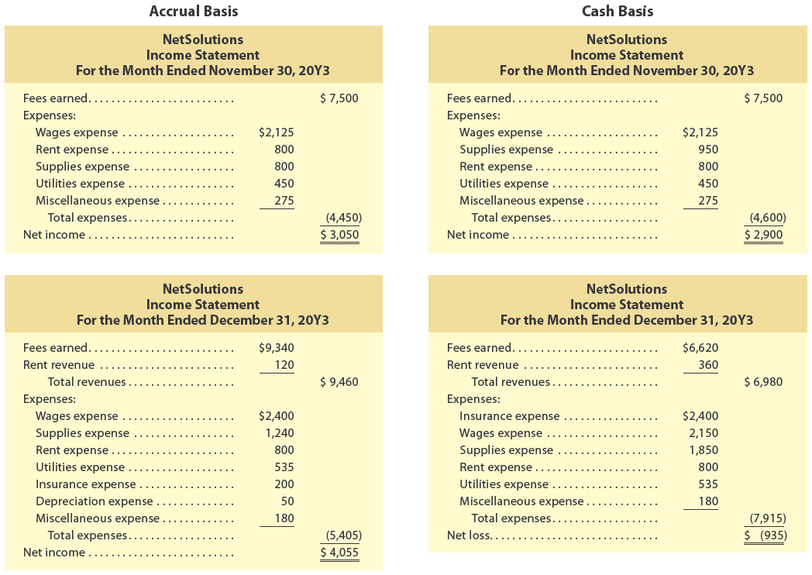

# Accrual Basis

## NetSolutions  
### Income Statement  
#### For the Month Ended November 30, 20Y3  

| | Amount | Total |
|---|---|---|
| **Revenues:** | | |
| Fees earned | $7,500 | |
| **Total revenues** | | **$7,500** |
| **Expenses:** | | |
| Wages expense | $2,125 | |
| Rent expense | 800 | |
| Supplies expense | 800 | |
| Utilities expense | 450 | |
| Miscellaneous expense | 275 | |
| **Total expenses** | | **$4,450** |
| **Net income** | | **$3,050** |

---

# Cash Basis

## NetSolutions  
### Income Statement  
#### For the Month Ended November 30, 20Y3  

| | Amount | Total |
|---|---|---|
| **Revenues:** | | |
| Fees earned | $7,500 | |
| **Total revenues** | | **$7,500** |
| **Expenses:** | | |
| Wages expense | $2,125 | |
| Supplies expense | 950 | |
| Rent expense | 800 | |
| Utilities expense | 450 | |
| Miscellaneous expense | 275 | |
| **Total expenses** | | **$4,600** |
| **Net income** | | **$2,900** |

---

# Accrual Basis

## NetSolutions  
### Income Statement  
#### For the Month Ended December 31, 20Y3  

| | Amount | Total |
|---|---|---|
| **Revenues:** | | |
| Fees earned | $9,340 | |
| Rent revenue | 120 | |
| **Total revenues** | | **$9,460** |
| **Expenses:** | | |
| Wages expense | $2,400 | |
| Supplies expense | 1,240 | |
| Rent expense | 800 | |
| Utilities expense | 535 | |
| Insurance expense | 200 | |
| Depreciation expense | 50 | |
| Miscellaneous expense | 180 | |
| **Total expenses** | | **$5,405** |
| **Net income** | | **$4,055** |

---

# Cash Basis

## NetSolutions  
### Income Statement  
#### For the Month Ended December 31, 20Y3  

| | Amount | Total |
|---|---|---|
| **Revenues:** | | |
| Fees earned | $6,620 | |
| Rent revenue | 360 | |
| **Total revenues** | | **$6,980** |
| **Expenses:** | | |
| Wages expense | $2,400 | |
| Insurance expense | 2,150 | |
| Supplies expense | 1,850 | |
| Rent expense | 800 | |
| Utilities expense | 535 | |
| Miscellaneous expense | 180 | |
| **Total expenses** | | **$7,915** |
| **Net loss** | | **($7,935)** |

*Note: The cash-basis income statement includes only those revenues and expenses that involve actual cash receipts and payments during the period.*

[*Nota: El estado de resultados bajo el método de efectivo incluye solo aquellos ingresos y gastos que implican recibos y pagos de efectivo reales durante el período.*]

The November income statements are similar with net income of $3,050 and $2,900 for the accrual and cash bases, respectively. This similarity exists because NetSolutions had only one accrual accounting transaction in November, which was the November 10 purchase of supplies on account.

[Los estados de resultados de noviembre son similares con un ingreso neto de $3,050 y $2,900 para los métodos de acumulación y de efectivo, respectivamente. Esta similitud existe porque NetSolutions tuvo solo una transacción de contabilidad de acumulación en noviembre, que fue la compra de suministros a crédito del 10 de noviembre.]

In December, NetSolutions had a variety of accrual transactions. As a result, the December accrual net income is $4,055 compared to a net loss of $(935) under the cash basis. Which of the two December income statements better reflects the operating performance of NetSolutions? To answer this question, the November and December operating results for NetSolutions are summarized in Exhibit 20.

[En diciembre, NetSolutions tuvo una variedad de transacciones de acumulación. Como resultado, el ingreso neto de diciembre bajo el método de acumulación es de $4,055 en comparación con una pérdida neta de $(935) bajo el método de efectivo. ¿Cuál de los dos estados de resultados de diciembre refleja mejor el rendimiento operativo de NetSolutions? Para responder a esta pregunta, los resultados operativos de noviembre y diciembre de NetSolutions se resumen en la Figura 20.]

---

## Exhibit 20

### Accrual versus Cash Basis of Accounting for NetSolutions

[**Figura 20** - Método de Acumulación versus Método de Efectivo para NetSolutions]

<!-- 📍 IMAGEN: Exhibit 20 - Accrual versus Cash Basis (página 4) -->

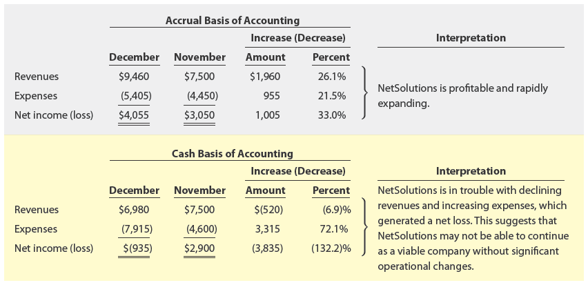

## Exhibit 20

### Accrual versus Cash Basis of Accounting for NetSolutions

[**Figura 20** - Método de Acumulación versus Método de Efectivo para NetSolutions]

---

#### Accrual Basis of Accounting

| | December | November | Increase (Decrease) | Percent |
|---|---|---|---|---|
| | | | Amount | |
| Revenues | $9,460 | $7,500 | $1,960 | 26.1% |
| Expenses | (5,405) | (4,450) | 955 | 21.5% |
| **Net income** | **$4,055** | **$3,050** | **$1,005** | **33.0%** |

---

#### Cash Basis of Accounting

| | December | November | Increase (Decrease) | Percent |
|---|---|---|---|---|
| | | | Amount | |
| Revenues | $6,980 | $7,500 | $(520) | (6.9%) |
| Expenses | (7,915) | (4,600) | 3,315 | 72.1% |
| **Net income (loss)** | **$(935)** | **$2,900** | **$(3,835)** | **(132.2%)** |

---

#### Interpretation

[**Interpretación**]

**Accrual Basis:** NetSolutions is profitable and rapidly expanding.

[**Método de Acumulación:** NetSolutions es rentable y se está expandiendo rápidamente.]

**Cash Basis:** NetSolutions is in trouble with declining revenues and increasing expenses, which generated a net loss. This suggests that NetSolutions may not be able to continue as a viable company without significant operational changes.

[**Método de Efectivo:** NetSolutions está en problemas con ingresos decrecientes y gastos crecientes, lo que generó una pérdida neta. Esto sugiere que NetSolutions puede no ser capaz de continuar como una empresa viable sin cambios operativos significativos.]

---

### Analysis

[**Análisis**]

Under the accrual basis of accounting, revenues increased by 26.1% in December, while expenses increased by only 21.5%. As a result, net income increased by 33.0%. These results suggest that NetSolutions is a profitable, rapidly expanding company.

[Bajo el método de acumulación, los ingresos aumentaron un 26.1% en diciembre, mientras que los gastos aumentaron solo un 21.5%. Como resultado, el ingreso neto aumentó un 33.0%. Estos resultados sugieren que NetSolutions es una empresa rentable y en rápida expansión.]

Under the cash basis of accounting, revenues decreased by (6.9)%, while expenses increased by 72.1%. As a result, NetSolutions reported a net loss of $(935) or a decrease of (132.2)% from November's net income of $2,900. These results suggest that NetSolutions is in trouble and may not be able to continue as a viable company.

[Bajo el método de efectivo, los ingresos disminuyeron un (6.9)%, mientras que los gastos aumentaron un 72.1%. Como resultado, NetSolutions reportó una pérdida neta de $(935) o una disminución del (132.2)% con respecto al ingreso neto de noviembre de $2,900. Estos resultados sugieren que NetSolutions está en problemas y puede no ser capaz de continuar como una empresa viable.]

As shown in Exhibit 20, accrual accounting better reports the underlying operating performance of NetSolutions. It does this by better matching revenues and expenses. This is why accrual accounting is required by generally accepted accounting principles (GAAP).

[Como se muestra en la Figura 20, el método de acumulación reporta mejor el rendimiento operativo subyacente de NetSolutions. Lo hace mediante una mejor correspondencia de ingresos y gastos. Esta es la razón por la cual el método de acumulación es requerido por los principios de contabilidad generalmente aceptados (GAAP).]


---

### Working Capital and Current Ratio

[**Capital de Trabajo y Razón Corriente**]

**Working capital** (The excess of the current assets of a business over its current liabilities.) is defined as:

[**Capital de trabajo** (El exceso de los activos corrientes de un negocio sobre sus pasivos corrientes.) se define como:]

$$
\text{Working Capital} = \text{Current Assets} - \text{Current Liabilities}
$$

$$
\text{Capital de Trabajo} = \text{Activos Corrientes} - \text{Pasivos Corrientes}
$$

Current assets are more liquid than long-term assets, because they can be more readily turned into cash to meet short-term obligations. Thus, an increase in a company's current assets increases or improves its liquidity because these assets are available for uses other than paying current liabilities.

[Los activos corrientes son más líquidos que los activos a largo plazo, porque pueden convertirse más fácilmente en efectivo para cumplir con las obligaciones a corto plazo. Por lo tanto, un aumento en los activos corrientes de una empresa aumenta o mejora su liquidez porque estos activos están disponibles para usos distintos al pago de pasivos corrientes.]

A positive working capital implies that the business is able to pay its current liabilities and is solvent. Thus, an increase in working capital increases or improves a company's short-term solvency.

[Un capital de trabajo positivo implica que el negocio puede pagar sus pasivos corrientes y es solvente. Por lo tanto, un aumento en el capital de trabajo aumenta o mejora la solvencia a corto plazo de una empresa.]

To illustrate, NetSolutions' working capital at the end of 20Y3 is $6,355, computed as follows from Exhibit 1:

[Para ilustrar, el capital de trabajo de NetSolutions al final de 20Y3 es de $6,355, calculado de la siguiente manera a partir de la Figura 1:]

$$
\text{Working Capital} = \text{Current Assets} - \text{Current Liabilities}
$$

$$
\text{Capital de Trabajo} = \text{Activos Corrientes} - \text{Pasivos Corrientes}
$$

$$
= \$7,745 - \$1,390
$$

$$
= \$6,355
$$

This amount of working capital implies that NetSolutions is able to pay its current liabilities.

[Este monto de capital de trabajo implica que NetSolutions puede pagar sus pasivos corrientes.]

The **current ratio** (A financial ratio that expresses the relationship between current assets and current liabilities, computed by dividing current assets by current liabilities.) is another means of expressing the relationship between current assets and current liabilities. The current ratio is computed by dividing current assets by current liabilities:

[La **razón corriente** (un ratio financiero que expresa la relación entre los activos corrientes y los pasivos corrientes, calculado dividiendo los activos corrientes entre los pasivos corrientes) es otro medio de expresar la relación entre los activos corrientes y los pasivos corrientes. La razón corriente se calcula dividiendo los activos corrientes entre los pasivos corrientes:]

$$
\text{Current Ratio} = \frac{\text{Current Assets}}{\text{Current Liabilities}}
$$

$$
\text{Razón Corriente} = \frac{\text{Activos Corrientes}}{\text{Pasivos Corrientes}}
$$

To illustrate, the current ratio for NetSolutions on December 31, 20Y3 is 5.6, computed as follows:

[Para ilustrar, la razón corriente para NetSolutions al 31 de diciembre de 20Y3 es de 5.6, calculada de la siguiente manera:]

$$
\text{Current Ratio} = \frac{\text{Current Assets}}{\text{Current Liabilities}}
$$

$$
\text{Razón Corriente} = \frac{\$7,745}{\$1,390}
$$

$$
= 5.57
$$

The current ratio is more useful than working capital in making comparisons across companies or with industry averages.

[La razón corriente es más útil que el capital de trabajo para hacer comparaciones entre empresas o con promedios de la industria.]

---

## Make a Decision

### Working Capital and Current Ratio

[**Tome una Decisión - Capital de Trabajo y Razón Corriente**]

- Analyze and compare Amazon.com to Best Buy (MAD 4-1) (Continuing company analysis)
- Analyze and compare Zynga, Electronic Arts, and Take-Two (MAD 4-2)
- Analyze and compare Foot Locker and Dick's Sporting Goods (MAD 4-3)
- Analyze Under Armour (MAD 4-4)
- Analyze Caterpillar Inc. (MAD 4-5)
- Analyze and compare Alphabet (Google) and Microsoft (MAD 4-6)

---

<h1 id="509305" style="color:#E65100;">
  <a href="#Chapter_004" style="color:inherit; text-decoration:none;">
    4-7 Appendix 1 End-of-Period Spreadsheet
  </a>
</h1>

# 4-7 Appendix 1 End-of-Period Spreadsheet

Accountants often use spreadsheets for analyzing and summarizing data. Such spreadsheets are not a formal part of the accounting records. This is in contrast to the chart of accounts, the journal, and the ledger, which are essential parts of an accounting system. Spreadsheets are usually prepared by using a computer program such as Microsoft's Excel.

[Los contadores suelen utilizar hojas de cálculo para analizar y resumir datos. Estas hojas de cálculo no son una parte formal de los registros contables. Esto contrasta con el catálogo de cuentas, el diario y el libro mayor, que son partes esenciales de un sistema contable. Las hojas de cálculo generalmente se preparan utilizando un programa de computadora como Microsoft Excel.]

**Objective 8** - Describe and illustrate the end-of-period spreadsheet.

[**Objetivo 8** - Describir e ilustrar la hoja de cálculo de fin de período.]

As illustrated earlier in this chapter, an end-of-period spreadsheet is used to summarize adjusting entries and their effects on the accounts. As illustrated in the chapter, the financial statements for NetSolutions can be prepared directly from the spreadsheet's Adjusted Trial Balance columns shown in Exhibit 1.

[Como se ilustró anteriormente en este capítulo, una hoja de cálculo de fin de período se utiliza para resumir los asientos de ajuste y sus efectos en las cuentas. Como se ilustró en el capítulo, los estados financieros para NetSolutions se pueden preparar directamente a partir de las columnas del Balance de Comprobación Ajustado de la hoja de cálculo que se muestran en la Figura 1.]

## Exhibit 1
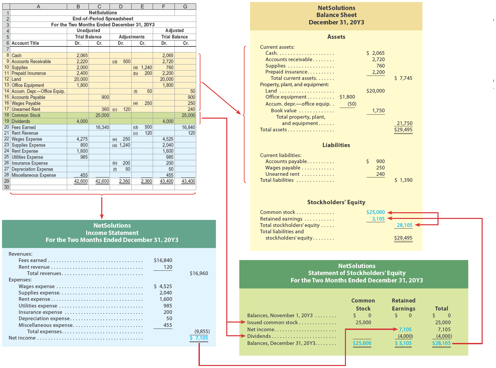</img>

Some accountants prefer to expand the end-of-period spreadsheet shown in Exhibit 1 to include financial statement columns. Exhibits 21, 22, 23, 24, and 25 illustrate the step-by-step process of how to prepare this spreadsheet. As a basis for illustration, NetSolutions is used.

[Algunos contadores prefieren expandir la hoja de cálculo de fin de período que se muestra en la Figura 1 para incluir columnas de estados financieros. Las Figuras 21, 22, 23, 24 y 25 ilustran el proceso paso a paso de cómo preparar esta hoja de cálculo. Como base para la ilustración, se utiliza NetSolutions.]

## Exhibit 21

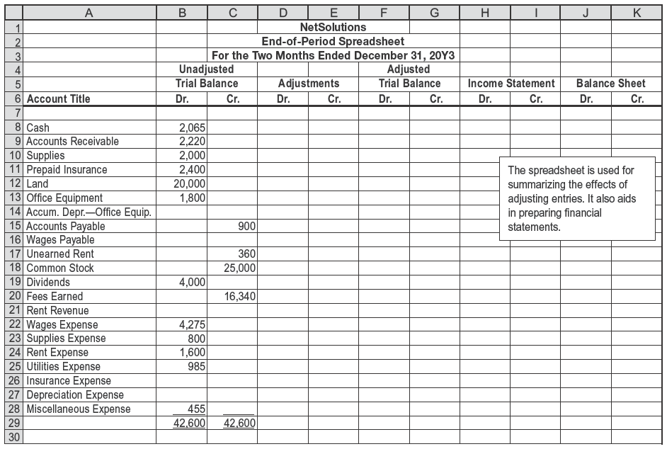</img>

## Exhibit 22

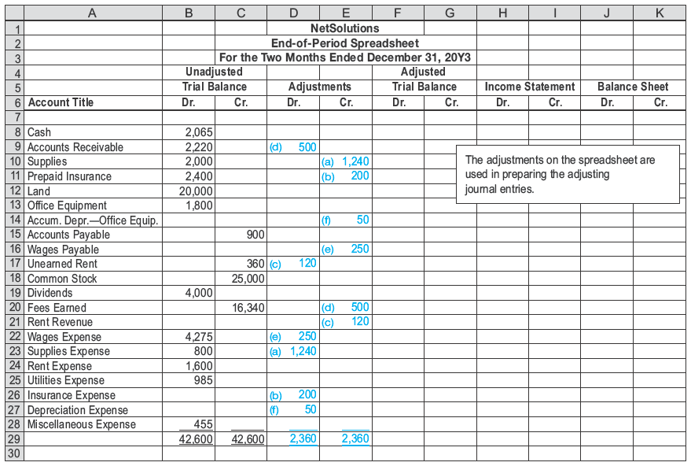</img>

## Exhibit 23

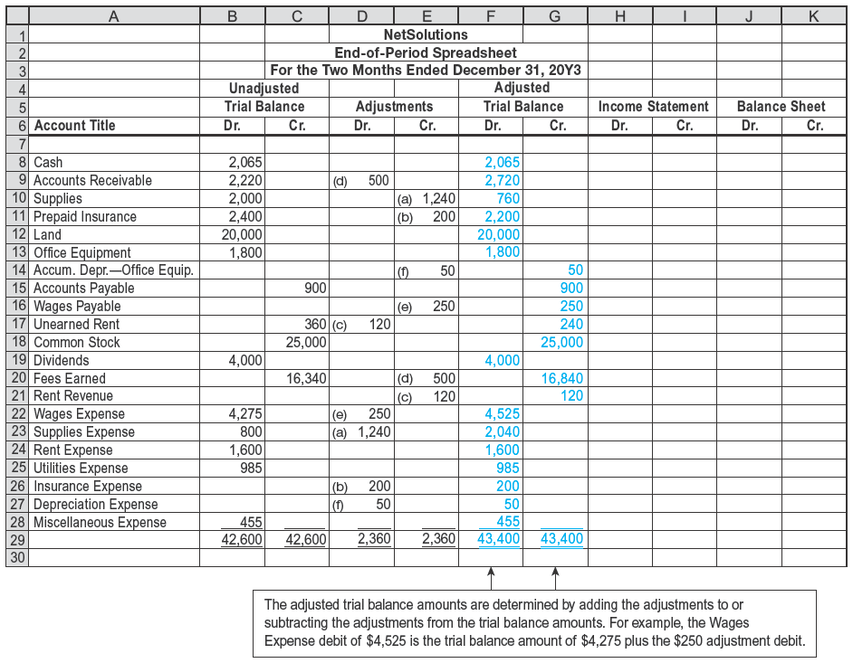</img>

## Exhibit 24

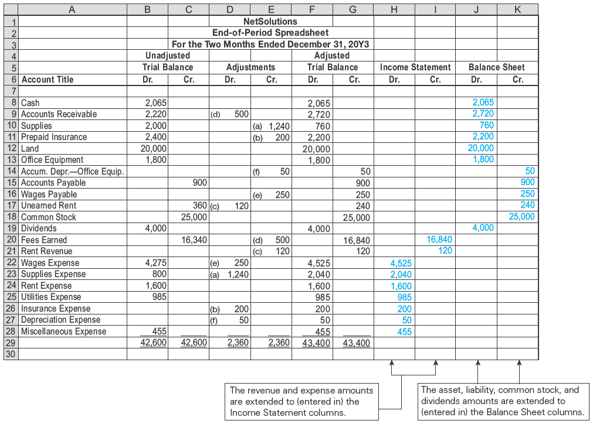</img>

## Exhibit 25

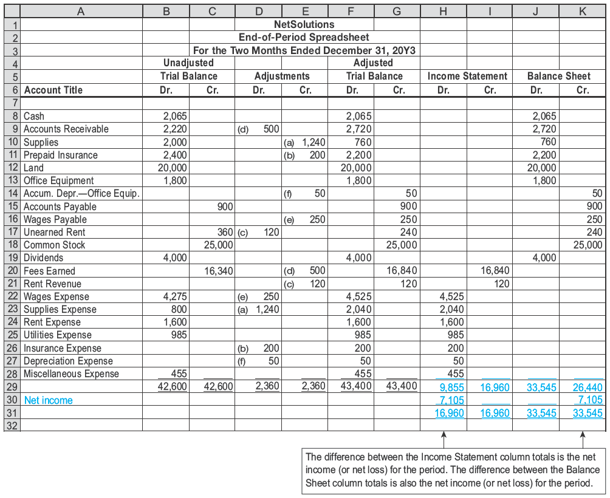</img>

---

<h1 id="873627" style="color:#E65100;">
  <a href="#Chapter_004" style="color:inherit; text-decoration:none;">
    4-7a Step 1. Enter the Title
  </a>
</h1>

The spreadsheet is started by entering the following data:

[La hoja de cálculo se inicia ingresando los siguientes datos:]

1. Name of the business: NetSolutions  
   Nombre del negocio: NetSolutions  

2. Type of spreadsheet: End-of-Period Spreadsheet  
   Tipo de hoja de cálculo: Hoja de Cálculo de Fin de Período  

3. The period of time: For the Two Months Ended December 31, 20Y3  
   Período de tiempo: Para los Dos Meses Terminados el 31 de Diciembre de 20Y3  

Exhibit 21 shows the preceding data entered for NetSolutions.

[La Figura 21 muestra los datos anteriores ingresados para NetSolutions.]

---

## Exhibit 21

### Spreadsheet with Unadjusted Trial Balance Entered

[**Figura 21** - Hoja de Cálculo con Balance de Comprobación No Ajustado Ingresado]

<!-- 📍 IMAGEN: Exhibit 21 - Spreadsheet with Unadjusted Trial Balance (página 1) -->


| | | | NetSolutions | | | | | |
|---|---|---|---|---|---|---|---|---|
| | | | End-of-Period Spreadsheet | | | | | |
| | | | For the Two Months Ended December 31, 20Y3 | | | | | |
| | | | Unadjusted | | | | | |
| | | | Trial Balance | | | | | |
| | Account Title | | Dr. | Cr. | | | | |
| | Cash | | 2,065 | | | | | |
| | Accounts Receivable | | 2,220 | | | | | |
| | Supplies | | 2,000 | | | | | |
| | Prepaid Insurance | | 2,400 | | | | | |
| | Land | | 20,000 | | | | | |
| | Office Equipment | | 1,800 | | | | | |
| | Accum. Depr.—Office Equip. | | | | | | | |
| | Accounts Payable | | | 900 | | | | |
| | Wages Payable | | | | | | | |
| | Unearned Rent | | | 360 | | | | |
| | Common Stock | | | 25,000 | | | | |
| | Dividends | | 4,000 | | | | | |
| | Fees Earned | | | 16,340 | | | | |
| | Rent Revenue | | | | | | | |
| | Wages Expense | | 4,275 | | | | | |
| | Supplies Expense | | 800 | | | | | |
| | Rent Expense | | 1,600 | | | | | |
| | Utilities Expense | | 985 | | | | | |
| | Insurance Expense | | | | | | | |
| | Depreciation Expense | | | | | | | |
| | Miscellaneous Expense | | 455 | | | | | |
| | | | **42,600** | **42,600** | | | | |

---

<h1 id="177279" style="color:#E65100;">
  <a href="#Chapter_004" style="color:inherit; text-decoration:none;">
    4-7b Step 2. Enter the Unadjusted Trial Balance
  </a>
</h1>


Enter the unadjusted trial balance on the spreadsheet. The spreadsheet in Exhibit 21 shows the unadjusted trial balance for NetSolutions at December 31, 20Y3.

[Ingrese el balance de comprobación no ajustado en la hoja de cálculo. La hoja de cálculo en la Figura 21 muestra el balance de comprobación no ajustado para NetSolutions al 31 de diciembre de 20Y3.]


## Exhibit 21
</img>
---

<h1 id="926532" style="color:#E65100;">
  <a href="#Chapter_004" style="color:inherit; text-decoration:none;">
    4-7c Step 3. Enter the Adjustments
  </a>
</h1>

# 4-7c Step 3. Enter the Adjustments

The adjustments for NetSolutions from Chapter 3 are entered in the Adjustments columns, as shown in Exhibit 22. Cross-referencing (by letters) the debit and credit of each adjustment is useful in reviewing the spreadsheet. It is also helpful for identifying the adjusting entries that need to be recorded in the journal. This cross-referencing process is sometimes referred to as keying the adjustments.

[Los ajustes para NetSolutions del Capítulo 3 se ingresan en las columnas de Ajustes, como se muestra en la Figura 22. La referencia cruzada (mediante letras) del débito y crédito de cada ajuste es útil para revisar la hoja de cálculo. También es útil para identificar los asientos de ajuste que deben registrarse en el diario. Este proceso de referencia cruzada a veces se denomina codificación de los ajustes.]

---

## Exhibit 22

### Spreadsheet with Unadjusted Trial Balance and Adjustments

[**Figura 22** - Hoja de Cálculo con Balance de Comprobación No Ajustado y Ajustes]

<!-- 📍 IMAGEN: Exhibit 22 - Spreadsheet with Unadjusted Trial Balance and Adjustments (páginas 1-2) -->


| | | | NetSolutions | | | | | |
|---|---|---|---|---|---|---|---|---|
| | | | End-of-Period Spreadsheet | | | | | |
| | | | For the Two Months Ended December 31, 20Y3 | | | | | |
| | | | Unadjusted | | Adjustments | | | |
| | | | Trial Balance | | | | | |
| | Account Title | | Dr. | Cr. | Dr. | Cr. | | |
| | Cash | | 2,065 | | | | | |
| | Accounts Receivable | | 2,220 | | (d) 500 | | | |
| | Supplies | | 2,000 | | | (a) 1,240 | | |
| | Prepaid Insurance | | 2,400 | | | (b) 200 | | |
| | Land | | 20,000 | | | | | |
| | Office Equipment | | 1,800 | | | | | |
| | Accum. Depr.—Office Equip. | | | | | (f) 50 | | |
| | Accounts Payable | | | 900 | | | | |
| | Wages Payable | | | | | (e) 250 | | |
| | Unearned Rent | | | 360 | (c) 120 | | | |
| | Common Stock | | | 25,000 | | | | |
| | Dividends | | 4,000 | | | | | |
| | Fees Earned | | | 16,340 | | (d) 500 | | |
| | Rent Revenue | | | | | (c) 120 | | |
| | Wages Expense | | 4,275 | | (e) 250 | | | |
| | Supplies Expense | | 800 | | (a) 1,240 | | | |
| | Rent Expense | | 1,600 | | | | | |
| | Utilities Expense | | 985 | | | | | |
| | Insurance Expense | | | | (b) 200 | | | |
| | Depreciation Expense | | | | (f) 50 | | | |
| | Miscellaneous Expense | | 455 | | | | | |
| | | | **42,600** | **42,600** | **2,360** | **2,360** | | |

---

### Explanation of Adjustments

[**Explicación de los Ajustes**]

**(a) Supplies.** The supplies account has a debit balance of $2,000. The cost of the supplies on hand at the end of the period is $760. The supplies expense for December is the difference between the two amounts, or $1,240 ($2,000 - $760). The adjustment is entered as (1) $1,240 in the Adjustments Debit column on the same line as Supplies Expense and (2) $1,240 in the Adjustments Credit column on the same line as Supplies.

[**(a) Suministros.** La cuenta de suministros tiene un saldo deudor de $2,000. El costo de los suministros disponibles al final del período es de $760. El gasto de suministros para diciembre es la diferencia entre los dos montos, o $1,240 ($2,000 - $760). El ajuste se ingresa como (1) $1,240 en la columna Débito de Ajustes en la misma línea que Gasto de Suministros y (2) $1,240 en la columna Crédito de Ajustes en la misma línea que Suministros.]

**(b) Prepaid Insurance.** The prepaid insurance account has a debit balance of $2,400. This balance represents the prepayment of insurance for 12 months beginning December 1. Thus, the insurance expense for December is $200 ($2,400 ÷ 12). The adjustment is entered as (1) $200 in the Adjustments Debit column on the same line as Insurance Expense and (2) $200 in the Adjustments Credit column on the same line as Prepaid Insurance.

[**(b) Seguro Pagado por Adelantado.** La cuenta de seguro pagado por adelantado tiene un saldo deudor de $2,400. Este saldo representa el pago anticipado de seguro por 12 meses a partir del 1 de diciembre. Por lo tanto, el gasto de seguro para diciembre es de $200 ($2,400 ÷ 12). El ajuste se ingresa como (1) $200 en la columna Débito de Ajustes en la misma línea que Gasto de Seguro y (2) $200 en la columna Crédito de Ajustes en la misma línea que Seguro Pagado por Adelantado.]

**(c) Unearned Rent.** The unearned rent account has a credit balance of $360. This balance represents the receipt of three months' rent, beginning with December. Thus, the rent revenue for December is $120 ($360 ÷ 3). The adjustment is entered as (1) $120 in the Adjustments Debit column on the same line as Unearned Rent and (2) $120 in the Adjustments Credit column on the same line as Rent Revenue.

[**(c) Renta No Devengada.** La cuenta de renta no devengada tiene un saldo acreedor de $360. Este saldo representa la recepción de tres meses de renta, comenzando con diciembre. Por lo tanto, el ingreso por renta para diciembre es de $120 ($360 ÷ 3). El ajuste se ingresa como (1) $120 en la columna Débito de Ajustes en la misma línea que Renta No Devengada y (2) $120 en la columna Crédito de Ajustes en la misma línea que Ingresos por Renta.]

**(d) Accrued Fees.** Fees accrued at the end of December but not recorded total $500. This amount is an increase in an asset and an increase in revenue. The adjustment is entered as (1) $500 in the Adjustments Debit column on the same line as Accounts Receivable and (2) $500 in the Adjustments Credit column on the same line as Fees Earned.

[**(d) Honorarios Devengados.** Los honorarios devengados al final de diciembre pero no registrados totalizan $500. Este monto es un aumento en un activo y un aumento en los ingresos. El ajuste se ingresa como (1) $500 en la columna Débito de Ajustes en la misma línea que Cuentas por Cobrar y (2) $500 en la columna Crédito de Ajustes en la misma línea que Ingresos por Servicios.]

**(e) Wages.** Wages accrued but not paid at the end of December total $250. This amount is an increase in expenses and an increase in liabilities. The adjustment is entered as (1) $250 in the Adjustments Debit column on the same line as Wages Expense and (2) $250 in the Adjustments Credit column on the same line as Wages Payable.

[**(e) Sueldos.** Los sueldos devengados pero no pagados al final de diciembre totalizan $250. Este monto es un aumento en los gastos y un aumento en los pasivos. El ajuste se ingresa como (1) $250 en la columna Débito de Ajustes en la misma línea que Gasto de Sueldos y (2) $250 en la columna Crédito de Ajustes en la misma línea que Sueldos por Pagar.]

**(f) Depreciation.** Depreciation of the office equipment is $50 for December. The adjustment is entered as (1) $50 in the Adjustments Debit column on the same line as Depreciation Expense and (2) $50 in the Adjustments Credit column on the same line as Accumulated Depreciation—Office Equipment.

[**(f) Depreciación.** La depreciación del equipo de oficina es de $50 para diciembre. El ajuste se ingresa como (1) $50 en la columna Débito de Ajustes en la misma línea que Gasto de Depreciación y (2) $50 en la columna Crédito de Ajustes en la misma línea que Depreciación Acumulada—Equipo de Oficina.]

After the adjustments have been entered, the Adjustments columns are totaled to verify the equality of the debits and credits. The total of the Debit column must equal the total of the Credit column.

[Después de que se han ingresado los ajustes, las columnas de Ajustes se totalizan para verificar la igualdad de los débitos y créditos. El total de la columna Débito debe ser igual al total de la columna Crédito.]

---

<h1 id="491924" style="color:#E65100;">
  <a href="#Chapter_004" style="color:inherit; text-decoration:none;">
    4-7d Step 4. Enter the Adjusted Trial Balance
  </a>
</h1>

The adjusted trial balance is entered by combining the adjustments with the unadjusted balances for each account. The adjusted amounts are then extended to the Adjusted Trial Balance columns, as shown in Exhibit 23.

[El balance de comprobación ajustado se ingresa combinando los ajustes con los saldos no ajustados para cada cuenta. Los montos ajustados luego se extienden a las columnas del Balance de Comprobación Ajustado, como se muestra en la Figura 23.]

---

## Exhibit 23

### Spreadsheet with Unadjusted Trial Balance, Adjustments, and Adjusted Trial Balance Entered

[**Figura 23** - Hoja de Cálculo con Balance de Comprobación No Ajustado, Ajustes y Balance de Comprobación Ajustado Ingresados]

<!-- 📍 IMAGEN: Exhibit 23 - Spreadsheet with Unadjusted Trial Balance, Adjustments, and Adjusted Trial Balance (páginas 1-2) -->


| | | | NetSolutions | | | | | | |
|---|---|---|---|---|---|---|---|---|---|
| | | | End-of-Period Spreadsheet | | | | | | |
| | | | For the Two Months Ended December 31, 20Y3 | | | | | | |
| | | | Unadjusted | | Adjustments | | Adjusted | | |
| | | | Trial Balance | | | | Trial Balance | | |
| | Account Title | | Dr. | Cr. | Dr. | Cr. | Dr. | Cr. | |
| | Cash | | 2,065 | | | | 2,065 | | |
| | Accounts Receivable | | 2,220 | | (d) 500 | | 2,720 | | |
| | Supplies | | 2,000 | | | (a) 1,240 | 760 | | |
| | Prepaid Insurance | | 2,400 | | | (b) 200 | 2,200 | | |
| | Land | | 20,000 | | | | 20,000 | | |
| | Office Equipment | | 1,800 | | | | 1,800 | | |
| | Accum. Depr.—Office Equip. | | | | | (f) 50 | | 50 | |
| | Accounts Payable | | | 900 | | | | 900 | |
| | Wages Payable | | | | | (e) 250 | | 250 | |
| | Unearned Rent | | | 360 | (c) 120 | | | 240 | |
| | Common Stock | | | 25,000 | | | | 25,000 | |
| | Dividends | | 4,000 | | | | 4,000 | | |
| | Fees Earned | | | 16,340 | | (d) 500 | | 16,840 | |
| | Rent Revenue | | | | | (c) 120 | | 120 | |
| | Wages Expense | | 4,275 | | (e) 250 | | 4,525 | | |
| | Supplies Expense | | 800 | | (a) 1,240 | | 2,040 | | |
| | Rent Expense | | 1,600 | | | | 1,600 | | |
| | Utilities Expense | | 985 | | | | 985 | | |
| | Insurance Expense | | | | (b) 200 | | 200 | | |
| | Depreciation Expense | | | | (f) 50 | | 50 | | |
| | Miscellaneous Expense | | 455 | | | | 455 | | |
| | | | **42,600** | **42,600** | **2,360** | **2,360** | **43,400** | **43,400** | |

---

### Explanation of Extended Amounts

[**Explicación de los Montos Extendidos**]

To illustrate, the cash amount of $2,065 is extended to the Adjusted Trial Balance Debit column since no adjustments affected Cash. Accounts Receivable has an initial balance of $2,220 and a debit adjustment of $500. Thus, $2,720 ($2,220 + $500) is entered in the Adjusted Trial Balance Debit column for Accounts Receivable. The same process continues until all account balances are extended to the Adjusted Trial Balance columns.

[Para ilustrar, el monto de efectivo de $2,065 se extiende a la columna Débito del Balance de Comprobación Ajustado ya que ningún ajuste afectó al Efectivo. Cuentas por Cobrar tiene un saldo inicial de $2,220 y un ajuste deudor de $500. Por lo tanto, se ingresa $2,720 ($2,220 + $500) en la columna Débito del Balance de Comprobación Ajustado para Cuentas por Cobrar. El mismo proceso continúa hasta que todos los saldos de las cuentas se extienden a las columnas del Balance de Comprobación Ajustado.]

After the accounts and adjustments have been extended, the Adjusted Trial Balance columns are totaled to verify the equality of debits and credits. The total of the Debit column must equal the total of the Credit column.

[Después de que las cuentas y los ajustes se han extendido, las columnas del Balance de Comprobación Ajustado se totalizan para verificar la igualdad de débitos y créditos. El total de la columna Débito debe ser igual al total de la columna Crédito.]

---

