<h1 id="Chapter_005" style="color:#42A5F5;">Indice</h1>

##### [Capitulo 5-1 Nature of Retail Businesses](#426147)

##### [Capitulo 5-1a Operating Cycle](#711892)

##### [Capitulo 5-1b Financial Statements](#686884)

##### [Capitulo 5-2 Merchandise Transactions](#295824)

##### [Capitulo 5-2a Chart of Accounts for Retail Business](#059025)

##### [Capitulo 5-2b Subsidiary Ledgers](#863176)

##### [Capitulo 5-2c Purchases Transactions](#589443)

##### [Capitulo 5-2d Sales Transactions](#168964)

##### [Capitulo 5-2e Freight](#558556)

##### [Capitulo 5-2f Summary: Recording Inventory Transactions](#756544)

##### [Capitulo 5-2g Dual Nature of Merchandise Transactions](#792657)

##### [Capitulo 5-2h Sales Taxes and Trade Discounts](#407384)

##### [Capitulo 5-3 The Adjusting Process](#589432)

##### [Capitulo 5-3a Inventory Shrinkage](#061064)

##### [Capitulo 5-3b Customer Returns, Refunds, and Allowances](#314844)

##### [Capitulo 5-3c Adjusted Trial Balance](#778143)

##### [Capitulo 5-4 Financial Statements and Closing Entries for a Retail Business](#028031)

##### [Capitulo 5-4a Multiple-Step Income Statement](#248831)

##### [Capitulo 5-4b Single-Step Income Statement](#471603)

##### [Capitulo 5-4c Statement of Stockholders’ Equity](#096622)

##### [Capitulo 5-4d Balance Sheet](#725763)

##### [Capitulo 5-4e The Closing Process](#256917)

##### [Capitulo 5-5 Appendix 1 Sales Discounts](#318957)

##### [Capitulo 5-5a Gross Method](#542336)

##### [Capitulo 5-5b Net Method](#088596)

##### [Capitulo 5-5c Comparison of Gross and Net Methods](#524006)

##### [Capitulo 5-6 Appendix 2 the Periodic Inventory System](#292721)

##### [Capitulo 5-6a Chart of Accounts under the Periodic Inventory System](#213853)

##### [Capitulo 5-6b Recording Merchandise Transactions under the Periodic Inventory System](#393689)

##### [Capitulo 5-6c Adjusting Process under the Periodic Inventory System](#222755)

##### [Capitulo 5-6d Financial Statements under the Periodic Inventory System](#629116)

##### [Capitulo 5-6e Closing Entries under the Periodic Inventory System](#441875)

##### [Capitulo 5-7a Let’s Review Chapter Summary](#912447)

##### [Capitulo 5-7b Key Terms](#144764)

<h1 id="426147" style="color:#E65100;">
  <a href="#Chapter_005" style="color:inherit; text-decoration:none;">
    5-1 Nature of Retail Businesses
  </a>
</h1>

Retail businesses sell merchandise that they have purchased from other companies to consumers. Companies selling the merchandise to retailers are called **suppliers** (A company that sells merchandise to retailers.) or **vendors** (A company that sells merchandise to retailers.). The transactions between suppliers and retailers are called **business-to-business (B2B)** (Transactions between suppliers and retailers.) transactions. Transactions between retailers and consumers are called **business-to-consumer (B2C)** (Transactions between retailers and consumers.) transactions. For example, the selling of a variety of health and beauty products by Procter & Gamble (PG) to Target (TGT) is a B2B transaction. In contrast, the selling of Procter & Gamble's products such as Tide and Charmin to customers by Target is a B2C transaction.

[Los negocios minoristas venden mercancía que han comprado a otras empresas a los consumidores. Las empresas que venden la mercancía a los minoristas se llaman **proveedores** (una empresa que vende mercancía a minoristas) o **vendedores** (una empresa que vende mercancía a minoristas). Las transacciones entre proveedores y minoristas se llaman transacciones **empresa-empresa (B2B)** (transacciones entre proveedores y minoristas). Las transacciones entre minoristas y consumidores se llaman transacciones **empresa-consumidor (B2C)** (transacciones entre minoristas y consumidores). Por ejemplo, la venta de una variedad de productos de salud y belleza por parte de Procter & Gamble (PG) a Target (TGT) es una transacción B2B. En contraste, la venta de productos de Procter & Gamble como Tide y Charmin a los clientes por parte de Target es una transacción B2C.]

The activities of a service business differ from those of a retail business. These differences are reflected in the operating cycles of a service and retail business as well as in their financial statements.

[Las actividades de un negocio de servicios difieren de las de un negocio minorista. Estas diferencias se reflejan en los ciclos operativos de un negocio de servicios y uno minorista, así como en sus estados financieros.]

**Objective 1** - Distinguish between the activities and financial statements of service and retail businesses.

[**Objetivo 1** - Distinguir entre las actividades y los estados financieros de los negocios de servicios y minoristas.]

---

<h1 id="711892" style="color:#E65100;">
  <a href="#Chapter_005" style="color:inherit; text-decoration:none;">
    The Operating Cycle for a Retail Business
  </a>
</h1>

The **operating cycle** (The process by which a company spends cash, generates revenues, and receives cash from customers.) is the process by which a company spends cash, generates revenues, and receives cash from customers. The operating cycle of a service and retail business differs in that a retail business must purchase merchandise for sale to customers. The operating cycle for a retail business is shown in Exhibit 1.

[El **ciclo operativo** (el proceso mediante el cual una empresa gasta efectivo, genera ingresos y recibe efectivo de los clientes) es el proceso mediante el cual una empresa gasta efectivo, genera ingresos y recibe efectivo de los clientes. El ciclo operativo de un negocio de servicios y uno minorista difiere en que un negocio minorista debe comprar mercancía para la venta a los clientes. El ciclo operativo para un negocio minorista se muestra en la Figura 1.]

---

## Exhibit 1

### The Operating Cycle for a Retail Business

[**Figura 1** - El Ciclo Operativo para un Negocio Minorista]

<!-- 📍 IMAGEN: Exhibit 1 - The Operating Cycle for a Retail Business (coordenadas [122, 340, 582, 542]) -->

**Diagram Description:**

1. **Cash** → Purchase of Merchandise Inventory → Merchandise Inventory
2. Merchandise Inventory → Sale on Account → Accounts Receivable
3. Accounts Receivable → Cash received from customers → Cash

[**Descripción del diagrama:**

1. **Efectivo** → Compra de Inventario de Mercancía → Inventario de Mercancía
2. Inventario de Mercancía → Venta a Crédito → Cuentas por Cobrar
3. Cuentas por Cobrar → Efectivo recibido de clientes → Efectivo]

The time in days to complete an operating cycle differs significantly among retail businesses. Grocery stores normally have short operating cycles because of the nature of their merchandise. For example, many grocery items, such as milk, must be sold within their expiration dates of a week or two. In contrast, jewelry stores often carry expensive items that are displayed months before being sold to customers.

[El tiempo en días para completar un ciclo operativo difiere significativamente entre los negocios minoristas. Los supermercados normalmente tienen ciclos operativos cortos debido a la naturaleza de su mercancía. Por ejemplo, muchos artículos de supermercado, como la leche, deben venderse dentro de sus fechas de vencimiento de una o dos semanas. En contraste, las joyerías a menudo tienen artículos costosos que se exhiben durante meses antes de ser vendidos a los clientes.]

---

<h1 id="686884" style="color:#E65100;">
  <a href="#Chapter_005" style="color:inherit; text-decoration:none;">
    5-1b Financial Statements
  </a>
</h1>

The differences between service and retail businesses are also reflected in their financial statements. For example, these differences are illustrated in the following condensed income statements:

[Las diferencias entre los negocios de servicios y minoristas también se reflejan en sus estados financieros. Por ejemplo, estas diferencias se ilustran en los siguientes estados de resultados condensados:]

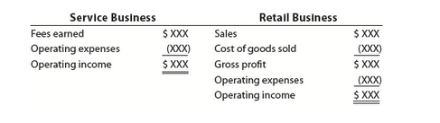</img>

<table><thead>
  <tr>
    <th colspan="2">Service Business</th>
    <th colspan="2">Retail Business</th>
  </tr></thead>
<tbody>
  <tr>
    <td>Fees earned</td>
    <td>XXX</td>
    <td>Sales</td>
    <td>XXX</td>
  </tr>
  <tr>
    <td>Operating expenses</td>
    <td>- (XXX)</td>
    <td>Cost of goods sold</td>
    <td>- (XXX)</td>
  </tr>
  <tr>
    <td>Operating income</td>
    <td>XXX</td>
    <td>Gross profit</td>
    <td>XXX</td>
  </tr>
  <tr>
    <td></td>
    <td></td>
    <td>Operating expenses</td>
    <td>- (XXX)</td>
  </tr>
  <tr>
    <td></td>
    <td></td>
    <td>Operating income</td>
    <td>XXX</td>
  </tr>
</tbody>
</table>

The revenue activities of a service business involve providing services to customers. On the income statement for a service business, the revenues from services are reported as fees earned. The operating expenses incurred in providing the services are subtracted from the fees earned to arrive at operating income.

[Las actividades de ingresos de un negocio de servicios implican proporcionar servicios a los clientes. En el estado de resultados de un negocio de servicios, los ingresos por servicios se reportan como honorarios ganados. Los gastos operativos incurridos en la prestación de los servicios se restan de los honorarios ganados para llegar al ingreso operativo.]

In contrast, the revenue activities of a retail business involve the buying and selling of merchandise. A retail business first purchases merchandise to sell to its customers. When this merchandise is sold, the revenue is reported as sales, and its cost is recognized as an expense. This expense is called the **cost of goods sold** (The cost of merchandise sold recognized as an expense; the cost of finished goods available for sale minus the ending finished goods inventory.) or cost of merchandise sold. The cost of goods sold is subtracted from sales to arrive at gross profit. This amount is called **gross profit** (Sales minus the cost of goods sold.) because it is the profit before deducting operating expenses. The operating expenses are subtracted from gross profit to arrive at operating income.

[En contraste, las actividades de ingresos de un negocio minorista implican la compra y venta de mercancía. Un negocio minorista primero compra mercancía para vender a sus clientes. Cuando esta mercancía se vende, el ingreso se reporta como ventas, y su costo se reconoce como un gasto. Este gasto se llama **costo de bienes vendidos** (el costo de la mercancía vendida reconocido como un gasto; el costo de los bienes terminados disponibles para la venta menos el inventario final de bienes terminados) o costo de mercancía vendida. El costo de bienes vendidos se resta de las ventas para llegar a la utilidad bruta. Este monto se llama **utilidad bruta** (ventas menos el costo de bienes vendidos) porque es la utilidad antes de deducir los gastos operativos. Los gastos operativos se restan de la utilidad bruta para llegar al ingreso operativo.]

Merchandise on hand (not sold) at the end of an accounting period is called **inventory** (Merchandise on hand (not sold) at the end of an accounting period.) or merchandise inventory. Inventory is reported as a current asset on the balance sheet.

[La mercancía disponible (no vendida) al final de un período contable se llama **inventario** (mercancía disponible (no vendida) al final de un período contable) o inventario de mercancía. El inventario se reporta como un activo corriente en el balance general.]

---

**Link to Dollar Tree:** On a recent income statement, Dollar Tree reported the following (in billions):

[**Enlace a Dollar Tree:** En un estado de resultados reciente, Dollar Tree reportó lo siguiente (en miles de millones):]

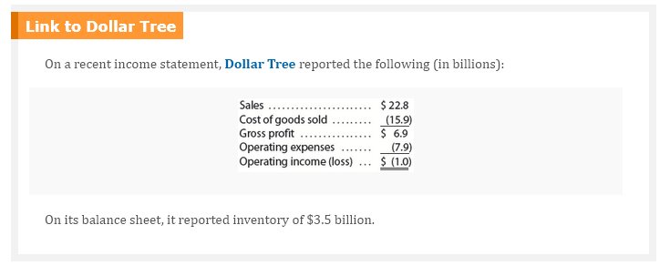</img>

| | Amount |
|--|--|
| Sales | $22.8 |
| Cost of goods sold | (15.9) |
| **Gross profit** | **$6.9** |
| Operating expenses | (7.9) |
| **Operating income (loss)** | **$1.0** |

On its balance sheet, it reported inventory of $3.5 billion.

[En su balance general, reportó inventario de $3.5 mil millones.]

---

## Business Insight

### Comcast versus Lowe's

[**Perspectiva de Negocio - Comcast versus Lowe's**]

Comcast Corporation (CMCSA) is a service business that offers cable communications, broadcast television (NBC television), filmed entertainment (Universal Pictures), and theme parks (Universal Parks) to its customers. Lowe's Companies, Inc. (LOW) is a large home improvement retailer. The differences in the operations of a service and retail business are illustrated in their recent income statements, as follows:

[Comcast Corporation (CMCSA) es un negocio de servicios que ofrece comunicaciones por cable, televisión abierta (televisión NBC), entretenimiento filmado (Universal Pictures) y parques temáticos (Universal Parks) a sus clientes. Lowe's Companies, Inc. (LOW) es un gran minorista de mejoras para el hogar. Las diferencias en las operaciones de un negocio de servicios y uno minorista se ilustran en sus estados de resultados recientes, como sigue:]

</img>

#### Comcast Corporation
#### Condensed Income Statement
#### (in millions)

|                                        | Amount      |
|----------------------------------------|-------------|
| Revenue                                | 108,942     |
| Programming and production expenses    | - (34,440)  |
| Selling and administrative expenses    | - (40,424)  |
| Depreciation and amortization expenses | - (12, 953) |
| Operating income                       | 21,125      |

*Source: Comcast Corporation, Form 10-K for a Recent Fiscal Year Ended December 31.*

---

</img>

#### Lowe's Companies, Inc.
#### Condensed Income Statement
#### (in millions)

|                                               | Amount   |
|-----------------------------------------------|----------|
| Sales                                         | 71,309   |
| Cost of goods sold                            | (48,401) |
| **Gross profit**                              | 22,908   |
| Selling, general, and administrative expenses | (17,413) |
| Depreciation expense                          | (1,477)  |
| **Operating income**                          | 4,018    |

*Source: Lowe's Companies, Inc., Form 10-K for a Recent Fiscal Year Ended February 1.*

As a retail company, Lowe's subtracts cost of goods sold from sales to disclose gross profit. As a service company, Comcast does not show cost of goods sold, nor a gross profit line. Rather, service expenses are subtracted from revenue straight to operating income.

[Como empresa minorista, Lowe's resta el costo de bienes vendidos de las ventas para revelar la utilidad bruta. Como empresa de servicios, Comcast no muestra costo de bienes vendidos ni una línea de utilidad bruta. En cambio, los gastos de servicios se restan de los ingresos directamente hasta el ingreso operativo.]

---

<h1 id="295824" style="color:#E65100;">
  <a href="#Chapter_005" style="color:inherit; text-decoration:none;">
    5-2 Merchandise Transactions
  </a>
</h1>

This section illustrates merchandise transactions for NetSolutions after it becomes a retailer of computer hardware and software. During 20Y6, Chris Clark implemented the second phase of NetSolutions' business plan. In doing so, Chris notified clients that beginning July 1, 20Y7, NetSolutions would no longer offer consulting services. Instead, it would become a retailer.

[Esta sección ilustra las transacciones de mercancía para NetSolutions después de que se convierte en un minorista de hardware y software de computadoras. Durante 20Y6, Chris Clark implementó la segunda fase del plan de negocios de NetSolutions. Al hacerlo, Chris notificó a los clientes que a partir del 1 de julio de 20Y7, NetSolutions ya no ofrecería servicios de consultoría. En cambio, se convertiría en un minorista.]

**Objective 2** - Describe and illustrate the accounting for merchandise transactions.

[**Objetivo 2** - Describir e ilustrar la contabilidad para transacciones de mercancía.]

NetSolutions' business strategy is to offer personalized service to individuals and small businesses that are upgrading or purchasing new computer systems. NetSolutions' personal service includes a no-obligation, on-site assessment of the customer's computer needs. By providing personalized service and follow-up, Chris feels that NetSolutions can compete effectively against such retailers as Best Buy (BBY) and Office Depot (ODP).

[La estrategia comercial de NetSolutions es ofrecer servicio personalizado a individuos y pequeñas empresas que están actualizando o comprando nuevos sistemas de computadoras. El servicio personalizado de NetSolutions incluye una evaluación en el sitio, sin obligación, de las necesidades de computadora del cliente. Al proporcionar servicio personalizado y seguimiento, Chris siente que NetSolutions puede competir efectivamente contra minoristas como Best Buy (BBY) y Office Depot (ODP).]

---

<h1 id="059025" style="color:#E65100;">
  <a href="#Chapter_005" style="color:inherit; text-decoration:none;">
    5-2a Chart of Accounts for Retail Business
  </a>
</h1>

NetSolutions' merchandise transactions are recorded in accounts using the rules of debit and credit that were described and illustrated in Chapter 2. However, since merchandise transactions differ from those of a service business, NetSolutions adopted a new chart of accounts shown in Exhibit 2.

[Las transacciones de mercancía de NetSolutions se registran en cuentas utilizando las reglas de débito y crédito que se describieron e ilustraron en el Capítulo 2. Sin embargo, dado que las transacciones de mercancía difieren de las de un negocio de servicios, NetSolutions adoptó un nuevo catálogo de cuentas que se muestra en la Figura 2.]

---

## Exhibit 2

</img>

### Chart of Accounts for NetSolutions as a Retail Business

[**Figura 2** - Catálogo de Cuentas para NetSolutions como Negocio Minorista]

<table><thead>
  <tr>
    <th colspan="2" style="font-weight: bold;">Balance Sheet Accounts</th>
    <th colspan="2" style="font-weight: bold;">Income Statement Accounts</th>
  </tr></thead>
<tbody>
  <tr>
    <td colspan="2" style="font-weight: bold;">100 Assets</td>
    <td colspan="2" style="font-weight: bold;">400 Revenues</td>
  </tr>
  <tr>
    <td></td>
    <td>110 Cash</td>
    <td></td>
    <td style="color: darkorange;">410 Sales</td>
  </tr>
  <tr>
    <td></td>
    <td>112 Accounts Receivable</td>
    <td></td>
    <td>500 Costs and Expenses</td>
  </tr>
  <tr>
    <td></td>
    <td style="color: darkorange;">115 Inventory</td>
    <td></td>
    <td style="color: darkorange;">510 Cost of Goods Sold</td>
  </tr>
  <tr>
    <td></td>
    <td style="color: darkorange;">116 Estimated Returns Inventory</td>
    <td></td>
    <td>520 Sales Salaries Expense</td>
  </tr>
  <tr>
    <td></td>
    <td>117 Office Supplies</td>
    <td></td>
    <td>521 Advertising Expense</td>
  </tr>
  <tr>
    <td></td>
    <td>118 Prepaid Insurance</td>
    <td></td>
    <td>522 Depreciation Expense—Store Equipment</td>
  </tr>
  <tr>
    <td></td>
    <td>120 Land</td>
    <td></td>
    <td style="color: darkorange;">523 Delivery Expense</td>
  </tr>
  <tr>
    <td></td>
    <td>123 Store Equipment</td>
    <td></td>
    <td>529 Miscellaneous Selling Expense</td>
  </tr>
  <tr>
    <td></td>
    <td>124 Accumulated Depreciation—Store Equipment</td>
    <td></td>
    <td>530 Office Salaries Expense</td>
  </tr>
  <tr>
    <td></td>
    <td>125 Office Equipment</td>
    <td></td>
    <td>531 Rent Expense</td>
  </tr>
  <tr>
    <td></td>
    <td>126 Accumulated Depreciation—Office Equipment</td>
    <td></td>
    <td>532 Depreciation Expense—Office Equipment</td>
  </tr>
  <tr>
    <td colspan="2" style="font-weight: bold;">200 Liabilities</td>
    <td></td>
    <td>533 Insurance Expense</td>
  </tr>
  <tr>
    <td></td>
    <td>210 Accounts Payable</td>
    <td></td>
    <td>534 Office Supplies Expense</td>
  </tr>
  <tr>
    <td></td>
    <td>211 Salaries Payable</td>
    <td></td>
    <td>539 Miscellaneous Administrative Expense</td>
  </tr>
  <tr>
    <td></td>
    <td>212 Unearned Rent</td>
    <td colspan="2" style="font-weight: bold;">600 Other Revenue</td>
  </tr>
  <tr>
    <td></td>
    <td style="color: darkorange;">213 Customer Refunds Payable</td>
    <td></td>
    <td>610 Rent Revenue</td>
  </tr>
  <tr>
    <td></td>
    <td style="color: darkorange;">214 Estimated Coupons Payable</td>
    <td colspan="2" style="font-weight: bold;">700 Other Expense</td>
  </tr>
  <tr>
    <td></td>
    <td>215 Notes Payable</td>
    <td></td>
    <td>710 Interest Expense</td>
  </tr>
  <tr>
    <td colspan="2" style="font-weight: bold;">300 Stockholders' Equity</td>
    <td></td>
    <td></td>
  </tr>
  <tr>
    <td></td>
    <td>310 Common Stock</td>
    <td></td>
    <td></td>
  </tr>
  <tr>
    <td></td>
    <td>311 Retained Earnings</td>
    <td></td>
    <td></td>
  </tr>
  <tr>
    <td></td>
    <td>312 Dividends</td>
    <td></td>
    <td></td>
  </tr>
</tbody></table>

The accounts related to merchandising transactions are highlighted in blue in Exhibit 2. The nature of these accounts will be described and illustrated as the related merchandising transactions are discussed.

[Las cuentas relacionadas con transacciones de mercancía están resaltadas en azul en la Figura 2. La naturaleza de estas cuentas se describirá e ilustrará a medida que se discutan las transacciones de mercancía relacionadas.]

As shown in Exhibit 2, NetSolutions' chart of accounts now consists of three-digit account numbers. The first digit indicates the major financial statement classification (1 for assets, 2 for liabilities, etc.). The second digit indicates the subclassification (e.g., 11 for current assets and 12 for noncurrent assets). The third digit identifies the specific account (e.g., 110 for Cash and 123 for Store Equipment).

[Como se muestra en la Figura 2, el catálogo de cuentas de NetSolutions ahora consiste en números de cuenta de tres dígitos. El primer dígito indica la clasificación principal del estado financiero (1 para activos, 2 para pasivos, etc.). El segundo dígito indica la subclasificación (por ejemplo, 11 para activos corrientes y 12 para activos no corrientes). El tercer dígito identifica la cuenta específica (por ejemplo, 110 para Efectivo y 123 para Equipo de Tienda).]

---

<h1 id="863176" style="color:#E65100;">
  <a href="#Chapter_005" style="color:inherit; text-decoration:none;">
    5-2b Subsidiary Ledgers
  </a>
</h1>

The accounting system for retail businesses is often modified to more efficiently record transactions. For example, the accounting system should be designed to provide information on the amounts due from various customers (accounts receivable) and amounts owed to various creditors (accounts payable). A separate account for each customer and creditor could be added to the ledger. However, as the number of customers and creditors increases, the ledger will become large and awkward to use.

[El sistema contable para negocios minoristas a menudo se modifica para registrar transacciones de manera más eficiente. Por ejemplo, el sistema contable debe estar diseñado para proporcionar información sobre los montos adeudados por varios clientes (cuentas por cobrar) y los montos adeudados a varios acreedores (cuentas por pagar). Se podría agregar una cuenta separada para cada cliente y acreedor al libro mayor. Sin embargo, a medida que aumenta el número de clientes y acreedores, el libro mayor se volverá grande y difícil de usar.]

A large number of individual accounts with a common characteristic can be grouped together in a separate ledger, called a **subsidiary ledger** (Individual accounts with a common characteristic grouped together in a separate or secondary ledger, which is used to support a controlling account in the general ledger.). The primary ledger, which contains all of the balance sheet and income statement accounts, is then called the **general ledger** (The primary ledger, when used in conjunction with subsidiary ledgers, that contains all of the balance sheet and income statement accounts.). Each subsidiary ledger is represented in the general ledger by a summarizing account, called a **controlling account** (The account in the general ledger that summarizes the balances of the accounts in a subsidiary ledger.). The sum of the balances of the accounts in the subsidiary ledger must equal the balance of the related controlling account. Thus, a subsidiary ledger is a secondary ledger that supports a controlling account in the general ledger.

[Un gran número de cuentas individuales con una característica común se pueden agrupar en un libro mayor separado, llamado **libro mayor auxiliar** (cuentas individuales con una característica común agrupadas en un libro mayor separado o secundario, que se utiliza para respaldar una cuenta de control en el libro mayor general). El libro mayor principal, que contiene todas las cuentas del balance general y del estado de resultados, se llama entonces **libro mayor general** (el libro mayor principal, cuando se usa en conjunto con libros mayores auxiliares, que contiene todas las cuentas del balance general y del estado de resultados). Cada libro mayor auxiliar está representado en el libro mayor general por una cuenta resumida, llamada **cuenta de control** (la cuenta en el libro mayor general que resume los saldos de las cuentas en un libro mayor auxiliar). La suma de los saldos de las cuentas en el libro mayor auxiliar debe ser igual al saldo de la cuenta de control relacionada. Por lo tanto, un libro mayor auxiliar es un libro mayor secundario que respalda una cuenta de control en el libro mayor general.]

Common subsidiary ledgers are:

[Los libros mayores auxiliares comunes son:]

- The **accounts receivable subsidiary ledger** (The subsidiary ledger containing the individual accounts with customers; also called the customers ledger.), or customers ledger, lists the individual customer accounts in alphabetical order. The controlling account in the general ledger is Accounts Receivable.

[El **libro mayor auxiliar de cuentas por cobrar** (el libro mayor auxiliar que contiene las cuentas individuales con los clientes; también llamado libro mayor de clientes), o libro mayor de clientes, enumera las cuentas de clientes individuales en orden alfabético. La cuenta de control en el libro mayor general es Cuentas por Cobrar.]

- The **accounts payable subsidiary ledger** (The subsidiary ledger containing the individual accounts with suppliers (creditors); also called the creditors ledger.), or creditors ledger, lists individual creditor accounts in alphabetical order. The controlling account in the general ledger is Accounts Payable.

[El **libro mayor auxiliar de cuentas por pagar** (el libro mayor auxiliar que contiene las cuentas individuales con los proveedores (acreedores); también llamado libro mayor de acreedores), o libro mayor de acreedores, enumera las cuentas de acreedores individuales en orden alfabético. La cuenta de control en el libro mayor general es Cuentas por Pagar.]

- The **inventory subsidiary ledger** (A supporting ledger to the inventory account, containing an individual account for each inventory item.), or inventory ledger, lists individual inventory by item (bar code) number. The controlling account in the general ledger is Inventory. An inventory subsidiary ledger is used in a perpetual inventory system.

[El **libro mayor auxiliar de inventario** (un libro mayor de respaldo a la cuenta de inventario, que contiene una cuenta individual para cada artículo de inventario), o libro mayor de inventario, enumera el inventario individual por número de artículo (código de barras). La cuenta de control en el libro mayor general es Inventario. Un libro mayor auxiliar de inventario se utiliza en un sistema de inventario perpetuo.]

Most retail companies also use computerized accounting systems that record similar transactions in separate journals, which generate purchase, sales, and inventory reports. These separate journals are called **special journals** (Journals designed to be used for recording a single type of transaction that occurs frequently.) However, for simplicity, the journal entries in this chapter will be illustrated using a two-column general journal.

[La mayoría de las empresas minoristas también utilizan sistemas contables computarizados que registran transacciones similares en diarios separados, que generan informes de compras, ventas e inventario. Estos diarios separados se llaman **diarios especiales** (diarios diseñados para ser utilizados para registrar un solo tipo de transacción que ocurre con frecuencia). Sin embargo, por simplicidad, los asientos de diario en este capítulo se ilustrarán utilizando un diario general de dos columnas.]

---

<h1 id="589443" style="color:#E65100;">
  <a href="#Chapter_005" style="color:inherit; text-decoration:none;">
    5-2c Purchases Transactions
  </a>
</h1>

There are two systems for accounting for merchandise transactions: perpetual and periodic. In a **perpetual inventory system** (The inventory system in which each purchase and sale of merchandise is recorded in the inventory account and related subsidiary ledger; therefore, the inventory records are updated continuously.), each purchase and sale of merchandise is recorded in the inventory account and related subsidiary ledger. In this way, the amount of merchandise available for sale and the amount sold are continuously (perpetually) updated in the inventory records. In a **periodic inventory system** (An inventory system in which the inventory records are updated only after a physical count has been taken at periodic intervals, usually at the end of an accounting period.), the inventory does not show the amount of merchandise available for sale and the amount sold. Instead, a listing of inventory on hand, called a **physical inventory** (A detailed listing of merchandise on hand.), is prepared at the end of the accounting period. This physical inventory is used to determine the cost of inventory on hand at the end of the period and the cost of goods sold during the period.

[Existen dos sistemas para contabilizar las transacciones de mercancía: perpetuo y periódico. En un **sistema de inventario perpetuo** (el sistema de inventario en el que cada compra y venta de mercancía se registra en la cuenta de inventario y en el libro mayor auxiliar relacionado; por lo tanto, los registros de inventario se actualizan continuamente), cada compra y venta de mercancía se registra en la cuenta de inventario y en el libro mayor auxiliar relacionado. De esta manera, la cantidad de mercancía disponible para la venta y la cantidad vendida se actualizan continuamente (perpetuamente) en los registros de inventario. En un **sistema de inventario periódico** (un sistema de inventario en el que los registros de inventario se actualizan solo después de que se ha realizado un conteo físico a intervalos periódicos, generalmente al final de un período contable), el inventario no muestra la cantidad de mercancía disponible para la venta y la cantidad vendida. En su lugar, se prepara una lista del inventario disponible, llamada **inventario físico** (una lista detallada de la mercancía disponible), al final del período contable. Este inventario físico se utiliza para determinar el costo del inventario disponible al final del período y el costo de los bienes vendidos durante el período.]

Most retail companies use computerized perpetual inventory systems. Such systems use bar codes or radio frequency identification codes embedded in a product. An optical scanner or radio frequency identification device is then used to read the product codes and track inventory on hand and sold.

[La mayoría de las empresas minoristas utilizan sistemas de inventario perpetuo computarizados. Dichos sistemas utilizan códigos de barras o códigos de identificación por radiofrecuencia incrustados en un producto. Luego se utiliza un escáner óptico o un dispositivo de identificación por radiofrecuencia para leer los códigos de los productos y rastrear el inventario disponible y vendido.]

Because computerized perpetual inventory systems are widely used, this chapter illustrates merchandise transactions using a perpetual inventory system. The periodic system is described and illustrated in Appendix 2 at the end of this chapter.

[Dado que los sistemas de inventario perpetuo computarizados son ampliamente utilizados, este capítulo ilustra las transacciones de mercancía utilizando un sistema de inventario perpetuo. El sistema periódico se describe e ilustra en el Apéndice 2 al final de este capítulo.]

---

**Link to Dollar Tree:** Dollar Tree uses point-of-sale computerized software to plan purchases and track inventory. This system automatically reorders key items based on sales and inventory levels.

[**Enlace a Dollar Tree:** Dollar Tree utiliza software computarizado de punto de venta para planificar compras y rastrear inventario. Este sistema reordena automáticamente artículos clave basándose en las ventas y los niveles de inventario.]

---

## Purchase of Merchandise

Under the perpetual inventory system, cash purchases of merchandise are recorded as follows:

[Bajo el sistema de inventario perpetuo, las compras de mercancía al contado se registran de la siguiente manera:]

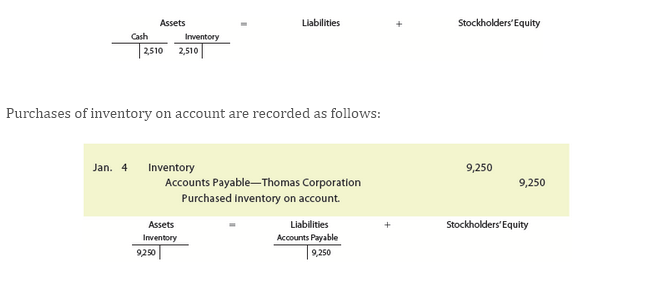</img>

<table><thead>
  <tr>
    <th colspan="4">Assets</th>
    <th>=</th>
    <th colspan="2">Liabilities</th>
    <th>+</th>
    <th colspan="2">Stockholders' Equity</th>
  </tr></thead>
<tbody>
  <tr>
    <td colspan="2">Cash</td>
    <td colspan="2">Inventory</td>
    <td rowspan="3"></td>
    <td colspan="2"></td>
    <td rowspan="3"></td>
    <td colspan="2"></td>
  </tr>
  <tr>
    <td>debit</td>
    <td>credit</td>
    <td>debit</td>
    <td>credit</td>
    <td>debit</td>
    <td>credit</td>
    <td>debit</td>
    <td>credit</td>
  </tr>
  <tr>
    <td></td>
    <td>2510</td>
    <td>2510</td>
    <td></td>
    <td></td>
    <td></td>
    <td></td>
    <td></td>
  </tr>
</tbody>
</table>

Purchases of inventory on account are recorded as follows:

[Las compras de inventario a crédito se registran de la siguiente manera:]

| Date | Account | Debit | Credit |
|------|---------|-------|--------|
| Jan. 4 | Inventory | 9,250 | |
| | Accounts Payable—Thomas Corporation | | 9,250 |
| | *Purchased inventory on account.* | | |

<table><thead>
  <tr>
    <th colspan="2">Assets</th>
    <th>=</th>
    <th colspan="2">Liabilities</th>
    <th>+</th>
    <th colspan="2">Stockholders' Equity</th>
  </tr></thead>
<tbody>
  <tr>
    <td colspan="2">Inventory</td>
    <td rowspan="3"></td>
    <td colspan="2">Account Payable</td>
    <td rowspan="3"></td>
    <td colspan="2"></td>
  </tr>
  <tr>
    <td>debit</td>
    <td>credit</td>
    <td>debit</td>
    <td>credit</td>
    <td>debit</td>
    <td>credit</td>
  </tr>
  <tr>
    <td>9250</td>
    <td></td>
    <td></td>
    <td>9250</td>
    <td></td>
    <td></td>
  </tr>
</tbody>
</table>

The terms of purchases on account are normally indicated on the **invoice** (The bill that the seller sends to the buyer for sales made or services rendered on account.) or bill that the seller sends the buyer. An example of an invoice sent to NetSolutions by Alpha Technologies is shown in Exhibit 3.

[Los términos de las compras a crédito normalmente se indican en la **factura** (la cuenta que el vendedor envía al comprador por las ventas realizadas o los servicios prestados a crédito) o cuenta que el vendedor envía al comprador. Un ejemplo de una factura enviada a NetSolutions por Alpha Technologies se muestra en la Figura 3.]

---

## Exhibit 3

### Invoice

[**Figura 3** - Factura]

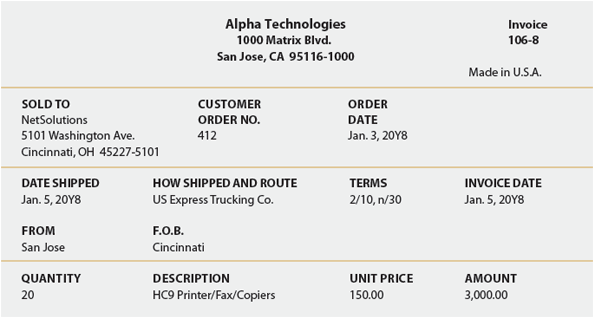</img>

<table><thead>
  <tr>
    <th colspan="3">Alpha Technologies</th>
    <th>Invoice No. 106-8</th>
  </tr></thead>
<tbody>
  <tr>
    <td colspan="3">1000 Matrix Blvd.</td>
    <td>Made in U.S.A.</td>
  </tr>
  <tr>
    <td colspan="3">San Jose, CA 95116-1000</td>
    <td></td>
  </tr>
  <tr>
    <td></td>
    <td></td>
    <td></td>
    <td></td>
  </tr>
  <tr>
    <td>SOLD TO</td>
    <td>CUSTOMER ORDER NO.</td>
    <td>ORDER DATE</td>
    <td></td>
  </tr>
  <tr>
    <td>NetSolutions </td>
    <td>412</td>
    <td>Jan. 3, 20Y8</td>
    <td></td>
  </tr>
  <tr>
    <td>5101 Washington Ave.</td>
    <td></td>
    <td></td>
    <td></td>
  </tr>
  <tr>
    <td>Cincinnati, OH 45227-5101</td>
    <td></td>
    <td></td>
    <td></td>
  </tr>
  <tr>
    <td></td>
    <td></td>
    <td></td>
    <td></td>
  </tr>
  <tr>
    <td>DATE SHIPPED</td>
    <td>HOW SHIPPED AND ROUTE</td>
    <td>TERMS</td>
    <td>INVOICE DATE</td>
  </tr>
  <tr>
    <td>Jan. 5, 20Y8</td>
    <td>US Express Trucking Co.</td>
    <td>2/10, n/30</td>
    <td>Jan. 5, 20Y8</td>
  </tr>
  <tr>
    <td></td>
    <td></td>
    <td></td>
    <td></td>
  </tr>
  <tr>
    <td>FROM</td>
    <td>F.O.B.</td>
    <td></td>
    <td></td>
  </tr>
  <tr>
    <td>San Jose</td>
    <td>Cincinnati</td>
    <td></td>
    <td></td>
  </tr>
  <tr>
    <td></td>
    <td></td>
    <td></td>
    <td></td>
  </tr>
  <tr>
    <td>QUANTITY</td>
    <td>DESCRIPTION</td>
    <td>UNIT PRICE</td>
    <td>AMOUNT</td>
  </tr>
  <tr>
    <td>20</td>
    <td>HC9 Printer/Fax/Copiers</td>
    <td>$150.00</td>
    <td>$3,000.00</td>
  </tr>
</tbody></table>

The terms for when payments for merchandise are to be made are called the **credit terms** (Terms for payment on account by the buyer to the seller). If payment is required on delivery, the terms are cash or net cash. Otherwise, the buyer is allowed an amount of time, known as the **credit period** (The amount of time the buyer is allowed in which to pay the seller), in which to pay. The credit period usually begins with the date of the sale as shown on the invoice.

[Los términos para cuándo se deben realizar los pagos por la mercancía se llaman **términos de crédito** (términos de pago a cuenta por parte del comprador al vendedor). Si el pago se requiere en el momento de la entrega, los términos son al contado o neto al contado. De lo contrario, se le permite al comprador un período de tiempo, conocido como **período de crédito** (el período de tiempo que se le permite al comprador para pagar al vendedor), en el cual pagar. El período de crédito generalmente comienza con la fecha de la venta como se muestra en la factura.]

---

## Business Insight

### Apple's Credit Terms

[**Perspectiva de Negocio - Términos de Crédito de Apple**]

Working capital efficiency is influenced by the relationship between the suppliers' and customers' credit terms. If the suppliers' credit terms are longer than the customers' credit terms, then the company is able to use suppliers to finance the operating cycle. For example, Apple (AAPL) is able to collect on sales within an average of approximately 30 days. However, Apple uses an average of approximately 100 days to pay its suppliers. Thus, Apple collects faster than it pays, allowing Apple to use the suppliers' money as an interest-free loan for the 70-day (100 days - 30 days) difference.

[La eficiencia del capital de trabajo está influenciada por la relación entre los términos de crédito de los proveedores y los clientes. Si los términos de crédito de los proveedores son más largos que los términos de crédito de los clientes, entonces la empresa puede utilizar a los proveedores para financiar el ciclo operativo. Por ejemplo, Apple (AAPL) puede cobrar las ventas en un promedio de aproximadamente 30 días. Sin embargo, Apple utiliza un promedio de aproximadamente 100 días para pagar a sus proveedores. Por lo tanto, Apple cobra más rápido de lo que paga, lo que le permite a Apple utilizar el dinero de los proveedores como un préstamo sin intereses por la diferencia de 70 días (100 días - 30 días).]

*Source: Apple*

Payment may be due within a stated number of days after the invoice date, such as 15 days or 30 days. In these cases, the terms are net 15 days or net 30 days and are normally expressed as n/15 or n/30. If payment is due by the end of the month in which the sale was made, the terms are written as n/eom.

[El pago puede ser exigible dentro de un número determinado de días después de la fecha de la factura, como 15 días o 30 días. En estos casos, los términos son neto 15 días o neto 30 días y normalmente se expresan como n/15 o n/30. Si el pago es exigible al final del mes en el que se realizó la venta, los términos se escriben como n/eom.]

---

## Purchases Discounts

B2B (business-to-business) purchases may include a discount by the supplier (vendor) to encourage the buyer to pay before the end of the credit period. For example, a supplier may offer a 2% discount if the buyer pays within 10 days of the invoice date. If the buyer does not take the discount, the total invoice amount is due within 30 days. These terms are expressed as 2/10, n/30 and are read as "2% discount if paid within 10 days, net amount due within 30 days." The credit terms of 2/10, n/30 are summarized in Exhibit 4, using the invoice in Exhibit 3.

[Las compras B2B (empresa-empresa) pueden incluir un descuento del proveedor (vendedor) para alentar al comprador a pagar antes del final del período de crédito. Por ejemplo, un proveedor puede ofrecer un descuento del 2% si el comprador paga dentro de los 10 días posteriores a la fecha de la factura. Si el comprador no toma el descuento, el monto total de la factura es exigible dentro de los 30 días. Estos términos se expresan como 2/10, n/30 y se leen como "2% de descuento si se paga dentro de 10 días, monto neto exigible dentro de 30 días". Los términos de crédito de 2/10, n/30 se resumen en la Figura 4, utilizando la factura de la Figura 3.]

---

## Exhibit 4

### Credit Terms

[**Figura 4** - Términos de Crédito]

<!-- 📍 IMAGEN: Exhibit 4 - Credit Terms (coordenadas [114, 513, 858, 935]) -->

Discounts taken by the buyer for early payment of an invoice are called **purchases discounts** (Discounts taken by the buyer for early payment of an invoice.). Purchases discounts taken by a buyer reduce the cost of the merchandise purchased. Even if the buyer has to borrow to pay within a discount period, it is normally to the buyer's advantage to do so. For this reason, accounting systems are normally designed so that all available discounts are taken.

[Los descuentos tomados por el comprador por el pago anticipado de una factura se llaman **descuentos por compras** (descuentos tomados por el comprador por el pago anticipado de una factura). Los descuentos por compras tomados por un comprador reducen el costo de la mercancía comprada. Incluso si el comprador tiene que pedir prestado para pagar dentro del período de descuento, normalmente es ventajoso para el comprador hacerlo. Por esta razón, los sistemas contables normalmente están diseñados para que se tomen todos los descuentos disponibles.]

To illustrate, the invoice shown in Exhibit 3 is used. The last day of the discount period is January 15 (invoice date of January 5 plus 10 days). Assume that in order to pay the invoice on January 15, NetSolutions borrows $2,940, which is $3,000 less the discount of $60 ($3,000 × 2%). If an annual interest rate of 6% and a 360-day year is also assumed, the interest on the loan of $2,940 for the remaining 20 days of the credit period is $9.80 ($2,940 × 6% × 20 ÷ 360).

[Para ilustrar, se utiliza la factura mostrada en la Figura 3. El último día del período de descuento es el 15 de enero (fecha de la factura del 5 de enero más 10 días). Suponga que para pagar la factura el 15 de enero, NetSolutions pide prestado $2,940, que es $3,000 menos el descuento de $60 ($3,000 × 2%). Si también se asume una tasa de interés anual del 6% y un año de 360 días, el interés del préstamo de $2,940 por los 20 días restantes del período de crédito es de $9.80 ($2,940 × 6% × 20 ÷ 360).]

The net savings to NetSolutions of taking the discount is $50.20, computed as follows:

[El ahorro neto para NetSolutions de tomar el descuento es de $50.20, calculado de la siguiente manera:]

| Description | Amount |
|---|---|
| Discount of 2% on $3,000 | $60.00 |
| Interest for 20 days at a rate of 6% on $2,940 | (9.80) |
| **Savings from taking the discount** | **$50.20** |

The savings can also be seen by comparing the interest rate on the money saved by taking the discount and the interest rate on the money borrowed to take the discount. The interest rate on the money saved in the prior example is estimated by converting 2% for 20 days to a yearly rate, as follows:

[El ahorro también se puede ver comparando la tasa de interés sobre el dinero ahorrado al tomar el descuento y la tasa de interés sobre el dinero prestado para tomar el descuento. La tasa de interés sobre el dinero ahorrado en el ejemplo anterior se estima convirtiendo el 2% durante 20 días a una tasa anual, de la siguiente manera:]

$$
    2\% \times \frac{360 \text{ days}}{20 \text{ days}} = 2\% \times 18 = 36\%\
$$

If NetSolutions borrows the money to take the discount, it pays interest of 6%. If NetSolutions does not take the discount, it pays an estimated interest rate of 36% for using the $3,000 for an additional 20 days.

[Si NetSolutions pide prestado el dinero para tomar el descuento, paga un interés del 6%. Si NetSolutions no toma el descuento, paga una tasa de interés estimada del 36% por usar los $3,000 por 20 días adicionales.]

Under the perpetual inventory system, the buyer initially debits Inventory for the amount of the invoice. When paying the invoice within the discount period, the buyer credits Inventory for the amount of the discount. In this way, Inventory shows the net cost to the buyer.

[Bajo el sistema de inventario perpetuo, el comprador inicialmente debita Inventario por el monto de la factura. Cuando paga la factura dentro del período de descuento, el comprador acredita Inventario por el monto del descuento. De esta manera, Inventario muestra el costo neto para el comprador.]

To illustrate, NetSolutions would record the Alpha Technologies invoice and its payment at the end of the discount period as follows:

[Para ilustrar, NetSolutions registraría la factura de Alpha Technologies y su pago al final del período de descuento de la siguiente manera:]

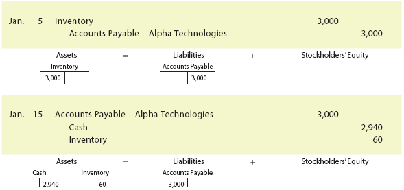</img>

| Date | Account | Debit | Credit |
|------|---------|-------|--------|
| Jan. 5 | Inventory | 3,000 | |
| | Accounts Payable | | 3,000 |
| | *Purchased merchandise on account.* | | |

<table><thead>
  <tr>
    <th colspan="2">Assets</th>
    <th>=</th>
    <th colspan="2">Liabilities</th>
    <th>+</th>
    <th colspan="2">Stockholders' Equity</th>
  </tr></thead>
<tbody>
  <tr>
    <td colspan="2">Inventory</td>
    <td rowspan="3"></td>
    <td colspan="2">Accounts Payable</td>
    <td rowspan="3"></td>
    <td colspan="2"></td>
  </tr>
  <tr>
    <td>debit</td>
    <td>credit</td>
    <td>debit</td>
    <td>credit</td>
    <td>debit</td>
    <td>credit</td>
  </tr>
  <tr>
    <td>3000</td>
    <td></td>
    <td></td>
    <td>3000</td>
    <td></td>
    <td></td>
  </tr>
</tbody>
</table>

| Date | Account | Debit | Credit |
|------|---------|-------|--------|
| Jan. 15 | Accounts Payable | 3,000 | |
| | Cash | | 2,940 |
| | Inventory | | 60 |
| | *Paid invoice within discount period.* | | |

<table><thead>
  <tr>
    <th colspan="4">Assets</th>
    <th>=</th>
    <th colspan="2">Liabilities</th>
    <th>+</th>
    <th colspan="2">Stockholders' Equity</th>
  </tr></thead>
<tbody>
  <tr>
    <td colspan="2">Cash</td>
    <td colspan="2">Inventory</td>
    <td rowspan="3"></td>
    <td colspan="2">Accounts Payable</td>
    <td rowspan="3"></td>
    <td colspan="2"></td>
  </tr>
  <tr>
    <td>debit</td>
    <td>credit</td>
    <td>debit</td>
    <td>credit</td>
    <td>debit</td>
    <td>credit</td>
    <td>debit</td>
    <td>credit</td>
  </tr>
  <tr>
    <td></td>
    <td>2940</td>
    <td></td>
    <td>60</td>
    <td>3000</td>
    <td></td>
    <td></td>
    <td></td>
  </tr>
</tbody>
</table>

Assume that NetSolutions does not take the discount, but instead pays the invoice on February 4. In this case, NetSolutions would record the payment as follows:

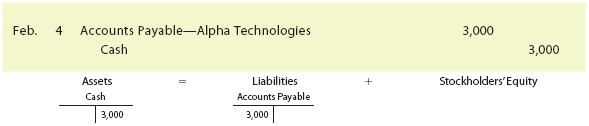</img>

| Date   | Account                             | Debit | Credit |
|--------|-------------------------------------|-------|--------|
| Feb. 4 | Accounts Payable—Alpha Technologies | 3,000 |        |
|        | Cash                                |       | 3,000  |

<table><thead>
  <tr>
    <th colspan="2">Assets</th>
    <th>=</th>
    <th colspan="2">Liabilities</th>
    <th>+</th>
    <th colspan="2">Stockholders' Equity</th>
  </tr></thead>
<tbody>
  <tr>
    <td colspan="2">Cash</td>
    <td rowspan="3"></td>
    <td colspan="2">Accounts Payable</td>
    <td rowspan="3"></td>
    <td colspan="2"></td>
  </tr>
  <tr>
    <td>debit</td>
    <td>credit</td>
    <td>debit</td>
    <td>credit</td>
    <td>debit</td>
    <td>credit</td>
  </tr>
  <tr>
    <td></td>
    <td>3000</td>
    <td>3000</td>
    <td></td>
    <td></td>
    <td></td>
  </tr>
</tbody>
</table>

---

## Purchases Returns and Allowances

A buyer may request an allowance for merchandise that is returned (purchases return) or a price allowance (purchases allowance) for damaged or defective merchandise. From a buyer's perspective, such returns and allowances are called **purchases returns and allowances** (From the buyer's perspective, returned merchandise or an adjustment for defective merchandise.). In both cases, the buyer normally sends the seller a debit memorandum to notify the seller of reasons for the return (purchase return) or to request a price reduction (purchase allowance).

[Un comprador puede solicitar una bonificación por la mercancía que se devuelve (devolución de compra) o una bonificación de precio (bonificación de compra) por mercancía dañada o defectuosa. Desde la perspectiva del comprador, tales devoluciones y bonificaciones se llaman **devoluciones y bonificaciones de compras** (desde la perspectiva del comprador, mercancía devuelta o un ajuste por mercancía defectuosa). En ambos casos, el comprador normalmente envía al vendedor un memorándum de débito para notificar al vendedor las razones de la devolución (devolución de compra) o para solicitar una reducción de precio (bonificación de compra).]

A **debit memorandum** (A form used by a buyer to inform the seller of the amount the buyer proposes to debit to the account payable due the seller.), often called a debit memo, is shown in Exhibit 5. A debit memo informs the seller of the amount the buyer proposes to debit to the account payable due the seller. It also states the reasons for the return or the request for the price allowance.

[Un **memorándum de débito** (un formulario utilizado por el comprador para informar al vendedor del monto que el comprador propone debitar a la cuenta por pagar al vendedor), a menudo llamado nota de débito, se muestra en la Figura 5. Una nota de débito informa al vendedor del monto que el comprador propone debitar a la cuenta por pagar al vendedor. También establece las razones de la devolución o la solicitud de la bonificación de precio.]

---

## Exhibit 5

### Debit Memo

[**Figura 5** - Memorándum de Débito]

</img>

<table><thead>
  <tr>
    <th colspan="2">NetSolutions</th>
    <th>No. 18</th>
  </tr></thead>
<tbody>
  <tr>
    <td colspan="2">5101 Washington Ave.</td>
    <td></td>
  </tr>
  <tr>
    <td colspan="2">Cincinnati, OH 45227-5101</td>
    <td></td>
  </tr>
  <tr>
    <td></td>
    <td></td>
    <td></td>
  </tr>
  <tr>
    <td>DEBIT MEMO</td>
    <td>DATE</td>
    <td></td>
  </tr>
  <tr>
    <td>TO</td>
    <td>March 7, 20Y8</td>
    <td></td>
  </tr>
  <tr>
    <td>Maxim Systems</td>
    <td></td>
    <td></td>
  </tr>
  <tr>
    <td>7519 East Wilson Ave.</td>
    <td></td>
    <td></td>
  </tr>
  <tr>
    <td>Seattle, WA 98101-7519</td>
    <td></td>
    <td></td>
  </tr>
  <tr>
    <td></td>
    <td></td>
    <td></td>
  </tr>
  <tr>
    <td>WE DEBITED YOUR ACCOUNT AS FOLLOWS</td>
    <td></td>
    <td></td>
  </tr>
  <tr>
    <td>10 Server Network Cards, your invoice No. 7291,</td>
    <td>@ $90.00</td>
    <td>900.00</td>
  </tr>
  <tr>
    <td>&nbsp;&nbsp;&nbsp;&nbsp;are being returned via parcel post. Our order specified No. 825X.</td>
    <td></td>
    <td></td>
  </tr>
  <tr>
    <td></td>
    <td></td>
    <td></td>
  </tr>
</tbody></table>

The buyer may use the debit memo as the basis for recording the return or allowance or wait for approval from the seller (creditor). In either case, the buyer debits Accounts Payable and credits Inventory.

[El comprador puede utilizar la nota de débito como base para registrar la devolución o bonificación, o esperar la aprobación del vendedor (acreedor). En cualquier caso, el comprador debita Cuentas por Pagar y acredita Inventario.]

To illustrate, NetSolutions records the return of the inventory indicated in the debit memo in Exhibit 5 as follows:

[Para ilustrar, NetSolutions registra la devolución del inventario indicado en la nota de débito en la Figura 5 de la siguiente manera:]

| Date | Account | Debit | Credit |
|------|---------|-------|--------|
| Mar. 7 | Accounts Payable | 900 | |
| | Inventory | | 900 |
| | Debit Memo No. 18 *Returned merchandise to Maxim Systems.* | | |

<table><thead>
  <tr>
    <th colspan="2">Assets</th>
    <th>=</th>
    <th colspan="2">Liabilities</th>
    <th>+</th>
    <th colspan="2">Stockholders' Equity</th>
  </tr></thead>
<tbody>
  <tr>
    <td colspan="2">Inventory</td>
    <td rowspan="3"></td>
    <td colspan="2">Accounts Payable</td>
    <td rowspan="3"></td>
    <td colspan="2"></td>
  </tr>
  <tr>
    <td>debit</td>
    <td>credit</td>
    <td>debit</td>
    <td>credit</td>
    <td>debit</td>
    <td>credit</td>
  </tr>
  <tr>
    <td></td>
    <td>900</td>
    <td>900</td>
    <td></td>
    <td></td>
    <td></td>
  </tr>
</tbody>
</table>

---

## Purchases Discounts and Returns Combined

Before paying an invoice, a buyer may return inventory or be granted a price allowance for an invoice with a purchase discount. To illustrate, assume the following data concerning a purchase of inventory by NetSolutions on May 2:

[Antes de pagar una factura, un comprador puede devolver el inventario o recibir una bonificación de precio por una factura con descuento por compra. Para ilustrar, suponga los siguientes datos sobre una compra de inventario por parte de NetSolutions el 2 de mayo:]

- May 2. Purchased $5,000 of inventory on account from Delta Data Link, terms 2/10, n/30.
- May 4. Returned inventory with an invoice amount of $1,000 that was purchased on May 2.
- May 12. Paid for the purchase of May 2 less the return and discount.

NetSolutions would record these transactions as follows:

[NetSolutions registraría estas transacciones de la siguiente manera:]

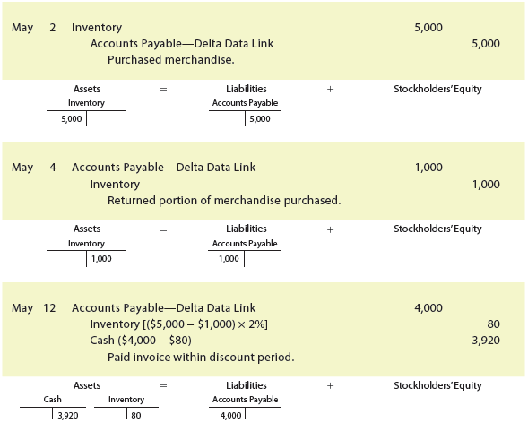</img>

| Date | Account | Debit | Credit |
|------|---------|-------|--------|
| May 2 | Inventory | 5,000 | |
| | Accounts Payable | | 5,000 |
| | *Purchased merchandise on account.* | | |

<table><thead>
  <tr>
    <th colspan="2">Assets</th>
    <th>=</th>
    <th colspan="2">Liabilities</th>
    <th>+</th>
    <th colspan="2">Stockholders' Equity</th>
  </tr></thead>
<tbody>
  <tr>
    <td colspan="2">Inventory</td>
    <td rowspan="3"></td>
    <td colspan="2">Accounts Payable</td>
    <td rowspan="3"></td>
    <td colspan="2"></td>
  </tr>
  <tr>
    <td>debit</td>
    <td>credit</td>
    <td>debit</td>
    <td>credit</td>
    <td>debit</td>
    <td>credit</td>
  </tr>
  <tr>
    <td>5000</td>
    <td></td>
    <td></td>
    <td>5000</td>
    <td></td>
    <td></td>
  </tr>
</tbody>
</table>

| Date | Account | Debit | Credit |
|------|---------|-------|--------|
| May 4 | Accounts Payable | 1,000 | |
| | Inventory | | 1,000 |
| | *Returned defective merchandise.* | | |

<table><thead>
  <tr>
    <th colspan="2">Assets</th>
    <th>=</th>
    <th colspan="2">Liabilities</th>
    <th>+</th>
    <th colspan="2">Stockholders' Equity</th>
  </tr></thead>
<tbody>
  <tr>
    <td colspan="2">Inventory</td>
    <td rowspan="3"></td>
    <td colspan="2">Accounts Payable</td>
    <td rowspan="3"></td>
    <td colspan="2"></td>
  </tr>
  <tr>
    <td>debit</td>
    <td>credit</td>
    <td>debit</td>
    <td>credit</td>
    <td>debit</td>
    <td>credit</td>
  </tr>
  <tr>
    <td></td>
    <td>1000</td>
    <td>1000</td>
    <td></td>
    <td></td>
    <td></td>
  </tr>
</tbody>
</table>

| Date | Account | Debit | Credit |
|------|---------|-------|--------|
| May 12 | Accounts Payable | 4,000 | |
| | Cash | | 3,920 |
| | Inventory | | 80 |
| | *Paid invoice less return and discount.* | | |

<table><thead>
  <tr>
    <th colspan="4">Assets</th>
    <th>=</th>
    <th colspan="2">Liabilities</th>
    <th>+</th>
    <th colspan="2">Stockholders' Equity</th>
  </tr></thead>
<tbody>
  <tr>
    <td colspan="2">Cash</td>
    <td colspan="2">Inventory</td>
    <td rowspan="3"></td>
    <td colspan="2">Accounts Payable</td>
    <td rowspan="3"></td>
    <td colspan="2"></td>
  </tr>
  <tr>
    <td>debit</td>
    <td>credit</td>
    <td>debit</td>
    <td>credit</td>
    <td>debit</td>
    <td>credit</td>
    <td>debit</td>
    <td>credit</td>
  </tr>
  <tr>
    <td></td>
    <td>3920</td>
    <td></td>
    <td>80</td>
    <td>4000</td>
    <td></td>
    <td></td>
    <td></td>
  </tr>
</tbody>
</table>

**Calculations:**
- Amount subject to discount = $5,000 - $1,000 = $4,000
- Discount = $4,000 × 2% = $80
- Cash payment = $4,000 - $80 = $3,920

---

## Check Up Corner 5-1

### Purchases Transactions

[**Esquina de Verificación 5-1 - Transacciones de Compras**]

On August 10, Knopfler Company purchased inventory on account from Fray Co. for $11,500, terms 2/10, n/30. Knopfler returned inventory with an invoice amount of $2,500 on August 14 and received full credit. Journalize Knopfler's entries for (a) the purchase, (b) the return, and (c) the payment of the invoice on August 18.

[El 10 de agosto, Knopfler Company compró inventario a crédito de Fray Co. por $11,500, términos 2/10, n/30. Knopfler devolvió inventario con un monto de factura de $2,500 el 14 de agosto y recibió crédito completo. Registre en el diario los asientos de Knopfler para (a) la compra, (b) la devolución y (c) el pago de la factura el 18 de agosto.]

---

### Solution - Check Up Corner 5-1

[**Solución - Esquina de Verificación 5-1**]

</img>

| Date | Account | Debit | Credit |
|------|---------|-------|--------|
| Aug. 10 | Inventory | 11,500 | |
| | Accounts Payable | | 11,500 |
| | *Purchased merchandise on account.* | | |
| Aug. 14 | Accounts Payable | 2,500 | |
| | Inventory | | 2,500 |
| | *Returned defective merchandise.* | | |
| Aug. 18 | Accounts Payable | 9,000 | |
| | Cash | | 8,820 |
| | Inventory | | 180 |
| | *Paid invoice less return and discount.* | | |

**Calculations:**
- Amount subject to discount = $11,500 - $2,500 = $9,000
- Discount = $9,000 × 2% = $180
- Cash payment = $9,000 - $180 = $8,820

---

## Pathways Challenge

### This Is Accounting!

### Economic Activity

[**Desafío Pathways - ¡Esto es Contabilidad! - Actividad Económica**]

To make sure that they have an adequate supply of inventory, many companies enter into contracts to purchase merchandise and other inventory at a future date. For example, in recent financial statements, Starbucks Corporation (SBUX) reported that it had entered into $854 million of contracts (commitments) to purchase coffee in the future at a fixed price. It had another $203 million of similar contracts (commitments) where the price was to be determined at a later date.

[Para asegurarse de tener un suministro adecuado de inventario, muchas empresas celebran contratos para comprar mercancía y otro inventario en una fecha futura. Por ejemplo, en estados financieros recientes, Starbucks Corporation (SBUX) informó que había celebrado $854 millones en contratos (compromisos) para comprar café en el futuro a un precio fijo. Tenía otros $203 millones en contratos similares (compromisos) donde el precio se determinaría en una fecha posterior.]

*Source: Starbucks Corporation, Form 10-K for a Recent Fiscal Year Ended September 29.*

#### Critical Thinking/Judgment

[**Pensamiento Crítico/Juicio**]

1. How should Starbucks record and/or report these contracts (commitments) to purchase coffee?

2. If the market price of coffee falls below the agreed-upon fixed price, should Starbucks recognize a loss?

3. If the market price of coffee rises above the agreed-upon fixed price, should Starbucks recognize a gain?

[1. ¿Cómo debería Starbucks registrar y/o reportar estos contratos (compromisos) para comprar café?

2. Si el precio de mercado del café cae por debajo del precio fijo acordado, ¿debería Starbucks reconocer una pérdida?

3. Si el precio de mercado del café sube por encima del precio fijo acordado, ¿debería Starbucks reconocer una ganancia?]

---

<h1 id="168964" style="color:#E65100;">
  <a href="#Chapter_005" style="color:inherit; text-decoration:none;">
    5-2d Sales Transactions
  </a>
</h1>

Revenue from merchandise sales is usually recorded as Sales. Sometimes a business may use the titles Sales Revenue or Sales of Merchandise.

[Los ingresos por ventas de mercancía generalmente se registran como Ventas. A veces, un negocio puede usar los títulos Ingresos por Ventas o Ventas de Mercancía.]

---

## Cash Sales

A retail business may sell merchandise for cash. Cash sales are normally entered on a cash register and recorded in the accounts. To illustrate, assume that on March 3, NetSolutions sells merchandise for $1,800. These cash sales are recorded as follows:

[Un negocio minorista puede vender mercancía al contado. Las ventas al contado normalmente se ingresan en una caja registradora y se registran en las cuentas. Para ilustrar, suponga que el 3 de marzo, NetSolutions vende mercancía por $1,800. Estas ventas al contado se registran de la siguiente manera:]

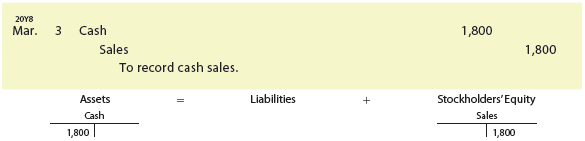</img>

| Date | Account | Debit | Credit |
|------|---------|-------|--------|
| Mar. 3 | Cash | 1,800 | |
| | Sales | | 1,800 |
| | *Record cash sales.* | | |

<table><thead>
  <tr>
    <th colspan="2">Assets</th>
    <th>=</th>
    <th colspan="2">Liabilities</th>
    <th>+</th>
    <th colspan="2">Stockholders' Equity</th>
  </tr></thead>
<tbody>
  <tr>
    <td colspan="2">Cash</td>
    <td rowspan="3"></td>
    <td colspan="2"></td>
    <td rowspan="3"></td>
    <td colspan="2">Sales</td>
  </tr>
  <tr>
    <td>debit</td>
    <td>credit</td>
    <td>debit</td>
    <td>credit</td>
    <td>debit</td>
    <td>credit</td>
  </tr>
  <tr>
    <td>1000</td>
    <td></td>
    <td></td>
    <td></td>
    <td></td>
    <td>1000</td>
  </tr>
</tbody>
</table>

Using the perpetual inventory system, the cost of goods sold and the decrease in inventory are also recorded. In this way, the inventory account indicates the amount of inventory on hand (not sold).

[Utilizando el sistema de inventario perpetuo, el costo de los bienes vendidos y la disminución del inventario también se registran. De esta manera, la cuenta de inventario indica la cantidad de inventario disponible (no vendido).]

To illustrate, assume that the cost of goods sold on March 3 is $1,200. The entry to record the cost of goods sold and the decrease in the inventory is as follows:

[Para ilustrar, suponga que el costo de los bienes vendidos el 3 de marzo es de $1,200. El asiento para registrar el costo de los bienes vendidos y la disminución del inventario es el siguiente:]

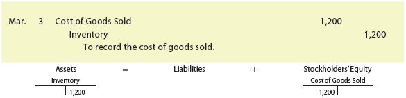</img>

| Date | Account | Debit | Credit |
|------|---------|-------|--------|
| Mar. 3 | Cost of Goods Sold | 1,200 | |
| | Inventory | | 1,200 |
| | *Record cost of goods sold.* | | |

<table><thead>
  <tr>
    <th colspan="2">Assets</th>
    <th>=</th>
    <th colspan="2">Liabilities</th>
    <th>+</th>
    <th colspan="2">Stockholders' Equity</th>
  </tr></thead>
<tbody>
  <tr>
    <td colspan="2">Inventory</td>
    <td rowspan="3"></td>
    <td colspan="2"></td>
    <td rowspan="3"></td>
    <td colspan="2">Cost of Goods Sold</td>
  </tr>
  <tr>
    <td>debit</td>
    <td>credit</td>
    <td>debit</td>
    <td>credit</td>
    <td>debit</td>
    <td>credit</td>
  </tr>
  <tr>
    <td></td>
    <td>1200</td>
    <td></td>
    <td></td>
    <td>1200</td>
    <td></td>
  </tr>
</tbody>
</table>

Sales may be made to customers using **debit cards** (Cards used for electronic payment by which the money required by the purchase is deducted instantly from the customer's bank account.), sometimes called **bank cards** (Cards used for electronic payment by which the money required by the purchase is deducted instantly from the customer's bank account.). When a customer uses a debit card, the money required by the purchase is deducted instantly from the customer's bank account. For this reason, debit card sales are recorded as cash sales.

[Las ventas pueden realizarse a clientes utilizando **tarjetas de débito** (tarjetas utilizadas para pagos electrónicos mediante los cuales el dinero requerido por la compra se deduce instantáneamente de la cuenta bancaria del cliente), a veces llamadas **tarjetas bancarias** (tarjetas utilizadas para pagos electrónicos mediante los cuales el dinero requerido por la compra se deduce instantáneamente de la cuenta bancaria del cliente). Cuando un cliente utiliza una tarjeta de débito, el dinero requerido por la compra se deduce instantáneamente de la cuenta bancaria del cliente. Por esta razón, las ventas con tarjeta de débito se registran como ventas al contado.]

Sales may also be made to customers using credit cards such as Mastercard or Visa. Credit card sales are normally processed by a clearinghouse that contacts the bank that issued the card. The issuing bank then electronically transfers cash directly to the retailer's bank account. Since the retailer normally receives cash within a few days of making the sale, credit card sales are also recorded as cash sales.

[Las ventas también pueden realizarse a clientes utilizando tarjetas de crédito como Mastercard o Visa. Las ventas con tarjeta de crédito normalmente son procesadas por una cámara de compensación que contacta al banco que emitió la tarjeta. El banco emisor luego transfiere electrónicamente efectivo directamente a la cuenta bancaria del minorista. Dado que el minorista normalmente recibe efectivo dentro de unos días de realizar la venta, las ventas con tarjeta de crédito también se registran como ventas al contado.]

---

## **Link to Dollar Tree:** 

Dollar Tree normally receives cash from credit card sales within three business days, and thus records credit card sales as cash sales.

[**Enlace a Dollar Tree:** Dollar Tree normalmente recibe efectivo de las ventas con tarjeta de crédito dentro de los tres días hábiles, y por lo tanto registra las ventas con tarjeta de crédito como ventas al contado.]

If a retailer allows customers to use debit or credit cards to pay for purchases, the retailer may be charged processing fees by the clearinghouse or issuing bank. Such fees are periodically recorded as an expense. To illustrate, assume that a company pays credit card processing fees of $4,150 on October 31. These fees would be recorded as follows:

[Si un minorista permite a los clientes usar tarjetas de débito o crédito para pagar las compras, el minorista puede ser cobrado por tarifas de procesamiento por la cámara de compensación o el banco emisor. Dichas tarifas se registran periódicamente como un gasto. Para ilustrar, suponga que una empresa paga tarifas de procesamiento de tarjetas de crédito de $4,150 el 31 de octubre. Estas tarifas se registrarían de la siguiente manera:]

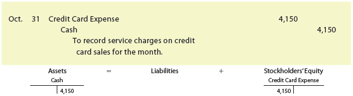</img>

| Date | Account | Debit | Credit |
|------|---------|-------|--------|
| Oct. 31 | Credit Card Expenses | 4,150 | |
| | Cash | | 4,150 |
| | *Record credit card Expenses.* | | |

<table><thead>
  <tr>
    <th colspan="2">Assets</th>
    <th>=</th>
    <th colspan="2">Liabilities</th>
    <th>+</th>
    <th colspan="2">Stockholders' Equity</th>
  </tr></thead>
<tbody>
  <tr>
    <td colspan="2">Cash</td>
    <td rowspan="3"></td>
    <td colspan="2"></td>
    <td rowspan="3"></td>
    <td colspan="2">Credit Card Expenses</td>
  </tr>
  <tr>
    <td>debit</td>
    <td>credit</td>
    <td>debit</td>
    <td>credit</td>
    <td>debit</td>
    <td>credit</td>
  </tr>
  <tr>
    <td></td>
    <td>4150</td>
    <td></td>
    <td></td>
    <td>4150</td>
    <td></td>
  </tr>
</tbody>
</table>

Instead of using Mastercard or Visa, a customer may use a credit card that is not issued by a bank. For example, a customer might use an American Express card. If the seller uses a clearinghouse, the clearinghouse will collect the receivable and transfer the cash to the retailer's bank account, similar to the way it would have if the customer had used Mastercard or Visa. Large businesses, however, may not use a clearinghouse. In such cases, nonbank credit card sales must first be reported to the card company before cash is received. Thus, a receivable is created with the nonbank credit card company. However, because most retailers use clearinghouses to process both bank and nonbank credit cards, all credit card sales will be recorded as cash sales.

[En lugar de usar Mastercard o Visa, un cliente puede usar una tarjeta de crédito que no es emitida por un banco. Por ejemplo, un cliente podría usar una tarjeta American Express. Si el vendedor usa una cámara de compensación, la cámara de compensación cobrará la cuenta por cobrar y transferirá el efectivo a la cuenta bancaria del minorista, similar a como lo habría hecho si el cliente hubiera usado Mastercard o Visa. Sin embargo, las grandes empresas pueden no usar una cámara de compensación. En tales casos, las ventas con tarjeta de crédito no bancarias deben primero ser reportadas a la compañía de tarjetas antes de recibir el efectivo. Por lo tanto, se crea una cuenta por cobrar con la compañía de tarjetas de crédito no bancarias. Sin embargo, debido a que la mayoría de los minoristas usan cámaras de compensación para procesar tanto tarjetas de crédito bancarias como no bancarias, todas las ventas con tarjeta de crédito se registrarán como ventas al contado.]

---

**Link to Dollar Tree:** Dollar Tree only accepts cash, checks, credit cards, and debit cards from its customers.

[**Enlace a Dollar Tree:** Dollar Tree solo acepta efectivo, cheques, tarjetas de crédito y tarjetas de débito de sus clientes.]

---

## Sales on Account

A retail business may sell merchandise on account. The seller records such sales as a debit to Accounts Receivable and a credit to Sales. To illustrate, assume that NetSolutions sold merchandise on account to Digital Technologies for $18,000, terms n/30. The cost of the merchandise sold was $10,800. NetSolutions would record the sale on account as follows:

[Un negocio minorista puede vender mercancía a crédito. El vendedor registra tales ventas como un débito a Cuentas por Cobrar y un crédito a Ventas. Para ilustrar, suponga que NetSolutions vendió mercancía a crédito a Digital Technologies por $18,000, términos n/30. El costo de la mercancía vendida fue de $10,800. NetSolutions registraría la venta a crédito de la siguiente manera:]

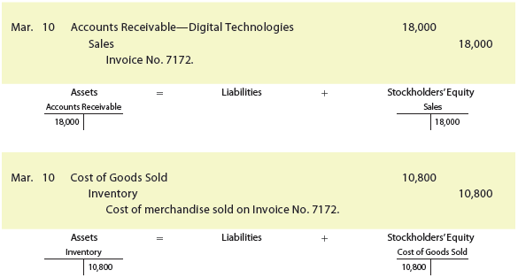</img>

| Date | Account | Debit | Credit |
|------|---------|-------|--------|
| Apr. 3 | Accounts Receivable | 18,000 | |
| | Sales | | 18,000 |
| | *Record sale on account.* | | |

<table><thead>
  <tr>
    <th colspan="2">Assets</th>
    <th>=</th>
    <th colspan="2">Liabilities</th>
    <th>+</th>
    <th colspan="2">Stockholders' Equity</th>
  </tr></thead>
<tbody>
  <tr>
    <td colspan="2">Accounts Receivable</td>
    <td rowspan="3"></td>
    <td colspan="2"></td>
    <td rowspan="3"></td>
    <td colspan="2">Sales</td>
  </tr>
  <tr>
    <td>debit</td>
    <td>credit</td>
    <td>debit</td>
    <td>credit</td>
    <td>debit</td>
    <td>credit</td>
  </tr>
  <tr>
    <td>18,000</td>
    <td></td>
    <td></td>
    <td></td>
    <td></td>
    <td>18,000</td>
  </tr>
</tbody>
</table>

| Date | Account | Debit | Credit |
|------|---------|-------|--------|
| Apr. 3 | Cost of Goods Sold | 10,800 | |
| | Inventory | | 10,800 |
| | *Record cost of goods sold.* | | |

<table><thead>
  <tr>
    <th colspan="2">Assets</th>
    <th>=</th>
    <th colspan="2">Liabilities</th>
    <th>+</th>
    <th colspan="2">Stockholders' Equity</th>
  </tr></thead>
<tbody>
  <tr>
    <td colspan="2">Inventory</td>
    <td rowspan="3"></td>
    <td colspan="2"></td>
    <td rowspan="3"></td>
    <td colspan="2">Cost of Goods Sold</td>
  </tr>
  <tr>
    <td>debit</td>
    <td>credit</td>
    <td>debit</td>
    <td>credit</td>
    <td>debit</td>
    <td>credit</td>
  </tr>
  <tr>
    <td></td>
    <td>10,800</td>
    <td></td>
    <td></td>
    <td>10,800</td>
    <td></td>
  </tr>
</tbody>
</table>

NetSolutions would record the receipt of Digital Technologies' payment on April 9 as follows:

[NetSolutions registraría la recepción del pago de Digital Technologies el 9 de abril de la siguiente manera:]

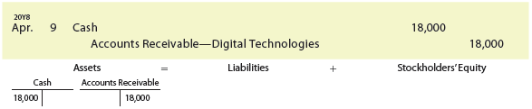</img>

| Date | Account | Debit | Credit |
|------|---------|-------|--------|
| Apr. 9 | Cash | 18,000 | |
| | Accounts Receivable | | 18,000 |
| | *Record receipt of payment.* | | |

<table><thead>
  <tr>
    <th colspan="4">Assets</th>
    <th>=</th>
    <th colspan="2">Liabilities</th>
    <th>+</th>
    <th colspan="2">Stockholders' Equity</th>
  </tr></thead>
<tbody>
  <tr>
    <td colspan="2">Cash</td>
    <td colspan="2">Accounts Receivable</td>
    <td rowspan="3"></td>
    <td colspan="2"></td>
    <td rowspan="3"></td>
    <td colspan="2"></td>
  </tr>
  <tr>
    <td>debit</td>
    <td>credit</td>
    <td>debit</td>
    <td>credit</td>
    <td>debit</td>
    <td>credit</td>
    <td>debit</td>
    <td>credit</td>
  </tr>
  <tr>
    <td>18,000</td>
    <td></td>
    <td></td>
    <td>18,000</td>
    <td></td>
    <td></td>
    <td></td>
    <td></td>
  </tr>
</tbody>
</table>

---

## **Link to Dollar Tree:** 
Because Dollar Tree does not sell merchandise to customers on account, but only accepts cash, checks, credit cards, and debit cards, it did not report any accounts receivable on a recent balance sheet.

[**Enlace a Dollar Tree:** Debido a que Dollar Tree no vende mercancía a crédito a los clientes, sino que solo acepta efectivo, cheques, tarjetas de crédito y tarjetas de débito, no reportó cuentas por cobrar en un balance general reciente.]

---

## Sales Incentives, Promotions, and Discounts

Retailers frequently offer sales incentives, promotions, and discounts to increase sales. For example, a seller might offer customers discounts to purchase early or in large volumes. Discounts may also be offered to encourage customers to pay early. The accounting for these types of sales discounts is discussed in Appendix 1 at the end of this chapter.

[Los minoristas ofrecen con frecuencia incentivos de ventas, promociones y descuentos para aumentar las ventas. Por ejemplo, un vendedor podría ofrecer a los clientes descuentos por comprar temprano o en grandes volúmenes. También se pueden ofrecer descuentos para alentar a los clientes a pagar temprano. La contabilidad de estos tipos de descuentos en ventas se discute en el Apéndice 1 al final de este capítulo.]

Sales incentives and promotions are often distributed by retailers through newspapers, magazines, the Internet, and direct mailings. Such incentives and promotions often take the form of coupons and rebates. A **coupon** (A sales incentive or promotion that provides the customer a discount when purchasing a product.) provides the customer a discount when purchasing a product(s). A **rebate** (A sales incentive or promotion that provides the customer a refund after the product is purchased.) provides the customer a refund after the product is purchased. The accounting for a coupon or rebate depends upon its terms and how it can be redeemed by the customer.

[Los incentivos y promociones de ventas a menudo son distribuidos por los minoristas a través de periódicos, revistas, Internet y correo directo. Tales incentivos y promociones a menudo toman la forma de cupones y reembolsos. Un **cupón** (un incentivo o promoción de ventas que proporciona al cliente un descuento al comprar un producto) proporciona al cliente un descuento al comprar un producto(s). Un **reembolso** (un incentivo o promoción de ventas que proporciona al cliente un reembolso después de que se compra el producto) proporciona al cliente un reembolso después de que se compra el producto. La contabilidad de un cupón o reembolso depende de sus términos y de cómo puede ser canjeado por el cliente.]

A coupon has no value and the retailer has no obligation until a customer purchases merchandise and presents the coupon. As a result, no liability (journal entry) is recorded by the retailer when the coupon is issued. Instead, the retailer reduces sales (revenue) by the amount of the coupon at the time of sale. These types of coupons are commonly issued by companies such as Bed Bath & Beyond (BBBY) and Michaels (MIK) and are referred to as **point-of-sale coupons** (Coupons that have no value and the retailer has no obligation until a customer purchases merchandise and presents the coupon.).

[Un cupón no tiene valor y el minorista no tiene obligación hasta que un cliente compra mercancía y presenta el cupón. Como resultado, el minorista no registra ningún pasivo (asiento de diario) cuando se emite el cupón. En cambio, el minorista reduce las ventas (ingresos) por el monto del cupón en el momento de la venta. Estos tipos de cupones son comúnmente emitidos por empresas como Bed Bath & Beyond (BBBY) y Michaels (MIK) y se conocen como **cupones de punto de venta** (cupones que no tienen valor y el minorista no tiene obligación hasta que un cliente compra mercancía y presenta el cupón).]

To illustrate, assume Welborn Stores offers a coupon on its website for $3 off the customer's next purchase of $15 or more. Assume that Becky Lewis purchases $45 of merchandise, submits the $3 coupon, and pays cash. The $3 coupon reduces the revenue from the sale from $45 to $42 ($45 – $3 coupon). Assuming the merchandise cost Welborn Stores $27, the sale would be recorded as follows:

[Para ilustrar, suponga que Welborn Stores ofrece un cupón en su sitio web por $3 de descuento en la próxima compra del cliente de $15 o más. Suponga que Becky Lewis compra $45 de mercancía, presenta el cupón de $3 y paga en efectivo. El cupón de $3 reduce los ingresos de la venta de $45 a $42 ($45 – $3 del cupón). Suponiendo que la mercancía le costó a Welborn Stores $27, la venta se registraría de la siguiente manera:]

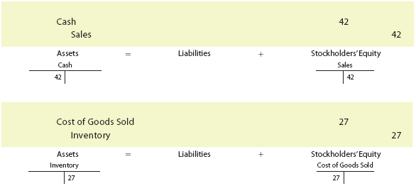</img>

| Date | Account | Debit | Credit |
|------|---------|-------|--------|
| | Cash | 42 | |
| | Sales | | 42 |
| | *Record cash sale with coupon.* | | |

<table><thead>
  <tr>
    <th colspan="2">Assets</th>
    <th>=</th>
    <th colspan="2">Liabilities</th>
    <th>+</th>
    <th colspan="2">Stockholders' Equity</th>
  </tr></thead>
<tbody>
  <tr>
    <td colspan="2">Cash</td>
    <td rowspan="3"></td>
    <td colspan="2"></td>
    <td rowspan="3"></td>
    <td colspan="2">Sales</td>
  </tr>
  <tr>
    <td>debit</td>
    <td>credit</td>
    <td>debit</td>
    <td>credit</td>
    <td>debit</td>
    <td>credit</td>
  </tr>
  <tr>
    <td>42</td>
    <td></td>
    <td></td>
    <td></td>
    <td></td>
    <td>42</td>
  </tr>
</tbody>
</table>

| Date | Account | Debit | Credit |
|------|---------|-------|--------|
| | Cost of Goods Sold | 27 | |
| | Inventory | | 27 |
| | *Record cost of goods sold.* | | |

<table><thead>
  <tr>
    <th colspan="2">Assets</th>
    <th>=</th>
    <th colspan="2">Liabilities</th>
    <th>+</th>
    <th colspan="2">Stockholders' Equity</th>
  </tr></thead>
<tbody>
  <tr>
    <td colspan="2">Inventory</td>
    <td rowspan="3"></td>
    <td colspan="2"></td>
    <td rowspan="3"></td>
    <td colspan="2">Cost of Goods Sold</td>
  </tr>
  <tr>
    <td>debit</td>
    <td>credit</td>
    <td>debit</td>
    <td>credit</td>
    <td>debit</td>
    <td>credit</td>
  </tr>
  <tr>
    <td></td>
    <td>27</td>
    <td></td>
    <td></td>
    <td>27</td>
    <td></td>
  </tr>
</tbody>
</table>

If instead of $3 off, the coupon had been for 10% off, Welborn Stores would have recorded a sale of $40.50 [$45 – ($45 × 10%)]. In both cases, the coupon reduces revenue at the time of sale.

[Si en lugar de $3 de descuento, el cupón hubiera sido del 10% de descuento, Welborn Stores habría registrado una venta de $40.50 [$45 – ($45 × 10%)]. En ambos casos, el cupón reduce los ingresos en el momento de la venta.]

In contrast, assume that a coupon is issued when customers purchase merchandise. The coupon appears on the bottom of the customer's sales receipt and may be redeemed for future purchases. In this case, when the retailer sold the merchandise, it incurred a future obligation (liability) to the customer. As a result, the retailer must estimate the dollar value of coupons that will be redeemed, reduce sales, and record a related liability.

[En contraste, suponga que se emite un cupón cuando los clientes compran mercancía. El cupón aparece en la parte inferior del recibo de venta del cliente y puede ser canjeado para compras futuras. En este caso, cuando el minorista vendió la mercancía, incurrió en una obligación futura (pasivo) con el cliente. Como resultado, el minorista debe estimar el valor en dólares de los cupones que serán canjeados, reducir las ventas y registrar un pasivo relacionado.]

To illustrate, assume that to stimulate summer sales Grande Stores prints a coupon on the bottom of its May 20Y6 sales receipts for $3 off the customer's next purchase of over $20. The coupons may be redeemed June 1 – August 31, 20Y6. During May, Grande Stores sold merchandise for $40,000,000, which generated 6,000,000 sales receipts. The cost of the merchandise sold was $21,500,000. Grande Stores estimates that 20% of the coupons will be redeemed before they expire on August 31. If Grande Stores accepts only cash, Visa, or Mastercard, it would record its May 20Y6 sales as follows:

[Para ilustrar, suponga que para estimular las ventas de verano, Grande Stores imprime un cupón en la parte inferior de sus recibos de ventas de mayo de 20Y6 por $3 de descuento en la próxima compra del cliente de más de $20. Los cupones pueden canjearse del 1 de junio al 31 de agosto de 20Y6. Durante mayo, Grande Stores vendió mercancía por $40,000,000, lo que generó 6,000,000 de recibos de ventas. El costo de la mercancía vendida fue de $21,500,000. Grande Stores estima que el 20% de los cupones serán canjeados antes de que expiren el 31 de agosto. Si Grande Stores acepta solo efectivo, Visa o Mastercard, registraría sus ventas de mayo de 20Y6 de la siguiente manera:]

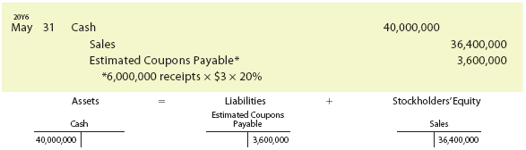</img>

| Date | Account | Debit | Credit |
|---|---|---|---|
| May 31 | Cash | 40,000,000 |  |
|  | Sales |  | 36,400,000 |
|  | Estimated Coupons Payable |  | 3,600,000 |
|  | **Record estimated coupon liability.* *6,000,000 recelpts x $3 x 20%** |  |  |

<table><thead>
  <tr>
    <th colspan="2">Assets</th>
    <th>=</th>
    <th colspan="2">Liabilities</th>
    <th>+</th>
    <th colspan="2">Stockholders' Equity</th>
  </tr></thead>
<tbody>
  <tr>
    <td colspan="2">Cash</td>
    <td rowspan="3"></td>
    <td colspan="2">Estimated Coupons Payable</td>
    <td rowspan="3"></td>
    <td colspan="2">Sales</td>
  </tr>
  <tr>
    <td>debit</td>
    <td>credit</td>
    <td>debit</td>
    <td>credit</td>
    <td>debit</td>
    <td>credit</td>
  </tr>
  <tr>
    <td>40,000,000</td>
    <td></td>
    <td></td>
    <td>3,600,000</td>
    <td></td>
    <td>36,400,000</td>
  </tr>
</tbody>
</table>

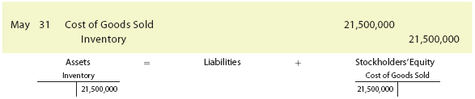</img>

| Date | Account | Debit | Credit |
|---|---|---|---|
| May 31 | Cost of Goods Sold | 21,500,000 |  |
|  | Inventory |  | 21,500,000 |
|  | **Record cost of goods sold.** |  |  |

<table><thead>
  <tr>
    <th colspan="2">Assets</th>
    <th>=</th>
    <th colspan="2">Liabilities</th>
    <th>+</th>
    <th colspan="2">Stockholders' Equity</th>
  </tr></thead>
<tbody>
  <tr>
    <td colspan="2">Inventory</td>
    <td rowspan="3"></td>
    <td colspan="2"></td>
    <td rowspan="3"></td>
    <td colspan="2">Cost of Goods Sold</td>
  </tr>
  <tr>
    <td>debit</td>
    <td>credit</td>
    <td>debit</td>
    <td>credit</td>
    <td>debit</td>
    <td>credit</td>
  </tr>
  <tr>
    <td></td>
    <td>21,500,000</td>
    <td></td>
    <td></td>
    <td>21,500,000</td>
    <td></td>
  </tr>
</tbody>
</table>

As of May 31, 20Y6, Grande Stores has incurred a current liability, called **Estimated Coupons Payable** (A current liability account for the estimated amount of coupons printed out with sales receipts that will be redeemed by customers.), to its May customers who may redeem its $3 coupons. Since it is estimated that only 20% of its May customers will redeem a coupon, 1,200,000 coupons (6,000,000 sales receipts × 20%) are estimated to be redeemed. Because each coupon is for $3, the estimated coupon liability is $3,600,000 (1,200,000 coupons × $3). This estimated liability reduces the gross sales of $40,000,000 to $36,400,000 ($40,000,000 – $3,600,000).

[Al 31 de mayo de 20Y6, Grande Stores ha incurrido en un pasivo corriente, llamado **Cupones Estimados por Pagar** (una cuenta de pasivo corriente por el monto estimado de cupones impresos con los recibos de ventas que serán canjeados por los clientes), a sus clientes de mayo que pueden canjear sus cupones de $3. Dado que se estima que solo el 20% de sus clientes de mayo canjearán un cupón, se estima que se canjearán 1,200,000 cupones (6,000,000 de recibos de ventas × 20%). Debido a que cada cupón es por $3, el pasivo estimado por cupones es de $3,600,000 (1,200,000 cupones × $3). Este pasivo estimado reduce las ventas brutas de $40,000,000 a $36,400,000 ($40,000,000 – $3,600,000).]

When customers redeem the coupons, the Estimated Coupons Payable is decreased. To illustrate, assume that during June, Grande Stores sold $52,500,000 of merchandise that cost $28,100,000 and that 800,000 of the May coupons were redeemed. Grande Stores would record its June sales as follows:

[Cuando los clientes canjean los cupones, los Cupones Estimados por Pagar disminuyen. Para ilustrar, suponga que durante junio, Grande Stores vendió $52,500,000 de mercancía que costó $28,100,000 y que se canjearon 800,000 de los cupones de mayo. Grande Stores registraría sus ventas de junio de la siguiente manera:]

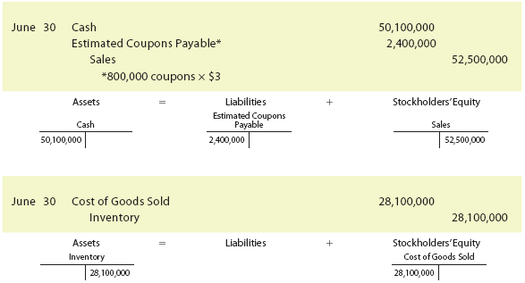</img>

| Date | Account | Debit | Credit |
|---|---|---|---|
| June 30 | Cash | 50,100,000 |  |
|  | Estimated Coupons Payable | 2,400,000 |  |
|  | Sales |  | 52,500,000 |
|  | **800,000 coupons x $3 Record redemption of coupons.** |  |  |

<table><thead>
  <tr>
    <th colspan="2">Assets</th>
    <th>=</th>
    <th colspan="2">Liabilities</th>
    <th>+</th>
    <th colspan="2">Stockholders' Equity</th>
  </tr></thead>
<tbody>
  <tr>
    <td colspan="2">Cash</td>
    <td rowspan="3"></td>
    <td colspan="2">Estimated Coupons Payable</td>
    <td rowspan="3"></td>
    <td colspan="2">Sales</td>
  </tr>
  <tr>
    <td>debit</td>
    <td>credit</td>
    <td>debit</td>
    <td>credit</td>
    <td>debit</td>
    <td>credit</td>
  </tr>
  <tr>
    <td>50,100,000</td>
    <td></td>
    <td>2,400,000</td>
    <td></td>
    <td></td>
    <td>52,500,000</td>
  </tr>
</tbody>
</table>

| Date | Account | Debit | Credit |
|---|---|---|---|
| June 30 | Cost of Goods Sold | 28,100,000 |  |
|  | Inventory |  | 28,100,000 |
|  | Record cost of goods sold. |  |  |

<table><thead>
  <tr>
    <th colspan="2">Assets</th>
    <th>=</th>
    <th colspan="2">Liabilities</th>
    <th>+</th>
    <th colspan="2">Stockholders' Equity</th>
  </tr></thead>
<tbody>
  <tr>
    <td colspan="2">Inventory</td>
    <td rowspan="3"></td>
    <td colspan="2"></td>
    <td rowspan="3"></td>
    <td colspan="2">Cost of Goods Sold</td>
  </tr>
  <tr>
    <td>debit</td>
    <td>credit</td>
    <td>debit</td>
    <td>credit</td>
    <td>debit</td>
    <td>credit</td>
  </tr>
  <tr>
    <td></td>
    <td>28,100,000</td>
    <td></td>
    <td></td>
    <td>28,100,000</td>
    <td></td>
  </tr>
</tbody>
</table>

Grande Stores would record its July and August sales in a similar manner.

[Grande Stores registraría sus ventas de julio y agosto de manera similar.]

Since the May coupon liability is based on an estimate, Estimated Coupons Payable may have a balance on August 31, 20Y6. To illustrate, assume that on August 31, 20Y6, Estimated Coupons Payable has a credit balance of $175,000. Since the coupon period has expired, Grande Stores does not have any further coupon liability to its customers. As a result, the Estimated Coupons Payable credit balance of $175,000 should be added back to Sales as follows:

[Dado que el pasivo por cupones de mayo se basa en una estimación, los Cupones Estimados por Pagar pueden tener un saldo al 31 de agosto de 20Y6. Para ilustrar, suponga que al 31 de agosto de 20Y6, los Cupones Estimados por Pagar tienen un saldo acreedor de $175,000. Dado que el período de cupones ha expirado, Grande Stores no tiene más pasivo por cupones con sus clientes. Como resultado, el saldo acreedor de Cupones Estimados por Pagar de $175,000 debe agregarse nuevamente a Ventas de la siguiente manera:]

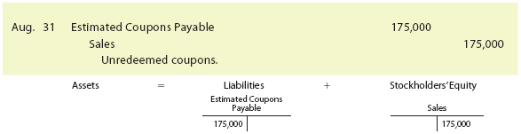</img>

| Date | Account | Debit | Credit |
|------|---------|-------|--------|
| Aug. 31 | Estimated Coupons Payable | 175,000 | |
| | Sales | | 175,000 |
| | *Record expiration of coupon liability.* | | |

<table><thead>
  <tr>
    <th colspan="2">Assets</th>
    <th>=</th>
    <th colspan="2">Liabilities</th>
    <th>+</th>
    <th colspan="2">Stockholders' Equity</th>
    <th></th>
  </tr></thead>
<tbody>
  <tr>
    <td colspan="2"></td>
    <td rowspan="3"></td>
    <td colspan="2">Estimated Coupons Payable</td>
    <td rowspan="3"></td>
    <td colspan="2">Sales</td>
    <td></td>
  </tr>
  <tr>
    <td>debit</td>
    <td>credit</td>
    <td>debit</td>
    <td>credit</td>
    <td>debit</td>
    <td>credit</td>
    <td></td>
  </tr>
  <tr>
    <td></td>
    <td></td>
    <td>175,000</td>
    <td></td>
    <td></td>
    <td>175,000</td>
    <td></td>
  </tr>
</tbody>
</table>

If on August 31, 20Y6, Estimated Coupons Payable had a debit balance of $50,000, Grande Stores would have underestimated the percent of coupons that were redeemed. As a result, Grande Stores would decrease its Sales by making the following entry on August 31:

[Si al 31 de agosto de 20Y6, los Cupones Estimados por Pagar tuvieran un saldo deudor de $50,000, Grande Stores habría subestimado el porcentaje de cupones que se canjearon. Como resultado, Grande Stores disminuiría sus Ventas haciendo el siguiente asiento el 31 de agosto:]

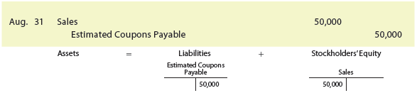</img>

| Date | Account | Debit | Credit |
|------|---------|-------|--------|
| Aug. 31 | Sales | 50,000 | |
| | Estimated Coupons Payable | | 50,000 |
| | *Record additional coupon liability.* | | |

<table><thead>
  <tr>
    <th colspan="2">Assets</th>
    <th>=</th>
    <th colspan="2">Liabilities</th>
    <th>+</th>
    <th colspan="2">Stockholders' Equity</th>
    <th></th>
  </tr></thead>
<tbody>
  <tr>
    <td colspan="2"></td>
    <td rowspan="3"></td>
    <td colspan="2">Estimated Coupons Payable</td>
    <td rowspan="3"></td>
    <td colspan="2">Sales</td>
    <td></td>
  </tr>
  <tr>
    <td>debit</td>
    <td>credit</td>
    <td>debit</td>
    <td>credit</td>
    <td>debit</td>
    <td>credit</td>
    <td></td>
  </tr>
  <tr>
    <td></td>
    <td></td>
    <td></td>
    <td>50,000</td>
    <td>50,000</td>
    <td></td>
    <td></td>
  </tr>
</tbody>
</table>

After the coupon period has expired, Estimated Coupons Payable should have a zero balance.

[Después de que el período de cupones ha expirado, los Cupones Estimados por Pagar deben tener un saldo cero.]

Rebates normally entitle customers to receive cash if they mail in a coupon, receipt of purchase, and barcode from the item purchased. Mail-in rebates are normally distributed to customers in the form of a check or pre-loaded Visa or Mastercard. Retailers often advertise merchandise net of the rebate. For example, Mike's Appliances might advertise a Whirlpool side-by-side refrigerator with a retail list price of $1,799 for $1,499 with a $300 mail-in rebate.

[Los reembolsos normalmente dan derecho a los clientes a recibir efectivo si envían por correo un cupón, el recibo de compra y el código de barras del artículo comprado. Los reembolsos por correo normalmente se distribuyen a los clientes en forma de cheque o tarjeta Visa o Mastercard precargada. Los minoristas a menudo anuncian la mercancía neta del reembolso. Por ejemplo, Mike's Appliances podría anunciar un refrigerador Whirlpool side-by-side con un precio de lista de $1,799 por $1,499 con un reembolso por correo de $300.]

The accounting for rebates is similar to that for coupons.

[La contabilidad de los reembolsos es similar a la de los cupones.]

**Instant rebates** (Rebates that may be redeemed at the time of purchase), which are redeemed at the time of purchase, reduce the revenue at the time of sale. Mail-in rebates require the retailer to estimate the dollar value of rebates that will be redeemed, reduce sales, and record a related liability.

[Los **reembolsos instantáneos** (reembolsos que pueden canjearse en el momento de la compra), que se canjean en el momento de la compra, reducen los ingresos en el momento de la venta. Los reembolsos por correo requieren que el minorista estime el valor en dólares de los reembolsos que se canjearán, reduzca las ventas y registre un pasivo relacionado.]

---

## Sales Returns, Refunds, and Allowances

A buyer may return merchandise that is defective, damaged during shipment, or does not meet the buyer's expectations. If the buyer has already paid for the merchandise, the seller may pay the buyer a **cash refund** (An amount paid by the seller to the buyer for merchandise that is defective, is damaged during shipment, or does not meet the buyer's expectations.). If the buyer has an outstanding accounts receivable with the seller, the buyer may request an offset against the accounts receivable. A buyer could also keep the merchandise and request a partial refund or price allowance.

[Un comprador puede devolver la mercancía que está defectuosa, dañada durante el envío o que no cumple con las expectativas del comprador. Si el comprador ya ha pagado por la mercancía, el vendedor puede pagar al comprador un **reembolso en efectivo** (un monto pagado por el vendedor al comprador por mercancía que está defectuosa, dañada durante el envío o que no cumple con las expectativas del comprador). Si el comprador tiene una cuenta por cobrar pendiente con el vendedor, el comprador puede solicitar una compensación contra la cuenta por cobrar. Un comprador también podría quedarse con la mercancía y solicitar un reembolso parcial o una bonificación de precio.]

---

## **Link to Dollar Tree:** 

Dollar Tree does not offer refunds; all sales are final.

[**Enlace a Dollar Tree:** Dollar Tree no ofrece reembolsos; todas las ventas son finales.]

At the end of the accounting period, a seller must estimate the amount of returns, refunds, and allowances that may have to be issued to customers in the future. Based upon this estimate, sellers record two adjusting entries:

[Al final del período contable, un vendedor debe estimar el monto de devoluciones, reembolsos y bonificaciones que pueden tener que emitirse a los clientes en el futuro. Con base en esta estimación, los vendedores registran dos asientos de ajuste:]

1. The first adjusting entry decreases (debits) Sales and increases (credits) Customer Refunds Payable for the estimated refunds and allowances that will be granted to customers in the future. **Customer Refunds Payable** (A liability account for estimated refunds and allowances that will be paid or granted to customers in the future.) is a current liability for refunds and allowances that will be granted to customers.

[1. El primer asiento de ajuste disminuye (debita) Ventas y aumenta (acredita) Reembolsos a Clientes por Pagar por los reembolsos y bonificaciones estimados que se concederán a los clientes en el futuro. **Reembolsos a Clientes por Pagar** (una cuenta de pasivo para reembolsos y bonificaciones estimados que se pagarán o concederán a los clientes en el futuro) es un pasivo corriente por reembolsos y bonificaciones que se concederán a los clientes.]

2. The second adjusting entry increases (debits) Estimated Returns Inventory for merchandise that is expected to be returned and decreases (credits) Cost of Goods Sold. **Estimated Returns Inventory** (A current asset account for the estimated amount of merchandise that will be returned by customers.) is a current asset for merchandise that is expected to be returned by customers.

[2. El segundo asiento de ajuste aumenta (debita) Inventario de Devoluciones Estimadas por la mercancía que se espera sea devuelta y disminuye (acredita) Costo de Bienes Vendidos. **Inventario de Devoluciones Estimadas** (una cuenta de activo corriente por el monto estimado de mercancía que será devuelta por los clientes) es un activo corriente por la mercancía que se espera sea devuelta por los clientes.]

To illustrate, assume that on December 31, 20Y7, NetSolutions estimates that from 20Y7 sales it will have to refund or grant customers allowances of $7,000 during 20Y8. In addition, NetSolutions estimates that $5,500 of merchandise will be returned. Based upon these estimates, NetSolutions would record the following two adjusting entries on December 31, 20Y7:

[Para ilustrar, suponga que el 31 de diciembre de 20Y7, NetSolutions estima que de las ventas de 20Y7 tendrá que reembolsar o conceder bonificaciones a los clientes por $7,000 durante 20Y8. Además, NetSolutions estima que se devolverán $5,500 de mercancía. Con base en estas estimaciones, NetSolutions registraría los siguientes dos asientos de ajuste el 31 de diciembre de 20Y7:]

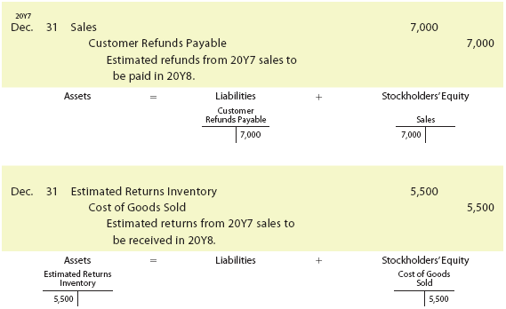</img>

| Date | Account | Debit | Credit |
|------|---------|-------|--------|
| Dec. 31 | Sales | 7,000 | |
| | Customer Refunds Payable | | 7,000 |
| | *Record estimated customer refunds and allowances.* | | |

<table><thead>
  <tr>
    <th colspan="2">Assets</th>
    <th>=</th>
    <th colspan="2">Liabilities</th>
    <th>+</th>
    <th colspan="2">Stockholders' Equity</th>
    <th></th>
  </tr></thead>
<tbody>
  <tr>
    <td colspan="2"></td>
    <td rowspan="3"></td>
    <td colspan="2">Customer Refunds Payable</td>
    <td rowspan="3"></td>
    <td colspan="2">Sales</td>
    <td></td>
  </tr>
  <tr>
    <td>debit</td>
    <td>credit</td>
    <td>debit</td>
    <td>credit</td>
    <td>debit</td>
    <td>credit</td>
    <td></td>
  </tr>
  <tr>
    <td></td>
    <td></td>
    <td></td>
    <td>7,000</td>
    <td>7,000</td>
    <td></td>
    <td></td>
  </tr>
</tbody>
</table>

| Date | Account | Debit | Credit |
|------|---------|-------|--------|
| Dec. 31 | Estimated Returns Inventory | 5,500 | |
| | Cost of Goods Sold | | 5,500 |
| | *Record estimated returns inventory.* | | |

<table><thead>
  <tr>
    <th colspan="2">Assets</th>
    <th>=</th>
    <th colspan="2">Liabilities</th>
    <th>+</th>
    <th colspan="2">Stockholders' Equity</th>
    <th></th>
  </tr></thead>
<tbody>
  <tr>
    <td colspan="2">Estimated Returns Inventory</td>
    <td rowspan="3"></td>
    <td colspan="2"></td>
    <td rowspan="3"></td>
    <td colspan="2">Cost of Goods Sold</td>
    <td></td>
  </tr>
  <tr>
    <td>debit</td>
    <td>credit</td>
    <td>debit</td>
    <td>credit</td>
    <td>debit</td>
    <td>credit</td>
    <td></td>
  </tr>
  <tr>
    <td>5,500</td>
    <td></td>
    <td></td>
    <td></td>
    <td></td>
    <td>5,500</td>
    <td></td>
  </tr>
</tbody>
</table>

The first journal entry decreases 20Y7 sales to an amount that is expected to be received from customers and establishes a related liability for customer refunds and allowances. The second journal entry recognizes the inventory that is expected to be returned and decreases the related cost of goods sold.

[El primer asiento de diario disminuye las ventas de 20Y7 a un monto que se espera recibir de los clientes y establece un pasivo relacionado por reembolsos y bonificaciones a clientes. El segundo asiento de diario reconoce el inventario que se espera sea devuelto y disminuye el costo de bienes vendidos relacionado.]

Assume that on March 4, 20Y8, Blake & Sons returned merchandise to NetSolutions with a selling price of $1,800 for a full cash refund. The merchandise originally cost NetSolutions $875. NetSolutions would record the cash refund and the return with the following two entries:

[Suponga que el 4 de marzo de 20Y8, Blake & Sons devolvió mercancía a NetSolutions con un precio de venta de $1,800 por un reembolso completo en efectivo. La mercancía originalmente le costó a NetSolutions $875. NetSolutions registraría el reembolso en efectivo y la devolución con los siguientes dos asientos:]

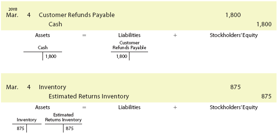</img>

| Date | Account | Debit | Credit |
|------|---------|-------|--------|
| Mar. 4 | Customer Refunds Payable | 1,800 | |
| | Cash | | 1,800 |
| | *Record cash refund.* | | |

<table><thead>
  <tr>
    <th colspan="2">Assets</th>
    <th>=</th>
    <th colspan="2">Liabilities</th>
    <th>+</th>
    <th colspan="2">Stockholders' Equity</th>
    <th></th>
  </tr></thead>
<tbody>
  <tr>
    <td colspan="2">Cash</td>
    <td rowspan="3"></td>
    <td colspan="2">Customer Refunds Payable</td>
    <td rowspan="3"></td>
    <td colspan="2"></td>
    <td></td>
  </tr>
  <tr>
    <td>debit</td>
    <td>credit</td>
    <td>debit</td>
    <td>credit</td>
    <td>debit</td>
    <td>credit</td>
    <td></td>
  </tr>
  <tr>
    <td></td>
    <td>1,800</td>
    <td>1,800</td>
    <td></td>
    <td></td>
    <td></td>
    <td></td>
  </tr>
</tbody>
</table>

| Date | Account | Debit | Credit |
|------|---------|-------|--------|
| Mar. 4 | Inventory | 875 | |
| | Estimated Returns Inventory | | 875 |
| | *Record receipt of returned merchandise.* | | |

<table><thead>
  <tr>
    <th colspan="4">Assets</th>
    <th>=</th>
    <th colspan="2">Liabilities</th>
    <th>+</th>
    <th colspan="2">Stockholders' Equity</th>
  </tr></thead>
<tbody>
  <tr>
    <td colspan="2">Inventory</td>
    <td colspan="2">Estimated Returns Inventory</td>
    <td rowspan="3"></td>
    <td colspan="2"></td>
    <td rowspan="3"></td>
    <td colspan="2"></td>
  </tr>
  <tr>
    <td>debit</td>
    <td>credit</td>
    <td>debit</td>
    <td>credit</td>
    <td>debit</td>
    <td>credit</td>
    <td>debit</td>
    <td>credit</td>
  </tr>
  <tr>
    <td>875</td>
    <td></td>
    <td></td>
    <td>875</td>
    <td></td>
    <td></td>
    <td></td>
    <td></td>
  </tr>
</tbody>
</table>

The first entry records the cash refund payment of $1,800. The second entry records the receipt of the $875 of returned merchandise by debiting Inventory and crediting Estimated Returns Inventory.

[El primer asiento registra el pago del reembolso en efectivo de $1,800. El segundo asiento registra la recepción de los $875 de mercancía devuelta debitando Inventario y acreditando Inventario de Devoluciones Estimadas.]

A buyer who has already paid for merchandise may decide to keep the merchandise and accept a partial refund from the seller. To illustrate, assume that in the prior example Blake & Sons agrees to keep the merchandise in return for a partial refund of $900 from NetSolutions. In this case, NetSolutions would record the partial cash refund to Blake & Sons as follows:

[Un comprador que ya ha pagado por la mercancía puede decidir quedarse con la mercancía y aceptar un reembolso parcial del vendedor. Para ilustrar, suponga que en el ejemplo anterior Blake & Sons acepta quedarse con la mercancía a cambio de un reembolso parcial de $900 de NetSolutions. En este caso, NetSolutions registraría el reembolso parcial en efectivo a Blake & Sons de la siguiente manera:]

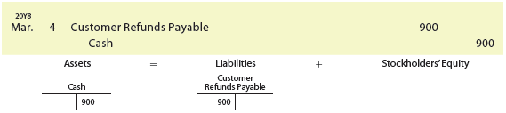</img>

| Date | Account | Debit | Credit |
|------|---------|-------|--------|
| Mar. 4 | Customer Refunds Payable | 900 | |
| | Cash | | 900 |
| | *Record partial cash refund.* | | |

<table><thead>
  <tr>
    <th colspan="2">Assets</th>
    <th>=</th>
    <th colspan="2">Liabilities</th>
    <th>+</th>
    <th colspan="2">Stockholders' Equity</th>
    <th></th>
  </tr></thead>
<tbody>
  <tr>
    <td colspan="2">Cash</td>
    <td rowspan="3"></td>
    <td colspan="2">Customer Refunds Payable</td>
    <td rowspan="3"></td>
    <td colspan="2"></td>
    <td></td>
  </tr>
  <tr>
    <td>debit</td>
    <td>credit</td>
    <td>debit</td>
    <td>credit</td>
    <td>debit</td>
    <td>credit</td>
    <td></td>
  </tr>
  <tr>
    <td></td>
    <td>900</td>
    <td>900</td>
    <td></td>
    <td></td>
    <td></td>
    <td></td>
  </tr>
</tbody>
</table>

A buyer who receives defective or damaged merchandise may not have paid for the merchandise. In other words, the seller has an outstanding account receivable balance due from the buyer. In this case, the seller may grant a **sales allowance** (A reduction in a customer's account receivable granted due to damaged or defective merchandise.) against the customer's account receivable. When this is done, the seller sends the buyer a **credit memorandum** (A form used by a seller to inform the buyer of the amount the seller proposes to credit to the account receivable due from the buyer.), or **credit memo** (A form used by a seller to inform the buyer of the amount the seller proposes to credit to the account receivable due from the buyer.), indicating its intent to credit the customer's account receivable.

[Un comprador que recibe mercancía defectuosa o dañada puede no haber pagado por la mercancía. En otras palabras, el vendedor tiene un saldo pendiente de cuenta por cobrar del comprador. En este caso, el vendedor puede conceder una **bonificación por venta** (una reducción en la cuenta por cobrar del cliente concedida debido a mercancía dañada o defectuosa) contra la cuenta por cobrar del cliente. Cuando esto se hace, el vendedor envía al comprador un **memorándum de crédito** (un formulario utilizado por un vendedor para informar al comprador del monto que el vendedor propone acreditar a la cuenta por cobrar del comprador), o **nota de crédito** (un formulario utilizado por un vendedor para informar al comprador del monto que el vendedor propone acreditar a la cuenta por cobrar del comprador), indicando su intención de acreditar la cuenta por cobrar del cliente.]

Assume that instead of returning the merchandise, Blake & Sons agrees to accept a sales allowance of $900. NetSolutions notifies Blake & Sons of its granting of the allowance by issuing the credit memo shown in Exhibit 6.

[Suponga que en lugar de devolver la mercancía, Blake & Sons acepta una bonificación por venta de $900. NetSolutions notifica a Blake & Sons de la concesión de la bonificación emitiendo la nota de crédito que se muestra en la Figura 6.]

---

## Exhibit 6

### Credit Memo

[**Figura 6** - Nota de Crédito]

<!-- 📍 IMAGEN: Exhibit 6 - Credit Memo (páginas 8-9) -->

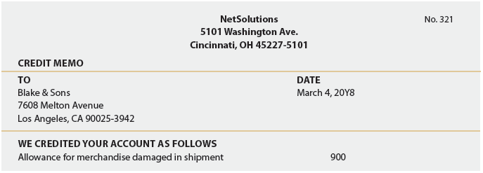

<table><tbody>
  <tr>
    <td colspan="2">NetSolutions</td>
    <td>No. 321</td>
  </tr>
  <tr>
    <td colspan="2">5101 Washington Ave.</td>
    <td></td>
  </tr>
  <tr>
    <td colspan="2">Cincinnati, OH 45227-5101</td>
    <td></td>
  </tr>
  <tr>
    <td>CREDIT MEMO</td>
    <td></td>
    <td></td>
  </tr>
  <tr>
    <td>TO</td>
    <td>DATE</td>
    <td></td>
  </tr>
  <tr>
    <td>Blake &amp; Sons</td>
    <td>March 4, 20Y8</td>
    <td></td>
  </tr>
  <tr>
    <td>3600 Westover Blvd.</td>
    <td></td>
    <td></td>
  </tr>
  <tr>
    <td>Peoria, IL 61615-3600</td>
    <td></td>
    <td></td>
  </tr>
  <tr>
    <td>WE CREDITED YOUR ACCOUNT AS FOLLOWS</td>
    <td></td>
    <td></td>
  </tr>
  <tr>
    <td>Sales allowance for defective merchandise.</td>
    <td>$900.00</td>
    <td></td>
  </tr>
</tbody>
</table>

The credit memo indicates that NetSolutions intends to reduce (credit) Blake & Sons' accounts receivable by $900. NetSolutions would record the granting of the customer allowance as follows:

[La nota de crédito indica que NetSolutions tiene la intención de reducir (acreditar) las cuentas por cobrar de Blake & Sons en $900. NetSolutions registraría la concesión de la bonificación al cliente de la siguiente manera:]

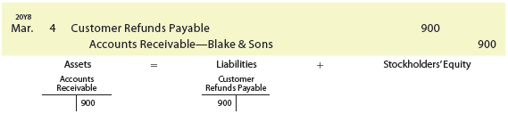</img>

| Date | Account | Debit | Credit |
|------|---------|-------|--------|
| Mar. 4 | Customer Refunds Payable | 900 | |
| | Accounts Receivable | | 900 |
| | *Sales Allowance for defective merchandise.* | | |

<table><thead>
  <tr>
    <th colspan="2">Assets</th>
    <th>=</th>
    <th colspan="2">Liabilities</th>
    <th>+</th>
    <th colspan="2">Stockholders' Equity</th>
    <th></th>
  </tr></thead>
<tbody>
  <tr>
    <td colspan="2">Accounts Receivable</td>
    <td rowspan="3"></td>
    <td colspan="2">Customer Refunds Payable</td>
    <td rowspan="3"></td>
    <td colspan="2"></td>
    <td></td>
  </tr>
  <tr>
    <td>debit</td>
    <td>credit</td>
    <td>debit</td>
    <td>credit</td>
    <td>debit</td>
    <td>credit</td>
    <td></td>
  </tr>
  <tr>
    <td></td>
    <td>900</td>
    <td>900</td>
    <td></td>
    <td></td>
    <td></td>
    <td></td>
  </tr>
</tbody>
</table>

The journal entries to record customer refunds, allowances, and returns are summarized in Exhibit 7.

[Los asientos de diario para registrar reembolsos, bonificaciones y devoluciones de clientes se resumen en la Figura 7.]

---

## Exhibit 7

### Journal Entries for Customer Sales Returns, Refunds, and Allowances

[**Figura 7** - Asientos de Diario para Devoluciones, Reembolsos y Bonificaciones de Ventas a Clientes]

<!-- 📍 IMAGEN: Exhibit 7 - Journal Entries for Customer Sales Returns, Refunds, and Allowances (páginas 9-10) -->

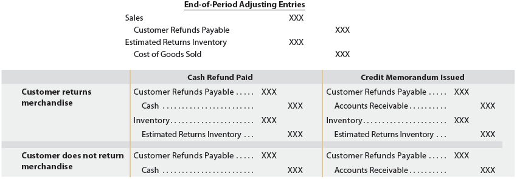

| Transaction | Account | Debit | Credit |
|-------------|---------|-------|--------|
| **Customer refund or allowance** | Sales | XXX | |
| | Customer Refunds Payable | | XXX |
| **Customer return** | Estimated Returns Inventory | XXX | |
| | Cost of Goods Sold | | XXX |
| **Cash refund issued** | Customer Refunds Payable | XXX | |
| | Cash | | XXX |
| **Returned inventory received** | Inventory | XXX | |
| | Estimated Returns Inventory | | XXX |
| **Sales allowance issued** | Sales | XXX | |
| | Accounts Receivable | | XXX |

---

**Link to Dollar Tree:** Although all sales are final, Dollar Tree will "exchange" any unopened item with the original receipt.

[**Enlace a Dollar Tree:** Aunque todas las ventas son finales, Dollar Tree "cambiará" cualquier artículo sin abrir con el recibo original.]

---

## Ethics in Action

### The Case of the Fraudulent Price Tags

[**Ética en Acción - El Caso de las Etiquetas de Precio Fraudulentas**]

One of the challenges for a retailer is policing its sales return policy. There are many ways in which customers can unethically or illegally abuse such policies. In one case, a couple was accused of attaching a company's store price tags to cheaper merchandise bought or obtained elsewhere. The couple then returned the cheaper goods and received the substantially higher refund amount. Company security officials discovered the fraud and had the couple arrested after they had allegedly bilked the company for more than $1 million.

[Uno de los desafíos para un minorista es controlar su política de devoluciones de ventas. Hay muchas formas en que los clientes pueden abusar de manera poco ética o ilegal de dichas políticas. En un caso, una pareja fue acusada de colocar etiquetas de precio de la tienda de una empresa a mercancía más barata comprada u obtenida en otro lugar. La pareja luego devolvió los bienes más baratos y recibió el monto de reembolso considerablemente más alto. Los funcionarios de seguridad de la empresa descubrieron el fraude y la pareja fue arrestada después de haber estafado presuntamente a la empresa por más de $1 millón.]

*Source: Jack L. Hayes International, Inc., 28th Annual Retail Theft Survey, 2016.*

---

## Check Up Corner 5-2

### Sales Transactions

[**Esquina de Verificación 5-2 - Transacciones de Ventas**]

On December 30, Burrows Inc. sold $12,000 of merchandise to Wall Company on account, with terms n/30. The merchandise cost Burrows $8,000. On January 3, Wall determines that a portion of the merchandise received does not operate properly, and Burrows issues a credit memo for the returned items. The invoice amount of the returned merchandise is $3,000, which cost Burrows $2,000. Journalize the entries by Burrows to record (a) the December 30 sale, (b) the January 3 return, and (c) the receipt of the amount due from Wall on January 6.

[El 30 de diciembre, Burrows Inc. vendió $12,000 de mercancía a Wall Company a crédito, con términos n/30. La mercancía le costó a Burrows $8,000. El 3 de enero, Wall determina que una parte de la mercancía recibida no funciona correctamente, y Burrows emite una nota de crédito por los artículos devueltos. El monto de la factura de la mercancía devuelta es de $3,000, que le costó a Burrows $2,000. Registre en el diario los asientos de Burrows para (a) la venta del 30 de diciembre, (b) la devolución del 3 de enero y (c) la recepción del monto adeudado por Wall el 6 de enero.]

---

### Solution - Check Up Corner 5-2

[**Solución - Esquina de Verificación 5-2**]

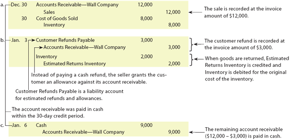</img>

| Date | Account | Debit | Credit |
|------|---------|-------|--------|
| Dec. 30 | Accounts Receivable | 12,000 | |
| | Sales | | 12,000 |
| | *Record sale on account.* | | |
| Dec. 30 | Cost of Goods Sold | 8,000 | |
| | Inventory | | 8,000 |
| | *Record cost of goods sold.* | | |
| Jan. 3 | Sales | 3,000 | |
| | Accounts Receivable | | 3,000 |
| | *Record credit memo for return.* | | |
| Jan. 3 | Inventory | 2,000 | |
| | Cost of Goods Sold | | 2,000 |
| | *Record return of inventory.* | | |
| Jan. 6 | Cash | 9,000 | |
| | Accounts Receivable | | 9,000 |
| | *Record receipt of payment.* | | |

---

## Using Data Analytics

### Sales

[**Uso de Analítica de Datos - Ventas**]

Retail businesses, such as Target Corporation (TGT), use data analytics to answer questions such as the following:

[Los negocios minoristas, como Target Corporation (TGT), utilizan la analítica de datos para responder preguntas como las siguientes:]

- What are our best-selling products?
- What products are generating returns?
- What percent of our customers are using self-checkouts?
- What time of the day do we have the most sales?
- What percent of our customers use credit cards?
- What percent of our customers use debit cards?

[- ¿Cuáles son nuestros productos más vendidos?
- ¿Qué productos están generando devoluciones?
- ¿Qué porcentaje de nuestros clientes utiliza autopagos?
- ¿A qué hora del día tenemos más ventas?
- ¿Qué porcentaje de nuestros clientes utiliza tarjetas de crédito?
- ¿Qué porcentaje de nuestros clientes utiliza tarjetas de débito?]

Target has used data (predictive) analytics to improve the retail experience of its customers as well as to increase its sales. For example, Target uses data analytics to decide which products should earn shelf space in its brick-and-mortar stores and which are best serviced with its online sales app.

[Target ha utilizado la analítica de datos (predictiva) para mejorar la experiencia minorista de sus clientes, así como para aumentar sus ventas. Por ejemplo, Target utiliza la analítica de datos para decidir qué productos deben ganar espacio en los estantes de sus tiendas físicas y cuáles son mejor atendidos con su aplicación de ventas en línea.]

*See TIF 5-8 for a homework assignment using data analytics.*

[*Vea TIF 5-8 para una tarea que utiliza analítica de datos.*]

*Source: Dina Gerdeman, "On Target: Rethinking the Retail Website," Forbes, December 4, 2018.*

---

<h1 id="558556" style="color:#E65100;">
  <a href="#Chapter_005" style="color:inherit; text-decoration:none;">
    5-2e Freight
  </a>
</h1>

Purchases and sales of merchandise often involve freight. The terms of a sale indicate when ownership (title and control) of the merchandise passes from the seller to the buyer. This point determines whether the buyer or the seller pays the freight costs.

[Las compras y ventas de mercancía a menudo implican fletes. Los términos de una venta indican cuándo la propiedad (título y control) de la mercancía pasa del vendedor al comprador. Este punto determina si el comprador o el vendedor pagan los costos de flete.]

The ownership of the merchandise may pass to the buyer when the seller delivers the merchandise to the freight carrier. In this case, the terms are said to be **FOB (free on board) shipping point** (Freight terms in which the buyer pays the transportation costs from the shipping point to the final destination.). This term means that the buyer pays the freight costs from the shipping point to the final destination. Such costs are part of the buyer's total cost of purchasing inventory and are added to the cost of the inventory by debiting Inventory.

[La propiedad de la mercancía puede pasar al comprador cuando el vendedor entrega la mercancía al transportista. En este caso, se dice que los términos son **FOB (libre a bordo) punto de embarque** (términos de flete en los que el comprador paga los costos de transporte desde el punto de embarque hasta el destino final). Este término significa que el comprador paga los costos de flete desde el punto de embarque hasta el destino final. Dichos costos son parte del costo total de compra de inventario del comprador y se agregan al costo del inventario debitando Inventario.]

## Note

>The buyer bears the freight costs if the shipping terms are FOB shipping point.

To illustrate, assume that on June 10, NetSolutions purchased merchandise as follows:

[Para ilustrar, suponga que el 10 de junio, NetSolutions compró mercancía de la siguiente manera:]

- June 10. Purchased merchandise from Magna Data, $1,200 terms FOB shipping point.
- June 10. Paid freight of $50 on June 10 purchase from Magna Data.

[10 de junio. Compró mercancía de Magna Data, $1,200 términos FOB punto de embarque.
10 de junio. Pagó flete de $50 por la compra del 10 de junio de Magna Data.]

NetSolutions would record these two transactions as follows:

[NetSolutions registraría estas dos transacciones de la siguiente manera:]

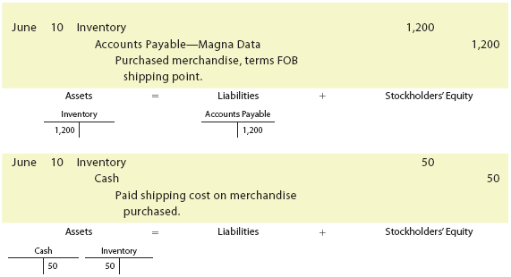</img>

| Date | Account | Debit | Credit |
|------|---------|-------|--------|
| June 10 | Inventory | 1,200 | |
| | Accounts Payable—Magna Data | | 1,200 |
| | *Purchased merchandise on account.* | | |

<table><thead>
  <tr>
    <th colspan="2">Assets</th>
    <th>=</th>
    <th colspan="2">Liabilities</th>
    <th>+</th>
    <th colspan="2">Stockholders' Equity</th>
    <th></th>
  </tr></thead>
<tbody>
  <tr>
    <td colspan="2">Inventory</td>
    <td rowspan="3"></td>
    <td colspan="2">Accounts Payable</td>
    <td rowspan="3"></td>
    <td colspan="2"></td>
    <td></td>
  </tr>
  <tr>
    <td>debit</td>
    <td>credit</td>
    <td>debit</td>
    <td>credit</td>
    <td>debit</td>
    <td>credit</td>
    <td></td>
  </tr>
  <tr>
    <td>1,200</td>
    <td></td>
    <td></td>
    <td>1,200</td>
    <td></td>
    <td></td>
    <td></td>
  </tr>
</tbody>
</table>

| Date | Account | Debit | Credit |
|------|---------|-------|--------|
| June 10 | Inventory | 50 | |
| | Cash | | 50 |
| | *Paid freight on purchase.* | | |

<table><thead>
  <tr>
    <th colspan="4">Assets</th>
    <th>=</th>
    <th colspan="2">Liabilities</th>
    <th>+</th>
    <th colspan="2">Stockholders' Equity</th>
  </tr></thead>
<tbody>
  <tr>
    <td colspan="2">Cash</td>
    <td colspan="2">Inventory</td>
    <td rowspan="3"></td>
    <td colspan="2"></td>
    <td rowspan="3"></td>
    <td colspan="2"></td>
  </tr>
  <tr>
    <td>debit</td>
    <td>credit</td>
    <td>debit</td>
    <td>credit</td>
    <td>debit</td>
    <td>credit</td>
    <td>debit</td>
    <td>credit</td>
  </tr>
  <tr>
    <td></td>
    <td>50</td>
    <td>50</td>
    <td></td>
    <td></td>
    <td></td>
    <td></td>
    <td></td>
  </tr>
</tbody>
</table>

The ownership of the merchandise may pass to the buyer when the buyer receives the merchandise. In this case, the terms are said to be **FOB (free on board) destination** (Freight terms in which the seller pays the transportation costs from the shipping point to the final destination.). This term means that the seller pays the freight costs from the shipping point to the buyer's final destination. When the seller pays the delivery charges, the seller debits Delivery Expense or Freight Out. Delivery Expense is reported on the seller's income statement as a selling expense.

[La propiedad de la mercancía puede pasar al comprador cuando el comprador recibe la mercancía. En este caso, se dice que los términos son **FOB (libre a bordo) destino** (términos de flete en los que el vendedor paga los costos de transporte desde el punto de embarque hasta el destino final). Este término significa que el vendedor paga los costos de flete desde el punto de embarque hasta el destino final del comprador. Cuando el vendedor paga los cargos de entrega, el vendedor debita Gastos de Entrega o Flete de Salida. Los Gastos de Entrega se reportan en el estado de resultados del vendedor como un gasto de venta.]

## Note

>The seller bears the freight costs if the shipping terms are FOB destination.

To illustrate, assume that NetSolutions sells merchandise as follows:

[Para ilustrar, suponga que NetSolutions vende mercancía de la siguiente manera:]

- June 15. Sold merchandise to Kranz Company on account, $700, terms FOB destination. The cost of the goods sold is $480.
- June 15. NetSolutions pays freight of $40 on the sale of June 15.

[15 de junio. Vendió mercancía a Kranz Company a crédito, $700, términos FOB destino. El costo de los bienes vendidos es de $480.
15 de junio. NetSolutions paga flete de $40 por la venta del 15 de junio.]

NetSolutions records the sale, the cost of the sale, and the freight cost as follows:

[NetSolutions registra la venta, el costo de la venta y el costo de flete de la siguiente manera:]

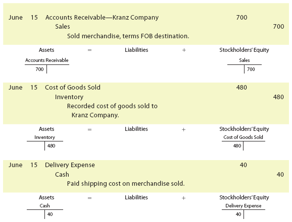</img>

| Date | Account | Debit | Credit |
|------|---------|-------|--------|
| June 15 | Accounts Receivable | 700 | |
| | Sales | | 700 |
| | *Record sale on account.* | | |

<table><thead>
  <tr>
    <th colspan="2">Assets</th>
    <th>=</th>
    <th colspan="2">Liabilities</th>
    <th>+</th>
    <th colspan="2">Stockholders' Equity</th>
  </tr></thead>
<tbody>
  <tr>
    <td colspan="2">Accounts Receivable</td>
    <td rowspan="3"></td>
    <td colspan="2"></td>
    <td rowspan="3"></td>
    <td colspan="2">Sales</td>
  </tr>
  <tr>
    <td>debit</td>
    <td>credit</td>
    <td>debit</td>
    <td>credit</td>
    <td>debit</td>
    <td>credit</td>
  </tr>
  <tr>
    <td>700</td>
    <td></td>
    <td></td>
    <td></td>
    <td></td>
    <td>700</td>
  </tr>
</tbody>
</table>

| Date | Account | Debit | Credit |
|------|---------|-------|--------|
| June 15 | Cost of Goods Sold | 480 | |
| | Inventory | | 480 |
| | *Record cost of goods sold.* | | |

<table><thead>
  <tr>
    <th colspan="2">Assets</th>
    <th>=</th>
    <th colspan="2">Liabilities</th>
    <th>+</th>
    <th colspan="2">Stockholders' Equity</th>
  </tr></thead>
<tbody>
  <tr>
    <td colspan="2">Inventory</td>
    <td rowspan="3"></td>
    <td colspan="2"></td>
    <td rowspan="3"></td>
    <td colspan="2">Cost of Goods Sold</td>
  </tr>
  <tr>
    <td>debit</td>
    <td>credit</td>
    <td>debit</td>
    <td>credit</td>
    <td>debit</td>
    <td>credit</td>
  </tr>
  <tr>
    <td></td>
    <td>480</td>
    <td></td>
    <td></td>
    <td>480</td>
    <td></td>
  </tr>
</tbody>
</table>

| Date | Account | Debit | Credit |
|------|---------|-------|--------|
| June 15 | Delivery Expense | 40 | |
| | Cash | | 40 |
| | *Paid freight on sale.* | | |

<table><thead>
  <tr>
    <th colspan="2">Assets</th>
    <th>=</th>
    <th colspan="2">Liabilities</th>
    <th>+</th>
    <th colspan="2">Stockholders' Equity</th>
  </tr></thead>
<tbody>
  <tr>
    <td colspan="2">Cash</td>
    <td rowspan="3"></td>
    <td colspan="2"></td>
    <td rowspan="3"></td>
    <td colspan="2">Delivery Expense</td>
  </tr>
  <tr>
    <td>debit</td>
    <td>credit</td>
    <td>debit</td>
    <td>credit</td>
    <td>debit</td>
    <td>credit</td>
  </tr>
  <tr>
    <td></td>
    <td>40</td>
    <td></td>
    <td></td>
    <td>40</td>
    <td></td>
  </tr>
</tbody>
</table>

The seller may prepay the freight, even though the terms are FOB shipping point. The seller will then add the freight to the invoice. The buyer debits Inventory for the total amount of the invoice, including the freight. Any discount terms would not apply to the prepaid freight.

[El vendedor puede pagar por adelantado el flete, incluso si los términos son FOB punto de embarque. El vendedor agregará entonces el flete a la factura. El comprador debita Inventario por el monto total de la factura, incluido el flete. Los términos de descuento no se aplicarían al flete prepagado.]

To illustrate, assume that NetSolutions sells merchandise as follows:

[Para ilustrar, suponga que NetSolutions vende mercancía de la siguiente manera:]

- June 20. Sold merchandise to Planter Company on account, $800, terms FOB shipping point, n/30.
- NetSolutions paid freight of $45, which was added to the invoice. The cost of the goods sold is $360.

[20 de junio. Vendió mercancía a Planter Company a crédito, $800, términos FOB punto de embarque, n/30.
NetSolutions pagó flete de $45, que se agregó a la factura. El costo de los bienes vendidos es de $360.]

NetSolutions records the sale, the cost of the sale, and the freight as follows:

[NetSolutions registra la venta, el costo de la venta y el flete de la siguiente manera:]

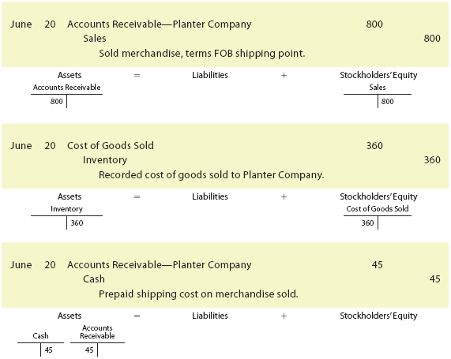</img>

| Date | Account | Debit | Credit |
|------|---------|-------|--------|
| June 20 | Accounts Receivable—Planter Company | 800 | |
| | Sales | | 800 |
| | *Sold merchandise, terms FOB shipping point.* | | |

<table><thead>
  <tr>
    <th colspan="2">Assets</th>
    <th>=</th>
    <th colspan="2">Liabilities</th>
    <th>+</th>
    <th colspan="2">Stockholders' Equity</th>
  </tr></thead>
<tbody>
  <tr>
    <td colspan="2">Accounts Receivable</td>
    <td rowspan="3"></td>
    <td colspan="2"></td>
    <td rowspan="3"></td>
    <td colspan="2">Sales</td>
  </tr>
  <tr>
    <td>debit</td>
    <td>credit</td>
    <td>debit</td>
    <td>credit</td>
    <td>debit</td>
    <td>credit</td>
  </tr>
  <tr>
    <td>800</td>
    <td></td>
    <td></td>
    <td></td>
    <td></td>
    <td>800</td>
  </tr>
</tbody>
</table>

| Date | Account | Debit | Credit |
|------|---------|-------|--------|
| June 20 | Cost of Goods Sold | 360 | |
| | Inventory | | 360 |
| | *Recorded cost of goods sold to Planter Company.* | | |

<table><thead>
  <tr>
    <th colspan="2">Assets</th>
    <th>=</th>
    <th colspan="2">Liabilities</th>
    <th>+</th>
    <th colspan="2">Stockholders' Equity</th>
  </tr></thead>
<tbody>
  <tr>
    <td colspan="2">Inventory</td>
    <td rowspan="3"></td>
    <td colspan="2"></td>
    <td rowspan="3"></td>
    <td colspan="2">Cost of Goods Sold</td>
  </tr>
  <tr>
    <td>debit</td>
    <td>credit</td>
    <td>debit</td>
    <td>credit</td>
    <td>debit</td>
    <td>credit</td>
  </tr>
  <tr>
    <td></td>
    <td>360</td>
    <td></td>
    <td></td>
    <td>360</td>
    <td></td>
  </tr>
</tbody>
</table>

| Date | Account | Debit | Credit |
|------|---------|-------|--------|
| June 20 | Accounts Receivable—Planter Company | 45 | |
| | Cash | | 45 |
| | *Prepaid shipping cost on merchandise sold.* | | |

<table><thead>
  <tr>
    <th colspan="4">Assets</th>
    <th>=</th>
    <th colspan="2">Liabilities</th>
    <th>+</th>
    <th colspan="2">Stockholders' Equity</th>
  </tr></thead>
<tbody>
  <tr>
    <td colspan="2">Cash</td>
    <td colspan="2">Accounts Receivable</td>
    <td rowspan="3"></td>
    <td colspan="2"></td>
    <td rowspan="3"></td>
    <td colspan="2"></td>
  </tr>
  <tr>
    <td>debit</td>
    <td>credit</td>
    <td>debit</td>
    <td>credit</td>
    <td>debit</td>
    <td>credit</td>
    <td>debit</td>
    <td>credit</td>
  </tr>
  <tr>
    <td></td>
    <td>45</td>
    <td>45</td>
    <td></td>
    <td></td>
    <td></td>
    <td></td>
    <td></td>
  </tr>
</tbody>
</table>

Shipping terms, the passage of title (control), and whether the buyer or seller is to pay the freight costs are summarized in Exhibit 8.

[Los términos de envío, el paso de título (control) y si el comprador o el vendedor deben pagar los costos de flete se resumen en la Figura 8.]

---

## Exhibit 8

### Summary of Shipping Terms

[**Figura 8** - Resumen de Términos de Envío]

<!-- 📍 IMAGEN: Exhibit 8 - Summary of Shipping Terms (páginas 3-4) -->

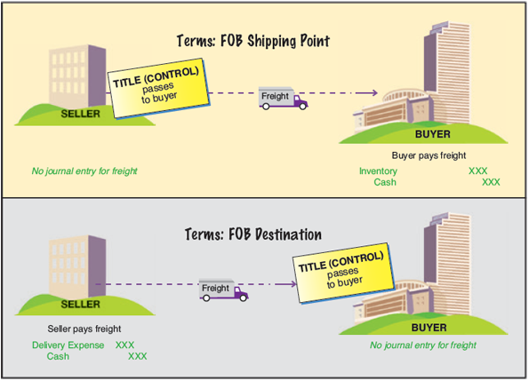

| Shipping Term | Who Pays Freight | Who Bears Risk | Title Passes |
|---------------|------------------|----------------|--------------|
| FOB Shipping Point | Buyer | Buyer | When goods are delivered to carrier |
| FOB Destination | Seller | Seller | When goods are delivered to buyer |

---

<h1 id="756544" style="color:#E65100;">
  <a href="#Chapter_005" style="color:inherit; text-decoration:none;">
    5-2f Summary: Recording Inventory Transactions
  </a>
</h1>

Recording inventory transactions under the perpetual inventory system has been described and illustrated in the preceding sections. These transactions involved purchases, purchases returns and allowances, freight, cost of goods sold (from sales), and customer returns. Exhibit 9 summarizes how these transactions are recorded in T account form.

[El registro de transacciones de inventario bajo el sistema de inventario perpetuo se ha descrito e ilustrado en las secciones anteriores. Estas transacciones involucraron compras, devoluciones y bonificaciones de compras, fletes, costo de bienes vendidos (por ventas) y devoluciones de clientes. La Figura 9 resume cómo se registran estas transacciones en forma de cuenta T.]

---

## Exhibit 9

### Recording Inventory Transactions

[**Figura 9** - Registro de Transacciones de Inventario]

<!-- 📍 IMAGEN: Exhibit 9 - Recording Inventory Transactions (página 1) -->

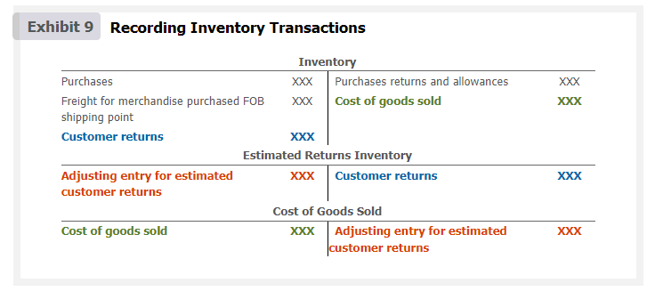

| Inventory | |
|-----------|-----------------|
| Purchases | Purchases returns and allowances |
| Freight for merchandise purchased FOB shipping point | Cost of goods sold |
| Customer returns | |

| Estimated Returns Inventory | |
|-----------------------------|-------------------|
| Adjusting entry for estimated customer returns | Customer returns |

| Cost of Goods Sold | |
|--------------------|-----------------|
| Cost of goods sold | Adjusting entry for estimated customer returns |

---

<h1 id="792657" style="color:#E65100;">
  <a href="#Chapter_005" style="color:inherit; text-decoration:none;">
    5-2g Dual Nature of Merchandise Transactions
  </a>
</h1>

Each merchandising transaction affects a buyer and a seller. In the illustration shown in Exhibit 10, the same transactions for a seller and buyer are recorded. In Exhibit 10, the seller is Scully Company and the buyer is Burton Co.

[Cada transacción de mercancía afecta a un comprador y a un vendedor. En la ilustración que se muestra en la Figura 10, se registran las mismas transacciones para un vendedor y un comprador. En la Figura 10, el vendedor es Scully Company y el comprador es Burton Co.]

---

## Exhibit 10

### Illustration of Inventory Transactions for Seller and Buyer

[**Figura 10** - Ilustración de Transacciones de Inventario para Vendedor y Comprador]

<!-- 📍 IMAGEN: Exhibit 10 - Illustration of Inventory Transactions for Seller and Buyer (páginas 1-2) -->

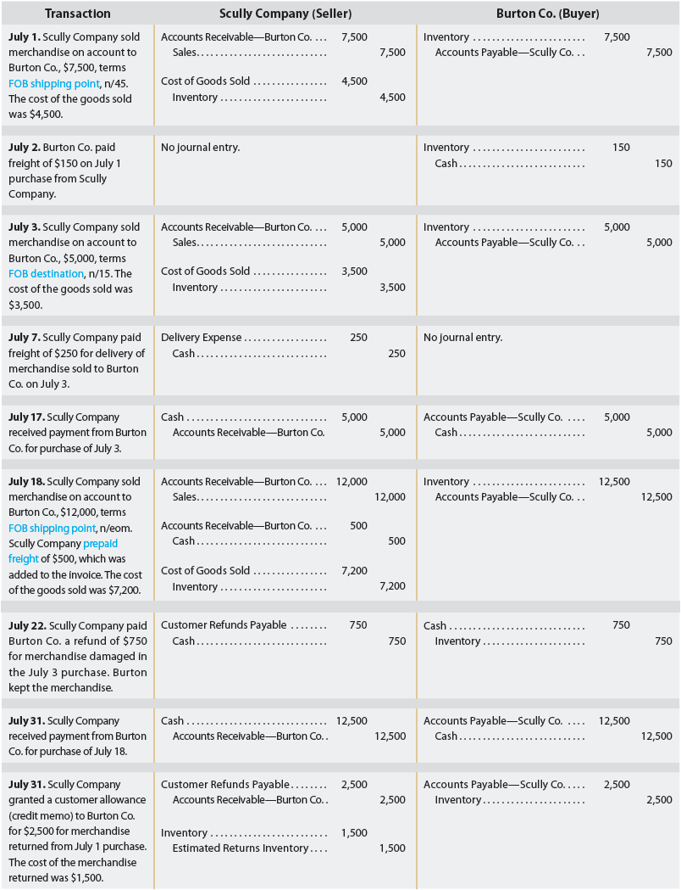

<table><tbody>
  <tr>
    <td>Transaction</td>
    <td colspan="3">Scully Company (Seller)</td>
    <td colspan="3">Burton Co. (Buyer)</td>
  </tr>
  <tr>
    <td></td>
    <td></td>
    <td>Debit</td>
    <td>Credit</td>
    <td></td>
    <td>Debit</td>
    <td>Credit</td>
  </tr>
  <tr>
    <td rowspan="4">July 1. Scully Company sold  merchandise on account to Burton  Co., $7,500, terms FOB shipping  point, n/45. The cost of the goods  sold was $4,500.</td>
    <td>Accounts Receivable—Burton Co. ... </td>
    <td>7,500</td>
    <td></td>
    <td>Inventory</td>
    <td>7,500</td>
    <td></td>
  </tr>
  <tr>
    <td>Sales</td>
    <td></td>
    <td>7,500</td>
    <td>Accounts Payable—Scully Co</td>
    <td></td>
    <td>7,500</td>
  </tr>
  <tr>
    <td>Cost of Goods Sold </td>
    <td>4,500</td>
    <td></td>
    <td></td>
    <td></td>
    <td></td>
  </tr>
  <tr>
    <td>Inventory</td>
    <td></td>
    <td>4,500</td>
    <td></td>
    <td></td>
    <td></td>
  </tr>
  <tr>
    <td rowspan="2">July 2. Burton Co. paid freight  of $150 on July 1 purchase from  Scully Company.</td>
    <td>No journal entry.</td>
    <td></td>
    <td></td>
    <td>Inventory </td>
    <td>150</td>
    <td></td>
  </tr>
  <tr>
    <td></td>
    <td></td>
    <td></td>
    <td>Cash</td>
    <td></td>
    <td>150</td>
  </tr>
  <tr>
    <td rowspan="4">July 3. Scully Company sold  merchandise on account to  Burton Co., $5,000, terms FOB  destination, n/15. The cost of  the goods sold was $3,500.</td>
    <td>Accounts Receivable—Burton Co</td>
    <td>5,000</td>
    <td></td>
    <td>Inventory </td>
    <td>5,000</td>
    <td></td>
  </tr>
  <tr>
    <td>Sales</td>
    <td></td>
    <td>5,000</td>
    <td>Accounts Payable-Scully Co.</td>
    <td></td>
    <td>5,000</td>
  </tr>
  <tr>
    <td>Cost of Goods Sold</td>
    <td>3,500</td>
    <td></td>
    <td></td>
    <td></td>
    <td></td>
  </tr>
  <tr>
    <td>Inventory</td>
    <td></td>
    <td>3,500</td>
    <td></td>
    <td></td>
    <td></td>
  </tr>
  <tr>
    <td rowspan="2">July 7. Scully Company  paid freight of $250 for delivery  of merchandise sold to Burton  Co. on July 3.</td>
    <td>Delivery Expense</td>
    <td>250</td>
    <td></td>
    <td>No journal entry.</td>
    <td></td>
    <td></td>
  </tr>
  <tr>
    <td>Cash</td>
    <td></td>
    <td>250</td>
    <td></td>
    <td></td>
    <td></td>
  </tr>
  <tr>
    <td rowspan="2">July 17. Scully Company  received payment from Burton  Co. for purchase of July 3.</td>
    <td>Cash </td>
    <td>5,000</td>
    <td></td>
    <td>Accounts Payable-Scully Co.</td>
    <td>5,000</td>
    <td></td>
  </tr>
  <tr>
    <td>Accounts Receivable—Burton Co.</td>
    <td></td>
    <td>5,000</td>
    <td>Cash </td>
    <td></td>
    <td>5,000</td>
  </tr>
  <tr>
    <td rowspan="6">July 18. Scully Company  sold merchandise on account  to Burton Co., $12,000, terms  FOB shipping point, n/eom. Scully  Company prepaid freight of $500,  which was added to the invoice.  The cost of the goods sold was  $7,200.</td>
    <td>Accounts Receivable—Burton Co.</td>
    <td>12,500</td>
    <td></td>
    <td>Inventory </td>
    <td>12,500</td>
    <td></td>
  </tr>
  <tr>
    <td>Sales</td>
    <td></td>
    <td>12,500</td>
    <td>Accounts Payable-Scully Co.</td>
    <td></td>
    <td>12,500</td>
  </tr>
  <tr>
    <td>Accounts Receivable—Burton Co</td>
    <td>500</td>
    <td></td>
    <td></td>
    <td></td>
    <td></td>
  </tr>
  <tr>
    <td>Cash </td>
    <td></td>
    <td>500</td>
    <td></td>
    <td></td>
    <td></td>
  </tr>
  <tr>
    <td>Cost of Goods Sold</td>
    <td>7,200</td>
    <td></td>
    <td></td>
    <td></td>
    <td></td>
  </tr>
  <tr>
    <td>Inventory</td>
    <td></td>
    <td>7,200</td>
    <td></td>
    <td></td>
    <td></td>
  </tr>
  <tr>
    <td rowspan="2">July 22. Scully Company  paid Burton Co. a refund of  $750 for merchandise damaged  in the July 3 purchase. Burton  kept the merchandise.</td>
    <td>Customer Refunds Payable.</td>
    <td>750</td>
    <td></td>
    <td>Cash</td>
    <td>750</td>
    <td></td>
  </tr>
  <tr>
    <td>Cash</td>
    <td></td>
    <td>750</td>
    <td>Inventory</td>
    <td></td>
    <td>750</td>
  </tr>
  <tr>
    <td rowspan="2">July 31. Scully Company  received payment from Burton  Co. for purchase of July 18.</td>
    <td>Cash</td>
    <td>12,500</td>
    <td></td>
    <td>Accounts Payable-Scully Co.</td>
    <td>12,500</td>
    <td></td>
  </tr>
  <tr>
    <td>Accounts Receivable—Burton Co</td>
    <td></td>
    <td>12,500</td>
    <td>Cash</td>
    <td></td>
    <td>12,500</td>
  </tr>
  <tr>
    <td rowspan="4">July 31. Scully Company  granted a customer allowance  (credit memo) to Burton Co.  for $2,500 for merchandise  returned from July 1 purchase.  The cost of the merchandise  returned was $1,500.</td>
    <td>Customer Refunds Payable.</td>
    <td>2,500</td>
    <td></td>
    <td>Accounts Payable-Scully Co.</td>
    <td>2,500</td>
    <td></td>
  </tr>
  <tr>
    <td>Accounts Receivable—Burton Co</td>
    <td></td>
    <td>2,500</td>
    <td>Inventory</td>
    <td></td>
    <td>2,500</td>
  </tr>
  <tr>
    <td>Inventory</td>
    <td>1,500</td>
    <td></td>
    <td></td>
    <td></td>
    <td></td>
  </tr>
  <tr>
    <td>Cost of Goods Sold</td>
    <td></td>
    <td>1,500</td>
    <td></td>
    <td></td>
    <td></td>
  </tr>
</tbody></table>

---

<h1 id="407384" style="color:#E65100;">
  <a href="#Chapter_005" style="color:inherit; text-decoration:none;">
    5-2h Sales Taxes and Trade Discounts
  </a>
</h1>

Sales of merchandise often involve sales taxes. Also, the seller may offer buyers trade discounts.

[Las ventas de mercancía a menudo implican impuestos a las ventas. Además, el vendedor puede ofrecer a los compradores descuentos comerciales.]

---

## Sales Taxes

Almost all states levy a tax on sales of merchandise. The liability for the sales tax is incurred when the sale is made.

[Casi todos los estados imponen un impuesto sobre las ventas de mercancía. El pasivo por el impuesto a las ventas se incurre cuando se realiza la venta.]

At the time of a cash sale, the seller collects the sales tax. When a sale is made on account, the seller charges the tax to the buyer by debiting Accounts Receivable. The seller credits the sales account for the amount of the sale and credits the tax to Sales Tax Payable. For example, the seller would record a sale of $100 on account, subject to a tax of 6%, as follows:

[En el momento de una venta al contado, el vendedor cobra el impuesto a las ventas. Cuando se realiza una venta a crédito, el vendedor carga el impuesto al comprador debitando Cuentas por Cobrar. El vendedor acredita la cuenta de ventas por el monto de la venta y acredita el impuesto a Impuesto a las Ventas por Pagar. Por ejemplo, el vendedor registraría una venta de $100 a crédito, sujeta a un impuesto del 6%, de la siguiente manera:]

| Date | Account | Debit | Credit |
|------|---------|-------|--------|
| Aug. 12| Accounts Receivable | 106 | |
| | Sales | | 100 |
| | Sales Tax Payable | | 6 |
| | *Record sale on account with sales tax.* | | |

<table><thead>
  <tr>
    <th colspan="2">Assets</th>
    <th>=</th>
    <th colspan="2">Liabilities</th>
    <th>+</th>
    <th colspan="2">Stockholders' Equity</th>
  </tr></thead>
<tbody>
  <tr>
    <td colspan="2">Accounts Receivable</td>
    <td rowspan="3"></td>
    <td colspan="2">Sales Tax Payable</td>
    <td rowspan="3"></td>
    <td colspan="2">Sales</td>
  </tr>
  <tr>
    <td>debit</td>
    <td>credit</td>
    <td>debit</td>
    <td>credit</td>
    <td>debit</td>
    <td>credit</td>
  </tr>
  <tr>
    <td>106</td>
    <td></td>
    <td></td>
    <td>6</td>
    <td></td>
    <td>100</td>
  </tr>
</tbody>
</table>

On a regular basis, the seller pays to the taxing authority (state) the amount of the sales tax collected. The seller records such a payment as follows:

[De manera regular, el vendedor paga a la autoridad fiscal (estado) el monto del impuesto a las ventas cobrado. El vendedor registra dicho pago de la siguiente manera:]

| Date | Account | Debit | Credit |
|------|---------|-------|--------|
|Sept. 15 | Sales Tax Payable | 2,900 | |
| | Cash | | 2,900 |
| | *Payment for sales taxes collected during August.* | | |

<table><thead>
  <tr>
    <th colspan="2">Assets</th>
    <th>=</th>
    <th colspan="2">Liabilities</th>
    <th>+</th>
    <th colspan="2">Stockholders' Equity</th>
  </tr></thead>
<tbody>
  <tr>
    <td colspan="2">Cash</td>
    <td rowspan="3"></td>
    <td colspan="2">Sales Tax Payable</td>
    <td rowspan="3"></td>
    <td colspan="2"></td>
  </tr>
  <tr>
    <td>debit</td>
    <td>credit</td>
    <td>debit</td>
    <td>credit</td>
    <td>debit</td>
    <td>credit</td>
  </tr>
  <tr>
    <td></td>
    <td>2,900</td>
    <td>2,900</td>
    <td></td>
    <td></td>
    <td></td>
  </tr>
</tbody>
</table>

---

## Trade Discounts

**Wholesale businesses** (A company that sells merchandise to other businesses rather than to the public.) are companies that sell merchandise to other businesses rather than to the public, called B2B transactions. Wholesalers may offer special discounts off list prices to government agencies or businesses that order large quantities. Such discounts are called **trade discounts** (Discounts from the list prices in published catalogs or special discounts offered to certain classes of buyers.).

[Las **empresas mayoristas** (una empresa que vende mercancía a otras empresas en lugar de al público) son empresas que venden mercancía a otras empresas en lugar de al público, llamadas transacciones B2B. Los mayoristas pueden ofrecer descuentos especiales sobre los precios de lista a agencias gubernamentales o empresas que piden grandes cantidades. Dichos descuentos se llaman **descuentos comerciales** (descuentos sobre los precios de lista en catálogos publicados o descuentos especiales ofrecidos a ciertas clases de compradores).]

Sellers and buyers do not normally record the list prices of merchandise and trade discounts in their accounts. For example, assume that an item has a list price of $1,000 and a 40% trade discount. The seller records the sale of the item at $600 [$1,000 less the trade discount of $400 ($1,000 × 40%)]. Likewise, the buyer records the purchase at $600.

[Los vendedores y compradores normalmente no registran los precios de lista de la mercancía y los descuentos comerciales en sus cuentas. Por ejemplo, suponga que un artículo tiene un precio de lista de $1,000 y un descuento comercial del 40%. El vendedor registra la venta del artículo en $600 [$1,000 menos el descuento comercial de $400 ($1,000 × 40%)]. Del mismo modo, el comprador registra la compra en $600.]

---

<h1 id="589432" style="color:#E65100;">
  <a href="#Chapter_005" style="color:inherit; text-decoration:none;">
    5-3 The Adjusting Process
  </a>
</h1>

The chart of accounts (Exhibit 2) and the recording of transactions for a retail business (NetSolutions) have been described and illustrated. Next, the adjusting process for a retail business is described and illustrated. This discussion focuses on the following adjusting entries that differ from those of a service business:

[El catálogo de cuentas (Figura 2) y el registro de transacciones para un negocio minorista (NetSolutions) se han descrito e ilustrado. A continuación, se describe e ilustra el proceso de ajuste para un negocio minorista. Esta discusión se centra en los siguientes asientos de ajuste que difieren de los de un negocio de servicios:]

- **Inventory Shrinkage** [**Merma de Inventario**]
- **Customer Returns and Allowances** [**Devoluciones y Bonificaciones de Clientes**]

---

**Objective 3** - Describe and illustrate the adjusting process for a retail business.

[**Objetivo 3** - Describir e ilustrar el proceso de ajuste para un negocio minorista.]

---

## Exhibit 2.

</img>

[**Figura 2** - Catálogo de Cuentas para NetSolutions como Negocio Minorista]

<table><thead>
  <tr>
    <th colspan="2" style="font-weight: bold;">Balance Sheet Accounts</th>
    <th colspan="2" style="font-weight: bold;">Income Statement Accounts</th>
  </tr></thead>
<tbody>
  <tr>
    <td colspan="2" style="font-weight: bold;">100 Assets</td>
    <td colspan="2" style="font-weight: bold;">400 Revenues</td>
  </tr>
  <tr>
    <td></td>
    <td>110 Cash</td>
    <td></td>
    <td style="color: darkorange;">410 Sales</td>
  </tr>
  <tr>
    <td></td>
    <td>112 Accounts Receivable</td>
    <td></td>
    <td>500 Costs and Expenses</td>
  </tr>
  <tr>
    <td></td>
    <td style="color: darkorange;">115 Inventory</td>
    <td></td>
    <td style="color: darkorange;">510 Cost of Goods Sold</td>
  </tr>
  <tr>
    <td></td>
    <td style="color: darkorange;">116 Estimated Returns Inventory</td>
    <td></td>
    <td>520 Sales Salaries Expense</td>
  </tr>
  <tr>
    <td></td>
    <td>117 Office Supplies</td>
    <td></td>
    <td>521 Advertising Expense</td>
  </tr>
  <tr>
    <td></td>
    <td>118 Prepaid Insurance</td>
    <td></td>
    <td>522 Depreciation Expense—Store Equipment</td>
  </tr>
  <tr>
    <td></td>
    <td>120 Land</td>
    <td></td>
    <td style="color: darkorange;">523 Delivery Expense</td>
  </tr>
  <tr>
    <td></td>
    <td>123 Store Equipment</td>
    <td></td>
    <td>529 Miscellaneous Selling Expense</td>
  </tr>
  <tr>
    <td></td>
    <td>124 Accumulated Depreciation—Store Equipment</td>
    <td></td>
    <td>530 Office Salaries Expense</td>
  </tr>
  <tr>
    <td></td>
    <td>125 Office Equipment</td>
    <td></td>
    <td>531 Rent Expense</td>
  </tr>
  <tr>
    <td></td>
    <td>126 Accumulated Depreciation—Office Equipment</td>
    <td></td>
    <td>532 Depreciation Expense—Office Equipment</td>
  </tr>
  <tr>
    <td colspan="2" style="font-weight: bold;">200 Liabilities</td>
    <td></td>
    <td>533 Insurance Expense</td>
  </tr>
  <tr>
    <td></td>
    <td>210 Accounts Payable</td>
    <td></td>
    <td>534 Office Supplies Expense</td>
  </tr>
  <tr>
    <td></td>
    <td>211 Salaries Payable</td>
    <td></td>
    <td>539 Miscellaneous Administrative Expense</td>
  </tr>
  <tr>
    <td></td>
    <td>212 Unearned Rent</td>
    <td colspan="2" style="font-weight: bold;">600 Other Revenue</td>
  </tr>
  <tr>
    <td></td>
    <td style="color: darkorange;">213 Customer Refunds Payable</td>
    <td></td>
    <td>610 Rent Revenue</td>
  </tr>
  <tr>
    <td></td>
    <td style="color: darkorange;">214 Estimated Coupons Payable</td>
    <td colspan="2" style="font-weight: bold;">700 Other Expense</td>
  </tr>
  <tr>
    <td></td>
    <td>215 Notes Payable</td>
    <td></td>
    <td>710 Interest Expense</td>
  </tr>
  <tr>
    <td colspan="2" style="font-weight: bold;">300 Stockholders' Equity</td>
    <td></td>
    <td></td>
  </tr>
  <tr>
    <td></td>
    <td>310 Common Stock</td>
    <td></td>
    <td></td>
  </tr>
  <tr>
    <td></td>
    <td>311 Retained Earnings</td>
    <td></td>
    <td></td>
  </tr>
  <tr>
    <td></td>
    <td>312 Dividends</td>
    <td></td>
    <td></td>
  </tr>
</tbody></table>

---

<h1 id="061064" style="color:#E65100;">
  <a href="#Chapter_005" style="color:inherit; text-decoration:none;">
    5-3a Inventory Shrinkage
  </a>
</h1>

Under the perpetual inventory system, the inventory account is continually updated for purchase and sales transactions. As a result, the balance of the inventory account is the amount of merchandise available for sale at that point in time. However, retailers normally experience some loss of inventory due to shoplifting, employee theft, or errors. Thus, the physical inventory on hand at the end of the accounting period is usually less than the balance of Inventory. This difference is called **inventory shrinkage** (The amount by which the merchandise for sale, as indicated by the balance of the inventory account, is larger than the total amount of merchandise counted during the physical inventory.) or **inventory shortage** (The amount by which the merchandise for sale, as indicated by the balance of the inventory account, is larger than the total amount of merchandise counted during the physical inventory.).

[Bajo el sistema de inventario perpetuo, la cuenta de inventario se actualiza continuamente por las transacciones de compra y venta. Como resultado, el saldo de la cuenta de inventario es la cantidad de mercancía disponible para la venta en ese momento. Sin embargo, los minoristas normalmente experimentan alguna pérdida de inventario debido a robos en tiendas, robos por parte de empleados o errores. Por lo tanto, el inventario físico disponible al final del período contable suele ser menor que el saldo de Inventario. Esta diferencia se llama **merma de inventario** (el monto por el cual la mercancía para la venta, según lo indica el saldo de la cuenta de inventario, es mayor que el monto total de la mercancía contada durante el inventario físico) o **escasez de inventario** (el monto por el cual la mercancía para la venta, según lo indica el saldo de la cuenta de inventario, es mayor que el monto total de la mercancía contada durante el inventario físico).]

To illustrate, NetSolutions' inventory on December 31, 20Y8, is as follows:

[Para ilustrar, el inventario de NetSolutions al 31 de diciembre de 20Y8 es el siguiente:]

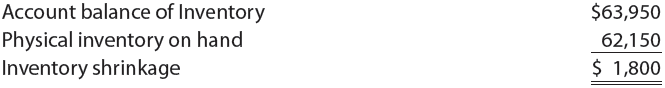</img>

| | Amount |
|---|---|
| Account balance of Inventory [Saldo de la cuenta de Inventario] | $63,950 |
| Physical inventory on hand [Inventario físico disponible] | 62,150 |
| **Inventory shrinkage** [**Merma de inventario**] | **$1,800** |

At the end of the accounting period, inventory shrinkage is recorded by the following adjusting entry:

[Al final del período contable, la merma de inventario se registra mediante el siguiente asiento de ajuste:]

<!-- 📍 IMAGEN: Adjusting entry for inventory shrinkage (coordenadas [128, 573, 844, 716]) -->

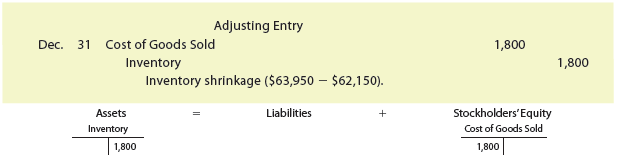

| Date | Account | Debit | Credit |
|------|---------|-------|--------|
| Dec. 31 | Cost of Goods Sold | 1,800 | |
| | Inventory | | 1,800 |
| | *Record inventory shrinkage.* | | |

<table><thead>
  <tr>
    <th colspan="2">Assets</th>
    <th>=</th>
    <th colspan="2">Liabilities</th>
    <th>+</th>
    <th colspan="2">Stockholders' Equity</th>
  </tr></thead>
<tbody>
  <tr>
    <td colspan="2">Inventory</td>
    <td rowspan="3"></td>
    <td colspan="2"></td>
    <td rowspan="3"></td>
    <td colspan="2">Cost of Goods Sold</td>
  </tr>
  <tr>
    <td>debit</td>
    <td>credit</td>
    <td>debit</td>
    <td>credit</td>
    <td>debit</td>
    <td>credit</td>
  </tr>
  <tr>
    <td></td>
    <td>1,800</td>
    <td></td>
    <td></td>
    <td>1,800</td>
    <td></td>
  </tr>
</tbody>
</table>

---

## Business Insight

### E-Commerce Shopping Carts

[**Perspectiva de Negocio - Carritos de Compras de Comercio Electrónico**]

When you shop on an e-commerce site, you will often select items that fill out a shopping cart form that identifies the items to be purchased and their prices. This illustration is from Apple's (AAPL) shopping cart. The shopping cart has a set of Apple EarPods at a price of $29. When checking out, the e-commerce site will automatically record the sales transaction for this purchase at a sales price of $29, plus appropriate sales tax and shipping. In addition, completing the checkout will record the reduction of EarPod inventory by one unit and record the appropriate cost of goods sold. Thus, all the merchandising transactions are generated from the shopping cart checkout process.

[Cuando compra en un sitio de comercio electrónico, a menudo seleccionará artículos que llenan un formulario de carrito de compras que identifica los artículos que se comprarán y sus precios. Esta ilustración es del carrito de compras de Apple (AAPL). El carrito de compras tiene un conjunto de Apple EarPods a un precio de $29. Al finalizar la compra, el sitio de comercio electrónico registrará automáticamente la transacción de venta por esta compra a un precio de venta de $29, más el impuesto a las ventas y el envío correspondientes. Además, completar la compra registrará la reducción del inventario de EarPod en una unidad y registrará el costo de bienes vendidos correspondiente. Por lo tanto, todas las transacciones de mercancía se generan a partir del proceso de pago del carrito de compras.]

*Source: Apple.*

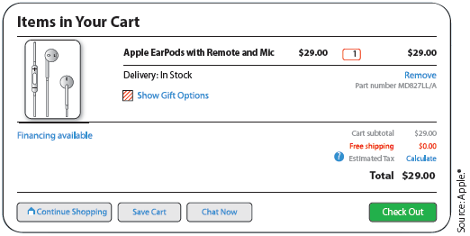</img>

After the preceding entry is recorded, the balance of Inventory agrees with the physical inventory on hand at the end of the period. Since inventory shrinkage cannot be totally eliminated, it is considered a normal cost of operations. If, however, the amount of the shrinkage is unusually large, it may be disclosed separately on the income statement. In such cases, the shrinkage may be recorded in a separate account, such as Loss from Inventory Shrinkage.

[Después de que se registra el asiento anterior, el saldo de Inventario coincide con el inventario físico disponible al final del período. Dado que la merma de inventario no puede eliminarse por completo, se considera un costo normal de las operaciones. Sin embargo, si el monto de la merma es inusualmente grande, puede revelarse por separado en el estado de resultados. En tales casos, la merma puede registrarse en una cuenta separada, como Pérdida por Merma de Inventario.]

---

<h1 id="314844" style="color:#E65100;">
  <a href="#Chapter_005" style="color:inherit; text-decoration:none;">
    5-3b Customer Returns, Refunds, and Allowances
  </a>
</h1>

As was described and illustrated earlier, sellers are required to estimate customer returns, refunds, and allowances at the end of the accounting period. Based upon these estimates, two adjusting journal entries are recorded. The first adjusting entry debits Sales and credits Customer Refunds Payable for estimated customer refunds and allowances. The second adjusting entry debits Estimated Returns Inventory and credits Cost of Goods Sold for merchandise that is expected to be returned.

[Como se describió e ilustró anteriormente, los vendedores están obligados a estimar las devoluciones, reembolsos y bonificaciones de los clientes al final del período contable. Con base en estas estimaciones, se registran dos asientos de diario de ajuste. El primer asiento de ajuste debita Ventas y acredita Reembolsos a Clientes por Pagar por los reembolsos y bonificaciones estimados de los clientes. El segundo asiento de ajuste debita Inventario de Devoluciones Estimadas y acredita Costo de Bienes Vendidos por la mercancía que se espera sea devuelta.]

To illustrate, assume the following unadjusted balances for NetSolutions as of December 31, 20Y8:

[Para ilustrar, suponga los siguientes saldos no ajustados para NetSolutions al 31 de diciembre de 20Y8:]

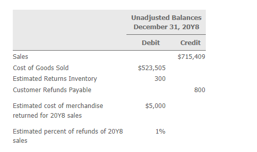</img>

<table><tbody>
  <tr>
    <td></td>
    <td colspan="2">Unadjusted Balances December 31, 20Y8</td>
  </tr>
  <tr>
    <td></td>
    <td>Debit</td>
    <td>Credit</td>
  </tr>
  <tr>
    <td>Sales</td>
    <td></td>
    <td>$715,409</td>
  </tr>
  <tr>
    <td>Cost of Goods Sold</td>
    <td>$523,505</td>
    <td></td>
  </tr>
  <tr>
    <td>Estimated Returns Inventory</td>
    <td>300</td>
    <td></td>
  </tr>
  <tr>
    <td>Customer Refunds Payable</td>
    <td></td>
    <td>800</td>
  </tr>
  <tr>
    <td>Estimated cost of merchandise returned for 20Y8 sales</td>
    <td>$5,000</td>
    <td></td>
  </tr>
  <tr>
    <td>Estimated percent of refunds of 20Y8 sales</td>
    <td>1%</td>
    <td></td>
  </tr>
</tbody>
</table>

On December 31, 20Y8, NetSolutions would record the following two adjusting entries:

[El 31 de diciembre de 20Y8, NetSolutions registraría los siguientes dos asientos de ajuste:]

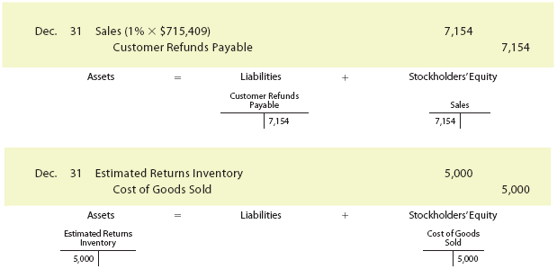</img>

| Date | Account | Debit | Credit |
|------|---------|-------|--------|
| Dec. 31 | Sales | 7,154 | |
| | Customer Refunds Payable | | 7,154 |
| | *Record estimated customer refunds.* | | |

<table><thead>
  <tr>
    <th colspan="2">Assets</th>
    <th>=</th>
    <th colspan="2">Liabilities</th>
    <th>+</th>
    <th colspan="2">Stockholders' Equity</th>
  </tr></thead>
<tbody>
  <tr>
    <td colspan="2"></td>
    <td rowspan="3"></td>
    <td colspan="2">Customer Refunds Payable</td>
    <td rowspan="3"></td>
    <td colspan="2">Sales</td>
  </tr>
  <tr>
    <td>debit</td>
    <td>credit</td>
    <td>debit</td>
    <td>credit</td>
    <td>debit</td>
    <td>credit</td>
  </tr>
  <tr>
    <td></td>
    <td></td>
    <td></td>
    <td>7,154</td>
    <td>7,154</td>
    <td></td>
  </tr>
</tbody>
</table>

| Date | Account | Debit | Credit |
|------|---------|-------|--------|
| Dec. 31 | Estimated Returns Inventory | 5,000 | |
| | Cost of Goods Sold | | 5,000 |
| | *Record estimated customer returns.* | | |

<table><thead>
  <tr>
    <th colspan="2">Assets</th>
    <th>=</th>
    <th colspan="2">Liabilities</th>
    <th>+</th>
    <th colspan="2">Stockholders' Equity</th>
  </tr></thead>
<tbody>
  <tr>
    <td colspan="2">Estimated Returns Inventory</td>
    <td rowspan="3"></td>
    <td colspan="2"></td>
    <td rowspan="3"></td>
    <td colspan="2">Cost of Goods Sold</td>
  </tr>
  <tr>
    <td>debit</td>
    <td>credit</td>
    <td>debit</td>
    <td>credit</td>
    <td>debit</td>
    <td>credit</td>
  </tr>
  <tr>
    <td>5,000</td>
    <td></td>
    <td></td>
    <td></td>
    <td></td>
    <td>5,000</td>
  </tr>
</tbody>
</table>

The first adjusting entry reduces 20Y8 sales by the estimated refunds that may occur in 20Y9. Since 1% of sales are expected to be refunded, Sales is debited for $7,154 (1% × $715,409). In addition, a liability is recorded for $7,154 by crediting Customer Refunds Payable for the estimated customer refunds in 20Y9.

[El primer asiento de ajuste reduce las ventas de 20Y8 por los reembolsos estimados que pueden ocurrir en 20Y9. Dado que se espera que se reembolse el 1% de las ventas, Ventas se debita por $7,154 (1% × $715,409). Además, se registra un pasivo por $7,154 acreditando Reembolsos a Clientes por Pagar por los reembolsos estimados a clientes en 20Y9.]

The second adjusting entry debits the asset Estimated Returns Inventory and reduces Cost of Goods Sold for the cost of merchandise that is expected to be returned in 20Y9 of $5,000. Estimated Returns Inventory is debited rather than Inventory because the type of merchandise returned will not be known until the returns actually occur.

[El segundo asiento de ajuste debita el activo Inventario de Devoluciones Estimadas y reduce el Costo de Bienes Vendidos por el costo de la mercancía que se espera sea devuelta en 20Y9 de $5,000. El Inventario de Devoluciones Estimadas se debita en lugar de Inventario porque el tipo de mercancía devuelta no se conocerá hasta que las devoluciones realmente ocurran.]

After the adjusting entries are posted to the ledger, Estimated Returns Inventory will have an adjusted balance of $5,300 ($300 + $5,000). Estimated returns inventory of $5,300 is reported on the balance sheet as a current asset following Inventory. Customer Refunds Payable will have a balance of $7,954 ($800 + $7,154). Customer refunds payable of $7,954 is reported as a current liability.

[Después de que los asientos de ajuste se traspasan al libro mayor, el Inventario de Devoluciones Estimadas tendrá un saldo ajustado de $5,300 ($300 + $5,000). El inventario de devoluciones estimadas de $5,300 se reporta en el balance general como un activo corriente después del Inventario. Los Reembolsos a Clientes por Pagar tendrán un saldo de $7,954 ($800 + $7,154). Los reembolsos a clientes por pagar de $7,954 se reportan como un pasivo corriente.]

---

<h1 id="778143" style="color:#E65100;">
  <a href="#Chapter_005" style="color:inherit; text-decoration:none;">
    5-3c Adjusted Trial Balance
  </a>
</h1>

After the adjusting entries are posted to the ledger, an adjusted trial balance is prepared. The adjusted trial balance for NetSolutions as of December 31, 20Y8, is shown in Exhibit 11.

[Después de que los asientos de ajuste se traspasan al libro mayor, se prepara un balance de comprobación ajustado. El balance de comprobación ajustado para NetSolutions al 31 de diciembre de 20Y8 se muestra en la Figura 11.]

---

## Exhibit 11

### Adjusted Trial Balance

[**Figura 11** - Balance de Comprobación Ajustado]

<!-- 📍 IMAGEN: Exhibit 11 - Adjusted Trial Balance (página 1) -->

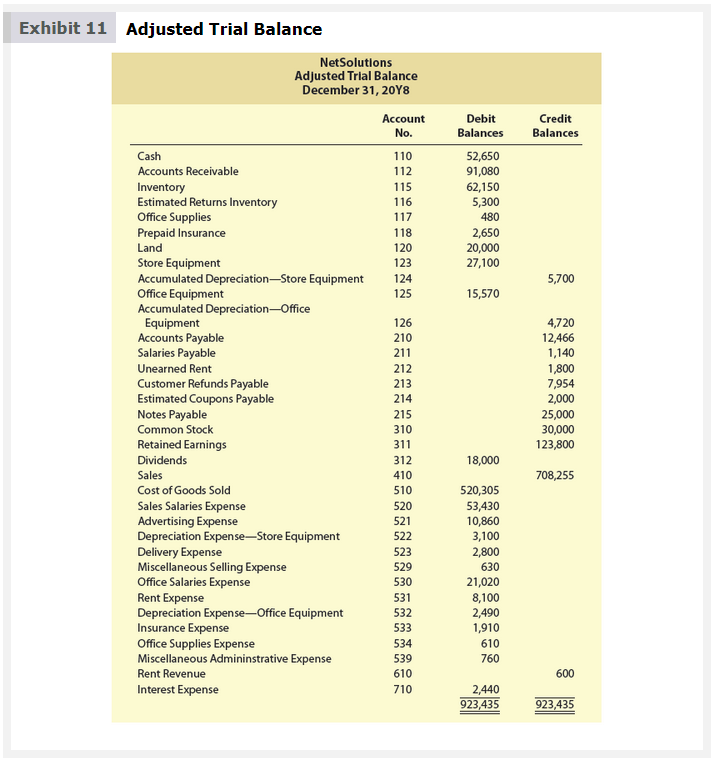

## NetSolutions
**Adjusted Trial Balance**

**December 31, 20Y8**

| Account No. | | Debit Balances | Credit Balances |
|-------------|---------------------|---------------|-----------------|
| 110 | Cash | 52,650 | |
| 112 | Accounts Receivable | 91,080 | |
| 115 | Inventory | 62,150 | |
| 116 | Estimated Returns Inventory | 5,300 | |
| 117 | Office Supplies | 480 | |
| 118 | Prepaid Insurance | 2,650 | |
| 120 | Land | 20,000 | |
| 123 | Store Equipment | 27,100 | |
| 124 | Accumulated Depreciation—Store Equipment | | 5,700 |
| 125 | Office Equipment | 15,570 | |
| 126 | Accumulated Depreciation—Office Equipment | | 4,720 |
| 210 | Accounts Payable | | 12,466 |
| 211 | Salaries Payable | | 1,140 |
| 212 | Unearned Rent | | 1,800 |
| 213 | Customer Refunds Payable | | 7,954 |
| 214 | Estimated Coupons Payable | | 2,000 |
| 215 | Notes Payable | | 25,000 |
| 310 | Common Stock | | 30,000 |
| 311 | Retained Earnings | | 123,800 |
| 312 | Dividends | 18,000 | |
| 410 | Sales | | 708,255 |
| 510 | Cost of Goods Sold | 520,305 | |
| 520 | Sales Salaries Expense | 53,430 | |
| 521 | Advertising Expense | 10,860 | |
| 522 | Depreciation Expense—Store Equipment | 3,100 | |
| 523 | Delivery Expense | 2,800 | |
| 529 | Miscellaneous Selling Expense | 630 | |
| 530 | Office Salaries Expense | 21,020 | |
| 531 | Rent Expense | 8,100 | |
| 532 | Depreciation Expense—Office Equipment | 2,490 | |
| 533 | Insurance Expense | 1,910 | |
| 534 | Office Supplies Expense | 610 | |
| 539 | Miscellaneous Administrative Expense | 760 | |
| 610 | Rent Revenue | | 600 |
| 710 | Interest Expense | 2,440 | |
| | **Totals** | **923,435** | **923,435** |

---

<h1 id="028031" style="color:#E65100;">
  <a href="#Chapter_005" style="color:inherit; text-decoration:none;">
    5-4 Financial Statements and Closing Entries for a Retail Business
  </a>
</h1>

Although merchandising transactions affect the balance sheet in reporting inventory, they primarily affect the income statement. An income statement for a retail business is normally prepared using either a multiple-step or single-step format.

[Aunque las transacciones de mercancía afectan el balance general en el reporte del inventario, afectan principalmente el estado de resultados. Un estado de resultados para un negocio minorista normalmente se prepara utilizando un formato de múltiples pasos o de un solo paso.]

**Objective 4** - Describe and illustrate the financial statements and closing entries for a retail business.

[**Objetivo 4** - Describir e ilustrar los estados financieros y los asientos de cierre para un negocio minorista.]

The financial statements for NetSolutions are illustrated in Exhibits 12, 13, and 14. These financial statements were prepared from the adjusted trial balance shown in Exhibit 11.

[Los estados financieros para NetSolutions se ilustran en las Figuras 12, 13 y 14. Estos estados financieros se prepararon a partir del balance de comprobación ajustado que se muestra en la Figura 11.]

---

## Exhibit 12

### Multiple-Step Income Statement

[**Figura 12** - Estado de Resultados de Múltiples Pasos]

<!-- 📍 IMAGEN: Exhibit 12 - Multiple-Step Income Statement (página 1) -->

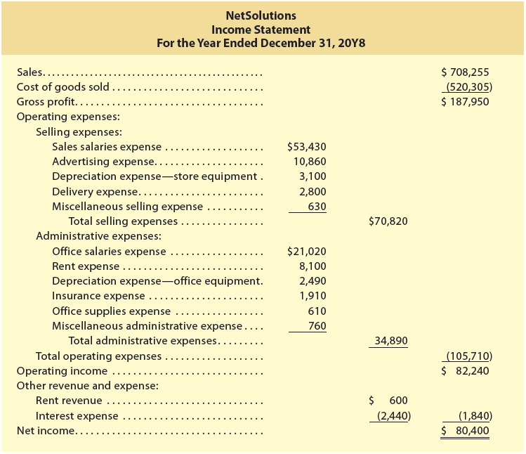

---
## NetSolutions
### Income Statement
#### For the Year Ended December 31, 20Y8

| Description | SubTotal | Total | Total Amount |
|---|---|---|---|
| **Sales** |  |  | $708,255 |
| **Cost of goods sold** |  |  | (520,305) |
| **Gross profit** |  |  | $187,950 |
| **Operating expenses:** |  |  |  |
| **Selling expenses:** |  |  |  |
| Sales salaries expense | 53,430 |  |  |
| Advertising expense | 10,860 |  |  |
| Depreciation expense—store equipment | 3,100 |  |  |
| Delivery expense | 2,800 |  |  |
| Miscellaneous selling expense | 630 |  |  |
| **Total selling expenses** |  | $70,820 |  |
| **Administrative expenses:** |  |  |  |
| Office salaries expense | 21,020 |  |  |
| Rent expense | 8,100 |  |  |
| Depreciation expense—office equipment | 2,490 |  |  |
| Insurance expense | 1,910 |  |  |
| Office supplies expense | 610 |  |  |
| Miscellaneous administrative expense | 760 |  |  |
| **Total administrative expenses** |  | $34,890 |  |
| **Total operating expenses** |  |  | (105,710) |
| **Operating income** |  |  | $82,240 |
| **Other revenue and expense:** |  |  |  |
| Rent revenue |  | 600 |  |
| Interest expense |  | (2,440) | (1,840) |
| **Net income** |  |  | $80,400 |
---

## Exhibit 13

### Single-Step Income Statement

[**Figura 13** - Estado de Resultados de un Solo Paso]

<!-- 📍 IMAGEN: Exhibit 13 - Single-Step Income Statement (página 2) -->

---

### NetSolutions
### Income Statement
### For the Year Ended December 31, 20Y8

| Description | Subtotal | Total |
|---|---|---|
| **Revenues:** |  |  |
| Sales |  | $708,255 |
| Rent revenue |  | 600 |
| **Total revenues** |  | **$708,855** |
| **Expenses:** |  |  |
| Cost of goods sold | 520,305 |  |
| Selling expenses | 70,820 |  |
| Administrative expenses | 34,890 |  |
| Interest expense | 2,440 |  |
| **Total expenses** |  | **(628,455)** |
| **Net income** |  | **$80,400** |

---

## Exhibit 14

### Statement of Stockholders' Equity

[**Figura 14** - Estado de Cambios en el Capital Contable]

<!-- 📍 IMAGEN: Exhibit 14 - Statement of Stockholders' Equity (página 2) -->

---

### NetSolutions
### Statement of Stockholders' Equity
### For the Year Ended December 31, 20Y8

| | Common Stock | Retained Earnings | Total |
|---|---|---|---|
| Balances, January 1, 20Y8 | $25,000 | $123,800 | $148,800 |
| Issued common stock | 5,000 | | 5,000 |
| Net income | | 80,400 | 80,400 |
| Dividends | | (18,000) | (18,000) |
| **Balances, December 31, 20Y8** | **$30,000** | **$186,200** | **$216,200** |

---

<h1 id="248831" style="color:#E65100;">
  <a href="#Chapter_005" style="color:inherit; text-decoration:none;">
    5-4a Multiple-Step Income Statement
  </a>
</h1>

The 20Y8 income statement for NetSolutions is shown in Exhibit 12. This form of income statement, called a **multiple-step income statement** (A form of income statement that contains several sections, subsections, and subtotals.), contains several sections, subsections, and subtotals.

[El estado de resultados de 20Y8 para NetSolutions se muestra en la Figura 12. Esta forma de estado de resultados, llamada **estado de resultados de múltiples pasos** (una forma de estado de resultados que contiene varias secciones, subsecciones y subtotales), contiene varias secciones, subsecciones y subtotales.]

---

## Sales

The total amount of sales to customers for cash and on account is reported in this section. NetSolutions reported sales of $708,255 for the year ended December 31, 20Y8.

[El monto total de ventas a clientes al contado y a crédito se reporta en esta sección. NetSolutions reportó ventas de $708,255 para el año terminado el 31 de diciembre de 20Y8.]

---

## Cost of Goods Sold

As shown in Exhibit 12, NetSolutions reported cost of goods sold of $520,305 during 20Y8. This amount is the cost of goods sold to customers. Cost of goods sold may also be reported as cost of merchandise sold or cost of sales.

[Como se muestra en la Figura 12, NetSolutions reportó un costo de bienes vendidos de $520,305 durante 20Y8. Este monto es el costo de los bienes vendidos a los clientes. El costo de bienes vendidos también puede reportarse como costo de mercancía vendida o costo de ventas.]

---

## Gross Profit

The excess of sales over cost of goods sold is gross profit. As shown in Exhibit 12, NetSolutions reported gross profit of $187,950 in 20Y8.

[El exceso de ventas sobre el costo de bienes vendidos es la utilidad bruta. Como se muestra en la Figura 12, NetSolutions reportó una utilidad bruta de $187,950 en 20Y8.]

---

## Operating Income

**Operating income** (The difference between gross profit and operating expenses.), sometimes called **income from operations** (The difference between gross profit and operating expenses.), is determined by subtracting operating expenses from gross profit. Operating expenses are normally classified as either selling expenses or administrative expenses.

[El **ingreso operativo** (la diferencia entre la utilidad bruta y los gastos operativos), a veces llamado **ingreso de operaciones** (la diferencia entre la utilidad bruta y los gastos operativos), se determina restando los gastos operativos de la utilidad bruta. Los gastos operativos normalmente se clasifican como gastos de venta o gastos administrativos.]

**Selling expenses** (Expenses that are incurred directly in the selling of merchandise.) are incurred directly in the selling of merchandise. Examples of selling expenses include sales salaries, store supplies used, depreciation of store equipment, delivery expense, and advertising.

[Los **gastos de venta** (gastos que se incurren directamente en la venta de mercancía) se incurren directamente en la venta de mercancía. Ejemplos de gastos de venta incluyen sueldos de ventas, suministros de tienda usados, depreciación de equipo de tienda, gastos de entrega y publicidad.]

**Administrative expenses** (Expenses incurred in the administration or general operations of the business.), sometimes called **general expenses** (Expenses incurred in the administration or general operations of the business.), are incurred in the administration or general operations of the business. Examples of administrative expenses include office salaries, depreciation of office equipment, and office supplies used.

[Los **gastos administrativos** (gastos incurridos en la administración u operaciones generales del negocio), a veces llamados **gastos generales** (gastos incurridos en la administración u operaciones generales del negocio), se incurren en la administración u operaciones generales del negocio. Ejemplos de gastos administrativos incluyen sueldos de oficina, depreciación de equipo de oficina y suministros de oficina usados.]

Each selling and administrative expense may be reported separately as shown in Exhibit 12. However, many companies report selling, administrative, and operating expenses as single line items, as follows for NetSolutions:

[Cada gasto de venta y administrativo puede reportarse por separado como se muestra en la Figura 12. Sin embargo, muchas empresas reportan los gastos de venta, administrativos y operativos como partidas individuales, como sigue para NetSolutions:]

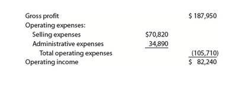</img>

<table><tbody>
  <tr>
    <td colspan="4">Gross profit</td>
    <td></td>
    <td>$187,950</td>
  </tr>
  <tr>
    <td colspan="4">Operating expenses:</td>
    <td></td>
    <td></td>
  </tr>
  <tr>
    <td></td>
    <td colspan="3">Selling expenses</td>
    <td>$70,820</td>
    <td></td>
  </tr>
  <tr>
    <td></td>
    <td colspan="3">Administrative expenses</td>
    <td>34,890</td>
    <td></td>
  </tr>
  <tr>
    <td></td>
    <td></td>
    <td colspan="2">Total operating expenses</td>
    <td></td>
    <td>(105,710)</td>
  </tr>
  <tr>
    <td colspan="4">Operating income</td>
    <td></td>
    <td>$82,240</td>
  </tr>
</tbody>
</table>

---

## Other Revenue and Expense

Other revenue and expense items are not related to the primary operations of the business. **Other revenue** (Revenue from sources other than the primary operating activity of a business.) is revenue from sources other than the primary operating activity of a business. Examples of other revenue include income from interest, rent, and gains resulting from the sale of fixed assets. **Other expense** (Expenses that cannot be traced directly to operations.) is an expense that cannot be traced directly to the normal operations of the business. Examples of other expenses include interest expense and losses from disposing of fixed assets.

[Las partidas de otros ingresos y gastos no están relacionadas con las operaciones principales del negocio. **Otros ingresos** (ingresos de fuentes distintas a la actividad operativa principal de un negocio) son ingresos de fuentes distintas a la actividad operativa principal de un negocio. Ejemplos de otros ingresos incluyen ingresos por intereses, rentas y ganancias resultantes de la venta de activos fijos. **Otros gastos** (gastos que no pueden rastrearse directamente a las operaciones) son gastos que no pueden rastrearse directamente a las operaciones normales del negocio. Ejemplos de otros gastos incluyen gastos por intereses y pérdidas por la disposición de activos fijos.]

Other revenue and other expense are offset against each other on the income statement. If the total of other revenue exceeds the total of other expense, the difference is added to operating income to determine net income. If the reverse is true, the difference is subtracted from operating income. The other revenue and expense items of NetSolutions are reported as follows and in Exhibit 12:

[Otros ingresos y otros gastos se compensan entre sí en el estado de resultados. Si el total de otros ingresos excede el total de otros gastos, la diferencia se suma al ingreso operativo para determinar el ingreso neto. Si ocurre lo contrario, la diferencia se resta del ingreso operativo. Las partidas de otros ingresos y gastos de NetSolutions se reportan de la siguiente manera y en la Figura 12:]

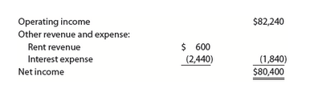</img>

<table><tbody>
  <tr>
    <td colspan="3">Operating income</td>
    <td></td>
    <td>$82,240</td>
  </tr>
  <tr>
    <td colspan="3">Other revenue and expense:</td>
    <td></td>
    <td></td>
  </tr>
  <tr>
    <td></td>
    <td colspan="2">Rent revenue</td>
    <td>$600</td>
    <td></td>
  </tr>
  <tr>
    <td></td>
    <td colspan="2">Interest expense</td>
    <td>(2,440)</td>
    <td>(1,840)</td>
  </tr>
  <tr>
    <td colspan="3">Net income</td>
    <td></td>
    <td>$80,400</td>
  </tr>
</tbody>
</table>

---

**Link to Dollar Tree:** Dollar Tree reports its income using the multiple-step income statement format.

[**Enlace a Dollar Tree:** Dollar Tree reporta sus ingresos utilizando el formato de estado de resultados de múltiples pasos.]

---

## Check Up Corner 5-3

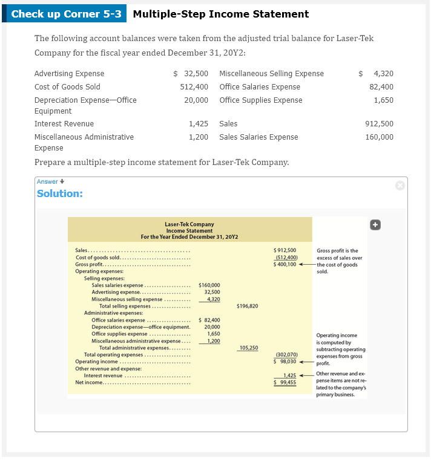</img>

### Multiple-Step Income Statement

[**Esquina de Verificación 5-3 - Estado de Resultados de Múltiples Pasos**]

The following account balances were taken from the adjusted trial balance for Laser-Tek Company for the fiscal year ended December 31, 20Y2:

[Los siguientes saldos de cuentas se tomaron del balance de comprobación ajustado para Laser-Tek Company para el año fiscal terminado el 31 de diciembre de 20Y2:]

| Account | Balance |
|---|---|
| Advertising Expense | $32,500 |
| Miscellaneous Selling Expense | $4,320 |
| Cost of Goods Sold | 512,400 |
| Office Salaries Expense | 82,400 |
| Depreciation Expense—Office Equipment | 20,000 |
| Office Supplies Expense | 1,650 |
| Interest Revenue | 1,425 |
| Sales | 912,500 |
| Miscellaneous Administrative Expense | 1,200 |
| Sales Salaries Expense | 160,000 |

Prepare a multiple-step income statement for Laser-Tek Company.

[Prepare un estado de resultados de múltiples pasos para Laser-Tek Company.]

---

### Solution - Check Up Corner 5-3

[**Solución - Esquina de Verificación 5-3**]

<table><tbody>
  <tr>
    <td colspan="3" rowspan="3"></td>
    <td colspan="4">Laser-Tek Company</td>
    <td rowspan="3"></td>
  </tr>
  <tr>
    <td colspan="4">Income Statement</td>
  </tr>
  <tr>
    <td colspan="4">For the Year Ended December 31, 20Y2</td>
  </tr>
  <tr>
    <td colspan="5">Sales</td>
    <td></td>
    <td></td>
    <td>$912,500</td>
  </tr>
  <tr>
    <td colspan="5">Cost of goods sold</td>
    <td></td>
    <td></td>
    <td>(512,400)</td>
  </tr>
  <tr>
    <td colspan="5">Gross profit</td>
    <td></td>
    <td></td>
    <td>$400,100</td>
  </tr>
  <tr>
    <td colspan="5">Operating expenses:</td>
    <td></td>
    <td></td>
    <td></td>
  </tr>
  <tr>
    <td></td>
    <td colspan="4">Selling expenses:</td>
    <td></td>
    <td></td>
    <td></td>
  </tr>
  <tr>
    <td></td>
    <td></td>
    <td colspan="3">Sales salaries expense</td>
    <td>$160,000</td>
    <td></td>
    <td></td>
  </tr>
  <tr>
    <td></td>
    <td></td>
    <td colspan="3">Advertising expense</td>
    <td>32,500</td>
    <td></td>
    <td></td>
  </tr>
  <tr>
    <td></td>
    <td></td>
    <td colspan="3">Miscellaneous selling expense</td>
    <td>4,320</td>
    <td></td>
    <td></td>
  </tr>
  <tr>
    <td></td>
    <td></td>
    <td></td>
    <td colspan="2">Total selling expenses</td>
    <td></td>
    <td>$196,820</td>
    <td></td>
  </tr>
  <tr>
    <td></td>
    <td colspan="4">Administrative expenses:</td>
    <td></td>
    <td></td>
    <td></td>
  </tr>
  <tr>
    <td></td>
    <td></td>
    <td colspan="3">Office salaries expense</td>
    <td>$82,400</td>
    <td></td>
    <td></td>
  </tr>
  <tr>
    <td></td>
    <td></td>
    <td colspan="3">Depreciation expense—office equipment</td>
    <td>20,000</td>
    <td></td>
    <td></td>
  </tr>
  <tr>
    <td></td>
    <td></td>
    <td colspan="3">Office supplies expense</td>
    <td>1,650</td>
    <td></td>
    <td></td>
  </tr>
  <tr>
    <td></td>
    <td></td>
    <td colspan="3">Miscellaneous administrative expense</td>
    <td>1,200</td>
    <td></td>
    <td></td>
  </tr>
  <tr>
    <td></td>
    <td></td>
    <td></td>
    <td colspan="2">Total administrative expenses</td>
    <td></td>
    <td>$105,250</td>
    <td></td>
  </tr>
  <tr>
    <td></td>
    <td colspan="4">Total operating expenses</td>
    <td></td>
    <td></td>
    <td>(302,070)</td>
  </tr>
  <tr>
    <td colspan="5">Operating income</td>
    <td></td>
    <td></td>
    <td>$98,030</td>
  </tr>
  <tr>
    <td colspan="5">Other revenue and expense:</td>
    <td></td>
    <td></td>
    <td></td>
  </tr>
  <tr>
    <td></td>
    <td colspan="4">Interest revenue</td>
    <td></td>
    <td></td>
    <td>1,425</td>
  </tr>
  <tr>
    <td colspan="5">Net income</td>
    <td></td>
    <td></td>
    <td>$99,455</td>
  </tr>
</tbody></table>

---

<h1 id="471603" style="color:#E65100;">
  <a href="#Chapter_005" style="color:inherit; text-decoration:none;">
    5-4b Single-Step Income Statement
  </a>
</h1>

An alternate form of income statement is the **single-step income statement** (A form of income statement in which the total of all expenses is deducted from the total of all revenues.). As shown in Exhibit 13, the income statement for NetSolutions deducts the total of all expenses in one step from the total of all revenues.

[Una forma alternativa de estado de resultados es el **estado de resultados de un solo paso** (una forma de estado de resultados en la que el total de todos los gastos se deduce del total de todos los ingresos). Como se muestra en la Figura 13, el estado de resultados para NetSolutions deduce el total de todos los gastos en un solo paso del total de todos los ingresos.]

The single-step form emphasizes total revenues and total expenses in determining net income. A criticism of the single-step form is that gross profit and operating income are not reported.

[La forma de un solo paso enfatiza los ingresos totales y los gastos totales al determinar el ingreso neto. Una crítica de la forma de un solo paso es que no se reportan la utilidad bruta ni el ingreso operativo.]

## Exhibit 13

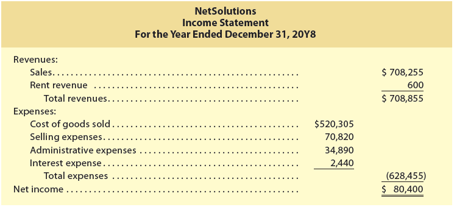</img>
---

<h1 id="096622" style="color:#E65100;">
  <a href="#Chapter_005" style="color:inherit; text-decoration:none;">
    5-4c Statement of Stockholders’ Equity
  </a>
</h1>

The statement of stockholders' equity for NetSolutions is shown in Exhibit 14. This statement assumes that NetSolutions issued $5,000 of additional common stock in 20Y8. The net income of $80,400 is taken from the income statement, while the dividends of $18,000 is taken from the adjusted trial balance, shown in Exhibit 11.

[El estado de cambios en el capital contable para NetSolutions se muestra en la Figura 14. Este estado supone que NetSolutions emitió $5,000 de acciones comunes adicionales en 20Y8. El ingreso neto de $80,400 se toma del estado de resultados, mientras que los dividendos de $18,000 se toman del balance de comprobación ajustado, que se muestra en la Figura 11.]

---
## Exhibit 11

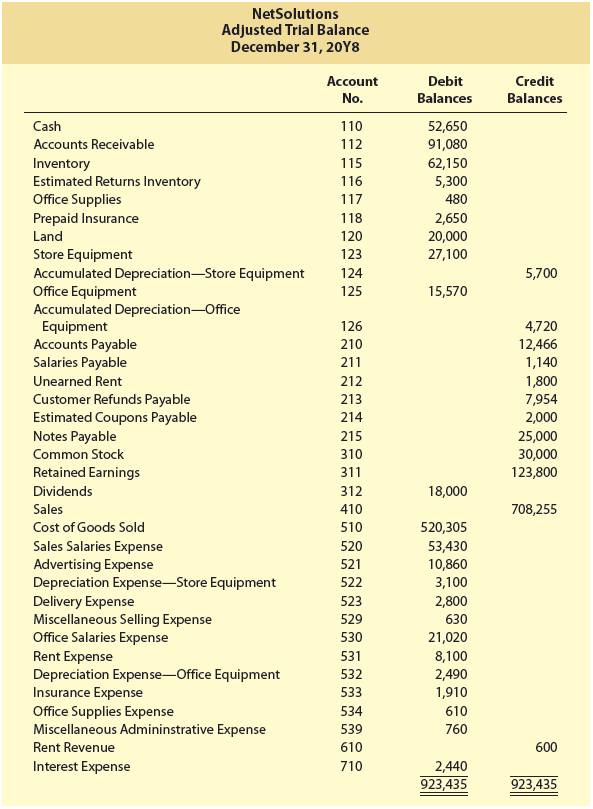</img>

## Exhibit 14

### Statement of Stockholders' Equity for Retail Business

[**Figura 14** - Estado de Cambios en el Capital Contable para un Negocio Minorista]

<!-- 📍 IMAGEN: Exhibit 14 - Statement of Stockholders' Equity (página 1) -->

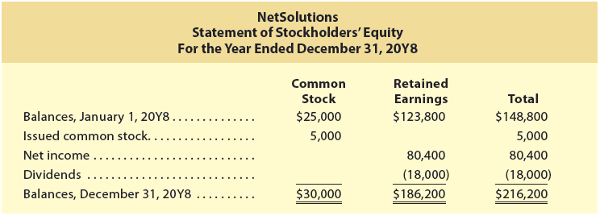

| | Common Stock | Retained Earnings | Total |
|---|---|---|---|
| Balances, January 1, 20Y8 | $25,000 | $123,800 | $148,800 |
| Issued common stock | 5,000 | | 5,000 |
| Net income | | 80,400 | 80,400 |
| Dividends | | (18,000) | (18,000) |
| **Balances, December 31, 20Y8** | **$30,000** | **$186,200** | **$216,200** |

---

<h1 id="725763" style="color:#E65100;">
  <a href="#Chapter_005" style="color:inherit; text-decoration:none;">
    5-4d Balance Sheet
  </a>
</h1>

The balance sheet for NetSolutions is shown in Exhibit 15. Inventory and estimated returns inventory are reported as current assets. In addition, customer refunds payable and the current portion of the note payable of $5,000 are reported as current liabilities.

[El balance general para NetSolutions se muestra en la Figura 15. El inventario y el inventario de devoluciones estimadas se reportan como activos corrientes. Además, los reembolsos a clientes por pagar y la porción corriente del pagaré de $5,000 se reportan como pasivos corrientes.]

---

## Exhibit 15

### Balance Sheet for Retail Business

[**Figura 15** - Balance General para un Negocio Minorista]

<!-- 📍 IMAGEN: Exhibit 15 - Balance Sheet for Retail Business (páginas 1-2) -->

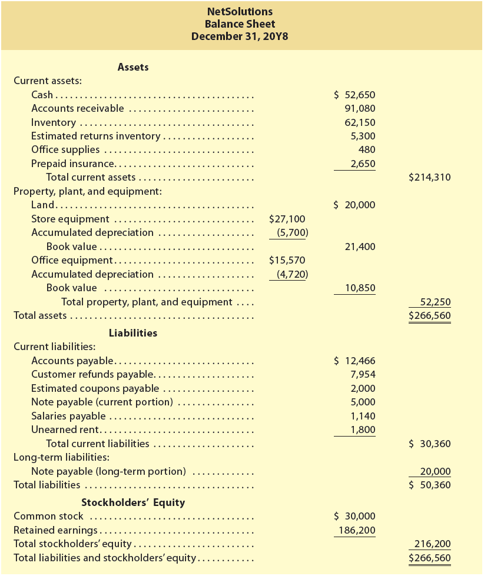

---

### NetSolutions
### Balance Sheet
### December 31, 20Y8

<table><tbody>
  <tr>
    <td colspan="6">Assets</td>
    <td></td>
    <td>Amount</td>
    <td>Total</td>
  </tr>
  <tr>
    <td></td>
    <td colspan="5">Current assets:</td>
    <td></td>
    <td></td>
    <td></td>
  </tr>
  <tr>
    <td></td>
    <td></td>
    <td colspan="4">Cash</td>
    <td></td>
    <td>$52,650</td>
    <td></td>
  </tr>
  <tr>
    <td></td>
    <td></td>
    <td colspan="4">Accounts receivable</td>
    <td></td>
    <td>91,080</td>
    <td></td>
  </tr>
  <tr>
    <td></td>
    <td></td>
    <td colspan="4">Inventory</td>
    <td></td>
    <td>62,150</td>
    <td></td>
  </tr>
  <tr>
    <td></td>
    <td></td>
    <td colspan="4">Estimated returns inventory</td>
    <td></td>
    <td>5,300</td>
    <td></td>
  </tr>
  <tr>
    <td></td>
    <td></td>
    <td colspan="4">Office supplies</td>
    <td></td>
    <td>480</td>
    <td></td>
  </tr>
  <tr>
    <td></td>
    <td></td>
    <td colspan="4">Prepaid insurance</td>
    <td></td>
    <td>2,650</td>
    <td></td>
  </tr>
  <tr>
    <td></td>
    <td></td>
    <td></td>
    <td colspan="3">Total current assets</td>
    <td></td>
    <td></td>
    <td>$214,310</td>
  </tr>
  <tr>
    <td></td>
    <td colspan="5">Property, plant, and equipment:</td>
    <td></td>
    <td></td>
    <td></td>
  </tr>
  <tr>
    <td></td>
    <td></td>
    <td colspan="4">Land</td>
    <td></td>
    <td>$20,000</td>
    <td></td>
  </tr>
  <tr>
    <td></td>
    <td></td>
    <td colspan="4">Store equipment</td>
    <td>$27,100</td>
    <td></td>
    <td></td>
  </tr>
  <tr>
    <td></td>
    <td></td>
    <td colspan="4">Accumulated depreciation</td>
    <td>(5,700)</td>
    <td></td>
    <td></td>
  </tr>
  <tr>
    <td></td>
    <td></td>
    <td></td>
    <td colspan="3">Book value</td>
    <td></td>
    <td>21,400</td>
    <td></td>
  </tr>
  <tr>
    <td></td>
    <td></td>
    <td colspan="4">Office equipment</td>
    <td>$15,570</td>
    <td></td>
    <td></td>
  </tr>
  <tr>
    <td></td>
    <td></td>
    <td colspan="4">Accumulated depreciation</td>
    <td>(4,720)</td>
    <td></td>
    <td></td>
  </tr>
  <tr>
    <td></td>
    <td></td>
    <td></td>
    <td colspan="3">Book value</td>
    <td></td>
    <td>10,850</td>
    <td></td>
  </tr>
  <tr>
    <td></td>
    <td></td>
    <td></td>
    <td></td>
    <td colspan="2">Total property, plant, and equipment</td>
    <td></td>
    <td></td>
    <td>$52,250</td>
  </tr>
  <tr>
    <td></td>
    <td colspan="5">Total assets</td>
    <td></td>
    <td></td>
    <td>$266,560</td>
  </tr>
  <tr>
    <td colspan="9"></td>
  </tr>
  <tr>
    <td colspan="6">Liabilities</td>
    <td></td>
    <td>Amount</td>
    <td>Total</td>
  </tr>
  <tr>
    <td></td>
    <td colspan="5">Current liabilities:</td>
    <td></td>
    <td></td>
    <td></td>
  </tr>
  <tr>
    <td></td>
    <td></td>
    <td colspan="4">Accounts payable</td>
    <td></td>
    <td>$12,466</td>
    <td></td>
  </tr>
  <tr>
    <td></td>
    <td></td>
    <td colspan="4">Customer refunds payable</td>
    <td></td>
    <td>7,954</td>
    <td></td>
  </tr>
  <tr>
    <td></td>
    <td></td>
    <td colspan="4">Estimated coupons payable</td>
    <td></td>
    <td>2,000</td>
    <td></td>
  </tr>
  <tr>
    <td></td>
    <td></td>
    <td colspan="4">Note payable (current portion)</td>
    <td></td>
    <td>5,000</td>
    <td></td>
  </tr>
  <tr>
    <td></td>
    <td></td>
    <td colspan="4">Salaries payable</td>
    <td></td>
    <td>1,140</td>
    <td></td>
  </tr>
  <tr>
    <td></td>
    <td></td>
    <td colspan="4">Unearned rent</td>
    <td></td>
    <td>1,800</td>
    <td></td>
  </tr>
  <tr>
    <td></td>
    <td></td>
    <td></td>
    <td colspan="3">Total current liabilities</td>
    <td></td>
    <td></td>
    <td>$30,360</td>
  </tr>
  <tr>
    <td></td>
    <td colspan="5">Long-term liabilities:</td>
    <td></td>
    <td></td>
    <td></td>
  </tr>
  <tr>
    <td></td>
    <td></td>
    <td colspan="4">Note payable (long-term portion)</td>
    <td></td>
    <td></td>
    <td>20,000</td>
  </tr>
  <tr>
    <td></td>
    <td colspan="5">Total liabilities</td>
    <td></td>
    <td></td>
    <td>$50,360</td>
  </tr>
  <tr>
    <td colspan="9"></td>
  </tr>
  <tr>
    <td colspan="6">Stockholders' Equity</td>
    <td></td>
    <td>Amount</td>
    <td>Total</td>
  </tr>
  <tr>
    <td></td>
    <td colspan="5">Common stock</td>
    <td></td>
    <td>$30,000</td>
    <td></td>
  </tr>
  <tr>
    <td></td>
    <td colspan="5">Retained earnings</td>
    <td></td>
    <td>186,200</td>
    <td></td>
  </tr>
  <tr>
    <td></td>
    <td colspan="5">Total stockholders' equity</td>
    <td></td>
    <td></td>
    <td>$216,200</td>
  </tr>
  <tr>
    <td></td>
    <td colspan="5">Total liabilities and stockholders' equity</td>
    <td></td>
    <td></td>
    <td>$266,560</td>
  </tr>
</tbody></table>

---

## **Link to Dollar Tree:** 
On a recent balance sheet, Dollar Tree reported inventory as a current asset and the current portion of long-term debt as a current liability.

[**Enlace a Dollar Tree:** En un balance general reciente, Dollar Tree reportó el inventario como un activo corriente y la porción corriente de la deuda a largo plazo como un pasivo corriente.]

---

## Ethics in Action

### The Cost of Employee Theft

[**Ética en Acción - El Costo del Robo de Empleados**]

A survey of 21 large retail businesses estimated that over $4 billion is lost to shoplifting and employee theft. The stores apprehended almost 10 times the number of shoplifters (315,095) than dishonest employees (32,941). However, the average amount stolen by dishonest employees ($1,380.62) was over 4.5 times the average amount stolen by shoplifters ($288.71). In some cases, stores were able to recover the thefts, but it was estimated that for every $1.00 recovered, $14.75 was lost. Fewer sales associates and more store reliance on customer self-service may be contributing to shoplifting. Less supervision of employees and the ability to sell stolen merchandise online may be contributing to employee thefts.

[Una encuesta de 21 grandes empresas minoristas estimó que más de $4 mil millones se pierden por robos en tiendas y robos de empleados. Las tiendas aprehendieron casi 10 veces más el número de ladrones de tiendas (315,095) que de empleados deshonestos (32,941). Sin embargo, el monto promedio robado por empleados deshonestos ($1,380.62) fue más de 4.5 veces el monto promedio robado por ladrones de tiendas ($288.71). En algunos casos, las tiendas pudieron recuperar los robos, pero se estimó que por cada $1.00 recuperado, se perdieron $14.75. Menos asociados de ventas y una mayor dependencia de las tiendas en el autoservicio del cliente pueden estar contribuyendo a los robos en tiendas. Menos supervisión de los empleados y la capacidad de vender mercancía robada en línea pueden estar contribuyendo a los robos de empleados.]

*Source: Jack L. Hayes International Inc., 32nd Annual Retail Theft Survey, 2020.*

---

<h1 id="256917" style="color:#E65100;">
  <a href="#Chapter_005" style="color:inherit; text-decoration:none;">
    5-4e The Closing Process
  </a>
</h1>

The closing entries for a retail business are similar to those for a service business. The two closing entries for a retail business are as follows:

[Los asientos de cierre para un negocio minorista son similares a los de un negocio de servicios. Los dos asientos de cierre para un negocio minorista son los siguientes:]

| Closing Entry 1. | Debit each revenue account for its balance, credit each expense account for its balance, and credit the retained earnings account for net income. Debit the retained earnings account for a net loss. Cost of Goods Sold is a temporary account and is closed like an expense account. |
|---|---|
| Closing Entry 2. | Debit the retained earnings account for the balance of the dividends account and credit the dividends account. |

The two closing entries for NetSolutions are as follows:

[Los dos asientos de cierre para NetSolutions son los siguientes:]

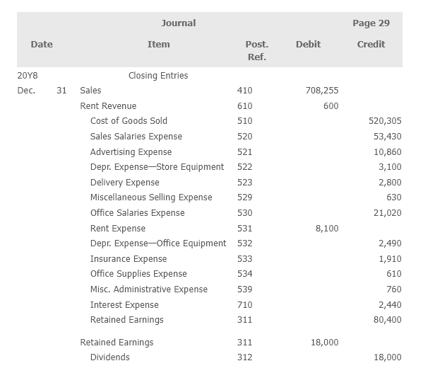</img>

<table><tbody>
  <tr>
    <td colspan="5">Journal</td>
    <td>Page 29</td>
  </tr>
  <tr>
    <td>Date</td>
    <td colspan="2">Item</td>
    <td>Post. Ref.</td>
    <td>Debit</td>
    <td>Credit</td>
  </tr>
  <tr>
    <td>20Y8 Dec. 31</td>
    <td></td>
    <td>Closing Entries</td>
    <td></td>
    <td></td>
    <td></td>
  </tr>
  <tr>
    <td></td>
    <td colspan="2">Sales</td>
    <td>410</td>
    <td>708,255</td>
    <td></td>
  </tr>
  <tr>
    <td></td>
    <td colspan="2">Rent Revenue</td>
    <td>610</td>
    <td>600</td>
    <td></td>
  </tr>
  <tr>
    <td></td>
    <td></td>
    <td>Cost of Goods Sold</td>
    <td>510</td>
    <td></td>
    <td>520,305</td>
  </tr>
  <tr>
    <td></td>
    <td></td>
    <td>Sales Salaries Expense</td>
    <td>520</td>
    <td></td>
    <td>53,430</td>
  </tr>
  <tr>
    <td></td>
    <td></td>
    <td>Advertising Expense</td>
    <td>521</td>
    <td></td>
    <td>10,860</td>
  </tr>
  <tr>
    <td></td>
    <td></td>
    <td>Depr. Expense—Store Equipment</td>
    <td>522</td>
    <td></td>
    <td>3,100</td>
  </tr>
  <tr>
    <td></td>
    <td></td>
    <td>Delivery Expense</td>
    <td>523</td>
    <td></td>
    <td>2,800</td>
  </tr>
  <tr>
    <td></td>
    <td></td>
    <td>Miscellaneous Selling Expense</td>
    <td>529</td>
    <td></td>
    <td>630</td>
  </tr>
  <tr>
    <td></td>
    <td></td>
    <td>Office Salaries Expense</td>
    <td>530</td>
    <td></td>
    <td>21,020</td>
  </tr>
  <tr>
    <td></td>
    <td></td>
    <td>Rent Expense</td>
    <td>531</td>
    <td></td>
    <td>8,100</td>
  </tr>
  <tr>
    <td></td>
    <td></td>
    <td>Depr. Expense—Office Equipment</td>
    <td>532</td>
    <td></td>
    <td>2,490</td>
  </tr>
  <tr>
    <td></td>
    <td></td>
    <td>Insurance Expense</td>
    <td>533</td>
    <td></td>
    <td>1,910</td>
  </tr>
  <tr>
    <td></td>
    <td></td>
    <td>Office Supplies Expense</td>
    <td>534</td>
    <td></td>
    <td>610</td>
  </tr>
  <tr>
    <td></td>
    <td></td>
    <td>Miscellaneous Administrative Expense</td>
    <td>539</td>
    <td></td>
    <td>760</td>
  </tr>
  <tr>
    <td></td>
    <td></td>
    <td>Interest Expense</td>
    <td>710</td>
    <td></td>
    <td>2,440</td>
  </tr>
  <tr>
    <td></td>
    <td></td>
    <td>Retained Earnings</td>
    <td>311</td>
    <td></td>
    <td>80,400</td>
  </tr>
  <tr>
    <td></td>
    <td></td>
    <td>To close revenue and expense accounts.</td>
    <td></td>
    <td></td>
    <td></td>
  </tr>
  <tr>
    <td>Dec. 31</td>
    <td colspan="2">Retained Earnings</td>
    <td>311</td>
    <td>18,000</td>
    <td></td>
  </tr>
  <tr>
    <td></td>
    <td></td>
    <td>Dividends</td>
    <td>312</td>
    <td></td>
    <td>18,000</td>
  </tr>
  <tr>
    <td></td>
    <td></td>
    <td>To close dividends account.</td>
    <td></td>
    <td></td>
    <td></td>
  </tr>
</tbody></table>

After the closing entries are posted to the accounts, a post-closing trial balance is prepared. The only accounts that appear on the post-closing trial balance are the asset, contra asset, liability, and stockholders' equity accounts with balances. These are the same accounts that appear on the end-of-period balance sheet. If the two totals of the trial balance columns are not equal, an error has occurred that must be found and corrected. The post-closing trial balance for NetSolutions is shown in Exhibit 16.

[Después de que los asientos de cierre se traspasan a las cuentas, se prepara un balance de comprobación posterior al cierre. Las únicas cuentas que aparecen en el balance de comprobación posterior al cierre son las cuentas de activo, contra activo, pasivo y capital contable con saldos. Estas son las mismas cuentas que aparecen en el balance general de fin de período. Si los dos totales de las columnas del balance de comprobación no son iguales, ha ocurrido un error que debe ser encontrado y corregido. El balance de comprobación posterior al cierre para NetSolutions se muestra en la Figura 16.]

---

## Exhibit 16

### Post-Closing Trial Balance

[**Figura 16** - Balance de Comprobación Posterior al Cierre]

<!-- 📍 IMAGEN: Exhibit 16 - Post-Closing Trial Balance (página 2) -->

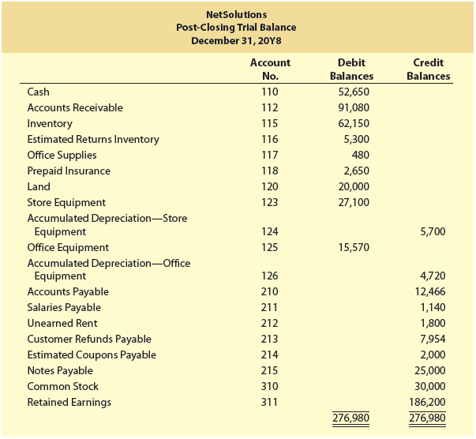

## NetSolutions

**Post-Closing Trial Balance**

**December 31, 20Y8**

| Account No. | | Debit Balances | Credit Balances |
|-------------|---------------------|---------------|-----------------|
| 110 | Cash | 52,650 | |
| 112 | Accounts Receivable | 91,080 | |
| 115 | Inventory | 62,150 | |
| 116 | Estimated Returns Inventory | 5,300 | |
| 117 | Office Supplies | 480 | |
| 118 | Prepaid Insurance | 2,650 | |
| 120 | Land | 20,000 | |
| 123 | Store Equipment | 27,100 | |
| 124 | Accumulated Depreciation—Store Equipment | | 5,700 |
| 125 | Office Equipment | 15,570 | |
| 126 | Accumulated Depreciation—Office Equipment | | 4,720 |
| 210 | Accounts Payable | | 12,466 |
| 211 | Salaries Payable | | 1,140 |
| 212 | Unearned Rent | | 1,800 |
| 213 | Customer Refunds Payable | | 7,954 |
| 214 | Estimated Coupons Payable | | 2,000 |
| 215 | Notes Payable | | 25,000 |
| 310 | Common Stock | | 30,000 |
| 311 | Retained Earnings | | 186,200 |
| | **Totals** | **276,980** | **276,980** |

---

## Analysis for Decision Making

### Asset Turnover Ratio

[**Análisis para la Toma de Decisiones - Razón de Rotación de Activos**]

**Objective 5** - Describe and illustrate the use of the asset turnover ratio in evaluating a company's operating performance.

[**Objetivo 5** - Describir e ilustrar el uso de la razón de rotación de activos en la evaluación del rendimiento operativo de una empresa.]

The **asset turnover ratio** (A profitability ratio that measures how effectively a business is using its assets to generate sales, computed as sales divided by average total assets.) measures how effectively a business is using its assets to generate sales. A high ratio indicates an effective use of assets.

[La **razón de rotación de activos** (una razón de rentabilidad que mide la efectividad con la que un negocio está utilizando sus activos para generar ventas, calculada como ventas divididas entre activos totales promedio) mide la efectividad con la que un negocio está utilizando sus activos para generar ventas. Una razón alta indica un uso efectivo de los activos.]

The asset turnover ratio is computed as follows:

[La razón de rotación de activos se calcula de la siguiente manera:]

$$\text{Asset Turnover Ratio} = \frac{\text{Sales}}{\text{Average Total Assets}}$$

The denominator is the average of the total assets at the beginning and end of the year. To illustrate the use of this ratio, the following data (in millions) were taken from recent annual reports of Dollar Tree, Inc. (DLTR):

[El denominador es el promedio de los activos totales al principio y al final del año. Para ilustrar el uso de esta razón, los siguientes datos (en millones) se tomaron de informes anuales recientes de Dollar Tree, Inc. (DLTR):]

| | Year 2 | Year 1 |
|---|---|---|
| Total sales | $22,823 | $22,246 |
| **Total assets:** | | |
| Beginning of year | $16,333 | $15,702 |
| End of year | $13,501 | $16,333 |

The asset turnover ratio for each year is as follows:

[La razón de rotación de activos para cada año es la siguiente:]

| | Year 2 | Year 1 |
|---|---|---|
| Sales | $22,823 | $22,246 |
| Average assets | $14,917 | $16,018 |
| | [($13,501 + $16,333) ÷ 2] | [($16,333 + $15,702) ÷ 2] |
| **Asset turnover ratio** | **1.53** | **1.39** |
| | $22,823 ÷ $14,917 | $22,246 ÷ $16,018 |

Dollar Tree's asset turnover ratio increased from 1.39 in Year 1 to 1.53 in Year 2. Thus, Dollar Tree had a significant increase in the use of its assets to generate sales in Year 2. This increase is likely due to Dollar Tree's reduction of the duplication of assets from its acquisition of Family Dollar Stores several years prior to Year 2.

[La razón de rotación de activos de Dollar Tree aumentó de 1.39 en el Año 1 a 1.53 en el Año 2. Por lo tanto, Dollar Tree tuvo un aumento significativo en el uso de sus activos para generar ventas en el Año 2. Este aumento probablemente se debe a la reducción de la duplicación de activos por parte de Dollar Tree de su adquisición de Family Dollar Stores varios años antes del Año 2.]

Using the asset turnover ratio for comparisons to competitors and with industry averages could also be beneficial in interpreting Dollar Tree's use of its assets (see MAD 5-2).

[El uso de la razón de rotación de activos para comparaciones con competidores y con promedios de la industria también podría ser beneficioso para interpretar el uso de sus activos por parte de Dollar Tree (vea MAD 5-2).]

---

## Make a Decision

### Asset Turnover Ratio

[**Tome una Decisión - Razón de Rotación de Activos**]

- Analyze and compare Amazon.com and Netflix (MAD 5-1) (Continuing company analysis)
- Analyze Dollar General (MAD 5-2)
- Compare Dollar Tree and Dollar General (MAD 5-3)
- Analyze and compare CSX, Union Pacific, and YRC Worldwide (MAD 5-4)
- Analyze Home Depot (MAD 5-5)
- Analyze and compare Kroger and Tiffany (MAD 5-6)
- Analyze J. C. Penney (MAD 5-7)

---

<h1 id="318957" style="color:#E65100;">
  <a href="#Chapter_005" style="color:inherit; text-decoration:none;">
    5-5 Appendix 1 Sales Discounts
  </a>
</h1>

When a company sells merchandise on account, the buyer and seller must agree on the credit period and terms prior to the delivery of the merchandise. These credit terms are normally included on the invoice (bill) that the seller sends to the buyer after delivery of the merchandise.

[Cuando una empresa vende mercancía a crédito, el comprador y el vendedor deben acordar el período de crédito y los términos antes de la entrega de la mercancía. Estos términos de crédito normalmente se incluyen en la factura (cuenta) que el vendedor envía al comprador después de la entrega de la mercancía.]

**Objective 6** - Describe and illustrate the gross and net methods of accounting for sales discounts.

[**Objetivo 6** - Describir e ilustrar los métodos bruto y neto de contabilización de descuentos por ventas.]

To encourage a buyer to pay the invoice early, a seller may offer a **sales discount** (From the seller's perspective, a discount that a seller may offer the buyer for early payment.) with such terms as 2/10, n/30. These terms provide a customer a 2% discount off of the invoice price if the customer pays within 10 days of the date of the invoice. If not paid within 10 days, the total invoice amount is due within 30 days. For example, a $12,000 invoice dated August 1 with terms 2/10, n/30 could be satisfied by paying $11,760 [$12,000 – ($12,000 × 2%)] on or before August 11. If the terms had been 1/10, n/30, the invoice could be satisfied by paying $11,880 [$12,000 – ($12,000 × 1%)]. If not paid by August 11, $12,000 would be due by August 31.

[Para alentar a un comprador a pagar la factura anticipadamente, un vendedor puede ofrecer un **descuento por ventas** (desde la perspectiva del vendedor, un descuento que un vendedor puede ofrecer al comprador por pago anticipado) con términos como 2/10, n/30. Estos términos proporcionan al cliente un descuento del 2% sobre el precio de la factura si el cliente paga dentro de los 10 días posteriores a la fecha de la factura. Si no se paga dentro de los 10 días, el monto total de la factura es exigible dentro de los 30 días. Por ejemplo, una factura de $12,000 fechada el 1 de agosto con términos 2/10, n/30 podría ser satisfecha pagando $11,760 [$12,000 – ($12,000 × 2%)] el 11 de agosto o antes. Si los términos hubieran sido 1/10, n/30, la factura podría ser satisfecha pagando $11,880 [$12,000 – ($12,000 × 1%)]. Si no se paga antes del 11 de agosto, $12,000 serían exigibles antes del 31 de agosto.]

Sales discounts for early payment may be accounted for by the seller using the gross method or the net method. Either method may be used as long as the seller's financial statements are reported using generally accepted accounting principles (GAAP).

[Los descuentos por ventas por pago anticipado pueden ser contabilizados por el vendedor utilizando el método bruto o el método neto. Cualquiera de los dos métodos puede ser utilizado siempre que los estados financieros del vendedor se reporten utilizando los principios de contabilidad generalmente aceptados (GAAP).]

---

<h1 id="542336" style="color:#E65100;">
  <a href="#Chapter_005" style="color:inherit; text-decoration:none;">
    5-5a Gross Method
  </a>
</h1>

Under the **gross method of recording sales discounts** (A method of recording a sales invoice at the gross amount rather than the amount net of any discounts offered for early payment.), a sales invoice with credit terms that include a discount for early payment is recorded at the invoice amount. If the customer pays within the discount period, Cash is debited for the amount received, the discount is recorded as a debit to Sales Discounts, and Accounts Receivable is credited for the invoice amount. Sales Discounts is a contra (offsetting) account to Sales and is used so that managers can determine the sales discounts taken during the period.

[Bajo el **método bruto de registro de descuentos por ventas** (un método de registrar una factura de venta por el monto bruto en lugar del monto neto de cualquier descuento ofrecido por pago anticipado), una factura de venta con términos de crédito que incluyen un descuento por pago anticipado se registra por el monto de la factura. Si el cliente paga dentro del período de descuento, se debita Efectivo por el monto recibido, el descuento se registra como un débito a Descuentos por Ventas, y se acredita Cuentas por Cobrar por el monto de la factura. Descuentos por Ventas es una cuenta de contra (compensatoria) a Ventas y se utiliza para que los gerentes puedan determinar los descuentos por ventas tomados durante el período.]

To illustrate, assume that NetSolutions sold $18,000 of merchandise to Digital Technologies on March 10, 20Y8, with credit terms of 2/10, n/30. The cost of the merchandise sold was $10,800. The sale would be recorded under the gross method as follows:

[Para ilustrar, suponga que NetSolutions vendió $18,000 de mercancía a Digital Technologies el 10 de marzo de 20Y8, con términos de crédito de 2/10, n/30. El costo de la mercancía vendida fue de $10,800. La venta se registraría bajo el método bruto de la siguiente manera:]

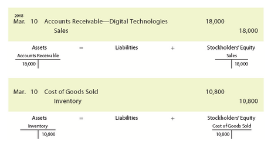</img>

| Date | Account | Debit | Credit |
|------|---------|-------|--------|
| Mar. 10 | Accounts Receivable | 18,000 | |
| | Sales | | 18,000 |
| | *Record sale on account.* | | |

<table><thead>
  <tr>
    <th colspan="2">Assets</th>
    <th>=</th>
    <th colspan="2">Liabilities</th>
    <th>+</th>
    <th colspan="2">Stockholders' Equity</th>
  </tr></thead>
<tbody>
  <tr>
    <td colspan="2">Accounts Receivable</td>
    <td rowspan="3"></td>
    <td colspan="2"></td>
    <td rowspan="3"></td>
    <td colspan="2">Sales</td>
  </tr>
  <tr>
    <td>debit</td>
    <td>credit</td>
    <td>debit</td>
    <td>credit</td>
    <td>debit</td>
    <td>credit</td>
  </tr>
  <tr>
    <td>18,000</td>
    <td></td>
    <td></td>
    <td></td>
    <td></td>
    <td>18,000</td>
  </tr>
</tbody>
</table>

| Date | Account | Debit | Credit |
|------|---------|-------|--------|
| Mar. 10 | Cost of Goods Sold | 10,800 | |
| | Inventory | | 10,800 |
| | *Record cost of goods sold.* | | |

<table><thead>
  <tr>
    <th colspan="2">Assets</th>
    <th>=</th>
    <th colspan="2">Liabilities</th>
    <th>+</th>
    <th colspan="2">Stockholders' Equity</th>
  </tr></thead>
<tbody>
  <tr>
    <td colspan="2"></td>
    <td rowspan="3"></td>
    <td colspan="2"></td>
    <td rowspan="3"></td>
    <td colspan="2">Cost of Goods Sold</td>
  </tr>
  <tr>
    <td>debit</td>
    <td>credit</td>
    <td>debit</td>
    <td>credit</td>
    <td>debit</td>
    <td>credit</td>
  </tr>
  <tr>
    <td>10,800</td>
    <td></td>
    <td></td>
    <td></td>
    <td></td>
    <td>10,800</td>
  </tr>
</tbody>
</table>

Assuming Digital Technologies pays within the discount period on March 20, the payment would be recorded as follows:

[Suponiendo que Digital Technologies paga dentro del período de descuento el 20 de marzo, el pago se registraría de la siguiente manera:]

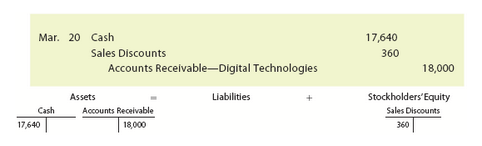</img>

| Date | Account | Debit | Credit |
|------|---------|-------|--------|
| Mar. 20 | Cash | 17,640 | |
| | Sales Discounts | 360 | |
| | Accounts Receivable | | 18,000 |
| | *Record payment within discount period.* | | |

<table><tbody>
  <tr>
    <td colspan="4">Assets</td>
    <td>=</td>
    <td colspan="2">Liabilities</td>
    <td>+</td>
    <td colspan="2">Stockholders' Equity</td>
  </tr>
  <tr>
    <td colspan="2">Cash</td>
    <td colspan="2">Accounts Receivable</td>
    <td rowspan="3"></td>
    <td colspan="2"></td>
    <td rowspan="3"></td>
    <td colspan="2">Sales Discounts</td>
  </tr>
  <tr>
    <td>debit</td>
    <td>credit</td>
    <td>debit</td>
    <td>credit</td>
    <td>debit</td>
    <td>credit</td>
    <td>debit</td>
    <td>credit</td>
  </tr>
  <tr>
    <td>17,640</td>
    <td></td>
    <td></td>
    <td>18,000</td>
    <td></td>
    <td></td>
    <td>360</td>
    <td></td>
  </tr>
</tbody>
</table>

Instead of paying within the discount period, assume that Digital Technologies pays the gross amount of $18,000 on April 9. The payment would be recorded as follows:

[En lugar de pagar dentro del período de descuento, suponga que Digital Technologies paga el monto bruto de $18,000 el 9 de abril. El pago se registraría de la siguiente manera:]

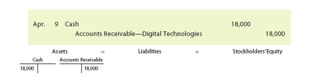</img>

| Date | Account | Debit | Credit |
|------|---------|-------|--------|
| Apr. 9 | Cash | 18,000 | |
| | Accounts Receivable | | 18,000 |
| | *Record payment after discount period.* | | |

<table><tbody>
  <tr>
    <td colspan="4">Assets</td>
    <td>=</td>
    <td colspan="2">Liabilities</td>
    <td>+</td>
    <td colspan="2">Stockholders' Equity</td>
  </tr>
  <tr>
    <td colspan="2">Cash</td>
    <td colspan="2">Accounts Receivable</td>
    <td rowspan="3"></td>
    <td colspan="2"></td>
    <td rowspan="3"></td>
    <td colspan="2"></td>
  </tr>
  <tr>
    <td>debit</td>
    <td>credit</td>
    <td>debit</td>
    <td>credit</td>
    <td>debit</td>
    <td>credit</td>
    <td>debit</td>
    <td>credit</td>
  </tr>
  <tr>
    <td>18,000</td>
    <td></td>
    <td></td>
    <td>18,000</td>
    <td></td>
    <td></td>
    <td></td>
    <td></td>
  </tr>
</tbody>
</table>

Generally accepted accounting principles (GAAP) require that sellers record revenue (sales) in the amount most likely to be received (entitled). Thus, when a customer takes or is likely to take a discount, sales must be reported net of the discount.

[Los principios de contabilidad generalmente aceptados (GAAP) requieren que los vendedores registren los ingresos (ventas) por el monto que es más probable que se reciba (al que tienen derecho). Por lo tanto, cuando un cliente toma o es probable que tome un descuento, las ventas deben reportarse netas del descuento.]

To illustrate, assume that at its year-end on December 31, 20Y2, Newland Interiors has a credit balance of $3,750,000 in Sales and a debit balance of $610,000 in Sales Discounts. Newland Interiors would report Net sales of $3,140,000 ($3,750,000 – $610,000) on its income statement.

[Para ilustrar, suponga que al final de su año el 31 de diciembre de 20Y2, Newland Interiors tiene un saldo acreedor de $3,750,000 en Ventas y un saldo deudor de $610,000 en Descuentos por Ventas. Newland Interiors reportaría Ventas netas de $3,140,000 ($3,750,000 – $610,000) en su estado de resultados.]

If Newland Interiors has a significant balance in Accounts Receivable on December 31, 20Y2, that are subject to sales discounts, an adjusting entry would be necessary to reduce Accounts Receivable and Sales to the amount expected to be received (entitled) in the following year. Since most companies have a fiscal year-end accounting period that coincides with their lowest level of operating activity, their end-of-the-year Accounts Receivable balance is normally relatively small. For this reason, this adjusting entry is not illustrated.

[Si Newland Interiors tiene un saldo significativo en Cuentas por Cobrar al 31 de diciembre de 20Y2, que están sujetas a descuentos por ventas, sería necesario un asiento de ajuste para reducir las Cuentas por Cobrar y las Ventas al monto que se espera recibir (al que se tiene derecho) en el año siguiente. Dado que la mayoría de las empresas tienen un período contable de fin de año fiscal que coincide con su nivel más bajo de actividad operativa, su saldo de Cuentas por Cobrar al final del año es normalmente relativamente pequeño. Por esta razón, este asiento de ajuste no se ilustra.]

---

<h1 id="088596" style="color:#E65100;">
  <a href="#Chapter_005" style="color:inherit; text-decoration:none;">
    5-5b Net Method
  </a>
</h1>

Under the **net method of recording sales discounts** (A method of recording a sales invoice at the amount net of any discounts for early payment.), a sales invoice with credit terms that include a discount for early payment is recorded at the net amount of the invoice. If the customer pays within the discount period, Cash is debited for the amount received and Accounts Receivable is credited.

[Bajo el **método neto de registro de descuentos por ventas** (un método de registrar una factura de venta por el monto neto de cualquier descuento por pago anticipado), una factura de venta con términos de crédito que incluyen un descuento por pago anticipado se registra por el monto neto de la factura. Si el cliente paga dentro del período de descuento, se debita Efectivo por el monto recibido y se acredita Cuentas por Cobrar.]

To illustrate, assume that NetSolutions sold $18,000 of merchandise to Digital Technologies on March 10, 20Y8, with credit terms of 2/10, n/30. The cost of the merchandise sold was $10,800. The sale would be recorded under the net method as follows:

[Para ilustrar, suponga que NetSolutions vendió $18,000 de mercancía a Digital Technologies el 10 de marzo de 20Y8, con términos de crédito de 2/10, n/30. El costo de la mercancía vendida fue de $10,800. La venta se registraría bajo el método neto de la siguiente manera:]

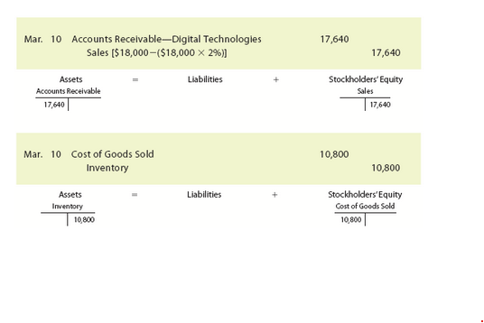</img>

| Date | Account | Debit | Credit |
|------|---------|-------|--------|
| Mar. 10 | Accounts Receivable | 17,640 | |
| | Sales | | 17,640 |
| | *Record sale on account.* | | |

<table><thead>
  <tr>
    <th colspan="2">Assets</th>
    <th>=</th>
    <th colspan="2">Liabilities</th>
    <th>+</th>
    <th colspan="2">Stockholders' Equity</th>
  </tr></thead>
<tbody>
  <tr>
    <td colspan="2">Accounts Receivable</td>
    <td rowspan="3"></td>
    <td colspan="2"></td>
    <td rowspan="3"></td>
    <td colspan="2">Sales</td>
  </tr>
  <tr>
    <td>debit</td>
    <td>credit</td>
    <td>debit</td>
    <td>credit</td>
    <td>debit</td>
    <td>credit</td>
  </tr>
  <tr>
    <td>17,640</td>
    <td></td>
    <td></td>
    <td></td>
    <td></td>
    <td>17,640</td>
  </tr>
</tbody>
</table>

| Date | Account | Debit | Credit |
|------|---------|-------|--------|
| Mar. 10 | Cost of Goods Sold | 10,800 | |
| | Inventory | | 10,800 |
| | *Record cost of goods sold.* | | |

<table><thead>
  <tr>
    <th colspan="2">Assets</th>
    <th>=</th>
    <th colspan="2">Liabilities</th>
    <th>+</th>
    <th colspan="2">Stockholders' Equity</th>
  </tr></thead>
<tbody>
  <tr>
    <td colspan="2">Inventory</td>
    <td rowspan="3"></td>
    <td colspan="2"></td>
    <td rowspan="3"></td>
    <td colspan="2">Cost of Goods Sold</td>
  </tr>
  <tr>
    <td>debit</td>
    <td>credit</td>
    <td>debit</td>
    <td>credit</td>
    <td>debit</td>
    <td>credit</td>
  </tr>
  <tr>
    <td></td>
    <td>10,800</td>
    <td></td>
    <td></td>
    <td>10,800</td>
    <td></td>
  </tr>
</tbody>
</table>

The sale to Digital Technologies is recorded by NetSolutions at $17,640, which is the invoice amount of $18,000 less the sales discount of $360 ($18,000 × 2%).

[La venta a Digital Technologies se registra por NetSolutions en $17,640, que es el monto de la factura de $18,000 menos el descuento por ventas de $360 ($18,000 × 2%).]

The payment by Digital Technologies on March 19 is recorded as follows:

[El pago de Digital Technologies el 19 de marzo se registra de la siguiente manera:]

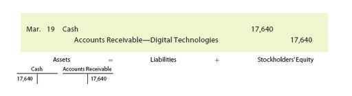</img>

| Date | Account | Debit | Credit |
|------|---------|-------|--------|
| Mar. 19 | Cash | 17,640 | |
| | Accounts Receivable | | 17,640 |
| | *Record payment within discount period.* | | |

<table><tbody>
  <tr>
    <td colspan="4">Assets</td>
    <td>=</td>
    <td colspan="2">Liabilities</td>
    <td>+</td>
    <td colspan="2">Stockholders' Equity</td>
  </tr>
  <tr>
    <td colspan="2">Cash</td>
    <td colspan="2">Accounts Receivable</td>
    <td rowspan="3"></td>
    <td colspan="2"></td>
    <td rowspan="3"></td>
    <td colspan="2"></td>
  </tr>
  <tr>
    <td>debit</td>
    <td>credit</td>
    <td>debit</td>
    <td>credit</td>
    <td>debit</td>
    <td>credit</td>
    <td>debit</td>
    <td>credit</td>
  </tr>
  <tr>
    <td>17,640</td>
    <td></td>
    <td></td>
    <td>17,640</td>
    <td></td>
    <td></td>
    <td></td>
    <td></td>
  </tr>
</tbody>
</table>

If Digital Technologies did not pay within the discount period, NetSolutions would receive $18,000 and Sales would be credited for the amount of the discount. For example, assuming that Digital Technologies paid NetSolutions on April 9, the payment would be recorded by NetSolutions as follows:

[Si Digital Technologies no pagara dentro del período de descuento, NetSolutions recibiría $18,000 y se acreditaría Ventas por el monto del descuento. Por ejemplo, suponiendo que Digital Technologies pagó a NetSolutions el 9 de abril, el pago sería registrado por NetSolutions de la siguiente manera:]

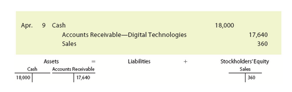</img>

| Date | Account | Debit | Credit |
|------|---------|-------|--------|
| Apr. 9 | Cash | 18,000 | |
| | Accounts Receivable | | 17,640 |
| | Sales | | 360 |
| | *Record payment after discount period.* | | |

<table><tbody>
  <tr>
    <td colspan="4">Assets</td>
    <td>=</td>
    <td colspan="2">Liabilities</td>
    <td>+</td>
    <td colspan="2">Stockholders' Equity</td>
  </tr>
  <tr>
    <td colspan="2">Cash</td>
    <td colspan="2">Accounts Receivable</td>
    <td rowspan="3"></td>
    <td colspan="2"></td>
    <td rowspan="3"></td>
    <td colspan="2">Sales</td>
  </tr>
  <tr>
    <td>debit</td>
    <td>credit</td>
    <td>debit</td>
    <td>credit</td>
    <td>debit</td>
    <td>credit</td>
    <td>debit</td>
    <td>credit</td>
  </tr>
  <tr>
    <td>18,000</td>
    <td></td>
    <td></td>
    <td>17,640</td>
    <td></td>
    <td></td>
    <td></td>
    <td>360</td>
  </tr>
</tbody>
</table>

The net method records Sales at the amount received from customers, which is net of any sales discounts. As a result, the net method is consistent with the GAAP requirement that revenue (sales) be recorded at the amount most likely to be received (entitled). Thus, Sales is reported on the income statement at the sales account balance.

[El método neto registra las Ventas por el monto recibido de los clientes, que es neto de cualquier descuento por ventas. Como resultado, el método neto es consistente con el requisito de GAAP de que los ingresos (ventas) se registren por el monto que es más probable que se reciba (al que se tiene derecho). Por lo tanto, las Ventas se reportan en el estado de resultados por el saldo de la cuenta de ventas.]

The disadvantage of the net method is that the amount of sales discounts taken by customers is not readily available from the ledger since there is no sales discounts account. Most computerized accounting systems, however, have the capability to capture a variety of data, including discounts, returns, and refunds by customers.

[La desventaja del método neto es que el monto de los descuentos por ventas tomados por los clientes no está fácilmente disponible en el libro mayor, ya que no hay una cuenta de descuentos por ventas. Sin embargo, la mayoría de los sistemas contables computarizados tienen la capacidad de capturar una variedad de datos, incluyendo descuentos, devoluciones y reembolsos por clientes.]

---

<h1 id="524006" style="color:#E65100;">
  <a href="#Chapter_005" style="color:inherit; text-decoration:none;">
    5-5c Comparison of Gross and Net Methods
  </a>
</h1>

A comparison of the gross and net methods using the NetSolutions sale of $18,000 illustrated earlier is shown in Exhibit 17.

[Una comparación de los métodos bruto y neto utilizando la venta de $18,000 de NetSolutions ilustrada anteriormente se muestra en la Figura 17.]

---

## Exhibit 17

### Gross and Net Methods of Recording Sales Discounts

[**Figura 17** - Métodos Bruto y Neto de Registro de Descuentos por Ventas]

<!-- 📍 IMAGEN: Exhibit 17 - Comparison of Gross and Net Methods (coordenadas [122, 245, 852, 580]) -->

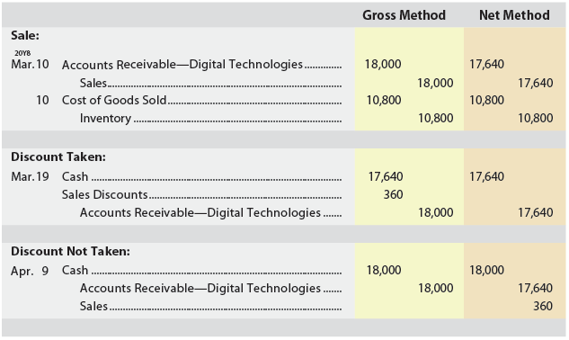

---

### Comparison of Gross and Net Methods

<table><tbody>
  <tr>
    <td colspan="4"></td>
    <td colspan="2">Gross Method</td>
    <td colspan="2">Net Method</td>
  </tr>
  <tr>
    <td colspan="4">Sale:</td>
    <td></td>
    <td></td>
    <td></td>
    <td></td>
  </tr>
  <tr>
    <td></td>
    <td>Mar. 10</td>
    <td colspan="2">Accounts Receivable-Digital Technologies</td>
    <td>18,000</td>
    <td></td>
    <td>17,640</td>
    <td></td>
  </tr>
  <tr>
    <td></td>
    <td></td>
    <td></td>
    <td>Sales.</td>
    <td></td>
    <td>18,000</td>
    <td></td>
    <td>17,640</td>
  </tr>
  <tr>
    <td></td>
    <td>10</td>
    <td colspan="2">Cost of Goods Sold</td>
    <td>18,000</td>
    <td></td>
    <td>18,000</td>
    <td></td>
  </tr>
  <tr>
    <td></td>
    <td></td>
    <td></td>
    <td>Inventory</td>
    <td></td>
    <td>18,000</td>
    <td></td>
    <td>18,000</td>
  </tr>
  <tr>
    <td colspan="4">Discount Taken:</td>
    <td></td>
    <td></td>
    <td></td>
    <td></td>
  </tr>
  <tr>
    <td></td>
    <td>Mar. 19</td>
    <td colspan="2">Cash</td>
    <td>17,640</td>
    <td></td>
    <td>17,640</td>
    <td></td>
  </tr>
  <tr>
    <td></td>
    <td></td>
    <td colspan="2">Sales Discounts.</td>
    <td>360</td>
    <td></td>
    <td></td>
    <td></td>
  </tr>
  <tr>
    <td></td>
    <td></td>
    <td></td>
    <td>Accounts Receivable-Digital Technologies</td>
    <td></td>
    <td>18,000</td>
    <td></td>
    <td>17,640</td>
  </tr>
  <tr>
    <td colspan="4">Discount Not Taken:</td>
    <td></td>
    <td></td>
    <td></td>
    <td></td>
  </tr>
  <tr>
    <td></td>
    <td>Apr. 9</td>
    <td colspan="2">Cash</td>
    <td>18,000</td>
    <td></td>
    <td>18,000</td>
    <td></td>
  </tr>
  <tr>
    <td></td>
    <td></td>
    <td></td>
    <td>Accounts Receivable-Digital Technologies</td>
    <td></td>
    <td>18,000</td>
    <td></td>
    <td>17,640</td>
  </tr>
  <tr>
    <td></td>
    <td></td>
    <td></td>
    <td>Sales</td>
    <td></td>
    <td></td>
    <td></td>
    <td>360</td>
  </tr>
</tbody></table>

---

<h1 id="292721" style="color:#E65100;">
  <a href="#Chapter_005" style="color:inherit; text-decoration:none;">
    5-6 Appendix 2 the Periodic Inventory System
  </a>
</h1>

Throughout this chapter, the perpetual inventory system was used to record purchases and sales of merchandise. Not all retail businesses, however, use the perpetual inventory system. For example, small retail businesses, such as a local hardware store, may use a manual accounting system. A manual perpetual inventory system is time consuming and costly to maintain. In this case, the periodic inventory system may be used.

[A lo largo de este capítulo, se utilizó el sistema de inventario perpetuo para registrar las compras y ventas de mercancía. Sin embargo, no todos los negocios minoristas utilizan el sistema de inventario perpetuo. Por ejemplo, los pequeños negocios minoristas, como una ferretería local, pueden utilizar un sistema contable manual. Un sistema de inventario perpetuo manual es lento y costoso de mantener. En este caso, se puede utilizar el sistema de inventario periódico.]

**Objective 7** - Describe and illustrate the periodic system of accounting for merchandise transactions.

[**Objetivo 7** - Describir e ilustrar el sistema periódico de contabilidad para transacciones de mercancía.]

Under the periodic inventory system, purchases are normally recorded at their invoice amount as a debit to Purchases. If the invoice is paid within the discount period, the discount is recorded as a credit in a separate account called Purchases Discounts. Likewise, purchases returns are recorded as a credit in a separate account called Purchases Returns and Allowances.

[Bajo el sistema de inventario periódico, las compras normalmente se registran por su monto de factura como un débito a Compras. Si la factura se paga dentro del período de descuento, el descuento se registra como un crédito en una cuenta separada llamada Descuentos por Compras. Del mismo modo, las devoluciones de compras se registran como un crédito en una cuenta separada llamada Devoluciones y Bonificaciones por Compras.]

---

<h1 id="213853" style="color:#E65100;">
  <a href="#Chapter_005" style="color:inherit; text-decoration:none;">
    5-6a Chart of Accounts under the Periodic Inventory System
  </a>
</h1>

The chart of accounts for NetSolutions under a periodic inventory system is shown in Exhibit 18. The accounts used to record transactions under the periodic inventory system are highlighted in blue in Exhibit 18.

[El catálogo de cuentas para NetSolutions bajo un sistema de inventario periódico se muestra en la Figura 18. Las cuentas utilizadas para registrar transacciones bajo el sistema de inventario periódico están resaltadas en azul en la Figura 18.]

---

## Exhibit 18

### Chart of Accounts under the Periodic Inventory System

[**Figura 18** - Catálogo de Cuentas bajo el Sistema de Inventario Periódico]

<!-- 📍 IMAGEN: Exhibit 18 - Chart of Accounts under the Periodic Inventory System (página 1) -->

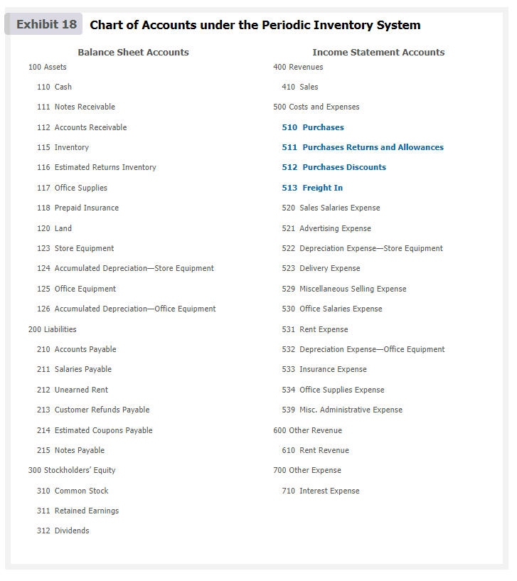

### Chart of Accounts under the Periodic Inventory System

[**Figura 18** - Catálogo de Cuentas bajo el Sistema de Inventario Periódico]

<table><tbody>
  <tr>
    <td colspan="3">Balance Sheet Accounts</td>
    <td colspan="3">Income Statement Accounts</td>
  </tr>
  <tr>
    <td></td>
    <td colspan="2">100 Assets</td>
    <td></td>
    <td colspan="2">400 Revenues</td>
  </tr>
  <tr>
    <td></td>
    <td></td>
    <td>110 Cash</td>
    <td></td>
    <td></td>
    <td>410 Sales</td>
  </tr>
  <tr>
    <td></td>
    <td></td>
    <td>111 Notes Receivable</td>
    <td></td>
    <td colspan="2">500 Costs and Expenses</td>
  </tr>
  <tr>
    <td></td>
    <td></td>
    <td>112 Accounts Receivable</td>
    <td></td>
    <td></td>
    <td>510 Purchases</td>
  </tr>
  <tr>
    <td></td>
    <td></td>
    <td>115 Inventory</td>
    <td></td>
    <td></td>
    <td>511 Purchases Returns and Allowances</td>
  </tr>
  <tr>
    <td></td>
    <td></td>
    <td>116 Estimated Returns Inventory</td>
    <td></td>
    <td></td>
    <td>512 Purchases Discounts</td>
  </tr>
  <tr>
    <td></td>
    <td></td>
    <td>117 Office Supplies</td>
    <td></td>
    <td></td>
    <td>513 Freight In</td>
  </tr>
  <tr>
    <td></td>
    <td></td>
    <td>118 Prepaid Insurance</td>
    <td></td>
    <td></td>
    <td>520 Sales Salaries Expense</td>
  </tr>
  <tr>
    <td></td>
    <td></td>
    <td>120 Land</td>
    <td></td>
    <td></td>
    <td>521 Advertising Expense</td>
  </tr>
  <tr>
    <td></td>
    <td></td>
    <td>123 Store Equipment</td>
    <td></td>
    <td></td>
    <td>522 Depreciation Expense—Store Equipment</td>
  </tr>
  <tr>
    <td></td>
    <td></td>
    <td>124 Accumulated Depreciation—Store Equipment</td>
    <td></td>
    <td></td>
    <td>523 Delivery Expense</td>
  </tr>
  <tr>
    <td></td>
    <td></td>
    <td>125 Office Equipment</td>
    <td></td>
    <td></td>
    <td>529 Miscellaneous Selling Expense</td>
  </tr>
  <tr>
    <td></td>
    <td></td>
    <td>126 Accumulated Depreciation—Office Equipment</td>
    <td></td>
    <td></td>
    <td>530 Office Salaries Expense</td>
  </tr>
  <tr>
    <td></td>
    <td colspan="2">200 Liabilities</td>
    <td></td>
    <td></td>
    <td>531 Rent Expense</td>
  </tr>
  <tr>
    <td></td>
    <td></td>
    <td>210 Accounts Payable</td>
    <td></td>
    <td></td>
    <td>532 Depreciation Expense—Office Equipment</td>
  </tr>
  <tr>
    <td></td>
    <td></td>
    <td>211 Salaries Payable</td>
    <td></td>
    <td></td>
    <td>533 Insurance Expense</td>
  </tr>
  <tr>
    <td></td>
    <td></td>
    <td>212 Unearned Rent</td>
    <td></td>
    <td></td>
    <td>534 Office Supplies Expense</td>
  </tr>
  <tr>
    <td></td>
    <td></td>
    <td>213 Customer Refunds Payable</td>
    <td></td>
    <td></td>
    <td>539 Miscellaneous Administrative Expense</td>
  </tr>
  <tr>
    <td></td>
    <td></td>
    <td>214 Estimated Coupons Payable</td>
    <td></td>
    <td colspan="2">600 Other Revenue</td>
  </tr>
  <tr>
    <td></td>
    <td></td>
    <td>215 Notes Payable</td>
    <td></td>
    <td></td>
    <td>610 Rent Revenue</td>
  </tr>
  <tr>
    <td></td>
    <td colspan="2">300 Stockholders' Equity</td>
    <td></td>
    <td colspan="2">700 Other Expense</td>
  </tr>
  <tr>
    <td></td>
    <td></td>
    <td>310 Common Stock</td>
    <td></td>
    <td></td>
    <td>710 Interest Expense</td>
  </tr>
  <tr>
    <td></td>
    <td></td>
    <td>311 Retained Earnings</td>
    <td></td>
    <td></td>
    <td></td>
  </tr>
  <tr>
    <td></td>
    <td></td>
    <td>312 Dividends</td>
    <td></td>
    <td></td>
    <td></td>
  </tr>
</tbody></table>

---

<h1 id="393689" style="color:#E65100;">
  <a href="#Chapter_005" style="color:inherit; text-decoration:none;">
    5-6b Recording Merchandise Transactions under the Periodic Inventory System
  </a>
</h1>

Using the periodic inventory system, purchases of inventory are not recorded in the inventory account. Instead, purchases, purchases discounts, and purchases returns and allowances accounts are used. In addition, the sales of merchandise are not recorded in the inventory account. Thus, there is no detailed record of the amount of inventory on hand at any given time. At the end of the period, a physical count of inventory on hand is taken. This physical count is used to determine the cost of goods sold as will be illustrated later.

[Utilizando el sistema de inventario periódico, las compras de inventario no se registran en la cuenta de inventario. En su lugar, se utilizan las cuentas de compras, descuentos por compras y devoluciones y bonificaciones por compras. Además, las ventas de mercancía no se registran en la cuenta de inventario. Por lo tanto, no hay un registro detallado de la cantidad de inventario disponible en ningún momento. Al final del período, se realiza un conteo físico del inventario disponible. Este conteo físico se utiliza para determinar el costo de los bienes vendidos como se ilustrará más adelante.]

The use of purchases, purchases discounts, purchases returns and allowances, and freight in accounts are described in this section.

[El uso de las cuentas de compras, descuentos por compras, devoluciones y bonificaciones por compras, y flete en se describen en esta sección.]

---

## Purchases

Purchases of inventory are recorded in a purchases account rather than in the inventory account. Purchases is debited for the invoice amount of a purchase.

[Las compras de inventario se registran en una cuenta de compras en lugar de en la cuenta de inventario. Compras se debita por el monto de la factura de una compra.]

---

## Purchases Discounts

Purchases discounts are normally recorded in a separate purchases discounts account. The balance of the purchases discounts account is reported as a deduction from Purchases for the period. Thus, Purchases Discounts is a contra (or offsetting) account to Purchases.

[Los descuentos por compras normalmente se registran en una cuenta separada de descuentos por compras. El saldo de la cuenta de descuentos por compras se reporta como una deducción de Compras para el período. Por lo tanto, Descuentos por Compras es una cuenta de contra (o compensatoria) a Compras.]

---

## Purchases Returns and Allowances

Purchases returns and allowances are recorded in a similar manner as purchases discounts. A separate purchases returns and allowances account is used to record returns and allowances. Purchases returns and allowances are reported as a deduction from Purchases for the period. Thus, Purchases Returns and Allowances is a contra (or offsetting) account to Purchases.

[Las devoluciones y bonificaciones por compras se registran de manera similar a los descuentos por compras. Se utiliza una cuenta separada de devoluciones y bonificaciones por compras para registrar las devoluciones y bonificaciones. Las devoluciones y bonificaciones por compras se reportan como una deducción de Compras para el período. Por lo tanto, Devoluciones y Bonificaciones por Compras es una cuenta de contra (o compensatoria) a Compras.]

---

## Freight In

When merchandise is purchased FOB shipping point, the buyer pays for the freight. Under the periodic inventory system, freight paid when purchasing merchandise FOB shipping point is debited to Freight In, Transportation In, or a similar account.

[Cuando la mercancía se compra FOB punto de embarque, el comprador paga el flete. Bajo el sistema de inventario periódico, el flete pagado al comprar mercancía FOB punto de embarque se debita a Flete en, Transporte en, o una cuenta similar.]

The preceding periodic inventory accounts and their effect on the cost of merchandise purchased are summarized as follows:

[Las cuentas de inventario periódico anteriores y su efecto en el costo de la mercancía comprada se resumen de la siguiente manera:]

| Account | Entry to Increase | Normal Balance | Effect on Cost of Merchandise Purchased |
|---|---|---|---|
| Purchases | Debit | Debit | Increases |
| Purchases Discounts | Credit | Credit | Decreases |
| Purchases Returns and Allowances | Credit | Credit | Decreases |
| Freight In | Debit | Debit | Increases |

Exhibit 19 illustrates the recording of merchandise transactions using the periodic system.

[La Figura 19 ilustra el registro de transacciones de mercancía utilizando el sistema periódico.]

---

## Exhibit 19

### Transactions Using the Periodic Inventory System

[**Figura 19** - Transacciones Utilizando el Sistema de Inventario Periódico]

<!-- 📍 IMAGEN: Exhibit 19 - Transactions Using the Periodic Inventory System (página 2) -->

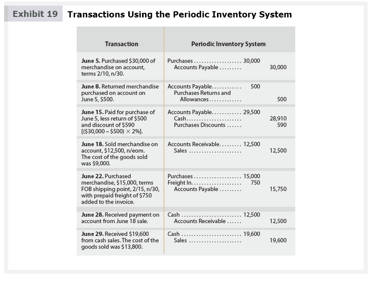

<table><tbody>
  <tr>
    <td rowspan="2">Transaction</td>
    <td colspan="4">Periodic Inventory System</td>
  </tr>
  <tr>
    <td colspan="2">Account</td>
    <td>Debit</td>
    <td>Credit</td>
  </tr>
  <tr>
    <td rowspan="2">June 5. Purchased $30,000  of merchandise on account,  terms 2/10, n/30.</td>
    <td colspan="2">Purchases</td>
    <td>30,000</td>
    <td></td>
  </tr>
  <tr>
    <td></td>
    <td>Accounts Payable</td>
    <td></td>
    <td>30,000</td>
  </tr>
  <tr>
    <td rowspan="2">June 8. Returned merchandise  purchased on account on  June 5, $500.</td>
    <td colspan="2">Accounts Payable</td>
    <td>500</td>
    <td></td>
  </tr>
  <tr>
    <td></td>
    <td>Purchases Returns and Allowances</td>
    <td></td>
    <td>500</td>
  </tr>
  <tr>
    <td rowspan="3">June 15. Paid for purchase  of June 5, less return of $500  and discount of  $590 [($30,000 – $500) × 2%].</td>
    <td colspan="2">Accounts Payable</td>
    <td>29,500</td>
    <td></td>
  </tr>
  <tr>
    <td></td>
    <td>Cash</td>
    <td></td>
    <td>28,910</td>
  </tr>
  <tr>
    <td></td>
    <td>Purchases Discounts</td>
    <td></td>
    <td>590</td>
  </tr>
  <tr>
    <td rowspan="2">June 18. Sold merchandise  on account, $12,500, n/eom.  The cost of the goods sold was $9,000.</td>
    <td colspan="2">Accounts Receivable</td>
    <td>12,500</td>
    <td></td>
  </tr>
  <tr>
    <td></td>
    <td>Sales</td>
    <td></td>
    <td>12,500</td>
  </tr>
  <tr>
    <td rowspan="3">June 22. Purchased merchandise,  $15,000, terms FOB shipping  point, 2/15, n/30, with prepaid  freight of $750 added to the invoice.</td>
    <td colspan="2">Purchases</td>
    <td>15,000</td>
    <td></td>
  </tr>
  <tr>
    <td colspan="2">Freight In</td>
    <td>750</td>
    <td></td>
  </tr>
  <tr>
    <td></td>
    <td>Accounts Payable</td>
    <td></td>
    <td>15,750</td>
  </tr>
  <tr>
    <td rowspan="2">June 28. Received payment  on account from June 18 sale.</td>
    <td colspan="2">Cash</td>
    <td>12,500</td>
    <td></td>
  </tr>
  <tr>
    <td></td>
    <td>Accounts Receivable</td>
    <td></td>
    <td>12,500</td>
  </tr>
  <tr>
    <td rowspan="2">June 29. Received $19,600  from cash sales. The cost of  the goods sold was $13,800.</td>
    <td colspan="2">Cash</td>
    <td>19,600</td>
    <td></td>
  </tr>
  <tr>
    <td></td>
    <td>Sales</td>
    <td></td>
    <td>19,600</td>
  </tr>
</tbody></table>

---

<h1 id="222755" style="color:#E65100;">
  <a href="#Chapter_005" style="color:inherit; text-decoration:none;">
    5-6c Adjusting Process under the Periodic Inventory System
  </a>
</h1>

The adjusting process is the same under the periodic and perpetual inventory systems except for the inventory shrinkage adjustment and customer refunds and allowances. The ending inventory is determined by a physical count under both systems.

[El proceso de ajuste es el mismo bajo los sistemas de inventario periódico y perpetuo, excepto por el ajuste de merma de inventario y las devoluciones y bonificaciones de clientes. El inventario final se determina mediante un conteo físico bajo ambos sistemas.]

Under the perpetual inventory system, the ending inventory physical count is compared to the balance of Inventory. The difference is the amount of inventory shrinkage. The inventory shrinkage is then recorded as a debit to Cost of Goods Sold and a credit to Inventory.

[Bajo el sistema de inventario perpetuo, el conteo físico del inventario final se compara con el saldo de Inventario. La diferencia es el monto de la merma de inventario. La merma de inventario se registra entonces como un débito a Costo de Bienes Vendidos y un crédito a Inventario.]

Under the periodic inventory system, the inventory account is not kept up to date for purchases and sales. As a result, the inventory shrinkage cannot be directly determined. Instead, any inventory shrinkage is included indirectly in the computation of the cost of goods sold as shown in Exhibit 20. This is a major disadvantage of the periodic inventory system. That is, inventory shrinkage is not separately determined.

[Bajo el sistema de inventario periódico, la cuenta de inventario no se mantiene actualizada para compras y ventas. Como resultado, la merma de inventario no se puede determinar directamente. En su lugar, cualquier merma de inventario se incluye indirectamente en el cálculo del costo de bienes vendidos como se muestra en la Figura 20. Esta es una desventaja importante del sistema de inventario periódico. Es decir, la merma de inventario no se determina por separado.]

---

## Exhibit 20

### Determining Cost of Goods Sold Using the Periodic System

[**Figura 20** - Determinación del Costo de Bienes Vendidos Utilizando el Sistema Periódico]

<!-- 📍 IMAGEN: Exhibit 20 - Determining Cost of Goods Sold Using the Periodic System (página 1) -->

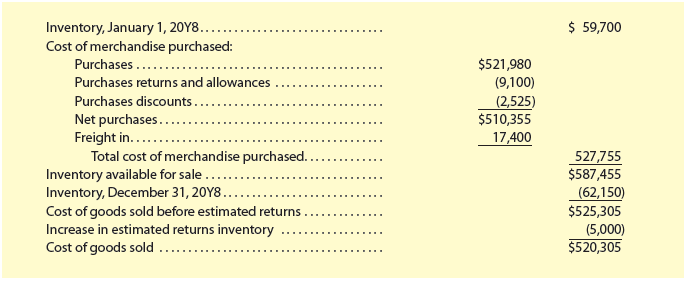

<table><tbody>
  <tr>
    <td colspan="4"></td>
    <td>Amount</td>
    <td>Total</td>
  </tr>
  <tr>
    <td colspan="4">Inventory, January 1, 20Y8</td>
    <td></td>
    <td>$59,700</td>
  </tr>
  <tr>
    <td colspan="4">Cost of merchandise purchased:</td>
    <td></td>
    <td></td>
  </tr>
  <tr>
    <td></td>
    <td colspan="3">Purchases</td>
    <td>$521,980</td>
    <td></td>
  </tr>
  <tr>
    <td></td>
    <td colspan="3">Purchases returns and allowances</td>
    <td>(9,100)</td>
    <td></td>
  </tr>
  <tr>
    <td></td>
    <td colspan="3">Purchases discounts</td>
    <td>(2,525)</td>
    <td></td>
  </tr>
  <tr>
    <td></td>
    <td colspan="3">Net purchases</td>
    <td>$510,355</td>
    <td></td>
  </tr>
  <tr>
    <td></td>
    <td colspan="3">Freight in</td>
    <td>17,400</td>
    <td></td>
  </tr>
  <tr>
    <td></td>
    <td></td>
    <td colspan="2">Total cost of merchandise purchased</td>
    <td></td>
    <td>527,755</td>
  </tr>
  <tr>
    <td colspan="4">Inventory available for sale</td>
    <td></td>
    <td>$587,455</td>
  </tr>
  <tr>
    <td colspan="4">Inventory, December 31, 20Y8</td>
    <td></td>
    <td>(62,150)</td>
  </tr>
  <tr>
    <td colspan="4">Cost of goods sold before estimated returns</td>
    <td></td>
    <td>$525,305</td>
  </tr>
  <tr>
    <td colspan="4">Increase in estimated returns inventory</td>
    <td></td>
    <td>(5,000)</td>
  </tr>
  <tr>
    <td colspan="4">Cost of goods sold</td>
    <td></td>
    <td>$520,305</td>
  </tr>
</tbody></table>

Like the perpetual inventory system, the periodic system records the same adjusting entry debiting Sales and crediting Customer Refunds Payable for estimated customer refunds and allowances of $7,154. No entry, however, is made for estimated returns inventory. Instead, cost of goods sold is reduced by the cost of the estimated returns inventory for the current year. The estimated cost of the returns for NetSolutions' 20Y9 sales is $5,000. This amount is subtracted from the cost of goods sold before estimated returns of $525,305 to yield cost of goods sold of $520,305, as shown in Exhibit 20.

[Al igual que el sistema de inventario perpetuo, el sistema periódico registra el mismo asiento de ajuste debitando Ventas y acreditando Reembolsos a Clientes por Pagar por los reembolsos y bonificaciones estimados a clientes de $7,154. Sin embargo, no se realiza ningún asiento para el inventario de devoluciones estimadas. En su lugar, el costo de bienes vendidos se reduce por el costo del inventario de devoluciones estimadas para el año en curso. El costo estimado de las devoluciones para las ventas de NetSolutions de 20Y9 es de $5,000. Este monto se resta del costo de bienes vendidos antes de las devoluciones estimadas de $525,305 para obtener un costo de bienes vendidos de $520,305, como se muestra en la Figura 20.]

---

<h1 id="629116" style="color:#E65100;">
  <a href="#Chapter_005" style="color:inherit; text-decoration:none;">
    5-6d Financial Statements under the Periodic Inventory System
  </a>
</h1>

The financial statements are similar under the perpetual and periodic inventory systems. When the multiple-step format of income statement is used, the cost of goods sold may be reported as shown in Exhibit 20.

[Los estados financieros son similares bajo los sistemas de inventario perpetuo y periódico. Cuando se utiliza el formato de estado de resultados de múltiples pasos, el costo de bienes vendidos puede reportarse como se muestra en la Figura 20.]

## Exhibit 20

[**Figura 20** - Determinación del Costo de Bienes Vendidos Utilizando el Sistema Periódico]

<!-- 📍 IMAGEN: Exhibit 20 - Determining Cost of Goods Sold Using the Periodic System (página 1) -->

---

<h1 id="441875" style="color:#E65100;">
  <a href="#Chapter_005" style="color:inherit; text-decoration:none;">
    5-6e Closing Entries under the Periodic Inventory System
  </a>
</h1>

The closing entries differ in the periodic inventory system in that there is no cost of goods sold account to close. Instead, the purchases, purchases discounts, purchases returns and allowances, and freight in accounts are closed. In addition, the inventory account is adjusted to the end-of-period physical inventory count during the closing process. The estimated returns inventory account is also adjusted for the estimated returns from the current period's sales.

[Los asientos de cierre difieren en el sistema de inventario periódico en que no hay una cuenta de costo de bienes vendidos para cerrar. En su lugar, se cierran las cuentas de compras, descuentos por compras, devoluciones y bonificaciones por compras, y flete en. Además, la cuenta de inventario se ajusta al conteo físico del inventario al final del período durante el proceso de cierre. La cuenta de inventario de devoluciones estimadas también se ajusta por las devoluciones estimadas de las ventas del período actual.]

The two closing entries under the periodic inventory system are as follows:

[Los dos asientos de cierre bajo el sistema de inventario periódico son los siguientes:]

1. a. Debit Inventory for its end-of-period balance based on the physical inventory.
   b. Debit Estimated Returns Inventory for the cost of the future estimated returns of the current period's sales.
   c. Debit each revenue account and the following temporary periodic inventory accounts for their balances:
      - Purchases Discounts
      - Purchases Returns and Allowances
   d. Credit Inventory for its balance as of the beginning of the period.
   e. Credit each expense account and the following temporary periodic inventory accounts for their balances:
      - Purchases
      - Freight In
   f. Credit the retained earnings account for the net income, or debit the retained earnings account for a net loss.

2. Debit the retained earnings account and credit the dividends account for its balance.

[1. a. Debitar Inventario por su saldo al final del período basado en el inventario físico.
   b. Debitar Inventario de Devoluciones Estimadas por el costo de las devoluciones futuras estimadas de las ventas del período actual.
   c. Debitar cada cuenta de ingreso y las siguientes cuentas temporales de inventario periódico por sus saldos:
      - Descuentos por Compras
      - Devoluciones y Bonificaciones por Compras
   d. Acreditar Inventario por su saldo al inicio del período.
   e. Acreditar cada cuenta de gasto y las siguientes cuentas temporales de inventario periódico por sus saldos:
      - Compras
      - Flete en
   f. Acreditar la cuenta de ganancias retenidas por el ingreso neto, o debitar la cuenta de ganancias retenidas por una pérdida neta.

2. Debitar la cuenta de ganancias retenidas y acreditar la cuenta de dividendos por su saldo.]

The two closing entries for NetSolutions under the periodic inventory system are shown in Exhibit 21.

[Los dos asientos de cierre para NetSolutions bajo el sistema de inventario periódico se muestran en la Figura 21.]

---

## Exhibit 21

### Closing Entries for Periodic Inventory System

[**Figura 21** - Asientos de Cierre para el Sistema de Inventario Periódico]

<!-- 📍 IMAGEN: Exhibit 21 - Closing Entries for Periodic Inventory System (páginas 1-2) -->

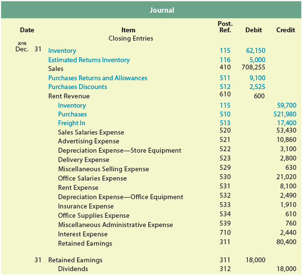

## Exhibit 21

### Closing Entries for Periodic Inventory System

[**Figura 21** - Asientos de Cierre para el Sistema de Inventario Periódico]

<table><tbody>
  <tr>
    <td>Date</td>
    <td colspan="2">Item</td>
    <td>Post. Ref.</td>
    <td>Debit</td>
    <td>Credit</td>
  </tr>
  <tr>
    <td>20Y8</td>
    <td colspan="2">Closing Entries</td>
    <td></td>
    <td></td>
    <td></td>
  </tr>
  <tr>
    <td>Dec. 31</td>
    <td colspan="2">Inventory</td>
    <td>115</td>
    <td>62,150</td>
    <td></td>
  </tr>
  <tr>
    <td></td>
    <td colspan="2">Estimated Returns Inventory</td>
    <td>116</td>
    <td>5,000</td>
    <td></td>
  </tr>
  <tr>
    <td></td>
    <td colspan="2">Sales</td>
    <td>410</td>
    <td>708,255</td>
    <td></td>
  </tr>
  <tr>
    <td></td>
    <td colspan="2">Purchases Returns and Allowances</td>
    <td>511</td>
    <td>9,100</td>
    <td></td>
  </tr>
  <tr>
    <td></td>
    <td colspan="2">Purchases Discounts</td>
    <td>512</td>
    <td>2,525</td>
    <td></td>
  </tr>
  <tr>
    <td></td>
    <td colspan="2">Rent Revenue</td>
    <td>610</td>
    <td>600</td>
    <td></td>
  </tr>
  <tr>
    <td></td>
    <td></td>
    <td>Inventory</td>
    <td>115</td>
    <td></td>
    <td>59,700</td>
  </tr>
  <tr>
    <td></td>
    <td></td>
    <td>Purchases</td>
    <td>510</td>
    <td></td>
    <td>521,980</td>
  </tr>
  <tr>
    <td></td>
    <td></td>
    <td>Freight In</td>
    <td>513</td>
    <td></td>
    <td>17,400</td>
  </tr>
  <tr>
    <td></td>
    <td></td>
    <td>Sales Salaries Expense</td>
    <td>520</td>
    <td></td>
    <td>53,430</td>
  </tr>
  <tr>
    <td></td>
    <td></td>
    <td>Advertising Expense</td>
    <td>521</td>
    <td></td>
    <td>10,860</td>
  </tr>
  <tr>
    <td></td>
    <td></td>
    <td>Depreciation Expense—Store Equipment</td>
    <td>522</td>
    <td></td>
    <td>3,100</td>
  </tr>
  <tr>
    <td></td>
    <td></td>
    <td>Delivery Expense</td>
    <td>523</td>
    <td></td>
    <td>2,800</td>
  </tr>
  <tr>
    <td></td>
    <td></td>
    <td>Miscellaneous Selling Expense</td>
    <td>529</td>
    <td></td>
    <td>630</td>
  </tr>
  <tr>
    <td></td>
    <td></td>
    <td>Office Salaries Expense</td>
    <td>530</td>
    <td></td>
    <td>21,020</td>
  </tr>
  <tr>
    <td></td>
    <td></td>
    <td>Rent Expense</td>
    <td>531</td>
    <td></td>
    <td>8,100</td>
  </tr>
  <tr>
    <td></td>
    <td></td>
    <td>Depreciation Expense—Office Equipment</td>
    <td>532</td>
    <td></td>
    <td>2,490</td>
  </tr>
  <tr>
    <td></td>
    <td></td>
    <td>Insurance Expense</td>
    <td>533</td>
    <td></td>
    <td>1,910</td>
  </tr>
  <tr>
    <td></td>
    <td></td>
    <td>Office Supplies Expense</td>
    <td>534</td>
    <td></td>
    <td>610</td>
  </tr>
  <tr>
    <td></td>
    <td></td>
    <td>Miscellaneous Administrative Expense</td>
    <td>539</td>
    <td></td>
    <td>760</td>
  </tr>
  <tr>
    <td></td>
    <td></td>
    <td>Interest Expense</td>
    <td>710</td>
    <td></td>
    <td>2,440</td>
  </tr>
  <tr>
    <td></td>
    <td></td>
    <td>Retained Earnings</td>
    <td>311</td>
    <td></td>
    <td>80,400</td>
  </tr>
  <tr>
    <td></td>
    <td></td>
    <td></td>
    <td></td>
    <td></td>
    <td></td>
  </tr>
  <tr>
    <td>Dec. 31</td>
    <td colspan="2">Retained Earnings</td>
    <td>311</td>
    <td>18,000</td>
    <td></td>
  </tr>
  <tr>
    <td></td>
    <td></td>
    <td>Dividends</td>
    <td>312</td>
    <td></td>
    <td>18,000</td>
  </tr>
</tbody></table>

In the first closing entry, Inventory is debited for $62,150. This is the ending physical inventory count on December 31, 20Y8. In addition, the cost of the estimated merchandise returns from 20Y8 sales is debited to Estimated Returns Inventory for $5,000. Inventory is credited for its January 1, 20Y8, balance of $59,700. In this way, the closing entries reflect the effects of the beginning and ending inventory in determining the cost of goods sold, as shown in Exhibit 20. After the closing entries are posted, Inventory will have a balance of $62,150 and Estimated Returns Inventory will have a balance of $5,300, which are the amounts reported on the December 31, 20Y8, balance sheet.

[En el primer asiento de cierre, Inventario se debita por $62,150. Este es el conteo físico del inventario final al 31 de diciembre de 20Y8. Además, el costo de las devoluciones de mercancía estimadas de las ventas de 20Y8 se debita a Inventario de Devoluciones Estimadas por $5,000. Inventario se acredita por su saldo del 1 de enero de 20Y8 de $59,700. De esta manera, los asientos de cierre reflejan los efectos del inventario inicial y final en la determinación del costo de bienes vendidos, como se muestra en la Figura 20. Después de que se traspasan los asientos de cierre, Inventario tendrá un saldo de $62,150 e Inventario de Devoluciones Estimadas tendrá un saldo de $5,300, que son los montos reportados en el balance general del 31 de diciembre de 20Y8.]

In Exhibit 21, the periodic inventory accounts are highlighted. Under the perpetual inventory system, the highlighted periodic inventory accounts are replaced by the cost of goods sold account.

[En la Figura 21, las cuentas de inventario periódico están resaltadas. Bajo el sistema de inventario perpetuo, las cuentas de inventario periódico resaltadas son reemplazadas por la cuenta de costo de bienes vendidos.]

---

<h1 id="912447" style="color:#E65100;">
  <a href="#Chapter_005" style="color:inherit; text-decoration:none;">
    5-7a Let’s Review Chapter Summary
  </a>
</h1>

[**5-7 Revisión del Capítulo - 5-7a Revisemos el Resumen del Capítulo**]

**1.** Retail businesses purchase merchandise for selling to customers. On a retail business's income statement, revenue from selling merchandise is reported as sales. The cost of the goods sold is subtracted from sales to arrive at gross profit. The operating expenses are subtracted from gross profit to arrive at operating income. Inventory, which is merchandise not sold, is reported as a current asset on the balance sheet. The chart of accounts for a retail business (NetSolutions) is shown in Exhibit 2.

[**1.** Los negocios minoristas compran mercancía para vender a los clientes. En el estado de resultados de un negocio minorista, los ingresos por la venta de mercancía se reportan como ventas. El costo de los bienes vendidos se resta de las ventas para llegar a la utilidad bruta. Los gastos operativos se restan de la utilidad bruta para llegar al ingreso operativo. El inventario, que es la mercancía no vendida, se reporta como un activo corriente en el balance general. El catálogo de cuentas para un negocio minorista (NetSolutions) se muestra en la Figura 2.]

**2.** Purchases of merchandise for cash or on account are recorded as inventory. Discounts for early payment of purchases on account are called purchases discounts. If paid within the discount period, a purchase discount decreases the cost of the inventory. Price adjustments or returned merchandise are recorded as a decrease in inventory.

[**2.** Las compras de mercancía al contado o a crédito se registran como inventario. Los descuentos por pago anticipado de compras a crédito se llaman descuentos por compras. Si se paga dentro del período de descuento, un descuento por compras disminuye el costo del inventario. Los ajustes de precio o la mercancía devuelta se registran como una disminución en el inventario.]

Sales of merchandise for cash or on account are recorded as sales. The cost of goods sold and the reduction in inventory are also recorded at the time of sale.

[Las ventas de mercancía al contado o a crédito se registran como ventas. El costo de los bienes vendidos y la reducción en el inventario también se registran en el momento de la venta.]

A seller may offer customers a variety of sales incentives, promotions, and discounts in the form of coupons and rebates. A point-of-sale coupon is recorded as a decrease in sales (revenue) at the time of the customer's purchase. If a coupon or rebate is issued at the time of the customer's purchase, the seller incurs a future liability. In this case, the seller estimates the dollar value of the coupons that will be redeemed, debits Sales (revenue) by that amount, and credits Estimated Coupons Payable. When customers redeem the coupons, Estimated Coupons Payable is debited. When the coupon period has expired, any remaining balance of Estimated Coupons Payable is transferred to Sales (revenue) as an increase (credit balance) or decrease (debit balance). Rebates are accounted for in a similar manner as coupons.

[Un vendedor puede ofrecer a los clientes una variedad de incentivos de ventas, promociones y descuentos en forma de cupones y reembolsos. Un cupón de punto de venta se registra como una disminución en las ventas (ingresos) en el momento de la compra del cliente. Si se emite un cupón o reembolso en el momento de la compra del cliente, el vendedor incurre en un pasivo futuro. En este caso, el vendedor estima el valor en dólares de los cupones que se canjearán, debita Ventas (ingresos) por ese monto y acredita Cupones Estimados por Pagar. Cuando los clientes canjean los cupones, se debitan los Cupones Estimados por Pagar. Cuando el período de cupones ha expirado, cualquier saldo restante de Cupones Estimados por Pagar se transfiere a Ventas (ingresos) como un aumento (saldo acreedor) o disminución (saldo deudor). Los reembolsos se contabilizan de manera similar a los cupones.]

A seller may pay a customer a refund or grant a price allowance for defective, returned, or damaged merchandise. At the end of the accounting period, a seller must estimate future returns, refunds, and allowances. Based upon this estimate, sellers record two adjusting entries. The first adjusting entry debits Sales and credits Customer Refunds Payable. The second adjusting entry debits Estimated Returns Inventory and credits Cost of Goods Sold.

[Un vendedor puede pagar a un cliente un reembolso o conceder una bonificación de precio por mercancía defectuosa, devuelta o dañada. Al final del período contable, un vendedor debe estimar las devoluciones, reembolsos y bonificaciones futuras. Con base en esta estimación, los vendedores registran dos asientos de ajuste. El primer asiento de ajuste debita Ventas y acredita Reembolsos a Clientes por Pagar. El segundo asiento de ajuste debita Inventario de Devoluciones Estimadas y acredita Costo de Bienes Vendidos.]

When a customer is issued a refund or allowance, Customer Refunds Payable is debited and either Cash, if the customer has already paid for the merchandise, or Accounts Receivable is credited. If merchandise is returned, Inventory is debited for the cost of the returned merchandise and Estimated Returns Inventory is credited. On the balance sheet, Estimated Returns Inventory is reported as a current asset and Customer Refunds Payable is reported as a current liability.

[Cuando se emite un reembolso o bonificación a un cliente, se debitan los Reembolsos a Clientes por Pagar y se acredita Efectivo, si el cliente ya ha pagado por la mercancía, o Cuentas por Cobrar. Si se devuelve la mercancía, se debita Inventario por el costo de la mercancía devuelta y se acredita Inventario de Devoluciones Estimadas. En el balance general, el Inventario de Devoluciones Estimadas se reporta como un activo corriente y los Reembolsos a Clientes por Pagar se reportan como un pasivo corriente.]

When merchandise is shipped FOB shipping point, the buyer pays the freight and debits Inventory. When merchandise is shipped FOB destination, the seller pays the freight and debits Delivery Expense or Freight Out. Inventory transactions can be summarized in T account form as shown in Exhibit 9. Each merchandising transaction affects a buyer and a seller. The liability for sales tax is incurred when the sale is made and is recorded by the seller as a credit to the sales tax payable account. Trade discounts are discounts off the list price of merchandise.

[Cuando la mercancía se envía FOB punto de embarque, el comprador paga el flete y debita Inventario. Cuando la mercancía se envía FOB destino, el vendedor paga el flete y debita Gastos de Entrega o Flete de Salida. Las transacciones de inventario se pueden resumir en forma de cuenta T como se muestra en la Figura 9. Cada transacción de mercancía afecta a un comprador y a un vendedor. El pasivo por el impuesto a las ventas se incurre cuando se realiza la venta y es registrado por el vendedor como un crédito a la cuenta de impuesto a las ventas por pagar. Los descuentos comerciales son descuentos sobre el precio de lista de la mercancía.]

**3.** At the end of the accounting period, a retail business must record several adjusting entries that differ from those of a service business. An adjusting entry to reconcile the physical inventory and the balance of the perpetual inventory account is made. The normal adjusting entry for when the inventory account is greater than the physical inventory, called inventory shrinkage, is to debit Cost of Goods Sold and credit Inventory. A seller must also record two adjusting entries for expected returns and allowances. The first adjusting entry debits Sales and credits Customer Refunds Payable. The second entry debits Estimated Returns Inventory and credits Cost of Goods Sold.

[**3.** Al final del período contable, un negocio minorista debe registrar varios asientos de ajuste que difieren de los de un negocio de servicios. Se realiza un asiento de ajuste para conciliar el inventario físico y el saldo de la cuenta de inventario perpetuo. El asiento de ajuste normal cuando la cuenta de inventario es mayor que el inventario físico, llamado merma de inventario, es debitar Costo de Bienes Vendidos y acreditar Inventario. Un vendedor también debe registrar dos asientos de ajuste para devoluciones y bonificaciones esperadas. El primer asiento de ajuste debita Ventas y acredita Reembolsos a Clientes por Pagar. El segundo asiento debita Inventario de Devoluciones Estimadas y acredita Costo de Bienes Vendidos.]

**4.** The multiple-step income statement of a retailer reports sales. The cost of the goods sold is subtracted from sales to determine the gross profit. Operating income is determined by subtracting selling and administrative expenses from gross profit. Net income is determined by adding or subtracting the net of other revenue and expense. The income statement may also be reported in a single-step form. The statement of stockholders' equity is similar to that for a service business. The balance sheet reports inventory and estimated returns inventory as current assets. Customer refunds payable is reported as a current liability. The closing entries for a retail business are similar to those for a service business except that Cost of Goods Sold is also closed.

[**4.** El estado de resultados de múltiples pasos de un minorista reporta las ventas. El costo de los bienes vendidos se resta de las ventas para determinar la utilidad bruta. El ingreso operativo se determina restando los gastos de venta y administrativos de la utilidad bruta. El ingreso neto se determina sumando o restando el neto de otros ingresos y gastos. El estado de resultados también puede reportarse en forma de un solo paso. El estado de cambios en el capital contable es similar al de un negocio de servicios. El balance general reporta el inventario y el inventario de devoluciones estimadas como activos corrientes. Los reembolsos a clientes por pagar se reportan como un pasivo corriente. Los asientos de cierre para un negocio minorista son similares a los de un negocio de servicios, excepto que el Costo de Bienes Vendidos también se cierra.]

**5.** The asset turnover ratio measures how effectively a business is using its assets to generate sales. A high ratio indicates an effective use of assets. The asset turnover ratio is computed by dividing sales by average total assets.

[**5.** La razón de rotación de activos mide la efectividad con la que un negocio está utilizando sus activos para generar ventas. Una razón alta indica un uso efectivo de los activos. La razón de rotación de activos se calcula dividiendo las ventas entre el promedio de los activos totales.]

## Exhibit 2

</img>

## Exhibit 9

---

<h1 id="144764" style="color:#E65100;">
  <a href="#Chapter_005" style="color:inherit; text-decoration:none;">
    5-7b Key Terms
  </a>
</h1>

[**5-7b Términos Clave**]

| English Term | Español | Definition (English) | Definición (Español) |
|--------------|---------|---------------------|---------------------|
| accounts payable subsidiary ledger | libro mayor auxiliar de cuentas por pagar | The subsidiary ledger containing the individual accounts with suppliers (creditors); also called the creditors ledger. | El libro mayor auxiliar que contiene las cuentas individuales con los proveedores (acreedores); también llamado libro mayor de acreedores. |
| accounts receivable subsidiary ledger | libro mayor auxiliar de cuentas por cobrar | The subsidiary ledger containing the individual accounts with customers; also called the customers ledger. | El libro mayor auxiliar que contiene las cuentas individuales con los clientes; también llamado libro mayor de clientes. |
| administrative expenses | gastos administrativos | Expenses incurred in the administration or general operations of the business. | Gastos incurridos en la administración u operaciones generales del negocio. |
| asset turnover ratio | razón de rotación de activos | A profitability ratio that measures how effectively a business is using its assets to generate sales, computed as sales divided by average total assets. | Una razón de rentabilidad que mide la efectividad con la que un negocio está utilizando sus activos para generar ventas, calculada como ventas divididas entre activos totales promedio. |
| business-to-business (B2B) | empresa-empresa | Transactions between suppliers and retailers. | Transacciones entre proveedores y minoristas. |
| business-to-consumer (B2C) | empresa-consumidor | Transactions between retailers and consumers. | Transacciones entre minoristas y consumidores. |
| cash refund | reembolso en efectivo | An amount paid by the seller to the buyer for merchandise that is defective, is damaged during shipment, or does not meet the buyer's expectations. | Un monto pagado por el vendedor al comprador por mercancía que está defectuosa, dañada durante el envío o que no cumple con las expectativas del comprador. |
| controlling account | cuenta de control | The account in the general ledger that summarizes the balances of the accounts in a subsidiary ledger. | La cuenta en el libro mayor general que resume los saldos de las cuentas en un libro mayor auxiliar. |
| cost of goods sold | costo de bienes vendidos | The cost of merchandise sold recognized as an expense; the cost of finished goods available for sale minus the ending finished goods inventory. | El costo de la mercancía vendida reconocido como un gasto; el costo de los bienes terminados disponibles para la venta menos el inventario final de bienes terminados. |
| coupon | cupón | A sales incentive or promotion that provides the customer a discount when purchasing a product. | Un incentivo o promoción de ventas que proporciona al cliente un descuento al comprar un producto. |
| credit memorandum | memorándum de crédito | A form used by a seller to inform the buyer of the amount the seller proposes to credit to the account receivable due from the buyer. | Un formulario utilizado por un vendedor para informar al comprador del monto que el vendedor propone acreditar a la cuenta por cobrar del comprador. |
| credit period | período de crédito | The amount of time the buyer is allowed in which to pay the seller. | El período de tiempo que se le permite al comprador para pagar al vendedor. |
| credit terms | términos de crédito | Terms for payment on account by the buyer to the seller. | Términos de pago a cuenta por parte del comprador al vendedor. |
| customer refunds payable | reembolsos a clientes por pagar | A liability account for estimated refunds and allowances that will be paid or granted to customers in the future. | Una cuenta de pasivo para reembolsos y bonificaciones estimados que se pagarán o concederán a los clientes en el futuro. |
| debit cards | tarjetas de débito | Cards used for electronic payment by which the money required by the purchase is deducted instantly from the customer's bank account. | Tarjetas utilizadas para pagos electrónicos mediante los cuales el dinero requerido por la compra se deduce instantáneamente de la cuenta bancaria del cliente. |
| debit memorandum | memorándum de débito | A form used by a buyer to inform the seller of the amount the buyer proposes to debit to the account payable due the seller. | Un formulario utilizado por el comprador para informar al vendedor del monto que el comprador propone debitar a la cuenta por pagar al vendedor. |
| estimated coupons payable | cupones estimados por pagar | A current liability account for the estimated amount of coupons printed out with sales receipts that will be redeemed by customers. | Una cuenta de pasivo corriente por el monto estimado de cupones impresos con los recibos de ventas que serán canjeados por los clientes. |
| estimated returns inventory | inventario de devoluciones estimadas | A current asset account for the estimated amount of merchandise that will be returned by customers. | Una cuenta de activo corriente por el monto estimado de mercancía que será devuelta por los clientes. |
| FOB (free on board) destination | FOB destino | Freight terms in which the seller pays the transportation costs from the shipping point to the final destination. | Términos de flete en los que el vendedor paga los costos de transporte desde el punto de embarque hasta el destino final. |
| FOB (free on board) shipping point | FOB punto de embarque | Freight terms in which the buyer pays the transportation costs from the shipping point to the final destination. | Términos de flete en los que el comprador paga los costos de transporte desde el punto de embarque hasta el destino final. |
| general ledger | libro mayor general | The primary ledger, when used in conjunction with subsidiary ledgers, that contains all of the balance sheet and income statement accounts. | El libro mayor principal, cuando se usa en conjunto con libros mayores auxiliares, que contiene todas las cuentas del balance general y del estado de resultados. |
| gross method of recording sales discounts | método bruto de registro de descuentos por ventas | A method of recording a sales invoice at the gross amount rather than the amount net of any discounts offered for early payment. | Un método de registrar una factura de venta por el monto bruto en lugar del monto neto de cualquier descuento ofrecido por pago anticipado. |
| gross profit | utilidad bruta | Sales minus the cost of goods sold. | Ventas menos el costo de bienes vendidos. |
| instant rebates | reembolsos instantáneos | Rebates that may be redeemed at the time of purchase. | Reembolsos que pueden canjearse en el momento de la compra. |
| inventory | inventario | Merchandise on hand (not sold) at the end of an accounting period. | Mercancía disponible (no vendida) al final de un período contable. |
| inventory shrinkage | merma de inventario | The amount by which the merchandise for sale, as indicated by the balance of the inventory account, is larger than the total amount of merchandise counted during the physical inventory. | El monto por el cual la mercancía para la venta, según lo indica el saldo de la cuenta de inventario, es mayor que el monto total de la mercancía contada durante el inventario físico. |
| inventory subsidiary ledger | libro mayor auxiliar de inventario | A supporting ledger to the inventory account, containing an individual account for each inventory item. | Un libro mayor de respaldo a la cuenta de inventario, que contiene una cuenta individual para cada artículo de inventario. |
| invoice | factura | The bill that the seller sends to the buyer for sales made or services rendered on account. | La cuenta que el vendedor envía al comprador por las ventas realizadas o los servicios prestados a crédito. |
| multiple-step income statement | estado de resultados de múltiples pasos | A form of income statement that contains several sections, subsections, and subtotals. | Una forma de estado de resultados que contiene varias secciones, subsecciones y subtotales. |
| net method of recording sales discounts | método neto de registro de descuentos por ventas | A method of recording a sales invoice at the amount net of any discounts for early payment. | Un método de registrar una factura de venta por el monto neto de cualquier descuento por pago anticipado. |
| operating cycle | ciclo operativo | The process by which a company spends cash, generates revenues, and receives cash from customers. | El proceso mediante el cual una empresa gasta efectivo, genera ingresos y recibe efectivo de los clientes. |
| operating income | ingreso operativo | The difference between gross profit and operating expenses. | La diferencia entre la utilidad bruta y los gastos operativos. |
| other expense | otros gastos | Expenses that cannot be traced directly to operations. | Gastos que no pueden rastrearse directamente a las operaciones. |
| other revenue | otros ingresos | Revenue from sources other than the primary operating activity of a business. | Ingresos de fuentes distintas a la actividad operativa principal de un negocio. |
| periodic inventory system | sistema de inventario periódico | An inventory system in which the inventory records are updated only after a physical count has been taken at periodic intervals, usually at the end of an accounting period. | Un sistema de inventario en el que los registros de inventario se actualizan solo después de que se ha realizado un conteo físico a intervalos periódicos, generalmente al final de un período contable. |
| perpetual inventory system | sistema de inventario perpetuo | The inventory system in which each purchase and sale of merchandise is recorded in the inventory account and related subsidiary ledger; therefore, the inventory records are updated continuously. | El sistema de inventario en el que cada compra y venta de mercancía se registra en la cuenta de inventario y en el libro mayor auxiliar relacionado; por lo tanto, los registros de inventario se actualizan continuamente. |
| physical inventory | inventario físico | A detailed listing of merchandise on hand. | Una lista detallada de la mercancía disponible. |
| point-of-sale coupons | cupones de punto de venta | Coupons that have no value and the retailer has no obligation until a customer purchases merchandise and presents the coupon. | Cupones que no tienen valor y el minorista no tiene obligación hasta que un cliente compra mercancía y presenta el cupón. |
| purchases discounts | descuentos por compras | Discounts taken by the buyer for early payment of an invoice. | Descuentos tomados por el comprador por el pago anticipado de una factura. |
| purchases returns and allowances | devoluciones y bonificaciones por compras | From the buyer's perspective, returned merchandise or an adjustment for defective merchandise. | Desde la perspectiva del comprador, mercancía devuelta o un ajuste por mercancía defectuosa. |
| rebate | reembolso | A sales incentive or promotion that provides the customer a refund after the product is purchased. | Un incentivo o promoción de ventas que proporciona al cliente un reembolso después de que se compra el producto. |
| retail business | negocio minorista | A business that sells merchandise that it has purchased from other companies to consumers. | Un negocio que vende mercancía que ha comprado a otras empresas a los consumidores. |
| sales | ventas | Revenue from the sale of merchandise to customers. | Ingresos por la venta de mercancía a los clientes. |
| sales allowance | bonificación por venta | A reduction in a customer's account receivable granted due to damaged or defective merchandise. | Una reducción en la cuenta por cobrar del cliente concedida debido a mercancía dañada o defectuosa. |
| sales discount | descuento por ventas | From the seller's perspective, a discount that a seller may offer the buyer for early payment. | Desde la perspectiva del vendedor, un descuento que un vendedor puede ofrecer al comprador por pago anticipado. |
| selling expenses | gastos de venta | Expenses that are incurred directly in the selling of merchandise. | Gastos que se incurren directamente en la venta de mercancía. |
| single-step income statement | estado de resultados de un solo paso | A form of income statement in which the total of all expenses is deducted from the total of all revenues. | Una forma de estado de resultados en la que el total de todos los gastos se deduce del total de todos los ingresos. |
| special journals | diarios especiales | Journals designed to be used for recording a single type of transaction that occurs frequently. | Diarios diseñados para ser utilizados para registrar un solo tipo de transacción que ocurre con frecuencia. |
| subsidiary ledger | libro mayor auxiliar | Individual accounts with a common characteristic grouped together in a separate or secondary ledger, which is used to support a controlling account in the general ledger. | Cuentas individuales con una característica común agrupadas en un libro mayor separado o secundario, que se utiliza para respaldar una cuenta de control en el libro mayor general. |
| suppliers | proveedores | A company that sells merchandise to retailers. | Una empresa que vende mercancía a minoristas. |
| trade discounts | descuentos comerciales | Discounts from the list prices in published catalogs or special discounts offered to certain classes of buyers. | Descuentos sobre los precios de lista en catálogos publicados o descuentos especiales ofrecidos a ciertas clases de compradores. |
| vendors | vendedores | A company that sells merchandise to retailers. | Una empresa que vende mercancía a minoristas. |
| wholesale businesses | empresas mayoristas | A company that sells merchandise to other businesses rather than to the public. | Una empresa que vende mercancía a otras empresas en lugar de al público. |

---
