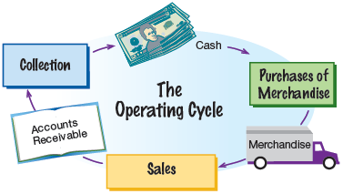
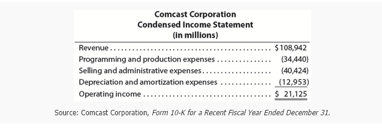
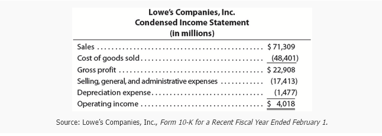
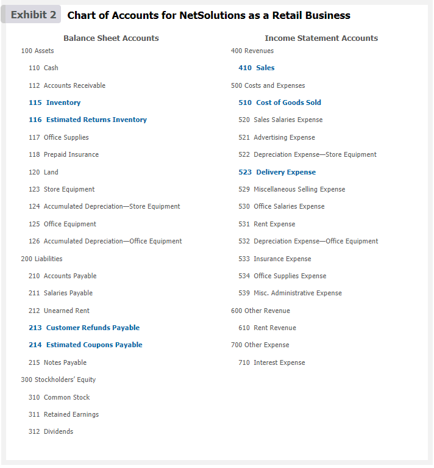
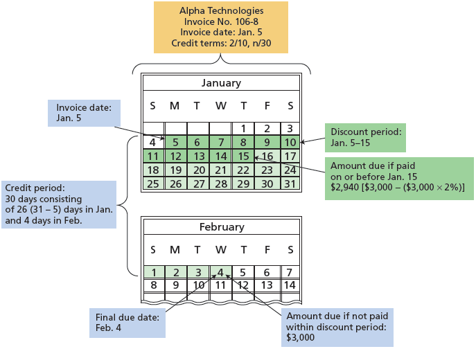
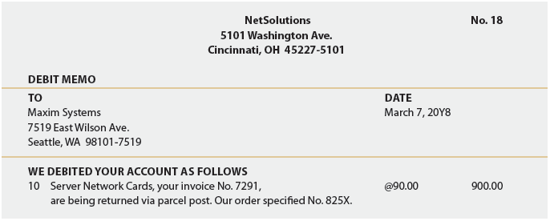
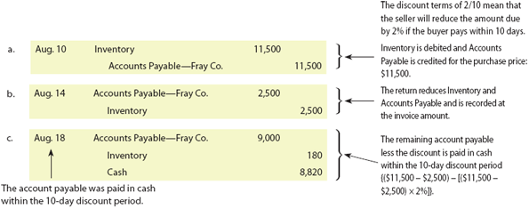

<h1 id="Chapter_005" style="color:#42A5F5;">Indice</h1>

##### [Capitulo Titu5-1 Nature of Retail Businesseslo](#426147)

##### [Capitulo 5-1a Operating Cycle](#711892)

##### [Capitulo 5-1b Financial Statements](#686884)

##### [Capitulo 5-2 Merchandise Transactions](#295824)

##### [Capitulo 5-2a Chart of Accounts for Retail Business](#059025)

##### [Capitulo 5-2b Subsidiary Ledgers](#863176)

##### [Capitulo 5-2c Purchases Transactions](#589443)

##### [Capitulo 5-2d Sales Transactions](#168964)

<h1 id="426147" style="color:#E65100;">
  <a href="#Chapter_005" style="color:inherit; text-decoration:none;">
    5-1 Nature of Retail Businesses
  </a>
</h1>

Retail businesses sell merchandise that they have purchased from other companies to consumers. Companies selling the merchandise to retailers are called **suppliers** (A company that sells merchandise to retailers.) or **vendors** (A company that sells merchandise to retailers.). The transactions between suppliers and retailers are called **business-to-business (B2B)** (Transactions between suppliers and retailers.) transactions. Transactions between retailers and consumers are called **business-to-consumer (B2C)** (Transactions between retailers and consumers.) transactions. For example, the selling of a variety of health and beauty products by Procter & Gamble (PG) to Target (TGT) is a B2B transaction. In contrast, the selling of Procter & Gamble's products such as Tide and Charmin to customers by Target is a B2C transaction.

[Los negocios minoristas venden mercancía que han comprado a otras empresas a los consumidores. Las empresas que venden la mercancía a los minoristas se llaman **proveedores** (una empresa que vende mercancía a minoristas) o **vendedores** (una empresa que vende mercancía a minoristas). Las transacciones entre proveedores y minoristas se llaman transacciones **empresa-empresa (B2B)** (transacciones entre proveedores y minoristas). Las transacciones entre minoristas y consumidores se llaman transacciones **empresa-consumidor (B2C)** (transacciones entre minoristas y consumidores). Por ejemplo, la venta de una variedad de productos de salud y belleza por parte de Procter & Gamble (PG) a Target (TGT) es una transacción B2B. En contraste, la venta de productos de Procter & Gamble como Tide y Charmin a los clientes por parte de Target es una transacción B2C.]

The activities of a service business differ from those of a retail business. These differences are reflected in the operating cycles of a service and retail business as well as in their financial statements.

[Las actividades de un negocio de servicios difieren de las de un negocio minorista. Estas diferencias se reflejan en los ciclos operativos de un negocio de servicios y uno minorista, así como en sus estados financieros.]

**Objective 1** - Distinguish between the activities and financial statements of service and retail businesses.

[**Objetivo 1** - Distinguir entre las actividades y los estados financieros de los negocios de servicios y minoristas.]

---

<h1 id="711892" style="color:#E65100;">
  <a href="#Chapter_005" style="color:inherit; text-decoration:none;">
    The Operating Cycle for a Retail Business
  </a>
</h1>

The **operating cycle** (The process by which a company spends cash, generates revenues, and receives cash from customers.) is the process by which a company spends cash, generates revenues, and receives cash from customers. The operating cycle of a service and retail business differs in that a retail business must purchase merchandise for sale to customers. The operating cycle for a retail business is shown in Exhibit 1.

[El **ciclo operativo** (el proceso mediante el cual una empresa gasta efectivo, genera ingresos y recibe efectivo de los clientes) es el proceso mediante el cual una empresa gasta efectivo, genera ingresos y recibe efectivo de los clientes. El ciclo operativo de un negocio de servicios y uno minorista difiere en que un negocio minorista debe comprar mercancía para la venta a los clientes. El ciclo operativo para un negocio minorista se muestra en la Figura 1.]

---

## Exhibit 1

### The Operating Cycle for a Retail Business

[**Figura 1** - El Ciclo Operativo para un Negocio Minorista]

<!-- 📍 IMAGEN: Exhibit 1 - The Operating Cycle for a Retail Business (coordenadas [122, 340, 582, 542]) -->

**Diagram Description:**

1. **Cash** → Purchase of Merchandise Inventory → Merchandise Inventory
2. Merchandise Inventory → Sale on Account → Accounts Receivable
3. Accounts Receivable → Cash received from customers → Cash

[**Descripción del diagrama:**

1. **Efectivo** → Compra de Inventario de Mercancía → Inventario de Mercancía
2. Inventario de Mercancía → Venta a Crédito → Cuentas por Cobrar
3. Cuentas por Cobrar → Efectivo recibido de clientes → Efectivo]

The time in days to complete an operating cycle differs significantly among retail businesses. Grocery stores normally have short operating cycles because of the nature of their merchandise. For example, many grocery items, such as milk, must be sold within their expiration dates of a week or two. In contrast, jewelry stores often carry expensive items that are displayed months before being sold to customers.

[El tiempo en días para completar un ciclo operativo difiere significativamente entre los negocios minoristas. Los supermercados normalmente tienen ciclos operativos cortos debido a la naturaleza de su mercancía. Por ejemplo, muchos artículos de supermercado, como la leche, deben venderse dentro de sus fechas de vencimiento de una o dos semanas. En contraste, las joyerías a menudo tienen artículos costosos que se exhiben durante meses antes de ser vendidos a los clientes.]

---

<h1 id="686884" style="color:#E65100;">
  <a href="#Chapter_005" style="color:inherit; text-decoration:none;">
    5-1b Financial Statements
  </a>
</h1>

The differences between service and retail businesses are also reflected in their financial statements. For example, these differences are illustrated in the following condensed income statements:

[Las diferencias entre los negocios de servicios y minoristas también se reflejan en sus estados financieros. Por ejemplo, estas diferencias se ilustran en los siguientes estados de resultados condensados:]

</img>

<table><thead>
  <tr>
    <th colspan="2">Service Business</th>
    <th colspan="2">Retail Business</th>
  </tr></thead>
<tbody>
  <tr>
    <td>Fees earned</td>
    <td>XXX</td>
    <td>Sales</td>
    <td>XXX</td>
  </tr>
  <tr>
    <td>Operating expenses</td>
    <td>- (XXX)</td>
    <td>Cost of goods sold</td>
    <td>- (XXX)</td>
  </tr>
  <tr>
    <td>Operating income</td>
    <td>XXX</td>
    <td>Gross profit</td>
    <td>XXX</td>
  </tr>
  <tr>
    <td></td>
    <td></td>
    <td>Operating expenses</td>
    <td>- (XXX)</td>
  </tr>
  <tr>
    <td></td>
    <td></td>
    <td>Operating income</td>
    <td>XXX</td>
  </tr>
</tbody>
</table>

The revenue activities of a service business involve providing services to customers. On the income statement for a service business, the revenues from services are reported as fees earned. The operating expenses incurred in providing the services are subtracted from the fees earned to arrive at operating income.

[Las actividades de ingresos de un negocio de servicios implican proporcionar servicios a los clientes. En el estado de resultados de un negocio de servicios, los ingresos por servicios se reportan como honorarios ganados. Los gastos operativos incurridos en la prestación de los servicios se restan de los honorarios ganados para llegar al ingreso operativo.]

In contrast, the revenue activities of a retail business involve the buying and selling of merchandise. A retail business first purchases merchandise to sell to its customers. When this merchandise is sold, the revenue is reported as sales, and its cost is recognized as an expense. This expense is called the **cost of goods sold** (The cost of merchandise sold recognized as an expense; the cost of finished goods available for sale minus the ending finished goods inventory.) or cost of merchandise sold. The cost of goods sold is subtracted from sales to arrive at gross profit. This amount is called **gross profit** (Sales minus the cost of goods sold.) because it is the profit before deducting operating expenses. The operating expenses are subtracted from gross profit to arrive at operating income.

[En contraste, las actividades de ingresos de un negocio minorista implican la compra y venta de mercancía. Un negocio minorista primero compra mercancía para vender a sus clientes. Cuando esta mercancía se vende, el ingreso se reporta como ventas, y su costo se reconoce como un gasto. Este gasto se llama **costo de bienes vendidos** (el costo de la mercancía vendida reconocido como un gasto; el costo de los bienes terminados disponibles para la venta menos el inventario final de bienes terminados) o costo de mercancía vendida. El costo de bienes vendidos se resta de las ventas para llegar a la utilidad bruta. Este monto se llama **utilidad bruta** (ventas menos el costo de bienes vendidos) porque es la utilidad antes de deducir los gastos operativos. Los gastos operativos se restan de la utilidad bruta para llegar al ingreso operativo.]

Merchandise on hand (not sold) at the end of an accounting period is called **inventory** (Merchandise on hand (not sold) at the end of an accounting period.) or merchandise inventory. Inventory is reported as a current asset on the balance sheet.

[La mercancía disponible (no vendida) al final de un período contable se llama **inventario** (mercancía disponible (no vendida) al final de un período contable) o inventario de mercancía. El inventario se reporta como un activo corriente en el balance general.]

---

**Link to Dollar Tree:** On a recent income statement, Dollar Tree reported the following (in billions):

[**Enlace a Dollar Tree:** En un estado de resultados reciente, Dollar Tree reportó lo siguiente (en miles de millones):]

</img>

| | Amount |
|--|--|
| Sales | $22.8 |
| Cost of goods sold | (15.9) |
| **Gross profit** | **$6.9** |
| Operating expenses | (7.9) |
| **Operating income (loss)** | **$1.0** |

On its balance sheet, it reported inventory of $3.5 billion.

[En su balance general, reportó inventario de $3.5 mil millones.]

---

## Business Insight

### Comcast versus Lowe's

[**Perspectiva de Negocio - Comcast versus Lowe's**]

Comcast Corporation (CMCSA) is a service business that offers cable communications, broadcast television (NBC television), filmed entertainment (Universal Pictures), and theme parks (Universal Parks) to its customers. Lowe's Companies, Inc. (LOW) is a large home improvement retailer. The differences in the operations of a service and retail business are illustrated in their recent income statements, as follows:

[Comcast Corporation (CMCSA) es un negocio de servicios que ofrece comunicaciones por cable, televisión abierta (televisión NBC), entretenimiento filmado (Universal Pictures) y parques temáticos (Universal Parks) a sus clientes. Lowe's Companies, Inc. (LOW) es un gran minorista de mejoras para el hogar. Las diferencias en las operaciones de un negocio de servicios y uno minorista se ilustran en sus estados de resultados recientes, como sigue:]

</img>

#### Comcast Corporation
#### Condensed Income Statement
#### (in millions)

|                                        | Amount      |
|----------------------------------------|-------------|
| Revenue                                | 108,942     |
| Programming and production expenses    | - (34,440)  |
| Selling and administrative expenses    | - (40,424)  |
| Depreciation and amortization expenses | - (12, 953) |
| Operating income                       | 21,125      |

*Source: Comcast Corporation, Form 10-K for a Recent Fiscal Year Ended December 31.*

---

</img>

#### Lowe's Companies, Inc.
#### Condensed Income Statement
#### (in millions)

|                                               | Amount   |
|-----------------------------------------------|----------|
| Sales                                         | 71,309   |
| Cost of goods sold                            | (48,401) |
| **Gross profit**                              | 22,908   |
| Selling, general, and administrative expenses | (17,413) |
| Depreciation expense                          | (1,477)  |
| **Operating income**                          | 4,018    |

*Source: Lowe's Companies, Inc., Form 10-K for a Recent Fiscal Year Ended February 1.*

As a retail company, Lowe's subtracts cost of goods sold from sales to disclose gross profit. As a service company, Comcast does not show cost of goods sold, nor a gross profit line. Rather, service expenses are subtracted from revenue straight to operating income.

[Como empresa minorista, Lowe's resta el costo de bienes vendidos de las ventas para revelar la utilidad bruta. Como empresa de servicios, Comcast no muestra costo de bienes vendidos ni una línea de utilidad bruta. En cambio, los gastos de servicios se restan de los ingresos directamente hasta el ingreso operativo.]

---

<h1 id="295824" style="color:#E65100;">
  <a href="#Chapter_005" style="color:inherit; text-decoration:none;">
    5-2 Merchandise Transactions
  </a>
</h1>

This section illustrates merchandise transactions for NetSolutions after it becomes a retailer of computer hardware and software. During 20Y6, Chris Clark implemented the second phase of NetSolutions' business plan. In doing so, Chris notified clients that beginning July 1, 20Y7, NetSolutions would no longer offer consulting services. Instead, it would become a retailer.

[Esta sección ilustra las transacciones de mercancía para NetSolutions después de que se convierte en un minorista de hardware y software de computadoras. Durante 20Y6, Chris Clark implementó la segunda fase del plan de negocios de NetSolutions. Al hacerlo, Chris notificó a los clientes que a partir del 1 de julio de 20Y7, NetSolutions ya no ofrecería servicios de consultoría. En cambio, se convertiría en un minorista.]

**Objective 2** - Describe and illustrate the accounting for merchandise transactions.

[**Objetivo 2** - Describir e ilustrar la contabilidad para transacciones de mercancía.]

NetSolutions' business strategy is to offer personalized service to individuals and small businesses that are upgrading or purchasing new computer systems. NetSolutions' personal service includes a no-obligation, on-site assessment of the customer's computer needs. By providing personalized service and follow-up, Chris feels that NetSolutions can compete effectively against such retailers as Best Buy (BBY) and Office Depot (ODP).

[La estrategia comercial de NetSolutions es ofrecer servicio personalizado a individuos y pequeñas empresas que están actualizando o comprando nuevos sistemas de computadoras. El servicio personalizado de NetSolutions incluye una evaluación en el sitio, sin obligación, de las necesidades de computadora del cliente. Al proporcionar servicio personalizado y seguimiento, Chris siente que NetSolutions puede competir efectivamente contra minoristas como Best Buy (BBY) y Office Depot (ODP).]

---

<h1 id="059025" style="color:#E65100;">
  <a href="#Chapter_005" style="color:inherit; text-decoration:none;">
    5-2a Chart of Accounts for Retail Business
  </a>
</h1>

NetSolutions' merchandise transactions are recorded in accounts using the rules of debit and credit that were described and illustrated in Chapter 2. However, since merchandise transactions differ from those of a service business, NetSolutions adopted a new chart of accounts shown in Exhibit 2.

[Las transacciones de mercancía de NetSolutions se registran en cuentas utilizando las reglas de débito y crédito que se describieron e ilustraron en el Capítulo 2. Sin embargo, dado que las transacciones de mercancía difieren de las de un negocio de servicios, NetSolutions adoptó un nuevo catálogo de cuentas que se muestra en la Figura 2.]

---

## Exhibit 2

</img>

### Chart of Accounts for NetSolutions as a Retail Business

[**Figura 2** - Catálogo de Cuentas para NetSolutions como Negocio Minorista]

<table><thead>
  <tr>
    <th colspan="2" style="font-weight: bold;">Balance Sheet Accounts</th>
    <th colspan="2" style="font-weight: bold;">Income Statement Accounts</th>
  </tr></thead>
<tbody>
  <tr>
    <td colspan="2" style="font-weight: bold;">100 Assets</td>
    <td colspan="2" style="font-weight: bold;">400 Revenues</td>
  </tr>
  <tr>
    <td></td>
    <td>110 Cash</td>
    <td></td>
    <td style="color: darkorange;">410 Sales</td>
  </tr>
  <tr>
    <td></td>
    <td>112 Accounts Receivable</td>
    <td></td>
    <td>500 Costs and Expenses</td>
  </tr>
  <tr>
    <td></td>
    <td style="color: darkorange;">115 Inventory</td>
    <td></td>
    <td style="color: darkorange;">510 Cost of Goods Sold</td>
  </tr>
  <tr>
    <td></td>
    <td style="color: darkorange;">116 Estimated Returns Inventory</td>
    <td></td>
    <td>520 Sales Salaries Expense</td>
  </tr>
  <tr>
    <td></td>
    <td>117 Office Supplies</td>
    <td></td>
    <td>521 Advertising Expense</td>
  </tr>
  <tr>
    <td></td>
    <td>118 Prepaid Insurance</td>
    <td></td>
    <td>522 Depreciation Expense—Store Equipment</td>
  </tr>
  <tr>
    <td></td>
    <td>120 Land</td>
    <td></td>
    <td style="color: darkorange;">523 Delivery Expense</td>
  </tr>
  <tr>
    <td></td>
    <td>123 Store Equipment</td>
    <td></td>
    <td>529 Miscellaneous Selling Expense</td>
  </tr>
  <tr>
    <td></td>
    <td>124 Accumulated Depreciation—Store Equipment</td>
    <td></td>
    <td>530 Office Salaries Expense</td>
  </tr>
  <tr>
    <td></td>
    <td>125 Office Equipment</td>
    <td></td>
    <td>531 Rent Expense</td>
  </tr>
  <tr>
    <td></td>
    <td>126 Accumulated Depreciation—Office Equipment</td>
    <td></td>
    <td>532 Depreciation Expense—Office Equipment</td>
  </tr>
  <tr>
    <td colspan="2" style="font-weight: bold;">200 Liabilities</td>
    <td></td>
    <td>533 Insurance Expense</td>
  </tr>
  <tr>
    <td></td>
    <td>210 Accounts Payable</td>
    <td></td>
    <td>534 Office Supplies Expense</td>
  </tr>
  <tr>
    <td></td>
    <td>211 Salaries Payable</td>
    <td></td>
    <td>539 Miscellaneous Administrative Expense</td>
  </tr>
  <tr>
    <td></td>
    <td>212 Unearned Rent</td>
    <td colspan="2" style="font-weight: bold;">600 Other Revenue</td>
  </tr>
  <tr>
    <td></td>
    <td style="color: darkorange;">213 Customer Refunds Payable</td>
    <td></td>
    <td>610 Rent Revenue</td>
  </tr>
  <tr>
    <td></td>
    <td style="color: darkorange;">214 Estimated Coupons Payable</td>
    <td colspan="2" style="font-weight: bold;">700 Other Expense</td>
  </tr>
  <tr>
    <td></td>
    <td>215 Notes Payable</td>
    <td></td>
    <td>710 Interest Expense</td>
  </tr>
  <tr>
    <td colspan="2" style="font-weight: bold;">300 Stockholders' Equity</td>
    <td></td>
    <td></td>
  </tr>
  <tr>
    <td></td>
    <td>310 Common Stock</td>
    <td></td>
    <td></td>
  </tr>
  <tr>
    <td></td>
    <td>311 Retained Earnings</td>
    <td></td>
    <td></td>
  </tr>
  <tr>
    <td></td>
    <td>312 Dividends</td>
    <td></td>
    <td></td>
  </tr>
</tbody></table>

The accounts related to merchandising transactions are highlighted in blue in Exhibit 2. The nature of these accounts will be described and illustrated as the related merchandising transactions are discussed.

[Las cuentas relacionadas con transacciones de mercancía están resaltadas en azul en la Figura 2. La naturaleza de estas cuentas se describirá e ilustrará a medida que se discutan las transacciones de mercancía relacionadas.]

As shown in Exhibit 2, NetSolutions' chart of accounts now consists of three-digit account numbers. The first digit indicates the major financial statement classification (1 for assets, 2 for liabilities, etc.). The second digit indicates the subclassification (e.g., 11 for current assets and 12 for noncurrent assets). The third digit identifies the specific account (e.g., 110 for Cash and 123 for Store Equipment).

[Como se muestra en la Figura 2, el catálogo de cuentas de NetSolutions ahora consiste en números de cuenta de tres dígitos. El primer dígito indica la clasificación principal del estado financiero (1 para activos, 2 para pasivos, etc.). El segundo dígito indica la subclasificación (por ejemplo, 11 para activos corrientes y 12 para activos no corrientes). El tercer dígito identifica la cuenta específica (por ejemplo, 110 para Efectivo y 123 para Equipo de Tienda).]

---

<h1 id="863176" style="color:#E65100;">
  <a href="#Chapter_005" style="color:inherit; text-decoration:none;">
    5-2b Subsidiary Ledgers
  </a>
</h1>

The accounting system for retail businesses is often modified to more efficiently record transactions. For example, the accounting system should be designed to provide information on the amounts due from various customers (accounts receivable) and amounts owed to various creditors (accounts payable). A separate account for each customer and creditor could be added to the ledger. However, as the number of customers and creditors increases, the ledger will become large and awkward to use.

[El sistema contable para negocios minoristas a menudo se modifica para registrar transacciones de manera más eficiente. Por ejemplo, el sistema contable debe estar diseñado para proporcionar información sobre los montos adeudados por varios clientes (cuentas por cobrar) y los montos adeudados a varios acreedores (cuentas por pagar). Se podría agregar una cuenta separada para cada cliente y acreedor al libro mayor. Sin embargo, a medida que aumenta el número de clientes y acreedores, el libro mayor se volverá grande y difícil de usar.]

A large number of individual accounts with a common characteristic can be grouped together in a separate ledger, called a **subsidiary ledger** (Individual accounts with a common characteristic grouped together in a separate or secondary ledger, which is used to support a controlling account in the general ledger.). The primary ledger, which contains all of the balance sheet and income statement accounts, is then called the **general ledger** (The primary ledger, when used in conjunction with subsidiary ledgers, that contains all of the balance sheet and income statement accounts.). Each subsidiary ledger is represented in the general ledger by a summarizing account, called a **controlling account** (The account in the general ledger that summarizes the balances of the accounts in a subsidiary ledger.). The sum of the balances of the accounts in the subsidiary ledger must equal the balance of the related controlling account. Thus, a subsidiary ledger is a secondary ledger that supports a controlling account in the general ledger.

[Un gran número de cuentas individuales con una característica común se pueden agrupar en un libro mayor separado, llamado **libro mayor auxiliar** (cuentas individuales con una característica común agrupadas en un libro mayor separado o secundario, que se utiliza para respaldar una cuenta de control en el libro mayor general). El libro mayor principal, que contiene todas las cuentas del balance general y del estado de resultados, se llama entonces **libro mayor general** (el libro mayor principal, cuando se usa en conjunto con libros mayores auxiliares, que contiene todas las cuentas del balance general y del estado de resultados). Cada libro mayor auxiliar está representado en el libro mayor general por una cuenta resumida, llamada **cuenta de control** (la cuenta en el libro mayor general que resume los saldos de las cuentas en un libro mayor auxiliar). La suma de los saldos de las cuentas en el libro mayor auxiliar debe ser igual al saldo de la cuenta de control relacionada. Por lo tanto, un libro mayor auxiliar es un libro mayor secundario que respalda una cuenta de control en el libro mayor general.]

Common subsidiary ledgers are:

[Los libros mayores auxiliares comunes son:]

- The **accounts receivable subsidiary ledger** (The subsidiary ledger containing the individual accounts with customers; also called the customers ledger.), or customers ledger, lists the individual customer accounts in alphabetical order. The controlling account in the general ledger is Accounts Receivable.

[El **libro mayor auxiliar de cuentas por cobrar** (el libro mayor auxiliar que contiene las cuentas individuales con los clientes; también llamado libro mayor de clientes), o libro mayor de clientes, enumera las cuentas de clientes individuales en orden alfabético. La cuenta de control en el libro mayor general es Cuentas por Cobrar.]

- The **accounts payable subsidiary ledger** (The subsidiary ledger containing the individual accounts with suppliers (creditors); also called the creditors ledger.), or creditors ledger, lists individual creditor accounts in alphabetical order. The controlling account in the general ledger is Accounts Payable.

[El **libro mayor auxiliar de cuentas por pagar** (el libro mayor auxiliar que contiene las cuentas individuales con los proveedores (acreedores); también llamado libro mayor de acreedores), o libro mayor de acreedores, enumera las cuentas de acreedores individuales en orden alfabético. La cuenta de control en el libro mayor general es Cuentas por Pagar.]

- The **inventory subsidiary ledger** (A supporting ledger to the inventory account, containing an individual account for each inventory item.), or inventory ledger, lists individual inventory by item (bar code) number. The controlling account in the general ledger is Inventory. An inventory subsidiary ledger is used in a perpetual inventory system.

[El **libro mayor auxiliar de inventario** (un libro mayor de respaldo a la cuenta de inventario, que contiene una cuenta individual para cada artículo de inventario), o libro mayor de inventario, enumera el inventario individual por número de artículo (código de barras). La cuenta de control en el libro mayor general es Inventario. Un libro mayor auxiliar de inventario se utiliza en un sistema de inventario perpetuo.]

Most retail companies also use computerized accounting systems that record similar transactions in separate journals, which generate purchase, sales, and inventory reports. These separate journals are called **special journals** (Journals designed to be used for recording a single type of transaction that occurs frequently.) However, for simplicity, the journal entries in this chapter will be illustrated using a two-column general journal.

[La mayoría de las empresas minoristas también utilizan sistemas contables computarizados que registran transacciones similares en diarios separados, que generan informes de compras, ventas e inventario. Estos diarios separados se llaman **diarios especiales** (diarios diseñados para ser utilizados para registrar un solo tipo de transacción que ocurre con frecuencia). Sin embargo, por simplicidad, los asientos de diario en este capítulo se ilustrarán utilizando un diario general de dos columnas.]

---

<h1 id="589443" style="color:#E65100;">
  <a href="#Chapter_005" style="color:inherit; text-decoration:none;">
    5-2c Purchases Transactions
  </a>
</h1>

There are two systems for accounting for merchandise transactions: perpetual and periodic. In a **perpetual inventory system** (The inventory system in which each purchase and sale of merchandise is recorded in the inventory account and related subsidiary ledger; therefore, the inventory records are updated continuously.), each purchase and sale of merchandise is recorded in the inventory account and related subsidiary ledger. In this way, the amount of merchandise available for sale and the amount sold are continuously (perpetually) updated in the inventory records. In a **periodic inventory system** (An inventory system in which the inventory records are updated only after a physical count has been taken at periodic intervals, usually at the end of an accounting period.), the inventory does not show the amount of merchandise available for sale and the amount sold. Instead, a listing of inventory on hand, called a **physical inventory** (A detailed listing of merchandise on hand.), is prepared at the end of the accounting period. This physical inventory is used to determine the cost of inventory on hand at the end of the period and the cost of goods sold during the period.

[Existen dos sistemas para contabilizar las transacciones de mercancía: perpetuo y periódico. En un **sistema de inventario perpetuo** (el sistema de inventario en el que cada compra y venta de mercancía se registra en la cuenta de inventario y en el libro mayor auxiliar relacionado; por lo tanto, los registros de inventario se actualizan continuamente), cada compra y venta de mercancía se registra en la cuenta de inventario y en el libro mayor auxiliar relacionado. De esta manera, la cantidad de mercancía disponible para la venta y la cantidad vendida se actualizan continuamente (perpetuamente) en los registros de inventario. En un **sistema de inventario periódico** (un sistema de inventario en el que los registros de inventario se actualizan solo después de que se ha realizado un conteo físico a intervalos periódicos, generalmente al final de un período contable), el inventario no muestra la cantidad de mercancía disponible para la venta y la cantidad vendida. En su lugar, se prepara una lista del inventario disponible, llamada **inventario físico** (una lista detallada de la mercancía disponible), al final del período contable. Este inventario físico se utiliza para determinar el costo del inventario disponible al final del período y el costo de los bienes vendidos durante el período.]

Most retail companies use computerized perpetual inventory systems. Such systems use bar codes or radio frequency identification codes embedded in a product. An optical scanner or radio frequency identification device is then used to read the product codes and track inventory on hand and sold.

[La mayoría de las empresas minoristas utilizan sistemas de inventario perpetuo computarizados. Dichos sistemas utilizan códigos de barras o códigos de identificación por radiofrecuencia incrustados en un producto. Luego se utiliza un escáner óptico o un dispositivo de identificación por radiofrecuencia para leer los códigos de los productos y rastrear el inventario disponible y vendido.]

Because computerized perpetual inventory systems are widely used, this chapter illustrates merchandise transactions using a perpetual inventory system. The periodic system is described and illustrated in Appendix 2 at the end of this chapter.

[Dado que los sistemas de inventario perpetuo computarizados son ampliamente utilizados, este capítulo ilustra las transacciones de mercancía utilizando un sistema de inventario perpetuo. El sistema periódico se describe e ilustra en el Apéndice 2 al final de este capítulo.]

---

**Link to Dollar Tree:** Dollar Tree uses point-of-sale computerized software to plan purchases and track inventory. This system automatically reorders key items based on sales and inventory levels.

[**Enlace a Dollar Tree:** Dollar Tree utiliza software computarizado de punto de venta para planificar compras y rastrear inventario. Este sistema reordena automáticamente artículos clave basándose en las ventas y los niveles de inventario.]

---

## Purchase of Merchandise

Under the perpetual inventory system, cash purchases of merchandise are recorded as follows:

[Bajo el sistema de inventario perpetuo, las compras de mercancía al contado se registran de la siguiente manera:]

</img>

<table><thead>
  <tr>
    <th colspan="4">Assets</th>
    <th>=</th>
    <th colspan="2">Liabilities</th>
    <th>+</th>
    <th colspan="2">Stockholders' Equity</th>
  </tr></thead>
<tbody>
  <tr>
    <td colspan="2">Cash</td>
    <td colspan="2">Inventory</td>
    <td rowspan="3"></td>
    <td colspan="2"></td>
    <td rowspan="3"></td>
    <td colspan="2"></td>
  </tr>
  <tr>
    <td>debit</td>
    <td>credit</td>
    <td>debit</td>
    <td>credit</td>
    <td>debit</td>
    <td>credit</td>
    <td>debit</td>
    <td>credit</td>
  </tr>
  <tr>
    <td></td>
    <td>2510</td>
    <td>2510</td>
    <td></td>
    <td></td>
    <td></td>
    <td></td>
    <td></td>
  </tr>
</tbody>
</table>

Purchases of inventory on account are recorded as follows:

[Las compras de inventario a crédito se registran de la siguiente manera:]

| Date | Account | Debit | Credit |
|------|---------|-------|--------|
| Jan. 4 | Inventory | 9,250 | |
| | Accounts Payable—Thomas Corporation | | 9,250 |
| | *Purchased inventory on account.* | | |

<table><thead>
  <tr>
    <th colspan="2">Assets</th>
    <th>=</th>
    <th colspan="2">Liabilities</th>
    <th>+</th>
    <th colspan="2">Stockholders' Equity</th>
  </tr></thead>
<tbody>
  <tr>
    <td colspan="2">Inventory</td>
    <td rowspan="3"></td>
    <td colspan="2">Account Payable</td>
    <td rowspan="3"></td>
    <td colspan="2"></td>
  </tr>
  <tr>
    <td>debit</td>
    <td>credit</td>
    <td>debit</td>
    <td>credit</td>
    <td>debit</td>
    <td>credit</td>
  </tr>
  <tr>
    <td>9250</td>
    <td></td>
    <td></td>
    <td>9250</td>
    <td></td>
    <td></td>
  </tr>
</tbody>
</table>

The terms of purchases on account are normally indicated on the **invoice** (The bill that the seller sends to the buyer for sales made or services rendered on account.) or bill that the seller sends the buyer. An example of an invoice sent to NetSolutions by Alpha Technologies is shown in Exhibit 3.

[Los términos de las compras a crédito normalmente se indican en la **factura** (la cuenta que el vendedor envía al comprador por las ventas realizadas o los servicios prestados a crédito) o cuenta que el vendedor envía al comprador. Un ejemplo de una factura enviada a NetSolutions por Alpha Technologies se muestra en la Figura 3.]

---

## Exhibit 3

### Invoice

[**Figura 3** - Factura]

</img>

<table><thead>
  <tr>
    <th colspan="3">Alpha Technologies</th>
    <th>Invoice No. 106-8</th>
  </tr></thead>
<tbody>
  <tr>
    <td colspan="3">1000 Matrix Blvd.</td>
    <td>Made in U.S.A.</td>
  </tr>
  <tr>
    <td colspan="3">San Jose, CA 95116-1000</td>
    <td></td>
  </tr>
  <tr>
    <td></td>
    <td></td>
    <td></td>
    <td></td>
  </tr>
  <tr>
    <td>SOLD TO</td>
    <td>CUSTOMER ORDER NO.</td>
    <td>ORDER DATE</td>
    <td></td>
  </tr>
  <tr>
    <td>NetSolutions </td>
    <td>412</td>
    <td>Jan. 3, 20Y8</td>
    <td></td>
  </tr>
  <tr>
    <td>5101 Washington Ave.</td>
    <td></td>
    <td></td>
    <td></td>
  </tr>
  <tr>
    <td>Cincinnati, OH 45227-5101</td>
    <td></td>
    <td></td>
    <td></td>
  </tr>
  <tr>
    <td></td>
    <td></td>
    <td></td>
    <td></td>
  </tr>
  <tr>
    <td>DATE SHIPPED</td>
    <td>HOW SHIPPED AND ROUTE</td>
    <td>TERMS</td>
    <td>INVOICE DATE</td>
  </tr>
  <tr>
    <td>Jan. 5, 20Y8</td>
    <td>US Express Trucking Co.</td>
    <td>2/10, n/30</td>
    <td>Jan. 5, 20Y8</td>
  </tr>
  <tr>
    <td></td>
    <td></td>
    <td></td>
    <td></td>
  </tr>
  <tr>
    <td>FROM</td>
    <td>F.O.B.</td>
    <td></td>
    <td></td>
  </tr>
  <tr>
    <td>San Jose</td>
    <td>Cincinnati</td>
    <td></td>
    <td></td>
  </tr>
  <tr>
    <td></td>
    <td></td>
    <td></td>
    <td></td>
  </tr>
  <tr>
    <td>QUANTITY</td>
    <td>DESCRIPTION</td>
    <td>UNIT PRICE</td>
    <td>AMOUNT</td>
  </tr>
  <tr>
    <td>20</td>
    <td>HC9 Printer/Fax/Copiers</td>
    <td>$150.00</td>
    <td>$3,000.00</td>
  </tr>
</tbody></table>

The terms for when payments for merchandise are to be made are called the **credit terms** (Terms for payment on account by the buyer to the seller). If payment is required on delivery, the terms are cash or net cash. Otherwise, the buyer is allowed an amount of time, known as the **credit period** (The amount of time the buyer is allowed in which to pay the seller), in which to pay. The credit period usually begins with the date of the sale as shown on the invoice.

[Los términos para cuándo se deben realizar los pagos por la mercancía se llaman **términos de crédito** (términos de pago a cuenta por parte del comprador al vendedor). Si el pago se requiere en el momento de la entrega, los términos son al contado o neto al contado. De lo contrario, se le permite al comprador un período de tiempo, conocido como **período de crédito** (el período de tiempo que se le permite al comprador para pagar al vendedor), en el cual pagar. El período de crédito generalmente comienza con la fecha de la venta como se muestra en la factura.]

---

## Business Insight

### Apple's Credit Terms

[**Perspectiva de Negocio - Términos de Crédito de Apple**]

Working capital efficiency is influenced by the relationship between the suppliers' and customers' credit terms. If the suppliers' credit terms are longer than the customers' credit terms, then the company is able to use suppliers to finance the operating cycle. For example, Apple (AAPL) is able to collect on sales within an average of approximately 30 days. However, Apple uses an average of approximately 100 days to pay its suppliers. Thus, Apple collects faster than it pays, allowing Apple to use the suppliers' money as an interest-free loan for the 70-day (100 days - 30 days) difference.

[La eficiencia del capital de trabajo está influenciada por la relación entre los términos de crédito de los proveedores y los clientes. Si los términos de crédito de los proveedores son más largos que los términos de crédito de los clientes, entonces la empresa puede utilizar a los proveedores para financiar el ciclo operativo. Por ejemplo, Apple (AAPL) puede cobrar las ventas en un promedio de aproximadamente 30 días. Sin embargo, Apple utiliza un promedio de aproximadamente 100 días para pagar a sus proveedores. Por lo tanto, Apple cobra más rápido de lo que paga, lo que le permite a Apple utilizar el dinero de los proveedores como un préstamo sin intereses por la diferencia de 70 días (100 días - 30 días).]

*Source: Apple*

Payment may be due within a stated number of days after the invoice date, such as 15 days or 30 days. In these cases, the terms are net 15 days or net 30 days and are normally expressed as n/15 or n/30. If payment is due by the end of the month in which the sale was made, the terms are written as n/eom.

[El pago puede ser exigible dentro de un número determinado de días después de la fecha de la factura, como 15 días o 30 días. En estos casos, los términos son neto 15 días o neto 30 días y normalmente se expresan como n/15 o n/30. Si el pago es exigible al final del mes en el que se realizó la venta, los términos se escriben como n/eom.]

---

## Purchases Discounts

B2B (business-to-business) purchases may include a discount by the supplier (vendor) to encourage the buyer to pay before the end of the credit period. For example, a supplier may offer a 2% discount if the buyer pays within 10 days of the invoice date. If the buyer does not take the discount, the total invoice amount is due within 30 days. These terms are expressed as 2/10, n/30 and are read as "2% discount if paid within 10 days, net amount due within 30 days." The credit terms of 2/10, n/30 are summarized in Exhibit 4, using the invoice in Exhibit 3.

[Las compras B2B (empresa-empresa) pueden incluir un descuento del proveedor (vendedor) para alentar al comprador a pagar antes del final del período de crédito. Por ejemplo, un proveedor puede ofrecer un descuento del 2% si el comprador paga dentro de los 10 días posteriores a la fecha de la factura. Si el comprador no toma el descuento, el monto total de la factura es exigible dentro de los 30 días. Estos términos se expresan como 2/10, n/30 y se leen como "2% de descuento si se paga dentro de 10 días, monto neto exigible dentro de 30 días". Los términos de crédito de 2/10, n/30 se resumen en la Figura 4, utilizando la factura de la Figura 3.]

---

## Exhibit 4

### Credit Terms

[**Figura 4** - Términos de Crédito]

<!-- 📍 IMAGEN: Exhibit 4 - Credit Terms (coordenadas [114, 513, 858, 935]) -->

Discounts taken by the buyer for early payment of an invoice are called **purchases discounts** (Discounts taken by the buyer for early payment of an invoice.). Purchases discounts taken by a buyer reduce the cost of the merchandise purchased. Even if the buyer has to borrow to pay within a discount period, it is normally to the buyer's advantage to do so. For this reason, accounting systems are normally designed so that all available discounts are taken.

[Los descuentos tomados por el comprador por el pago anticipado de una factura se llaman **descuentos por compras** (descuentos tomados por el comprador por el pago anticipado de una factura). Los descuentos por compras tomados por un comprador reducen el costo de la mercancía comprada. Incluso si el comprador tiene que pedir prestado para pagar dentro del período de descuento, normalmente es ventajoso para el comprador hacerlo. Por esta razón, los sistemas contables normalmente están diseñados para que se tomen todos los descuentos disponibles.]

To illustrate, the invoice shown in Exhibit 3 is used. The last day of the discount period is January 15 (invoice date of January 5 plus 10 days). Assume that in order to pay the invoice on January 15, NetSolutions borrows $2,940, which is $3,000 less the discount of $60 ($3,000 × 2%). If an annual interest rate of 6% and a 360-day year is also assumed, the interest on the loan of $2,940 for the remaining 20 days of the credit period is $9.80 ($2,940 × 6% × 20 ÷ 360).

[Para ilustrar, se utiliza la factura mostrada en la Figura 3. El último día del período de descuento es el 15 de enero (fecha de la factura del 5 de enero más 10 días). Suponga que para pagar la factura el 15 de enero, NetSolutions pide prestado $2,940, que es $3,000 menos el descuento de $60 ($3,000 × 2%). Si también se asume una tasa de interés anual del 6% y un año de 360 días, el interés del préstamo de $2,940 por los 20 días restantes del período de crédito es de $9.80 ($2,940 × 6% × 20 ÷ 360).]

The net savings to NetSolutions of taking the discount is $50.20, computed as follows:

[El ahorro neto para NetSolutions de tomar el descuento es de $50.20, calculado de la siguiente manera:]

| Description | Amount |
|---|---|
| Discount of 2% on $3,000 | $60.00 |
| Interest for 20 days at a rate of 6% on $2,940 | (9.80) |
| **Savings from taking the discount** | **$50.20** |

The savings can also be seen by comparing the interest rate on the money saved by taking the discount and the interest rate on the money borrowed to take the discount. The interest rate on the money saved in the prior example is estimated by converting 2% for 20 days to a yearly rate, as follows:

[El ahorro también se puede ver comparando la tasa de interés sobre el dinero ahorrado al tomar el descuento y la tasa de interés sobre el dinero prestado para tomar el descuento. La tasa de interés sobre el dinero ahorrado en el ejemplo anterior se estima convirtiendo el 2% durante 20 días a una tasa anual, de la siguiente manera:]

$$
    2\% \times \frac{360 \text{ days}}{20 \text{ days}} = 2\% \times 18 = 36\%\
$$

If NetSolutions borrows the money to take the discount, it pays interest of 6%. If NetSolutions does not take the discount, it pays an estimated interest rate of 36% for using the $3,000 for an additional 20 days.

[Si NetSolutions pide prestado el dinero para tomar el descuento, paga un interés del 6%. Si NetSolutions no toma el descuento, paga una tasa de interés estimada del 36% por usar los $3,000 por 20 días adicionales.]

Under the perpetual inventory system, the buyer initially debits Inventory for the amount of the invoice. When paying the invoice within the discount period, the buyer credits Inventory for the amount of the discount. In this way, Inventory shows the net cost to the buyer.

[Bajo el sistema de inventario perpetuo, el comprador inicialmente debita Inventario por el monto de la factura. Cuando paga la factura dentro del período de descuento, el comprador acredita Inventario por el monto del descuento. De esta manera, Inventario muestra el costo neto para el comprador.]

To illustrate, NetSolutions would record the Alpha Technologies invoice and its payment at the end of the discount period as follows:

[Para ilustrar, NetSolutions registraría la factura de Alpha Technologies y su pago al final del período de descuento de la siguiente manera:]

</img>

| Date | Account | Debit | Credit |
|------|---------|-------|--------|
| Jan. 5 | Inventory | 3,000 | |
| | Accounts Payable | | 3,000 |
| | *Purchased merchandise on account.* | | |

<table><thead>
  <tr>
    <th colspan="2">Assets</th>
    <th>=</th>
    <th colspan="2">Liabilities</th>
    <th>+</th>
    <th colspan="2">Stockholders' Equity</th>
  </tr></thead>
<tbody>
  <tr>
    <td colspan="2">Inventory</td>
    <td rowspan="3"></td>
    <td colspan="2">Accounts Payable</td>
    <td rowspan="3"></td>
    <td colspan="2"></td>
  </tr>
  <tr>
    <td>debit</td>
    <td>credit</td>
    <td>debit</td>
    <td>credit</td>
    <td>debit</td>
    <td>credit</td>
  </tr>
  <tr>
    <td>3000</td>
    <td></td>
    <td></td>
    <td>3000</td>
    <td></td>
    <td></td>
  </tr>
</tbody>
</table>

| Date | Account | Debit | Credit |
|------|---------|-------|--------|
| Jan. 15 | Accounts Payable | 3,000 | |
| | Cash | | 2,940 |
| | Inventory | | 60 |
| | *Paid invoice within discount period.* | | |

<table><thead>
  <tr>
    <th colspan="4">Assets</th>
    <th>=</th>
    <th colspan="2">Liabilities</th>
    <th>+</th>
    <th colspan="2">Stockholders' Equity</th>
  </tr></thead>
<tbody>
  <tr>
    <td colspan="2">Cash</td>
    <td colspan="2">Inventory</td>
    <td rowspan="3"></td>
    <td colspan="2">Accounts Payable</td>
    <td rowspan="3"></td>
    <td colspan="2"></td>
  </tr>
  <tr>
    <td>debit</td>
    <td>credit</td>
    <td>debit</td>
    <td>credit</td>
    <td>debit</td>
    <td>credit</td>
    <td>debit</td>
    <td>credit</td>
  </tr>
  <tr>
    <td></td>
    <td>2940</td>
    <td></td>
    <td>60</td>
    <td>3000</td>
    <td></td>
    <td></td>
    <td></td>
  </tr>
</tbody>
</table>

Assume that NetSolutions does not take the discount, but instead pays the invoice on February 4. In this case, NetSolutions would record the payment as follows:

</img>

| Date   | Account                             | Debit | Credit |
|--------|-------------------------------------|-------|--------|
| Feb. 4 | Accounts Payable—Alpha Technologies | 3,000 |        |
|        | Cash                                |       | 3,000  |

<table><thead>
  <tr>
    <th colspan="2">Assets</th>
    <th>=</th>
    <th colspan="2">Liabilities</th>
    <th>+</th>
    <th colspan="2">Stockholders' Equity</th>
  </tr></thead>
<tbody>
  <tr>
    <td colspan="2">Cash</td>
    <td rowspan="3"></td>
    <td colspan="2">Accounts Payable</td>
    <td rowspan="3"></td>
    <td colspan="2"></td>
  </tr>
  <tr>
    <td>debit</td>
    <td>credit</td>
    <td>debit</td>
    <td>credit</td>
    <td>debit</td>
    <td>credit</td>
  </tr>
  <tr>
    <td></td>
    <td>3000</td>
    <td>3000</td>
    <td></td>
    <td></td>
    <td></td>
  </tr>
</tbody>
</table>

---

## Purchases Returns and Allowances

A buyer may request an allowance for merchandise that is returned (purchases return) or a price allowance (purchases allowance) for damaged or defective merchandise. From a buyer's perspective, such returns and allowances are called **purchases returns and allowances** (From the buyer's perspective, returned merchandise or an adjustment for defective merchandise.). In both cases, the buyer normally sends the seller a debit memorandum to notify the seller of reasons for the return (purchase return) or to request a price reduction (purchase allowance).

[Un comprador puede solicitar una bonificación por la mercancía que se devuelve (devolución de compra) o una bonificación de precio (bonificación de compra) por mercancía dañada o defectuosa. Desde la perspectiva del comprador, tales devoluciones y bonificaciones se llaman **devoluciones y bonificaciones de compras** (desde la perspectiva del comprador, mercancía devuelta o un ajuste por mercancía defectuosa). En ambos casos, el comprador normalmente envía al vendedor un memorándum de débito para notificar al vendedor las razones de la devolución (devolución de compra) o para solicitar una reducción de precio (bonificación de compra).]

A **debit memorandum** (A form used by a buyer to inform the seller of the amount the buyer proposes to debit to the account payable due the seller.), often called a debit memo, is shown in Exhibit 5. A debit memo informs the seller of the amount the buyer proposes to debit to the account payable due the seller. It also states the reasons for the return or the request for the price allowance.

[Un **memorándum de débito** (un formulario utilizado por el comprador para informar al vendedor del monto que el comprador propone debitar a la cuenta por pagar al vendedor), a menudo llamado nota de débito, se muestra en la Figura 5. Una nota de débito informa al vendedor del monto que el comprador propone debitar a la cuenta por pagar al vendedor. También establece las razones de la devolución o la solicitud de la bonificación de precio.]

---

## Exhibit 5

### Debit Memo

[**Figura 5** - Memorándum de Débito]

</img>

<table><thead>
  <tr>
    <th colspan="2">NetSolutions</th>
    <th>No. 18</th>
  </tr></thead>
<tbody>
  <tr>
    <td colspan="2">5101 Washington Ave.</td>
    <td></td>
  </tr>
  <tr>
    <td colspan="2">Cincinnati, OH 45227-5101</td>
    <td></td>
  </tr>
  <tr>
    <td></td>
    <td></td>
    <td></td>
  </tr>
  <tr>
    <td>DEBIT MEMO</td>
    <td>DATE</td>
    <td></td>
  </tr>
  <tr>
    <td>TO</td>
    <td>March 7, 20Y8</td>
    <td></td>
  </tr>
  <tr>
    <td>Maxim Systems</td>
    <td></td>
    <td></td>
  </tr>
  <tr>
    <td>7519 East Wilson Ave.</td>
    <td></td>
    <td></td>
  </tr>
  <tr>
    <td>Seattle, WA 98101-7519</td>
    <td></td>
    <td></td>
  </tr>
  <tr>
    <td></td>
    <td></td>
    <td></td>
  </tr>
  <tr>
    <td>WE DEBITED YOUR ACCOUNT AS FOLLOWS</td>
    <td></td>
    <td></td>
  </tr>
  <tr>
    <td>10 Server Network Cards, your invoice No. 7291,</td>
    <td>@ $90.00</td>
    <td>900.00</td>
  </tr>
  <tr>
    <td>&nbsp;&nbsp;&nbsp;&nbsp;are being returned via parcel post. Our order specified No. 825X.</td>
    <td></td>
    <td></td>
  </tr>
  <tr>
    <td></td>
    <td></td>
    <td></td>
  </tr>
</tbody></table>

The buyer may use the debit memo as the basis for recording the return or allowance or wait for approval from the seller (creditor). In either case, the buyer debits Accounts Payable and credits Inventory.

[El comprador puede utilizar la nota de débito como base para registrar la devolución o bonificación, o esperar la aprobación del vendedor (acreedor). En cualquier caso, el comprador debita Cuentas por Pagar y acredita Inventario.]

To illustrate, NetSolutions records the return of the inventory indicated in the debit memo in Exhibit 5 as follows:

[Para ilustrar, NetSolutions registra la devolución del inventario indicado en la nota de débito en la Figura 5 de la siguiente manera:]

| Date | Account | Debit | Credit |
|------|---------|-------|--------|
| Mar. 7 | Accounts Payable | 900 | |
| | Inventory | | 900 |
| | Debit Memo No. 18 *Returned merchandise to Maxim Systems.* | | |

<table><thead>
  <tr>
    <th colspan="2">Assets</th>
    <th>=</th>
    <th colspan="2">Liabilities</th>
    <th>+</th>
    <th colspan="2">Stockholders' Equity</th>
  </tr></thead>
<tbody>
  <tr>
    <td colspan="2">Inventory</td>
    <td rowspan="3"></td>
    <td colspan="2">Accounts Payable</td>
    <td rowspan="3"></td>
    <td colspan="2"></td>
  </tr>
  <tr>
    <td>debit</td>
    <td>credit</td>
    <td>debit</td>
    <td>credit</td>
    <td>debit</td>
    <td>credit</td>
  </tr>
  <tr>
    <td></td>
    <td>900</td>
    <td>900</td>
    <td></td>
    <td></td>
    <td></td>
  </tr>
</tbody>
</table>

---

## Purchases Discounts and Returns Combined

Before paying an invoice, a buyer may return inventory or be granted a price allowance for an invoice with a purchase discount. To illustrate, assume the following data concerning a purchase of inventory by NetSolutions on May 2:

[Antes de pagar una factura, un comprador puede devolver el inventario o recibir una bonificación de precio por una factura con descuento por compra. Para ilustrar, suponga los siguientes datos sobre una compra de inventario por parte de NetSolutions el 2 de mayo:]

- May 2. Purchased $5,000 of inventory on account from Delta Data Link, terms 2/10, n/30.
- May 4. Returned inventory with an invoice amount of $1,000 that was purchased on May 2.
- May 12. Paid for the purchase of May 2 less the return and discount.

NetSolutions would record these transactions as follows:

[NetSolutions registraría estas transacciones de la siguiente manera:]

</img>

| Date | Account | Debit | Credit |
|------|---------|-------|--------|
| May 2 | Inventory | 5,000 | |
| | Accounts Payable | | 5,000 |
| | *Purchased merchandise on account.* | | |

<table><thead>
  <tr>
    <th colspan="2">Assets</th>
    <th>=</th>
    <th colspan="2">Liabilities</th>
    <th>+</th>
    <th colspan="2">Stockholders' Equity</th>
  </tr></thead>
<tbody>
  <tr>
    <td colspan="2">Inventory</td>
    <td rowspan="3"></td>
    <td colspan="2">Accounts Payable</td>
    <td rowspan="3"></td>
    <td colspan="2"></td>
  </tr>
  <tr>
    <td>debit</td>
    <td>credit</td>
    <td>debit</td>
    <td>credit</td>
    <td>debit</td>
    <td>credit</td>
  </tr>
  <tr>
    <td>5000</td>
    <td></td>
    <td></td>
    <td>5000</td>
    <td></td>
    <td></td>
  </tr>
</tbody>
</table>

| Date | Account | Debit | Credit |
|------|---------|-------|--------|
| May 4 | Accounts Payable | 1,000 | |
| | Inventory | | 1,000 |
| | *Returned defective merchandise.* | | |

<table><thead>
  <tr>
    <th colspan="2">Assets</th>
    <th>=</th>
    <th colspan="2">Liabilities</th>
    <th>+</th>
    <th colspan="2">Stockholders' Equity</th>
  </tr></thead>
<tbody>
  <tr>
    <td colspan="2">Inventory</td>
    <td rowspan="3"></td>
    <td colspan="2">Accounts Payable</td>
    <td rowspan="3"></td>
    <td colspan="2"></td>
  </tr>
  <tr>
    <td>debit</td>
    <td>credit</td>
    <td>debit</td>
    <td>credit</td>
    <td>debit</td>
    <td>credit</td>
  </tr>
  <tr>
    <td></td>
    <td>1000</td>
    <td>1000</td>
    <td></td>
    <td></td>
    <td></td>
  </tr>
</tbody>
</table>

| Date | Account | Debit | Credit |
|------|---------|-------|--------|
| May 12 | Accounts Payable | 4,000 | |
| | Cash | | 3,920 |
| | Inventory | | 80 |
| | *Paid invoice less return and discount.* | | |

<table><thead>
  <tr>
    <th colspan="4">Assets</th>
    <th>=</th>
    <th colspan="2">Liabilities</th>
    <th>+</th>
    <th colspan="2">Stockholders' Equity</th>
  </tr></thead>
<tbody>
  <tr>
    <td colspan="2">Cash</td>
    <td colspan="2">Inventory</td>
    <td rowspan="3"></td>
    <td colspan="2">Accounts Payable</td>
    <td rowspan="3"></td>
    <td colspan="2"></td>
  </tr>
  <tr>
    <td>debit</td>
    <td>credit</td>
    <td>debit</td>
    <td>credit</td>
    <td>debit</td>
    <td>credit</td>
    <td>debit</td>
    <td>credit</td>
  </tr>
  <tr>
    <td></td>
    <td>3920</td>
    <td></td>
    <td>80</td>
    <td>4000</td>
    <td></td>
    <td></td>
    <td></td>
  </tr>
</tbody>
</table>

**Calculations:**
- Amount subject to discount = $5,000 - $1,000 = $4,000
- Discount = $4,000 × 2% = $80
- Cash payment = $4,000 - $80 = $3,920

---

## Check Up Corner 5-1

### Purchases Transactions

[**Esquina de Verificación 5-1 - Transacciones de Compras**]

On August 10, Knopfler Company purchased inventory on account from Fray Co. for $11,500, terms 2/10, n/30. Knopfler returned inventory with an invoice amount of $2,500 on August 14 and received full credit. Journalize Knopfler's entries for (a) the purchase, (b) the return, and (c) the payment of the invoice on August 18.

[El 10 de agosto, Knopfler Company compró inventario a crédito de Fray Co. por $11,500, términos 2/10, n/30. Knopfler devolvió inventario con un monto de factura de $2,500 el 14 de agosto y recibió crédito completo. Registre en el diario los asientos de Knopfler para (a) la compra, (b) la devolución y (c) el pago de la factura el 18 de agosto.]

---

### Solution - Check Up Corner 5-1

[**Solución - Esquina de Verificación 5-1**]

</img>

| Date | Account | Debit | Credit |
|------|---------|-------|--------|
| Aug. 10 | Inventory | 11,500 | |
| | Accounts Payable | | 11,500 |
| | *Purchased merchandise on account.* | | |
| Aug. 14 | Accounts Payable | 2,500 | |
| | Inventory | | 2,500 |
| | *Returned defective merchandise.* | | |
| Aug. 18 | Accounts Payable | 9,000 | |
| | Cash | | 8,820 |
| | Inventory | | 180 |
| | *Paid invoice less return and discount.* | | |

**Calculations:**
- Amount subject to discount = $11,500 - $2,500 = $9,000
- Discount = $9,000 × 2% = $180
- Cash payment = $9,000 - $180 = $8,820

---

## Pathways Challenge

### This Is Accounting!

### Economic Activity

[**Desafío Pathways - ¡Esto es Contabilidad! - Actividad Económica**]

To make sure that they have an adequate supply of inventory, many companies enter into contracts to purchase merchandise and other inventory at a future date. For example, in recent financial statements, Starbucks Corporation (SBUX) reported that it had entered into $854 million of contracts (commitments) to purchase coffee in the future at a fixed price. It had another $203 million of similar contracts (commitments) where the price was to be determined at a later date.

[Para asegurarse de tener un suministro adecuado de inventario, muchas empresas celebran contratos para comprar mercancía y otro inventario en una fecha futura. Por ejemplo, en estados financieros recientes, Starbucks Corporation (SBUX) informó que había celebrado $854 millones en contratos (compromisos) para comprar café en el futuro a un precio fijo. Tenía otros $203 millones en contratos similares (compromisos) donde el precio se determinaría en una fecha posterior.]

*Source: Starbucks Corporation, Form 10-K for a Recent Fiscal Year Ended September 29.*

#### Critical Thinking/Judgment

[**Pensamiento Crítico/Juicio**]

1. How should Starbucks record and/or report these contracts (commitments) to purchase coffee?

2. If the market price of coffee falls below the agreed-upon fixed price, should Starbucks recognize a loss?

3. If the market price of coffee rises above the agreed-upon fixed price, should Starbucks recognize a gain?

[1. ¿Cómo debería Starbucks registrar y/o reportar estos contratos (compromisos) para comprar café?

2. Si el precio de mercado del café cae por debajo del precio fijo acordado, ¿debería Starbucks reconocer una pérdida?

3. Si el precio de mercado del café sube por encima del precio fijo acordado, ¿debería Starbucks reconocer una ganancia?]

---

<h1 id="168964" style="color:#E65100;">
  <a href="#Chapter_005" style="color:inherit; text-decoration:none;">
    5-2d Sales Transactions
  </a>
</h1>