<h1 id="Chapter_006" style="color:#42A5F5;">Indice</h1>

##### [Capitulo 6-1 Control of Inventory](#883394)

##### [Capitulo 6-1a Safeguarding Inventory](#020652)

##### [Capitulo 6-1b Reporting Inventory](#331276)

##### [Capitulo 6-2 Inventory Cost Flow Assumptions](#333245)

##### [Capitulo 6-3 Inventory Costing Methods under a Perpetual Inventory System](#680549)

##### [Capitulo 6-3a First-In, First-Out Method](#991744)

##### [Capitulo 6-3b Last-In, First-Out Method](#588859)

##### [Capitulo 6-3c Weighted Average Cost Method](#370673)

##### [Capitulo 6-4a First-In, First-Out Method](#753463)

##### [Capitulo 6-4b Last-In, First-Out Method](#495704)

##### [Capitulo 6-4c Weighted Average Cost Method](#588161)

##### [Capitulo 6-5 Comparing Inventory Costing Methods](#896919)

##### [Capitulo 6-6 Reporting Inventory in the Financial Statements](#046501)

##### [Capitulo 6-6a Valuation at Lower of Cost or Market](#536266)

##### [Capitulo 6-6b Inventory on the Balance Sheet](#522276)

##### [Capitulo 6-6c Effects of Inventory Errors on the Financial Statements](#412888)

##### [Capitulo 6-7 Appendix Estimating Inventory Cost](#510545)

##### [Capitulo 6-7a Retail Method of Inventory Costing](#587631)

##### [Capitulo 6-7b Gross Profit Method of Inventory Costing](#963166)

##### [Capitulo 6-8a Let’s Review Chapter Summary](#554495)

##### [Capitulo 6-8b Key Terms](#767516)

<h1 id="883394" style="color:#E65100;">
  <a href="#Chapter_006" style="color:inherit; text-decoration:none;">
    6-1 Control of Inventory
  </a>
</h1>

Two primary objectives of control over inventory are as follows:

[Los dos objetivos principales del control sobre el inventario son los siguientes:]

1. Safeguarding the inventory from damage or theft.

[1. Salvaguardar el inventario contra daños o robos.]

2. Reporting inventory in the financial statements.

[2. Reportar el inventario en los estados financieros.]

**Objective 1** - Describe the importance of control over inventory.

[**Objetivo 1** - Describir la importancia del control sobre el inventario.]

---

<h1 id="020652" style="color:#E65100;">
  <a href="#Chapter_006" style="color:inherit; text-decoration:none;">
    6-1a Safeguarding Inventory
  </a>
</h1>

# 6-1a Safeguarding Inventory

Controls for safeguarding inventory begin as soon as the inventory is ordered. The following documents are often used for inventory control:

[Los controles para salvaguardar el inventario comienzan tan pronto como se ordena el inventario. Los siguientes documentos se utilizan a menudo para el control de inventario:]

- Purchase order
- Receiving report
- Vendor's invoice

[Orden de compra
- Informe de recepción
- Factura del proveedor]

The **purchase order** (The document authorizing the purchase of the inventory from an approved vendor.) authorizes the purchase of the inventory from an approved vendor. As soon as the inventory is received, a receiving report is completed. The **receiving report** (The form or electronic transmission used by the receiving personnel to indicate that materials have been received and inspected.) establishes an initial record of the receipt of the inventory. To make sure the inventory received is what was ordered, the receiving report is compared with the purchase order. The price, quantity, and description of the item on the purchase order and receiving report are then compared to the vendor's invoice. If the receiving report, purchase order, and vendor's invoice agree, the inventory is recorded in the accounting records. If any differences exist, they should be investigated and reconciled.

[La **orden de compra** (el documento que autoriza la compra del inventario de un proveedor aprobado) autoriza la compra del inventario de un proveedor aprobado. Tan pronto como se recibe el inventario, se completa un informe de recepción. El **informe de recepción** (el formulario o transmisión electrónica utilizada por el personal de recepción para indicar que los materiales han sido recibidos e inspeccionados) establece un registro inicial de la recepción del inventario. Para asegurarse de que el inventario recibido es lo que se ordenó, el informe de recepción se compara con la orden de compra. El precio, la cantidad y la descripción del artículo en la orden de compra y el informe de recepción se comparan luego con la factura del proveedor. Si el informe de recepción, la orden de compra y la factura del proveedor coinciden, el inventario se registra en los registros contables. Si existen diferencias, deben investigarse y conciliarse.]

Recording inventory using a perpetual inventory system is also an effective means of control. Because the amount of inventory is always available in the subsidiary inventory ledger (The subsidiary ledger containing individual accounts for items of inventory.), this helps keep inventory quantities at proper levels. For example, comparing inventory quantities with maximum and minimum levels allows for the timely reordering of inventory and prevents ordering excess inventory.

[El registro de inventario utilizando un sistema de inventario perpetuo también es un medio eficaz de control. Debido a que la cantidad de inventario siempre está disponible en el libro mayor auxiliar de inventario (el libro mayor auxiliar que contiene cuentas individuales para artículos de inventario), esto ayuda a mantener las cantidades de inventario en niveles adecuados. Por ejemplo, comparar las cantidades de inventario con los niveles máximo y mínimo permite el reordenamiento oportuno del inventario y evita pedir inventario en exceso.]

Finally, controls for safeguarding inventory should include security measures to prevent damage and customer or employee theft. Some examples of security measures include the following:

[Finalmente, los controles para salvaguardar el inventario deben incluir medidas de seguridad para prevenir daños y robos por parte de clientes o empleados. Algunos ejemplos de medidas de seguridad incluyen los siguientes:]

- Storing inventory in areas that are restricted to only authorized employees
- Locking high-priced inventory in cabinets
- Using two-way mirrors, cameras, security tags, and guards

[Almacenar el inventario en áreas restringidas solo a empleados autorizados
- Bloquear el inventario de alto precio en gabinetes
- Utilizar espejos de dos vías, cámaras, etiquetas de seguridad y guardias]

---

**Link to Best Buy:** Best Buy uses scanners to screen customers as they leave the store for merchandise that has not been purchased. In addition, Best Buy stations greeters at the store's entrance to keep customers from bringing in bags that can be used to shoplift merchandise.

[**Enlace a Best Buy:** Best Buy utiliza escáneres para examinar a los clientes cuando salen de la tienda en busca de mercancía que no ha sido comprada. Además, Best Buy coloca recepcionistas en la entrada de la tienda para evitar que los clientes traigan bolsas que puedan ser utilizadas para robar mercancía.]

---

<h1 id="331276" style="color:#E65100;">
  <a href="#Chapter_006" style="color:inherit; text-decoration:none;">
    6-1b Reporting Inventory
  </a>
</h1>

# 6-1b Reporting Inventory

A physical inventory or count of inventory should be taken near year-end to make sure that the quantity of inventory reported in the financial statements is accurate. After the quantity of inventory on hand is determined, the cost of the inventory is assigned for reporting in the financial statements. Most companies assign costs to inventory using one of three inventory cost flow assumptions. If a physical count is not possible or inventory records are not available, the inventory cost may be estimated as described in the appendix at the end of this chapter.

[Se debe realizar un inventario físico o conteo de inventario cerca del final del año para asegurarse de que la cantidad de inventario reportada en los estados financieros sea precisa. Después de que se determina la cantidad de inventario disponible, se asigna el costo del inventario para su reporte en los estados financieros. La mayoría de las empresas asignan costos al inventario utilizando uno de tres supuestos de flujo de costos de inventario. Si no es posible realizar un conteo físico o no se dispone de registros de inventario, el costo del inventario puede estimarse como se describe en el apéndice al final de este capítulo.]

---

**Link to Best Buy:** Best Buy conducts ongoing physical counts of inventory throughout the year as a basis for monitoring and predicting loss adjustments for theft.

[**Enlace a Best Buy:** Best Buy realiza conteos físicos continuos de inventario durante todo el año como base para monitorear y predecir ajustes por pérdidas por robo.]

---

<h1 id="333245" style="color:#E65100;">
  <a href="#Chapter_006" style="color:inherit; text-decoration:none;">
    6-2 Inventory Cost Flow Assumptions
  </a>
</h1>

An accounting issue arises when identical units of merchandise are acquired at different unit costs during a period. In such cases, when an item is sold, it is necessary to determine its cost using a cost flow assumption and related inventory costing method. Three common cost flow assumptions and related inventory costing methods are shown in Exhibit 1.

[Un problema contable surge cuando unidades idénticas de mercancía se adquieren a diferentes costos unitarios durante un período. En tales casos, cuando se vende un artículo, es necesario determinar su costo utilizando un supuesto de flujo de costos y un método de costo de inventario relacionado. Tres supuestos comunes de flujo de costos y métodos de costo de inventario relacionados se muestran en la Figura 1.]

**Objective 2** - Describe three inventory cost flow assumptions and how they impact the income statement and balance sheet.

[**Objetivo 2** - Describir tres supuestos de flujo de costos de inventario y cómo impactan el estado de resultados y el balance general.]

---

## Exhibit 1

### Cost Flow Assumptions

[**Figura 1** - Supuestos de Flujo de Costos]

<!-- 📍 IMAGEN: Exhibit 1 - Cost Flow Assumptions (coordenadas [104, 427, 846, 722]) -->

To illustrate, assume that three identical units of merchandise are purchased during May, as follows:

</img>

[Para ilustrar, suponga que tres unidades idénticas de mercancía se compran durante mayo, de la siguiente manera:]

| Date | Units | Cost |
|---|---|---|
| May 10 | 1 | $9 |
| May 18 | 1 | $13 |
| May 24 | 1 | $14 |
| **Total** | **3** | **$36** |

Average cost per unit: $12 ($36 ÷ 3 units)

[**Costo promedio por unidad:** $12 ($36 ÷ 3 unidades)]

Assume that one unit is sold on May 30 for $20. Depending upon which unit was sold, the gross profit varies from $11 to $6, computed as follows:

[Suponga que una unidad se vende el 30 de mayo por $20. Dependiendo de qué unidad se vendió, la utilidad bruta varía de $11 a $6, calculada de la siguiente manera:]

| | May 10 | May 18 | May 24 |
|---|---|---|---|
| Sales | $20 | $20 | $20 |
| Cost of goods sold | (9) | (13) | (14) |
| **Gross profit** | **$11** | **$7** | **$6** |
| **Ending inventory** | **$27** | **$23** | **$22** |
| | ($13 + $14) | ($9 + $14) | ($9 + $13) |

Under the **specific identification inventory cost flow method** (The method of inventory costing in which a unit sold is identified with a specific purchase.), the unit sold is identified with a specific purchase. The ending inventory is made up of the remaining units on hand. Thus, the gross profit, cost of goods sold, and ending inventory can vary as illustrated. For example, if the May 18 unit was sold, the cost of goods sold is $13, the gross profit is $7, and the ending inventory is $23.

[Bajo el **método de flujo de costos de identificación específica** (el método de costo de inventario en el que una unidad vendida se identifica con una compra específica), la unidad vendida se identifica con una compra específica. El inventario final está compuesto por las unidades restantes disponibles. Por lo tanto, la utilidad bruta, el costo de bienes vendidos y el inventario final pueden variar como se ilustra. Por ejemplo, si la unidad del 18 de mayo se vendió, el costo de bienes vendidos es de $13, la utilidad bruta es de $7 y el inventario final es de $23.]

The specific identification method is not practical unless each inventory unit can be separately identified. For example, an automobile dealer may use the specific identification method because each automobile has a unique serial number. However, most businesses cannot identify each inventory unit separately. In such cases, one of the following three inventory cost flow methods is used.

[El método de identificación específica no es práctico a menos que cada unidad de inventario pueda identificarse por separado. Por ejemplo, un concesionario de automóviles puede utilizar el método de identificación específica porque cada automóvil tiene un número de serie único. Sin embargo, la mayoría de las empresas no pueden identificar cada unidad de inventario por separado. En tales casos, se utiliza uno de los siguientes tres métodos de flujo de costos de inventario.]

Under the **first-in, first-out (FIFO) inventory cost flow method** (The method of inventory costing based on the assumption that the first units purchased are the first units sold; the method of inventory costing based on the assumption that the costs of merchandise sold should be charged against revenue in the order in which the costs were incurred.), the first units purchased are assumed to be sold and the ending inventory is made up of the most recent purchases. In the preceding example, the May 10 unit would be assumed to have been sold. Thus, the gross profit would be $11, and the ending inventory would be $27 ($13 + $14).

[Bajo el **método de flujo de costos PEPS (primeras entradas, primeras salidas)** (el método de costo de inventario basado en el supuesto de que las primeras unidades compradas son las primeras unidades vendidas; el método de costo de inventario basado en el supuesto de que los costos de la mercancía vendida deben cargarse contra los ingresos en el orden en que se incurrieron en los costos), se supone que las primeras unidades compradas se venden y el inventario final está compuesto por las compras más recientes. En el ejemplo anterior, se supondría que la unidad del 10 de mayo se vendió. Por lo tanto, la utilidad bruta sería de $11 y el inventario final sería de $27 ($13 + $14).]

Under the **last-in, first-out (LIFO) inventory cost flow method** (A method of inventory costing based on the assumption that the last units purchased are assumed to be sold and the ending inventory is made up of the first purchases.), the last units purchased are assumed to be sold and the ending inventory is made up of the first purchases. In the preceding example, the May 24 unit would be assumed to have been sold. Thus, the gross profit would be $6, and the ending inventory would be $22 ($9 + $13).

[Bajo el **método de flujo de costos UEPS (últimas entradas, primeras salidas)** (un método de costo de inventario basado en el supuesto de que las últimas unidades compradas se consideran vendidas y el inventario final está compuesto por las primeras compras), se supone que las últimas unidades compradas se venden y el inventario final está compuesto por las primeras compras. En el ejemplo anterior, se supondría que la unidad del 24 de mayo se vendió. Por lo tanto, la utilidad bruta sería de $6 y el inventario final sería de $22 ($9 + $13).]

Under the **weighted average inventory cost flow method** (A method of inventory costing in which the cost of the units sold and in ending inventory is a weighted average of the purchase costs.), sometimes called the average cost flow method, the cost of the units sold and in ending inventory is a weighted average of the purchase costs. The purchase costs are weighted by the quantities purchased at each cost, thus the term weighted average. In the preceding example, the cost of the unit sold would be $12 ($36 ÷ 3 units), the gross profit would be $8 ($20 – $12), and the ending inventory would be $24 ($12 × 2 units). In this example, the purchase costs are weighted equally, since the same quantity (one) was purchased at each cost.

[Bajo el **método de flujo de costos de promedio ponderado** (un método de costo de inventario en el que el costo de las unidades vendidas y en el inventario final es un promedio ponderado de los costos de compra), a veces llamado método de flujo de costos promedio, el costo de las unidades vendidas y en el inventario final es un promedio ponderado de los costos de compra. Los costos de compra se ponderan por las cantidades compradas a cada costo, de ahí el término promedio ponderado. En el ejemplo anterior, el costo de la unidad vendida sería de $12 ($36 ÷ 3 unidades), la utilidad bruta sería de $8 ($20 – $12) y el inventario final sería de $24 ($12 × 2 unidades). En este ejemplo, los costos de compra se ponderan igualmente, ya que se compró la misma cantidad (una) a cada costo.]

---

## Business Insight

### RFID and Specific Identification

[**Perspectiva de Negocio - RFID e Identificación Específica**]

Companies like Best Buy Co., Inc. (BBY) have adopted the use of radio frequency identification (RFID) tags as a means to track and control inventory. Similar to a bar code, an RFID tag stores large amounts of data, including its maker/supplier and cost. The item's data are transmitted by radio waves to a reader instead of by a scan of a bar code. RFID tags have the potential to allow the use of the specific identification method for valuing most merchandise. However, the high cost of RFID tags has limited its widespread use among all but the largest retailers.

[Empresas como Best Buy Co., Inc. (BBY) han adoptado el uso de etiquetas de identificación por radiofrecuencia (RFID) como un medio para rastrear y controlar el inventario. Similar a un código de barras, una etiqueta RFID almacena grandes cantidades de datos, incluido su fabricante/proveedor y costo. Los datos del artículo se transmiten por ondas de radio a un lector en lugar de mediante un escaneo de un código de barras. Las etiquetas RFID tienen el potencial de permitir el uso del método de identificación específica para valorar la mayoría de la mercancía. Sin embargo, el alto costo de las etiquetas RFID ha limitado su uso generalizado entre todos excepto los minoristas más grandes.]

---

**Link to Best Buy:** Best Buy uses the weighted average cost method for its inventory.

[**Enlace a Best Buy:** Best Buy utiliza el método de costo promedio ponderado para su inventario.]

The three inventory cost flow methods, FIFO, LIFO, and weighted average, are shown in Exhibit 2.

[Los tres métodos de flujo de costos de inventario, PEPS, UEPS y promedio ponderado, se muestran en la Figura 2.]

---

## Exhibit 2

### Inventory Costing Methods

[**Figura 2** - Métodos de Costeo de Inventario]

<!-- 📍 IMAGEN: Exhibit 2 - Inventory Costing Methods (coordenadas [102, 549, 869, 782]) -->

---

<h1 id="680549" style="color:#E65100;">
  <a href="#Chapter_006" style="color:inherit; text-decoration:none;">
    6-3 Inventory Costing Methods under a Perpetual Inventory System
  </a>
</h1>

As illustrated in the prior section, when identical units of an item are purchased at different unit costs, an inventory cost flow method must be used. This is true regardless of whether the perpetual or periodic inventory system is used.

[Como se ilustró en la sección anterior, cuando se compran unidades idénticas de un artículo a diferentes costos unitarios, se debe utilizar un método de flujo de costos de inventario. Esto es cierto independientemente de si se utiliza el sistema de inventario perpetuo o periódico.]

**Objective 3** - Determine the cost of inventory under the perpetual inventory system, using the FIFO, LIFO, and weighted average cost methods.

[**Objetivo 3** - Determinar el costo del inventario bajo el sistema de inventario perpetuo, utilizando los métodos de costo PEPS, UEPS y promedio ponderado.]

In this section, the FIFO, LIFO, and weighted average cost methods are illustrated under a perpetual inventory system. For purposes of illustration, the following data for Item 127B are used:

[En esta sección, los métodos de costo PEPS, UEPS y promedio ponderado se ilustran bajo un sistema de inventario perpetuo. Para fines de ilustración, se utilizan los siguientes datos para el Artículo 127B:]

|  |Item 127B | Units | Cost |
|---|---|---|---|
| Jan. 1 | Inventory | 1,000 | $20.00 |
| Jan. 4 | Sale at $30 per unit | 700 | |
| Jan. 10 | Purchase | 500 | 22.40 |
| Jan. 22 | Sale at $30 per unit | 360 | |
| Jan. 28 | Sale at $30 per unit | 240 | |
| Jan. 30 | Purchase | 600 | 23.30 |

---

<h1 id="991744" style="color:#E65100;">
  <a href="#Chapter_006" style="color:inherit; text-decoration:none;">
    6-3a First-In, First-Out Method
  </a>
</h1>

When the FIFO method is used, costs are included in the cost of goods sold in the order in which they were purchased. This is often the same as the physical flow of the goods. Thus, the FIFO method often provides results that are about the same as those that would have been obtained using the specific identification method. For example, grocery stores shelve milk and other perishable products by expiration dates. Products with early expiration dates are stocked in front. In this way, the oldest products (earliest purchases) are sold first.

[Cuando se utiliza el método PEPS, los costos se incluyen en el costo de bienes vendidos en el orden en que se compraron. Esto suele ser lo mismo que el flujo físico de los bienes. Por lo tanto, el método PEPS a menudo proporciona resultados que son aproximadamente los mismos que los que se habrían obtenido utilizando el método de identificación específica. Por ejemplo, los supermercados colocan la leche y otros productos perecederos en los estantes por fechas de vencimiento. Los productos con fechas de vencimiento tempranas se colocan al frente. De esta manera, los productos más antiguos (compras más tempranas) se venden primero.]

To illustrate, Exhibit 3 shows the use of FIFO under a perpetual inventory system for Item 127B.

[Para ilustrar, la Figura 3 muestra el uso de PEPS bajo un sistema de inventario perpetuo para el Artículo 127B.]

---

## Exhibit 3

### Entries and Perpetual Inventory Account (FIFO)

[**Figura 3** - Asientos y Cuenta de Inventario Perpetuo (PEPS)]

<!-- 📍 IMAGEN: Exhibit 3 - Entries and Perpetual Inventory Account (FIFO) (coordenadas [102, 406, 872, 676]) -->

The journal entries and the subsidiary inventory ledger for Item 127B are shown in Exhibit 3 as follows:

[Los asientos de diario y el libro mayor auxiliar de inventario para el Artículo 127B se muestran en la Figura 3 de la siguiente manera:]

1. The beginning balance on January 1 is $20,000 (1,000 units at a unit cost of $20.00).

[1. El saldo inicial el 1 de enero es de $20,000 (1,000 unidades a un costo unitario de $20.00).]

2. On January 4, 700 units were sold at a price of $30 each for sales of $21,000 (700 units at a selling price of $30 per unit). The cost of goods sold is $14,000 (700 units at a unit cost of $20). After the sale, there remains $6,000 of inventory (300 units at a unit cost of $20).

[2. El 4 de enero, se vendieron 700 unidades a un precio de $30 cada una por ventas de $21,000 (700 unidades a un precio de venta de $30 por unidad). El costo de bienes vendidos es de $14,000 (700 unidades a un costo unitario de $20). Después de la venta, quedan $6,000 de inventario (300 unidades a un costo unitario de $20).]

3. On January 10, $11,200 is purchased (500 units at a unit cost of $22.40). After the purchase, the inventory is reported on two lines, $6,000 (300 units at a unit cost of $20.00) from the beginning inventory and $11,200 (500 units at a unit cost of $22.40) from the January 10 purchase.

[3. El 10 de enero, se compran $11,200 (500 unidades a un costo unitario de $22.40). Después de la compra, el inventario se reporta en dos líneas, $6,000 (300 unidades a un costo unitario de $20.00) del inventario inicial y $11,200 (500 unidades a un costo unitario de $22.40) de la compra del 10 de enero.]

4. On January 22, 360 units are sold at a price of $30 each for sales of $10,800 (360 units at a selling price of $30 per unit). Using FIFO, the cost of goods sold of $7,344 consists of $6,000 (300 units at a unit cost of $20.00) from the beginning inventory plus $1,344 (60 units at a unit cost of $22.40) from the January 10 purchase. After the sale, there remains $9,856 of inventory (440 units at a unit cost of $22.40) from the January 10 purchase.

[4. El 22 de enero, se venden 360 unidades a un precio de $30 cada una por ventas de $10,800 (360 unidades a un precio de venta de $30 por unidad). Utilizando PEPS, el costo de bienes vendidos de $7,344 consiste en $6,000 (300 unidades a un costo unitario de $20.00) del inventario inicial más $1,344 (60 unidades a un costo unitario de $22.40) de la compra del 10 de enero. Después de la venta, quedan $9,856 de inventario (440 unidades a un costo unitario de $22.40) de la compra del 10 de enero.]

5. The January 28 sale and January 30 purchase are recorded in a similar manner.

[5. La venta del 28 de enero y la compra del 30 de enero se registran de manera similar.]

6. The cost of goods sold for January of $26,720 is determined by adding the cost of the items sold in the Cost of Goods Sold column.

[6. El costo de bienes vendidos para enero de $26,720 se determina sumando el costo de los artículos vendidos en la columna de Costo de Bienes Vendidos.]

7. The ending balance on January 31 is $18,460. This balance is made up of two layers of inventory as follows:

[7. El saldo final el 31 de enero es de $18,460. Este saldo está compuesto por dos capas de inventario de la siguiente manera:]

|| Date of Purchase | Quantity | Unit Cost | Total Cost |
|---|---|---|---|---|
| Layer 1:| Jan. 10 | 200 | $22.40 | $4,480 |
| Layer 2:| Jan. 30 | 600 | 23.30 | 13,980 |
| **Total** | | **800** | | **$18,460** |

---

<h1 id="588859" style="color:#E65100;">
  <a href="#Chapter_006" style="color:inherit; text-decoration:none;">
    6-3b Last-In, First-Out Method
  </a>
</h1>

When the LIFO method is used, the cost of the units sold is the cost of the most recent purchases. The LIFO method was originally used in those rare cases where the units sold were taken from the most recently purchased units. However, for tax purposes, LIFO is now widely used even when it does not represent the physical flow of units. The tax impact of LIFO is discussed later in this chapter.

[Cuando se utiliza el método UEPS, el costo de las unidades vendidas es el costo de las compras más recientes. El método UEPS se utilizó originalmente en aquellos raros casos en los que las unidades vendidas se tomaban de las unidades compradas más recientemente. Sin embargo, para fines fiscales, el UEPS ahora se utiliza ampliamente incluso cuando no representa el flujo físico de las unidades. El impacto fiscal del UEPS se discute más adelante en este capítulo.]

To illustrate, Exhibit 4 shows the use of LIFO under a perpetual inventory system for Item 127B.

[Para ilustrar, la Figura 4 muestra el uso de UEPS bajo un sistema de inventario perpetuo para el Artículo 127B.]

---

## Exhibit 4

### Entries and Perpetual Inventory Account (LIFO)

[**Figura 4** - Asientos y Cuenta de Inventario Perpetuo (UEPS)]

<!-- 📍 IMAGEN: Exhibit 4 - Entries and Perpetual Inventory Account (LIFO) (coordenadas [111, 376, 869, 649]) -->

The journal entries and the subsidiary inventory ledger for Item 127B are shown in Exhibit 4 as follows:

[Los asientos de diario y el libro mayor auxiliar de inventario para el Artículo 127B se muestran en la Figura 4 de la siguiente manera:]

1. The beginning balance on January 1 is $20,000 (1,000 units at a unit cost of $20.00).

[1. El saldo inicial el 1 de enero es de $20,000 (1,000 unidades a un costo unitario de $20.00).]

2. On January 4, 700 units were sold at a price of $30 each for sales of $21,000 (700 units at a selling price of $30 per unit). The cost of goods sold is $14,000 (700 units at a unit cost of $20). After the sale, there remains $6,000 of inventory (300 units at a unit cost of $20).

[2. El 4 de enero, se vendieron 700 unidades a un precio de $30 cada una por ventas de $21,000 (700 unidades a un precio de venta de $30 por unidad). El costo de bienes vendidos es de $14,000 (700 unidades a un costo unitario de $20). Después de la venta, quedan $6,000 de inventario (300 unidades a un costo unitario de $20).]

3. On January 10, $11,200 is purchased (500 units at a unit cost of $22.40). After the purchase, the inventory is reported on two lines, $6,000 (300 units at a unit cost of $20.00) from the beginning inventory and $11,200 (500 units at a unit cost of $22.40) from the January 10 purchase.

[3. El 10 de enero, se compran $11,200 (500 unidades a un costo unitario de $22.40). Después de la compra, el inventario se reporta en dos líneas, $6,000 (300 unidades a un costo unitario de $20.00) del inventario inicial y $11,200 (500 unidades a un costo unitario de $22.40) de la compra del 10 de enero.]

4. On January 22, 360 units are sold at a price of $30 each for sales of $10,800 (360 units at a selling price of $30 per unit). Using LIFO, the cost of goods sold is $8,064 (360 units at a unit cost of $22.40) from the January 10 purchase. After the sale, there remains $9,136 of inventory consisting of $6,000 (300 units at a unit cost of $20.00) from the beginning inventory and $3,136 (140 units at a unit cost of $22.40) from the January 10 purchase.

[4. El 22 de enero, se venden 360 unidades a un precio de $30 cada una por ventas de $10,800 (360 unidades a un precio de venta de $30 por unidad). Utilizando UEPS, el costo de bienes vendidos es de $8,064 (360 unidades a un costo unitario de $22.40) de la compra del 10 de enero. Después de la venta, quedan $9,136 de inventario que consiste en $6,000 (300 unidades a un costo unitario de $20.00) del inventario inicial y $3,136 (140 unidades a un costo unitario de $22.40) de la compra del 10 de enero.]

5. The January 28 sale and January 30 purchase are recorded in a similar manner.

[5. La venta del 28 de enero y la compra del 30 de enero se registran de manera similar.]

6. The cost of goods sold for January of $27,200 is determined by adding the cost of the items sold in the Cost of Goods Sold column.

[6. El costo de bienes vendidos para enero de $27,200 se determina sumando el costo de los artículos vendidos en la columna de Costo de Bienes Vendidos.]

7. The ending balance on January 31 is $17,980. This balance is made up of two layers of inventory as follows:

[7. El saldo final el 31 de enero es de $17,980. Este saldo está compuesto por dos capas de inventario de la siguiente manera:]

|| Date of Purchase | Quantity | Unit Cost | Total Cost |
|---|---|---|---|---|
| Layer 1:| Beg. inv. (Jan. 1) | 200 | $20.00 | $4,000 |
| Layer 2:| Jan. 30 | 600 | 23.30 | 13,980 |
| **Total** || **800** | | **$17,980** |

When the LIFO method is used, the subsidiary inventory ledger is sometimes maintained in units only. The units are converted to dollars when the financial statements are prepared at the end of the period.

[Cuando se utiliza el método UEPS, el libro mayor auxiliar de inventario a veces se mantiene solo en unidades. Las unidades se convierten a dólares cuando se preparan los estados financieros al final del período.]

---

## Check Up Corner 6-1

### Perpetual Inventory: FIFO and LIFO Methods

[**Esquina de Verificación 6-1 - Inventario Perpetuo: Métodos PEPS y UEPS**]

The beginning inventory, purchases, and sales of Item QX3 for the month of January are as follows:

[El inventario inicial, las compras y las ventas del Artículo QX3 para el mes de enero son los siguientes:]

| Date | Transaction | Units | Unit Cost |
|---|---|---|---|
| Jan. 1 | Inventory | 40 | $5 |
| Jan. 5 | Sale | 30 | |
| Jan. 18 | Purchase | 70 | $7 |
| Jan. 22 | Sale | 36 | |

The company uses the perpetual inventory system. Determine (1) the cost of goods sold for January and (2) the January 31 inventory balance using the:

[La empresa utiliza el sistema de inventario perpetuo. Determine (1) el costo de bienes vendidos para enero y (2) el saldo del inventario al 31 de enero utilizando los siguientes métodos:]

a. first-in, first-out (FIFO) method.
b. last-in, first-out (LIFO) method.

[a. Método PEPS (primeras entradas, primeras salidas).
b. Método UEPS (últimas entradas, primeras salidas).]

---

### Solution - Check Up Corner 6-1

</img>

[**Solución - Esquina de Verificación 6-1**]

---

### a. Under the FIFO method, costs are included in the cost of goods sold in the order in which they are purchased.

| Date | Purchases | | | Cost of Goods Sold | | | Inventory Balance | | | Calculations | Description |
|---|---|---|---|---|---|---|---|---|---|---|---|
| | Quantity | Unit Cost | Total Cost | Quantity | Unit Cost | Total Cost | Quantity | Unit Cost | Total Cost | | |
| Jan. 1 | | | | | | | 40 | $5.00 | $200 | | Initial inventory (40 units × $5.00 = $200) |
| Jan. 9 | | | | 30 | $5.00 | $150 | 10 | $5.00 | $50 | $150 = 30 × $5.00 | Sold 30 units from beginning inventory at $5.00 each |
| Jan. 18 | 70 | $7.00 | $490 | | | | 10 | $5.00 | $50 | $490 = 70 × $7.00 | Purchased 70 units at $7.00 each |
| | | | | | | | 70 | $7.00 | $490 | | |
| Jan. 22 | | | | 10 | $5.00 | $50 | | | | | Sold 10 units from remaining beginning inventory at $5.00 |
| | | | | 26 | $7.00 | $182 | 44 | $7.00 | $308 | $182 = 26 × $7.00 | Sold 26 units from Jan. 18 purchase at $7.00 |
| | | | | | | | | | | | Remaining inventory: 44 units × $7.00 = $308 |
| Jan. 31 | Balances | | | | | $382 | | | $308 | $382 = $150 + $50 + $182 | Total COGS = Sum of all sales |

## Método FIFO (First-In, First-Out) - Paso a Paso

---

### Datos iniciales:

| Fecha | Transacción | Unidades | Costo Unitario |
|-------|-------------|----------|----------------|
| Jan. 1 | Inventario inicial | 40 | $5.00 |
| Jan. 9 | Venta | 30 | |
| Jan. 18 | Compra | 70 | $7.00 |
| Jan. 22 | Venta | 36 | |

---

### Paso 1: Inventario inicial (Jan. 1)

| Concepto | Cálculo | Total |
|----------|---------|-------|
| Inventario inicial | 40 unidades × $5.00 | **$200** |

| | Quantity | Unit Cost | Total Cost |
|---|---|---|---|
| Inventory Balance | 40 | $5.00 | $200 |

---

### Paso 2: Venta del Jan. 9 (30 unidades)

Bajo FIFO, las primeras unidades en entrar son las primeras en salir. Por lo tanto, las 30 unidades vendidas salen del inventario inicial (capa de $5.00).

| Concepto | Cálculo | Total |
|----------|---------|-------|
| Cost of Goods Sold | 30 × $5.00 | **$150** |

| | Quantity | Unit Cost | Total Cost |
|---|---|---|---|
| Inventory Balance (antes de la venta) | 40 | $5.00 | $200 |
| (-) Cost of Goods Sold | (30) | ($5.00) | ($150) |
| **Inventory Balance (después de la venta)** | **10** | **$5.00** | **$50** |

---

### Paso 3: Compra del Jan. 18 (70 unidades a $7.00)

| Concepto | Cálculo | Total |
|----------|---------|-------|
| Compra | 70 × $7.00 | **$490** |

| | Quantity | Unit Cost | Total Cost |
|---|---|---|---|
| Inventory Balance (capa 1) | 10 | $5.00 | $50 |
| Inventory Balance (capa 2) | 70 | $7.00 | $490 |
| **Inventory Balance (total)** | **80** | | **$540** |

---

### Paso 4: Venta del Jan. 22 (36 unidades)

Bajo FIFO, primero se venden las unidades más antiguas. Por lo tanto:
- Primero se venden las 10 unidades restantes de la capa de $5.00
- Luego se venden 26 unidades de la capa de $7.00

| Concepto | Cálculo | Total |
|----------|---------|-------|
| Cost of Goods Sold (capa $5.00) | 10 × $5.00 | $50 |
| Cost of Goods Sold (capa $7.00) | 26 × $7.00 | $182 |
| **Cost of Goods Sold (total)** | | **$232** |

| | Quantity | Unit Cost | Total Cost |
|---|---|---|---|
| Inventory Balance (antes de la venta) | 10 | $5.00 | $50 |
| | 70 | $7.00 | $490 |
| (-) Cost of Goods Sold (capa $5.00) | (10) | ($5.00) | ($50) |
| (-) Cost of Goods Sold (capa $7.00) | (26) | ($7.00) | ($182) |
| **Inventory Balance (después de la venta)** | **44** | **$7.00** | **$308** |

---

### Paso 5: Totales finales (Jan. 31)

| Concepto | Cálculo | Total |
|----------|---------|-------|
| **Total Cost of Goods Sold** | $150 + $50 + $182 | **$382** |
| **Ending Inventory** | 44 × $7.00 | **$308** |

---

### Verificación

| | Cantidad | Costo Unitario | Total |
|---|---|---|---|
| **Unidades disponibles para la venta** | | | |
| Inventario inicial | 40 | $5.00 | $200 |
| Compra Jan. 18 | 70 | $7.00 | $490 |
| **Total disponibles** | **110** | | **$690** |
| | | | |
| **Unidades vendidas (COGS)** | | | |
| Jan. 9 | 30 | $5.00 | $150 |
| Jan. 22 | 36 | (10 × $5.00 + 26 × $7.00) | $232 |
| **Total COGS** | **66** | | **$382** |
| | | | |
| **Unidades en inventario final** | **44** | **$7.00** | **$308** |

---

#### b. LIFO Method

| Date | Purchase | Cost of Goods Sold | Inventory Balance |
|---|---|---|---|
| Jan. 1 | | | 40 × $59 = $2,360 |
| Jan. 5 | | 30 × $59 = $1,770 | 10 × $59 = $590 |
| Jan. 18 | 70 × $72 = $5,040 | | 10 × $59 = $590 |
| | | | 70 × $72 = $5,040 |
| Jan. 22 | | 36 × $72 = $2,592 | 10 × $59 = $590 |
| | | | 34 × $72 = $2,448 |
| | | **Total COGS = $4,362** | **Ending Inventory = $3,038** |

### b. LIFO method, the costs of the most recent purchases are included in the cost of goods sold.

| Date | Purchases | | | Cost of Goods Sold | | | Inventory | | | Calculations | Description |
|---|---|---|---|---|---|---|---|---|---|---|---|
| | Quantity | Unit Cost | Total Cost | Quantity | Unit Cost | Total Cost | Quantity | Unit Cost | Total Cost | | |
| Jan. 1 | | | | | | | 40 | $5.00 | $200 | | Initial inventory: 40 units × $5.00 = $200 |
| Jan. 9 | | | | 30 | $5.00 | $150 | 10 | $5.00 | $50 | 30 × $5.00 = $150 | Sold 30 units from beginning inventory at $5.00 each |
| Jan. 18 | 70 | $7.00 | $490 | | | | 10 | $5.00 | $50 | 70 × $7.00 = $490 | Purchased 70 units at $7.00 each |
| | | | | | | | 70 | $7.00 | $490 | | |
| Jan. 22 | | | | 36 | $7.00 | $252 | 10 | $5.00 | $50 | 36 × $7.00 = $252 | Sold 36 units from Jan. 18 purchase at $7.00 each (LIFO) |
| | | | | | | | 34 | $7.00 | $238 | | Remaining: 34 units from Jan. 18 purchase at $7.00 |
| **Balances** | | | | | | **$402** | | | **$288** | $150 + $252 = $402 | Total COGS: $150 + $252 = $402 |
| | | | | | | | | | | 10 × $5.00 = $50 | Ending inventory: (10 × $5.00) + (34 × $7.00) = $50 + $238 = $288 |

## Método LIFO (Last-In, First-Out) - Paso a Paso

---

### Datos iniciales:

| Fecha | Transacción | Unidades | Costo Unitario |
|-------|-------------|----------|----------------|
| Jan. 1 | Inventario inicial | 40 | $5.00 |
| Jan. 9 | Venta | 30 | |
| Jan. 18 | Compra | 70 | $7.00 |
| Jan. 22 | Venta | 36 | |

---

### Paso 1: Inventario inicial (Jan. 1)

| Concepto | Cálculo | Total |
|----------|---------|-------|
| Inventario inicial | 40 unidades × $5.00 | **$200** |

| | Quantity | Unit Cost | Total Cost |
|---|---|---|---|
| Inventory | 40 | $5.00 | $200 |

---

### Paso 2: Venta del Jan. 9 (30 unidades)

Bajo LIFO, las últimas unidades en entrar son las primeras en salir. En este punto, solo existe la capa del inventario inicial ($5.00), por lo que las 30 unidades vendidas salen de esa capa.

| Concepto | Cálculo | Total |
|----------|---------|-------|
| Cost of Goods Sold | 30 × $5.00 | **$150** |

| | Quantity | Unit Cost | Total Cost |
|---|---|---|---|
| Inventory (antes de la venta) | 40 | $5.00 | $200 |
| (-) Cost of Goods Sold | (30) | ($5.00) | ($150) |
| **Inventory (después de la venta)** | **10** | **$5.00** | **$50** |

---

### Paso 3: Compra del Jan. 18 (70 unidades a $7.00)

| Concepto | Cálculo | Total |
|----------|---------|-------|
| Compra | 70 × $7.00 | **$490** |

| | Quantity | Unit Cost | Total Cost |
|---|---|---|---|
| Inventory (capa 1) | 10 | $5.00 | $50 |
| Inventory (capa 2) | 70 | $7.00 | $490 |
| **Inventory (total)** | **80** | | **$540** |

---

### Paso 4: Venta del Jan. 22 (36 unidades)

Bajo LIFO, se venden primero las unidades de la compra más reciente (Jan. 18) a $7.00.

| Concepto | Cálculo | Total |
|----------|---------|-------|
| Cost of Goods Sold | 36 × $7.00 | **$252** |

| | Quantity | Unit Cost | Total Cost |
|---|---|---|---|
| Inventory (antes de la venta) | 10 | $5.00 | $50 |
| | 70 | $7.00 | $490 |
| (-) Cost of Goods Sold | (36) | ($7.00) | ($252) |
| **Inventory (después de la venta)** | **10** | **$5.00** | **$50** |
| | **34** | **$7.00** | **$238** |

---

### Paso 5: Totales finales (Jan. 31)

| Concepto | Cálculo | Total |
|----------|---------|-------|
| **Total Cost of Goods Sold** | $150 + $252 | **$402** |
| **Ending Inventory** | $50 + $238 | **$288** |

---

### Verificación

| | Cantidad | Costo Unitario | Total |
|---|---|---|---|
| **Unidades disponibles para la venta** | | | |
| Inventario inicial | 40 | $5.00 | $200 |
| Compra Jan. 18 | 70 | $7.00 | $490 |
| **Total disponibles** | **110** | | **$690** |
| | | | |
| **Unidades vendidas (COGS)** | | | |
| Jan. 9 | 30 | $5.00 | $150 |
| Jan. 22 | 36 | $7.00 | $252 |
| **Total COGS** | **66** | | **$402** |
| | | | |
| **Unidades en inventario final** | **44** | | **$288** |
| Capa 1 (Jan. 1) | 10 | $5.00 | $50 |
| Capa 2 (Jan. 18) | 34 | $7.00 | $238 |
| **Total** | **44** | | **$288** |
---

## International Connection

### IFRS International Financial Reporting Standards (IFRS)

[**Conexión Internacional - Normas Internacionales de Información Financiera (IFRS)**]

IFRS permit the first-in, first-out and weighted average cost methods but prohibit the last-in, first-out (LIFO) method for determining inventory costs. Since LIFO is used in the United States, adoption of IFRS could have a significant impact on many U.S. companies. One estimate is that the elimination of LIFO would increase net income of U.S. companies by over $250 billion and raise approximately $76 billion in taxes.

[Las IFRS permiten los métodos de primeras entradas, primeras salidas y promedio ponderado, pero prohíben el método de últimas entradas, primeras salidas (UEPS) para determinar los costos de inventario. Dado que el UEPS se utiliza en los Estados Unidos, la adopción de las IFRS podría tener un impacto significativo en muchas empresas estadounidenses. Una estimación es que la eliminación del UEPS aumentaría el ingreso neto de las empresas estadounidenses en más de $250 mil millones y recaudaría aproximadamente $76 mil millones en impuestos.]

---

<h1 id="370673" style="color:#E65100;">
  <a href="#Chapter_006" style="color:inherit; text-decoration:none;">
    6-3c Weighted Average Cost Method
  </a>
</h1>

When the weighted average cost method is used in a perpetual inventory system, a weighted average unit cost for each item is computed each time a purchase is made. This unit cost is used to determine the cost of each sale until another purchase is made and a new average is computed. This technique is called a moving average.

[Cuando se utiliza el método de costo promedio ponderado en un sistema de inventario perpetuo, se calcula un costo unitario promedio ponderado para cada artículo cada vez que se realiza una compra. Este costo unitario se utiliza para determinar el costo de cada venta hasta que se realiza otra compra y se calcula un nuevo promedio. Esta técnica se llama promedio móvil.]

To illustrate, Exhibit 5 shows the use of weighted average under a perpetual inventory system for Item 127B.

[Para ilustrar, la Figura 5 muestra el uso del promedio ponderado bajo un sistema de inventario perpetuo para el Artículo 127B.]

---

## Exhibit 5

### Entries and Perpetual Inventory Account (Weighted Average)

[**Figura 5** - Asientos y Cuenta de Inventario Perpetuo (Promedio Ponderado)]

<!-- 📍 IMAGEN: Exhibit 5 - Entries and Perpetual Inventory Account (Weighted Average) (coordenadas [106, 359, 867, 632]) -->

The journal entries and the subsidiary inventory ledger for Item 127B are shown in Exhibit 5 as follows:

[Los asientos de diario y el libro mayor auxiliar de inventario para el Artículo 127B se muestran en la Figura 5 de la siguiente manera:]

1. The beginning balance on January 1 is $20,000 (1,000 units at a unit cost of $20.00).

[1. El saldo inicial el 1 de enero es de $20,000 (1,000 unidades a un costo unitario de $20.00).]

2. On January 4, 700 units were sold at a price of $30 each for sales of $21,000 (700 units at a selling price of $30 per unit). The cost of goods sold is $14,000 (700 units at a unit cost of $20). After the sale, there remains $6,000 of inventory (300 units at a unit cost of $20).

[2. El 4 de enero, se vendieron 700 unidades a un precio de $30 cada una por ventas de $21,000 (700 unidades a un precio de venta de $30 por unidad). El costo de bienes vendidos es de $14,000 (700 unidades a un costo unitario de $20). Después de la venta, quedan $6,000 de inventario (300 unidades a un costo unitario de $20).]

3. On January 10, $11,200 is purchased (500 units at a unit cost of $22.40). After the purchase, the weighted average unit cost of $21.50 is determined by dividing the total cost of the inventory on hand of $17,200 ($6,000 + $11,200) by the total quantity of inventory on hand of 800 (300 + 500) units. Thus, after the purchase, the inventory consists of 800 units at $21.50 per unit for a total cost of $17,200.

[3. El 10 de enero, se compran $11,200 (500 unidades a un costo unitario de $22.40). Después de la compra, el costo unitario promedio ponderado de $21.50 se determina dividiendo el costo total del inventario disponible de $17,200 ($6,000 + $11,200) por la cantidad total de inventario disponible de 800 (300 + 500) unidades. Por lo tanto, después de la compra, el inventario consiste en 800 unidades a $21.50 por unidad por un costo total de $17,200.]

4. On January 22, 360 units are sold at a price of $30 each for sales of $10,800 (360 units at a selling price of $30 per unit). Using weighted average, the cost of goods sold is $7,740 (360 units × $21.50 per unit). After the sale, there remains $9,460 of inventory (440 units × $21.50 per unit).

[4. El 22 de enero, se venden 360 unidades a un precio de $30 cada una por ventas de $10,800 (360 unidades a un precio de venta de $30 por unidad). Utilizando el promedio ponderado, el costo de bienes vendidos es de $7,740 (360 unidades × $21.50 por unidad). Después de la venta, quedan $9,460 de inventario (440 unidades × $21.50 por unidad).]

5. The January 28 sale and January 30 purchase are recorded in a similar manner.

[5. La venta del 28 de enero y la compra del 30 de enero se registran de manera similar.]

6. The cost of goods sold for January of $26,900 is determined by adding the cost of the items sold in the Cost of Goods Sold column.

[6. El costo de bienes vendidos para enero de $26,900 se determina sumando el costo de los artículos vendidos en la columna de Costo de Bienes Vendidos.]

7. The ending balance on January 31 is $18,280 (800 units × $22.85 per unit).

[7. El saldo final el 31 de enero es de $18,280 (800 unidades × $22.85 por unidad).]

---

## Check Up Corner 6-2

### Perpetual Inventory: Weighted Average Method

[**Esquina de Verificación 6-2 - Inventario Perpetuo: Método de Promedio Ponderado**]

The beginning inventory, purchases, and sales of Item QX3 for the month of January are as follows:

[El inventario inicial, las compras y las ventas del Artículo QX3 para el mes de enero son los siguientes:]

| Date | Transaction | Units | Unit Cost |
|---|---|---|---|
| Jan. 1 | Inventory | 40 | $5 |
| Jan. 5 | Sale | 30 | |
| Jan. 18 | Purchase | 70 | $7 |
| Jan. 22 | Sale | 36 | |

The company uses the perpetual inventory system. Determine (1) the cost of goods sold for January and (2) the January 31 inventory balance using the weighted average cost method.

[La empresa utiliza el sistema de inventario perpetuo. Determine (1) el costo de bienes vendidos para enero y (2) el saldo del inventario al 31 de enero utilizando el método de costo promedio ponderado.]

---

### Solution - Check Up Corner 6-2

</img>

[**Solución - Esquina de Verificación 6-2**]

| Date | Purchases | | | Cost of Goods Sold | | | Inventory Balance | | | Calculations | Description |
|---|---|---|---|---|---|---|---|---|---|---|---|
| | Quantity | Unit Cost | Total Cost | Quantity | Unit Cost | Total Cost | Quantity | Unit Cost | Total Cost | | |
| Jan. 1 | | | | | | | 40 | $5.00 | $200 | | Initial inventory: 40 × $5.00 = $200 |
| Jan. 5 | | | | 30 | $5.00 | $150 | 10 | $5.00 | $50 | 30 × $5.00 = $150 | Sold 30 units at $5.00 each |
| Jan. 18 | 70 | $7.00 | $490 | | | | 10 | $5.00 | $50 | 70 × $7.00 = $490 | Purchased 70 units at $7.00 each |
| | | | | | | | 70 | $7.00 | $490 | | |
| Jan. 18 | | | | | | | 80 | $6.75 | $540 | ($50 + $490) ÷ 80 = $6.75 | New weighted average after purchase |
| Jan. 22 | | | | 36 | $6.75 | $243 | 44 | $6.75 | $297 | 36 × $6.75 = $243 | Sold 36 units at weighted avg cost of $6.75 |
| Jan. 31 | Balances | | | | | **$393** | | | **$297** | $150 + $243 = $393 | Total COGS: $150 + $243 = $393 |
| | | | | | | | | | | 44 × $6.75 = $297 | Ending inventory: 44 × $6.75 = $297 |

## Método de Promedio Ponderado (Weighted Average) - Paso a Paso

---

### Datos iniciales:

| Fecha | Transacción | Unidades | Costo Unitario |
|-------|-------------|----------|----------------|
| Jan. 1 | Inventario inicial | 40 | $5.00 |
| Jan. 5 | Venta | 30 | |
| Jan. 18 | Compra | 70 | $7.00 |
| Jan. 22 | Venta | 36 | |

---

### Paso 1: Inventario inicial (Jan. 1)

| Concepto | Cálculo | Total |
|----------|---------|-------|
| Inventario inicial | 40 × $5.00 | **$200** |

| | Quantity | Unit Cost | Total Cost |
|---|---|---|---|
| Inventory Balance | 40 | $5.00 | $200 |

---

### Paso 2: Venta del Jan. 5 (30 unidades)

En este punto, el único costo disponible es $5.00, ya que aún no ha habido compras.

| Concepto | Cálculo | Total |
|----------|---------|-------|
| Cost of Goods Sold | 30 × $5.00 | **$150** |

| | Quantity | Unit Cost | Total Cost |
|---|---|---|---|
| Inventory Balance (antes de la venta) | 40 | $5.00 | $200 |
| (-) Cost of Goods Sold | (30) | ($5.00) | ($150) |
| **Inventory Balance (después de la venta)** | **10** | **$5.00** | **$50** |

---

### Paso 3: Compra del Jan. 18 (70 unidades a $7.00)

| Concepto | Cálculo | Total |
|----------|---------|-------|
| Compra | 70 × $7.00 | **$490** |

| | Quantity | Unit Cost | Total Cost |
|---|---|---|---|
| Inventory Balance (capa 1) | 10 | $5.00 | $50 |
| Inventory Balance (capa 2) | 70 | $7.00 | $490 |
| **Total antes del promedio** | **80** | | **$540** |

---

### Paso 4: Cálculo del nuevo promedio ponderado

El método de promedio ponderado calcula un **nuevo costo unitario promedio cada vez que se realiza una compra**. Este promedio se utiliza para todas las ventas posteriores hasta la próxima compra.

| Concepto | Cálculo | Total |
|----------|---------|-------|
| Total costo del inventario disponible | $50 + $490 | **$540** |
| Total unidades en inventario | 10 + 70 | **80** |
| **Nuevo costo unitario promedio** | **$540 ÷ 80** | **$6.75** |

| | Quantity | Unit Cost | Total Cost |
|---|---|---|---|
| **Inventory Balance (nuevo promedio)** | **80** | **$6.75** | **$540** |

---

### Paso 5: Venta del Jan. 22 (36 unidades)

Esta venta utiliza el **nuevo costo unitario promedio ($6.75)** calculado después de la compra del Jan. 18.

| Concepto | Cálculo | Total |
|----------|---------|-------|
| Cost of Goods Sold | 36 × $6.75 | **$243** |

| | Quantity | Unit Cost | Total Cost |
|---|---|---|---|
| Inventory Balance (antes de la venta) | 80 | $6.75 | $540 |
| (-) Cost of Goods Sold | (36) | ($6.75) | ($243) |
| **Inventory Balance (después de la venta)** | **44** | **$6.75** | **$297** |

---

### Paso 6: Totales finales (Jan. 31)

| Concepto | Cálculo | Total |
|----------|---------|-------|
| **Total Cost of Goods Sold** | $150 + $243 | **$393** |
| **Ending Inventory** | 44 × $6.75 | **$297** |

---

### Resumen del método utilizado

| Aspecto | Explicación |
|---------|-------------|
| **Método utilizado** | **Weighted Average Cost Method (Método de Promedio Ponderado)** |
| **Característica** | Se calcula un nuevo costo unitario promedio después de cada compra (moving average) |
| **Fórmula** | Costo total del inventario disponible ÷ Total de unidades disponibles |
| **Jan. 18** | ($50 + $490) ÷ 80 = $6.75 |
| **Ventas** | Se registran al costo unitario promedio vigente en el momento de la venta |
| **Inventario final** | Permanece al último costo unitario promedio calculado ($6.75) |

---

### Verificación

| | Cantidad | Costo Unitario | Total |
|---|---|---|---|
| **Unidades disponibles para la venta** | | | |
| Inventario inicial | 40 | $5.00 | $200 |
| Compra Jan. 18 | 70 | $7.00 | $490 |
| **Total disponibles** | **110** | | **$690** |
| | | | |
| **Unidades vendidas (COGS)** | | | |
| Jan. 5 | 30 | $5.00 | $150 |
| Jan. 22 | 36 | $6.75 | $243 |
| **Total COGS** | **66** | | **$393** |
| | | | |
| **Unidades en inventario final** | **44** | **$6.75** | **$297** |

---

## Using Data Analytics

### Inventories

[**Uso de Analítica de Datos - Inventarios**]

A retailer can use data analytics to manage its inventory efficiently and, in doing so, increase its customer satisfaction and profitability. For example, AutoZone, Inc. (AZO) operates over 5,000 stores throughout the United States. Each store carries products for a variety of cars, sports utility vehicles, vans, and light trucks. However, stores cannot carry "all" parts for "all" vehicles. Therefore, each store manager must continually update and manage its inventory to best meet the demands (needs) of its local customers.

[Un minorista puede utilizar la analítica de datos para gestionar su inventario de manera eficiente y, al hacerlo, aumentar la satisfacción del cliente y la rentabilidad. Por ejemplo, AutoZone, Inc. (AZO) opera más de 5,000 tiendas en todo Estados Unidos. Cada tienda tiene productos para una variedad de automóviles, vehículos deportivos utilitarios, camionetas y camiones ligeros. Sin embargo, las tiendas no pueden tener "todas" las piezas para "todos" los vehículos. Por lo tanto, cada gerente de tienda debe actualizar y gestionar continuamente su inventario para satisfacer mejor las demandas (necesidades) de sus clientes locales.]

Data analytics can be used by companies like AutoZone to track inventory and anticipate the needs of their customers. Doing so reduces lost sales due to out-of-stock items and enhances customer satisfaction and a company's reputation for meeting customer needs.

[Las empresas como AutoZone pueden utilizar la analítica de datos para rastrear el inventario y anticipar las necesidades de sus clientes. Hacerlo reduce las ventas perdidas debido a artículos agotados y mejora la satisfacción del cliente y la reputación de una empresa por satisfacer las necesidades de los clientes.]

*See TIF 6-5 for a homework assignment using data analytics.*

[*Vea TIF 6-5 para una tarea que utiliza analítica de datos.*]

---

## Business Insight

### Computerized Perpetual Inventory Systems

[**Perspectiva de Negocio - Sistemas de Inventario Perpetuo Computarizados**]

Your purchases are scanned when you go through the checkout line at Best Buy Co., Inc. (BBY). The scanned data are used to identify the price and adjust the inventory levels. Computerized perpetual inventory systems are used like this when there are many inventory transactions and a manual system is simply not feasible.

[Sus compras se escanean cuando pasa por la línea de caja en Best Buy Co., Inc. (BBY). Los datos escaneados se utilizan para identificar el precio y ajustar los niveles de inventario. Los sistemas de inventario perpetuo computarizados se utilizan de esta manera cuando hay muchas transacciones de inventario y un sistema manual simplemente no es factible.]

Computerized perpetual inventory systems are useful to managers in controlling and managing inventory. For example, if Best Buy has fast-selling items, they can be reordered before the stock runs out. Sales patterns can also be analyzed to determine when to mark down merchandise or when to restock seasonal merchandise. Finally, computerized inventory data can be used to evaluate the effectiveness of advertising campaigns and promotions.

[Los sistemas de inventario perpetuo computarizados son útiles para los gerentes en el control y gestión del inventario. Por ejemplo, si Best Buy tiene artículos de venta rápida, se pueden reordenar antes de que se agote el stock. Los patrones de ventas también se pueden analizar para determinar cuándo marcar la mercancía o cuándo reabastecer la mercancía de temporada. Finalmente, los datos de inventario computarizados se pueden utilizar para evaluar la efectividad de las campañas publicitarias y promociones.]

---

<h1 id="202651" style="color:#E65100;">
  <a href="#Chapter_006" style="color:inherit; text-decoration:none;">
    6-4 Inventory Costing Methods under a Periodic Inventory System
  </a>
</h1>

# 6-4 Inventory Costing Methods under a Periodic Inventory System

When the periodic inventory system is used, only revenue is recorded each time a sale is made. No entry is made at the time of the sale to record the cost of the goods sold. At the end of the accounting period, a physical inventory is taken to determine the cost of the inventory and the cost of the goods sold.

[Cuando se utiliza el sistema de inventario periódico, solo se registran los ingresos cada vez que se realiza una venta. No se realiza ningún asiento en el momento de la venta para registrar el costo de los bienes vendidos. Al final del período contable, se realiza un inventario físico para determinar el costo del inventario y el costo de los bienes vendidos.]

**Objective 4** - Determine the cost of inventory under the periodic inventory system, using the FIFO, LIFO, and weighted average cost methods.

[**Objetivo 4** - Determinar el costo del inventario bajo el sistema de inventario periódico, utilizando los métodos de costo PEPS, UEPS y promedio ponderado.]

Like the perpetual inventory system, a cost flow assumption must be made when identical units are acquired at different unit costs during a period. In such cases, the FIFO, LIFO, or weighted average cost method is used.

[Al igual que el sistema de inventario perpetuo, se debe hacer un supuesto de flujo de costos cuando se adquieren unidades idénticas a diferentes costos unitarios durante un período. En tales casos, se utiliza el método PEPS, UEPS o de costo promedio ponderado.]

---

<h1 id="753463" style="color:#E65100;">
  <a href="#Chapter_006" style="color:inherit; text-decoration:none;">
    6-4a First-In, First-Out Method
  </a>
</h1>

To illustrate the use of the FIFO method in a periodic inventory system, we use the same data for Item 127B as in the perpetual inventory example. The beginning inventory and purchases of Item 127B in January are as follows:

[Para ilustrar el uso del método PEPS en un sistema de inventario periódico, utilizamos los mismos datos para el Artículo 127B que en el ejemplo de inventario perpetuo. El inventario inicial y las compras del Artículo 127B en enero son los siguientes:]

| Date |  | Units | Unit Cost | Total Cost |
|---|---|---|---|---|
| Jan. 1 | Inventory | 1,000 | $20.00 | $20,000 |
| Jan. 10 | Purchase | 500 | 22.40 | 11,200 |
| Jan. 30 | Purchase | 600 | 23.30 | 13,980 |
| Total |  | 2,100 |  | $45,180 |

The physical count on January 31 shows that 800 units are on hand. Using the FIFO method, the cost of the goods on hand at the end of the period is made up of the most recent costs. The cost of the 800 units in the ending inventory on January 31 is determined as follows:

[El conteo físico del 31 de enero muestra que hay 800 unidades disponibles. Utilizando el método PEPS, el costo de los bienes disponibles al final del período está compuesto por los costos más recientes. El costo de las 800 unidades en el inventario final al 31 de enero se determina de la siguiente manera:]

| Date of Purchase | Description | Units | Unit Cost | Total Cost |
|---|---|---|---|---|
| Jan. 30 | Most recent costs, January 30 purchase | 600 | $23.30 | $13,980 |
| Jan. 10 | Next most recent costs, January 10 purchase | 200 | 22.40 | 4,480 |
| **January 31** | **Ending Inventory** | **800** |  | **$18,460** |

Deducting the cost of the January 31 inventory of $18,460 from the cost of goods available for sale of $45,180 yields the cost of goods sold of $26,720, computed as follows:

[Restando el costo del inventario del 31 de enero de $18,460 del costo de los bienes disponibles para la venta de $45,180 se obtiene el costo de los bienes vendidos de $26,720, calculado de la siguiente manera:]

| Cost of goods available for sale | $45,180 |
|---|---|
| Ending inventory | (18,460) |
| **Cost of goods sold** | **$26,720** |

The $18,460 cost of the ending inventory on January 31 is made up of the most recent costs. The $26,720 cost of goods sold is made up of the beginning inventory and the earliest costs. Exhibit 6 shows the relationship of the cost of goods sold for January and the ending inventory on January 31.

[El costo de $18,460 del inventario final al 31 de enero está compuesto por los costos más recientes. El costo de bienes vendidos de $26,720 está compuesto por el inventario inicial y los costos más antiguos. La Figura 6 muestra la relación del costo de los bienes vendidos para enero y el inventario final al 31 de enero.]

---

## Exhibit 6

### First-In, First-Out Flow of Costs with Periodic Inventory

[**Figura 6** - Flujo de Costos PEPS con Inventario Periódico]

<!-- 📍 IMAGEN: Exhibit 6 - First-In, First-Out Flow of Costs with Periodic Inventory (página 1) -->

---

<h1 id="495704" style="color:#E65100;">
  <a href="#Chapter_006" style="color:inherit; text-decoration:none;">
    6-4b Last-In, First-Out Method
  </a>
</h1>

When the LIFO method is used, the cost of goods on hand at the end of the period is made up of the earliest costs. Based on the same data for Item 127B as in the FIFO example, the cost of the 800 units in ending inventory on January 31 is $16,000, which consists of 800 units from the beginning inventory at a cost of $20.00 per unit.

[Cuando se utiliza el método UEPS, el costo de los bienes disponibles al final del período está compuesto por los costos más antiguos. Con base en los mismos datos para el Artículo 127B que en el ejemplo PEPS, el costo de las 800 unidades en el inventario final al 31 de enero es de $16,000, que consiste en 800 unidades del inventario inicial a un costo de $20.00 por unidad.]

Deducting the cost of the January 31 inventory of $16,000 from the cost of goods available for sale of $45,180 yields the cost of goods sold of $29,180, computed as follows:

[Restando el costo del inventario del 31 de enero de $16,000 del costo de los bienes disponibles para la venta de $45,180 se obtiene el costo de los bienes vendidos de $29,180, calculado de la siguiente manera:]

| Beginning inventory, January 1 | $20,000 |
|---|---|
| Purchases ($11,200 + $13,980) | 25,180 |
| **Cost of goods available for sale in January** | **$45,180** |
| Ending inventory, January 31 | (16,000) |
| **Cost of goods sold** | **$29,180** |

The $16,000 cost of the ending inventory on January 31 is made up of the earliest costs. The $29,180 cost of goods sold is made up of the most recent costs. Exhibit 7 shows the relationship of the cost of goods sold for January and the ending inventory on January 31.

[El costo de $16,000 del inventario final al 31 de enero está compuesto por los costos más antiguos. El costo de bienes vendidos de $29,180 está compuesto por los costos más recientes. La Figura 7 muestra la relación del costo de los bienes vendidos para enero y el inventario final al 31 de enero.]

---

## Exhibit 7

### Last-In, First-Out Flow of Costs with Periodic Inventory

[**Figura 7** - Flujo de Costos UEPS con Inventario Periódico]

<!-- 📍 IMAGEN: Exhibit 7 - Last-In, First-Out Flow of Costs with Periodic Inventory (página 1) -->

---

<h1 id="588161" style="color:#E65100;">
  <a href="#Chapter_006" style="color:inherit; text-decoration:none;">
    6-4c Weighted Average Cost Method
  </a>
</h1>

The weighted average cost method uses the weighted average unit cost for determining the cost of goods sold and the ending inventory. If purchases are relatively uniform during a period, the weighted average cost method provides results that are similar to the physical flow of goods.

[El método de costo promedio ponderado utiliza el costo unitario promedio ponderado para determinar el costo de los bienes vendidos y el inventario final. Si las compras son relativamente uniformes durante un período, el método de costo promedio ponderado proporciona resultados que son similares al flujo físico de los bienes.]

The weighted average unit cost is determined as follows:

[El costo unitario promedio ponderado se determina de la siguiente manera:]

$$\text{Weighted Average Unit Cost} = \frac{\text{Total Cost of Units Available for Sale}}{\text{Units Available for Sale}}$$

To illustrate, the data for Item 127B are used as follows:

[Para ilustrar, se utilizan los datos del Artículo 127B de la siguiente manera:]

$$\text{Weighted Average Unit Cost} = \frac{\$45,180}{2,100 \text{ units}} = \$21.51 \text{ per unit (rounded)}$$

The cost of the January 31 ending inventory is as follows:

[El costo del inventario final del 31 de enero es el siguiente:]

$$\text{Inventory, January 31} = 800 \text{ units} \times \$21.51 = \$17,208$$

Deducting the cost of the January 31 inventory of $17,208 from the cost of goods available for sale of $45,180 yields the cost of goods sold of $27,972, computed as follows:

[Restando el costo del inventario del 31 de enero de $17,208 del costo de los bienes disponibles para la venta de $45,180 se obtiene el costo de los bienes vendidos de $27,972, calculado de la siguiente manera:]

$$\text{Cost of Goods Sold} = \text{Cost of Goods Available for Sale} - \text{Ending Inventory}$$

| Beginning inventory, January 1 | $20,000 |
|---|---|
| Purchases ($11,200 + $13,980) | 25,180 |
| **Cost of goods available for sale in January** | **$45,180** |
| Ending inventory, January 31 | (17,208) |
| **Cost of goods sold** | **$27,972** |

The $17,208 cost of the ending inventory on January 31 is made up of a weighted average of the cost of units available for sale during the month. The cost of goods sold is made up of the weighted average of the cost of the units sold during the month. Exhibit 8 shows the relationship of the cost of goods sold for January and the ending inventory on January 31.

[El costo de $17,208 del inventario final al 31 de enero está compuesto por un promedio ponderado del costo de las unidades disponibles para la venta durante el mes. El costo de los bienes vendidos está compuesto por el promedio ponderado del costo de las unidades vendidas durante el mes. La Figura 8 muestra la relación del costo de los bienes vendidos para enero y el inventario final al 31 de enero.]

---

## Exhibit 8

### Weighted Average Flow of Costs with Periodic Inventory

[**Figura 8** - Flujo de Costos de Promedio Ponderado con Inventario Periódico]

<!-- 📍 IMAGEN: Exhibit 8 - Weighted Average Flow of Costs with Periodic Inventory (coordenadas [184, 92, 825, 563]) -->

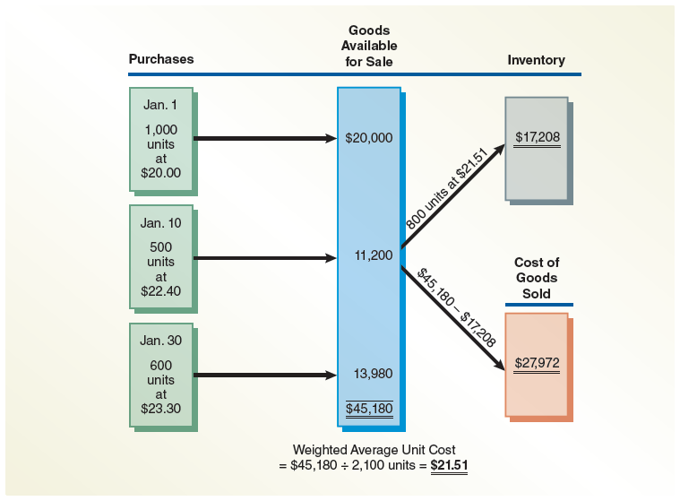

---

## Check Up Corner 6-3

### Periodic Inventory

[**Esquina de Verificación 6-3 - Inventario Periódico**]

The beginning inventory, purchases, and sales of Item PEAR4 for a recent year are as follows:

[El inventario inicial, las compras y las ventas del Artículo PEAR4 para un año reciente son los siguientes:]

| Date | Transaction | Units | Unit Cost | Total Cost |
|---|---|---|---|---|
| Jan. 1 | Inventory | 6 | $50 | $300 |
| Mar. 20 | Purchase | 14 | $55 | 770 |
| Oct. 30 | Purchase | 20 | $62 | 1,240 |
| **Available for sale** | | **40** | | **$2,310** |

There are 16 units of the item in the physical inventory at December 31, the end of the fiscal year. The company uses the periodic inventory system. Determine (1) the December 31 inventory balance and (2) the cost of goods sold for the year, using the:

[Hay 16 unidades del artículo en el inventario físico al 31 de diciembre, al final del año fiscal. La empresa utiliza el sistema de inventario periódico. Determine (1) el saldo del inventario al 31 de diciembre y (2) el costo de los bienes vendidos para el año, utilizando los siguientes métodos:]

a. first-in, first-out (FIFO) method.
b. last-in, first-out (LIFO) method.
c. weighted average cost method.

---

### Solution - Check Up Corner 6-3

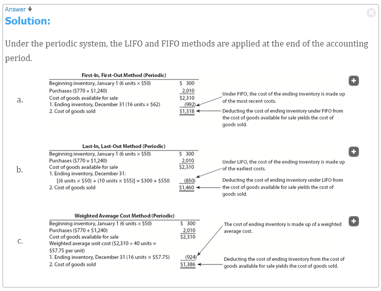</img>

[**Solución - Esquina de Verificación 6-3**]

#### a. FIFO Method

For FIFO, the ending inventory consists of the most recent purchases. Since there are 16 units in ending inventory, they come from the October 30 purchase (20 units at $62):

[Para FIFO, el inventario final consiste en las compras más recientes. Dado que hay 16 unidades en el inventario final, provienen de la compra del 30 de octubre (20 unidades a $62):]

$$\text{Ending Inventory (FIFO)} = 16 \text{ units} \times \$62 = \$992$$

$$\text{Cost of Goods Sold (FIFO)} = \text{Cost of Goods Available for Sale} - \text{Ending Inventory}$$

$$\text{COGS (FIFO)} = \$2,310 - \$992 = \$1,318$$

| | Units | Unit Cost | Total Cost |
|---|---|---|---|
| **Ending Inventory:** | | | |
| Oct. 30 Purchase | 16 | $62 | $992 |
| **Total Ending Inventory** | **16** | | **$992** |
| | | | |
| **Cost of Goods Sold:** | | | |
| Cost of goods available for sale | | | $2,310 |
| Ending inventory | | | (992) |
| **Cost of goods sold** | | | **$1,318** |

---

#### b. LIFO Method

For LIFO, the ending inventory consists of the earliest costs. Since there are 16 units in ending inventory, they come from the beginning inventory (6 units at $50) and the March 20 purchase (10 units at $55):

[Para LIFO, el inventario final consiste en los costos más antiguos. Dado que hay 16 unidades en el inventario final, provienen del inventario inicial (6 unidades a $50) y de la compra del 20 de marzo (10 unidades a $55):]

$$\text{Ending Inventory (LIFO)} = (6 \times \$50) + (10 \times \$55)$$

$$\text{Ending Inventory (LIFO)} = \$300 + \$550 = \$850$$

$$\text{Cost of Goods Sold (LIFO)} = \text{Cost of Goods Available for Sale} - \text{Ending Inventory}$$

$$\text{COGS (LIFO)} = \$2,310 - \$850 = \$1,460$$

| | Units | Unit Cost | Total Cost |
|---|---|---|---|
| **Ending Inventory:** | | | |
| Jan. 1 Inventory | 6 | $50 | $300 |
| Mar. 20 Purchase | 10 | $55 | 550 |
| **Total Ending Inventory** | **16** | | **$850** |
| | | | |
| **Cost of Goods Sold:** | | | |
| Cost of goods available for sale | | | $2,310 |
| Ending inventory | | | (850) |
| **Cost of goods sold** | | | **$1,460** |

---

#### c. Weighted Average Method

The weighted average unit cost is calculated as follows:

[El costo unitario promedio ponderado se calcula de la siguiente manera:]

$$\text{Weighted Average Unit Cost} = \frac{\text{Total Cost of Units Available for Sale}}{\text{Units Available for Sale}}$$

$$\text{Weighted Average Unit Cost} = \frac{\$2,310}{40 \text{ units}} = \$57.75 \text{ per unit}$$

The ending inventory is then calculated as:

[El inventario final se calcula entonces como:]

$$\text{Ending Inventory (Weighted Average)} = 16 \text{ units} \times \$57.75 = \$924$$

The cost of goods sold is then:

[El costo de bienes vendidos es entonces:]

$$\text{COGS (Weighted Average)} = \$2,310 - \$924 = \$1,386$$

| | Units | Unit Cost | Total Cost |
|---|---|---|---|
| Weighted Average Unit Cost | 40 | $57.75 | $2,310 |
| | ($2,310 ÷ 40) | | |
| | | | |
| **Ending Inventory:** | | | |
| 16 units × $57.75 | | | **$924** |
| | | | |
| **Cost of Goods Sold:** | | | |
| Cost of goods available for sale | | | $2,310 |
| Ending inventory | | | (924) |
| **Cost of goods sold** | | | **$1,386** |

---

<h1 id="896919" style="color:#E65100;">
  <a href="#Chapter_006" style="color:inherit; text-decoration:none;">
    6-5 Comparing Inventory Costing Methods
  </a>
</h1>

A different cost flow is assumed for the FIFO, LIFO, and weighted average inventory cost flow methods. As a result, the three methods normally yield different amounts for the following:

[Se asume un flujo de costos diferente para los métodos de flujo de costos de inventario PEPS, UEPS y promedio ponderado. Como resultado, los tres métodos normalmente producen diferentes montos para los siguientes:]

- Cost of goods sold
- Gross profit
- Net income
- Ending inventory

[Costo de bienes vendidos
- Utilidad bruta
- Ingreso neto
- Inventario final]

Using the perpetual inventory system illustration with sales of $39,000 (1,300 units × $30), the following differences are apparent:

[Utilizando la ilustración del sistema de inventario perpetuo con ventas de $39,000 (1,300 unidades × $30), las siguientes diferencias son evidentes:]

### Partial Income Statements

| | First-In, First-Out | Weighted Average Cost | Last-In, First-Out |
|---|---|---|---|
| Sales | $39,000 | $39,000 | $39,000 |
| Cost of goods sold | (26,720) | (26,900) | (27,200) |
| **Gross profit** | **$12,280** | **$12,100** | **$11,800** |
| **Inventory, Jan. 31** | **$18,460** | **$18,280** | **$17,980** |

The preceding differences show the effect of increasing costs (prices). If costs (prices) remain the same, all three methods would yield the same results. However, costs (prices) normally do change. The effects of changing costs (prices) on the FIFO and LIFO methods are summarized in Exhibit 9. The weighted average cost method will always yield results between those of FIFO and LIFO.

[Las diferencias anteriores muestran el efecto del aumento de los costos (precios). Si los costos (precios) permanecen iguales, los tres métodos producirían los mismos resultados. Sin embargo, los costos (precios) normalmente cambian. Los efectos del cambio de los costos (precios) en los métodos PEPS y UEPS se resumen en la Figura 9. El método de costo promedio ponderado siempre producirá resultados entre los de PEPS y UEPS.]

---

## Exhibit 9

### Effects of Changing Costs (Prices): FIFO and LIFO Cost Methods

[**Figura 9** - Efectos de los Cambios en los Costos (Precios): Métodos de Costo PEPS y UEPS]

<!-- 📍 IMAGEN: Exhibit 9 - Effects of Changing Costs (Prices): FIFO and LIFO Cost Methods (coordenadas [16, 51, 969, 223]) -->

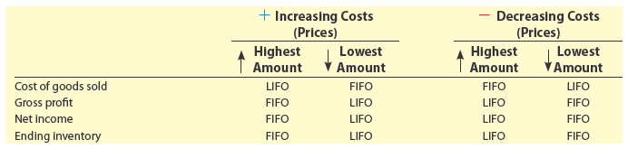

---

### Summary of Effects

| Cost Trend | FIFO | LIFO |
|---|---|---|
| **Increasing costs** | Higher gross profit & net income | Lower gross profit & net income |
| **Decreasing costs** | Lower gross profit & net income | Higher gross profit & net income |

FIFO reports higher gross profit and net income than the LIFO method when costs (prices) are increasing, as shown in Exhibit 9. However, in periods of rapidly rising costs, the inventory that is sold must be replaced at increasingly higher costs. In such cases, a portion of the larger FIFO gross profit and net income are sometimes called **inventory profits** or **illusory profits**.

[PEPS reporta una utilidad bruta y un ingreso neto más altos que el método UEPS cuando los costos (precios) están aumentando, como se muestra en la Figura 9. Sin embargo, en períodos de costos en rápido aumento, el inventario que se vende debe ser reemplazado a costos cada vez más altos. En tales casos, una parte de la mayor utilidad bruta y el ingreso neto de PEPS a veces se llaman **utilidades de inventario** o **utilidades ilusorias**.]

During a period of increasing costs, LIFO matches more recent costs against sales on the income statement. Thus, it can be argued that the LIFO method more nearly matches current costs with current revenues. LIFO also offers an income tax savings during periods of increasing costs. This is because LIFO reports the lowest amount of gross profit and, thus, taxable net income. However, under LIFO, the ending inventory on the balance sheet may be quite different from its current replacement cost. In such cases, the financial statements normally include a note that estimates what the inventory would have been if FIFO had been used.

[Durante un período de costos crecientes, UEPS iguala los costos más recientes con las ventas en el estado de resultados. Por lo tanto, se puede argumentar que el método UEPS iguala más aproximadamente los costos actuales con los ingresos actuales. UEPS también ofrece un ahorro en el impuesto sobre la renta durante períodos de costos crecientes. Esto se debe a que UEPS reporta el monto más bajo de utilidad bruta y, por lo tanto, el ingreso neto imponible. Sin embargo, bajo UEPS, el inventario final en el balance general puede ser bastante diferente de su costo de reemplazo actual. En tales casos, los estados financieros normalmente incluyen una nota que estima cuál habría sido el inventario si se hubiera utilizado PEPS.]

The weighted average cost method is, in a sense, a compromise between FIFO and LIFO. The effect of cost (price) trends is averaged in determining the cost of goods sold and the ending inventory.

[El método de costo promedio ponderado es, en cierto sentido, un compromiso entre PEPS y UEPS. El efecto de las tendencias de costos (precios) se promedia al determinar el costo de los bienes vendidos y el inventario final.]

---

<h1 id="046501" style="color:#E65100;">
  <a href="#Chapter_006" style="color:inherit; text-decoration:none;">
    6-6 Reporting Inventory in the Financial Statements
  </a>
</h1>

Cost is the primary basis for valuing and reporting inventories in the financial statements. However, inventory may be valued at other than cost in the following cases:

[El costo es la base principal para valorar y reportar los inventarios en los estados financieros. Sin embargo, el inventario puede valorarse a un valor distinto al costo en los siguientes casos:]

1. The cost of replacing items in inventory is below the recorded cost.

[1. El costo de reemplazar los artículos en el inventario es inferior al costo registrado.]

2. The inventory cannot be sold at normal prices due to imperfections, style changes, spoilage, damage, obsolescence, or other causes.

[2. El inventario no puede venderse a precios normales debido a imperfecciones, cambios de estilo, deterioro, daños, obsolescencia u otras causas.]

**Objective 6** - Describe and illustrate the reporting of inventory in the financial statements.

[**Objetivo 6** - Describir e ilustrar el reporte del inventario en los estados financieros.]

---

<h1 id="536266" style="color:#E65100;">
  <a href="#Chapter_006" style="color:inherit; text-decoration:none;">
    6-6a Valuation at Lower of Cost or Market
  </a>
</h1>

If the market value is lower than the purchase cost, the **lower-of-cost-or-market (LCM) method** (A method of valuing inventory that reports the inventory at the lower of its cost or current market value (net realizable value).) is used to value the inventory. Market, as used in lower of cost or market, is the **net realizable value** (The estimated selling price of an item of inventory less any direct costs of disposal, such as sales commissions; the value of the receivables reduced to the amount that is expected to be collected or realized, computed as accounts receivable less allowance for doubtful accounts.) of the inventory. Net realizable value is determined as follows:

[Si el valor de mercado es inferior al costo de compra, se utiliza el método del **costo o mercado, el menor (LCM)** (un método de valoración de inventarios que reporta el inventario al menor de su costo o su valor de mercado actual (valor neto realizable)) para valorar el inventario. El mercado, tal como se utiliza en costo o mercado, el menor, es el **valor neto realizable** (el precio de venta estimado de un artículo de inventario menos cualquier costo directo de disposición, como comisiones de ventas; el valor de las cuentas por cobrar reducido al monto que se espera cobrar o realizar, calculado como cuentas por cobrar menos la provisión para cuentas de cobro dudoso) del inventario. El valor neto realizable se determina de la siguiente manera:]

$$\text{Net Realizable Value} = \text{Estimated Selling Price} - \text{Direct Costs of Disposal}$$

Direct costs of disposal include selling expenses such as special advertising or sales commissions.

[Los costos directos de disposición incluyen gastos de venta como publicidad especial o comisiones de ventas.]

To illustrate, assume the following data about an item of damaged inventory:

[Para ilustrar, suponga los siguientes datos sobre un artículo de inventario dañado:]

| | Amount |
|---|---|
| Original cost | $1,000 |
| Estimated selling price | 800 |
| Estimated selling expenses | 150 |

In applying LCM, the market value of the inventory is $650, computed as follows:

[Al aplicar LCM, el valor de mercado del inventario es de $650, calculado de la siguiente manera:]

$$\text{Market Value (Net Realizable Value)} = \$800 - \$150 = \$650$$

Thus, the inventory would be valued at $650, which is the lower of its cost of $1,000 and its market value of $650.

[Por lo tanto, el inventario se valoraría en $650, que es el menor entre su costo de $1,000 y su valor de mercado de $650.]

The lower-of-cost-or-market method can be applied in one of three ways. The cost, market price, and any declines could be determined for the following:

[El método del costo o mercado, el menor, se puede aplicar de una de tres maneras. El costo, el precio de mercado y cualquier disminución podrían determinarse para lo siguiente:]

1. Each item in the inventory
2. Each major class or category of inventory
3. Total inventory as a whole

[1. Cada artículo en el inventario
2. Cada clase o categoría importante de inventario
3. El inventario total como un todo]

The amount of any price decline is included in the cost of goods sold. This, in turn, reduces gross profit and net income in the period in which the price declines occur. This matching of price declines to the period in which they occur is the primary advantage of using the lower-of-cost-or-market method.

[El monto de cualquier disminución de precio se incluye en el costo de los bienes vendidos. Esto, a su vez, reduce la utilidad bruta y el ingreso neto en el período en que ocurren las disminuciones de precio. Esta correspondencia de las disminuciones de precio con el período en que ocurren es la ventaja principal de utilizar el método del costo o mercado, el menor.]

---

**Link to Best Buy:** Best Buy values its inventory at lower of cost or market based upon cost and the amount it expects to realize from the sale.

[**Enlace a Best Buy:** Best Buy valora su inventario al costo o mercado, el menor, basado en el costo y el monto que espera realizar de la venta.]

---

## Ethics in Action

### Where's the Bonus?

[**Ética en Acción - ¿Dónde está la Bonificación?**]

Managers are often given bonuses based on reported earnings numbers. This can create a conflict. For example, LIFO can improve the value of the company through lower taxes. However, using LIFO also lowers management bonuses that are based on reported income. Thus, a manager might use FIFO to maximize his or her bonus even though LIFO is better for the company.

[A los gerentes a menudo se les otorgan bonificaciones basadas en las cifras de ganancias reportadas. Esto puede crear un conflicto. Por ejemplo, UEPS puede mejorar el valor de la empresa a través de impuestos más bajos. Sin embargo, el uso de UEPS también reduce las bonificaciones de la gerencia que se basan en los ingresos reportados. Por lo tanto, un gerente podría usar PEPS para maximizar su bonificación, aunque UEPS sea mejor para la empresa.]

To illustrate, assume the following data for 400 identical units of Item A in inventory on December 31:

[Para ilustrar, suponga los siguientes datos para 400 unidades idénticas del Artículo A en el inventario al 31 de diciembre:]

| | Amount |
|---|---|
| Cost per unit | $10.25 |
| Market value (net realizable value) per unit | 9.50 |

Since the market value of Item A is $9.50 per unit, $9.50 is used under the lower-of-cost-or-market method.

[Dado que el valor de mercado del Artículo A es de $9.50 por unidad, se utiliza $9.50 bajo el método del costo o mercado, el menor.]

Exhibit 10 illustrates applying the lower-of-cost-or-market method to (1) each inventory item (Echo, Foxtrot, Sierra, Tango), (2) each major class of inventory (Class 1, Class 2), and (3) inventory in total. As applied on an item-by-item basis, the total lower-of-cost-or-market is $15,070, which is a market decline of $450 ($15,520 – $15,070). As applied to each class of inventory, the inventory would be valued at $15,412, which is a market decline of $108 ($15,520 – $15,412). Finally, if the lower-of-cost-or-market method is applied to the total inventory, the inventory would be valued at $15,472, which is a market decline of $48 ($15,520 – $15,472). The market declines under each approach ($450, $108, or $48) would be included in cost of goods sold.

[La Figura 10 ilustra la aplicación del método del costo o mercado, el menor a (1) cada artículo de inventario (Echo, Foxtrot, Sierra, Tango), (2) cada clase importante de inventario (Clase 1, Clase 2) y (3) el inventario total. Tal como se aplica artículo por artículo, el total del costo o mercado, el menor es de $15,070, lo que representa una disminución de mercado de $450 ($15,520 – $15,070). Tal como se aplica a cada clase de inventario, el inventario se valoraría en $15,412, lo que representa una disminución de mercado de $108 ($15,520 – $15,412). Finalmente, si se aplica el método del costo o mercado, el menor al inventario total, el inventario se valoraría en $15,472, lo que representa una disminución de mercado de $48 ($15,520 – $15,472). Las disminuciones de mercado bajo cada enfoque ($450, $108 o $48) se incluirían en el costo de los bienes vendidos.]

---

## Exhibit 10

### Determining Inventory at Lower of Cost or Market (LCM)

[**Figura 10** - Determinación del Inventario al Costo o Mercado, el Menor (LCM)]

<!-- 📍 IMAGEN: Exhibit 10 - Determining Inventory at Lower of Cost or Market (LCM) (páginas 3-4) -->

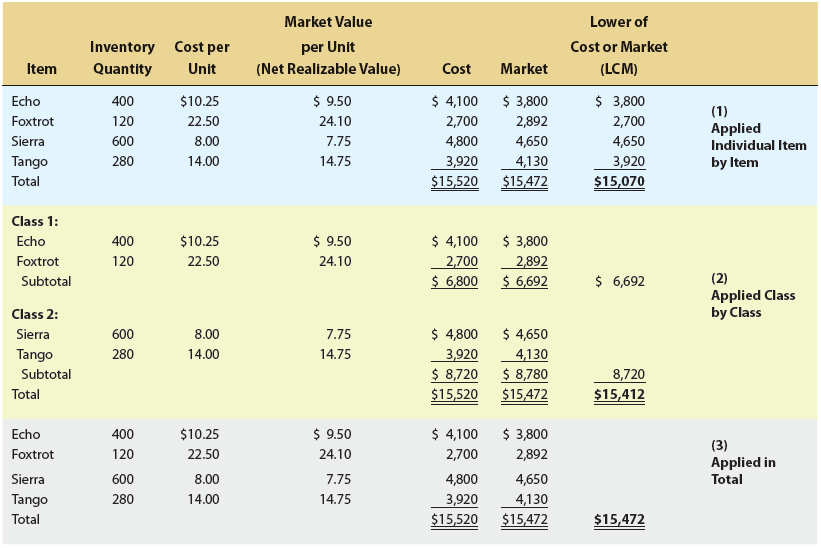

<table><tbody>
  <tr>
    <td>Item</td>
    <td>Inventory Quantity</td>
    <td>Cost per Unit</td>
    <td>Market Value per Unit (Net Realizable Value)</td>
    <td>Cost</td>
    <td>Market</td>
    <td>Lower of Cost or Market (LCM)</td>
    <td rowspan="6">(1) Applied  Individual Item  by Item    </td>
  </tr>
  <tr>
    <td>Echo</td>
    <td>400</td>
    <td>$10.25</td>
    <td>$9.50</td>
    <td>$4,100</td>
    <td>$3,800</td>
    <td>$3,800</td>
  </tr>
  <tr>
    <td>Foxtrot</td>
    <td>120</td>
    <td>22.50</td>
    <td>24.10</td>
    <td>2,700</td>
    <td>2,892</td>
    <td>2,700</td>
  </tr>
  <tr>
    <td>Sierra</td>
    <td>600</td>
    <td>8.00</td>
    <td>7.75</td>
    <td>4,800</td>
    <td>4,650</td>
    <td>4,650</td>
  </tr>
  <tr>
    <td>Tango</td>
    <td>280</td>
    <td>14.00</td>
    <td>14.75</td>
    <td>3,920</td>
    <td>4,130</td>
    <td>3,920</td>
  </tr>
  <tr>
    <td>Total</td>
    <td></td>
    <td></td>
    <td></td>
    <td>$15,520</td>
    <td>$15,472</td>
    <td>$15,070</td>
  </tr>
</tbody></table>

<table><tbody>
  <tr>
    <td>Item</td>
    <td>Inventory Quantity</td>
    <td>Cost per Unit</td>
    <td>Market Value per Unit (Net Realizable Value)</td>
    <td>Cost</td>
    <td>Market</td>
    <td>Lower of Cost or Market (LCM)</td>
    <td rowspan="10">(2) Applied by Class</td>
  </tr>
  <tr>
    <td>Class 1:</td>
    <td></td>
    <td></td>
    <td></td>
    <td></td>
    <td></td>
    <td></td>
  </tr>
  <tr>
    <td>Echo</td>
    <td>400</td>
    <td>$10.25</td>
    <td>$9.50</td>
    <td>$4,100</td>
    <td>$3,800</td>
    <td></td>
  </tr>
  <tr>
    <td>Foxtrot</td>
    <td>120</td>
    <td>22.50</td>
    <td>24.10</td>
    <td>2,700</td>
    <td>2,892</td>
    <td></td>
  </tr>
  <tr>
    <td>Subtotal</td>
    <td></td>
    <td></td>
    <td></td>
    <td>6,800</td>
    <td>$6,692</td>
    <td>$6,692</td>
  </tr>
  <tr>
    <td>Class 2:</td>
    <td></td>
    <td></td>
    <td></td>
    <td></td>
    <td></td>
    <td></td>
  </tr>
  <tr>
    <td>Sierra</td>
    <td>600</td>
    <td>8.00</td>
    <td>7.75</td>
    <td>$4,800</td>
    <td>$4,650</td>
    <td></td>
  </tr>
  <tr>
    <td>Tango</td>
    <td>280</td>
    <td>14.00</td>
    <td>14.75</td>
    <td>3,920</td>
    <td>4,130</td>
    <td></td>
  </tr>
  <tr>
    <td>Subtotal</td>
    <td></td>
    <td></td>
    <td></td>
    <td>$8,720</td>
    <td>$8,780</td>
    <td>$8,720</td>
  </tr>
  <tr>
    <td>Total</td>
    <td></td>
    <td></td>
    <td></td>
    <td>$15,520</td>
    <td>$15,472</td>
    <td>$15,412</td>
  </tr>
</tbody></table>

<table><tbody>
  <tr>
    <td>Item</td>
    <td>Inventory Quantity</td>
    <td>Cost per Unit</td>
    <td>Market Value per Unit (Net Realizable Value)</td>
    <td>Cost</td>
    <td>Market</td>
    <td>Lower of Cost or Market (LCM)</td>
    <td rowspan="6">(3) Applied to Total Inventory</td>
  </tr>
  <tr>
    <td>Echo</td>
    <td>400</td>
    <td>$10.25</td>
    <td>$9.50</td>
    <td>$4,100</td>
    <td>$3,800</td>
    <td></td>
  </tr>
  <tr>
    <td>Foxtrot</td>
    <td>120</td>
    <td>22.50</td>
    <td>24.10</td>
    <td>2,700</td>
    <td>2,892</td>
    <td></td>
  </tr>
  <tr>
    <td>Sierra</td>
    <td>600</td>
    <td>8.00</td>
    <td>7.75</td>
    <td>4,800</td>
    <td>4,650</td>
    <td></td>
  </tr>
  <tr>
    <td>Tango</td>
    <td>280</td>
    <td>14.00</td>
    <td>14.75</td>
    <td>3,920</td>
    <td>4,130</td>
    <td></td>
  </tr>
  <tr>
    <td>Total</td>
    <td></td>
    <td></td>
    <td></td>
    <td>$15,520</td>
    <td>$15,472</td>
    <td>$15,472</td>
  </tr>
</tbody></table>

Applying the lower-of-cost-or-market method on an item-by-item basis always gives the lowest value for inventory. Conversely, applying the lower-of-cost-or-market method to the total inventory always gives the highest value for inventory.

[Aplicar el método del costo o mercado, el menor, artículo por artículo siempre da el valor más bajo para el inventario. Por el contrario, aplicar el método del costo o mercado, el menor, al inventario total siempre da el valor más alto para el inventario.]

---

**Link to Best Buy:** The excess of cost over the amount Best Buy expects to receive from the sale of an item is called a markdown.

[**Enlace a Best Buy:** El exceso del costo sobre el monto que Best Buy espera recibir de la venta de un artículo se llama rebaja de precio (markdown).]

---

## Check Up Corner 6-4

### Lower of Cost or Market

[**Esquina de Verificación 6-4 - Costo o Mercado, el Menor**]

JJ's Electronics Company has three products in inventory (PCs, tablets, and smartphones). Each product's quantity, cost per unit, and market value per unit are as follows:

[JJ's Electronics Company tiene tres productos en inventario (PCs, tabletas y teléfonos inteligentes). La cantidad, el costo por unidad y el valor de mercado por unidad de cada producto son los siguientes:]

| Item | Inventory Quantity | Cost per Unit | Market Value per Unit (Net Realizable Value) |
|---|---|---|---|
| PC | 10 | $175 | $168 |
| Tablet | 12 | 132 | 150 |
| Smartphone | 8 | 199 | 187 |

Apply the lower-of-cost-or-market method to each inventory item in a form similar to Exhibit 10.

[Aplique el método del costo o mercado, el menor, a cada artículo de inventario en un formato similar al de la Figura 10.]

---

### Solution - Check Up Corner 6-4

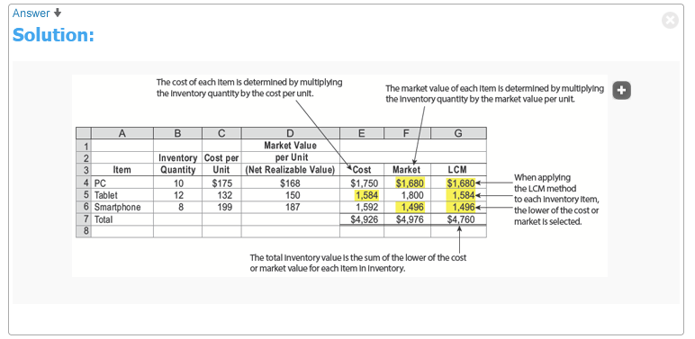</img>

[**Solución - Esquina de Verificación 6-4**]

| Item | Inventory Quantity | Cost per Unit | Market Value per Unit (Net Realizable Value) | Cost | Market | Lower of Cost or Market |
|---|---|---|---|---|---|---|
| PC | 10 | $175 | $168 | $1,750 | $1,680 | $1,680 |
| Tablet | 12 | 132 | 150 | 1,584 | 1,800 | 1,584 |
| Smartphone | 8 | 199 | 187 | 1,592 | 1,496 | 1,496 |
| **Total** | | | | **$4,926** | **$4,976** | **$4,760** |

**Calculations:**

| Item | Calculation | LCM |
|---|---|---|
| PC | 10 × $168 | $1,680 |
| Tablet | 12 × $132 | $1,584 |
| Smartphone | 8 × $187 | $1,496 |
| **Total** | | **$4,760** |

---

<h1 id="522276" style="color:#E65100;">
  <a href="#Chapter_006" style="color:inherit; text-decoration:none;">
    6-6b Inventory on the Balance Sheet
  </a>
</h1>

Inventory is usually reported in the "Current assets" section of the balance sheet. In addition to this amount, the following are reported on the balance sheet or in the accompanying notes:

[El inventario generalmente se reporta en la sección de "Activos corrientes" del balance general. Además de este monto, lo siguiente se reporta en el balance general o en las notas adjuntas:]

- The method of determining the cost of the inventory (FIFO, LIFO, or weighted average)
- The method of valuing the inventory (cost or the lower of cost or market)

[El método para determinar el costo del inventario (PEPS, UEPS o promedio ponderado)
- El método para valorar el inventario (costo o el menor entre costo o mercado)]

The presentation for inventory for Best Buy Co., Inc. (BBY) within the "Current assets" section of the balance sheet and accompanying notes is as follows:

[La presentación del inventario para Best Buy Co., Inc. (BBY) dentro de la sección de "Activos corrientes" del balance general y las notas adjuntas es la siguiente:]

---

**Link to Best Buy:**

<!-- 📍 IMAGEN: Best Buy Balance Sheet Presentation (coordenadas [112, 464, 863, 824]) -->

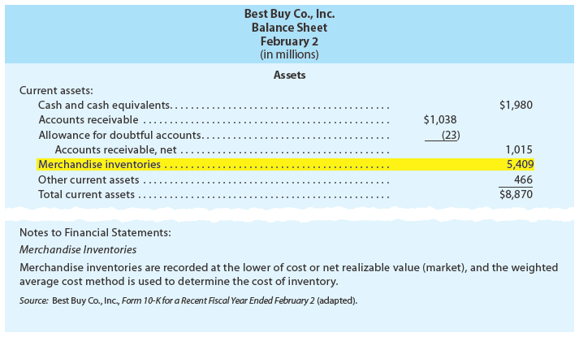

### Best Buy Co., Inc.  
#### Balance Sheet  
##### February 2  
*(in millions)*  

<table><tbody>
  <tr>
    <td colspan="5">Assets</td>
  </tr>
  <tr>
    <td colspan="3">Description</td>
    <td>Amount</td>
    <td>Total</td>
  </tr>
  <tr>
    <td colspan="3">Current Assets:</td>
    <td></td>
    <td></td>
  </tr>
  <tr>
    <td></td>
    <td colspan="2">Cash and cash equivalents</td>
    <td></td>
    <td>$1,980</td>
  </tr>
  <tr>
    <td></td>
    <td colspan="2">Accounts receivable</td>
    <td>$1,038</td>
    <td></td>
  </tr>
  <tr>
    <td></td>
    <td colspan="2">Allowance for doubtful accounts</td>
    <td>(23)</td>
    <td></td>
  </tr>
  <tr>
    <td></td>
    <td></td>
    <td>Accounts receivable, net</td>
    <td></td>
    <td>1,015</td>
  </tr>
  <tr>
    <td></td>
    <td colspan="2">Merchandise inventories</td>
    <td></td>
    <td>5,409</td>
  </tr>
  <tr>
    <td></td>
    <td colspan="2">Other current assets</td>
    <td></td>
    <td>466</td>
  </tr>
  <tr>
    <td></td>
    <td colspan="2">Total current assets</td>
    <td></td>
    <td>$8,870</td>
  </tr>
</tbody></table>

---

It is not unusual for a large business to use different costing methods for segments of its inventories. Also, a business may change its inventory costing method. In such cases, the effect of the change and the reason for the change are disclosed in the notes to the financial statements.

[No es inusual que una gran empresa utilice diferentes métodos de costeo para segmentos de sus inventarios. Además, una empresa puede cambiar su método de costeo de inventario. En tales casos, el efecto del cambio y la razón del cambio se divulgan en las notas a los estados financieros.]

---

<h1 id="412888" style="color:#E65100;">
  <a href="#Chapter_006" style="color:inherit; text-decoration:none;">
    6-6c Effects of Inventory Errors on the Financial Statements
  </a>
</h1>

Any errors in inventory will affect the balance sheet and income statement. Some reasons that inventory errors may occur include the following:

[Cualquier error en el inventario afectará el balance general y el estado de resultados. Algunas razones por las que pueden ocurrir errores en el inventario incluyen las siguientes:]

- Physical inventory on hand was miscounted.
- Costs were incorrectly assigned to inventory using an inventory costing method, such as FIFO, LIFO, or weighted average, that was incorrectly applied.
- Inventory in transit was incorrectly included or excluded from inventory.
- Consigned inventory was incorrectly included or excluded from inventory.

[El inventario físico disponible fue contado incorrectamente.
- Los costos se asignaron incorrectamente al inventario utilizando un método de costeo de inventario, como PEPS, UEPS o promedio ponderado, que se aplicó incorrectamente.
- El inventario en tránsito se incluyó o excluyó incorrectamente del inventario.
- El inventario en consignación se incluyó o excluyó incorrectamente del inventario.]

Inventory errors often arise when conducting the end-of-year "physical" inventory. For example, merchandise that was ordered FOB shipping point may be in transit at the end of the year and thus, not counted as part of the physical inventory. Even though the inventory has not been received, the title to the merchandise passed to the buyer at the time of shipment and should be included in the buyer's physical inventory.

[Los errores de inventario a menudo surgen al realizar el inventario "físico" de fin de año. Por ejemplo, la mercancía que se pidió FOB punto de embarque puede estar en tránsito al final del año y, por lo tanto, no se cuenta como parte del inventario físico. Aunque el inventario no se haya recibido, el título de la mercancía pasó al comprador en el momento del envío y debe incluirse en el inventario físico del comprador.]

Likewise, manufacturers sometimes ship merchandise to retailers who act as the manufacturer's selling agent. The manufacturer, called the **consignor** (The manufacturer in a consigned inventory arrangement), retains title until the goods are sold. Such merchandise, called **consigned inventory** (Merchandise that is shipped by manufacturers to retailers who act as the manufacturer's selling agent), is said to be shipped on consignment to the retailer, called the **consignee** (The retailer in a consigned inventory arrangement). Any unsold merchandise at year-end is a part of the manufacturer's (consignor's) inventory, even though the merchandise is in the hands of the retailer (consignee). At year-end, the retailer (consignee) may incorrectly include the consigned merchandise in its physical inventory or the manufacturer may incorrectly exclude it from its physical inventory.

[Del mismo modo, los fabricantes a veces envían mercancía a minoristas que actúan como agente de ventas del fabricante. El fabricante, llamado **consignador** (el fabricante en un acuerdo de inventario en consignación), retiene el título hasta que se venden los bienes. Dicha mercancía, llamada **inventario en consignación** (mercancía que es enviada por los fabricantes a los minoristas que actúan como agente de ventas del fabricante), se dice que se envía en consignación al minorista, llamado **consignatario** (el minorista en un acuerdo de inventario en consignación). Cualquier mercancía no vendida al final del año es parte del inventario del fabricante (consignador), aunque la mercancía esté en manos del minorista (consignatario). Al final del año, el minorista (consignatario) puede incluir incorrectamente la mercancía en consignación en su inventario físico o el fabricante puede excluirla incorrectamente de su inventario físico.]

Errors in the ending inventory affect not only the balance sheet, but also the income statement. In a perpetual inventory system, the end-of-year physical inventory is the basis for the inventory shrinkage adjustment illustrated in Chapter 5, Accounting for Retail Businesses. This adjustment for inventory shrinkage increases Cost of Goods Sold and decreases Inventory. In a periodic inventory system, ending inventory is subtracted from goods available for sale in computing cost of goods sold. In addition, since the ending inventory becomes the beginning inventory of the next period, the income statement of the next period is also misstated.

[Los errores en el inventario final afectan no solo el balance general, sino también el estado de resultados. En un sistema de inventario perpetuo, el inventario físico de fin de año es la base para el ajuste por merma de inventario ilustrado en el Capítulo 5, Contabilidad para Negocios Minoristas. Este ajuste por merma de inventario aumenta el Costo de Bienes Vendidos y disminuye el Inventario. En un sistema de inventario periódico, el inventario final se resta de los bienes disponibles para la venta al calcular el costo de bienes vendidos. Además, dado que el inventario final se convierte en el inventario inicial del próximo período, el estado de resultados del próximo período también se presenta incorrectamente.]

---

## Pathways Challenge

### This Is Accounting!

### Economic Activity

[**Desafío Pathways - ¡Esto es Contabilidad! - Actividad Económica**]

Tyson Foods (TSN), one of the world's largest food companies, operates a chicken production process that begins with the hatching of chicks and ends with packaged chicken for sale at your local grocery market. The most desirable chickens are maintained as breeding stock for laying eggs and producing chicks. Once a chick is hatched, it is transported to a growing farm. At the farm, the chicken is housed and fed corn, soybean, and other feed. Once the chicken reaches maturity, it is transported to a processing plant where it is converted into a finished product and packaged for delivery to your local grocery store.

[Tyson Foods (TSN), una de las empresas alimentarias más grandes del mundo, opera un proceso de producción de pollos que comienza con la incubación de polluelos y termina con pollo empaquetado para la venta en su supermercado local. Los pollos más deseables se mantienen como reproductores para la puesta de huevos y la producción de polluelos. Una vez que un polluelo nace, se transporta a una granja de cría. En la granja, el pollo se aloja y se alimenta con maíz, soja y otros alimentos. Una vez que el pollo alcanza la madurez, se transporta a una planta de procesamiento donde se convierte en un producto terminado y se empaqueta para su entrega a su supermercado local.]

#### Critical Thinking/Judgment

[**Pensamiento Crítico/Juicio**]

1. How should Tyson account for the transportation, boarding, and feed costs related to chickens sent to the processing plant?
   
   ¿Cómo debería Tyson contabilizar los costos de transporte, alojamiento y alimentación relacionados con los pollos enviados a la planta de procesamiento?

2. Can you think of any other costs related to chickens raised for processing?
   
   ¿Puede pensar en otros costos relacionados con los pollos criados para procesamiento?

3. Should the costs of the breeder flock be included in inventory?
   
   ¿Deberían incluirse los costos de la parvada reproductora en el inventario?

Exhibit 11 illustrates the effects of inventory errors on the income statement and balance sheet.

[La Figura 11 ilustra los efectos de los errores de inventario en el estado de resultados y el balance general.]

---

## Exhibit 11

### Effects of Inventory Errors

[**Figura 11** - Efectos de los Errores de Inventario]

<!-- 📍 IMAGEN: Exhibit 11 - Effects of Inventory Errors (coordenadas [101, 17, 874, 264]) -->

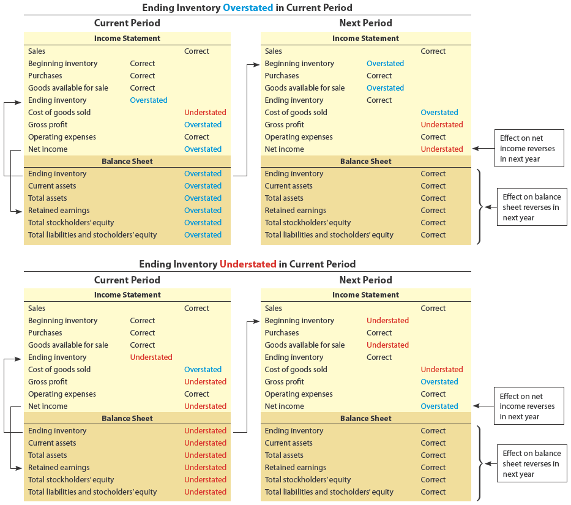

To illustrate, assume that Zula Industries incorrectly counted its December 31, 20Y1, inventory at $250,000 instead of the correct amount of $220,000. The effect of the misstatement on Zula's income statement and balance sheet for 20Y1 (current year) and 20Y2 (following year) is shown in Exhibit 12.

[Para ilustrar, suponga que Zula Industries contó incorrectamente su inventario del 31 de diciembre de 20Y1 en $250,000 en lugar del monto correcto de $220,000. El efecto de la declaración incorrecta en el estado de resultados y el balance general de Zula para 20Y1 (año actual) y 20Y2 (año siguiente) se muestra en la Figura 12.]

---

## Exhibit 12

### Effects of Inventory Errors - Zula Industries

[**Figura 12** - Efectos de los Errores de Inventario - Zula Industries]

<!-- 📍 IMAGEN: Exhibit 12 - Effects of Inventory Errors - Zula Industries (coordenadas [101, 440, 874, 718]) -->

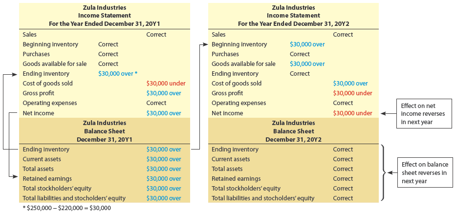

---

## Check Up Corner 6-5

### Effects of Inventory Errors

[**Esquina de Verificación 6-5 - Efectos de los Errores de Inventario**]

Zulu Industries incorrectly counted its December 31, 20Y1, inventory at $250,000 instead of the correct amount of $220,000. Indicate the effect of the misstatement on Zulu's income statement for the current year (20Y1) and the following year (20Y2). What is the net effect of the error for the two years?

[Zulu Industries contó incorrectamente su inventario del 31 de diciembre de 20Y1 en $250,000 en lugar del monto correcto de $220,000. Indique el efecto de la declaración incorrecta en el estado de resultados de Zulu para el año actual (20Y1) y el año siguiente (20Y2). ¿Cuál es el efecto neto del error para los dos años?]

---

### Solution - Check Up Corner 6-5

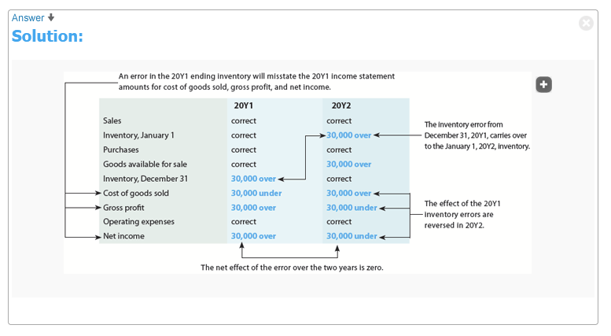</img>

[**Solución - Esquina de Verificación 6-5**]

**Current Year (20Y1) - Ending Inventory Overstated by $30,000**

| Financial Statement | Account | Effect |
|---|---|---|
| Income Statement | Cost of Goods Sold | Understated by $30,000 |
| Income Statement | Net Income | Overstated by $30,000 |
| Balance Sheet | Inventory (Assets) | Overstated by $30,000 |
| Balance Sheet | Retained Earnings | Overstated by $30,000 |

**Following Year (20Y2) - Beginning Inventory Overstated by $30,000**

| Financial Statement | Account | Effect |
|---|---|---|
| Income Statement | Cost of Goods Sold | Overstated by $30,000 |
| Income Statement | Net Income | Understated by $30,000 |
| Balance Sheet | Inventory (Assets) | Correct |
| Balance Sheet | Retained Earnings | Correct |

**Net Effect for Two Years**

| | Effect |
|---|---|
| Combined Net Income | Correct (errors offset each other) |
| Total Assets | Correct (inventory returns to correct value) |
| Retained Earnings | Correct |

---

## Analysis for Decision Making

### Inventory Turnover and Days' Sales in Inventory

[**Análisis para la Toma de Decisiones - Rotación de Inventario y Días de Ventas en Inventario**]

A merchandising business should keep enough inventory on hand to meet its customers' needs. A failure to do so may result in lost sales. However, too much inventory ties up funds that could be used to improve operations.

[Un negocio minorista debe mantener suficiente inventario disponible para satisfacer las necesidades de sus clientes. No hacerlo puede resultar en pérdida de ventas. Sin embargo, demasiado inventario inmoviliza fondos que podrían utilizarse para mejorar las operaciones.]

Also, excess inventory increases expenses such as storage and property taxes. Finally, excess inventory increases the risk of losses due to price decreases, damage, or changes in customer tastes.

[Además, el exceso de inventario aumenta los gastos como almacenamiento e impuestos a la propiedad. Finalmente, el exceso de inventario aumenta el riesgo de pérdidas debido a disminuciones de precios, daños o cambios en los gustos de los clientes.]

Two measures to analyze inventory management are:

[Dos medidas para analizar la gestión de inventario son:]

- Inventory turnover
- Days' sales in inventory

[Rotación de inventario
- Días de ventas en inventario]

**Inventory turnover** (A measure of the number of times inventory is turned into goods sold during the year, computed by dividing the cost of goods sold by the average inventory.) measures the relationship between the cost of goods sold and the amount of inventory carried during the period. It measures the number of times inventory is turned into sold goods during the year. It is computed as follows:

[La **rotación de inventario** (una medida del número de veces que el inventario se convierte en bienes vendidos durante el año, calculada dividiendo el costo de bienes vendidos entre el inventario promedio) mide la relación entre el costo de bienes vendidos y la cantidad de inventario mantenido durante el período. Mide el número de veces que el inventario se convierte en bienes vendidos durante el año. Se calcula de la siguiente manera:]

$$\text{Inventory Turnover} = \frac{\text{Cost of Goods Sold}}{\text{Average Inventory}}$$

To illustrate, inventory turnover for Best Buy Co., Inc. (BBY) is computed from the following data (in millions) from two recent annual reports:

[Para ilustrar, la rotación de inventario para Best Buy Co., Inc. (BBY) se calcula a partir de los siguientes datos (en millones) de dos informes anuales recientes:]

| | Year 3 | Year 2 | Year 1 |
|---|---|---|---|
| Cost of goods sold | $32,918 | $32,275 | $29,963 |
| **Inventories:** | | | |
| Beginning of year | $5,209 | $4,864 | $5,051 |
| End of year | $5,409 | $5,209 | $4,864 |
| **Average inventory:** | | | |
| ($5,209 + $5,409) ÷ 2 | $5,309.0 | | |
| ($4,864 + $5,209) ÷ 2 | | $5,036.5 | |
| ($5,051 + $4,864) ÷ 2 | | | $4,957.5 |
| **Inventory turnover:** | | | |
| $32,918 ÷ $5,309.0 | **6.2** | | |
| $32,275 ÷ $5,036.5 | | **6.4** | |
| $29,963 ÷ $4,957.5 | | | **6.0** |

Generally, the larger the inventory turnover, the more efficient and effective the company is in managing inventory. In the preceding example, inventory turnover increased from 6.0 to 6.4 during Year 2; thus, Best Buy's inventory management improved during Year 2. Between Year 2 and Year 3, inventory turnover declined slightly from 6.4 to 6.2.

[Generalmente, cuanto mayor es la rotación de inventario, más eficiente y efectiva es la empresa en la gestión de inventario. En el ejemplo anterior, la rotación de inventario aumentó de 6.0 a 6.4 durante el Año 2; por lo tanto, la gestión de inventario de Best Buy mejoró durante el Año 2. Entre el Año 2 y el Año 3, la rotación de inventario disminuyó ligeramente de 6.4 a 6.2.]

The **days' sales in inventory** (The measure of the length of time it takes to acquire, sell, and replace inventory, computed by dividing the average inventory by the average daily cost of goods sold.) measures the length of time it takes to acquire, sell, and replace the inventory. It is computed as follows:

[Los **días de ventas en inventario** (la medida del tiempo que lleva adquirir, vender y reemplazar el inventario, calculada dividiendo el inventario promedio entre el costo diario promedio de bienes vendidos) mide el tiempo que lleva adquirir, vender y reemplazar el inventario. Se calcula de la siguiente manera:]

$$\text{Days' Sales in Inventory} = \frac{\text{Average Inventory}}{\text{Average Daily Cost of Goods Sold}}$$

The average daily cost of goods sold is determined by dividing the cost of goods sold by 365. Based upon the preceding data, the days' sales in inventory for Best Buy is computed as follows:

[El costo diario promedio de bienes vendidos se determina dividiendo el costo de bienes vendidos entre 365. Con base en los datos anteriores, los días de ventas en inventario para Best Buy se calculan de la siguiente manera:]

| | Year 3 | Year 2 | Year 1 |
|---|---|---|---|
| Cost of goods sold | $32,918 | $32,275 | $29,963 |
| **Average daily cost of goods sold:** | | | |
| $32,918 ÷ 365 days | $90.2 per day | | |
| $32,275 ÷ 365 days | | $88.4 per day | |
| $29,963 ÷ 365 days | | | $82.1 per day |
| **Average inventory** | $5,309.0 | $5,036.5 | $4,957.5 |
| **Days' sales in inventory:** | | | |
| $5,309.0 ÷ $90.2 | **58.9 days** | | |
| $5,036.5 ÷ $88.4 | | **57.0 days** | |
| $4,957.5 ÷ $82.1 | | | **60.4 days** |

Generally, the lower the days' sales in inventory, the more efficient and effective the company is in managing inventory. The days' sales in inventory decreased from 60.4 days in Year 1 to 58.9 days in Year 3; thus, Best Buy's inventory management improved. This is consistent with the increase in inventory turnover during the year.

[Generalmente, cuanto menores son los días de ventas en inventario, más eficiente y efectiva es la empresa en la gestión de inventario. Los días de ventas en inventario disminuyeron de 60.4 días en el Año 1 a 58.9 días en el Año 3; por lo tanto, la gestión de inventario de Best Buy mejoró. Esto es consistente con el aumento en la rotación de inventario durante el año.]

As with most financial ratios, differences exist among industries. To illustrate, The Kroger Co. (KR) is the world's largest grocery store chain. Because food is perishable, it will sell more rapidly than Best Buy's consumer electronics. Thus, Kroger's inventory management should be significantly more efficient than Best Buy's. For a recent year, this is confirmed as follows:

[Como con la mayoría de las razones financieras, existen diferencias entre las industrias. Para ilustrar, The Kroger Co. (KR) es la cadena de supermercados más grande del mundo. Debido a que los alimentos son perecederos, se venderán más rápidamente que los productos electrónicos de consumo de Best Buy. Por lo tanto, la gestión de inventario de Kroger debería ser significativamente más eficiente que la de Best Buy. Para un año reciente, esto se confirma de la siguiente manera:]

| | Best Buy | Kroger |
|---|---|---|
| Inventory turnover | 6.2 | 14.2 |
| Days' sales in inventory | 58.9 days | 25.7 days |

---

## Make a Decision

### Inventory Turnover and Days' Sales in Inventory

[**Tome una Decisión - Rotación de Inventario y Días de Ventas en Inventario**]

- Analyze and compare Amazon.com to Target (MAD 6-1) (Continuing company analysis)
- Analyze and compare Darden Restaurants to Chipotle Mexican Grill (MAD 6-2)
- Analyze and compare Costco, Walmart, and Nordstrom (MAD 6-3)
- Analyze and compare Monster Beverage and Brown-Forman (MAD 6-4)

---

<h1 id="510545" style="color:#E65100;">
  <a href="#Chapter_006" style="color:inherit; text-decoration:none;">
    6-7 Appendix Estimating Inventory Cost
  </a>
</h1>

A business may need to estimate the amount of inventory for the following reasons:

[Una empresa puede necesitar estimar la cantidad de inventario por las siguientes razones:]

- Perpetual inventory records are not maintained.
- A disaster such as a fire or flood has destroyed the inventory records and the inventory.
- Monthly or quarterly financial statements are needed, but a physical inventory is taken only once a year.

[Los registros de inventario perpetuo no se mantienen.
- Un desastre como un incendio o una inundación ha destruido los registros de inventario y el inventario.
- Se necesitan estados financieros mensuales o trimestrales, pero se toma un inventario físico solo una vez al año.]

This appendix describes and illustrates two widely used methods of estimating inventory cost.

[Este apéndice describe e ilustra dos métodos ampliamente utilizados para estimar el costo del inventario.]

**Objective 8** - Describe and illustrate the estimation of inventory using the retail and gross profit methods of inventory costing.

[**Objetivo 8** - Describir e ilustrar la estimación del inventario utilizando los métodos de costo de inventario al por menor y de utilidad bruta.]

---

<h1 id="587631" style="color:#E65100;">
  <a href="#Chapter_006" style="color:inherit; text-decoration:none;">
    6-7a Retail Method of Inventory Costing
  </a>
</h1>

The **retail inventory method** (A method of estimating inventory cost that is based on the relationship of cost to retail price.) of estimating inventory cost requires costs and retail prices to be maintained for the merchandise available for sale. A ratio of cost to retail price is then used to convert ending inventory at retail to estimate the ending inventory cost.

[El **método de inventario al por menor** (un método de estimación del costo del inventario que se basa en la relación del costo al precio de venta al público) para estimar el costo del inventario requiere que se mantengan los costos y los precios de venta al público para la mercancía disponible para la venta. Luego se utiliza una relación del costo al precio de venta al público para convertir el inventario final al precio de venta al público y estimar el costo del inventario final.]

The retail inventory method is applied as follows:

[El método de inventario al por menor se aplica de la siguiente manera:]

**Step 1.** Determine the total merchandise available for sale at cost and retail.

[**Paso 1.** Determine la mercancía total disponible para la venta al costo y al precio de venta al público.]

**Step 2.** Determine the ratio of the cost to retail of the merchandise available for sale.

[**Paso 2.** Determine la relación del costo al precio de venta al público de la mercancía disponible para la venta.]

**Step 3.** Determine the ending inventory at retail by deducting the sales from the merchandise available for sale at retail.

[**Paso 3.** Determine el inventario final al precio de venta al público deduciendo las ventas de la mercancía disponible para la venta al precio de venta al público.]

**Step 4.** Estimate the ending inventory cost by multiplying the ending inventory at retail by the cost to retail ratio.

[**Paso 4.** Estime el costo del inventario final multiplicando el inventario final al precio de venta al público por la relación costo/precio de venta al público.]

Exhibit 13 illustrates the retail inventory method.

[La Figura 13 ilustra el método de inventario al por menor.]

---

## Exhibit 13

### Determining Inventory by the Retail Method

[**Figura 13** - Determinación del Inventario por el Método al por Menor]

<!-- 📍 IMAGEN: Exhibit 13 - Determining Inventory by the Retail Method (página 1) -->

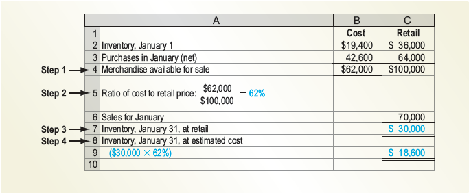

|  |  | Cost | Retail |
|---|---|---|---|
|  | Inventory, January 1 | $19,400 | $36,000 |
|  | Purchases in January (net) | 42,600 | 64,000 |
| **Step 1 -** | **Merchandise available for sale** | **$62,000** | **$100,000** |
| **Step 2 -** | **Ratio of cost to retail price:** $62,000 / $100,000 = **62%** |  |  |
|  | Sales for January |  | 70,000 |
| **Step 3 -** | **Inventory, January 31, at retail** |  | **$30,000** |
| **Step 4 -** | **Inventory, January 31, at estimated cost** |  |  |
|  | ($30,000 × 62%) |  | **$18,600** |

When estimating the cost to retail ratio, the mix of items in the ending inventory is assumed to be the same as the merchandise available for sale. If the ending inventory is made up of different classes of merchandise, cost to retail ratios may be developed for each class of inventory.

[Al estimar la relación costo/precio de venta al público, se asume que la mezcla de artículos en el inventario final es la misma que la mercancía disponible para la venta. Si el inventario final está compuesto por diferentes clases de mercancía, se pueden desarrollar relaciones costo/precio de venta al público para cada clase de inventario.]

An advantage of the retail method is that it provides inventory figures for preparing monthly statements. Department stores and similar retailers often determine gross profit and operating income each month but may take a physical inventory only once or twice a year. Thus, the retail method allows management to monitor operations more closely.

[Una ventaja del método al por menor es que proporciona cifras de inventario para preparar estados mensuales. Los grandes almacenes y minoristas similares a menudo determinan la utilidad bruta y el ingreso operativo cada mes, pero pueden tomar un inventario físico solo una o dos veces al año. Por lo tanto, el método al por menor permite a la administración monitorear las operaciones más de cerca.]

The retail method may also be used as an aid in taking a physical inventory. In this case, the items are counted and recorded at their retail (selling) prices instead of their costs. The physical inventory at retail is then converted to cost by using the cost to retail ratio.

[El método al por menor también puede utilizarse como ayuda para tomar un inventario físico. En este caso, los artículos se cuentan y registran a sus precios de venta al público (de venta) en lugar de sus costos. El inventario físico al precio de venta al público se convierte luego al costo utilizando la relación costo/precio de venta al público.]

---

<h1 id="963166" style="color:#E65100;">
  <a href="#Chapter_006" style="color:inherit; text-decoration:none;">
    6-7b Gross Profit Method of Inventory Costing
  </a>
</h1>

The **gross profit method** (A method of estimating inventory cost that is based on the relationship of gross profit to sales.) uses the estimated gross profit for the period to estimate the inventory at the end of the period. The gross profit is estimated from the preceding year, adjusted for any current-period changes in the cost and sales prices.

[El **método de utilidad bruta** (un método de estimación del costo del inventario que se basa en la relación de la utilidad bruta con las ventas) utiliza la utilidad bruta estimada para el período para estimar el inventario al final del período. La utilidad bruta se estima a partir del año anterior, ajustada por cualquier cambio en el período actual en los costos y precios de venta.]

The gross profit method is applied as follows:

[El método de utilidad bruta se aplica de la siguiente manera:]

**Step 1.** Determine the merchandise available for sale at cost.

[**Paso 1.** Determine la mercancía disponible para la venta al costo.]

**Step 2.** Determine the estimated gross profit by multiplying the sales by the gross profit percentage, assumed to be 30% in this illustration.

[**Paso 2.** Determine la utilidad bruta estimada multiplicando las ventas por el porcentaje de utilidad bruta, que se supone del 30% en esta ilustración.]

**Step 3.** Determine the estimated cost of goods sold by deducting the estimated gross profit from the sales.

[**Paso 3.** Determine el costo de bienes vendidos estimado deduciendo la utilidad bruta estimada de las ventas.]

**Step 4.** Estimate the ending inventory cost by deducting the estimated cost of goods sold from the merchandise available for sale.

[**Paso 4.** Estime el costo del inventario final deduciendo el costo de bienes vendidos estimado de la mercancía disponible para la venta.]

Exhibit 14 illustrates the gross profit method.

[La Figura 14 ilustra el método de utilidad bruta.]

---

## Exhibit 14

### Estimating Inventory by Gross Profit Method

[**Figura 14** - Estimación del Inventario por el Método de Utilidad Bruta]

<!-- 📍 IMAGEN: Exhibit 14 - Estimating Inventory by Gross Profit Method (página 1) -->

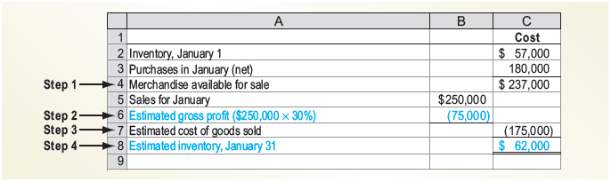

|  |  |  | **Cost** |
|---|---|---|---|
|  | Inventory, January 1 |  | $57,000 |
|  | Purchases in January (net) |  | 180,000 |
| **Step 1 -** | **Merchandise available for sale** |  | **$237,000** |
|  | Sales for January | $250,000 |  |
| **Step 2 -** | **Estimated gross profit ($250,000 × 30%)** | (75,000) |  |
| **Step 3 -** | **Estimated cost of goods sold** |  | **$175,000** |
| **Step 4 -** | **Estimated inventory, January 31** |  | **$62,000** |

The gross profit method is useful for estimating inventories for monthly or quarterly financial statements. It is also useful in estimating the cost of inventory destroyed by fire or other disasters.

[El método de utilidad bruta es útil para estimar inventarios para estados financieros mensuales o trimestrales. También es útil para estimar el costo del inventario destruido por incendios u otros desastres.]

---

<h1 id="554495" style="color:#E65100;">
  <a href="#Chapter_006" style="color:inherit; text-decoration:none;">
    6-8a Let’s Review Chapter Summary
  </a>
</h1>

**1.** Two objectives of inventory control are safeguarding the inventory and properly reporting it in the financial statements. The perpetual inventory system and physical count enhance control over inventory.

[**1.** Dos objetivos del control de inventario son salvaguardar el inventario y reportarlo adecuadamente en los estados financieros. El sistema de inventario perpetuo y el conteo físico mejoran el control sobre el inventario.]

**2.** The three common inventory cost flow assumptions used in business are the (1) first-in, first-out method (FIFO); (2) last-in, first-out method (LIFO); and (3) weighted average cost method. The cost flow assumption affects the income statement and balance sheet.

[**2.** Los tres supuestos comunes de flujo de costos de inventario utilizados en los negocios son (1) el método de primeras entradas, primeras salidas (PEPS); (2) el método de últimas entradas, primeras salidas (UEPS); y (3) el método de costo promedio ponderado. El supuesto de flujo de costos afecta el estado de resultados y el balance general.]

**3.** In a perpetual inventory system, the number of units and the cost of each type of merchandise are recorded in a subsidiary inventory ledger, with a separate account for each type of merchandise.

[**3.** En un sistema de inventario perpetuo, el número de unidades y el costo de cada tipo de mercancía se registran en un libro mayor auxiliar de inventario, con una cuenta separada para cada tipo de mercancía.]

**4.** In a periodic inventory system, a physical inventory is taken to determine the cost of the inventory and the cost of goods sold.

[**4.** En un sistema de inventario periódico, se toma un inventario físico para determinar el costo del inventario y el costo de los bienes vendidos.]

**5.** The three inventory costing methods will normally yield different amounts for (1) the ending inventory, (2) the cost of goods sold for the period, and (3) the gross profit (and net income) for the period.

[**5.** Los tres métodos de costeo de inventario normalmente producirán diferentes montos para (1) el inventario final, (2) el costo de los bienes vendidos para el período y (3) la utilidad bruta (y el ingreso neto) para el período.]

**6.** The lower-of-cost-or-market (LCM) method is used to value inventory. The market value is the net realizable value of the merchandise. Inventory is usually presented in the "Current assets" section of the balance sheet, following receivables. The methods of determining the cost and valuing the inventory are reported. Errors in reporting inventory will affect the balance sheet and income statement.

[**6.** El método del costo o mercado, el menor (LCM) se utiliza para valorar el inventario. El valor de mercado es el valor neto realizable de la mercancía. El inventario generalmente se presenta en la sección de "Activos corrientes" del balance general, después de las cuentas por cobrar. Los métodos para determinar el costo y valorar el inventario se reportan. Los errores al reportar el inventario afectarán el balance general y el estado de resultados.]

**7.** Inventory turnover measures the number of times inventory is turned into sold goods during the period. It is computed as Cost of Goods Sold ÷ Average Inventory. The days' sales in inventory measures the length of time it takes to acquire, sell, and replace the inventory. It is computed as Average Inventory ÷ Average Daily Cost of Goods Sold. Generally, the larger the inventory turnover and the lower the days' sales in inventory, the more efficient and effective the company is in managing inventory.

[**7.** La rotación de inventario mide el número de veces que el inventario se convierte en bienes vendidos durante el período. Se calcula como Costo de Bienes Vendidos ÷ Inventario Promedio. Los días de ventas en inventario miden el tiempo que lleva adquirir, vender y reemplazar el inventario. Se calcula como Inventario Promedio ÷ Costo Diario Promedio de Bienes Vendidos. Generalmente, cuanto mayor es la rotación de inventario y menor los días de ventas en inventario, más eficiente y efectiva es la empresa en la gestión de inventario.]

---

<h1 id="767516" style="color:#E65100;">
  <a href="#Chapter_006" style="color:inherit; text-decoration:none;">
    6-8b Key Terms
  </a>
</h1>

[**6-8b Términos Clave**]

| English Term | Español | Definition (English) | Definición (Español) |
|---|---|---|---|
| consigned inventory | inventario en consignación | Merchandise that is shipped by manufacturers to retailers who act as the manufacturer's selling agent. | Mercancía que es enviada por los fabricantes a los minoristas que actúan como agente de ventas del fabricante. |
| consignee | consignatario | The retailer in a consigned inventory arrangement. | El minorista en un acuerdo de inventario en consignación. |
| consignor | consignador | The manufacturer in a consigned inventory arrangement. | El fabricante en un acuerdo de inventario en consignación. |
| days' sales in inventory | días de ventas en inventario | The measure of the length of time it takes to acquire, sell, and replace inventory, computed by dividing the average inventory by the average daily cost of goods sold. | La medida del tiempo que lleva adquirir, vender y reemplazar el inventario, calculada dividiendo el inventario promedio entre el costo diario promedio de bienes vendidos. |
| first-in, first-out (FIFO) inventory cost flow method | método de flujo de costos de inventario PEPS (primeras entradas, primeras salidas) | The method of inventory costing based on the assumption that the first units purchased are the first units sold; the method of inventory costing based on the assumption that the costs of merchandise sold should be charged against revenue in the order in which the costs were incurred. | El método de costo de inventario basado en el supuesto de que las primeras unidades compradas son las primeras unidades vendidas; el método de costo de inventario basado en el supuesto de que los costos de la mercancía vendida deben cargarse contra los ingresos en el orden en que se incurrieron en los costos. |
| gross profit method | método de utilidad bruta | A method of estimating inventory cost that is based on the relationship of gross profit to sales. | Un método de estimación del costo del inventario que se basa en la relación de la utilidad bruta con las ventas. |
| inventory turnover | rotación de inventario | A measure of the number of times inventory is turned into goods sold during the year, computed by dividing the cost of goods sold by the average inventory. | Una medida del número de veces que el inventario se convierte en bienes vendidos durante el año, calculada dividiendo el costo de bienes vendidos entre el inventario promedio. |
| last-in, first-out (LIFO) inventory cost flow method | método de flujo de costos de inventario UEPS (últimas entradas, primeras salidas) | A method of inventory costing based on the assumption that the last units purchased are assumed to be sold and the ending inventory is made up of the first purchases. | Un método de costo de inventario basado en el supuesto de que las últimas unidades compradas se consideran vendidas y el inventario final está compuesto por las primeras compras. |
| lower-of-cost-or-market (LCM) method | método del costo o mercado, el menor (LCM) | A method of valuing inventory that reports the inventory at the lower of its cost or current market value (net realizable value). | Un método de valoración de inventarios que reporta el inventario al menor de su costo o su valor de mercado actual (valor neto realizable). |
| net realizable value | valor neto realizable | The estimated selling price of an item of inventory less any direct costs of disposal, such as sales commissions; the value of the receivables reduced to the amount that is expected to be collected or realized, computed as accounts receivable less allowance for doubtful accounts. | El precio de venta estimado de un artículo de inventario menos cualquier costo directo de disposición, como comisiones de ventas; el valor de las cuentas por cobrar reducido al monto que se espera cobrar o realizar, calculado como cuentas por cobrar menos la provisión para cuentas de cobro dudoso. |
| physical inventory | inventario físico | A detailed listing of merchandise on hand. | Una lista detallada de la mercancía disponible. |
| purchase order | orden de compra | The document authorizing the purchase of the inventory from an approved vendor. | El documento que autoriza la compra del inventario de un proveedor aprobado. |
| receiving report | informe de recepción | The form or electronic transmission used by the receiving personnel to indicate that materials have been received and inspected. | El formulario o transmisión electrónica utilizada por el personal de recepción para indicar que los materiales han sido recibidos e inspeccionados. |
| retail inventory method | método de inventario al por menor | A method of estimating inventory cost that is based on the relationship of cost to retail price. | Un método de estimación del costo del inventario que se basa en la relación del costo al precio de venta al público. |
| specific identification inventory cost flow method | método de flujo de costos de identificación específica | The method of inventory costing in which a unit sold is identified with a specific purchase. | El método de costo de inventario en el que una unidad vendida se identifica con una compra específica. |
| subsidiary inventory ledger | libro mayor auxiliar de inventario | The subsidiary ledger containing individual accounts for items of inventory. | El libro mayor auxiliar que contiene cuentas individuales para artículos de inventario. |
| weighted average inventory cost flow method | método de flujo de costos de promedio ponderado | A method of inventory costing in which the cost of the units sold and in ending inventory is a weighted average of the purchase costs. | Un método de costo de inventario en el que el costo de las unidades vendidas y en el inventario final es un promedio ponderado de los costos de compra. |

---

