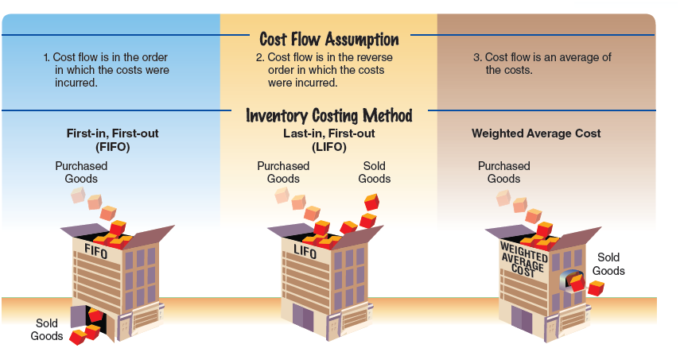
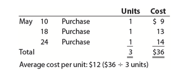
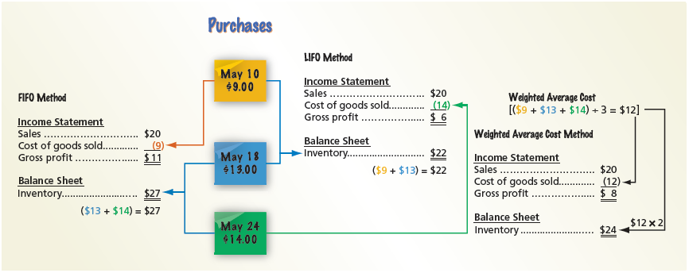
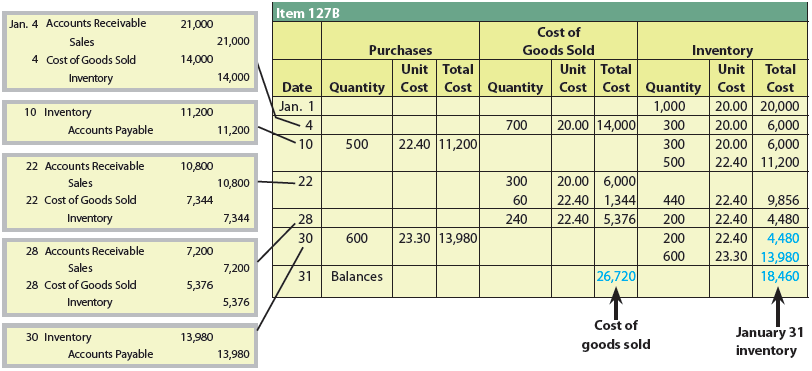
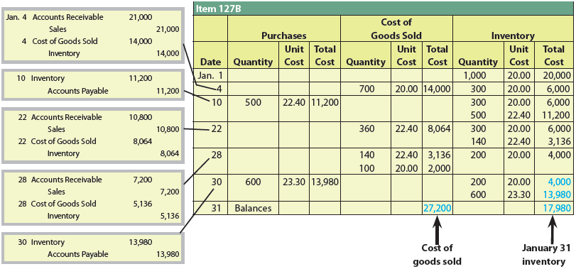
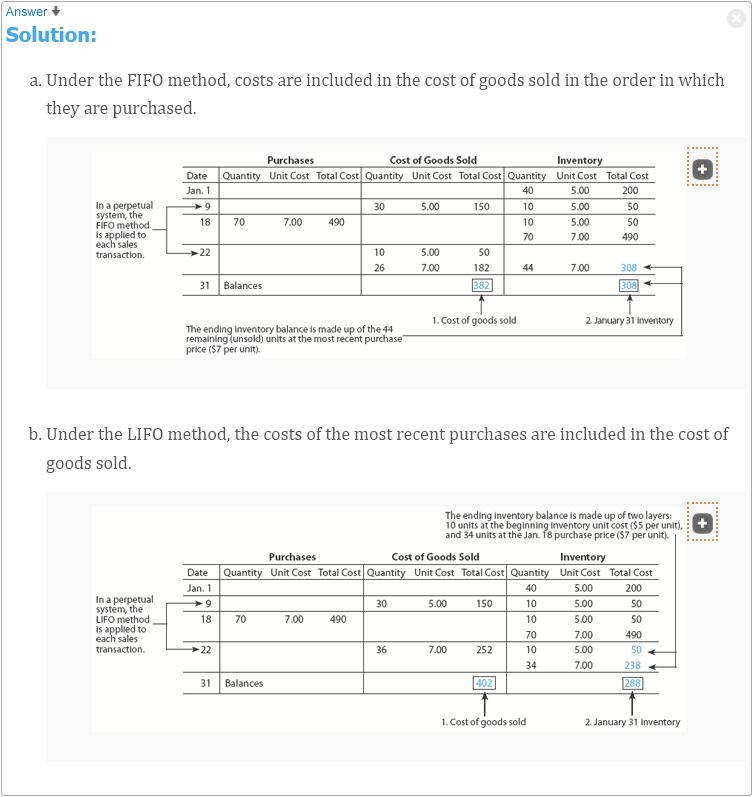
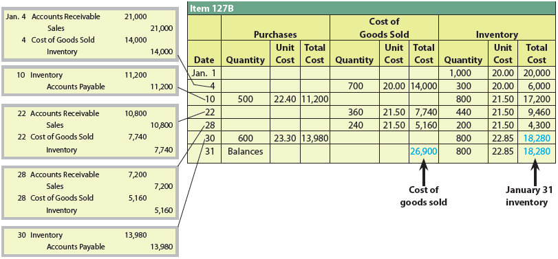
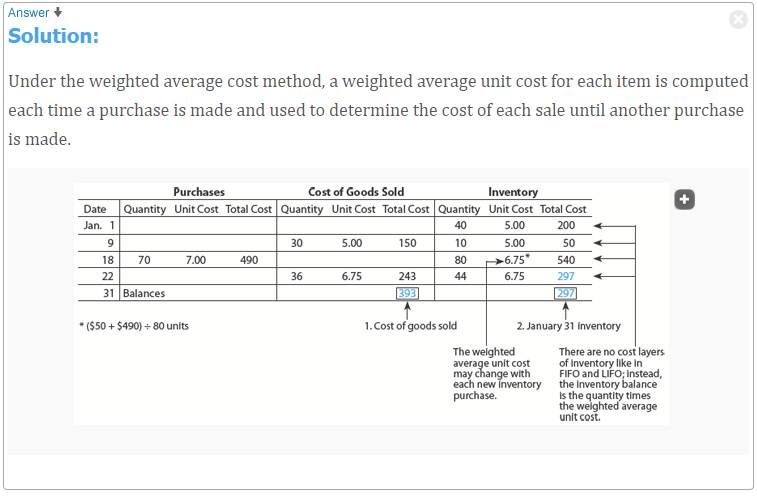
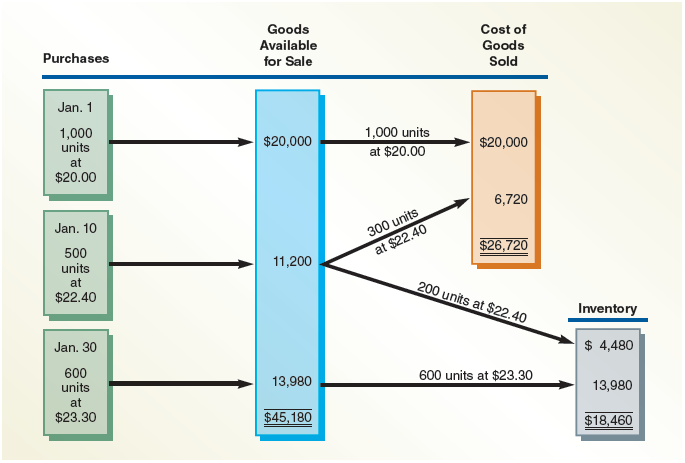
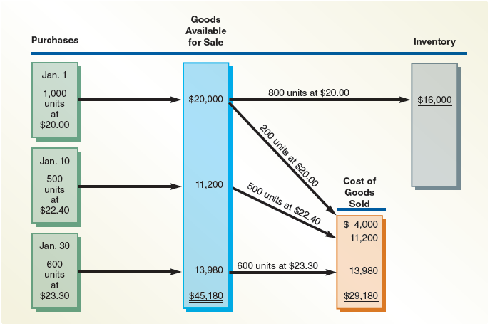

<h1 id="Chapter_006" style="color:#42A5F5;">Indice</h1>

##### [Capitulo 6-1 Control of Inventory](#883394)

##### [Capitulo 6-1a Safeguarding Inventory](#020652)

##### [Capitulo 6-1b Reporting Inventory](#331276)

##### [Capitulo 6-2 Inventory Cost Flow Assumptions](#333245)

##### [Capitulo 6-3 Inventory Costing Methods under a Perpetual Inventory System](#680549)

##### [Capitulo 6-3a First-In, First-Out Method](#991744)

##### [Capitulo 6-3b Last-In, First-Out Method](#588859)

##### [Capitulo 6-3c Weighted Average Cost Method](#370673)

##### [Capitulo 6-4a First-In, First-Out Method](#753463)

##### [Capitulo 6-4b Last-In, First-Out Method](#495704)

<h1 id="883394" style="color:#E65100;">
  <a href="#Chapter_006" style="color:inherit; text-decoration:none;">
    6-1 Control of Inventory
  </a>
</h1>

Two primary objectives of control over inventory are as follows:

[Los dos objetivos principales del control sobre el inventario son los siguientes:]

1. Safeguarding the inventory from damage or theft.

[1. Salvaguardar el inventario contra daños o robos.]

2. Reporting inventory in the financial statements.

[2. Reportar el inventario en los estados financieros.]

**Objective 1** - Describe the importance of control over inventory.

[**Objetivo 1** - Describir la importancia del control sobre el inventario.]

---

<h1 id="020652" style="color:#E65100;">
  <a href="#Chapter_006" style="color:inherit; text-decoration:none;">
    6-1a Safeguarding Inventory
  </a>
</h1>

# 6-1a Safeguarding Inventory

Controls for safeguarding inventory begin as soon as the inventory is ordered. The following documents are often used for inventory control:

[Los controles para salvaguardar el inventario comienzan tan pronto como se ordena el inventario. Los siguientes documentos se utilizan a menudo para el control de inventario:]

- Purchase order
- Receiving report
- Vendor's invoice

[Orden de compra
- Informe de recepción
- Factura del proveedor]

The **purchase order** (The document authorizing the purchase of the inventory from an approved vendor.) authorizes the purchase of the inventory from an approved vendor. As soon as the inventory is received, a receiving report is completed. The **receiving report** (The form or electronic transmission used by the receiving personnel to indicate that materials have been received and inspected.) establishes an initial record of the receipt of the inventory. To make sure the inventory received is what was ordered, the receiving report is compared with the purchase order. The price, quantity, and description of the item on the purchase order and receiving report are then compared to the vendor's invoice. If the receiving report, purchase order, and vendor's invoice agree, the inventory is recorded in the accounting records. If any differences exist, they should be investigated and reconciled.

[La **orden de compra** (el documento que autoriza la compra del inventario de un proveedor aprobado) autoriza la compra del inventario de un proveedor aprobado. Tan pronto como se recibe el inventario, se completa un informe de recepción. El **informe de recepción** (el formulario o transmisión electrónica utilizada por el personal de recepción para indicar que los materiales han sido recibidos e inspeccionados) establece un registro inicial de la recepción del inventario. Para asegurarse de que el inventario recibido es lo que se ordenó, el informe de recepción se compara con la orden de compra. El precio, la cantidad y la descripción del artículo en la orden de compra y el informe de recepción se comparan luego con la factura del proveedor. Si el informe de recepción, la orden de compra y la factura del proveedor coinciden, el inventario se registra en los registros contables. Si existen diferencias, deben investigarse y conciliarse.]

Recording inventory using a perpetual inventory system is also an effective means of control. Because the amount of inventory is always available in the subsidiary inventory ledger (The subsidiary ledger containing individual accounts for items of inventory.), this helps keep inventory quantities at proper levels. For example, comparing inventory quantities with maximum and minimum levels allows for the timely reordering of inventory and prevents ordering excess inventory.

[El registro de inventario utilizando un sistema de inventario perpetuo también es un medio eficaz de control. Debido a que la cantidad de inventario siempre está disponible en el libro mayor auxiliar de inventario (el libro mayor auxiliar que contiene cuentas individuales para artículos de inventario), esto ayuda a mantener las cantidades de inventario en niveles adecuados. Por ejemplo, comparar las cantidades de inventario con los niveles máximo y mínimo permite el reordenamiento oportuno del inventario y evita pedir inventario en exceso.]

Finally, controls for safeguarding inventory should include security measures to prevent damage and customer or employee theft. Some examples of security measures include the following:

[Finalmente, los controles para salvaguardar el inventario deben incluir medidas de seguridad para prevenir daños y robos por parte de clientes o empleados. Algunos ejemplos de medidas de seguridad incluyen los siguientes:]

- Storing inventory in areas that are restricted to only authorized employees
- Locking high-priced inventory in cabinets
- Using two-way mirrors, cameras, security tags, and guards

[Almacenar el inventario en áreas restringidas solo a empleados autorizados
- Bloquear el inventario de alto precio en gabinetes
- Utilizar espejos de dos vías, cámaras, etiquetas de seguridad y guardias]

---

**Link to Best Buy:** Best Buy uses scanners to screen customers as they leave the store for merchandise that has not been purchased. In addition, Best Buy stations greeters at the store's entrance to keep customers from bringing in bags that can be used to shoplift merchandise.

[**Enlace a Best Buy:** Best Buy utiliza escáneres para examinar a los clientes cuando salen de la tienda en busca de mercancía que no ha sido comprada. Además, Best Buy coloca recepcionistas en la entrada de la tienda para evitar que los clientes traigan bolsas que puedan ser utilizadas para robar mercancía.]

---

<h1 id="331276" style="color:#E65100;">
  <a href="#Chapter_006" style="color:inherit; text-decoration:none;">
    6-1b Reporting Inventory
  </a>
</h1>

# 6-1b Reporting Inventory

A physical inventory or count of inventory should be taken near year-end to make sure that the quantity of inventory reported in the financial statements is accurate. After the quantity of inventory on hand is determined, the cost of the inventory is assigned for reporting in the financial statements. Most companies assign costs to inventory using one of three inventory cost flow assumptions. If a physical count is not possible or inventory records are not available, the inventory cost may be estimated as described in the appendix at the end of this chapter.

[Se debe realizar un inventario físico o conteo de inventario cerca del final del año para asegurarse de que la cantidad de inventario reportada en los estados financieros sea precisa. Después de que se determina la cantidad de inventario disponible, se asigna el costo del inventario para su reporte en los estados financieros. La mayoría de las empresas asignan costos al inventario utilizando uno de tres supuestos de flujo de costos de inventario. Si no es posible realizar un conteo físico o no se dispone de registros de inventario, el costo del inventario puede estimarse como se describe en el apéndice al final de este capítulo.]

---

**Link to Best Buy:** Best Buy conducts ongoing physical counts of inventory throughout the year as a basis for monitoring and predicting loss adjustments for theft.

[**Enlace a Best Buy:** Best Buy realiza conteos físicos continuos de inventario durante todo el año como base para monitorear y predecir ajustes por pérdidas por robo.]

---

<h1 id="333245" style="color:#E65100;">
  <a href="#Chapter_006" style="color:inherit; text-decoration:none;">
    6-2 Inventory Cost Flow Assumptions
  </a>
</h1>

An accounting issue arises when identical units of merchandise are acquired at different unit costs during a period. In such cases, when an item is sold, it is necessary to determine its cost using a cost flow assumption and related inventory costing method. Three common cost flow assumptions and related inventory costing methods are shown in Exhibit 1.

[Un problema contable surge cuando unidades idénticas de mercancía se adquieren a diferentes costos unitarios durante un período. En tales casos, cuando se vende un artículo, es necesario determinar su costo utilizando un supuesto de flujo de costos y un método de costo de inventario relacionado. Tres supuestos comunes de flujo de costos y métodos de costo de inventario relacionados se muestran en la Figura 1.]

**Objective 2** - Describe three inventory cost flow assumptions and how they impact the income statement and balance sheet.

[**Objetivo 2** - Describir tres supuestos de flujo de costos de inventario y cómo impactan el estado de resultados y el balance general.]

---

## Exhibit 1

### Cost Flow Assumptions

[**Figura 1** - Supuestos de Flujo de Costos]

<!-- 📍 IMAGEN: Exhibit 1 - Cost Flow Assumptions (coordenadas [104, 427, 846, 722]) -->

To illustrate, assume that three identical units of merchandise are purchased during May, as follows:

</img>

[Para ilustrar, suponga que tres unidades idénticas de mercancía se compran durante mayo, de la siguiente manera:]

| Date | Units | Cost |
|---|---|---|
| May 10 | 1 | $9 |
| May 18 | 1 | $13 |
| May 24 | 1 | $14 |
| **Total** | **3** | **$36** |

Average cost per unit: $12 ($36 ÷ 3 units)

[**Costo promedio por unidad:** $12 ($36 ÷ 3 unidades)]

Assume that one unit is sold on May 30 for $20. Depending upon which unit was sold, the gross profit varies from $11 to $6, computed as follows:

[Suponga que una unidad se vende el 30 de mayo por $20. Dependiendo de qué unidad se vendió, la utilidad bruta varía de $11 a $6, calculada de la siguiente manera:]

| | May 10 | May 18 | May 24 |
|---|---|---|---|
| Sales | $20 | $20 | $20 |
| Cost of goods sold | (9) | (13) | (14) |
| **Gross profit** | **$11** | **$7** | **$6** |
| **Ending inventory** | **$27** | **$23** | **$22** |
| | ($13 + $14) | ($9 + $14) | ($9 + $13) |

Under the **specific identification inventory cost flow method** (The method of inventory costing in which a unit sold is identified with a specific purchase.), the unit sold is identified with a specific purchase. The ending inventory is made up of the remaining units on hand. Thus, the gross profit, cost of goods sold, and ending inventory can vary as illustrated. For example, if the May 18 unit was sold, the cost of goods sold is $13, the gross profit is $7, and the ending inventory is $23.

[Bajo el **método de flujo de costos de identificación específica** (el método de costo de inventario en el que una unidad vendida se identifica con una compra específica), la unidad vendida se identifica con una compra específica. El inventario final está compuesto por las unidades restantes disponibles. Por lo tanto, la utilidad bruta, el costo de bienes vendidos y el inventario final pueden variar como se ilustra. Por ejemplo, si la unidad del 18 de mayo se vendió, el costo de bienes vendidos es de $13, la utilidad bruta es de $7 y el inventario final es de $23.]

The specific identification method is not practical unless each inventory unit can be separately identified. For example, an automobile dealer may use the specific identification method because each automobile has a unique serial number. However, most businesses cannot identify each inventory unit separately. In such cases, one of the following three inventory cost flow methods is used.

[El método de identificación específica no es práctico a menos que cada unidad de inventario pueda identificarse por separado. Por ejemplo, un concesionario de automóviles puede utilizar el método de identificación específica porque cada automóvil tiene un número de serie único. Sin embargo, la mayoría de las empresas no pueden identificar cada unidad de inventario por separado. En tales casos, se utiliza uno de los siguientes tres métodos de flujo de costos de inventario.]

Under the **first-in, first-out (FIFO) inventory cost flow method** (The method of inventory costing based on the assumption that the first units purchased are the first units sold; the method of inventory costing based on the assumption that the costs of merchandise sold should be charged against revenue in the order in which the costs were incurred.), the first units purchased are assumed to be sold and the ending inventory is made up of the most recent purchases. In the preceding example, the May 10 unit would be assumed to have been sold. Thus, the gross profit would be $11, and the ending inventory would be $27 ($13 + $14).

[Bajo el **método de flujo de costos PEPS (primeras entradas, primeras salidas)** (el método de costo de inventario basado en el supuesto de que las primeras unidades compradas son las primeras unidades vendidas; el método de costo de inventario basado en el supuesto de que los costos de la mercancía vendida deben cargarse contra los ingresos en el orden en que se incurrieron en los costos), se supone que las primeras unidades compradas se venden y el inventario final está compuesto por las compras más recientes. En el ejemplo anterior, se supondría que la unidad del 10 de mayo se vendió. Por lo tanto, la utilidad bruta sería de $11 y el inventario final sería de $27 ($13 + $14).]

Under the **last-in, first-out (LIFO) inventory cost flow method** (A method of inventory costing based on the assumption that the last units purchased are assumed to be sold and the ending inventory is made up of the first purchases.), the last units purchased are assumed to be sold and the ending inventory is made up of the first purchases. In the preceding example, the May 24 unit would be assumed to have been sold. Thus, the gross profit would be $6, and the ending inventory would be $22 ($9 + $13).

[Bajo el **método de flujo de costos UEPS (últimas entradas, primeras salidas)** (un método de costo de inventario basado en el supuesto de que las últimas unidades compradas se consideran vendidas y el inventario final está compuesto por las primeras compras), se supone que las últimas unidades compradas se venden y el inventario final está compuesto por las primeras compras. En el ejemplo anterior, se supondría que la unidad del 24 de mayo se vendió. Por lo tanto, la utilidad bruta sería de $6 y el inventario final sería de $22 ($9 + $13).]

Under the **weighted average inventory cost flow method** (A method of inventory costing in which the cost of the units sold and in ending inventory is a weighted average of the purchase costs.), sometimes called the average cost flow method, the cost of the units sold and in ending inventory is a weighted average of the purchase costs. The purchase costs are weighted by the quantities purchased at each cost, thus the term weighted average. In the preceding example, the cost of the unit sold would be $12 ($36 ÷ 3 units), the gross profit would be $8 ($20 – $12), and the ending inventory would be $24 ($12 × 2 units). In this example, the purchase costs are weighted equally, since the same quantity (one) was purchased at each cost.

[Bajo el **método de flujo de costos de promedio ponderado** (un método de costo de inventario en el que el costo de las unidades vendidas y en el inventario final es un promedio ponderado de los costos de compra), a veces llamado método de flujo de costos promedio, el costo de las unidades vendidas y en el inventario final es un promedio ponderado de los costos de compra. Los costos de compra se ponderan por las cantidades compradas a cada costo, de ahí el término promedio ponderado. En el ejemplo anterior, el costo de la unidad vendida sería de $12 ($36 ÷ 3 unidades), la utilidad bruta sería de $8 ($20 – $12) y el inventario final sería de $24 ($12 × 2 unidades). En este ejemplo, los costos de compra se ponderan igualmente, ya que se compró la misma cantidad (una) a cada costo.]

---

## Business Insight

### RFID and Specific Identification

[**Perspectiva de Negocio - RFID e Identificación Específica**]

Companies like Best Buy Co., Inc. (BBY) have adopted the use of radio frequency identification (RFID) tags as a means to track and control inventory. Similar to a bar code, an RFID tag stores large amounts of data, including its maker/supplier and cost. The item's data are transmitted by radio waves to a reader instead of by a scan of a bar code. RFID tags have the potential to allow the use of the specific identification method for valuing most merchandise. However, the high cost of RFID tags has limited its widespread use among all but the largest retailers.

[Empresas como Best Buy Co., Inc. (BBY) han adoptado el uso de etiquetas de identificación por radiofrecuencia (RFID) como un medio para rastrear y controlar el inventario. Similar a un código de barras, una etiqueta RFID almacena grandes cantidades de datos, incluido su fabricante/proveedor y costo. Los datos del artículo se transmiten por ondas de radio a un lector en lugar de mediante un escaneo de un código de barras. Las etiquetas RFID tienen el potencial de permitir el uso del método de identificación específica para valorar la mayoría de la mercancía. Sin embargo, el alto costo de las etiquetas RFID ha limitado su uso generalizado entre todos excepto los minoristas más grandes.]

---

**Link to Best Buy:** Best Buy uses the weighted average cost method for its inventory.

[**Enlace a Best Buy:** Best Buy utiliza el método de costo promedio ponderado para su inventario.]

The three inventory cost flow methods, FIFO, LIFO, and weighted average, are shown in Exhibit 2.

[Los tres métodos de flujo de costos de inventario, PEPS, UEPS y promedio ponderado, se muestran en la Figura 2.]

---

## Exhibit 2

### Inventory Costing Methods

[**Figura 2** - Métodos de Costeo de Inventario]

<!-- 📍 IMAGEN: Exhibit 2 - Inventory Costing Methods (coordenadas [102, 549, 869, 782]) -->

---

<h1 id="680549" style="color:#E65100;">
  <a href="#Chapter_006" style="color:inherit; text-decoration:none;">
    6-3 Inventory Costing Methods under a Perpetual Inventory System
  </a>
</h1>

As illustrated in the prior section, when identical units of an item are purchased at different unit costs, an inventory cost flow method must be used. This is true regardless of whether the perpetual or periodic inventory system is used.

[Como se ilustró en la sección anterior, cuando se compran unidades idénticas de un artículo a diferentes costos unitarios, se debe utilizar un método de flujo de costos de inventario. Esto es cierto independientemente de si se utiliza el sistema de inventario perpetuo o periódico.]

**Objective 3** - Determine the cost of inventory under the perpetual inventory system, using the FIFO, LIFO, and weighted average cost methods.

[**Objetivo 3** - Determinar el costo del inventario bajo el sistema de inventario perpetuo, utilizando los métodos de costo PEPS, UEPS y promedio ponderado.]

In this section, the FIFO, LIFO, and weighted average cost methods are illustrated under a perpetual inventory system. For purposes of illustration, the following data for Item 127B are used:

[En esta sección, los métodos de costo PEPS, UEPS y promedio ponderado se ilustran bajo un sistema de inventario perpetuo. Para fines de ilustración, se utilizan los siguientes datos para el Artículo 127B:]

|  |Item 127B | Units | Cost |
|---|---|---|---|
| Jan. 1 | Inventory | 1,000 | $20.00 |
| Jan. 4 | Sale at $30 per unit | 700 | |
| Jan. 10 | Purchase | 500 | 22.40 |
| Jan. 22 | Sale at $30 per unit | 360 | |
| Jan. 28 | Sale at $30 per unit | 240 | |
| Jan. 30 | Purchase | 600 | 23.30 |

---

<h1 id="991744" style="color:#E65100;">
  <a href="#Chapter_006" style="color:inherit; text-decoration:none;">
    6-3a First-In, First-Out Method
  </a>
</h1>

When the FIFO method is used, costs are included in the cost of goods sold in the order in which they were purchased. This is often the same as the physical flow of the goods. Thus, the FIFO method often provides results that are about the same as those that would have been obtained using the specific identification method. For example, grocery stores shelve milk and other perishable products by expiration dates. Products with early expiration dates are stocked in front. In this way, the oldest products (earliest purchases) are sold first.

[Cuando se utiliza el método PEPS, los costos se incluyen en el costo de bienes vendidos en el orden en que se compraron. Esto suele ser lo mismo que el flujo físico de los bienes. Por lo tanto, el método PEPS a menudo proporciona resultados que son aproximadamente los mismos que los que se habrían obtenido utilizando el método de identificación específica. Por ejemplo, los supermercados colocan la leche y otros productos perecederos en los estantes por fechas de vencimiento. Los productos con fechas de vencimiento tempranas se colocan al frente. De esta manera, los productos más antiguos (compras más tempranas) se venden primero.]

To illustrate, Exhibit 3 shows the use of FIFO under a perpetual inventory system for Item 127B.

[Para ilustrar, la Figura 3 muestra el uso de PEPS bajo un sistema de inventario perpetuo para el Artículo 127B.]

---

## Exhibit 3

### Entries and Perpetual Inventory Account (FIFO)

[**Figura 3** - Asientos y Cuenta de Inventario Perpetuo (PEPS)]

<!-- 📍 IMAGEN: Exhibit 3 - Entries and Perpetual Inventory Account (FIFO) (coordenadas [102, 406, 872, 676]) -->

The journal entries and the subsidiary inventory ledger for Item 127B are shown in Exhibit 3 as follows:

[Los asientos de diario y el libro mayor auxiliar de inventario para el Artículo 127B se muestran en la Figura 3 de la siguiente manera:]

1. The beginning balance on January 1 is $20,000 (1,000 units at a unit cost of $20.00).

[1. El saldo inicial el 1 de enero es de $20,000 (1,000 unidades a un costo unitario de $20.00).]

2. On January 4, 700 units were sold at a price of $30 each for sales of $21,000 (700 units at a selling price of $30 per unit). The cost of goods sold is $14,000 (700 units at a unit cost of $20). After the sale, there remains $6,000 of inventory (300 units at a unit cost of $20).

[2. El 4 de enero, se vendieron 700 unidades a un precio de $30 cada una por ventas de $21,000 (700 unidades a un precio de venta de $30 por unidad). El costo de bienes vendidos es de $14,000 (700 unidades a un costo unitario de $20). Después de la venta, quedan $6,000 de inventario (300 unidades a un costo unitario de $20).]

3. On January 10, $11,200 is purchased (500 units at a unit cost of $22.40). After the purchase, the inventory is reported on two lines, $6,000 (300 units at a unit cost of $20.00) from the beginning inventory and $11,200 (500 units at a unit cost of $22.40) from the January 10 purchase.

[3. El 10 de enero, se compran $11,200 (500 unidades a un costo unitario de $22.40). Después de la compra, el inventario se reporta en dos líneas, $6,000 (300 unidades a un costo unitario de $20.00) del inventario inicial y $11,200 (500 unidades a un costo unitario de $22.40) de la compra del 10 de enero.]

4. On January 22, 360 units are sold at a price of $30 each for sales of $10,800 (360 units at a selling price of $30 per unit). Using FIFO, the cost of goods sold of $7,344 consists of $6,000 (300 units at a unit cost of $20.00) from the beginning inventory plus $1,344 (60 units at a unit cost of $22.40) from the January 10 purchase. After the sale, there remains $9,856 of inventory (440 units at a unit cost of $22.40) from the January 10 purchase.

[4. El 22 de enero, se venden 360 unidades a un precio de $30 cada una por ventas de $10,800 (360 unidades a un precio de venta de $30 por unidad). Utilizando PEPS, el costo de bienes vendidos de $7,344 consiste en $6,000 (300 unidades a un costo unitario de $20.00) del inventario inicial más $1,344 (60 unidades a un costo unitario de $22.40) de la compra del 10 de enero. Después de la venta, quedan $9,856 de inventario (440 unidades a un costo unitario de $22.40) de la compra del 10 de enero.]

5. The January 28 sale and January 30 purchase are recorded in a similar manner.

[5. La venta del 28 de enero y la compra del 30 de enero se registran de manera similar.]

6. The cost of goods sold for January of $26,720 is determined by adding the cost of the items sold in the Cost of Goods Sold column.

[6. El costo de bienes vendidos para enero de $26,720 se determina sumando el costo de los artículos vendidos en la columna de Costo de Bienes Vendidos.]

7. The ending balance on January 31 is $18,460. This balance is made up of two layers of inventory as follows:

[7. El saldo final el 31 de enero es de $18,460. Este saldo está compuesto por dos capas de inventario de la siguiente manera:]

|| Date of Purchase | Quantity | Unit Cost | Total Cost |
|---|---|---|---|---|
| Layer 1:| Jan. 10 | 200 | $22.40 | $4,480 |
| Layer 2:| Jan. 30 | 600 | 23.30 | 13,980 |
| **Total** | | **800** | | **$18,460** |

---

<h1 id="588859" style="color:#E65100;">
  <a href="#Chapter_006" style="color:inherit; text-decoration:none;">
    6-3b Last-In, First-Out Method
  </a>
</h1>

When the LIFO method is used, the cost of the units sold is the cost of the most recent purchases. The LIFO method was originally used in those rare cases where the units sold were taken from the most recently purchased units. However, for tax purposes, LIFO is now widely used even when it does not represent the physical flow of units. The tax impact of LIFO is discussed later in this chapter.

[Cuando se utiliza el método UEPS, el costo de las unidades vendidas es el costo de las compras más recientes. El método UEPS se utilizó originalmente en aquellos raros casos en los que las unidades vendidas se tomaban de las unidades compradas más recientemente. Sin embargo, para fines fiscales, el UEPS ahora se utiliza ampliamente incluso cuando no representa el flujo físico de las unidades. El impacto fiscal del UEPS se discute más adelante en este capítulo.]

To illustrate, Exhibit 4 shows the use of LIFO under a perpetual inventory system for Item 127B.

[Para ilustrar, la Figura 4 muestra el uso de UEPS bajo un sistema de inventario perpetuo para el Artículo 127B.]

---

## Exhibit 4

### Entries and Perpetual Inventory Account (LIFO)

[**Figura 4** - Asientos y Cuenta de Inventario Perpetuo (UEPS)]

<!-- 📍 IMAGEN: Exhibit 4 - Entries and Perpetual Inventory Account (LIFO) (coordenadas [111, 376, 869, 649]) -->

The journal entries and the subsidiary inventory ledger for Item 127B are shown in Exhibit 4 as follows:

[Los asientos de diario y el libro mayor auxiliar de inventario para el Artículo 127B se muestran en la Figura 4 de la siguiente manera:]

1. The beginning balance on January 1 is $20,000 (1,000 units at a unit cost of $20.00).

[1. El saldo inicial el 1 de enero es de $20,000 (1,000 unidades a un costo unitario de $20.00).]

2. On January 4, 700 units were sold at a price of $30 each for sales of $21,000 (700 units at a selling price of $30 per unit). The cost of goods sold is $14,000 (700 units at a unit cost of $20). After the sale, there remains $6,000 of inventory (300 units at a unit cost of $20).

[2. El 4 de enero, se vendieron 700 unidades a un precio de $30 cada una por ventas de $21,000 (700 unidades a un precio de venta de $30 por unidad). El costo de bienes vendidos es de $14,000 (700 unidades a un costo unitario de $20). Después de la venta, quedan $6,000 de inventario (300 unidades a un costo unitario de $20).]

3. On January 10, $11,200 is purchased (500 units at a unit cost of $22.40). After the purchase, the inventory is reported on two lines, $6,000 (300 units at a unit cost of $20.00) from the beginning inventory and $11,200 (500 units at a unit cost of $22.40) from the January 10 purchase.

[3. El 10 de enero, se compran $11,200 (500 unidades a un costo unitario de $22.40). Después de la compra, el inventario se reporta en dos líneas, $6,000 (300 unidades a un costo unitario de $20.00) del inventario inicial y $11,200 (500 unidades a un costo unitario de $22.40) de la compra del 10 de enero.]

4. On January 22, 360 units are sold at a price of $30 each for sales of $10,800 (360 units at a selling price of $30 per unit). Using LIFO, the cost of goods sold is $8,064 (360 units at a unit cost of $22.40) from the January 10 purchase. After the sale, there remains $9,136 of inventory consisting of $6,000 (300 units at a unit cost of $20.00) from the beginning inventory and $3,136 (140 units at a unit cost of $22.40) from the January 10 purchase.

[4. El 22 de enero, se venden 360 unidades a un precio de $30 cada una por ventas de $10,800 (360 unidades a un precio de venta de $30 por unidad). Utilizando UEPS, el costo de bienes vendidos es de $8,064 (360 unidades a un costo unitario de $22.40) de la compra del 10 de enero. Después de la venta, quedan $9,136 de inventario que consiste en $6,000 (300 unidades a un costo unitario de $20.00) del inventario inicial y $3,136 (140 unidades a un costo unitario de $22.40) de la compra del 10 de enero.]

5. The January 28 sale and January 30 purchase are recorded in a similar manner.

[5. La venta del 28 de enero y la compra del 30 de enero se registran de manera similar.]

6. The cost of goods sold for January of $27,200 is determined by adding the cost of the items sold in the Cost of Goods Sold column.

[6. El costo de bienes vendidos para enero de $27,200 se determina sumando el costo de los artículos vendidos en la columna de Costo de Bienes Vendidos.]

7. The ending balance on January 31 is $17,980. This balance is made up of two layers of inventory as follows:

[7. El saldo final el 31 de enero es de $17,980. Este saldo está compuesto por dos capas de inventario de la siguiente manera:]

|| Date of Purchase | Quantity | Unit Cost | Total Cost |
|---|---|---|---|---|
| Layer 1:| Beg. inv. (Jan. 1) | 200 | $20.00 | $4,000 |
| Layer 2:| Jan. 30 | 600 | 23.30 | 13,980 |
| **Total** || **800** | | **$17,980** |

When the LIFO method is used, the subsidiary inventory ledger is sometimes maintained in units only. The units are converted to dollars when the financial statements are prepared at the end of the period.

[Cuando se utiliza el método UEPS, el libro mayor auxiliar de inventario a veces se mantiene solo en unidades. Las unidades se convierten a dólares cuando se preparan los estados financieros al final del período.]

---

## Check Up Corner 6-1

### Perpetual Inventory: FIFO and LIFO Methods

[**Esquina de Verificación 6-1 - Inventario Perpetuo: Métodos PEPS y UEPS**]

The beginning inventory, purchases, and sales of Item QX3 for the month of January are as follows:

[El inventario inicial, las compras y las ventas del Artículo QX3 para el mes de enero son los siguientes:]

| Date | Transaction | Units | Unit Cost |
|---|---|---|---|
| Jan. 1 | Inventory | 40 | $5 |
| Jan. 5 | Sale | 30 | |
| Jan. 18 | Purchase | 70 | $7 |
| Jan. 22 | Sale | 36 | |

The company uses the perpetual inventory system. Determine (1) the cost of goods sold for January and (2) the January 31 inventory balance using the:

[La empresa utiliza el sistema de inventario perpetuo. Determine (1) el costo de bienes vendidos para enero y (2) el saldo del inventario al 31 de enero utilizando los siguientes métodos:]

a. first-in, first-out (FIFO) method.
b. last-in, first-out (LIFO) method.

[a. Método PEPS (primeras entradas, primeras salidas).
b. Método UEPS (últimas entradas, primeras salidas).]

---

### Solution - Check Up Corner 6-1

</img>

[**Solución - Esquina de Verificación 6-1**]

---

### a. Under the FIFO method, costs are included in the cost of goods sold in the order in which they are purchased.

| Date | Purchases | | | Cost of Goods Sold | | | Inventory Balance | | | Calculations | Description |
|---|---|---|---|---|---|---|---|---|---|---|---|
| | Quantity | Unit Cost | Total Cost | Quantity | Unit Cost | Total Cost | Quantity | Unit Cost | Total Cost | | |
| Jan. 1 | | | | | | | 40 | $5.00 | $200 | | Initial inventory (40 units × $5.00 = $200) |
| Jan. 9 | | | | 30 | $5.00 | $150 | 10 | $5.00 | $50 | $150 = 30 × $5.00 | Sold 30 units from beginning inventory at $5.00 each |
| Jan. 18 | 70 | $7.00 | $490 | | | | 10 | $5.00 | $50 | $490 = 70 × $7.00 | Purchased 70 units at $7.00 each |
| | | | | | | | 70 | $7.00 | $490 | | |
| Jan. 22 | | | | 10 | $5.00 | $50 | | | | | Sold 10 units from remaining beginning inventory at $5.00 |
| | | | | 26 | $7.00 | $182 | 44 | $7.00 | $308 | $182 = 26 × $7.00 | Sold 26 units from Jan. 18 purchase at $7.00 |
| | | | | | | | | | | | Remaining inventory: 44 units × $7.00 = $308 |
| Jan. 31 | Balances | | | | | $382 | | | $308 | $382 = $150 + $50 + $182 | Total COGS = Sum of all sales |

## Método FIFO (First-In, First-Out) - Paso a Paso

---

### Datos iniciales:

| Fecha | Transacción | Unidades | Costo Unitario |
|-------|-------------|----------|----------------|
| Jan. 1 | Inventario inicial | 40 | $5.00 |
| Jan. 9 | Venta | 30 | |
| Jan. 18 | Compra | 70 | $7.00 |
| Jan. 22 | Venta | 36 | |

---

### Paso 1: Inventario inicial (Jan. 1)

| Concepto | Cálculo | Total |
|----------|---------|-------|
| Inventario inicial | 40 unidades × $5.00 | **$200** |

| | Quantity | Unit Cost | Total Cost |
|---|---|---|---|
| Inventory Balance | 40 | $5.00 | $200 |

---

### Paso 2: Venta del Jan. 9 (30 unidades)

Bajo FIFO, las primeras unidades en entrar son las primeras en salir. Por lo tanto, las 30 unidades vendidas salen del inventario inicial (capa de $5.00).

| Concepto | Cálculo | Total |
|----------|---------|-------|
| Cost of Goods Sold | 30 × $5.00 | **$150** |

| | Quantity | Unit Cost | Total Cost |
|---|---|---|---|
| Inventory Balance (antes de la venta) | 40 | $5.00 | $200 |
| (-) Cost of Goods Sold | (30) | ($5.00) | ($150) |
| **Inventory Balance (después de la venta)** | **10** | **$5.00** | **$50** |

---

### Paso 3: Compra del Jan. 18 (70 unidades a $7.00)

| Concepto | Cálculo | Total |
|----------|---------|-------|
| Compra | 70 × $7.00 | **$490** |

| | Quantity | Unit Cost | Total Cost |
|---|---|---|---|
| Inventory Balance (capa 1) | 10 | $5.00 | $50 |
| Inventory Balance (capa 2) | 70 | $7.00 | $490 |
| **Inventory Balance (total)** | **80** | | **$540** |

---

### Paso 4: Venta del Jan. 22 (36 unidades)

Bajo FIFO, primero se venden las unidades más antiguas. Por lo tanto:
- Primero se venden las 10 unidades restantes de la capa de $5.00
- Luego se venden 26 unidades de la capa de $7.00

| Concepto | Cálculo | Total |
|----------|---------|-------|
| Cost of Goods Sold (capa $5.00) | 10 × $5.00 | $50 |
| Cost of Goods Sold (capa $7.00) | 26 × $7.00 | $182 |
| **Cost of Goods Sold (total)** | | **$232** |

| | Quantity | Unit Cost | Total Cost |
|---|---|---|---|
| Inventory Balance (antes de la venta) | 10 | $5.00 | $50 |
| | 70 | $7.00 | $490 |
| (-) Cost of Goods Sold (capa $5.00) | (10) | ($5.00) | ($50) |
| (-) Cost of Goods Sold (capa $7.00) | (26) | ($7.00) | ($182) |
| **Inventory Balance (después de la venta)** | **44** | **$7.00** | **$308** |

---

### Paso 5: Totales finales (Jan. 31)

| Concepto | Cálculo | Total |
|----------|---------|-------|
| **Total Cost of Goods Sold** | $150 + $50 + $182 | **$382** |
| **Ending Inventory** | 44 × $7.00 | **$308** |

---

### Verificación

| | Cantidad | Costo Unitario | Total |
|---|---|---|---|
| **Unidades disponibles para la venta** | | | |
| Inventario inicial | 40 | $5.00 | $200 |
| Compra Jan. 18 | 70 | $7.00 | $490 |
| **Total disponibles** | **110** | | **$690** |
| | | | |
| **Unidades vendidas (COGS)** | | | |
| Jan. 9 | 30 | $5.00 | $150 |
| Jan. 22 | 36 | (10 × $5.00 + 26 × $7.00) | $232 |
| **Total COGS** | **66** | | **$382** |
| | | | |
| **Unidades en inventario final** | **44** | **$7.00** | **$308** |

---

#### b. LIFO Method

| Date | Purchase | Cost of Goods Sold | Inventory Balance |
|---|---|---|---|
| Jan. 1 | | | 40 × $59 = $2,360 |
| Jan. 5 | | 30 × $59 = $1,770 | 10 × $59 = $590 |
| Jan. 18 | 70 × $72 = $5,040 | | 10 × $59 = $590 |
| | | | 70 × $72 = $5,040 |
| Jan. 22 | | 36 × $72 = $2,592 | 10 × $59 = $590 |
| | | | 34 × $72 = $2,448 |
| | | **Total COGS = $4,362** | **Ending Inventory = $3,038** |

### b. LIFO method, the costs of the most recent purchases are included in the cost of goods sold.

| Date | Purchases | | | Cost of Goods Sold | | | Inventory | | | Calculations | Description |
|---|---|---|---|---|---|---|---|---|---|---|---|
| | Quantity | Unit Cost | Total Cost | Quantity | Unit Cost | Total Cost | Quantity | Unit Cost | Total Cost | | |
| Jan. 1 | | | | | | | 40 | $5.00 | $200 | | Initial inventory: 40 units × $5.00 = $200 |
| Jan. 9 | | | | 30 | $5.00 | $150 | 10 | $5.00 | $50 | 30 × $5.00 = $150 | Sold 30 units from beginning inventory at $5.00 each |
| Jan. 18 | 70 | $7.00 | $490 | | | | 10 | $5.00 | $50 | 70 × $7.00 = $490 | Purchased 70 units at $7.00 each |
| | | | | | | | 70 | $7.00 | $490 | | |
| Jan. 22 | | | | 36 | $7.00 | $252 | 10 | $5.00 | $50 | 36 × $7.00 = $252 | Sold 36 units from Jan. 18 purchase at $7.00 each (LIFO) |
| | | | | | | | 34 | $7.00 | $238 | | Remaining: 34 units from Jan. 18 purchase at $7.00 |
| **Balances** | | | | | | **$402** | | | **$288** | $150 + $252 = $402 | Total COGS: $150 + $252 = $402 |
| | | | | | | | | | | 10 × $5.00 = $50 | Ending inventory: (10 × $5.00) + (34 × $7.00) = $50 + $238 = $288 |

## Método LIFO (Last-In, First-Out) - Paso a Paso

---

### Datos iniciales:

| Fecha | Transacción | Unidades | Costo Unitario |
|-------|-------------|----------|----------------|
| Jan. 1 | Inventario inicial | 40 | $5.00 |
| Jan. 9 | Venta | 30 | |
| Jan. 18 | Compra | 70 | $7.00 |
| Jan. 22 | Venta | 36 | |

---

### Paso 1: Inventario inicial (Jan. 1)

| Concepto | Cálculo | Total |
|----------|---------|-------|
| Inventario inicial | 40 unidades × $5.00 | **$200** |

| | Quantity | Unit Cost | Total Cost |
|---|---|---|---|
| Inventory | 40 | $5.00 | $200 |

---

### Paso 2: Venta del Jan. 9 (30 unidades)

Bajo LIFO, las últimas unidades en entrar son las primeras en salir. En este punto, solo existe la capa del inventario inicial ($5.00), por lo que las 30 unidades vendidas salen de esa capa.

| Concepto | Cálculo | Total |
|----------|---------|-------|
| Cost of Goods Sold | 30 × $5.00 | **$150** |

| | Quantity | Unit Cost | Total Cost |
|---|---|---|---|
| Inventory (antes de la venta) | 40 | $5.00 | $200 |
| (-) Cost of Goods Sold | (30) | ($5.00) | ($150) |
| **Inventory (después de la venta)** | **10** | **$5.00** | **$50** |

---

### Paso 3: Compra del Jan. 18 (70 unidades a $7.00)

| Concepto | Cálculo | Total |
|----------|---------|-------|
| Compra | 70 × $7.00 | **$490** |

| | Quantity | Unit Cost | Total Cost |
|---|---|---|---|
| Inventory (capa 1) | 10 | $5.00 | $50 |
| Inventory (capa 2) | 70 | $7.00 | $490 |
| **Inventory (total)** | **80** | | **$540** |

---

### Paso 4: Venta del Jan. 22 (36 unidades)

Bajo LIFO, se venden primero las unidades de la compra más reciente (Jan. 18) a $7.00.

| Concepto | Cálculo | Total |
|----------|---------|-------|
| Cost of Goods Sold | 36 × $7.00 | **$252** |

| | Quantity | Unit Cost | Total Cost |
|---|---|---|---|
| Inventory (antes de la venta) | 10 | $5.00 | $50 |
| | 70 | $7.00 | $490 |
| (-) Cost of Goods Sold | (36) | ($7.00) | ($252) |
| **Inventory (después de la venta)** | **10** | **$5.00** | **$50** |
| | **34** | **$7.00** | **$238** |

---

### Paso 5: Totales finales (Jan. 31)

| Concepto | Cálculo | Total |
|----------|---------|-------|
| **Total Cost of Goods Sold** | $150 + $252 | **$402** |
| **Ending Inventory** | $50 + $238 | **$288** |

---

### Verificación

| | Cantidad | Costo Unitario | Total |
|---|---|---|---|
| **Unidades disponibles para la venta** | | | |
| Inventario inicial | 40 | $5.00 | $200 |
| Compra Jan. 18 | 70 | $7.00 | $490 |
| **Total disponibles** | **110** | | **$690** |
| | | | |
| **Unidades vendidas (COGS)** | | | |
| Jan. 9 | 30 | $5.00 | $150 |
| Jan. 22 | 36 | $7.00 | $252 |
| **Total COGS** | **66** | | **$402** |
| | | | |
| **Unidades en inventario final** | **44** | | **$288** |
| Capa 1 (Jan. 1) | 10 | $5.00 | $50 |
| Capa 2 (Jan. 18) | 34 | $7.00 | $238 |
| **Total** | **44** | | **$288** |
---

## International Connection

### IFRS International Financial Reporting Standards (IFRS)

[**Conexión Internacional - Normas Internacionales de Información Financiera (IFRS)**]

IFRS permit the first-in, first-out and weighted average cost methods but prohibit the last-in, first-out (LIFO) method for determining inventory costs. Since LIFO is used in the United States, adoption of IFRS could have a significant impact on many U.S. companies. One estimate is that the elimination of LIFO would increase net income of U.S. companies by over $250 billion and raise approximately $76 billion in taxes.

[Las IFRS permiten los métodos de primeras entradas, primeras salidas y promedio ponderado, pero prohíben el método de últimas entradas, primeras salidas (UEPS) para determinar los costos de inventario. Dado que el UEPS se utiliza en los Estados Unidos, la adopción de las IFRS podría tener un impacto significativo en muchas empresas estadounidenses. Una estimación es que la eliminación del UEPS aumentaría el ingreso neto de las empresas estadounidenses en más de $250 mil millones y recaudaría aproximadamente $76 mil millones en impuestos.]

---

<h1 id="370673" style="color:#E65100;">
  <a href="#Chapter_006" style="color:inherit; text-decoration:none;">
    6-3c Weighted Average Cost Method
  </a>
</h1>

When the weighted average cost method is used in a perpetual inventory system, a weighted average unit cost for each item is computed each time a purchase is made. This unit cost is used to determine the cost of each sale until another purchase is made and a new average is computed. This technique is called a moving average.

[Cuando se utiliza el método de costo promedio ponderado en un sistema de inventario perpetuo, se calcula un costo unitario promedio ponderado para cada artículo cada vez que se realiza una compra. Este costo unitario se utiliza para determinar el costo de cada venta hasta que se realiza otra compra y se calcula un nuevo promedio. Esta técnica se llama promedio móvil.]

To illustrate, Exhibit 5 shows the use of weighted average under a perpetual inventory system for Item 127B.

[Para ilustrar, la Figura 5 muestra el uso del promedio ponderado bajo un sistema de inventario perpetuo para el Artículo 127B.]

---

## Exhibit 5

### Entries and Perpetual Inventory Account (Weighted Average)

[**Figura 5** - Asientos y Cuenta de Inventario Perpetuo (Promedio Ponderado)]

<!-- 📍 IMAGEN: Exhibit 5 - Entries and Perpetual Inventory Account (Weighted Average) (coordenadas [106, 359, 867, 632]) -->

The journal entries and the subsidiary inventory ledger for Item 127B are shown in Exhibit 5 as follows:

[Los asientos de diario y el libro mayor auxiliar de inventario para el Artículo 127B se muestran en la Figura 5 de la siguiente manera:]

1. The beginning balance on January 1 is $20,000 (1,000 units at a unit cost of $20.00).

[1. El saldo inicial el 1 de enero es de $20,000 (1,000 unidades a un costo unitario de $20.00).]

2. On January 4, 700 units were sold at a price of $30 each for sales of $21,000 (700 units at a selling price of $30 per unit). The cost of goods sold is $14,000 (700 units at a unit cost of $20). After the sale, there remains $6,000 of inventory (300 units at a unit cost of $20).

[2. El 4 de enero, se vendieron 700 unidades a un precio de $30 cada una por ventas de $21,000 (700 unidades a un precio de venta de $30 por unidad). El costo de bienes vendidos es de $14,000 (700 unidades a un costo unitario de $20). Después de la venta, quedan $6,000 de inventario (300 unidades a un costo unitario de $20).]

3. On January 10, $11,200 is purchased (500 units at a unit cost of $22.40). After the purchase, the weighted average unit cost of $21.50 is determined by dividing the total cost of the inventory on hand of $17,200 ($6,000 + $11,200) by the total quantity of inventory on hand of 800 (300 + 500) units. Thus, after the purchase, the inventory consists of 800 units at $21.50 per unit for a total cost of $17,200.

[3. El 10 de enero, se compran $11,200 (500 unidades a un costo unitario de $22.40). Después de la compra, el costo unitario promedio ponderado de $21.50 se determina dividiendo el costo total del inventario disponible de $17,200 ($6,000 + $11,200) por la cantidad total de inventario disponible de 800 (300 + 500) unidades. Por lo tanto, después de la compra, el inventario consiste en 800 unidades a $21.50 por unidad por un costo total de $17,200.]

4. On January 22, 360 units are sold at a price of $30 each for sales of $10,800 (360 units at a selling price of $30 per unit). Using weighted average, the cost of goods sold is $7,740 (360 units × $21.50 per unit). After the sale, there remains $9,460 of inventory (440 units × $21.50 per unit).

[4. El 22 de enero, se venden 360 unidades a un precio de $30 cada una por ventas de $10,800 (360 unidades a un precio de venta de $30 por unidad). Utilizando el promedio ponderado, el costo de bienes vendidos es de $7,740 (360 unidades × $21.50 por unidad). Después de la venta, quedan $9,460 de inventario (440 unidades × $21.50 por unidad).]

5. The January 28 sale and January 30 purchase are recorded in a similar manner.

[5. La venta del 28 de enero y la compra del 30 de enero se registran de manera similar.]

6. The cost of goods sold for January of $26,900 is determined by adding the cost of the items sold in the Cost of Goods Sold column.

[6. El costo de bienes vendidos para enero de $26,900 se determina sumando el costo de los artículos vendidos en la columna de Costo de Bienes Vendidos.]

7. The ending balance on January 31 is $18,280 (800 units × $22.85 per unit).

[7. El saldo final el 31 de enero es de $18,280 (800 unidades × $22.85 por unidad).]

---

## Check Up Corner 6-2

### Perpetual Inventory: Weighted Average Method

[**Esquina de Verificación 6-2 - Inventario Perpetuo: Método de Promedio Ponderado**]

The beginning inventory, purchases, and sales of Item QX3 for the month of January are as follows:

[El inventario inicial, las compras y las ventas del Artículo QX3 para el mes de enero son los siguientes:]

| Date | Transaction | Units | Unit Cost |
|---|---|---|---|
| Jan. 1 | Inventory | 40 | $5 |
| Jan. 5 | Sale | 30 | |
| Jan. 18 | Purchase | 70 | $7 |
| Jan. 22 | Sale | 36 | |

The company uses the perpetual inventory system. Determine (1) the cost of goods sold for January and (2) the January 31 inventory balance using the weighted average cost method.

[La empresa utiliza el sistema de inventario perpetuo. Determine (1) el costo de bienes vendidos para enero y (2) el saldo del inventario al 31 de enero utilizando el método de costo promedio ponderado.]

---

### Solution - Check Up Corner 6-2

</img>

[**Solución - Esquina de Verificación 6-2**]

| Date | Purchases | | | Cost of Goods Sold | | | Inventory Balance | | | Calculations | Description |
|---|---|---|---|---|---|---|---|---|---|---|---|
| | Quantity | Unit Cost | Total Cost | Quantity | Unit Cost | Total Cost | Quantity | Unit Cost | Total Cost | | |
| Jan. 1 | | | | | | | 40 | $5.00 | $200 | | Initial inventory: 40 × $5.00 = $200 |
| Jan. 5 | | | | 30 | $5.00 | $150 | 10 | $5.00 | $50 | 30 × $5.00 = $150 | Sold 30 units at $5.00 each |
| Jan. 18 | 70 | $7.00 | $490 | | | | 10 | $5.00 | $50 | 70 × $7.00 = $490 | Purchased 70 units at $7.00 each |
| | | | | | | | 70 | $7.00 | $490 | | |
| Jan. 18 | | | | | | | 80 | $6.75 | $540 | ($50 + $490) ÷ 80 = $6.75 | New weighted average after purchase |
| Jan. 22 | | | | 36 | $6.75 | $243 | 44 | $6.75 | $297 | 36 × $6.75 = $243 | Sold 36 units at weighted avg cost of $6.75 |
| Jan. 31 | Balances | | | | | **$393** | | | **$297** | $150 + $243 = $393 | Total COGS: $150 + $243 = $393 |
| | | | | | | | | | | 44 × $6.75 = $297 | Ending inventory: 44 × $6.75 = $297 |

## Método de Promedio Ponderado (Weighted Average) - Paso a Paso

---

### Datos iniciales:

| Fecha | Transacción | Unidades | Costo Unitario |
|-------|-------------|----------|----------------|
| Jan. 1 | Inventario inicial | 40 | $5.00 |
| Jan. 5 | Venta | 30 | |
| Jan. 18 | Compra | 70 | $7.00 |
| Jan. 22 | Venta | 36 | |

---

### Paso 1: Inventario inicial (Jan. 1)

| Concepto | Cálculo | Total |
|----------|---------|-------|
| Inventario inicial | 40 × $5.00 | **$200** |

| | Quantity | Unit Cost | Total Cost |
|---|---|---|---|
| Inventory Balance | 40 | $5.00 | $200 |

---

### Paso 2: Venta del Jan. 5 (30 unidades)

En este punto, el único costo disponible es $5.00, ya que aún no ha habido compras.

| Concepto | Cálculo | Total |
|----------|---------|-------|
| Cost of Goods Sold | 30 × $5.00 | **$150** |

| | Quantity | Unit Cost | Total Cost |
|---|---|---|---|
| Inventory Balance (antes de la venta) | 40 | $5.00 | $200 |
| (-) Cost of Goods Sold | (30) | ($5.00) | ($150) |
| **Inventory Balance (después de la venta)** | **10** | **$5.00** | **$50** |

---

### Paso 3: Compra del Jan. 18 (70 unidades a $7.00)

| Concepto | Cálculo | Total |
|----------|---------|-------|
| Compra | 70 × $7.00 | **$490** |

| | Quantity | Unit Cost | Total Cost |
|---|---|---|---|
| Inventory Balance (capa 1) | 10 | $5.00 | $50 |
| Inventory Balance (capa 2) | 70 | $7.00 | $490 |
| **Total antes del promedio** | **80** | | **$540** |

---

### Paso 4: Cálculo del nuevo promedio ponderado

El método de promedio ponderado calcula un **nuevo costo unitario promedio cada vez que se realiza una compra**. Este promedio se utiliza para todas las ventas posteriores hasta la próxima compra.

| Concepto | Cálculo | Total |
|----------|---------|-------|
| Total costo del inventario disponible | $50 + $490 | **$540** |
| Total unidades en inventario | 10 + 70 | **80** |
| **Nuevo costo unitario promedio** | **$540 ÷ 80** | **$6.75** |

| | Quantity | Unit Cost | Total Cost |
|---|---|---|---|
| **Inventory Balance (nuevo promedio)** | **80** | **$6.75** | **$540** |

---

### Paso 5: Venta del Jan. 22 (36 unidades)

Esta venta utiliza el **nuevo costo unitario promedio ($6.75)** calculado después de la compra del Jan. 18.

| Concepto | Cálculo | Total |
|----------|---------|-------|
| Cost of Goods Sold | 36 × $6.75 | **$243** |

| | Quantity | Unit Cost | Total Cost |
|---|---|---|---|
| Inventory Balance (antes de la venta) | 80 | $6.75 | $540 |
| (-) Cost of Goods Sold | (36) | ($6.75) | ($243) |
| **Inventory Balance (después de la venta)** | **44** | **$6.75** | **$297** |

---

### Paso 6: Totales finales (Jan. 31)

| Concepto | Cálculo | Total |
|----------|---------|-------|
| **Total Cost of Goods Sold** | $150 + $243 | **$393** |
| **Ending Inventory** | 44 × $6.75 | **$297** |

---

### Resumen del método utilizado

| Aspecto | Explicación |
|---------|-------------|
| **Método utilizado** | **Weighted Average Cost Method (Método de Promedio Ponderado)** |
| **Característica** | Se calcula un nuevo costo unitario promedio después de cada compra (moving average) |
| **Fórmula** | Costo total del inventario disponible ÷ Total de unidades disponibles |
| **Jan. 18** | ($50 + $490) ÷ 80 = $6.75 |
| **Ventas** | Se registran al costo unitario promedio vigente en el momento de la venta |
| **Inventario final** | Permanece al último costo unitario promedio calculado ($6.75) |

---

### Verificación

| | Cantidad | Costo Unitario | Total |
|---|---|---|---|
| **Unidades disponibles para la venta** | | | |
| Inventario inicial | 40 | $5.00 | $200 |
| Compra Jan. 18 | 70 | $7.00 | $490 |
| **Total disponibles** | **110** | | **$690** |
| | | | |
| **Unidades vendidas (COGS)** | | | |
| Jan. 5 | 30 | $5.00 | $150 |
| Jan. 22 | 36 | $6.75 | $243 |
| **Total COGS** | **66** | | **$393** |
| | | | |
| **Unidades en inventario final** | **44** | **$6.75** | **$297** |

---

## Using Data Analytics

### Inventories

[**Uso de Analítica de Datos - Inventarios**]

A retailer can use data analytics to manage its inventory efficiently and, in doing so, increase its customer satisfaction and profitability. For example, AutoZone, Inc. (AZO) operates over 5,000 stores throughout the United States. Each store carries products for a variety of cars, sports utility vehicles, vans, and light trucks. However, stores cannot carry "all" parts for "all" vehicles. Therefore, each store manager must continually update and manage its inventory to best meet the demands (needs) of its local customers.

[Un minorista puede utilizar la analítica de datos para gestionar su inventario de manera eficiente y, al hacerlo, aumentar la satisfacción del cliente y la rentabilidad. Por ejemplo, AutoZone, Inc. (AZO) opera más de 5,000 tiendas en todo Estados Unidos. Cada tienda tiene productos para una variedad de automóviles, vehículos deportivos utilitarios, camionetas y camiones ligeros. Sin embargo, las tiendas no pueden tener "todas" las piezas para "todos" los vehículos. Por lo tanto, cada gerente de tienda debe actualizar y gestionar continuamente su inventario para satisfacer mejor las demandas (necesidades) de sus clientes locales.]

Data analytics can be used by companies like AutoZone to track inventory and anticipate the needs of their customers. Doing so reduces lost sales due to out-of-stock items and enhances customer satisfaction and a company's reputation for meeting customer needs.

[Las empresas como AutoZone pueden utilizar la analítica de datos para rastrear el inventario y anticipar las necesidades de sus clientes. Hacerlo reduce las ventas perdidas debido a artículos agotados y mejora la satisfacción del cliente y la reputación de una empresa por satisfacer las necesidades de los clientes.]

*See TIF 6-5 for a homework assignment using data analytics.*

[*Vea TIF 6-5 para una tarea que utiliza analítica de datos.*]

---

## Business Insight

### Computerized Perpetual Inventory Systems

[**Perspectiva de Negocio - Sistemas de Inventario Perpetuo Computarizados**]

Your purchases are scanned when you go through the checkout line at Best Buy Co., Inc. (BBY). The scanned data are used to identify the price and adjust the inventory levels. Computerized perpetual inventory systems are used like this when there are many inventory transactions and a manual system is simply not feasible.

[Sus compras se escanean cuando pasa por la línea de caja en Best Buy Co., Inc. (BBY). Los datos escaneados se utilizan para identificar el precio y ajustar los niveles de inventario. Los sistemas de inventario perpetuo computarizados se utilizan de esta manera cuando hay muchas transacciones de inventario y un sistema manual simplemente no es factible.]

Computerized perpetual inventory systems are useful to managers in controlling and managing inventory. For example, if Best Buy has fast-selling items, they can be reordered before the stock runs out. Sales patterns can also be analyzed to determine when to mark down merchandise or when to restock seasonal merchandise. Finally, computerized inventory data can be used to evaluate the effectiveness of advertising campaigns and promotions.

[Los sistemas de inventario perpetuo computarizados son útiles para los gerentes en el control y gestión del inventario. Por ejemplo, si Best Buy tiene artículos de venta rápida, se pueden reordenar antes de que se agote el stock. Los patrones de ventas también se pueden analizar para determinar cuándo marcar la mercancía o cuándo reabastecer la mercancía de temporada. Finalmente, los datos de inventario computarizados se pueden utilizar para evaluar la efectividad de las campañas publicitarias y promociones.]

---

<h1 id="202651" style="color:#E65100;">
  <a href="#Chapter_006" style="color:inherit; text-decoration:none;">
    6-4 Inventory Costing Methods under a Periodic Inventory System
  </a>
</h1>

# 6-4 Inventory Costing Methods under a Periodic Inventory System

When the periodic inventory system is used, only revenue is recorded each time a sale is made. No entry is made at the time of the sale to record the cost of the goods sold. At the end of the accounting period, a physical inventory is taken to determine the cost of the inventory and the cost of the goods sold.

[Cuando se utiliza el sistema de inventario periódico, solo se registran los ingresos cada vez que se realiza una venta. No se realiza ningún asiento en el momento de la venta para registrar el costo de los bienes vendidos. Al final del período contable, se realiza un inventario físico para determinar el costo del inventario y el costo de los bienes vendidos.]

**Objective 4** - Determine the cost of inventory under the periodic inventory system, using the FIFO, LIFO, and weighted average cost methods.

[**Objetivo 4** - Determinar el costo del inventario bajo el sistema de inventario periódico, utilizando los métodos de costo PEPS, UEPS y promedio ponderado.]

Like the perpetual inventory system, a cost flow assumption must be made when identical units are acquired at different unit costs during a period. In such cases, the FIFO, LIFO, or weighted average cost method is used.

[Al igual que el sistema de inventario perpetuo, se debe hacer un supuesto de flujo de costos cuando se adquieren unidades idénticas a diferentes costos unitarios durante un período. En tales casos, se utiliza el método PEPS, UEPS o de costo promedio ponderado.]

---

<h1 id="753463" style="color:#E65100;">
  <a href="#Chapter_006" style="color:inherit; text-decoration:none;">
    6-4a First-In, First-Out Method
  </a>
</h1>

To illustrate the use of the FIFO method in a periodic inventory system, we use the same data for Item 127B as in the perpetual inventory example. The beginning inventory and purchases of Item 127B in January are as follows:

[Para ilustrar el uso del método PEPS en un sistema de inventario periódico, utilizamos los mismos datos para el Artículo 127B que en el ejemplo de inventario perpetuo. El inventario inicial y las compras del Artículo 127B en enero son los siguientes:]

| Date |  | Units | Unit Cost | Total Cost |
|---|---|---|---|---|
| Jan. 1 | Inventory | 1,000 | $20.00 | $20,000 |
| Jan. 10 | Purchase | 500 | 22.40 | 11,200 |
| Jan. 30 | Purchase | 600 | 23.30 | 13,980 |
| Total |  | 2,100 |  | $45,180 |

The physical count on January 31 shows that 800 units are on hand. Using the FIFO method, the cost of the goods on hand at the end of the period is made up of the most recent costs. The cost of the 800 units in the ending inventory on January 31 is determined as follows:

[El conteo físico del 31 de enero muestra que hay 800 unidades disponibles. Utilizando el método PEPS, el costo de los bienes disponibles al final del período está compuesto por los costos más recientes. El costo de las 800 unidades en el inventario final al 31 de enero se determina de la siguiente manera:]

| Date of Purchase | Description | Units | Unit Cost | Total Cost |
|---|---|---|---|---|
| Jan. 30 | Most recent costs, January 30 purchase | 600 | $23.30 | $13,980 |
| Jan. 10 | Next most recent costs, January 10 purchase | 200 | 22.40 | 4,480 |
| **January 31** | **Ending Inventory** | **800** |  | **$18,460** |

Deducting the cost of the January 31 inventory of $18,460 from the cost of goods available for sale of $45,180 yields the cost of goods sold of $26,720, computed as follows:

[Restando el costo del inventario del 31 de enero de $18,460 del costo de los bienes disponibles para la venta de $45,180 se obtiene el costo de los bienes vendidos de $26,720, calculado de la siguiente manera:]

| Cost of goods available for sale | $45,180 |
|---|---|
| Ending inventory | (18,460) |
| **Cost of goods sold** | **$26,720** |

The $18,460 cost of the ending inventory on January 31 is made up of the most recent costs. The $26,720 cost of goods sold is made up of the beginning inventory and the earliest costs. Exhibit 6 shows the relationship of the cost of goods sold for January and the ending inventory on January 31.

[El costo de $18,460 del inventario final al 31 de enero está compuesto por los costos más recientes. El costo de bienes vendidos de $26,720 está compuesto por el inventario inicial y los costos más antiguos. La Figura 6 muestra la relación del costo de los bienes vendidos para enero y el inventario final al 31 de enero.]

---

## Exhibit 6

### First-In, First-Out Flow of Costs with Periodic Inventory

[**Figura 6** - Flujo de Costos PEPS con Inventario Periódico]

<!-- 📍 IMAGEN: Exhibit 6 - First-In, First-Out Flow of Costs with Periodic Inventory (página 1) -->

---

<h1 id="495704" style="color:#E65100;">
  <a href="#Chapter_006" style="color:inherit; text-decoration:none;">
    6-4b Last-In, First-Out Method
  </a>
</h1>

# 6-4b Last-In, First-Out Method

When the LIFO method is used, the cost of goods on hand at the end of the period is made up of the earliest costs. Based on the same data for Item 127B as in the FIFO example, the cost of the 800 units in ending inventory on January 31 is $16,000, which consists of 800 units from the beginning inventory at a cost of $20.00 per unit.

[Cuando se utiliza el método UEPS, el costo de los bienes disponibles al final del período está compuesto por los costos más antiguos. Con base en los mismos datos para el Artículo 127B que en el ejemplo PEPS, el costo de las 800 unidades en el inventario final al 31 de enero es de $16,000, que consiste en 800 unidades del inventario inicial a un costo de $20.00 por unidad.]

Deducting the cost of the January 31 inventory of $16,000 from the cost of goods available for sale of $45,180 yields the cost of goods sold of $29,180, computed as follows:

[Restando el costo del inventario del 31 de enero de $16,000 del costo de los bienes disponibles para la venta de $45,180 se obtiene el costo de los bienes vendidos de $29,180, calculado de la siguiente manera:]

| Beginning inventory, January 1 | $20,000 |
|---|---|
| Purchases ($11,200 + $13,980) | 25,180 |
| **Cost of goods available for sale in January** | **$45,180** |
| Ending inventory, January 31 | (16,000) |
| **Cost of goods sold** | **$29,180** |

The $16,000 cost of the ending inventory on January 31 is made up of the earliest costs. The $29,180 cost of goods sold is made up of the most recent costs. Exhibit 7 shows the relationship of the cost of goods sold for January and the ending inventory on January 31.

[El costo de $16,000 del inventario final al 31 de enero está compuesto por los costos más antiguos. El costo de bienes vendidos de $29,180 está compuesto por los costos más recientes. La Figura 7 muestra la relación del costo de los bienes vendidos para enero y el inventario final al 31 de enero.]

---

## Exhibit 7

### Last-In, First-Out Flow of Costs with Periodic Inventory

[**Figura 7** - Flujo de Costos UEPS con Inventario Periódico]

<!-- 📍 IMAGEN: Exhibit 7 - Last-In, First-Out Flow of Costs with Periodic Inventory (página 1) -->

---
