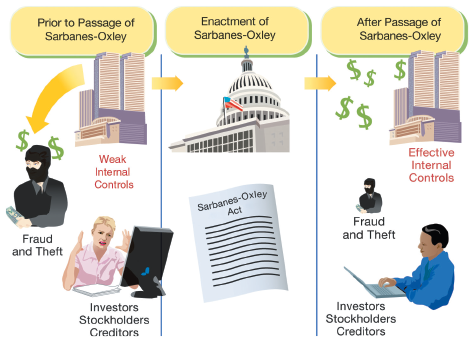
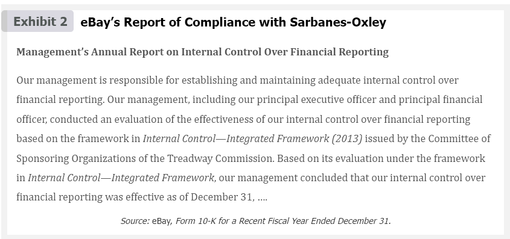
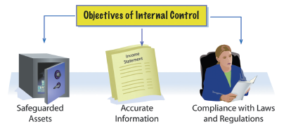

<h1 id="Chapter_007" style="color:#42A5F5;">Indice</h1>

##### [Capitulo Chapter Introduction](#697783)

##### [Capitulo 7-1 Sarbanes-Oxley Act](#628294)

##### [Capitulo 7-2 Internal Control](#639312)

##### [Capitulo 7-2a Objectives of Internal Control](#787127)

<h1 id="697783" style="color:#E65100;">
  <a href="#Chapter_007" style="color:inherit; text-decoration:none;">
    Chapter Introduction
  </a>
</h1>

<!-- 📍 IMAGEN: Chapter Introduction (coordenadas [138, 145, 855, 634]) -->

---

## eBay Inc.

Controls are a part of your everyday life. At one extreme, laws are used to limit your behavior. For example, speed limits are designed to control your driving for traffic safety. In addition, you may also use many nonlegal controls. For example, you can keep credit card receipts in order to compare your transactions to the monthly credit card statement. Comparing receipts to the monthly statement is a control designed to catch mistakes made by the credit card company. In addition, banks give you a personal identification number (PIN) as a control against unauthorized access to your cash if you lose your automated teller machine (ATM) card. Dairies use freshness dating on their milk containers as a control to prevent the purchase or sale of soured milk. As you can see, you use and encounter controls every day.

[Los controles son parte de tu vida cotidiana. En un extremo, las leyes se utilizan para limitar tu comportamiento. Por ejemplo, los límites de velocidad están diseñados para controlar tu conducción para la seguridad vial. Además, también puedes usar muchos controles no legales. Por ejemplo, puedes guardar los recibos de las tarjetas de crédito para comparar tus transacciones con el estado de cuenta mensual de la tarjeta de crédito. Comparar los recibos con el estado de cuenta mensual es un control diseñado para detectar errores cometidos por la compañía de tarjetas de crédito. Además, los bancos te dan un número de identificación personal (NIP) como control contra el acceso no autorizado a tu efectivo si pierdes tu tarjeta de cajero automático (ATM). Las lecherías utilizan fechas de frescura en sus envases de leche como un control para prevenir la compra o venta de leche agria. Como puedes ver, usas y encuentras controles todos los días.]

Just as there are many examples of controls throughout society, businesses must also implement controls to help guide the behavior of their managers, employees, and customers. For example, eBay Inc. (EBAY) maintains an Internet-based marketplace for the sale of goods and services. Using eBay's online platform, buyers and sellers can browse, buy, and sell a wide variety of items including antiques and used cars. However, in order to maintain the integrity and trust of its buyers and sellers, eBay must have controls to ensure that buyers pay for their items and sellers don't misrepresent their items or fail to deliver sales. One such control eBay uses is a feedback forum that establishes buyer and seller reputations. A prospective buyer or seller can view the member's reputation and feedback comments before completing a transaction. Dishonest or unfair trading can lead to a negative reputation and even suspension or cancellation of the member's ability to trade on eBay.

[Así como hay muchos ejemplos de controles en toda la sociedad, las empresas también deben implementar controles para ayudar a guiar el comportamiento de sus gerentes, empleados y clientes. Por ejemplo, eBay Inc. (EBAY) mantiene un mercado basado en Internet para la venta de bienes y servicios. Utilizando la plataforma en línea de eBay, los compradores y vendedores pueden navegar, comprar y vender una amplia variedad de artículos, incluyendo antigüedades y autos usados. Sin embargo, para mantener la integridad y la confianza de sus compradores y vendedores, eBay debe tener controles para asegurar que los compradores paguen por sus artículos y que los vendedores no tergiversen sus artículos o no entreguen las ventas. Uno de esos controles que utiliza eBay es un foro de comentarios que establece la reputación de compradores y vendedores. Un comprador o vendedor potencial puede ver la reputación del miembro y los comentarios de retroalimentación antes de completar una transacción. El comercio deshonesto o injusto puede llevar a una reputación negativa e incluso a la suspensión o cancelación de la capacidad del miembro para comerciar en eBay.]

This chapter discusses controls that can be included in accounting systems to provide reasonable assurance that the financial statements are reliable. Controls to discover and prevent errors to a bank account are also discussed. This chapter begins by discussing the Sarbanes-Oxley Act and its impact on controls and financial reporting.

[Este capítulo analiza los controles que pueden incluirse en los sistemas contables para proporcionar una seguridad razonable de que los estados financieros son confiables. También se analizan los controles para descubrir y prevenir errores en una cuenta bancaria. Este capítulo comienza analizando la Ley Sarbanes-Oxley y su impacto en los controles y la información financiera.]

---

## What's Covered

### Internal Control and Cash

| **Internal Controls** | **Cash Receipts and Payments** | **Bank Accounts** | **Special-Purpose Cash Funds** | **Reporting Cash** |
|------------------------|--------------------------------|-------------------|--------------------------------|--------------------|
| • Sarbanes-Oxley Act (**Obj. 1**) | • Control of Cash Receipts (**Obj. 3**) | • Bank Statement (**Obj. 4**) | • Petty Cash (**Obj. 6**) | • Balance Sheet (**Obj. 7**) |
| • Elements (**Obj. 2**) | • Control of Cash Payments (**Obj. 3**) | • Bank Reconciliation (**Obj. 5**) |  |  |
| • Limitations (**Obj. 2**) |  |  |  |  |
---

## Learning Objectives

- **Obj. 1** - Describe the Sarbanes-Oxley Act and its impact on internal controls and financial reporting.
- **Obj. 2** - Describe and illustrate the objectives and elements of internal control.
- **Obj. 3** - Describe and illustrate the application of internal controls to cash.
- **Obj. 4** - Describe the nature of a bank account and its use in controlling cash.
- **Obj. 5** - Describe and illustrate the use of a bank reconciliation in controlling cash.
- **Obj. 6** - Describe the accounting for special-purpose cash funds.
- **Obj. 7** - Describe and illustrate the reporting of cash and cash equivalents in the financial statements.

## Analysis for Decision Making

- **Obj. 8** - Describe and illustrate the use of days' cash on hand to assess a company's ability to meet its cash commitments.

---

<h1 id="628294" style="color:#E65100;">
  <a href="#Chapter_007" style="color:inherit; text-decoration:none;">
    7-1 Sarbanes-Oxley Act
  </a>
</h1>

During recent financial scandals, stockholders, creditors, and other investors lost billions of dollars. As a result, the U.S. Congress passed the Sarbanes-Oxley Act. This act is one of the most important laws affecting U.S. companies in recent history. The purpose of Sarbanes-Oxley is to maintain public confidence and trust in the financial reporting of companies.

[Durante escándalos financieros recientes, los accionistas, acreedores y otros inversionistas perdieron miles de millones de dólares. Como resultado, el Congreso de los EE.UU. aprobó la Ley Sarbanes-Oxley. Esta ley es una de las más importantes que afectan a las empresas estadounidenses en la historia reciente. El propósito de Sarbanes-Oxley es mantener la confianza pública y la confianza en la información financiera de las empresas.]

**Objective 1** - Describe the Sarbanes-Oxley Act and its impact on internal controls and financial reporting.

[**Objetivo 1** - Describir la Ley Sarbanes-Oxley y su impacto en los controles internos y la información financiera.]

Sarbanes-Oxley applies only to companies whose stock is traded on public exchanges, referred to as publicly held companies. However, Sarbanes-Oxley highlights the importance of assessing the financial controls and reporting of all companies. As a result, companies of all sizes have been influenced by Sarbanes-Oxley.

[Sarbanes-Oxley se aplica solo a empresas cuyas acciones se negocian en bolsas públicas, denominadas empresas que cotizan en bolsa. Sin embargo, Sarbanes-Oxley destaca la importancia de evaluar los controles financieros y la información de todas las empresas. Como resultado, empresas de todos los tamaños han sido influenciadas por Sarbanes-Oxley.]

Sarbanes-Oxley emphasizes the importance of effective internal control. **Internal control** (The policies and procedures used to safeguard assets, ensure accurate business information, and ensure compliance with laws and regulations.) is defined as the procedures and processes used by a company to:

[Sarbanes-Oxley enfatiza la importancia de un control interno efectivo. El **control interno** (las políticas y procedimientos utilizados para salvaguardar los activos, garantizar información comercial precisa y garantizar el cumplimiento de las leyes y regulaciones) se define como los procedimientos y procesos utilizados por una empresa para:]

1. Safeguard its assets.
2. Process information accurately.
3. Ensure compliance with laws and regulations.

[1. Salvaguardar sus activos.
2. Procesar información con precisión.
3. Asegurar el cumplimiento de las leyes y regulaciones.]

Sarbanes-Oxley requires companies to maintain effective internal controls over the recording of transactions and the preparing of financial statements. Such controls are important because they deter fraud and prevent misleading financial statements as shown in Exhibit 1.

[Sarbanes-Oxley requiere que las empresas mantengan controles internos efectivos sobre el registro de transacciones y la preparación de estados financieros. Tales controles son importantes porque disuaden el fraude y previenen estados financieros engañosos como se muestra en la Figura 1.]

---

## Exhibit 1

### Effect of Sarbanes-Oxley

[**Figura 1** - Efecto de Sarbanes-Oxley]

<!-- 📍 IMAGEN: Exhibit 1 - Effect of Sarbanes-Oxley (página 1) -->

Sarbanes-Oxley also requires companies and their independent accountants to report on the effectiveness of the company's internal controls. These reports are required to be filed with the company's annual 10-K report with the Securities and Exchange Commission. Companies are also encouraged to include these reports in their annual reports to stockholders. An example of such a report by the management of eBay is shown in Exhibit 2.

[Sarbanes-Oxley también requiere que las empresas y sus contadores independientes informen sobre la efectividad de los controles internos de la empresa. Estos informes deben presentarse con el informe anual 10-K de la empresa ante la Comisión de Valores y Bolsa (SEC). También se anima a las empresas a incluir estos informes en sus informes anuales a los accionistas. Un ejemplo de dicho informe por parte de la dirección de eBay se muestra en la Figura 2.]

---

## Exhibit 2

### eBay's Report of Compliance with Sarbanes-Oxley

[**Figura 2** - Informe de Cumplimiento de eBay con Sarbanes-Oxley]

<!-- 📍 IMAGEN: Exhibit 2 - eBay's Report of Compliance with Sarbanes-Oxley (página 2) -->

#### Management's Annual Report on Internal Control Over Financial Reporting

Our management is responsible for establishing and maintaining adequate internal control over financial reporting. Our management, including our principal executive officer and principal financial officer, conducted an evaluation of the effectiveness of our internal control over financial reporting based on the framework in *Internal Control—Integrated Framework (2013)* issued by the Committee of Sponsoring Organizations of the Treadway Commission. Based on its evaluation under the framework in *Internal Control—Integrated Framework*, our management concluded that our internal control over financial reporting was effective as of December 31, ....

*Source: eBay, Form 10-K for a Recent Fiscal Year Ended December 31.*

---

**Link to eBay:** Exhibit 2 is taken from a recent annual report (10-K) of eBay.

[**Enlace a eBay:** La Figura 2 está tomada de un informe anual reciente (10-K) de eBay.]

Exhibit 2 indicates that the evaluation of internal controls is based on *Internal Control—Integrated Framework*, which was issued by the Committee of Sponsoring Organizations (COSO) of the Treadway Commission. This framework is the standard by which companies design, analyze, and evaluate internal controls. For this reason, this framework is used as the basis for discussing internal controls.

[La Figura 2 indica que la evaluación de los controles internos se basa en el *Marco Integrado de Control Interno*, que fue emitido por el Comité de Organizaciones Patrocinadoras (COSO) de la Comisión Treadway. Este marco es el estándar mediante el cual las empresas diseñan, analizan y evalúan los controles internos. Por esta razón, este marco se utiliza como base para discutir los controles internos.]

---

<h1 id="639312" style="color:#E65100;">
  <a href="#Chapter_007" style="color:inherit; text-decoration:none;">
    7-2 Internal Control
  </a>
</h1>

*Internal Control—Integrated Framework* is the standard by which companies design, analyze, and evaluate internal control. In this section, the objectives of internal control are described, followed by a discussion of how these objectives can be achieved through the Integrated Framework's five elements of internal control.

[El *Marco Integrado de Control Interno* es el estándar mediante el cual las empresas diseñan, analizan y evalúan el control interno. En esta sección, se describen los objetivos del control interno, seguido de una discusión sobre cómo estos objetivos se pueden lograr a través de los cinco elementos del control interno del Marco Integrado.]

**Objective 2** - Describe and illustrate the objectives and elements of internal control.

[**Objetivo 2** - Describir e ilustrar los objetivos y elementos del control interno.]

---

<h1 id="787127" style="color:#E65100;">
  <a href="#Chapter_007" style="color:inherit; text-decoration:none;">
    7-2a Objectives of Internal Control
  </a>
</h1>

The objectives of internal control are to provide reasonable assurance that:

[Los objetivos del control interno son proporcionar una seguridad razonable de que:]

1. Assets are safeguarded and used for business purposes.
   [Los activos estén salvaguardados y se utilicen para fines comerciales.]

2. Business information is accurate.
   [La información comercial sea precisa.]

3. Employees and managers comply with laws and regulations.
   [Los empleados y gerentes cumplan con las leyes y regulaciones.]

These objectives are illustrated in Exhibit 3.

[Estos objetivos se ilustran en la Figura 3.]

---

## Exhibit 3

### Objectives of Internal Control

[**Figura 3** - Objetivos del Control Interno]

<!-- 📍 IMAGEN: Exhibit 3 - Objectives of Internal Control (coordenadas [126, 371, 613, 543]) -->

Internal control can safeguard assets by preventing theft, fraud, misuse, or misplacement. A serious concern of internal control is preventing employee fraud.

[El control interno puede salvaguardar los activos previniendo robos, fraudes, mal uso o extravíos. Una preocupación grave del control interno es prevenir el fraude de empleados.]

**Employee fraud** (The intentional act of deceiving an employer for personal gain.) is the intentional act of deceiving an employer for personal gain. Such fraud may range from minor overstating of a travel expense report to stealing millions of dollars. Employees stealing from a business often adjust the accounting records in order to hide their fraud. Thus, employee fraud usually affects the accuracy of business information.

[El **fraude de empleados** (el acto intencional de engañar a un empleador para beneficio personal) es el acto intencional de engañar a un empleador para beneficio personal. Tal fraude puede variar desde exagerar ligeramente un informe de gastos de viaje hasta robar millones de dólares. Los empleados que roban a una empresa a menudo ajustan los registros contables para ocultar su fraude. Por lo tanto, el fraude de empleados generalmente afecta la precisión de la información comercial.]

Accurate information is necessary to successfully operate a business. Businesses must also comply with laws, regulations, and financial reporting standards. Examples of such standards include environmental regulations, safety regulations, and generally accepted accounting principles (GAAP).

[La información precisa es necesaria para operar un negocio con éxito. Las empresas también deben cumplir con leyes, regulaciones y estándares de información financiera. Ejemplos de tales estándares incluyen regulaciones ambientales, regulaciones de seguridad y principios de contabilidad generalmente aceptados (GAAP).]

---
