<h1 id="Chapter_007" style="color:#42A5F5;">Indice</h1>

##### [Capitulo Chapter Introduction](#697783)

##### [Capitulo 7-1 Sarbanes-Oxley Act](#628294)

##### [Capitulo 7-2 Internal Control](#639312)

##### [Capitulo 7-2a Objectives of Internal Control](#787127)

##### [Capitulo 7-2b Elements of Internal Control](#404818)

##### [Capitulo 7-2c Control Environment](#540605)

##### [Capitulo 7-2d Risk Assessment](#233708)

##### [Capitulo 7-2e Control Procedures](#966089)

##### [Capitulo 7-2f Monitoring](#141292)

##### [Capitulo 7-2g Information and Communication](#233496)

##### [Capitulo 7-2h Limitations of Internal Control](#088346)

##### [Capitulo 7-3 Cash Controls over Receipts and Payments](#433833)

##### [Capitulo 7-3a Control of Cash Receipts](#162472)

##### [Capitulo 7-3b Control of Cash Payments](#675689)

##### [Capitulo 7-4 Bank Accounts](#008874)

##### [Capitulo 7-4a Bank Statement](#294977)

##### [Capitulo 7-4b Using the Bank Statement as a Control over Cash](#193437)

##### [Capitulo 7-5 Bank Reconciliation](#950588)

##### [Capitulo 7-6 Special-Purpose Cash Funds](#753201)

##### [Capitulo 7-7 Financial Statement Reporting of Cash](#783735)

<h1 id="697783" style="color:#E65100;">
  <a href="#Chapter_007" style="color:inherit; text-decoration:none;">
    Chapter Introduction
  </a>
</h1>

<!-- 📍 IMAGEN: Chapter Introduction (coordenadas [138, 145, 855, 634]) -->

---

## eBay Inc.

Controls are a part of your everyday life. At one extreme, laws are used to limit your behavior. For example, speed limits are designed to control your driving for traffic safety. In addition, you may also use many nonlegal controls. For example, you can keep credit card receipts in order to compare your transactions to the monthly credit card statement. Comparing receipts to the monthly statement is a control designed to catch mistakes made by the credit card company. In addition, banks give you a personal identification number (PIN) as a control against unauthorized access to your cash if you lose your automated teller machine (ATM) card. Dairies use freshness dating on their milk containers as a control to prevent the purchase or sale of soured milk. As you can see, you use and encounter controls every day.

[Los controles son parte de tu vida cotidiana. En un extremo, las leyes se utilizan para limitar tu comportamiento. Por ejemplo, los límites de velocidad están diseñados para controlar tu conducción para la seguridad vial. Además, también puedes usar muchos controles no legales. Por ejemplo, puedes guardar los recibos de las tarjetas de crédito para comparar tus transacciones con el estado de cuenta mensual de la tarjeta de crédito. Comparar los recibos con el estado de cuenta mensual es un control diseñado para detectar errores cometidos por la compañía de tarjetas de crédito. Además, los bancos te dan un número de identificación personal (NIP) como control contra el acceso no autorizado a tu efectivo si pierdes tu tarjeta de cajero automático (ATM). Las lecherías utilizan fechas de frescura en sus envases de leche como un control para prevenir la compra o venta de leche agria. Como puedes ver, usas y encuentras controles todos los días.]

Just as there are many examples of controls throughout society, businesses must also implement controls to help guide the behavior of their managers, employees, and customers. For example, eBay Inc. (EBAY) maintains an Internet-based marketplace for the sale of goods and services. Using eBay's online platform, buyers and sellers can browse, buy, and sell a wide variety of items including antiques and used cars. However, in order to maintain the integrity and trust of its buyers and sellers, eBay must have controls to ensure that buyers pay for their items and sellers don't misrepresent their items or fail to deliver sales. One such control eBay uses is a feedback forum that establishes buyer and seller reputations. A prospective buyer or seller can view the member's reputation and feedback comments before completing a transaction. Dishonest or unfair trading can lead to a negative reputation and even suspension or cancellation of the member's ability to trade on eBay.

[Así como hay muchos ejemplos de controles en toda la sociedad, las empresas también deben implementar controles para ayudar a guiar el comportamiento de sus gerentes, empleados y clientes. Por ejemplo, eBay Inc. (EBAY) mantiene un mercado basado en Internet para la venta de bienes y servicios. Utilizando la plataforma en línea de eBay, los compradores y vendedores pueden navegar, comprar y vender una amplia variedad de artículos, incluyendo antigüedades y autos usados. Sin embargo, para mantener la integridad y la confianza de sus compradores y vendedores, eBay debe tener controles para asegurar que los compradores paguen por sus artículos y que los vendedores no tergiversen sus artículos o no entreguen las ventas. Uno de esos controles que utiliza eBay es un foro de comentarios que establece la reputación de compradores y vendedores. Un comprador o vendedor potencial puede ver la reputación del miembro y los comentarios de retroalimentación antes de completar una transacción. El comercio deshonesto o injusto puede llevar a una reputación negativa e incluso a la suspensión o cancelación de la capacidad del miembro para comerciar en eBay.]

This chapter discusses controls that can be included in accounting systems to provide reasonable assurance that the financial statements are reliable. Controls to discover and prevent errors to a bank account are also discussed. This chapter begins by discussing the Sarbanes-Oxley Act and its impact on controls and financial reporting.

[Este capítulo analiza los controles que pueden incluirse en los sistemas contables para proporcionar una seguridad razonable de que los estados financieros son confiables. También se analizan los controles para descubrir y prevenir errores en una cuenta bancaria. Este capítulo comienza analizando la Ley Sarbanes-Oxley y su impacto en los controles y la información financiera.]

---

## What's Covered

### Internal Control and Cash

| **Internal Controls** | **Cash Receipts and Payments** | **Bank Accounts** | **Special-Purpose Cash Funds** | **Reporting Cash** |
|------------------------|--------------------------------|-------------------|--------------------------------|--------------------|
| • Sarbanes-Oxley Act (**Obj. 1**) | • Control of Cash Receipts (**Obj. 3**) | • Bank Statement (**Obj. 4**) | • Petty Cash (**Obj. 6**) | • Balance Sheet (**Obj. 7**) |
| • Elements (**Obj. 2**) | • Control of Cash Payments (**Obj. 3**) | • Bank Reconciliation (**Obj. 5**) |  |  |
| • Limitations (**Obj. 2**) |  |  |  |  |
---

## Learning Objectives

- **Obj. 1** - Describe the Sarbanes-Oxley Act and its impact on internal controls and financial reporting.
- **Obj. 2** - Describe and illustrate the objectives and elements of internal control.
- **Obj. 3** - Describe and illustrate the application of internal controls to cash.
- **Obj. 4** - Describe the nature of a bank account and its use in controlling cash.
- **Obj. 5** - Describe and illustrate the use of a bank reconciliation in controlling cash.
- **Obj. 6** - Describe the accounting for special-purpose cash funds.
- **Obj. 7** - Describe and illustrate the reporting of cash and cash equivalents in the financial statements.

## Analysis for Decision Making

- **Obj. 8** - Describe and illustrate the use of days' cash on hand to assess a company's ability to meet its cash commitments.

---

<h1 id="628294" style="color:#E65100;">
  <a href="#Chapter_007" style="color:inherit; text-decoration:none;">
    7-1 Sarbanes-Oxley Act
  </a>
</h1>

During recent financial scandals, stockholders, creditors, and other investors lost billions of dollars. As a result, the U.S. Congress passed the Sarbanes-Oxley Act. This act is one of the most important laws affecting U.S. companies in recent history. The purpose of Sarbanes-Oxley is to maintain public confidence and trust in the financial reporting of companies.

[Durante escándalos financieros recientes, los accionistas, acreedores y otros inversionistas perdieron miles de millones de dólares. Como resultado, el Congreso de los EE.UU. aprobó la Ley Sarbanes-Oxley. Esta ley es una de las más importantes que afectan a las empresas estadounidenses en la historia reciente. El propósito de Sarbanes-Oxley es mantener la confianza pública y la confianza en la información financiera de las empresas.]

**Objective 1** - Describe the Sarbanes-Oxley Act and its impact on internal controls and financial reporting.

[**Objetivo 1** - Describir la Ley Sarbanes-Oxley y su impacto en los controles internos y la información financiera.]

Sarbanes-Oxley applies only to companies whose stock is traded on public exchanges, referred to as publicly held companies. However, Sarbanes-Oxley highlights the importance of assessing the financial controls and reporting of all companies. As a result, companies of all sizes have been influenced by Sarbanes-Oxley.

[Sarbanes-Oxley se aplica solo a empresas cuyas acciones se negocian en bolsas públicas, denominadas empresas que cotizan en bolsa. Sin embargo, Sarbanes-Oxley destaca la importancia de evaluar los controles financieros y la información de todas las empresas. Como resultado, empresas de todos los tamaños han sido influenciadas por Sarbanes-Oxley.]

Sarbanes-Oxley emphasizes the importance of effective internal control. **Internal control** (The policies and procedures used to safeguard assets, ensure accurate business information, and ensure compliance with laws and regulations.) is defined as the procedures and processes used by a company to:

[Sarbanes-Oxley enfatiza la importancia de un control interno efectivo. El **control interno** (las políticas y procedimientos utilizados para salvaguardar los activos, garantizar información comercial precisa y garantizar el cumplimiento de las leyes y regulaciones) se define como los procedimientos y procesos utilizados por una empresa para:]

1. Safeguard its assets.
2. Process information accurately.
3. Ensure compliance with laws and regulations.

[1. Salvaguardar sus activos.
2. Procesar información con precisión.
3. Asegurar el cumplimiento de las leyes y regulaciones.]

Sarbanes-Oxley requires companies to maintain effective internal controls over the recording of transactions and the preparing of financial statements. Such controls are important because they deter fraud and prevent misleading financial statements as shown in Exhibit 1.

[Sarbanes-Oxley requiere que las empresas mantengan controles internos efectivos sobre el registro de transacciones y la preparación de estados financieros. Tales controles son importantes porque disuaden el fraude y previenen estados financieros engañosos como se muestra en la Figura 1.]

---

## Exhibit 1

### Effect of Sarbanes-Oxley

[**Figura 1** - Efecto de Sarbanes-Oxley]

<!-- 📍 IMAGEN: Exhibit 1 - Effect of Sarbanes-Oxley (página 1) -->

Sarbanes-Oxley also requires companies and their independent accountants to report on the effectiveness of the company's internal controls. These reports are required to be filed with the company's annual 10-K report with the Securities and Exchange Commission. Companies are also encouraged to include these reports in their annual reports to stockholders. An example of such a report by the management of eBay is shown in Exhibit 2.

[Sarbanes-Oxley también requiere que las empresas y sus contadores independientes informen sobre la efectividad de los controles internos de la empresa. Estos informes deben presentarse con el informe anual 10-K de la empresa ante la Comisión de Valores y Bolsa (SEC). También se anima a las empresas a incluir estos informes en sus informes anuales a los accionistas. Un ejemplo de dicho informe por parte de la dirección de eBay se muestra en la Figura 2.]

---

## Exhibit 2

### eBay's Report of Compliance with Sarbanes-Oxley

[**Figura 2** - Informe de Cumplimiento de eBay con Sarbanes-Oxley]

<!-- 📍 IMAGEN: Exhibit 2 - eBay's Report of Compliance with Sarbanes-Oxley (página 2) -->

#### Management's Annual Report on Internal Control Over Financial Reporting

Our management is responsible for establishing and maintaining adequate internal control over financial reporting. Our management, including our principal executive officer and principal financial officer, conducted an evaluation of the effectiveness of our internal control over financial reporting based on the framework in *Internal Control—Integrated Framework (2013)* issued by the Committee of Sponsoring Organizations of the Treadway Commission. Based on its evaluation under the framework in *Internal Control—Integrated Framework*, our management concluded that our internal control over financial reporting was effective as of December 31, ....

*Source: eBay, Form 10-K for a Recent Fiscal Year Ended December 31.*

---

**Link to eBay:** Exhibit 2 is taken from a recent annual report (10-K) of eBay.

[**Enlace a eBay:** La Figura 2 está tomada de un informe anual reciente (10-K) de eBay.]

Exhibit 2 indicates that the evaluation of internal controls is based on *Internal Control—Integrated Framework*, which was issued by the Committee of Sponsoring Organizations (COSO) of the Treadway Commission. This framework is the standard by which companies design, analyze, and evaluate internal controls. For this reason, this framework is used as the basis for discussing internal controls.

[La Figura 2 indica que la evaluación de los controles internos se basa en el *Marco Integrado de Control Interno*, que fue emitido por el Comité de Organizaciones Patrocinadoras (COSO) de la Comisión Treadway. Este marco es el estándar mediante el cual las empresas diseñan, analizan y evalúan los controles internos. Por esta razón, este marco se utiliza como base para discutir los controles internos.]

---

<h1 id="639312" style="color:#E65100;">
  <a href="#Chapter_007" style="color:inherit; text-decoration:none;">
    7-2 Internal Control
  </a>
</h1>

*Internal Control—Integrated Framework* is the standard by which companies design, analyze, and evaluate internal control. In this section, the objectives of internal control are described, followed by a discussion of how these objectives can be achieved through the Integrated Framework's five elements of internal control.

[El *Marco Integrado de Control Interno* es el estándar mediante el cual las empresas diseñan, analizan y evalúan el control interno. En esta sección, se describen los objetivos del control interno, seguido de una discusión sobre cómo estos objetivos se pueden lograr a través de los cinco elementos del control interno del Marco Integrado.]

**Objective 2** - Describe and illustrate the objectives and elements of internal control.

[**Objetivo 2** - Describir e ilustrar los objetivos y elementos del control interno.]

---

<h1 id="787127" style="color:#E65100;">
  <a href="#Chapter_007" style="color:inherit; text-decoration:none;">
    7-2a Objectives of Internal Control
  </a>
</h1>

The objectives of internal control are to provide reasonable assurance that:

[Los objetivos del control interno son proporcionar una seguridad razonable de que:]

1. Assets are safeguarded and used for business purposes.
   [Los activos estén salvaguardados y se utilicen para fines comerciales.]

2. Business information is accurate.
   [La información comercial sea precisa.]

3. Employees and managers comply with laws and regulations.
   [Los empleados y gerentes cumplan con las leyes y regulaciones.]

These objectives are illustrated in Exhibit 3.

[Estos objetivos se ilustran en la Figura 3.]

---

## Exhibit 3

### Objectives of Internal Control

[**Figura 3** - Objetivos del Control Interno]

<!-- 📍 IMAGEN: Exhibit 3 - Objectives of Internal Control (coordenadas [126, 371, 613, 543]) -->

Internal control can safeguard assets by preventing theft, fraud, misuse, or misplacement. A serious concern of internal control is preventing employee fraud.

[El control interno puede salvaguardar los activos previniendo robos, fraudes, mal uso o extravíos. Una preocupación grave del control interno es prevenir el fraude de empleados.]

**Employee fraud** (The intentional act of deceiving an employer for personal gain.) is the intentional act of deceiving an employer for personal gain. Such fraud may range from minor overstating of a travel expense report to stealing millions of dollars. Employees stealing from a business often adjust the accounting records in order to hide their fraud. Thus, employee fraud usually affects the accuracy of business information.

[El **fraude de empleados** (el acto intencional de engañar a un empleador para beneficio personal) es el acto intencional de engañar a un empleador para beneficio personal. Tal fraude puede variar desde exagerar ligeramente un informe de gastos de viaje hasta robar millones de dólares. Los empleados que roban a una empresa a menudo ajustan los registros contables para ocultar su fraude. Por lo tanto, el fraude de empleados generalmente afecta la precisión de la información comercial.]

Accurate information is necessary to successfully operate a business. Businesses must also comply with laws, regulations, and financial reporting standards. Examples of such standards include environmental regulations, safety regulations, and generally accepted accounting principles (GAAP).

[La información precisa es necesaria para operar un negocio con éxito. Las empresas también deben cumplir con leyes, regulaciones y estándares de información financiera. Ejemplos de tales estándares incluyen regulaciones ambientales, regulaciones de seguridad y principios de contabilidad generalmente aceptados (GAAP).]

---

<h1 id="404818" style="color:#E65100;">
  <a href="#Chapter_007" style="color:inherit; text-decoration:none;">
    7-2b Elements of Internal Control
  </a>
</h1>

The three internal control objectives can be achieved by applying the five elements of internal control (The elements that together sustain internal control and include the control environment, risk assessment, control activities, information and communication, and monitoring.) set forth by the Integrated Framework. These elements are as follows:

[Los tres objetivos de control interno se pueden lograr aplicando los cinco elementos del control interno (los elementos que juntos sostienen el control interno e incluyen el entorno de control, la evaluación de riesgos, las actividades de control, la información y comunicación, y la supervisión) establecidos por el Marco Integrado. Estos elementos son los siguientes:]

- Control environment  
  [Entorno de control]
- Risk assessment  
  [Evaluación de riesgos]
- Control activities  
  [Actividades de control]
- Monitoring  
  [Supervisión]
- Information and communication  
  [Información y comunicación]

---

## Business Insight

### Employee Fraud

[**Perspectiva de Negocio - Fraude de Empleados**]

The Association of Fraud Examiners estimates that organizations lose 5% of annual revenues worldwide, or more than $4 trillion, to employee fraud. Additionally, internal control weaknesses existed in approximately one-half of all fraud cases. A common cash receipts employee fraud can occur when employees accept cash payments from customers, do not record the sale, and then pocket the cash. A common cash payments employee fraud can occur when employees bill their employer for false services or personal items.

[La Asociación de Examinadores de Fraude estima que las organizaciones pierden el 5% de los ingresos anuales en todo el mundo, o más de $4 billones, por fraude de empleados. Además, existían debilidades en el control interno en aproximadamente la mitad de todos los casos de fraude. Un fraude común de empleados en los recibos de efectivo puede ocurrir cuando los empleados aceptan pagos en efectivo de los clientes, no registran la venta y luego se embolsan el efectivo. Un fraude común de empleados en los pagos de efectivo puede ocurrir cuando los empleados facturan a su empleador por servicios falsos o artículos personales.]

*Source: 2018 ACFE Report to the Nations on Occupational Fraud and Abuse, Association of Fraud Examiners.*

The elements of internal control are illustrated in Exhibit 4.

[Los elementos del control interno se ilustran en la Figura 4.]

---

## Exhibit 4

### Elements of Internal Control

[**Figura 4** - Elementos del Control Interno]

<!-- 📍 IMAGEN: Exhibit 4 - Elements of Internal Control (página 2) -->

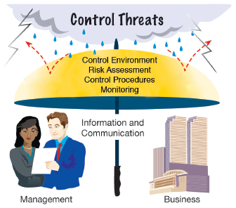

In Exhibit 4, the elements of internal control form an umbrella over the business to protect it from control threats. The control environment is the size of the umbrella. Risk assessment, control activities, and monitoring are the fabric of the umbrella, which keep it from leaking. Information and communication connect the umbrella to management and the business.

[En la Figura 4, los elementos del control interno forman un paraguas sobre el negocio para protegerlo de las amenazas de control. El entorno de control es el tamaño del paraguas. La evaluación de riesgos, las actividades de control y la supervisión son la tela del paraguas, que evita que gotee. La información y la comunicación conectan el paraguas con la administración y el negocio.]

---

**Link to eBay:** As technology changes, eBay must continually monitor and strengthen its controls over its e-commerce transactions.

[**Enlace a eBay:** A medida que la tecnología cambia, eBay debe monitorear y fortalecer continuamente sus controles sobre sus transacciones de comercio electrónico.]

---

<h1 id="540605" style="color:#E65100;">
  <a href="#Chapter_007" style="color:inherit; text-decoration:none;">
    7-2c Control Environment
  </a>
</h1>

The **control environment** (The overall attitude of management and employees about the importance of controls.) is the overall attitude of management and employees about the importance of controls. Three factors influencing a company's control environment include the following, as shown in Exhibit 5:

[El **entorno de control** (la actitud general de la administración y los empleados sobre la importancia de los controles) es la actitud general de la administración y los empleados sobre la importancia de los controles. Tres factores que influyen en el entorno de control de una empresa incluyen los siguientes, como se muestra en la Figura 5:]

- Management's philosophy and operating style  
  [Filosofía de la administración y estilo de operación]
- The company's organizational structure  
  [La estructura organizativa de la empresa]
- The company's personnel policies  
  [Las políticas de personal de la empresa]

---

## Exhibit 5

### Control Environment

[**Figura 5** - Entorno de Control]

<!-- 📍 IMAGEN: Exhibit 5 - Control Environment (página 1) -->

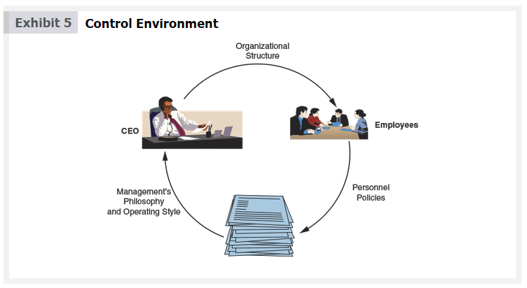

Management's philosophy and operating style relate to whether management emphasizes the importance of internal controls. An emphasis on controls and adherence to control policies creates an effective control environment. In contrast, overemphasizing operating goals and tolerating deviations from control policies creates an ineffective control environment.

[La filosofía de la administración y el estilo de operación se relacionan con si la administración enfatiza la importancia de los controles internos. Un énfasis en los controles y la adhesión a las políticas de control crea un entorno de control efectivo. En contraste, enfatizar demasiado los objetivos operativos y tolerar desviaciones de las políticas de control crea un entorno de control ineficaz.]

The business's organizational structure is the framework for planning and controlling operations. For example, a retail store chain might organize each of its stores as separate business units. Each store manager has full authority over pricing and other operating activities. In such a structure, each store manager has the responsibility for establishing an effective control environment.

[La estructura organizativa del negocio es el marco para planificar y controlar las operaciones. Por ejemplo, una cadena de tiendas minoristas podría organizar cada una de sus tiendas como unidades de negocio separadas. Cada gerente de tienda tiene plena autoridad sobre los precios y otras actividades operativas. En tal estructura, cada gerente de tienda tiene la responsabilidad de establecer un entorno de control efectivo.]

The business's personnel policies involve the hiring, training, evaluation, compensation, and promotion of employees. In addition, job descriptions, employee codes of ethics, and conflict-of-interest policies are part of the personnel policies. Such policies can enhance the internal control environment if they provide reasonable assurance that only competent, honest employees are hired and retained.

[Las políticas de personal del negocio implican la contratación, capacitación, evaluación, compensación y promoción de los empleados. Además, las descripciones de puestos, los códigos de ética de los empleados y las políticas de conflicto de intereses son parte de las políticas de personal. Tales políticas pueden mejorar el entorno de control interno si proporcionan una seguridad razonable de que solo se contratan y retienen empleados competentes y honestos.]

---

<h1 id="233708" style="color:#E65100;">
  <a href="#Chapter_007" style="color:inherit; text-decoration:none;">
    7-2d Risk Assessment
  </a>
</h1>

All businesses face risks such as changes in customer requirements, competitive threats, regulatory changes, and changes in economic factors. Management should identify such risks, analyze their significance, assess their likelihood of occurring, and take any necessary actions to minimize them.

[Todos los negocios enfrentan riesgos como cambios en los requisitos de los clientes, amenazas competitivas, cambios regulatorios y cambios en los factores económicos. La administración debe identificar tales riesgos, analizar su importancia, evaluar su probabilidad de ocurrencia y tomar las acciones necesarias para minimizarlos.]

---

<h1 id="966089" style="color:#E65100;">
  <a href="#Chapter_007" style="color:inherit; text-decoration:none;">
    7-2e Control Procedures
  </a>
</h1>

Control procedures provide reasonable assurance that business goals will be achieved, including the prevention of fraud. Control procedures, which constitute one of the most important elements of internal control, include the following as shown in Exhibit 6:

[Los procedimientos de control proporcionan una seguridad razonable de que se lograrán los objetivos comerciales, incluida la prevención del fraude. Los procedimientos de control, que constituyen uno de los elementos más importantes del control interno, incluyen los siguientes como se muestra en la Figura 6:]

- Competent personnel, rotating duties, and mandatory vacations
- Separating responsibilities for related operations
- Separating operations, custody of assets, and accounting
- Proofs and security measures

[Personal competente, rotación de funciones y vacaciones obligatorias
- Separación de responsabilidades para operaciones relacionadas
- Separación de operaciones, custodia de activos y contabilidad
- Comprobaciones y medidas de seguridad]

---

## Exhibit 6

### Internal Control Procedures

[**Figura 6** - Procedimientos de Control Interno]

<!-- 📍 IMAGEN: Exhibit 6 - Internal Control Procedures (coordenadas [91, 460, 698, 833]) -->

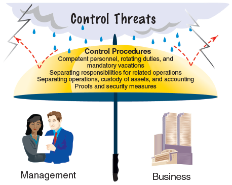

---

## Competent Personnel, Rotating Duties, and Mandatory Vacations

A successful company needs competent employees who are able to perform the duties that they are assigned. Procedures should be established for properly training and supervising employees. It is also advisable to rotate duties of accounting personnel and mandate vacations for all employees. In this way, employees are encouraged to adhere to procedures. Cases of employee fraud are often discovered when a long-term employee, who never took vacations, missed work because of an illness or another unavoidable reason.

[Una empresa exitosa necesita empleados competentes que puedan realizar las tareas que se les asignan. Se deben establecer procedimientos para capacitar y supervisar adecuadamente a los empleados. También es aconsejable rotar las funciones del personal contable y exigir vacaciones para todos los empleados. De esta manera, se anima a los empleados a cumplir con los procedimientos. Los casos de fraude de empleados a menudo se descubren cuando un empleado a largo plazo, que nunca tomaba vacaciones, faltaba al trabajo debido a una enfermedad u otra razón inevitable.]

---

## Separating Responsibilities for Related Operations

The responsibility for related operations should be divided among two or more people. This decreases the possibility of errors and fraud. For example, if the same person orders supplies, verifies the receipt of the supplies, and pays the supplier, the following abuses may occur:

[La responsabilidad de las operaciones relacionadas debe dividirse entre dos o más personas. Esto disminuye la posibilidad de errores y fraudes. Por ejemplo, si la misma persona pide suministros, verifica la recepción de los suministros y paga al proveedor, pueden ocurrir los siguientes abusos:]

- Orders may be placed on the basis of friendship with a supplier, rather than on price, quality, and other objective factors.
- The quantity and quality of supplies received may not be verified; thus, the company may pay for supplies not received or that are of poor quality.
- Supplies may be stolen by the employee.
- The validity and accuracy of invoices may not be verified; hence, the company may pay false or inaccurate invoices.

[Los pedidos pueden realizarse en función de la amistad con un proveedor, en lugar del precio, la calidad y otros factores objetivos.
- Es posible que no se verifique la cantidad y calidad de los suministros recibidos; por lo tanto, la empresa puede pagar por suministros no recibidos o de mala calidad.
- Los suministros pueden ser robados por el empleado.
- Es posible que no se verifique la validez y precisión de las facturas; por lo tanto, la empresa puede pagar facturas falsas o inexactas.]

For the preceding reasons, the responsibilities for purchasing, receiving, and paying for supplies should be divided among three persons or departments.

[Por las razones anteriores, las responsabilidades de comprar, recibir y pagar los suministros deben dividirse entre tres personas o departamentos.]

---

## Separating Operations, Custody of Assets, and Accounting

The responsibilities for operations, custody of assets, and accounting should be separated. In this way, the accounting records serve as an independent check on the operating managers and the employees who have custody of assets.

[Las responsabilidades de las operaciones, la custodia de los activos y la contabilidad deben separarse. De esta manera, los registros contables sirven como un control independiente de los gerentes de operaciones y los empleados que tienen la custodia de los activos.]

To illustrate, employees who handle cash receipts should not record cash receipts in the accounting records. To do so would allow employees to borrow or steal cash and hide the theft in the accounting records. Likewise, operating managers should not also record the results of operations. To do so would allow the managers to distort the accounting reports to show favorable results, which might allow them to receive larger bonuses.

[Para ilustrar, los empleados que manejan los recibos de efectivo no deben registrar los recibos de efectivo en los registros contables. Hacerlo permitiría a los empleados tomar prestado o robar efectivo y ocultar el robo en los registros contables. Del mismo modo, los gerentes de operaciones no deberían registrar los resultados de las operaciones. Hacerlo permitiría a los gerentes distorsionar los informes contables para mostrar resultados favorables, lo que podría permitirles recibir bonificaciones más grandes.]

---

## Proofs and Security Measures

Proofs and security measures are used to safeguard assets and ensure reliable accounting data. Proofs involve procedures such as authorization, approval, and reconciliation. For example, an employee planning to travel on company business may be required to complete a "travel request" form for a manager's authorization and approval.

[Las comprobaciones y medidas de seguridad se utilizan para salvaguardar los activos y garantizar datos contables confiables. Las comprobaciones implican procedimientos como autorización, aprobación y conciliación. Por ejemplo, se puede exigir a un empleado que planee viajar por negocios de la empresa que complete un formulario de "solicitud de viaje" para la autorización y aprobación de un gerente.]

Documents used for authorization and approval should be prenumbered, accounted for, and safeguarded. Prenumbering of documents helps prevent transactions from being recorded more than once or not at all. In addition, accounting for and safeguarding prenumbered documents helps prevent fraudulent transactions from being recorded. For example, blank checks are prenumbered and safeguarded. Once a payment has been properly authorized and approved, the checks are filled out and issued.

[Los documentos utilizados para la autorización y aprobación deben ser prenumerados, contabilizados y salvaguardados. La prenumeración de documentos ayuda a evitar que las transacciones se registren más de una vez o que no se registren en absoluto. Además, contabilizar y salvaguardar los documentos prenumerados ayuda a prevenir el registro de transacciones fraudulentas. Por ejemplo, los cheques en blanco están prenumerados y salvaguardados. Una vez que un pago ha sido debidamente autorizado y aprobado, los cheques se completan y emiten.]

Reconciliations are also an important control. Later in this chapter, the use of bank reconciliations as an aid in controlling cash is described and illustrated.

[Las conciliaciones también son un control importante. Más adelante en este capítulo, se describe e ilustra el uso de las conciliaciones bancarias como una ayuda para controlar el efectivo.]

---

## Ethics in Action

### Tips on Preventing Employee Fraud in Small Companies

- Have at least two people handle bookkeeping functions, such as receivables, processing client payments, paying invoices, and managing petty cash.
- Restrict access to financial accounting data, and perform frequent reviews of financial data.
- Perform background checks for all staff handling cash or managing payments from customers.
- Require staff to take vacations. They may be afraid that a replacement will uncover fraud.
- Review online bank statements. Be on the lookout for out-of-order checks, unusual payments, and checks signed over to a third party instead of deposited in the business account.
- Require two signees for expense reimbursements, overtime, and check-writing.
- Routinely review the management of cash, refunds, product returns, and inventory.
- Protect credit card information and use secure, online bill payment services.
- Establish a code of ethics and train your employees to detect, prevent, and report fraud.
- Establish an anonymous fraud reporting process. Review every case, regardless of size, to reinforce a "no tolerance" business policy.  

## [Ética en Acción]
### [Consejos para Prevenir el Fraude de Empleados en Pequeñas Empresas]
- Que al menos dos personas manejen las funciones de contabilidad, como cuentas por cobrar, procesamiento de pagos de clientes, pago de facturas y gestión de caja menor.
- Restringir el acceso a los datos contables financieros y realizar revisiones frecuentes de los datos financieros.
- Realizar verificaciones de antecedentes para todo el personal que maneje efectivo o gestione pagos de clientes.
- Exigir al personal que tome vacaciones. Pueden temer que un reemplazo descubra un fraude.
- Revisar los estados de cuenta bancarios en línea. Esté atento a cheques fuera de orden, pagos inusuales y cheques firmados a un tercero en lugar de depositados en la cuenta comercial.
- Exigir dos firmas para reembolsos de gastos, horas extras y emisión de cheques.
- Revisar periódicamente la gestión del efectivo, reembolsos, devoluciones de productos e inventario.
- Proteger la información de las tarjetas de crédito y utilizar servicios de pago de facturas en línea seguros.
- Establecer un código de ética y capacitar a sus empleados para detectar, prevenir y denunciar fraudes.
- Establecer un proceso anónimo de denuncia de fraudes. Revisar cada caso, independientemente de su tamaño, para reforzar una política comercial de "tolerancia cero".]

---

## Security Measures

Security measures involve measures to safeguard assets. For example, cash on hand should be kept in a cash register or safe. Inventory not on display should be stored in a locked storeroom or warehouse. Accounting records such as the accounts receivable subsidiary ledger should also be safeguarded to prevent their loss. For example, electronically maintained accounting records should be safeguarded with access codes and backed up so that any lost or damaged files could be recovered if necessary.

[Las medidas de seguridad implican medidas para salvaguardar los activos. Por ejemplo, el efectivo disponible debe mantenerse en una caja registradora o caja fuerte. El inventario que no está en exhibición debe almacenarse en un depósito o almacén cerrado con llave. Los registros contables, como el libro mayor auxiliar de cuentas por cobrar, también deben protegerse para evitar su pérdida. Por ejemplo, los registros contables mantenidos electrónicamente deben protegerse con códigos de acceso y respaldarse para que cualquier archivo perdido o dañado pueda recuperarse si es necesario.]

---

<h1 id="141292" style="color:#E65100;">
  <a href="#Chapter_007" style="color:inherit; text-decoration:none;">
    7-2f Monitoring
  </a>
</h1>

Monitoring the internal control system is used to locate weaknesses and improve controls. Monitoring often includes observing employee behavior and the accounting system for indicators of control problems. Some such indicators are shown in Exhibit 7.

[La supervisión del sistema de control interno se utiliza para localizar debilidades y mejorar los controles. La supervisión a menudo incluye observar el comportamiento de los empleados y el sistema contable en busca de indicadores de problemas de control. Algunos de estos indicadores se muestran en la Figura 7.]

---

## Exhibit 7

### Warning Signs of Internal Control Problems

[**Figura 7** - Señales de Advertencia de Problemas de Control Interno]

<!-- 📍 IMAGEN: Exhibit 7 - Warning Signs of Internal Control Problems (coordenadas [174, 296, 376, 401] y [625, 296, 808, 401]) -->

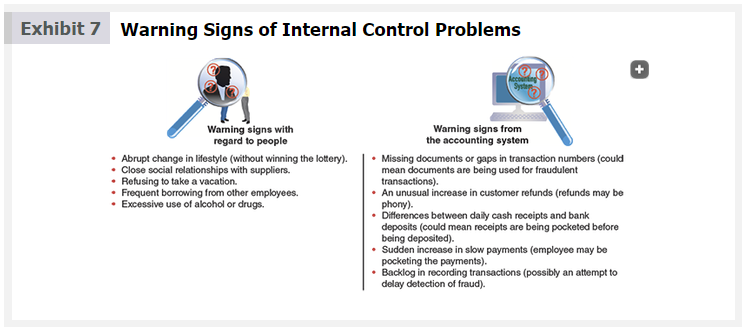

| Employee Behavior | Accounting System |
|---|---|
| Abrupt change in lifestyle (without winning the lottery). | Missing documents or gaps in transaction numbers (could mean documents are being used for fraudulent transactions). |
| Close social relationships with suppliers. | An unusual increase in customer refunds (refunds may be phony). |
| Refusing to take a vacation. | Differences between daily cash receipts and bank deposits (could mean receipts are being pocketed before being deposited). |
| Frequent borrowing from other employees. | Sudden increase in slow payments (employee may be pocketing the payments). |
| Excessive use of alcohol or drugs. | Backlog in recording transactions (possibly an attempt to delay detection of fraud). |

---

Evaluations of controls are often performed when there are major changes in strategy, senior management, business structure, or operations. Internal auditors, who are independent of operations, usually perform such evaluations. Internal auditors are also responsible for day-to-day monitoring of controls. External auditors also evaluate and report on internal control as part of their annual financial statement audit.

[Las evaluaciones de los controles a menudo se realizan cuando hay cambios importantes en la estrategia, la alta dirección, la estructura comercial o las operaciones. Los auditores internos, que son independientes de las operaciones, suelen realizar dichas evaluaciones. Los auditores internos también son responsables de la supervisión diaria de los controles. Los auditores externos también evalúan e informan sobre el control interno como parte de su auditoría anual de los estados financieros.]

---

**Link to eBay:** eBay reduces fraudulent activities by restricting or suspending buyers and sellers with questionable transaction histories.

[**Enlace a eBay:** eBay reduce las actividades fraudulentas restringiendo o suspendiendo a compradores y vendedores con historiales de transacciones cuestionables.]

---

<h1 id="233496" style="color:#E65100;">
  <a href="#Chapter_007" style="color:inherit; text-decoration:none;">
    7-2g Information and Communication
  </a>
</h1>

Information and communication is an essential element of internal control. Information about the control environment, risk assessment, control procedures, and monitoring is used by management for guiding operations and ensuring compliance with reporting, legal, and regulatory requirements. Management also uses external information to assess events and conditions that impact decision making and external reporting. For example, management uses pronouncements of the Financial Accounting Standards Board (FASB) to assess the impact of changes in reporting standards on the financial statements.

[La información y la comunicación son un elemento esencial del control interno. La información sobre el entorno de control, la evaluación de riesgos, los procedimientos de control y la supervisión es utilizada por la administración para guiar las operaciones y asegurar el cumplimiento de los requisitos de informes, legales y regulatorios. La administración también utiliza información externa para evaluar eventos y condiciones que impactan la toma de decisiones y la información externa. Por ejemplo, la administración utiliza los pronunciamientos del Consejo de Normas de Contabilidad Financiera (FASB) para evaluar el impacto de los cambios en las normas de información en los estados financieros.]

---

## Check Up Corner 7-1

### Internal Controls

[**Esquina de Verificación 7-1 - Controles Internos**]

Identify the control procedure violated in each of the following scenarios:

[Identifique el procedimiento de control violado en cada uno de los siguientes escenarios:]

- **a.** Todd Leone is the accounting clerk for Home Chic, a small boutique retail store that is owned and operated by Al Dente. Al does not care much for the accounting side of the business and allows Todd to make all payments to the company's suppliers. Todd pays all invoices that Home Chic receives. Al does not review the payments Todd makes.  
  [**a.** Todd Leone es el auxiliar de contabilidad de Home Chic, una pequeña tienda minorista boutique que es propiedad y está operada por Al Dente. A Al no le importa mucho la parte contable del negocio y permite que Todd realice todos los pagos a los proveedores de la empresa. Todd paga todas las facturas que Home Chic recibe. Al no revisa los pagos que Todd realiza.]

- **b.** Jose Muldoon's Mobile Foods is a food truck with two trusted employees. One employee stocks the food truck each day, prepares the orders, and cleans up the kitchen at the end of the day. The other employee takes orders, collects payment from customers, counts the cash at the end of the day, records the cash receipts, and deposits the cash in the night depository slot at the bank.  
  [**b.** Jose Muldoon's Mobile Foods es un camión de comida con dos empleados de confianza. Un empleado abastece el camión de comida cada día, prepara los pedidos y limpia la cocina al final del día. El otro empleado toma los pedidos, cobra el pago de los clientes, cuenta el efectivo al final del día, registra los recibos de efectivo y deposita el efectivo en la ranura del depósito nocturno del banco.]

- **c.** Tad is the treasurer and chief financial officer of a local bank in Wisteria, California. Tad was born and raised in the community and has never had a desire to travel. As a result, he has not taken a vacation or a day off of work in over six years.  
  [**c.** Tad es el tesorero y director financiero de un banco local en Wisteria, California. Tad nació y se crió en la comunidad y nunca ha tenido el deseo de viajar. Como resultado, no ha tomado vacaciones ni un día libre del trabajo en más de seis años.]

---

### Solution - Check Up Corner 7-1

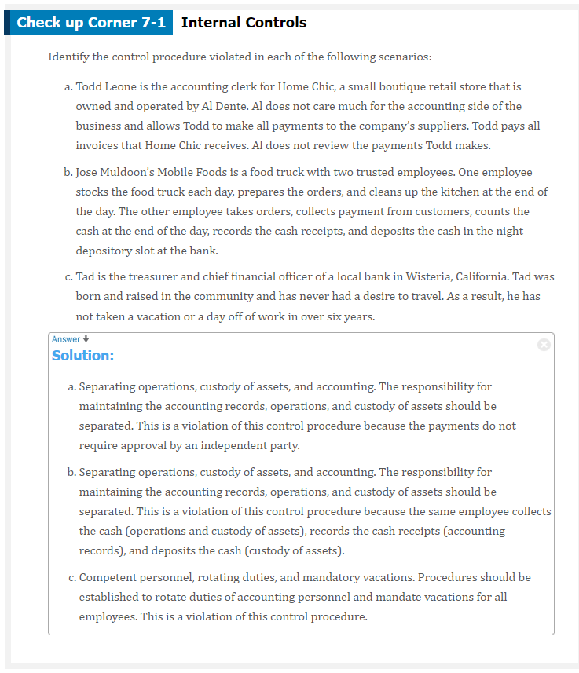</img>

[**Solución - Esquina de Verificación 7-1**]

| Scenario | Control Procedure Violated |
|---|---|
| **a.** | Separating responsibilities for related operations (the same person purchases and pays for supplies) |
| **b.** | Separating operations, custody of assets, and accounting (the same person collects, records, and deposits cash) |
| **c.** | Competent personnel, rotating duties, and mandatory vacations (no vacations or job rotation) |

---

<h1 id="088346" style="color:#E65100;">
  <a href="#Chapter_007" style="color:inherit; text-decoration:none;">
    7-2h Limitations of Internal Control
  </a>
</h1>

Internal control systems can provide only reasonable assurance for safeguarding assets, processing accurate information, and compliance with laws and regulations. In other words, internal controls are not a guarantee. This is due to the following factors:

[Los sistemas de control interno pueden proporcionar solo una seguridad razonable para salvaguardar los activos, procesar información precisa y cumplir con las leyes y regulaciones. En otras palabras, los controles internos no son una garantía. Esto se debe a los siguientes factores:]

- The human element of controls  
  [El elemento humano de los controles]
- Cost-benefit considerations  
  [Consideraciones de costo-beneficio]

The human element recognizes that controls are applied and used by humans. As a result, human errors can occur because of fatigue, carelessness, confusion, or misjudgment. For example, an employee may unintentionally shortchange a customer or miscount the amount of inventory received from a supplier. In addition, two or more employees may collude together to defeat or circumvent internal controls. This latter case often involves fraud and the theft of assets. For example, the cashier and the accounts receivable clerk might collude to steal customer payments on account.

[El elemento humano reconoce que los controles son aplicados y utilizados por humanos. Como resultado, pueden ocurrir errores humanos debido a fatiga, descuido, confusión o mal juicio. Por ejemplo, un empleado puede dar mal el cambio a un cliente sin intención o contar mal la cantidad de inventario recibido de un proveedor. Además, dos o más empleados pueden coludirse para eludir o evadir los controles internos. Este último caso a menudo implica fraude y robo de activos. Por ejemplo, el cajero y el auxiliar de cuentas por cobrar podrían coludirse para robar los pagos de los clientes a cuenta.]

Cost-benefit considerations recognize that the cost of internal controls should not exceed their benefits. For example, retail stores could eliminate shoplifting by searching all customers before they leave the store. However, such a control procedure would upset customers and result in lost sales. Instead, retailers use cameras or signs saying, "We prosecute all shoplifters."

[Las consideraciones de costo-beneficio reconocen que el costo de los controles internos no debe exceder sus beneficios. Por ejemplo, las tiendas minoristas podrían eliminar el robo en tiendas registrando a todos los clientes antes de que salgan de la tienda. Sin embargo, tal procedimiento de control molestaría a los clientes y resultaría en pérdida de ventas. En su lugar, los minoristas utilizan cámaras o letreros que dicen: "Procesamos a todos los ladrones de tiendas".]

---

**Link to eBay:** The auditor's report for eBay includes the statement: "... internal control over financial reporting is a process designed to provide reasonable assurance regarding the reliability of financial reporting ..."

[**Enlace a eBay:** El informe del auditor para eBay incluye la declaración: "... el control interno sobre la información financiera es un proceso diseñado para proporcionar una seguridad razonable sobre la confiabilidad de la información financiera ..."]

---

## Using Data Analytics

### Evaluating Internal Controls

[**Uso de Analítica de Datos - Evaluación de Controles Internos**]

Loss of inventory from shoplifting is a major concern for large retail chains such as Walmart Stores, Inc. (WMT) and Target Corporation (TGT). The National Association for Shoplifting Prevention (NASP) estimates that stores lose more than $45 million a day to shoplifting.

[La pérdida de inventario por robo en tiendas es una preocupación importante para las grandes cadenas minoristas como Walmart Stores, Inc. (WMT) y Target Corporation (TGT). La Asociación Nacional para la Prevención del Robo en Tiendas (NASP) estima que las tiendas pierden más de $45 millones al día por robo en tiendas.]

1. Place rounded mirrors throughout stores to better enable employees to detect shoplifters.
2. Install electronic tags on high-value items that must be removed before exiting the store.
3. Put up signs indicating the store's willingness to prosecute shoplifters.
4. Hire a person to check bags and receipts of all customers exiting the store.
5. Hire a greeter to monitor customers bringing bags or other items that can be used to hide shoplifted items.
6. Install security cameras throughout stores.
7. Place high-value items in locked cases.
8. Monitor dressing rooms closely.

---

1. Colocar espejos redondeados en las tiendas para permitir que los empleados detecten mejor a los ladrones.
2. Instalar etiquetas electrónicas en artículos de alto valor que deben retirarse antes de salir de la tienda.
3. Colocar letreros que indiquen la disposición de la tienda a procesar a los ladrones.
4. Contratar a una persona para revisar las bolsas y los recibos de todos los clientes que salen de la tienda.
5. Contratar a un recepcionista para monitorear a los clientes que traen bolsas u otros artículos que puedan utilizarse para ocultar productos robados.
6. Instalar cámaras de seguridad en todas las tiendas.
7. Colocar artículos de alto valor en vitrinas cerradas con llave.
8. Vigilar de cerca los probadores.

Before implementing a control, retailers should carefully consider the cost of the control and whether the cost exceeds its potential benefit. For example, the cost of putting up signs and mirrors is low compared to the cost of installing security cameras, using electronic tags, or hiring greeters. Data analytics can be used by large retail chains such as Walmart and Target to monitor shoplifting and to assess the cost-benefit of various shoplifting controls across their stores.

[Antes de implementar un control, los minoristas deben considerar cuidadosamente el costo del control y si el costo excede su beneficio potencial. Por ejemplo, el costo de colocar letreros y espejos es bajo en comparación con el costo de instalar cámaras de seguridad, usar etiquetas electrónicas o contratar recepcionistas. Las grandes cadenas minoristas como Walmart y Target pueden utilizar la analítica de datos para monitorear el robo en tiendas y evaluar el costo-beneficio de varios controles de robo en tiendas en sus establecimientos.]

*See TIF 7-6 for a homework assignment using data analytics.*

[*Vea TIF 7-6 para una tarea que utiliza analítica de datos.*]

*Source: www.shopliftingprevention.org/the-shoplifting-problem/*

---

<h1 id="433833" style="color:#E65100;">
  <a href="#Chapter_007" style="color:inherit; text-decoration:none;">
    7-3 Cash Controls over Receipts and Payments
  </a>
</h1>

**Objective 3** - Describe and illustrate the application of internal controls to cash.

[**Objetivo 3** - Describir e ilustrar la aplicación de los controles internos al efectivo.]

**Cash** (Coins, currency (paper money), checks, money orders, and money on deposit that is available for unrestricted withdrawal from banks and other financial institutions.) includes coins, currency (paper money), checks, and money orders. Money on deposit with a bank or other financial institution that is available for withdrawal is also considered cash. Normally, you can think of cash as anything that a bank would accept for deposit in your account. For example, a check made payable to you could normally be deposited in a bank and, thus, is considered cash.

[El **efectivo** (monedas, moneda (papel moneda), cheques, giros postales y dinero en depósito que está disponible para retiro sin restricciones de bancos y otras instituciones financieras) incluye monedas, moneda (papel moneda), cheques y giros postales. El dinero en depósito en un banco u otra institución financiera que está disponible para retiro también se considera efectivo. Normalmente, se puede pensar en el efectivo como cualquier cosa que un banco aceptaría para depósito en su cuenta. Por ejemplo, un cheque a su nombre normalmente podría depositarse en un banco y, por lo tanto, se considera efectivo.]

Businesses usually have several bank accounts. For example, a business might have one bank account for general cash payments and another for payroll. A separate ledger account is normally used for each bank account. For example, a bank account at City Bank could be identified in the ledger as Cash in Bank—City Bank. To simplify, this chapter assumes that a company has only one bank account, which is identified in the ledger as Cash.

[Las empresas suelen tener varias cuentas bancarias. Por ejemplo, una empresa puede tener una cuenta bancaria para pagos generales en efectivo y otra para la nómina. Normalmente se utiliza una cuenta de libro mayor separada para cada cuenta bancaria. Por ejemplo, una cuenta bancaria en City Bank podría identificarse en el libro mayor como Efectivo en Banco—City Bank. Para simplificar, este capítulo asume que una empresa tiene solo una cuenta bancaria, que se identifica en el libro mayor como Efectivo.]

Cash is the asset most likely to be stolen or used improperly in a business. For this reason, businesses must carefully control cash and cash transactions.

[El efectivo es el activo más probable de ser robado o utilizado incorrectamente en un negocio. Por esta razón, las empresas deben controlar cuidadosamente el efectivo y las transacciones en efectivo.]

---

<h1 id="162472" style="color:#E65100;">
  <a href="#Chapter_007" style="color:inherit; text-decoration:none;">
    7-3a Control of Cash Receipts
  </a>
</h1>

To protect cash from theft and misuse, a business must control cash from the time it is received until it is deposited in a bank. Businesses normally receive cash from two main sources.

[Para proteger el efectivo de robos y mal uso, una empresa debe controlar el efectivo desde el momento en que se recibe hasta que se deposita en un banco. Las empresas normalmente reciben efectivo de dos fuentes principales.]

- Customers purchasing products or services  
  [Clientes que compran productos o servicios]

- Customers making payments on account  
  [Clientes que realizan pagos a cuenta]

---

## Cash Received from Cash Sales

An important control to protect cash received in over-the-counter sales is a cash register. The use of a cash register to control cash is shown in Exhibit 8.

[Un control importante para proteger el efectivo recibido en ventas al mostrador es una caja registradora. El uso de una caja registradora para controlar el efectivo se muestra en la Figura 8.]

---

## Exhibit 8

### Cash Register as a Control

[**Figura 8** - Caja Registradora como Control]

<!-- 📍 IMAGEN: Exhibit 8 - Cash Register as a Control (página 1) -->

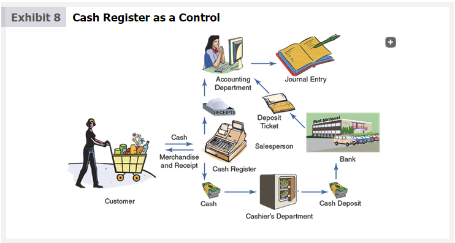

1. At the beginning of every work shift, each cash register clerk is given a cash drawer containing a predetermined amount of cash. This amount is used for making change for customers and is sometimes called a change fund.  
[Al comienzo de cada turno de trabajo, a cada cajero de caja registradora se le entrega un cajón de efectivo que contiene una cantidad predeterminada de efectivo. Esta cantidad se utiliza para dar cambio a los clientes y a veces se llama fondo de cambio.]

2. When a salesperson enters the amount of a sale, the cash register displays the amount to the customer. This allows the customer to verify that the clerk has charged the correct amount. The customer also receives a cash receipt.  
[Cuando un vendedor ingresa el monto de una venta, la caja registradora muestra el monto al cliente. Esto permite al cliente verificar que el empleado ha cobrado el monto correcto. El cliente también recibe un recibo de efectivo.]

3. At the end of the shift, the clerk and the supervisor count the cash in the clerk's cash drawer. The amount of cash in each drawer should equal the beginning amount of cash plus the cash sales for the day.  
[Al final del turno, el empleado y el supervisor cuentan el efectivo en el cajón de efectivo del empleado. La cantidad de efectivo en cada cajón debe ser igual a la cantidad inicial de efectivo más las ventas en efectivo del día.]

4. The supervisor takes the cash to the Cashier's Department where it is placed in a safe.  
[El supervisor lleva el efectivo al Departamento de Caja donde se coloca en una caja fuerte.]

5. The supervisor forwards the clerk's cash register receipts to the Accounting Department.  
[El supervisor envía los recibos de la caja registradora del empleado al Departamento de Contabilidad.]

6. The cashier prepares a bank deposit ticket.  
[El cajero prepara un comprobante de depósito bancario.]

7. The cashier deposits the cash in the bank, or the cash is picked up by an armored car service, such as The Brink's Company (BCO).  
[El cajero deposita el efectivo en el banco, o el efectivo es recogido por un servicio de vehículo blindado, como The Brink's Company (BCO).]

8. The Accounting Department summarizes the cash receipts and records the day's cash sales.  
[El Departamento de Contabilidad resume los recibos de efectivo y registra las ventas en efectivo del día.]

9. When cash is deposited in the bank, the bank normally stamps a duplicate copy of the deposit ticket with the amount received. This bank receipt is returned to the Accounting Department, where it is compared to the total amount that should have been deposited. This control helps ensure that all the cash is deposited and that no cash is lost or stolen on the way to the bank. Any shortages are thus promptly detected.  
[Cuando se deposita efectivo en el banco, el banco normalmente sella una copia duplicada del comprobante de depósito con el monto recibido. Este recibo bancario se devuelve al Departamento de Contabilidad, donde se compara con el monto total que debería haberse depositado. Este control ayuda a garantizar que todo el efectivo se deposite y que no se pierda ni sea robado en el camino al banco. Cualquier faltante se detecta de inmediato.]

Salespersons may make errors in making change for customers or in ringing up cash sales. As a result, the amount of cash on hand may differ from the amount of cash sales. Such differences are recorded in a **cash short and over account** (An account in which are recorded errors in cash sales or errors in making change causing the amount of actual cash on hand to differ from the beginning amount of cash plus the cash sales for the day.)

[Los vendedores pueden cometer errores al dar cambio a los clientes o al registrar las ventas en efectivo. Como resultado, la cantidad de efectivo disponible puede diferir de la cantidad de ventas en efectivo. Tales diferencias se registran en una **cuenta de faltante y sobrante de efectivo** (una cuenta en la que se registran errores en las ventas en efectivo o errores al dar cambio que hacen que la cantidad de efectivo real disponible difiera de la cantidad inicial de efectivo más las ventas en efectivo del día).]

To illustrate, assume the following cash register data for May 3:

[Para ilustrar, suponga los siguientes datos de la caja registradora para el 3 de mayo:]

| Cash register total for cash sales | $35,690 |
|---|---|
| Cash receipts from cash sales | 35,668 |
| **Cash shortage** | **$22** |

The cash sales, receipts, and shortage of $22 ($35,690 – $35,668) would be journalized as follows:

[Las ventas en efectivo, los recibos y el faltante de $22 ($35,690 – $35,668) se registrarían en el diario de la siguiente manera:]

| Date | Account | Debit | Credit |
|------|---------|-------|--------|
| May 3 | Cash | 35,668 | |
| | Cash Short and Over | 22 | |
| | Sales | | 35,690 |
| | *Record cash sales and shortage.* | | |

<table><tbody>
  <tr>
    <td colspan="2">Assets</td>
    <td>=</td>
    <td colspan="2">Liabilities</td>
    <td>+</td>
    <td colspan="4">Stockholders'Equity</td>
  </tr>
  <tr>
    <td colspan="2">cash</td>
    <td rowspan="3"></td>
    <td colspan="2"></td>
    <td rowspan="3"></td>
    <td colspan="2">Sales(Revenue)</td>
    <td colspan="2">Cash Short and Over</td>
  </tr>
  <tr>
    <td>Debit</td>
    <td>Credit</td>
    <td>Debit</td>
    <td>Credit</td>
    <td>Debit</td>
    <td>Credit</td>
    <td>Debit</td>
    <td>Credit</td>
  </tr>
  <tr>
    <td>35,668</td>
    <td></td>
    <td></td>
    <td></td>
    <td></td>
    <td>35,690</td>
    <td>22</td>
    <td></td>
  </tr>
</tbody>
</table>

If there had been cash over, Cash Short and Over would have been credited for the overage. At the end of the accounting period, a debit balance in Cash Short and Over is included in miscellaneous expenses on the income statement. A credit balance is included in the "Other revenue" section. If a salesperson consistently has large cash short and over amounts, the supervisor may require the clerk to take additional training.

[Si hubiera habido sobrante de efectivo, Faltante y Sobrante de Efectivo se habría acreditado por el sobrante. Al final del período contable, un saldo deudor en Faltante y Sobrante de Efectivo se incluye en los gastos diversos en el estado de resultados. Un saldo acreedor se incluye en la sección de "Otros ingresos". Si un vendedor tiene constantemente grandes cantidades de faltantes y sobrantes de efectivo, el supervisor puede exigir que el empleado reciba capacitación adicional.]

---

## Cash Received in the Mail

Cash is received in the mail when customers pay their bills. This cash is usually in the form of checks and money orders. Most companies design their invoices so that customers return a portion of the invoice, called a remittance advice, with their payment. Remittance advices may be used to control cash received in the mail as follows:

[El efectivo se recibe por correo cuando los clientes pagan sus facturas. Este efectivo suele ser en forma de cheques y giros postales. La mayoría de las empresas diseñan sus facturas para que los clientes devuelvan una parte de la factura, llamada aviso de remesa, con su pago. Los avisos de remesa pueden utilizarse para controlar el efectivo recibido por correo de la siguiente manera:]
1. An employee opens the incoming mail and compares the amount of cash received with the amount shown on the remittance advice. If a customer does not return a remittance advice, the employee prepares one. The remittance advice serves as a:  
[1. Un empleado abre el correo entrante y compara la cantidad de efectivo recibido con la cantidad que aparece en el aviso de remesa. Si un cliente no devuelve un aviso de remesa, el empleado prepara uno. El aviso de remesa sirve como:]

2. The employee opening the mail stamps checks and money orders "For Deposit Only" in the bank account of the business.  
[2. El empleado que abre el correo estampa los cheques y giros postales con "Solo para Depósito" en la cuenta bancaria de la empresa.]

3. The remittance advices and their summary totals are delivered to the Accounting Department.  
[3. Los avisos de remesa y sus totales resumidos se entregan al Departamento de Contabilidad.]

4. All cash and money orders are delivered to the Cashier's Department.  
[4. Todo el efectivo y los giros postales se entregan al Departamento de Caja.]

5. The cashier prepares a bank deposit ticket.  
[5. El cajero prepara un comprobante de depósito bancario.]

6. The cashier deposits the cash in the bank, or the cash is picked up by an armored car service, such as Garda World Security Corporation (GW).  
[6. El cajero deposita el efectivo en el banco, o el efectivo es recogido por un servicio de carro blindado, como Garda World Security Corporation (GW).]

7. An accounting clerk records the cash received and posts the amounts to the customer accounts.  
[7. Un auxiliar de contabilidad registra el efectivo recibido y registra los montos en las cuentas de los clientes.]

8. When cash is deposited in the bank, the bank normally stamps a duplicate copy of the deposit ticket with the amount received. This bank receipt is returned to the Accounting Department, where it is compared to the total amount that should have been deposited. This control helps ensure that all cash is deposited and that no cash is lost or stolen on the way to the bank. Any shortages are thus promptly detected.  
[8. Cuando se deposita efectivo en el banco, el banco normalmente sella una copia duplicada del comprobante de depósito con el monto recibido. Este recibo bancario se devuelve al Departamento de Contabilidad, donde se compara con el monto total que debería haberse depositado. Este control ayuda a garantizar que todo el efectivo se deposite y que no se pierda ni sea robado en el camino al banco. Cualquier faltante se detecta de inmediato.]

Separating the duties of the Cashier's Department, which handles cash, and the Accounting Department, which records cash, is a control. If Accounting Department employees both handle and record cash, an employee could steal cash and change the accounting records to hide the theft.

[Separar las funciones del Departamento de Caja, que maneja el efectivo, y del Departamento de Contabilidad, que registra el efectivo, es un control. Si los empleados del Departamento de Contabilidad manejan y registran el efectivo, un empleado podría robar efectivo y cambiar los registros contables para ocultar el robo.]

---

## Cash Received by EFT

Cash may also be received from customers through electronic funds transfer (EFT) (A system in which computers rather than paper (money, checks, etc.) are used to effect cash transactions.). For example, customers may authorize automatic electronic transfers from their checking accounts to pay monthly bills for such items as cell phone, Internet, and electric services. In such cases, the company sends the customer's bank a signed form from the customer authorizing the monthly electronic transfers. Each month, the company notifies the customer's bank of the amount of the transfer and the date the transfer should take place.

[El efectivo también puede recibirse de los clientes a través de la transferencia electrónica de fondos (EFT) (un sistema en el que se utilizan computadoras en lugar de papel (dinero, cheques, etc.) para efectuar transacciones en efectivo). Por ejemplo, los clientes pueden autorizar transferencias electrónicas automáticas desde sus cuentas corrientes para pagar facturas mensuales de artículos como teléfonos celulares, Internet y servicios eléctricos. En tales casos, la empresa envía al banco del cliente un formulario firmado por el cliente que autoriza las transferencias electrónicas mensuales. Cada mes, la empresa notifica al banco del cliente el monto de la transferencia y la fecha en que debe realizarse la transferencia.]

On the due date, the company records the electronic transfer as a receipt of cash to its bank account and posts the amount paid to the customer's account.

[En la fecha de vencimiento, la empresa registra la transferencia electrónica como un recibo de efectivo en su cuenta bancaria y registra el monto pagado en la cuenta del cliente.]

Companies encourage customers to use EFT for the following reasons:

[Las empresas animan a los clientes a utilizar EFT por las siguientes razones:]
- EFTs cost less than receiving cash payments through the mail.  
  [Los EFT cuestan menos que recibir pagos en efectivo por correo.]

- EFTs enhance internal controls over cash, since the cash is received directly by the bank without any employees handling cash.  
  [Los EFT mejoran los controles internos sobre el efectivo, ya que el efectivo es recibido directamente por el banco sin que ningún empleado maneje el efectivo.]

- EFTs reduce late payments from customers and speed up the processing of cash receipts.  
  [Los EFT reducen los pagos atrasados de los clientes y aceleran el procesamiento de los recibos de efectivo.]

---

**Link to eBay:** In a recent year, eBay generated $3.1 billion in cash from operations.

[**Enlace a eBay:** En un año reciente, eBay generó $3.1 mil millones en efectivo de las operaciones.]

---

<h1 id="675689" style="color:#E65100;">
  <a href="#Chapter_007" style="color:inherit; text-decoration:none;">
    7-3b Control of Cash Payments
  </a>
</h1>

The control of cash payments should provide reasonable assurance that:

[El control de los pagos en efectivo debe proporcionar una seguridad razonable de que:]

- Payments are made for only authorized transactions.  
  [Los pagos se realicen solo para transacciones autorizadas.]

- Cash is used effectively and efficiently. For example, controls should ensure that all available purchase discounts are taken.  
  [El efectivo se utilice de manera efectiva y eficiente. Por ejemplo, los controles deben garantizar que se tomen todos los descuentos por compras disponibles.]

In a small business, an owner/manager may authorize payments based on personal knowledge. In a large business, however, purchasing goods, inspecting the goods received, and verifying the invoices are usually performed by different employees. These duties must be coordinated to ensure that proper payments are made to creditors. One system used for this purpose is the voucher system.

[En una pequeña empresa, el propietario/gerente puede autorizar los pagos basándose en su conocimiento personal. En una gran empresa, sin embargo, la compra de bienes, la inspección de los bienes recibidos y la verificación de las facturas suelen ser realizadas por diferentes empleados. Estas funciones deben coordinarse para garantizar que se realicen los pagos adecuados a los acreedores. Un sistema utilizado para este propósito es el sistema de vales.]

---

## Voucher System

A **voucher system** (A set of procedures that uses vouchers for authorizing and recording liabilities and cash payments.) is a set of procedures for authorizing and recording liabilities and cash payments. A **voucher** (Any document that serves as proof of authority to pay cash or issue an electronic funds transfer, but for many businesses, is a special form used to record data about a liability and the details of its payment.) is any document that serves as proof of authority to pay cash or issue an electronic funds transfer. An invoice that has been approved for payment could be considered a voucher. In many businesses, however, a voucher is a special form used to record data about a liability and the details of its payment.

[Un **sistema de vales** (un conjunto de procedimientos que utiliza vales para autorizar y registrar pasivos y pagos en efectivo) es un conjunto de procedimientos para autorizar y registrar pasivos y pagos en efectivo. Un **vale** (cualquier documento que sirva como prueba de autoridad para pagar efectivo o emitir una transferencia electrónica de fondos, pero para muchas empresas, es un formulario especial utilizado para registrar datos sobre un pasivo y los detalles de su pago) es cualquier documento que sirva como prueba de autoridad para pagar efectivo o emitir una transferencia electrónica de fondos. Una factura que ha sido aprobada para el pago podría considerarse un vale. En muchas empresas, sin embargo, un vale es un formulario especial utilizado para registrar datos sobre un pasivo y los detalles de su pago.]

In a manual system, a voucher is normally prepared after all necessary supporting documents have been received. For the purchase of goods, a voucher is supported by the supplier's invoice, a purchase order, and a receiving report. After a voucher is prepared, it is submitted for approval. Once approved, the voucher is recorded in the accounts and filed by due date. Upon payment, the voucher is recorded in the same manner as the payment of an account payable.

[En un sistema manual, un vale normalmente se prepara después de que se hayan recibido todos los documentos de respaldo necesarios. Para la compra de bienes, un vale está respaldado por la factura del proveedor, una orden de compra y un informe de recepción. Después de preparar un vale, se presenta para su aprobación. Una vez aprobado, el vale se registra en las cuentas y se archiva por fecha de vencimiento. Al momento del pago, el vale se registra de la misma manera que el pago de una cuenta por pagar.]

In a computerized system, data from the supporting documents (such as purchase orders, receiving reports, and suppliers' invoices) are entered directly into computer files. At the due date, the checks are automatically generated and mailed to creditors. At that time, the voucher is electronically transferred to a paid voucher file.

[En un sistema computarizado, los datos de los documentos de respaldo (como órdenes de compra, informes de recepción y facturas de proveedores) se ingresan directamente en archivos de computadora. En la fecha de vencimiento, los cheques se generan automáticamente y se envían por correo a los acreedores. En ese momento, el vale se transfiere electrónicamente a un archivo de vales pagados.]

---

## Cash Paid by EFT

Cash can also be paid by electronic funds transfer (EFT) systems. For example, you can withdraw cash from your bank account using an ATM machine. Your withdrawal is a type of EFT transfer.

[El efectivo también se puede pagar mediante sistemas de transferencia electrónica de fondos (EFT). Por ejemplo, puede retirar efectivo de su cuenta bancaria utilizando un cajero automático. Su retiro es un tipo de transferencia EFT.]

Companies also use EFT transfers. For example, many companies pay their employees via EFT. Under such a system, employees authorize the deposit of their payroll checks directly into their checking accounts. Each pay period, the company transfers the employees' net pay to their checking accounts through the use of EFT. Many companies also use EFT systems to pay their suppliers and other vendors.

[Las empresas también utilizan transferencias EFT. Por ejemplo, muchas empresas pagan a sus empleados a través de EFT. Bajo tal sistema, los empleados autorizan el depósito de sus cheques de nómina directamente en sus cuentas corrientes. Cada período de pago, la empresa transfiere el pago neto de los empleados a sus cuentas corrientes mediante el uso de EFT. Muchas empresas también utilizan sistemas EFT para pagar a sus proveedores y otros vendedores.]

---

**Link to eBay:** eBay purchased PayPal (PYPL), which was developed to enable individuals and businesses to safely send and receive payments online. Because of new online payment systems such as Apple Pay, eBay discontinued its PayPal operations in 2015 and established PayPal as a separate, publicly held company.

[**Enlace a eBay:** eBay compró PayPal (PYPL), que fue desarrollado para permitir que individuos y empresas envíen y reciban pagos en línea de manera segura. Debido a nuevos sistemas de pago en línea como Apple Pay, eBay discontinuó sus operaciones de PayPal en 2015 y estableció PayPal como una empresa separada que cotiza en bolsa.]

---

## Business Insight

### Mobile (Cell Phone) Banking

[**Perspectiva de Negocio - Banca Móvil (Teléfono Celular)**]

With apps such as Apple Pay and Venmo, banking using our cell (mobile) phones is rapidly emerging as a preferred method of making payments and deposits. With these apps, our cell phones become our wallets and our cash is electronic. We digitally transfer cash from our bank accounts or credit cards with a tap, and deposit checks by snapping an image with our phone's camera. Security is enhanced with fingerprint or Face ID login to the smartphone. In this way, only the phone's owner can open the "wallet." While electronic payments speed up transaction processing and produce fewer errors, many of the internal control features required for managing cash payments and deposits are eliminated by this technology, much like EFT transactions. Moreover, even credit card slips are replaced by electronic authorizations and transactions. Internal controls are still required to verify that prices are accurate and goods are properly delivered for authenticated purchases.

[Con aplicaciones como Apple Pay y Venmo, la banca mediante nuestros teléfonos celulares (móviles) está emergiendo rápidamente como un método preferido para realizar pagos y depósitos. Con estas aplicaciones, nuestros teléfonos celulares se convierten en nuestras carteras y nuestro efectivo es electrónico. Transferimos digitalmente efectivo de nuestras cuentas bancarias o tarjetas de crédito con un toque, y depositamos cheques tomando una imagen con la cámara de nuestro teléfono. La seguridad se mejora con el inicio de sesión mediante huella digital o Face ID en el teléfono inteligente. De esta manera, solo el propietario del teléfono puede abrir la "cartera". Si bien los pagos electrónicos aceleran el procesamiento de transacciones y producen menos errores, muchas de las características de control interno requeridas para gestionar los pagos y depósitos en efectivo son eliminadas por esta tecnología, al igual que las transacciones EFT. Además, incluso los comprobantes de tarjetas de crédito son reemplazados por autorizaciones y transacciones electrónicas. Todavía se requieren controles internos para verificar que los precios sean precisos y que los bienes se entreguen adecuadamente para las compras autenticadas.]

---

<h1 id="008874" style="color:#E65100;">
  <a href="#Chapter_007" style="color:inherit; text-decoration:none;">
    7-4 Bank Accounts
  </a>
</h1>

A major reason that companies use bank accounts is for internal control. Some of the control advantages of using bank accounts are as follows:

[Una razón principal por la que las empresas utilizan cuentas bancarias es para el control interno. Algunas de las ventajas de control de utilizar cuentas bancarias son las siguientes:]

- Bank accounts reduce the amount of cash on hand.  
  [Las cuentas bancarias reducen la cantidad de efectivo disponible.]

- Bank accounts provide an independent recording of cash transactions. Reconciling the balance of the cash account in the company's records with the cash balance according to the bank is an important control.  
  [Las cuentas bancarias proporcionan un registro independiente de las transacciones en efectivo. Conciliar el saldo de la cuenta de efectivo en los registros de la empresa con el saldo de efectivo según el banco es un control importante.]

- Use of bank accounts facilitates the transfer of funds using EFT systems.  
  [El uso de cuentas bancarias facilita la transferencia de fondos mediante sistemas EFT.]

**Objective 4** - Describe the nature of a bank account and its use in controlling cash.

[**Objetivo 4** - Describir la naturaleza de una cuenta bancaria y su uso en el control del efectivo.]

---

<h1 id="294977" style="color:#E65100;">
  <a href="#Chapter_007" style="color:inherit; text-decoration:none;">
    7-4a Bank Statement
  </a>
</h1>

Banks maintain a record of all checking account transactions. A summary of all transactions, called a **bank statement** (A summary of all checking account transactions mailed to the depositor or made available online by the bank each month.), is mailed, usually each month, to the company (depositor) or made available online. The bank statement shows the beginning balance, additions, deductions, and the ending balance. A typical bank statement is shown in Exhibit 9 for Power Networking.

[Los bancos mantienen un registro de todas las transacciones de cuentas corrientes. Un resumen de todas las transacciones, llamado **estado de cuenta bancario** (un resumen de todas las transacciones de cuentas corrientes enviado por correo al depositante o puesto a disposición en línea por el banco cada mes), se envía por correo, generalmente cada mes, a la empresa (depositante) o se pone a disposición en línea. El estado de cuenta bancario muestra el saldo inicial, las adiciones, las deducciones y el saldo final. Un estado de cuenta bancario típico se muestra en la Figura 9 para Power Networking.]

---

## Exhibit 9

### Bank Statement

[**Figura 9** - Estado de Cuenta Bancario]

<!-- 📍 IMAGEN: Exhibit 9 - Bank Statement (coordenadas [131, 333, 842, 892]) -->

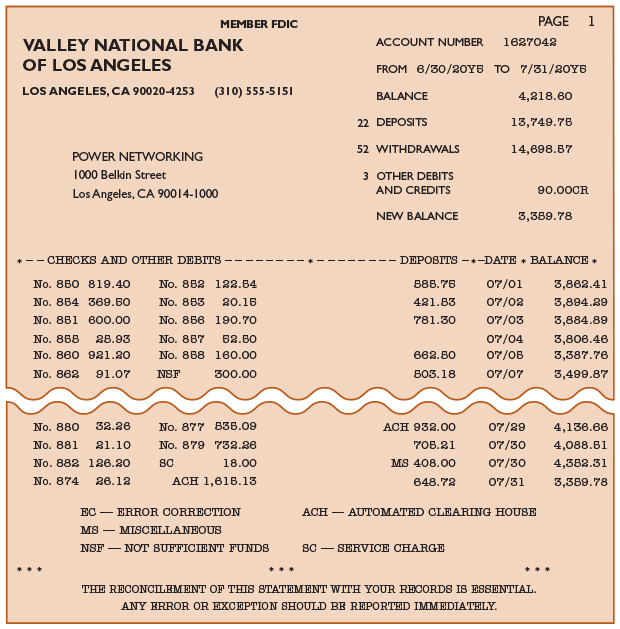

Checks or copies of the checks listed in the order that they were paid by the bank may accompany the bank statement. If paid checks are returned, they are stamped "Paid," together with the date of payment. Many banks no longer return checks or check copies. Instead, the check payment information is available online.

[Los cheques o copias de los cheques enumerados en el orden en que fueron pagados por el banco pueden acompañar al estado de cuenta bancario. Si se devuelven cheques pagados, están sellados "Pagado", junto con la fecha de pago. Muchos bancos ya no devuelven cheques o copias de cheques. En su lugar, la información de pago de cheques está disponible en línea.]

The company's checking account balance in the bank records is a liability. Thus, in the bank's records, the company's account has a credit balance. Because the bank statement is prepared from the bank's point of view, a credit memo entry on the bank statement indicates an increase (a credit) to the company's account. Likewise, a debit memo entry on the bank statement indicates a decrease (a debit) in the company's account. This relationship is shown in Exhibit 10.

[El saldo de la cuenta corriente de la empresa en los registros bancarios es un pasivo. Por lo tanto, en los registros del banco, la cuenta de la empresa tiene un saldo acreedor. Debido a que el estado de cuenta bancario se prepara desde el punto de vista del banco, una entrada de memo de crédito en el estado de cuenta bancario indica un aumento (un crédito) en la cuenta de la empresa. Del mismo modo, una entrada de memo de débito en el estado de cuenta bancario indica una disminución (un débito) en la cuenta de la empresa. Esta relación se muestra en la Figura 10.]

---

## Exhibit 10

### Checking Account: Company and Bank Perspectives

[**Figura 10** - Cuenta Corriente: Perspectivas de la Empresa y del Banco]

<!-- 📍 IMAGEN: Exhibit 10 - Checking Account: Company and Bank Perspectives (coordenadas [129, 190, 840, 420]) -->

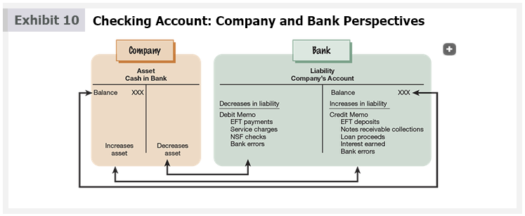

A bank makes credit entries (issues credit memos) for the following:

[Un banco realiza asientos de crédito (emite memos de crédito) por lo siguiente:]

- Deposits made by electronic funds transfer (EFT)  
  [Depósitos realizados mediante transferencia electrónica de fondos (EFT)]

- Collections of notes receivable for the company  
  [Cobros de notas por cobrar para la empresa]

- Proceeds for a loan made to the company by the bank  
  [Productos de un préstamo otorgado a la empresa por el banco]

- Interest earned on the company's account  
  [Intereses ganados en la cuenta de la empresa]

- Correction (if any) of bank errors  
  [Corrección (si corresponde) de errores bancarios]

A bank makes debit entries (issues debit memos) for the following:

[Un banco realiza asientos de débito (emite memos de débito) por lo siguiente:]

- Payments made by electronic funds transfer (EFT)  
  [Pagos realizados mediante transferencia electrónica de fondos (EFT)]

- Service charges  
  [Cargos por servicios]

- Customer checks returned for not sufficient funds  
  [Cheques de clientes devueltos por fondos insuficientes]

- Correction (if any) of bank errors  
  [Corrección (si corresponde) de errores bancarios]

Customers' checks returned for not sufficient funds, called NSF checks, are customer checks that were initially deposited but were not paid by the customer's bank. Because the company's bank credited the customer's check to the company's account when it was deposited, the bank debits the company's account (issues a debit memo) when the check is returned without payment.

[Los cheques de clientes devueltos por fondos insuficientes, llamados cheques NSF, son cheques de clientes que se depositaron inicialmente pero que no fueron pagados por el banco del cliente. Debido a que el banco de la empresa acreditó el cheque del cliente en la cuenta de la empresa cuando se depositó, el banco debita la cuenta de la empresa (emite un memo de débito) cuando el cheque se devuelve sin pago.]

The reason for a credit or debit memo entry is indicated on the bank statement. Exhibit 9 identifies the following types of credit and debit memo entries:

[La razón de una entrada de memo de crédito o débito se indica en el estado de cuenta bancario. La Figura 9 identifica los siguientes tipos de entradas de memo de crédito y débito:]

- EC: Error correction to correct bank error  
  [EC: Corrección de error para corregir error bancario]

- NSF: Not sufficient funds check  
  [NSF: Cheque por fondos insuficientes]

- SC: Service charge  
  [SC: Cargo por servicio]

- ACH: Automated clearing house entry for electronic funds transfer  
  [ACH: Entrada de cámara de compensación automatizada para transferencia electrónica de fondos]

- MS: Miscellaneous item such as collection of a note receivable on behalf of the company or receipt of a loan by the company from the bank  
  [MS: Artículo diverso como cobro de una nota por cobrar en nombre de la empresa o recepción de un préstamo por parte de la empresa del banco]

The preceding list includes the notation "ACH" for electronic funds transfers. ACH is a network for clearing electronic funds transfers among individuals, companies, and banks. Because electronic funds transfers may be either deposits or payments, ACH entries may indicate either a debit or credit entry to the company's account. Likewise, entries to correct bank errors and miscellaneous items may indicate a debit or credit entry to the company's account.

[La lista anterior incluye la notación "ACH" para transferencias electrónicas de fondos. ACH es una red para la compensación de transferencias electrónicas de fondos entre individuos, empresas y bancos. Debido a que las transferencias electrónicas de fondos pueden ser depósitos o pagos, las entradas ACH pueden indicar una entrada de débito o crédito en la cuenta de la empresa. Del mismo modo, las entradas para corregir errores bancarios y artículos diversos pueden indicar una entrada de débito o crédito en la cuenta de la empresa.]

---

<h1 id="193437" style="color:#E65100;">
  <a href="#Chapter_007" style="color:inherit; text-decoration:none;">
    7-4b Using the Bank Statement as a Control over Cash
  </a>
</h1>

The bank statement is a primary control that a company uses over cash. A company uses the bank's statement by comparing the company's record of cash transactions to those recorded by the bank.

[El estado de cuenta bancario es un control principal que una empresa utiliza sobre el efectivo. Una empresa utiliza el estado de cuenta del banco comparando el registro de transacciones en efectivo de la empresa con los registrados por el banco.]

The cash balance shown by a bank statement is usually different from the company's cash balance, as shown in Exhibit 11 for Power Networking.

[El saldo de efectivo que muestra un estado de cuenta bancario suele ser diferente del saldo de efectivo de la empresa, como se muestra en la Figura 11 para Power Networking.]

---

## Exhibit 11

### Power Networking's Bank Statement and Records

[**Figura 11** - Estado de Cuenta Bancario y Registros de Power Networking]

<!-- 📍 IMAGEN: Exhibit 11 - Power Networking's Bank Statement and Records (coordenadas [161, 292, 824, 589]) -->

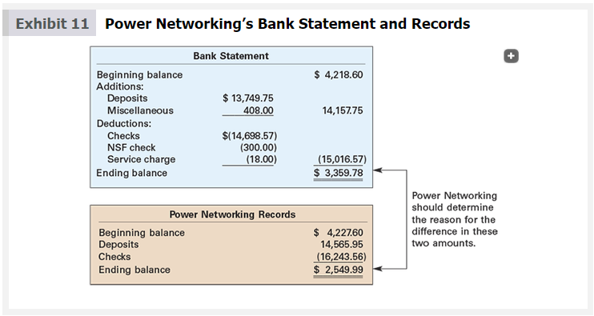

Differences between the company balance and bank balance may arise because of a delay by either the company or bank in recording transactions. For example, there is normally a time lag of one or more days between the date a check is written and the date that it is paid by the bank. Likewise, there is normally a time lag between when the company mails a deposit to the bank (or uses the night depository) and when the bank receives and records the deposit.

[Las diferencias entre el saldo de la empresa y el saldo bancario pueden surgir debido a un retraso de la empresa o del banco en el registro de las transacciones. Por ejemplo, normalmente hay un desfase de uno o más días entre la fecha en que se escribe un cheque y la fecha en que el banco lo paga. Del mismo modo, normalmente hay un desfase entre el momento en que la empresa envía un depósito al banco (o utiliza el depósito nocturno) y el momento en que el banco recibe y registra el depósito.]

---

## Business Insight

### Bank Error in Your Favor (or Maybe Not)

[**Perspectiva de Negocio - Error Bancario a su Favor (o Quizás No)**]

A New Zealand couple expected a $100,000 deposit into their checking account, but discovered the bank accidentally deposited $10,000,000. The couple immediately transferred the $10,000,000 to another account and left the country, hoping to cash in on this supposed windfall. Not surprisingly, they were found, arrested, and prosecuted for fraud. So, if you find a bank error in your favor, it really isn't like getting a Monopoly card. You cannot keep the cash, but must return it to the bank. Banks typically have a long time to correct such errors, and if it can be reasonably determined that you knew of the error, but failed to report it, you could be prosecuted for bank fraud.

[Una pareja de Nueva Zelanda esperaba un depósito de $100,000 en su cuenta corriente, pero descubrió que el banco había depositado accidentalmente $10,000,000. La pareja transfirió inmediatamente los $10,000,000 a otra cuenta y abandonó el país, esperando aprovechar esta supuesta ganancia inesperada. Como era de esperar, fueron encontrados, arrestados y procesados por fraude. Por lo tanto, si encuentra un error bancario a su favor, realmente no es como obtener una tarjeta de Monopoly. No puede quedarse con el efectivo, sino que debe devolverlo al banco. Los bancos suelen tener mucho tiempo para corregir tales errores, y si se puede determinar razonablemente que usted sabía del error, pero no lo informó, podría ser procesado por fraude bancario.]

*Source: Nickel, "Bank Error in Your Favor?," Forbes.com, May 2012.*

Differences may also arise because the bank has debited or credited the company's account for transactions that the company will not know about until the bank statement is received. Finally, differences may arise from errors made by either the company or the bank. For example, the company may incorrectly post to Cash a check written for $4,500 as $450. Likewise, a bank may incorrectly record the amount of a check.

[Las diferencias también pueden surgir porque el banco ha debitado o acreditado la cuenta de la empresa por transacciones que la empresa no conocerá hasta que reciba el estado de cuenta bancario. Finalmente, las diferencias pueden surgir de errores cometidos por la empresa o por el banco. Por ejemplo, la empresa puede registrar incorrectamente en Efectivo un cheque emitido por $4,500 como $450. Del mismo modo, un banco puede registrar incorrectamente el monto de un cheque.]

---

<h1 id="950588" style="color:#E65100;">
  <a href="#Chapter_007" style="color:inherit; text-decoration:none;">
    7-5 Bank Reconciliation
  </a>
</h1>

A **bank reconciliation** (The analysis that details the items responsible for the difference between the cash balance reported on the bank statement and the balance of the cash account in the ledger.) is an analysis of the items and amounts creating the difference between the cash balance reported on the bank statement and the balance of the cash account in the ledger. The adjusted cash balance determined in the bank reconciliation is reported on the balance sheet.

[Una **conciliación bancaria** (el análisis que detalla los elementos y montos responsables de la diferencia entre el saldo de efectivo reportado en el estado de cuenta bancario y el saldo de la cuenta de efectivo en el libro mayor) es un análisis de los elementos y montos que crean la diferencia entre el saldo de efectivo reportado en el estado de cuenta bancario y el saldo de la cuenta de efectivo en el libro mayor. El saldo de efectivo ajustado determinado en la conciliación bancaria se reporta en el balance general.]

**Objective 5** - Describe and illustrate the use of a bank reconciliation in controlling cash.

[**Objetivo 5** - Describir e ilustrar el uso de una conciliación bancaria en el control del efectivo.]

A bank reconciliation is usually divided into two sections as follows:

[Una conciliación bancaria generalmente se divide en dos secciones de la siguiente manera:]

1. The bank section begins with the cash balance according to the bank statement and ends with the adjusted balance.  
   [La sección del banco comienza con el saldo de efectivo según el estado de cuenta bancario y termina con el saldo ajustado.]

2. The company section begins with the cash balance according to the company's records and ends with the adjusted balance.  
   [La sección de la empresa comienza con el saldo de efectivo según los registros de la empresa y termina con el saldo ajustado.]

The adjusted balance from bank and company sections must be equal. The format of the bank reconciliation follows:

[El saldo ajustado de las secciones del banco y de la empresa debe ser igual. El formato de la conciliación bancaria es el siguiente:]

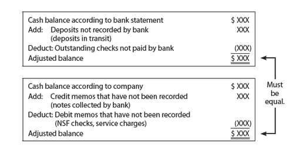</img>

| Bank Section | Amount |
|---|---|
| Cash balance according to bank | XXX |
| Add: Deposits not recorded by bank | XXX |
| Deduct: Outstanding checks | (XXX) |
| **Adjusted balance** | **XXX** |

| Company Section | Amount |
|---|---|
| Cash balance according to company | XXX |
| Add: Credit memos not recorded | XXX |
| Deduct: Debit memos not recorded | (XXX) |
| **Adjusted balance** | **XXX** |

A bank reconciliation is prepared using steps illustrated in Exhibit 12.

[Una conciliación bancaria se prepara utilizando los pasos ilustrados en la Figura 12.]

---

## Exhibit 12

### How to Prepare a Bank Reconciliation

[**Figura 12** - Cómo Preparar una Conciliación Bancaria]

<!-- 📍 IMAGEN: Exhibit 12 - How to Prepare a Bank Reconciliation (páginas 2-3) -->

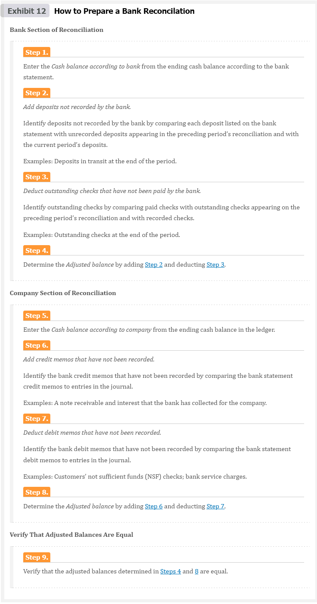

---

### Bank Section of Reconciliation

[**Sección del Banco de la Conciliación**]

**Step 1.** Enter the Cash balance according to bank from the ending cash balance according to the bank statement.  
[**Paso 1.** Ingrese el saldo de Efectivo según el banco a partir del saldo de efectivo final según el estado de cuenta bancario.]

**Step 2.** Add deposits not recorded by the bank.  
[**Paso 2.** Sume los depósitos no registrados por el banco.]

Identify deposits not recorded by the bank by comparing each deposit listed on the bank statement with unrecorded deposits appearing in the preceding period's reconciliation and with the current period's deposits.

[Identifique los depósitos no registrados por el banco comparando cada depósito enumerado en el estado de cuenta bancario con los depósitos no registrados que aparecen en la conciliación del período anterior y con los depósitos del período actual.]

Examples: Deposits in transit at the end of the period.  
[Ejemplos: Depósitos en tránsito al final del período.]

**Step 3.** Deduct outstanding checks that have not been paid by the bank.  
[**Paso 3.** Deduzca los cheques pendientes que no han sido pagados por el banco.]

Identify outstanding checks by comparing paid checks with outstanding checks appearing on the preceding period's reconciliation and with recorded checks.

[Identifique los cheques pendientes comparando los cheques pagados con los cheques pendientes que aparecen en la conciliación del período anterior y con los cheques registrados.]

Examples: Outstanding checks at the end of the period.  
[Ejemplos: Cheques pendientes al final del período.]

**Step 4.** Determine the Adjusted balance by adding Step 2 and deducting Step 3.  
[**Paso 4.** Determine el saldo ajustado sumando el Paso 2 y deduciendo el Paso 3.]

---

### Company Section of Reconciliation

[**Sección de la Empresa de la Conciliación**]

**Step 5.** Enter the Cash balance according to company from the ending cash balance according to the company's records.  
[**Paso 5.** Ingrese el saldo de Efectivo según la empresa a partir del saldo de efectivo final según los registros de la empresa.]

**Step 6.** Add credit memos that have not been recorded.  
[**Paso 6.** Sume los memos de crédito que no han sido registrados.]

Identify the bank credit memos that have not been recorded by comparing the bank statement credit memos to entries in the journal.

[Identifique los memos de crédito bancarios que no han sido registrados comparando los memos de crédito del estado de cuenta bancario con los asientos en el diario.]

Examples: A note receivable and interest that the bank has collected for the company.  
[Ejemplos: Una nota por cobrar e intereses que el banco ha cobrado para la empresa.]

**Step 7.** Deduct debit memos that have not been recorded.  
[**Paso 7.** Deduzca los memos de débito que no han sido registrados.]

Identify the bank debit memos that have not been recorded by comparing the bank statement debit memos to entries in the journal.

[Identifique los memos de débito bancarios que no han sido registrados comparando los memos de débito del estado de cuenta bancario con los asientos en el diario.]

Examples: Customers' not sufficient funds (NSF) checks; bank service charges.  
[Ejemplos: Cheques de clientes por fondos insuficientes (NSF); cargos por servicios bancarios.]

**Step 8.** Determine the Adjusted balance by adding Step 6 and deducting Step 7.  
[**Paso 8.** Determine el saldo ajustado sumando el Paso 6 y deduciendo el Paso 7.]

---

### Verify That Adjusted Balances Are Equal

[**Verificar que los Saldos Ajustados Sean Iguales**]

**Step 9.** Verify that the adjusted balances determined in Steps 4 and 8 are equal.  
[**Paso 9.** Verifique que los saldos ajustados determinados en los Pasos 4 y 8 sean iguales.]

The adjusted balances in the bank and company sections of the reconciliation must be equal. If the balances are not equal, an item has been overlooked and must be found.

[Los saldos ajustados en las secciones del banco y de la empresa de la conciliación deben ser iguales. Si los saldos no son iguales, se ha pasado por alto un elemento y debe encontrarse.]

Sometimes, the adjusted balances are not equal because either the company or the bank has made an error. In such cases, the error is often discovered by comparing the amount of each item (deposit and check) on the bank statement with that in the company's records.

[A veces, los saldos ajustados no son iguales porque la empresa o el banco han cometido un error. En tales casos, el error a menudo se descubre comparando el monto de cada elemento (depósito y cheque) en el estado de cuenta bancario con el de los registros de la empresa.]

Any bank or company errors discovered should be added to or deducted from the bank or company section of the reconciliation, depending on the nature of the error. For example, assume that the bank incorrectly recorded a company check for $50 as $500. This bank error of $450 ($500 – $50) would be added to the bank balance in the bank section of the reconciliation. In addition, the bank would be notified of the error so that it could be corrected. On the other hand, assume that the company recorded a deposit of $1,200 as $2,100. This company error of $900 ($2,100 – $1,200) would be deducted from the cash balance in the company section of the bank reconciliation. The company would correct the error using a journal entry.

[Cualquier error bancario o de la empresa descubierto debe agregarse o deducirse de la sección del banco o de la empresa de la conciliación, según la naturaleza del error. Por ejemplo, suponga que el banco registró incorrectamente un cheque de la empresa por $50 como $500. Este error bancario de $450 ($500 – $50) se agregaría al saldo bancario en la sección del banco de la conciliación. Además, se notificaría al banco del error para que pudiera corregirse. Por otro lado, suponga que la empresa registró un depósito de $1,200 como $2,100. Este error de la empresa de $900 ($2,100 – $1,200) se deduciría del saldo de efectivo en la sección de la empresa de la conciliación bancaria. La empresa corregiría el error mediante un asiento de diario.]

---

### Illustration - Power Networking

To illustrate, the bank statement for Power Networking in Exhibit 9 is used. This bank statement shows a balance of $3,359.78 as of July 31. The cash balance in Power Networking's ledger on the same date is $2,549.99. Using the preceding steps, the following reconciling items were identified:

[Para ilustrar, se utiliza el estado de cuenta bancario de Power Networking en la Figura 9. Este estado de cuenta muestra un saldo de $3,359.78 al 31 de julio. El saldo de efectivo en el libro mayor de Power Networking en la misma fecha es de $2,549.99. Utilizando los pasos anteriores, se identificaron los siguientes elementos de conciliación:]

- **Step 2.** Deposit of July 31, not recorded on bank statement: $816.20  
  [**Paso 2.** Depósito del 31 de julio, no registrado en el estado de cuenta bancario: $816.20]

- **Step 3.** Outstanding checks:  
  [**Paso 3.** Cheques pendientes:]

| Outstanding Checks | Amount |
|---|---|
| Check No. 812 | $1,061.00 |
| Check No. 878 | 435.39 |
| Check No. 883 | 48.60 |
| **Total** | **$1,544.99** |

- **Step 6.** Note receivable of $400 plus interest of $8 collected by bank not recorded in the journal as indicated by a credit memo of $408.  
  [**Paso 6.** Nota por cobrar de $400 más intereses de $8 cobrados por el banco no registrados en el diario según lo indicado por un memo de crédito de $408.]

- **Step 7.** Check from customer (Thomas Ivey) for $300 returned by bank because of insufficient funds (NSF) as indicated by a debit memo of $300.00.  
  [**Paso 7.** Cheque del cliente (Thomas Ivey) por $300 devuelto por el banco por fondos insuficientes (NSF) según lo indicado por un memo de débito de $300.00.]

- **Step 7.** Bank service charges of $18, not recorded in the journal as indicated by a debit memo of $18.00.  
  [**Paso 7.** Cargos por servicios bancarios de $18, no registrados en el diario según lo indicado por un memo de débito de $18.00.]

In addition, an error of $9 was discovered. This error occurred when Check No. 879 for $732.26 to Taylor Co., on account, was recorded in the company's journal as $723.26.

[Además, se descubrió un error de $9. Este error ocurrió cuando el Cheque No. 879 por $732.26 a Taylor Co., a cuenta, se registró en el diario de la empresa como $723.26.]

The bank reconciliation, based on the Exhibit 9 bank statement and the preceding reconciling items, is shown in Exhibit 13 for Power Networking.

[La conciliación bancaria, basada en el estado de cuenta bancario de la Figura 9 y los elementos de conciliación anteriores, se muestra en la Figura 13 para Power Networking.]

---

## Exhibit 13

### Bank Reconciliation for Power Networking

[**Figura 13** - Conciliación Bancaria para Power Networking]

<!-- 📍 IMAGEN: Exhibit 13 - Bank Reconciliation for Power Networking (coordenadas [88, 39, 843, 330]) -->

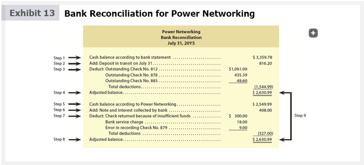

<table><tbody>
  <tr>
    <td>Sección</td>
    <td colspan="4">Concepto</td>
    <td>Amoung ($)</td>
    <td>Total ($)</td>
  </tr>
  <tr>
    <td>Bank Statement</td>
    <td></td>
    <td colspan="3">Cash balance according to bank statement</td>
    <td></td>
    <td>3,359.78</td>
  </tr>
  <tr>
    <td>Bank Statement</td>
    <td></td>
    <td colspan="3">Add: Deposit in transit on July 31</td>
    <td></td>
    <td>816.20</td>
  </tr>
  <tr>
    <td>Bank Statement</td>
    <td></td>
    <td></td>
    <td></td>
    <td>Subtotal</td>
    <td></td>
    <td>4,175.98</td>
  </tr>
  <tr>
    <td>Bank Statement</td>
    <td></td>
    <td colspan="3">Deduct: Outstanding Check No. 812</td>
    <td>1,061.00</td>
    <td></td>
  </tr>
  <tr>
    <td>Bank Statement</td>
    <td></td>
    <td></td>
    <td colspan="2">Deduct: Outstanding Check No. 878</td>
    <td>435.39</td>
    <td></td>
  </tr>
  <tr>
    <td>Bank Statement</td>
    <td></td>
    <td></td>
    <td colspan="2">Deduct: Outstanding Check No. 883</td>
    <td>48.60</td>
    <td></td>
  </tr>
  <tr>
    <td>Bank Statement</td>
    <td></td>
    <td></td>
    <td></td>
    <td>Total deductions</td>
    <td></td>
    <td>(1,544.99)</td>
  </tr>
  <tr>
    <td>Bank Statement</td>
    <td></td>
    <td colspan="3">Adjusted balance</td>
    <td></td>
    <td>2,630.99</td>
  </tr>
  <tr>
    <td></td>
    <td></td>
    <td></td>
    <td></td>
    <td></td>
    <td></td>
    <td></td>
  </tr>
  <tr>
    <td>Power Networking Books</td>
    <td></td>
    <td colspan="3">Cash balance according to Power Networking</td>
    <td></td>
    <td>2,549.99</td>
  </tr>
  <tr>
    <td>Power Networking Books</td>
    <td></td>
    <td colspan="3">Add: Note and interest collected by bank</td>
    <td></td>
    <td>408.00</td>
  </tr>
  <tr>
    <td>Power Networking Books</td>
    <td></td>
    <td></td>
    <td></td>
    <td>Subtotal</td>
    <td></td>
    <td>2,957.99</td>
  </tr>
  <tr>
    <td>Power Networking Books</td>
    <td></td>
    <td colspan="3">Deduct: Check returned because of insufficient funds</td>
    <td>300.00</td>
    <td></td>
  </tr>
  <tr>
    <td>Power Networking Books</td>
    <td></td>
    <td></td>
    <td colspan="2">Deduct: Bank service charge</td>
    <td>18.00</td>
    <td></td>
  </tr>
  <tr>
    <td>Power Networking Books</td>
    <td></td>
    <td></td>
    <td colspan="2">Deduct: Error in recording Check No. 879</td>
    <td>9.00</td>
    <td></td>
  </tr>
  <tr>
    <td>Power Networking Books</td>
    <td></td>
    <td></td>
    <td></td>
    <td>Total deductions</td>
    <td></td>
    <td>(327.00)</td>
  </tr>
  <tr>
    <td>Power Networking Books</td>
    <td></td>
    <td colspan="3">Adjusted balance</td>
    <td></td>
    <td>2,630.99</td>
  </tr>
</tbody></table>

---

### Journal Entries for Power Networking

The company's records do not need to be updated for any items in the bank section of the reconciliation. This section begins with the cash balance according to the bank statement. However, the bank should be notified of any errors that need to be corrected.

[Los registros de la empresa no necesitan actualizarse para ningún elemento en la sección del banco de la conciliación. Esta sección comienza con el saldo de efectivo según el estado de cuenta bancario. Sin embargo, se debe notificar al banco de cualquier error que necesite ser corregido.]

The company's records must be updated for any items in the company section of the bank reconciliation. The company's records are updated using journal entries. For example, journal entries should be made for any unrecorded bank memos and any company errors.

[Los registros de la empresa deben actualizarse para cualquier elemento en la sección de la empresa de la conciliación bancaria. Los registros de la empresa se actualizan mediante asientos de diario. Por ejemplo, se deben hacer asientos de diario para cualquier memo bancario no registrado y cualquier error de la empresa.]

The journal entries for Power Networking, based on the bank reconciliation shown in Exhibit 13, are as follows:

[Los asientos de diario para Power Networking, basados en la conciliación bancaria que se muestra en la Figura 13, son los siguientes:]

| Date | Account | Debit | Credit |
|------|---------|-------|--------|
| July 31 | Cash | 408 | |
| | Notes Receivable | | 400 |
| | Interest Revenue | | 8 |
| | *Record collection of note receivable by bank.* | | |

<table><tbody>
  <tr>
    <td colspan="4">Assets</td>
    <td>=</td>
    <td colspan="2">Liabilities</td>
    <td>+</td>
    <td colspan="2">Stockholders'Equity</td>
  </tr>
  <tr>
    <td colspan="2">cash</td>
    <td colspan="2">Notes Receivable</td>
    <td rowspan="3"></td>
    <td colspan="2"></td>
    <td rowspan="3"></td>
    <td colspan="2">Interest Revenue</td>
  </tr>
  <tr>
    <td>Debit</td>
    <td>Credit</td>
    <td>Debit</td>
    <td>Credit</td>
    <td>Debit</td>
    <td>Credit</td>
    <td>Debit</td>
    <td>Credit</td>
  </tr>
  <tr>
    <td>408</td>
    <td></td>
    <td></td>
    <td>400</td>
    <td></td>
    <td></td>
    <td></td>
    <td>8</td>
  </tr>
</tbody>
</table>

| Date | Account | Debit | Credit |
|---|---|---|---|
| July 31 | Accounts Receivable—Thomas Ivey | 300 |  |
|  | Miscellaneous Expense | 18 |  |
|  | Accounts Payable—Taylor Co. | 9 |  |
|  | Cash |  | 327 |
|  | *Record error in recording Check No. 879.* |  |  |

<table><tbody>
  <tr>
    <td colspan="4">Assets</td>
    <td>=</td>
    <td colspan="2">Liabilities</td>
    <td>+</td>
    <td colspan="2">Stockholders'Equity</td>
  </tr>
  <tr>
    <td colspan="2">cash</td>
    <td colspan="2">Accounts Receivable</td>
    <td rowspan="3"></td>
    <td colspan="2">Accounts Payable</td>
    <td rowspan="3"></td>
    <td colspan="2">Miscellaneous Expense</td>
  </tr>
  <tr>
    <td>Debit</td>
    <td>Credit</td>
    <td>Debit</td>
    <td>Credit</td>
    <td>Debit</td>
    <td>Credit</td>
    <td>Debit</td>
    <td>Credit</td>
  </tr>
  <tr>
    <td></td>
    <td>327</td>
    <td>300</td>
    <td></td>
    <td>9</td>
    <td></td>
    <td>18</td>
    <td></td>
  </tr>
</tbody>
</table>

---

## Check Up Corner 7-2

### Bank Reconciliation

[**Esquina de Verificación 7-2 - Conciliación Bancaria**]

The following data related to the bank account of Apex Company were gathered on December 31, 20Y9, the end of the fiscal year:

[Los siguientes datos relacionados con la cuenta bancaria de Apex Company se recopilaron el 31 de diciembre de 20Y9, al final del año fiscal:]

| | Amount |
|---|---|
| Balance per bank account | $14,500 |
| Balance per company records | 13,875 |

The following additional information was provided to help reconcile the company's bank account:

[Se proporcionó la siguiente información adicional para ayudar a conciliar la cuenta bancaria de la empresa:]

| | Amount |
|---|---|
| Bank service charges | $75 |
| Deposit in transit | 3,750 |
| Check from Dave Hilman returned for insufficient funds (NSF) | 800 |
| Outstanding checks | 5,250 |

Prepare a bank reconciliation for Apex Company on December 31, 20Y9.

[Prepare una conciliación bancaria para Apex Company el 31 de diciembre de 20Y9.]

---

### Solution - Check Up Corner 7-2

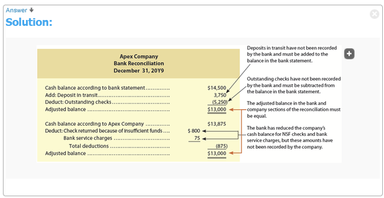</img>

[**Solución - Esquina de Verificación 7-2**]

#### Apex Company
#### Bank Reconciliation
#### December 31, 20Y9

| Bank Section | Amount | Total |
|---|---|---|
| Cash balance according to bank statement |  | $14,500 |
| Add: Deposit in transit |  | 3,750 |
| Deduct: Outstanding checks |  | (5,250) |
| **Adjusted balance** |  | **$13,000** |

| Company Section | Amount | Total |
|---|---|---|
| Cash balance according to company records |  | $13,875 |
| Deduct: Check returned because of insufficient funds (NSF) | (800) |  |
| Bank service charges | (75) |  |
| Total deductions |  | (875) |
| **Adjusted balance** |  | **$13,000** |

---

### Journal Entries for Apex Company

| Date | Account | Debit | Credit |
|------|---------|-------|--------|
| Dec. 31 | Accounts Receivable—Dave Hilman | 800 | |
| | Cash | | 800 |
| | *Record NSF check returned by bank.* | | |
| Dec. 31 | Miscellaneous Expense | 75 | |
| | Cash | | 75 |
| | *Record bank service charges.* | | |

---

After the preceding journal entries are recorded and posted, the cash account will have a debit balance of $2,630.99. This cash balance agrees with the adjusted balance shown on the bank reconciliation. This is the amount of cash on July 31 and is the amount that is reported on Power Networking's July 31 balance sheet.

[Después de que se registran y traspasan los asientos de diario anteriores, la cuenta de efectivo tendrá un saldo deudor de $2,630.99. Este saldo de efectivo coincide con el saldo ajustado que se muestra en la conciliación bancaria. Esta es la cantidad de efectivo al 31 de julio y es la cantidad que se reporta en el balance general de Power Networking del 31 de julio.]

Businesses may reconcile their bank accounts in a slightly different format from that shown in Exhibit 13. Regardless, the objective is to control cash by reconciling the company's records with the bank statement. In doing so, any errors or misuse of cash may be detected.

[Las empresas pueden conciliar sus cuentas bancarias en un formato ligeramente diferente al que se muestra en la Figura 13. Independientemente, el objetivo es controlar el efectivo conciliando los registros de la empresa con el estado de cuenta bancario. Al hacerlo, se pueden detectar errores o mal uso del efectivo.]

To enhance internal control, the bank reconciliation should be prepared by an employee who does not take part in or record cash transactions. Otherwise, mistakes may occur, and it is more likely that cash will be stolen or misapplied. For example, an employee who handles cash and also reconciles the bank statement could steal a cash deposit, omit the deposit from the accounts, and omit it from the reconciliation.

[Para mejorar el control interno, la conciliación bancaria debe ser preparada por un empleado que no participe ni registre transacciones en efectivo. De lo contrario, pueden ocurrir errores y es más probable que el efectivo sea robado o mal aplicado. Por ejemplo, un empleado que maneja efectivo y también concilia el estado de cuenta bancario podría robar un depósito en efectivo, omitir el depósito de las cuentas y omitirlo de la conciliación.]

Bank reconciliations are also an important part of computerized systems where deposits and checks are stored in electronic files and records. Some systems use computer software to determine the difference between the bank statement and company cash balances. The software then adjusts for deposits in transit and outstanding checks. Any remaining differences are reported for further analysis.

[Las conciliaciones bancarias también son una parte importante de los sistemas computarizados donde los depósitos y cheques se almacenan en archivos y registros electrónicos. Algunos sistemas utilizan software informático para determinar la diferencia entre el estado de cuenta bancario y los saldos de efectivo de la empresa. El software luego ajusta los depósitos en tránsito y los cheques pendientes. Cualquier diferencia restante se reporta para un análisis adicional.]

---

<h1 id="753201" style="color:#E65100;">
  <a href="#Chapter_007" style="color:inherit; text-decoration:none;">
    7-6 Special-Purpose Cash Funds
  </a>
</h1>

A company often has to pay small amounts for such items as postage, office supplies, or minor repairs. Although small, such payments may occur often enough to total a significant amount. Thus, it is desirable to control such payments. However, writing a check for each small payment is not practical. Instead, a special cash fund, called a **petty cash fund** (A special cash fund to pay relatively small amounts.), is used.

[Una empresa a menudo tiene que pagar pequeñas cantidades por artículos como sellos postales, suministros de oficina o reparaciones menores. Aunque son pequeñas, tales pagos pueden ocurrir con la frecuencia suficiente para totalizar una cantidad significativa. Por lo tanto, es deseable controlar tales pagos. Sin embargo, escribir un cheque para cada pago pequeño no es práctico. En su lugar, se utiliza un fondo de efectivo especial, llamado **fondo de caja menor** (un fondo de efectivo especial para pagar cantidades relativamente pequeñas).]

**Objective 6** - Describe the accounting for special-purpose cash funds.

[**Objetivo 6** - Describir la contabilidad para los fondos de efectivo de propósito especial.]

---

## Petty Cash Fund

A petty cash fund is established by estimating the amount of payments needed from the fund during a period, such as a week or a month. A check is then written and cashed for this amount. The money obtained from cashing the check is then given to an employee, called the petty cash custodian. The petty cash custodian disburses monies from the fund as needed. For control purposes, the company may place restrictions on the maximum amount and the types of payments that can be made from the fund. Each time money is paid from petty cash, the custodian records the details on a petty cash receipts form.

[Un fondo de caja menor se establece estimando la cantidad de pagos necesarios del fondo durante un período, como una semana o un mes. Luego se escribe y cobra un cheque por esta cantidad. El dinero obtenido del cobro del cheque se entrega a un empleado, llamado custodio de caja menor. El custodio de caja menor desembolsa dinero del fondo según sea necesario. Para fines de control, la empresa puede establecer restricciones sobre el monto máximo y los tipos de pagos que se pueden realizar desde el fondo. Cada vez que se paga dinero de la caja menor, el custodio registra los detalles en un formulario de recibos de caja menor.]

The petty cash fund is normally replenished at periodic intervals, when it is depleted, or when it reaches a minimum amount. When a petty cash fund is replenished, the accounts debited are determined by summarizing the petty cash receipts. A check is then written for this amount, payable to Petty Cash.

[El fondo de caja menor normalmente se reabastece a intervalos periódicos, cuando se agota o cuando alcanza una cantidad mínima. Cuando se reabastece un fondo de caja menor, las cuentas debitadas se determinan resumiendo los recibos de caja menor. Luego se escribe un cheque por esta cantidad, pagadero a Caja Menor.]

To illustrate, assume that a petty cash fund of $500 is established on August 1. The entry to journalize this transaction is as follows:

[Para ilustrar, suponga que se establece un fondo de caja menor de $500 el 1 de agosto. El asiento para registrar esta transacción en el diario es el siguiente:]

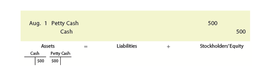</img>

| Date | Account | Debit | Credit |
|------|---------|-------|--------|
| Aug. 1 | Petty Cash | 500 | |
| | Cash | | 500 |
| | *Established petty cash fund.* | | |

<table><tbody>
  <tr>
    <td colspan="4">Assets</td>
    <td>=</td>
    <td colspan="2">Liabilities</td>
    <td>+</td>
    <td colspan="2">Stockholders'Equity</td>
  </tr>
  <tr>
    <td colspan="2">cash</td>
    <td colspan="2">Petty Cash</td>
    <td rowspan="3"></td>
    <td colspan="2"></td>
    <td rowspan="3"></td>
    <td colspan="2"></td>
  </tr>
  <tr>
    <td>Debit</td>
    <td>Credit</td>
    <td>Debit</td>
    <td>Credit</td>
    <td>Debit</td>
    <td>Credit</td>
    <td>Debit</td>
    <td>Credit</td>
  </tr>
  <tr>
    <td></td>
    <td>500</td>
    <td>500</td>
    <td></td>
    <td></td>
    <td></td>
    <td></td>
    <td></td>
  </tr>
</tbody>
</table>

The only time Petty Cash is debited is when the fund is initially established, as shown in the preceding entry, or when the fund is being increased. The only time Petty Cash is credited is when the fund is being decreased or eliminated.

[La única vez que se debita Caja Menor es cuando el fondo se establece inicialmente, como se muestra en el asiento anterior, o cuando se aumenta el fondo. La única vez que se acredita Caja Menor es cuando se disminuye o se elimina el fondo.]

At the end of August, there is $30 of petty cash on hand and petty cash receipts for the following items:

[Al final de agosto, hay $30 de efectivo de caja menor disponible y recibos de caja menor para los siguientes elementos:]

| Item | Amount |
|---|---|
| Office supplies | $380 |
| Postage (debit Office Supplies) | 22 |
| Store supplies | 35 |
| Miscellaneous administrative expense | 30 |
| **Total** | **$467** |

If the amount to replenish the petty cash fund does not equal the total of the petty cash receipts, the difference is recorded as Cash Short and Over. In the preceding example, $470 ($500 less cash on hand of $30) is needed to replenish the petty cash fund. Since the total of the petty cash receipts is $467, Cash Short and Over is debited for $3, as shown in the following entry to replenish the petty cash fund.

[Si la cantidad para reabastecer el fondo de caja menor no es igual al total de los recibos de caja menor, la diferencia se registra como Faltante y Sobrante de Efectivo. En el ejemplo anterior, se necesitan $470 ($500 menos el efectivo disponible de $30) para reabastecer el fondo de caja menor. Dado que el total de los recibos de caja menor es de $467, Faltante y Sobrante de Efectivo se debita por $3, como se muestra en el siguiente asiento para reabastecer el fondo de caja menor.]

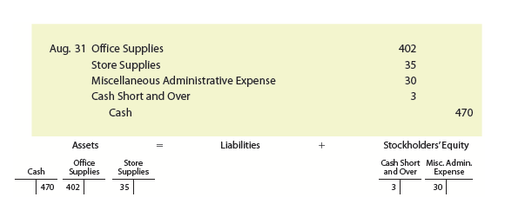</img>

| Date | Account | Debit | Credit |
|------|---------|-------|--------|
| Aug. 31 | Office Supplies | 402 | |
| | Store Supplies | 35 | |
| | Miscellaneous Administrative Expense | 30 | |
| | Cash Short and Over | 3 | |
| | Cash | | 470 |
| | *Replenished petty cash fund.* | | |

<table><tbody>
  <tr>
    <td colspan="4">Assets</td>
    <td></td>
    <td></td>
    <td>=</td>
    <td colspan="2">Liabilities</td>
    <td>+</td>
    <td colspan="4">Stockholders'Equity</td>
  </tr>
  <tr>
    <td colspan="2">cash</td>
    <td colspan="2">Office Supplies</td>
    <td colspan="2">Store Supplies</td>
    <td rowspan="3"></td>
    <td colspan="2"></td>
    <td rowspan="3"></td>
    <td colspan="2">Cash Short and Over</td>
    <td colspan="2">Misc. Administrative Expense</td>
  </tr>
  <tr>
    <td>Debit</td>
    <td>Credit</td>
    <td>Debit</td>
    <td>Credit</td>
    <td>Debit</td>
    <td>Credit</td>
    <td>Debit</td>
    <td>Credit</td>
    <td>Debit</td>
    <td>Credit</td>
    <td>Debit</td>
    <td>Credit</td>
  </tr>
  <tr>
    <td></td>
    <td>470</td>
    <td>402</td>
    <td></td>
    <td>35</td>
    <td></td>
    <td></td>
    <td></td>
    <td>3</td>
    <td></td>
    <td>30</td>
    <td></td>
  </tr>
</tbody>
</table>

Petty Cash is not debited or credited when the petty cash fund is replenished. Instead, only the accounts affected by the petty cash receipts and any Cash Short and Over are recorded, as shown in the preceding entry. Replenishing the petty cash fund restores the fund to its original cash on hand of $500.

[Caja Menor no se debita ni se acredita cuando se reabastece el fondo de caja menor. En su lugar, solo se registran las cuentas afectadas por los recibos de caja menor y cualquier Faltante y Sobrante de Efectivo, como se muestra en el asiento anterior. Reabastecer el fondo de caja menor restaura el fondo a su efectivo original disponible de $500.]

---

## Special-Purpose Funds

Companies often use other cash funds for special needs, such as payroll or travel expenses. Such funds are called **special-purpose funds** (Cash funds used for a special business need.). For example, each salesperson might be given $1,000 for travel-related expenses. Periodically, each salesperson submits an expense report, and the fund is replenished. Special-purpose funds are established and controlled in a manner similar to that of the petty cash fund.

[Las empresas suelen utilizar otros fondos de efectivo para necesidades especiales, como nómina o gastos de viaje. Dichos fondos se llaman **fondos de propósito especial** (fondos de efectivo utilizados para una necesidad comercial especial). Por ejemplo, a cada vendedor se le podría dar $1,000 para gastos relacionados con viajes. Periódicamente, cada vendedor presenta un informe de gastos y el fondo se reabastece. Los fondos de propósito especial se establecen y controlan de manera similar al fondo de caja menor.]

---

<h1 id="783735" style="color:#E65100;">
  <a href="#Chapter_007" style="color:inherit; text-decoration:none;">
    7-7 Financial Statement Reporting of Cash
  </a>
</h1>

