<h1 id="Chapter_008" style="color:#42A5F5;">Indice</h1>

##### [Capitulo 8-1 Classification of Receivables](#025847)

##### [Capitulo 8-1a Accounts Receivable](#558712)

##### [Capitulo 8-1b Notes Receivable](#149823)

##### [Capitulo 8-1c Other Receivables](#443235)

##### [Capitulo 8-2 Uncollectible Receivables](#644435)

##### [Capitulo 8-3 Direct Write-Off Method for Uncollectible Accounts](#786446)

##### [Capitulo 8-4 Allowance Method for Uncollectible Accounts](#359235)

##### [Capitulo 8-4a Write-Offs to the Allowance Account](#586393)

##### [Capitulo 8-4b Estimating Uncollectibles](#548731)

##### [Capitulo 8-5 Comparing Direct Write-Off and Allowance Methods](#503219)

##### [Capitulo 8-6 Notes Receivable](#446122)

##### [Capitulo 8-6a Characteristics of Notes Receivable](#888612)

##### [Capitulo 8-6b Accounting for Notes Receivable](#388535)

##### [Capitulo 8-7 Reporting Receivables on the Balance Sheet](#569405)

##### [Capitulo 8-8a Let’s Review Chapter Summary](#038402)

##### [Capitulo 8-8b Key Terms](#242091)

<h1 id="025847" style="color:#E65100;">
  <a href="#Chapter_008" style="color:inherit; text-decoration:none;">
    8-1 Classification of Receivables
  </a>
</h1>

The receivables that result from sales on account are normally accounts receivable or notes receivable. The term **receivables** (All money claims against other entities, including people, business firms, and other organizations.) includes all money claims against other entities, including people, companies, and other organizations. Receivables are usually a significant portion of a company's total current assets.

[Las cuentas por cobrar que resultan de ventas a crédito son normalmente cuentas por cobrar o notas por cobrar. El término **cuentas por cobrar** (todos los derechos de cobro contra otras entidades, incluyendo personas, empresas y otras organizaciones) incluye todos los derechos de cobro contra otras entidades, incluyendo personas, empresas y otras organizaciones. Las cuentas por cobrar suelen ser una parte significativa de los activos corrientes totales de una empresa.]

**Objective 1** - Describe the common classes of receivables.

[**Objetivo 1** - Describir las clases comunes de cuentas por cobrar.]

---

<h1 id="558712" style="color:#E65100;">
  <a href="#Chapter_008" style="color:inherit; text-decoration:none;">
    8-1a Accounts Receivable
  </a>
</h1>

The most common transaction creating a receivable is selling merchandise or services on account (on credit). The receivable is recorded as a debit to Accounts Receivable. Such accounts receivable are normally collected within a short period, such as 30 or 60 days. They are classified on the balance sheet as a current asset.

[La transacción más común que crea una cuenta por cobrar es la venta de mercancía o servicios a crédito. La cuenta por cobrar se registra como un débito a Cuentas por Cobrar. Dichas cuentas por cobrar normalmente se cobran dentro de un período corto, como 30 o 60 días. Se clasifican en el balance general como un activo corriente.]

---

**Link to Under Armour:** In a recent annual report, Under Armour reported accounts receivable of $708.7 million, with the majority due from large retailers such as Dick's Sporting Goods, Inc. (DKS).

[**Enlace a Under Armour:** En un informe anual reciente, Under Armour reportó cuentas por cobrar de $708.7 millones, con la mayoría debidas por grandes minoristas como Dick's Sporting Goods, Inc. (DKS).]

---

<h1 id="149823" style="color:#E65100;">
  <a href="#Chapter_008" style="color:inherit; text-decoration:none;">
    8-1b Notes Receivable
  </a>
</h1>

Notes receivable are amounts that customers owe for which a formal, written instrument of credit has been issued. If notes receivable are expected to be collected within a year, they are classified on the balance sheet as a current asset.

[Las notas por cobrar son montos que los clientes deben para los cuales se ha emitido un instrumento formal de crédito por escrito. Si se espera que las notas por cobrar se cobren dentro de un año, se clasifican en el balance general como un activo corriente.]

Notes are often used for credit periods of more than 60 days. For example, an automobile dealer may require a down payment at the time of sale and accept a note or a series of notes for the remainder. Such notes usually provide for monthly payments.

[Las notas se utilizan a menudo para períodos de crédito de más de 60 días. Por ejemplo, un concesionario de automóviles puede requerir un pago inicial en el momento de la venta y aceptar una nota o una serie de notas para el saldo restante. Dichas notas generalmente prevén pagos mensuales.]

Notes may also be used to settle a customer's account receivable. Notes and accounts receivable that result from sales transactions are sometimes called **trade receivables**. In this chapter, all notes and accounts receivable are from sales transactions.

[Las notas también pueden utilizarse para liquidar la cuenta por cobrar de un cliente. Las notas y cuentas por cobrar que resultan de transacciones de ventas a veces se llaman **cuentas por cobrar comerciales**. En este capítulo, todas las notas y cuentas por cobrar provienen de transacciones de ventas.]

---

<h1 id="443235" style="color:#E65100;">
  <a href="#Chapter_008" style="color:inherit; text-decoration:none;">
    8-1c Other Receivables
  </a>
</h1>

Other receivables include interest receivable, taxes receivable, and receivables from officers or employees. Other receivables are normally reported separately on the balance sheet. If they are expected to be collected within one year, they are classified as current assets. If collection is expected beyond one year, they are classified as noncurrent assets and reported under the caption Investments.

[Otras cuentas por cobrar incluyen intereses por cobrar, impuestos por cobrar y cuentas por cobrar de funcionarios o empleados. Otras cuentas por cobrar normalmente se reportan por separado en el balance general. Si se espera que se cobren dentro de un año, se clasifican como activos corrientes. Si se espera que el cobro sea más allá de un año, se clasifican como activos no corrientes y se reportan bajo el título Inversiones.]

---

<h1 id="644435" style="color:#E65100;">
  <a href="#Chapter_008" style="color:inherit; text-decoration:none;">
    8-2 Uncollectible Receivables
  </a>
</h1>

In prior chapters, the accounting for sales of merchandise or services on account (on credit) was described and illustrated. A major issue that has not yet been discussed is that some customers will not pay their accounts. That is, some accounts receivable will be uncollectible.

[En capítulos anteriores, se describió e ilustró la contabilidad para las ventas de mercancía o servicios a crédito. Un problema importante que aún no se ha discutido es que algunos clientes no pagarán sus cuentas. Es decir, algunas cuentas por cobrar serán incobrables.]

**Objective 2** - Describe the accounting for uncollectible receivables.

[**Objetivo 2** - Describir la contabilidad para las cuentas por cobrar incobrables.]

Companies may shift the risk of uncollectible receivables to other companies. For example, some retailers do not accept sales on account but will only accept cash or credit cards. Such policies shift the risk to the credit card companies.

[Las empresas pueden trasladar el riesgo de las cuentas por cobrar incobrables a otras empresas. Por ejemplo, algunos minoristas no aceptan ventas a crédito, sino que solo aceptan efectivo o tarjetas de crédito. Tales políticas trasladan el riesgo a las compañías de tarjetas de crédito.]

Companies may also sell their receivables. This is often the case when a company issues its own credit card. For example, Macy's, Inc. (M) and J. C. Penney Company, Inc. (JCP) issue their own credit cards. Selling receivables is called **factoring the receivables**. The buyer of the receivables is called a **factor**. An advantage of factoring is that the company selling its receivables immediately receives cash for operating and other needs. Also, depending on the factoring agreement, some of the risk of uncollectible accounts is shifted to the factor.

[Las empresas también pueden vender sus cuentas por cobrar. Esto suele ser el caso cuando una empresa emite su propia tarjeta de crédito. Por ejemplo, Macy's, Inc. (M) y J. C. Penney Company, Inc. (JCP) emiten sus propias tarjetas de crédito. Vender cuentas por cobrar se llama **factorización de cuentas por cobrar**. El comprador de las cuentas por cobrar se llama **factor**. Una ventaja de la factorización es que la empresa que vende sus cuentas por cobrar recibe inmediatamente efectivo para necesidades operativas y de otro tipo. Además, dependiendo del acuerdo de factorización, parte del riesgo de cuentas incobrables se traslada al factor.]

Regardless of how careful a company is in granting credit, some credit sales will be uncollectible. The operating expense recorded from uncollectible receivables is called **bad debt expense** (The operating expense incurred because of the failure to collect receivables.), uncollectible accounts expense, or doubtful accounts expense.

[Independientemente de lo cuidadosa que sea una empresa al conceder crédito, algunas ventas a crédito serán incobrables. El gasto operativo registrado por cuentas por cobrar incobrables se llama **gasto por deudas incobrables** (el gasto operativo incurrido debido al fracaso en el cobro de cuentas por cobrar), gasto por cuentas incobrables o gasto por cuentas dudosas.]

There is no general rule for when an account becomes uncollectible. Some indications that an account may be uncollectible include the following:

[No hay una regla general para cuándo una cuenta se vuelve incobrable. Algunas indicaciones de que una cuenta puede ser incobrable incluyen las siguientes:]

- The receivable is past due.  
  [La cuenta por cobrar está vencida.]

- The customer does not respond to the company's attempts to collect.  
  [El cliente no responde a los intentos de la empresa de cobrar.]

- The customer files for bankruptcy.  
  [El cliente se declara en bancarrota.]

- The customer closes its business.  
  [El cliente cierra su negocio.]

- The company cannot locate the customer.  
  [La empresa no puede localizar al cliente.]

If a customer doesn't pay, a company may turn the account over to a collection agency. After the collection agency attempts to collect payment, any remaining balance in the account is considered worthless.

[Si un cliente no paga, una empresa puede entregar la cuenta a una agencia de cobranza. Después de que la agencia de cobranza intenta cobrar el pago, cualquier saldo restante en la cuenta se considera sin valor.]

The two methods of accounting for uncollectible receivables are as follows:

[Los dos métodos de contabilidad para cuentas por cobrar incobrables son los siguientes:]

- The **direct write-off method** (The method of accounting for uncollectible receivables that recognizes an expense only when an account is determined to be worthless.) records bad debt expense only when an account is determined to be worthless.  
  [El **método de cancelación directa** (el método de contabilidad para cuentas por cobrar incobrables que reconoce un gasto solo cuando se determina que una cuenta no tiene valor) registra el gasto por deudas incobrables solo cuando se determina que una cuenta no tiene valor.]

- The **allowance method** (The method of accounting for uncollectible receivables that recognizes an expense by estimating future uncollectible accounts at the end of the accounting period.) records bad debt expense by estimating uncollectible accounts at the end of the accounting period.  
  [El **método de provisión** (el método de contabilidad para cuentas por cobrar incobrables que reconoce un gasto estimando cuentas incobrables futuras al final del período contable) registra el gasto por deudas incobrables estimando las cuentas incobrables al final del período contable.]

---

**Link to Under Armour:** Under Armour uses the allowance method and estimates uncollectible accounts based upon historical experience, significant economic developments, and specific customer risk, such as a customer who is experiencing financial difficulties.

[**Enlace a Under Armour:** Under Armour utiliza el método de provisión y estima las cuentas incobrables basándose en la experiencia histórica, desarrollos económicos significativos y el riesgo específico del cliente, como un cliente que está experimentando dificultades financieras.]

---

## Business Insight

### Warning Signs

[**Perspectiva de Negocio - Señales de Advertencia**]

A business must manage the risk of extending credit. The following early warning signs can be used to signal the need to monitor future sales and accelerate collection efforts:

[Una empresa debe gestionar el riesgo de otorgar crédito. Las siguientes señales de advertencia tempranas se pueden utilizar para señalar la necesidad de monitorear las ventas futuras y acelerar los esfuerzos de cobro:]

- You're only receiving partial payments.  
  [Solo está recibiendo pagos parciales.]

- The customer's ordering pattern has declined dramatically, or the customer is seeking supplies elsewhere.  
  [El patrón de pedidos del cliente ha disminuido drásticamente, o el cliente está buscando suministros en otro lugar.]

- The customer is frequently making late payments or requests changes in the payment schedule.  
  [El cliente está realizando pagos atrasados con frecuencia o solicita cambios en el calendario de pagos.]

- The customer is exceeding its credit limits on the account.  
  [El cliente está excediendo sus límites de crédito en la cuenta.]

- The customer refuses to make payment, claiming dissatisfaction with the product.  
  [El cliente se niega a realizar el pago, alegando insatisfacción con el producto.]

- You can't reach your customer, or the customer refuses to acknowledge you.  
  [No puede contactar a su cliente, o el cliente se niega a reconocerlo.]

*Source: Ariel Mccurdy, "Six Early Warning Signs of Bad Debt," BARR Credit Services, April 25, 2018.*

The direct write-off method is often used by small companies and companies with few receivables. Generally accepted accounting principles (GAAP), however, require companies with a large amount of receivables to use the allowance method. As a result, most well-known companies such as General Electric (GE), PepsiCo (PEP), Intel (INTC), and FedEx (FDX) use the allowance method.

[El método de cancelación directa es utilizado a menudo por pequeñas empresas y empresas con pocas cuentas por cobrar. Sin embargo, los principios de contabilidad generalmente aceptados (GAAP) requieren que las empresas con una gran cantidad de cuentas por cobrar utilicen el método de provisión. Como resultado, la mayoría de las empresas conocidas como General Electric (GE), PepsiCo (PEP), Intel (INTC) y FedEx (FDX) utilizan el método de provisión.]

---

<h1 id="786446" style="color:#E65100;">
  <a href="#Chapter_008" style="color:inherit; text-decoration:none;">
    8-3 Direct Write-Off Method for Uncollectible Accounts
  </a>
</h1>

Under the direct write-off method, Bad Debt Expense is not recorded until the customer's account is determined to be worthless. At that time, the customer's account receivable is written off.

[Bajo el método de cancelación directa, el Gasto por Deudas Incobrables no se registra hasta que se determina que la cuenta del cliente no tiene valor. En ese momento, la cuenta por cobrar del cliente se cancela.]

**Objective 3** - Describe the direct write-off method of accounting for uncollectible receivables.

[**Objetivo 3** - Describir el método de cancelación directa de contabilidad para cuentas por cobrar incobrables.]

To illustrate, assume that a $4,200 account receivable from D. L. Ross has been determined to be uncollectible. The entry to write off the account is as follows:

[Para ilustrar, suponga que una cuenta por cobrar de $4,200 de D. L. Ross ha sido determinada como incobrable. El asiento para cancelar la cuenta es el siguiente:]

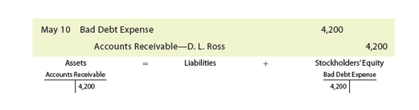</img>

| Date | Account | Debit | Credit |
|------|---------|-------|--------|
| May 10 | Bad Debt Expense | 4,200 | |
| | Accounts Receivable—D. L. Ross | | 4,200 |
| | *Write off uncollectible account.* | | |

An account receivable that has been written off may be collected later. In such cases, the account is reinstated by an entry that reverses the write-off entry. The cash received in payment is then recorded as a receipt on account.

[Una cuenta por cobrar que ha sido cancelada puede ser cobrada más tarde. En tales casos, la cuenta se restablece mediante un asiento que revierte el asiento de cancelación. El efectivo recibido como pago se registra entonces como un recibo a cuenta.]

To illustrate, assume that the D. L. Ross account of $4,200 written off on May 10 is later collected on November 21. The reinstatement and receipt of cash is journalized as follows:

[Para ilustrar, suponga que la cuenta de D. L. Ross de $4,200 cancelada el 10 de mayo se cobra más tarde el 21 de noviembre. La restitución y la recepción de efectivo se registran en el diario de la siguiente manera:]

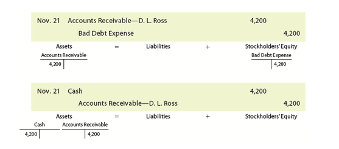</img>

| Date | Account | Debit | Credit |
|------|---------|-------|--------|
| Nov. 21 | Accounts Receivable—D. L. Ross | 4,200 | |
| | Bad Debt Expense | | 4,200 |
| | *Reinstate previously written off account.* | | |
| Nov. 21 | Cash | 4,200 | |
| | Accounts Receivable—D. L. Ross | | 4,200 |
| | *Record collection of account.* | | |

The direct write-off method is used by businesses that sell most of their goods or services for cash or through the acceptance of Mastercard (MA) or Visa (V), which are recorded as cash sales. In such cases, receivables are a small part of the current assets and any bad debt expense is small. Examples of such businesses are a restaurant, a convenience store, and a small retail store.

[El método de cancelación directa es utilizado por empresas que venden la mayoría de sus bienes o servicios al contado o mediante la aceptación de Mastercard (MA) o Visa (V), que se registran como ventas al contado. En tales casos, las cuentas por cobrar son una pequeña parte de los activos corrientes y cualquier gasto por deudas incobrables es pequeño. Ejemplos de tales negocios son un restaurante, una tienda de conveniencia y una pequeña tienda minorista.]

---

## Business Insight

### Failure to Collect

[**Perspectiva de Negocio - Fracaso en el Cobro**]

When customers fail to pay their accounts, a business has the option of seeking payment through a variety of means. The easiest recourse is to simply inquire about the cause of nonpayment and adjust terms to maximize the potential for collection. For large amounts, the cost and time of legal remedies may be appropriate. However, for smaller amounts, most businesses wish to minimize the time, effort, and cost of collecting amounts past due. Thus, after exhausting their internal efforts to collect, it is typical to use the services of a collection agency to collect overdue accounts. Such services must abide by a number of consumer protection laws in collecting overdue accounts. The final amount collected will often be less than the full amount due, of which the collection agency will often keep 25–45% as a fee. Thus, the collection agency is often the last resort before a final write-off.

[Cuando los clientes no pagan sus cuentas, una empresa tiene la opción de buscar el pago a través de una variedad de medios. El recurso más fácil es simplemente preguntar sobre la causa del impago y ajustar los términos para maximizar el potencial de cobro. Para montos grandes, el costo y el tiempo de los remedios legales pueden ser apropiados. Sin embargo, para montos más pequeños, la mayoría de las empresas desean minimizar el tiempo, el esfuerzo y el costo de cobrar montos vencidos. Por lo tanto, después de agotar sus esfuerzos internos para cobrar, es típico utilizar los servicios de una agencia de cobranza para cobrar cuentas vencidas. Dichos servicios deben cumplir con una serie de leyes de protección al consumidor en el cobro de cuentas vencidas. El monto final cobrado a menudo será menor que el monto total adeudado, del cual la agencia de cobranza a menudo se quedará con el 25–45% como comisión. Por lo tanto, la agencia de cobranza es a menudo el último recurso antes de una cancelación final.]

---

<h1 id="359235" style="color:#E65100;">
  <a href="#Chapter_008" style="color:inherit; text-decoration:none;">
    8-4 Allowance Method for Uncollectible Accounts
  </a>
</h1>

The allowance method estimates the uncollectible accounts receivable at the end of the accounting period. Based on this estimate of expected credit losses, Bad Debt Expense is recorded by an adjusting entry.

[El método de provisión estima las cuentas por cobrar incobrables al final del período contable. Con base en esta estimación de pérdidas crediticias esperadas, el Gasto por Deudas Incobrables se registra mediante un asiento de ajuste.]

**Objective 4** - Describe the allowance method of accounting for uncollectible receivables.

[**Objetivo 4** - Describir el método de provisión de contabilidad para cuentas por cobrar incobrables.]

To illustrate, assume that ExTone Company began operations August 1, 20Y1. As of the end of its accounting period on December 31, ExTone has an accounts receivable balance of $200,000. This balance includes some past due accounts. ExTone estimates that $30,000 of the December 31, 20Y1, accounts receivable will be uncollectible. However, on December 31, 20Y1, ExTone doesn't know which customer accounts will be uncollectible. Thus, specific customer accounts cannot be decreased or credited. Instead, a contra asset account, **Allowance for Doubtful Accounts** (A contra asset account for accounts receivable in which is recorded the estimate for uncollectible accounts when using the allowance method.), is credited for the estimated bad debts.

[Para ilustrar, suponga que ExTone Company comenzó operaciones el 1 de agosto de 20Y1. Al final de su período contable el 31 de diciembre, ExTone tiene un saldo de cuentas por cobrar de $200,000. Este saldo incluye algunas cuentas vencidas. ExTone estima que $30,000 de las cuentas por cobrar del 31 de diciembre de 20Y1 serán incobrables. Sin embargo, al 31 de diciembre de 20Y1, ExTone no sabe qué cuentas de clientes serán incobrables. Por lo tanto, no se pueden disminuir o acreditar cuentas de clientes específicas. En su lugar, se acredita una cuenta de contra activo, **Provisión para Cuentas Dudosas** (una cuenta de contra activo para cuentas por cobrar en la que se registra la estimación para cuentas incobrables cuando se utiliza el método de provisión), por las deudas incobrables estimadas.]

Using the $30,000 estimate, the following adjusting entry is made on December 31, 20Y1:

[Utilizando la estimación de $30,000, se realiza el siguiente asiento de ajuste el 31 de diciembre de 20Y1:]

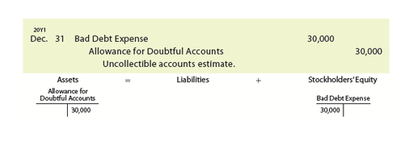</img>

| Date | Account | Debit | Credit |
|------|---------|-------|--------|
| Dec. 31 | Bad Debt Expense | 30,000 | |
| | Allowance for Doubtful Accounts | | 30,000 |
| | *Record estimated uncollectible accounts.* | | |

The preceding adjusting entry affects the income statement and balance sheet. On the income statement, the $30,000 of Bad Debt Expense will be matched against the related revenues of the period. On the balance sheet, the value of the receivables is reduced to the amount that is expected to be collected or realized. This amount, $170,000 ($200,000 – $30,000), is called the **net realizable value** of the receivables.

[El asiento de ajuste anterior afecta el estado de resultados y el balance general. En el estado de resultados, los $30,000 de Gasto por Deudas Incobrables se corresponderán con los ingresos relacionados del período. En el balance general, el valor de las cuentas por cobrar se reduce al monto que se espera cobrar o realizar. Este monto, $170,000 ($200,000 – $30,000), se llama **valor neto realizable** de las cuentas por cobrar.]

After the preceding adjusting entry is recorded, Accounts Receivable still has a debit balance of $200,000. This balance is the total amount owed by customers on account on December 31, 20Y1, as supported by the accounts receivable subsidiary ledger. The accounts receivable contra account, Allowance for Doubtful Accounts, has a credit balance of $30,000.

[Después de que se registra el asiento de ajuste anterior, Cuentas por Cobrar todavía tiene un saldo deudor de $200,000. Este saldo es el monto total adeudado por los clientes a cuenta al 31 de diciembre de 20Y1, según lo respaldado por el libro mayor auxiliar de cuentas por cobrar. La cuenta de contra de cuentas por cobrar, Provisión para Cuentas Dudosas, tiene un saldo acreedor de $30,000.]

---

<h1 id="586393" style="color:#E65100;">
  <a href="#Chapter_008" style="color:inherit; text-decoration:none;">
    8-4a Write-Offs to the Allowance Account
  </a>
</h1>

When a customer's account is identified as uncollectible, it is written off against the allowance account. This requires the company to remove the specific accounts receivable and an equal amount from the allowance account.

[Cuando la cuenta de un cliente se identifica como incobrable, se cancela contra la cuenta de provisión. Esto requiere que la empresa elimine las cuentas por cobrar específicas y una cantidad igual de la cuenta de provisión.]

To illustrate, on January 21, 20Y2, John Parker's account of $6,000 with ExTone Company is written off as follows:

[Para ilustrar, el 21 de enero de 20Y2, la cuenta de John Parker de $6,000 con ExTone Company se cancela de la siguiente manera:]

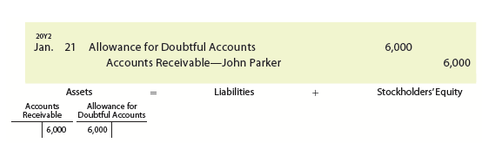</img>

| Date | Account | Debit | Credit |
|------|---------|-------|--------|
| Jan. 21 | Allowance for Doubtful Accounts | 6,000 | |
| | Accounts Receivable—John Parker | | 6,000 |
| | *Write off uncollectible account.* | | |

---

## Ethics in Action

### Collecting Past Due Accounts

[**Ética en Acción - Cobro de Cuentas Vencidas**]

Companies should make reasonable attempts (steps) to collect past due accounts, as we discussed in the previous Business Insight. Many companies first send a collection reminder as a first step. As a second step, a company may send a collection letter which offers options such as a willingness to negotiate a schedule for future payments. The next step is normally to turn the past due amount over to a collection agency or to file action in court. However, in no case should a company employee harass or misrepresent themselves as an attorney, collection agent, or agent of the court to the customer.

[Las empresas deben realizar intentos razonables (pasos) para cobrar cuentas vencidas, como discutimos en la Perspectiva de Negocio anterior. Muchas empresas envían primero un recordatorio de cobro como primer paso. Como segundo paso, una empresa puede enviar una carta de cobro que ofrece opciones como la disposición a negociar un calendario para pagos futuros. El siguiente paso normalmente es entregar el monto vencido a una agencia de cobranza o presentar una demanda ante el tribunal. Sin embargo, en ningún caso un empleado de la empresa debe acosar o hacerse pasar por abogado, agente de cobranza o agente del tribunal ante el cliente.]

At the end of a period, Allowance for Doubtful Accounts will normally have a balance. This is because Allowance for Doubtful Accounts is based on an estimate. As a result, the total write-offs to the allowance account during the period will rarely equal the balance of the account at the beginning of the period. The allowance account will have a credit balance at the end of the period if the write-offs during the period are less than the beginning balance. It will have a debit balance if the write-offs exceed the beginning balance.

[Al final de un período, la Provisión para Cuentas Dudosas normalmente tendrá un saldo. Esto se debe a que la Provisión para Cuentas Dudosas se basa en una estimación. Como resultado, las cancelaciones totales a la cuenta de provisión durante el período rara vez serán iguales al saldo de la cuenta al comienzo del período. La cuenta de provisión tendrá un saldo acreedor al final del período si las cancelaciones durante el período son menores que el saldo inicial. Tendrá un saldo deudor si las cancelaciones exceden el saldo inicial.]

Exhibit 1 illustrates the allowance method where the adjusting entry increases the Allowance for Doubtful Accounts (fills the bucket) while writing off accounts decreases the Allowance for Doubtful Accounts (empties the bucket).

[La Figura 1 ilustra el método de provisión donde el asiento de ajuste aumenta la Provisión para Cuentas Dudosas (llena el cubo) mientras que la cancelación de cuentas disminuye la Provisión para Cuentas Dudosas (vacía el cubo).]

---

## Exhibit 1

### The Allowance Method

[**Figura 1** - El Método de Provisión]

<!-- 📍 IMAGEN: Exhibit 1 - The Allowance Method (coordenadas [108, 64, 868, 319]) -->

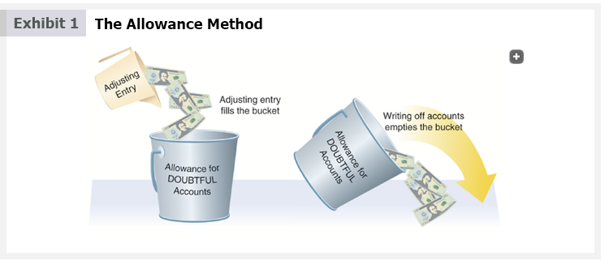

To illustrate, assume that during 20Y2, ExTone Company writes off $26,750 of uncollectible accounts, including the $6,000 account of John Parker recorded on January 21, 20Y2. Allowance for Doubtful Accounts will have a credit balance of $3,250 ($30,000 – $26,750), computed as follows:

[Para ilustrar, suponga que durante 20Y2, ExTone Company cancela $26,750 de cuentas incobrables, incluida la cuenta de $6,000 de John Parker registrada el 21 de enero de 20Y2. La Provisión para Cuentas Dudosas tendrá un saldo acreedor de $3,250 ($30,000 – $26,750), calculado de la siguiente manera:]

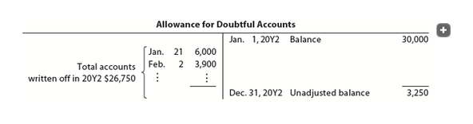</img>

| Allowance for Doubtful Accounts | | ||
|---|---|---|---|
| | | Jan. 1, 20Y1 Balance | 30,000 |
| Jan. 21 | 6,000 | ||
| Feb. 23 | 3,900 | ||
| ... | ... | ||
| **Total accounts written off in 20Y2** | **26,750** | |
| | | **Dec. 31, 20Y2 Unadjusted balance** | **3,250** |

If ExTone had written off $32,100 in accounts receivable during the second year, Allowance for Doubtful Accounts would have a debit balance of $2,100, computed as follows:

[Si ExTone hubiera cancelado $32,100 en cuentas por cobrar durante el segundo año, la Provisión para Cuentas Dudosas tendría un saldo deudor de $2,100, calculado de la siguiente manera:]

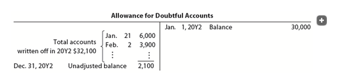</img>

| Allowance for Doubtful Accounts | | ||
|---|---|---|---|
| | | Jan. 1, 20Y1 Balance | 30,000 |
| Jan. 21 | 6,000 | |
| Feb. 23 | 3,900 | |
| ... | ... | |
| **Dec. 31, 20Y2 Unadjusted balance** | **2,100** | |

The allowance account balances (credit balance of $3,250 and debit balance of $2,100 in the preceding illustrations) are before the end-of-period adjusting entry. After the end-of-period adjusting entry is recorded, Allowance for Doubtful Accounts should always have a credit balance.

[Los saldos de la cuenta de provisión (saldo acreedor de $3,250 y saldo deudor de $2,100 en las ilustraciones anteriores) son antes del asiento de ajuste de fin de período. Después de que se registra el asiento de ajuste de fin de período, la Provisión para Cuentas Dudosas siempre debe tener un saldo acreedor.]

An account receivable that has been written off against the allowance account may be collected later. Like the direct write-off method, the account is reinstated by an entry that reverses the write-off entry. The cash received in payment is then recorded as a receipt on account.

[Una cuenta por cobrar que ha sido cancelada contra la cuenta de provisión puede ser cobrada más tarde. Al igual que el método de cancelación directa, la cuenta se restablece mediante un asiento que revierte el asiento de cancelación. El efectivo recibido como pago se registra entonces como un recibo a cuenta.]

To illustrate, assume that the John Parker account of $6,000 written off on January 21, 20Y2, is collected later on June 10. ExTone Company journalizes the reinstatement and the collection as follows:

[Para ilustrar, suponga que la cuenta de John Parker de $6,000 cancelada el 21 de enero de 20Y2 se cobra más tarde el 10 de junio. ExTone Company registra en el diario la restitución y el cobro de la siguiente manera:]

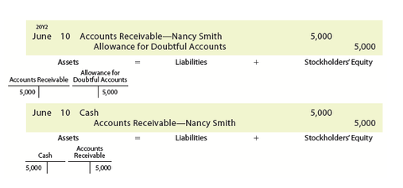</img>

| Date | Account | Debit | Credit |
|------|---------|-------|--------|
| June 10 | Accounts Receivable—John Parker | 6,000 | |
| | Allowance for Doubtful Accounts | | 6,000 |
| | *Reinstate previously written off account.* | | |
| June 10 | Cash | 6,000 | |
| | Accounts Receivable—John Parker | | 6,000 |
| | *Record collection of account.* | | |

---

**Link to Under Armour:** On a recent balance sheet, Under Armour reported net receivables of $708,714,000 and an allowance for uncollectible accounts of $15,100,000.

[**Enlace a Under Armour:** En un balance general reciente, Under Armour reportó cuentas por cobrar netas de $708,714,000 y una provisión para cuentas incobrables de $15,100,000.]

---

<h1 id="548731" style="color:#E65100;">
  <a href="#Chapter_008" style="color:inherit; text-decoration:none;">
    8-4b Estimating Uncollectibles
  </a>
</h1>

The allowance method requires an estimate of uncollectible accounts at the end of the period. This estimate of current expected credit losses is normally based on past experience, industry averages, current economic conditions, and forecasts of the future.

[El método de provisión requiere una estimación de cuentas incobrables al final del período. Esta estimación de pérdidas crediticias esperadas actuales normalmente se basa en la experiencia pasada, los promedios de la industria, las condiciones económicas actuales y los pronósticos del futuro.]

The two methods used to estimate uncollectible accounts are as follows:

[Los dos métodos utilizados para estimar cuentas incobrables son los siguientes:]

- Percent of sales method.  
  [Método de porcentaje de ventas.]

- Analysis of receivables method.  
  [Método de análisis de cuentas por cobrar.]

---

## Percent of Sales Method

Since accounts receivable are created by credit sales, uncollectible accounts can be estimated as a percent of credit sales. If the portion of credit sales to sales is relatively constant, the percent may be applied to total sales.

[Dado que las cuentas por cobrar se crean por ventas a crédito, las cuentas incobrables se pueden estimar como un porcentaje de las ventas a crédito. Si la proporción de ventas a crédito con respecto a las ventas totales es relativamente constante, el porcentaje se puede aplicar a las ventas totales.]

To illustrate, assume the following data for ExTone Company on December 31, 20Y2, before any adjustments:

[Para ilustrar, suponga los siguientes datos para ExTone Company el 31 de diciembre de 20Y2, antes de cualquier ajuste:]

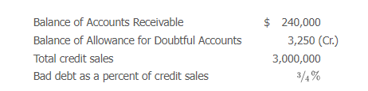</img>

| | Amount |
|---|---|
| Balance of Accounts Receivable | $240,000 |
| Balance of Allowance for Doubtful Accounts | 3,250 (Cr.) |
| Total credit sales | 3,000,000 |
| Bad debt as a percent of credit sales | 3/4% |

---

## Business Insight

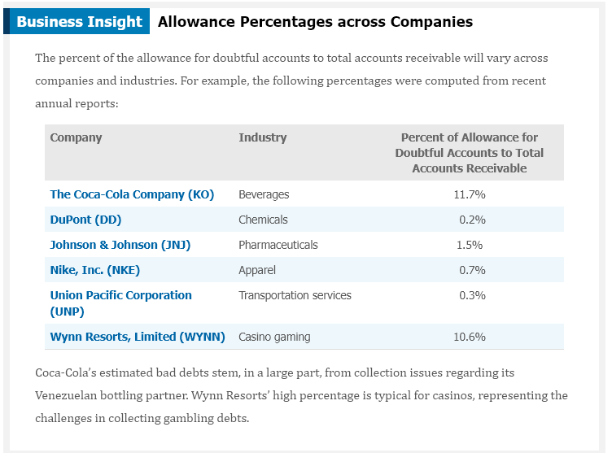</img>

### Allowance Percentages across Companies

[**Perspectiva de Negocio - Porcentajes de Provisión entre Empresas**]

The percent of the allowance for doubtful accounts to total accounts receivable will vary across companies and industries. For example, the following percentages were computed from recent annual reports:

[El porcentaje de la provisión para cuentas dudosas con respecto al total de cuentas por cobrar variará entre empresas e industrias. Por ejemplo, los siguientes porcentajes se calcularon a partir de informes anuales recientes:]

**Percent of Allowance for Doubtful Accounts to Total Accounts Receivable**

| Company | Industry | Accounts Receivable |
|---|---|---|
| The Coca-Cola Company (KO) | Beverages | 11.7% |
| DuPont (DD) | Chemicals | 0.2% |
| Johnson & Johnson (JNJ) | Pharmaceuticals | 1.5% |
| Nike, Inc. (NKE) | Apparel | 0.7% |
| Union Pacific Corporation (UNP) | Transportation services | 0.3% |
| Wynn Resorts, Limited (WYNN) | Casino gaming | 10.6% |

Coca-Cola's estimated bad debts stem, in a large part, from collection issues regarding its Venezuelan bottling partner. Wynn Resorts' high percentage is typical for casinos, representing the challenges in collecting gambling debts.

[Las deudas incobrables estimadas de Coca-Cola provienen, en gran parte, de problemas de cobro relacionados con su socio embotellador venezolano. El alto porcentaje de Wynn Resorts es típico de los casinos, lo que representa los desafíos en el cobro de deudas de juego.]

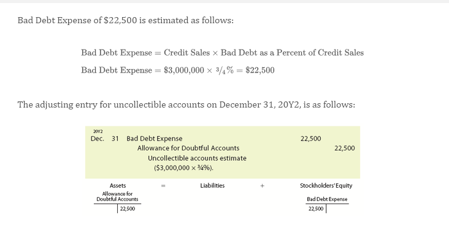</img>

Bad Debt Expense of $22,500 is estimated as follows:

[El Gasto por Deudas Incobrables de $22,500 se estima de la siguiente manera:]

$$\text{Bad Debt Expense} = \text{Credit Sales} \times \text{Bad Debt as a Percent of Credit Sales}$$
$$\text{Bad Debt Expense} = 3,000,000 \times \frac{3}{4}\% = 22,500$$

The adjusting entry for uncollectible accounts on December 31, 20Y2, is as follows:

[El asiento de ajuste para cuentas incobrables el 31 de diciembre de 20Y2 es el siguiente:]

| Date | Account | Debit | Credit |
|------|---------|-------|--------|
| Dec. 31 | Bad Debt Expense | 22,500 | |
| | Allowance for Doubtful Accounts | | 22,500 |
| | *Record estimated uncollectible accounts.* | | |

After the adjusting entry is posted to the ledger, Bad Debt Expense will have an adjusted balance of $22,500. Allowance for Doubtful Accounts will have an adjusted balance of $25,750 ($3,250 + $22,500). Both T accounts follow:

[Después de que se traslada el asiento de ajuste al libro mayor, el Gasto por Deudas Incobrables tendrá un saldo ajustado de $22,500. La Provisión para Cuentas Dudosas tendrá un saldo ajustado de $25,750 ($3,250 + $22,500). Ambas cuentas T son las siguientes:]

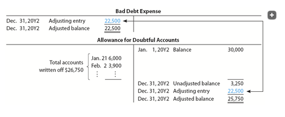</img>

Under the percent of sales method, the amount of the adjusting entry is the amount estimated for Bad Debt Expense. This estimate is credited to whatever the unadjusted balance is for Allowance for Doubtful Accounts.

[Bajo el método de porcentaje de ventas, el monto del asiento de ajuste es el monto estimado para el Gasto por Deudas Incobrables. Esta estimación se acredita a cualquier saldo no ajustado que tenga la Provisión para Cuentas Dudosas.]

To illustrate, if the unadjusted balance of Allowance for Doubtful Accounts on December 31, 20Y2, had been a $2,100 debit balance instead of a $3,250 credit balance. The adjustment would still have been $22,500. However, the December 31, 20Y2, ending adjusted balance of Allowance for Doubtful Accounts would have been $20,400 ($22,500 – $2,100).

[Para ilustrar, si el saldo no ajustado de la Provisión para Cuentas Dudosas el 31 de diciembre de 20Y2 hubiera sido un saldo deudor de $2,100 en lugar de un saldo acreedor de $3,250. El ajuste seguiría siendo de $22,500. Sin embargo, el saldo ajustado final de la Provisión para Cuentas Dudosas al 31 de diciembre de 20Y2 habría sido de $20,400 ($22,500 – $2,100).]

---

## Check Up Corner 8-1

### Percent of Sales Method

[**Esquina de Verificación 8-1 - Método de Porcentaje de Ventas**]

At the end of the current year, ARS Industries has the following account balances before making an adjusting entry for uncollectible accounts:

[Al final del año actual, ARS Industries tiene los siguientes saldos de cuenta antes de realizar un asiento de ajuste para cuentas incobrables:]

| | Amount |
|---|---|
| Accounts Receivable | $800,000 debit |
| Allowance for Doubtful Accounts | 7,500 credit |

The company recorded $3,500,000 of credit sales during the year. The company uses the percent of sales method and estimates that 1/2 of 1% of credit sales for the year will be uncollectible.

[La empresa registró $3,500,000 de ventas a crédito durante el año. La empresa utiliza el método de porcentaje de ventas y estima que 1/2 del 1% de las ventas a crédito del año serán incobrables.]

**a.** Determine the bad debt expense for the period, and journalize the adjusting entry.
**b.** Determine the adjusted balances of Allowance for Doubtful Accounts and Accounts Receivable.
**c.** Determine the net realizable value of accounts receivable at the end of the period.

[**a.** Determine el gasto por deudas incobrables para el período y registre en el diario el asiento de ajuste.
**b.** Determine los saldos ajustados de la Provisión para Cuentas Dudosas y las Cuentas por Cobrar.
**c.** Determine el valor neto realizable de las cuentas por cobrar al final del período.]

---

### Solution - Check Up Corner 8-1

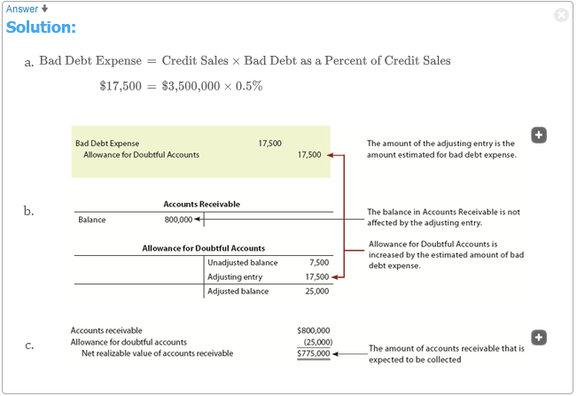</img>

[**Solución - Esquina de Verificación 8-1**]

| Date | Account | Debit | Credit |
|------|---------|-------|--------|
| Dec. 31 | Bad Debt Expense | 17,500 | |
| | Allowance for Doubtful Accounts | | 17,500 |
| | *Record estimated uncollectible accounts.* | | |

**Calculations:**
- Bad Debt Expense = $3,500,000 × 1/2% = **$17,500**
- Allowance for Doubtful Accounts (adjusted) = $7,500 + $17,500 = **$25,000** credit
- Accounts Receivable (adjusted) = **$800,000** debit
- Net Realizable Value = $800,000 – $25,000 = **$775,000**

---

## Analysis of Receivables Method

The analysis of receivables method is based on the assumption that the longer an account receivable is outstanding, the less likely that it will be collected. The analysis of receivables method is applied as follows:

[El método de análisis de cuentas por cobrar se basa en el supuesto de que cuanto más tiempo esté pendiente una cuenta por cobrar, menos probable será que se cobre. El método de análisis de cuentas por cobrar se aplica de la siguiente manera:]

**Step 1.** The due date of each account receivable is determined.
[**Paso 1.** Se determina la fecha de vencimiento de cada cuenta por cobrar.]

**Step 2.** The number of days each account is past due is determined. This is the number of days between the due date of the account and the date of the analysis.
[**Paso 2.** Se determina el número de días que cada cuenta está vencida. Este es el número de días entre la fecha de vencimiento de la cuenta y la fecha del análisis.]

**Step 3.** Each account is placed in an aged class according to its days past due. Typical aged classes include the following:
[**Paso 3.** Cada cuenta se coloca en una clase de antigüedad según sus días de vencimiento. Las clases de antigüedad típicas incluyen las siguientes:]

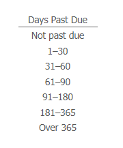</img>

- Not past due
- 1–30 days
- 31–60 days
- 61–90 days
- 91–180 days
- 181–365 days
- Over 365 days

**Step 4.** The totals for each aged class are determined.
[**Paso 4.** Se determinan los totales para cada clase de antigüedad.]

**Step 5.** The total for each aged class is multiplied by an estimated percentage of uncollectible accounts for that class.
[**Paso 5.** El total de cada clase de antigüedad se multiplica por un porcentaje estimado de cuentas incobrables para esa clase.]

**Step 6.** The estimated total of uncollectible accounts is determined as the sum of the uncollectible accounts for each aged class.
[**Paso 6.** El total estimado de cuentas incobrables se determina como la suma de las cuentas incobrables para cada clase de antigüedad.]

The preceding steps are summarized in an aging schedule, and this overall process is called **aging the receivables** (The process of analyzing the accounts receivable and classifying them according to various age groupings, with the due date being the base point for determining age.)

[Los pasos anteriores se resumen en un cronograma de antigüedad, y este proceso general se llama **envejecimiento de las cuentas por cobrar** (el proceso de analizar las cuentas por cobrar y clasificarlas según varias agrupaciones de edad, siendo la fecha de vencimiento el punto base para determinar la edad).]

To illustrate, assume that ExTone Company uses the analysis of receivables method instead of the percent of sales method. ExTone prepared an aging schedule for its accounts receivable of $240,000 as of December 31, 20Y2, as shown in Exhibit 2.

[Para ilustrar, suponga que ExTone Company utiliza el método de análisis de cuentas por cobrar en lugar del método de porcentaje de ventas. ExTone preparó un cronograma de antigüedad para sus cuentas por cobrar de $240,000 al 31 de diciembre de 20Y2, como se muestra en la Figura 2.]

---

## Exhibit 2

### Aging of Receivables Schedule, December 31, 20Y2

[**Figura 2** - Cronograma de Antigüedad de Cuentas por Cobrar, 31 de diciembre de 20Y2]

<!-- 📍 IMAGEN: Exhibit 2 - Aging of Receivables Schedule (página 5) -->

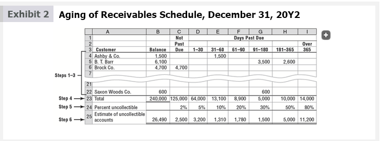

Assume that ExTone sold merchandise to Saxon Woods Co. on August 29, 20Y2, with terms 2/10, n/30. Thus, the due date (Step 1) of Saxon Woods' account is September 28, 20Y2, computed as follows:

[Suponga que ExTone vendió mercancía a Saxon Woods Co. el 29 de agosto de 20Y2, con términos 2/10, n/30. Por lo tanto, la fecha de vencimiento (Paso 1) de la cuenta de Saxon Woods es el 28 de septiembre de 20Y2, calculada de la siguiente manera:]

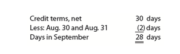</img>

As of December 31, 20Y2, Saxon Woods' account is 94 days past due (Step 2), computed as follows:

[Al 31 de diciembre de 20Y2, la cuenta de Saxon Woods tiene 94 días de vencimiento (Paso 2), calculado de la siguiente manera:]

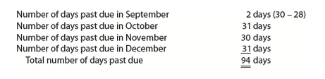</img>

Exhibit 2 shows that the $600 account receivable for Saxon Woods Co. was placed in the 91–180 days past due class (Step 3).

[La Figura 2 muestra que la cuenta por cobrar de $600 para Saxon Woods Co. se colocó en la clase de 91–180 días de vencimiento (Paso 3).]

The total for each of the aged classes is determined (Step 4). Exhibit 2 shows that $125,000 of the accounts receivable are not past due, while $64,000 are 1–30 days past due. ExTone applies a different estimated percentage of uncollectible accounts to the totals of each of the aged classes (Step 5). As shown in Exhibit 2, the percent is 2% for accounts not past due, while the percent is 80% for accounts over 365 days past due.

[El total para cada una de las clases de antigüedad se determina (Paso 4). La Figura 2 muestra que $125,000 de las cuentas por cobrar no están vencidas, mientras que $64,000 tienen de 1 a 30 días de vencimiento. ExTone aplica un porcentaje estimado diferente de cuentas incobrables a los totales de cada una de las clases de antigüedad (Paso 5). Como se muestra en la Figura 2, el porcentaje es del 2% para las cuentas no vencidas, mientras que el porcentaje es del 80% para las cuentas con más de 365 días de vencimiento.]

The sum of the estimated uncollectible accounts for each aged class (Step 6) is the estimated uncollectible accounts on December 31, 20Y2. This is the desired adjusted balance for Allowance for Doubtful Accounts. For ExTone, this amount is $26,490, as shown in Exhibit 2.

[La suma de las cuentas incobrables estimadas para cada clase de antigüedad (Paso 6) es la estimación de cuentas incobrables al 31 de diciembre de 20Y2. Este es el saldo ajustado deseado para la Provisión para Cuentas Dudosas. Para ExTone, este monto es de $26,490, como se muestra en la Figura 2.]

Comparing the estimate of $26,490 with the unadjusted balance of the allowance account determines the amount of the adjustment for Bad Debt Expense. For ExTone, the unadjusted balance of the allowance account is a credit balance of $3,250. The amount to be added to this balance is therefore $23,240 ($26,490 – $3,250). The adjusting entry is as follows:

[Comparando la estimación de $26,490 con el saldo no ajustado de la cuenta de provisión se determina el monto del ajuste para el Gasto por Deudas Incobrables. Para ExTone, el saldo no ajustado de la cuenta de provisión es un saldo acreedor de $3,250. El monto que se debe agregar a este saldo es, por lo tanto, $23,240 ($26,490 – $3,250). El asiento de ajuste es el siguiente:]

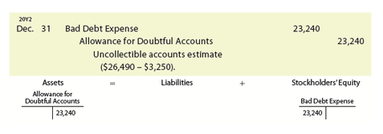</img>

| Date | Account | Debit | Credit |
|------|---------|-------|--------|
| Dec. 31 | Bad Debt Expense | 23,240 | |
| | Allowance for Doubtful Accounts | | 23,240 |
| | *Record estimated uncollectible accounts.* | | |

After the preceding adjusting entry is posted to the ledger, Bad Debt Expense will have an adjusted balance of $23,240. Allowance for Doubtful Accounts will have an adjusted balance of $26,490, and the net realizable value of the receivables is $213,510 ($240,000 – $26,490). Both T accounts follow:

[Después de que se traslada el asiento de ajuste anterior al libro mayor, el Gasto por Deudas Incobrables tendrá un saldo ajustado de $23,240. La Provisión para Cuentas Dudosas tendrá un saldo ajustado de $26,490, y el valor neto realizable de las cuentas por cobrar es de $213,510 ($240,000 – $26,490). Ambas cuentas T son las siguientes:]

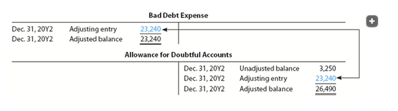</img>

**Allowance for Doubtful Accounts**
| Debit | Credit |
|-------|--------|
| | Dec. 31, 20Y1 Balance | 3,250 |
| | Dec. 31 Adjusting Entry | 23,240 |
| | **Dec. 31, 20Y2 Balance** | **26,490** |

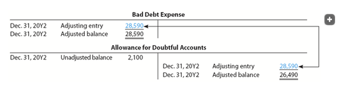</img>

**Bad Debt Expense**
| Debit | Credit |
|-------|--------|
| Dec. 31 Adjusting Entry | 23,240 |
| **Dec. 31, 20Y2 Balance** | **23,240** |

Under the analysis of receivables method, the amount of the adjusting entry is the amount that will yield an adjusted balance for Allowance for Doubtful Accounts equal to that estimated by the aging schedule.

[Bajo el método de análisis de cuentas por cobrar, el monto del asiento de ajuste es el monto que producirá un saldo ajustado para la Provisión para Cuentas Dudosas igual al estimado por el cronograma de antigüedad.]

To illustrate, if the unadjusted balance of the allowance account had been a debit balance of $2,100, the amount of the adjustment would have been $28,590 ($26,490 + $2,100). In this case, Bad Debt Expense would have an adjusted balance of $28,590. However, the adjusted balance of Allowance for Doubtful Accounts would still have been $26,490.

[Para ilustrar, si el saldo no ajustado de la cuenta de provisión hubiera sido un saldo deudor de $2,100, el monto del ajuste habría sido de $28,590 ($26,490 + $2,100). En este caso, el Gasto por Deudas Incobrables habría tenido un saldo ajustado de $28,590. Sin embargo, el saldo ajustado de la Provisión para Cuentas Dudosas seguiría siendo de $26,490.]

---

## Check Up Corner 8-2

### Analysis of Receivables Method

[**Esquina de Verificación 8-2 - Método de Análisis de Cuentas por Cobrar**]

At the end of the current year, ARS Industries has the following account balances before making an adjusting entry for uncollectible accounts:

[Al final del año actual, ARS Industries tiene los siguientes saldos de cuenta antes de realizar un asiento de ajuste para cuentas incobrables:]

| | Amount |
|---|---|
| Accounts Receivable | $800,000 debit |
| Allowance for Doubtful Accounts | 7,500 credit |

The company recorded $3,500,000 of credit sales during the year. An aging of the company's accounts receivable on December 31 and a historical analysis of the percentage of uncollectible accounts in each age class follow:

[La empresa registró $3,500,000 de ventas a crédito durante el año. Un envejecimiento de las cuentas por cobrar de la empresa al 31 de diciembre y un análisis histórico del porcentaje de cuentas incobrables en cada clase de edad son los siguientes:]

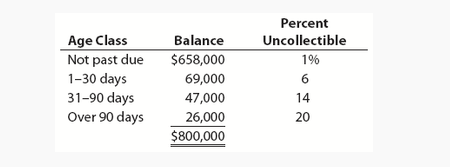</img>

The company estimates the allowance for doubtful accounts based on the analysis of receivables method.

[La empresa estima la provisión para cuentas dudosas basándose en el método de análisis de cuentas por cobrar.]

**a.** Determine the bad debt expense for the period, and journalize the adjusting entry.
**b.** Determine the adjusted balances of Allowance for Doubtful Accounts and Accounts Receivable.
**c.** Determine the net realizable value of accounts receivable at the end of the period.

[**a.** Determine el gasto por deudas incobrables para el período y registre en el diario el asiento de ajuste.
**b.** Determine los saldos ajustados de la Provisión para Cuentas Dudosas y las Cuentas por Cobrar.
**c.** Determine el valor neto realizable de las cuentas por cobrar al final del período.]

---

### Solution - Check Up Corner 8-2

[**Solución - Esquina de Verificación 8-2**]

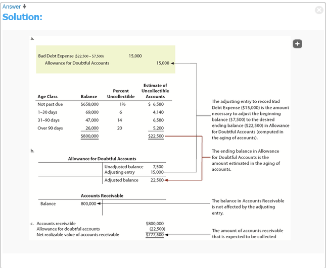</img>

---

## Comparing Estimation Methods

Both the percent of sales and analysis of receivables methods estimate uncollectible accounts. However, each method has a slightly different focus and financial statement emphasis.

[Tanto el método de porcentaje de ventas como el de análisis de cuentas por cobrar estiman las cuentas incobrables. Sin embargo, cada método tiene un enfoque ligeramente diferente y un énfasis en los estados financieros.]

Under the percent of sales method, Bad Debt Expense is the focus of the estimation process. The percent of sales method places more emphasis on matching revenues and expenses and, thus, emphasizes the income statement. That is, the amount of the adjusting entry is based on the estimate of Bad Debt Expense for the period. Allowance for Doubtful Accounts is then credited for this amount.

[Bajo el método de porcentaje de ventas, el Gasto por Deudas Incobrables es el enfoque del proceso de estimación. El método de porcentaje de ventas pone más énfasis en la correspondencia de ingresos y gastos y, por lo tanto, enfatiza el estado de resultados. Es decir, el monto del asiento de ajuste se basa en la estimación del Gasto por Deudas Incobrables para el período. La Provisión para Cuentas Dudosas se acredita entonces por este monto.]

Under the analysis of receivables method, Allowance for Doubtful Accounts is the focus of the estimation process. The analysis of receivables method places more emphasis on the net realizable value of the receivables and, thus, emphasizes the balance sheet. That is, the amount of the adjusting entry is the amount that will yield an adjusted balance for Allowance for Doubtful Accounts equal to that estimated by the aging schedule. Bad Debt Expense is then debited for this amount.

[Bajo el método de análisis de cuentas por cobrar, la Provisión para Cuentas Dudosas es el enfoque del proceso de estimación. El método de análisis de cuentas por cobrar pone más énfasis en el valor neto realizable de las cuentas por cobrar y, por lo tanto, enfatiza el balance general. Es decir, el monto del asiento de ajuste es el monto que producirá un saldo ajustado para la Provisión para Cuentas Dudosas igual al estimado por el cronograma de antigüedad. El Gasto por Deudas Incobrables se debita entonces por este monto.]

Exhibit 3 summarizes these differences between the percent of sales and the analysis of receivables methods. Exhibit 3 also shows the results of the ExTone Company illustration for the percent of sales and analysis of receivables methods. The amounts shown in Exhibit 3 assume an unadjusted credit balance of $3,250 for Allowance for Doubtful Accounts. While the methods normally yield different amounts for any one period, over several periods the amounts should be similar.

[La Figura 3 resume estas diferencias entre el método de porcentaje de ventas y el de análisis de cuentas por cobrar. La Figura 3 también muestra los resultados de la ilustración de ExTone Company para los métodos de porcentaje de ventas y de análisis de cuentas por cobrar. Los montos mostrados en la Figura 3 asumen un saldo acreedor no ajustado de $3,250 para la Provisión para Cuentas Dudosas. Si bien los métodos normalmente producen diferentes montos para cualquier período, durante varios períodos los montos deberían ser similares.]

---

## Exhibit 3

### Difference between Estimation Methods

[**Figura 3** - Diferencia entre Métodos de Estimación]

<!-- 📍 IMAGEN: Exhibit 3 - Difference between Estimation Methods (página 9) -->

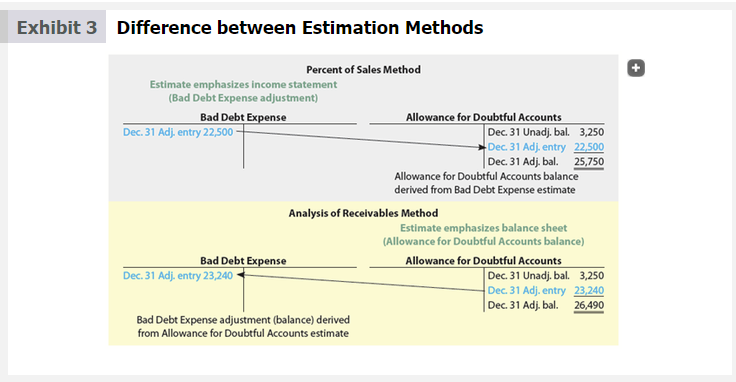

---

## Using Data Analytics

### Collectability of Credit Sales

[**Uso de Analítica de Datos - Cobrabilidad de Ventas a Crédito**]

Most retail businesses accept only cash or credit card payments from customers. As a result, these companies do not have to assess the creditworthiness of their customers or the collectability of their credit sales (accounts receivable). For these businesses, "cash and carry" is an efficient way of doing business.

[La mayoría de los negocios minoristas aceptan solo pagos en efectivo o con tarjeta de crédito de los clientes. Como resultado, estas empresas no tienen que evaluar la solvencia de sus clientes ni la cobrabilidad de sus ventas a crédito (cuentas por cobrar). Para estos negocios, "pague y lleve" es una forma eficiente de hacer negocios.]

Other types of businesses, such as suppliers of merchandise to retail businesses, frequently ship merchandise on credit. For example, suppliers such as The Procter & Gamble Company (PG) sell merchandise to a variety of different types of retail stores, from local convenience stores to large retail chains such as Costco (COST), Target (TGT), and Walmart (WMT).

[Otros tipos de negocios, como los proveedores de mercancía a negocios minoristas, envían con frecuencia mercancía a crédito. Por ejemplo, proveedores como The Procter & Gamble Company (PG) venden mercancía a una variedad de diferentes tipos de tiendas minoristas, desde tiendas de conveniencia locales hasta grandes cadenas minoristas como Costco (COST), Target (TGT) y Walmart (WMT).]

Companies like Procter & Gamble can use data analytics to assess the collectability and timeliness of payments from different classes of customers. For example, large retail chains such as Costco would normally pay their receivables but might take longer to pay. In contrast, credit sales to small, locally owned stores might be more likely to be uncollectible. By using data analytics, a retail supplier might implement different credit procedures and credit terms for each class of customer.

[Empresas como Procter & Gamble pueden utilizar la analítica de datos para evaluar la cobrabilidad y la puntualidad de los pagos de diferentes clases de clientes. Por ejemplo, las grandes cadenas minoristas como Costco normalmente pagarían sus cuentas por cobrar, pero podrían tardar más en pagar. En contraste, las ventas a crédito a pequeñas tiendas de propiedad local podrían ser más propensas a ser incobrables. Mediante el uso de la analítica de datos, un proveedor minorista podría implementar diferentes procedimientos de crédito y términos de crédito para cada clase de cliente.]

*See TIF 8-6 for a homework assignment using data analytics.*

---

<h1 id="503219" style="color:#E65100;">
  <a href="#Chapter_008" style="color:inherit; text-decoration:none;">
    8-5 Comparing Direct Write-Off and Allowance Methods
  </a>
</h1>

Journal entries for the direct write-off and allowance methods are illustrated and compared in this section. As a basis for illustration, the following transactions, taken from the records of Hobbs Company for the year ending December 31, 20Y6, are used:

[Los asientos de diario para los métodos de cancelación directa y de provisión se ilustran y comparan en esta sección. Como base para la ilustración, se utilizan las siguientes transacciones, tomadas de los registros de Hobbs Company para el año que termina el 31 de diciembre de 20Y6:]

**Objective 5** - Compare the direct write-off and allowance methods of accounting for uncollectible accounts.

[**Objetivo 5** - Comparar los métodos de cancelación directa y de provisión de contabilidad para cuentas incobrables.]

- **Mar. 1.** Wrote off account of C. York, $3,650.
- **Apr. 12.** Received $2,250 as partial payment on the $5,500 account of Cary Bradshaw. Wrote off the remaining balance as uncollectible.
- **June 22.** Received the $3,650 from C. York, which had been written off on March 1. Reinstated the account and recorded the cash receipt.
- **Sept. 7.** Wrote off the following accounts as uncollectible (record as one journal entry):

| Customer | Amount |
|---|---|
| Jason Bigg | $1,100 |
| Steve Bradley | 2,220 |
| Samantha Neeley | 775 |
| Stanford Noonan | 1,360 |
| Aiden Wyman | 990 |
| **Total** | **$6,445** |

- **Dec. 31.** Hobbs Company uses the percent of credit sales method of estimating uncollectible expenses. Based on past history and industry averages, 1.25% of credit sales are expected to be uncollectible. Hobbs recorded $3,400,000 of credit sales during the year.

Exhibit 4 illustrates the journal entries for Hobbs using the direct write-off and allowance methods. Using the direct write-off method, there is no adjusting entry on December 31 for uncollectible accounts. In contrast, the allowance method records an adjusting entry for estimated uncollectible accounts of $42,500.

[La Figura 4 ilustra los asientos de diario para Hobbs utilizando los métodos de cancelación directa y de provisión. Utilizando el método de cancelación directa, no hay un asiento de ajuste el 31 de diciembre para cuentas incobrables. En contraste, el método de provisión registra un asiento de ajuste para cuentas incobrables estimadas de $42,500.]

---

## Exhibit 4

### Comparing Direct Write-Off and Allowance Methods

[**Figura 4** - Comparación de los Métodos de Cancelación Directa y de Provisión]

<!-- 📍 IMAGEN: Exhibit 4 - Comparing Direct Write-Off and Allowance Methods (páginas 1-2) -->

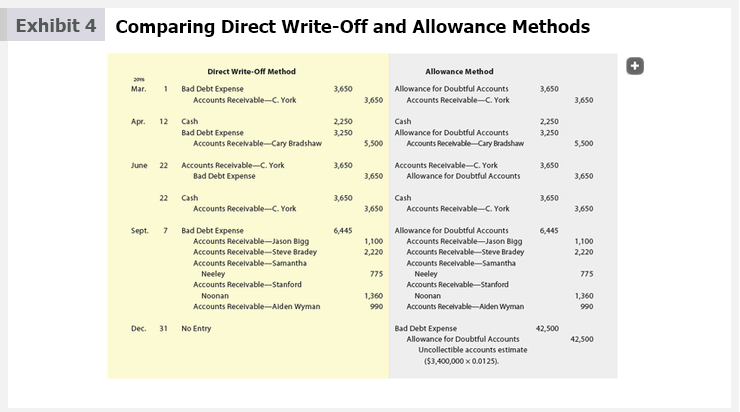

| Transaction | Direct Write-Off Method | Allowance Method |
|---|---|---|
| **Mar. 1** Write off account of C. York, $3,650. | Bad Debt Expense 3,650 Accounts Receivable—C. York 3,650 | Allowance for Doubtful Accounts 3,650 Accounts Receivable—C. York 3,650 |
| **Apr. 12** Received $2,250 partial payment from Cary Bradshaw; wrote off remaining $3,250. | Cash 2,250 Bad Debt Expense 3,250 Accounts Receivable—C. Bradshaw 5,500 | Cash 2,250 Allowance for Doubtful Accounts 3,250 Accounts Receivable—C. Bradshaw 5,500 |
| **June 22** Received $3,650 from C. York, previously written off. | Accounts Receivable—C. York 3,650 Bad Debt Expense 3,650 Cash 3,650 Accounts Receivable—C. York 3,650 | Accounts Receivable—C. York 3,650 Allowance for Doubtful Accounts 3,650 Cash 3,650 Accounts Receivable—C. York 3,650 |
| **Sept. 7** Write off accounts totaling $6,445. | Bad Debt Expense 6,445 Accounts Receivable 6,445 | Allowance for Doubtful Accounts 6,445 Accounts Receivable 6,445 |
| **Dec. 31** Adjusting entry for estimated uncollectibles: 1.25% × $3,400,000 = $42,500. | No entry | Bad Debt Expense 42,500 Allowance for Doubtful Accounts 42,500 |

---

## Exhibit 5

### Direct Write-Off and Allowance Methods

[**Figura 5** - Métodos de Cancelación Directa y de Provisión]

<!-- 📍 IMAGEN: Exhibit 5 - Direct Write-Off and Allowance Methods (página 2) -->

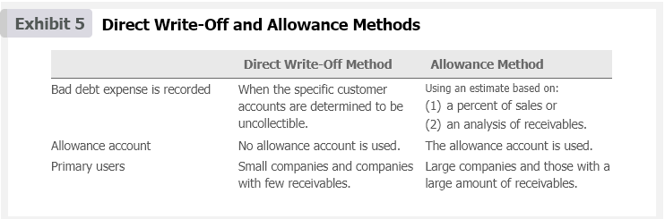

| | Direct Write-Off Method | Allowance Method |
|---|---|---|
| **Bad debt expense is recorded** | When the specific customer accounts are determined to be uncollectible. | Using an estimate based on: a) percent of sales or b) analysis of receivables. |
| **Allowance account** | No allowance account is used. | The allowance account is used. |
| **Primary users** | Small companies and companies with few receivables. | Large companies and those with a large amount of receivables. |

---

<h1 id="446122" style="color:#E65100;">
  <a href="#Chapter_008" style="color:inherit; text-decoration:none;">
    8-6 Notes Receivable
  </a>
</h1>

# 8-6 Notes Receivable

A note has some advantages over an account receivable. By signing a note, the debtor recognizes the debt and agrees to pay it according to its terms. Thus, a note is a stronger legal claim.

[Una nota tiene algunas ventajas sobre una cuenta por cobrar. Al firmar una nota, el deudor reconoce la deuda y acepta pagarla según sus términos. Por lo tanto, una nota es un reclamo legal más sólido.]

**Objective 6** - Describe the accounting for notes receivable.

[**Objetivo 6** - Describir la contabilidad para las notas por cobrar.]

---

<h1 id="888612" style="color:#E65100;">
  <a href="#Chapter_008" style="color:inherit; text-decoration:none;">
    8-6a Characteristics of Notes Receivable
  </a>
</h1>

A promissory note is a written promise to pay the face amount, usually with interest, on demand or at a date in the future. Characteristics of a promissory note are as follows:

[Un pagaré es una promesa escrita de pagar el monto nominal, generalmente con intereses, a la vista o en una fecha futura. Las características de un pagaré son las siguientes:]

1. The **maker** is the party making the promise to pay.
2. The **payee** is the party to whom the note is payable.
3. The **face amount** is the amount for which the note is written on its face.
4. The **issuance date** is the date a note is issued.
5. The **due date** or **maturity date** is the date the note is to be paid.
6. The **term** of a note is the amount of time between the issuance and due dates.
7. The **interest rate** is that rate of interest that must be paid on the face amount for the term of the note.

[1. El **suscriptor** es la parte que hace la promesa de pagar.
2. El **beneficiario** es la parte a quien se le paga la nota.
3. El **monto nominal** es el monto por el cual se escribe la nota en su cara.
4. La **fecha de emisión** es la fecha en que se emite una nota.
5. La **fecha de vencimiento** es la fecha en que se debe pagar la nota.
6. El **plazo** de una nota es el período de tiempo entre las fechas de emisión y vencimiento.
7. La **tasa de interés** es la tasa de interés que debe pagarse sobre el monto nominal durante el plazo de la nota.]

Exhibit 6 illustrates a promissory note.

[La Figura 6 ilustra un pagaré.]

---

## Exhibit 6

### Promissory Note

[**Figura 6** - Pagaré]

<!-- 📍 IMAGEN: Exhibit 6 - Promissory Note (coordenadas [106, 589, 865, 881]) -->

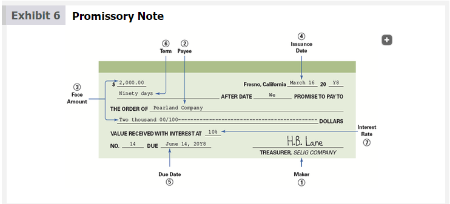

The maker of the note is Selig Company, and the payee is Pearland Company. The face value of the note is $2,000, the interest rate is 10%, and the issuance date is March 16, 20Y8. The term of the note is 90 days, which results in a due date of June 14, 20Y8, computed as follows and shown in Exhibit 7:

[El suscriptor de la nota es Selig Company, y el beneficiario es Pearland Company. El valor nominal de la nota es de $2,000, la tasa de interés es del 10% y la fecha de emisión es el 16 de marzo de 20Y8. El plazo de la nota es de 90 días, lo que resulta en una fecha de vencimiento del 14 de junio de 20Y8, calculado de la siguiente manera y mostrado en la Figura 7:]

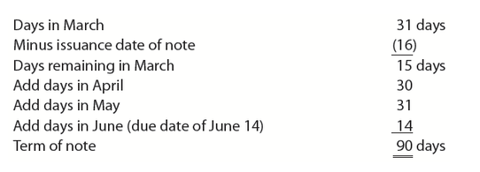</img>

---

## Exhibit 7

### Determining Due Date of Promissory Note

[**Figura 7** - Determinación de la Fecha de Vencimiento de un Pagaré]

<!-- 📍 IMAGEN: Exhibit 7 - Determining Due Date of Promissory Note (coordenadas [106, 255, 865, 473]) -->

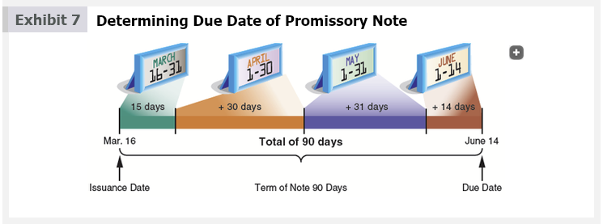

The interest on a note is computed as follows:

[El interés de una nota se calcula de la siguiente manera:]

$$\text{Interest} = \text{Face Amount} \times \text{Interest Rate} \times \frac{\text{Term}}{360 \text{ days}}$$

The interest rate is stated on an annual (yearly) basis, while the term is expressed as days. Thus, the interest on the note in Exhibit 6 is computed as follows:

[La tasa de interés se expresa sobre una base anual, mientras que el plazo se expresa en días. Por lo tanto, el interés de la nota en la Figura 6 se calcula de la siguiente manera:]

$$\text{Interest} = \$2,000 \times 10\% \times \frac{90}{360} = \$50$$

To simplify, 360 days per year will be used. In practice, companies such as banks and mortgage companies use the exact number of days in a year, 365.

[Para simplificar, se utilizarán 360 días por año. En la práctica, empresas como bancos y compañías hipotecarias utilizan el número exacto de días en un año, 365.]

The **maturity value** (The amount that is due at the maturity or due date of a note, which is the sum of the face amount and any interest.) is the amount that must be paid at the due date of the note, which is the sum of the face amount and the interest. The maturity value of the note in Exhibit 6 is $2,050 ($2,000 + $50).

[El **valor al vencimiento** (el monto que debe pagarse en la fecha de vencimiento de una nota, que es la suma del monto nominal y cualquier interés) es el monto que debe pagarse en la fecha de vencimiento de la nota, que es la suma del monto nominal y los intereses. El valor al vencimiento de la nota en la Figura 6 es de $2,050 ($2,000 + $50).]

---

<h1 id="388535" style="color:#E65100;">
  <a href="#Chapter_008" style="color:inherit; text-decoration:none;">
    8-6b Accounting for Notes Receivable
  </a>
</h1>

A promissory note may be received by a company from a customer to replace an account receivable. In such cases, the promissory note is recorded as a note receivable.

[Un pagaré puede ser recibido por una empresa de un cliente para reemplazar una cuenta por cobrar. En tales casos, el pagaré se registra como una nota por cobrar.]

To illustrate, assume that a company accepts a 30-day, 12% note dated November 21 in settlement of the account of W. A. Bunn Co., which is past due and has a balance of $6,000. The company journals the receipt of the note as follows:

[Para ilustrar, suponga que una empresa acepta una nota de 30 días al 12% fechada el 21 de noviembre en liquidación de la cuenta de W. A. Bunn Co., que está vencida y tiene un saldo de $6,000. La empresa registra en el diario la recepción de la nota de la siguiente manera:]

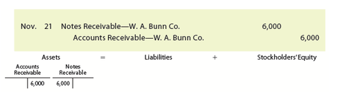</img>

| Date | Account | Debit | Credit |
|------|---------|-------|--------|
| Nov. 21 | Notes Receivable | 6,000 | |
| | Accounts Receivable—W. A. Bunn Co. | | 6,000 |
| | *Received 30-day, 12% note to settle account.* | | |

At the due date, the company journals the receipt of $6,060 ($6,000 face amount plus $60 interest) as follows:

[En la fecha de vencimiento, la empresa registra en el diario la recepción de $6,060 ($6,000 de monto nominal más $60 de interés) de la siguiente manera:]

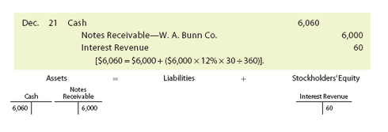</img>

| Date | Account | Debit | Credit |
|------|---------|-------|--------|
| Dec. 21 | Cash | 6,060 | |
| | Notes Receivable | | 6,000 |
| | Interest Revenue | | 60 |
| | *Collected note and interest.* | | |

If the maker of a note fails to pay the note on the due date, the note is a **dishonored note receivable** (A note that the maker fails to pay on the due date.). A company that holds a dishonored note transfers the face amount of the note plus any interest due back to an accounts receivable account. For example, assume that the $6,000 30-day, 12% note received from W. A. Bunn Co. and recorded on November 21 is dishonored. The company holding the note transfers the note and interest back to the customer's account as follows:

[Si el suscriptor de una nota no paga la nota en la fecha de vencimiento, la nota es una **nota por cobrar deshonrada** (una nota que el suscriptor no paga en la fecha de vencimiento). Una empresa que tiene una nota deshonrada transfiere el monto nominal de la nota más cualquier interés adeudado de vuelta a una cuenta por cobrar. Por ejemplo, suponga que la nota de $6,000 a 30 días al 12% recibida de W. A. Bunn Co. y registrada el 21 de noviembre es deshonrada. La empresa que tiene la nota transfiere la nota y los intereses de vuelta a la cuenta del cliente de la siguiente manera:]

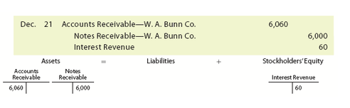</img>

| Date | Account | Debit | Credit |
|------|---------|-------|--------|
| Dec. 21 | Accounts Receivable—W. A. Bunn Co. | 6,060 | |
| | Notes Receivable | | 6,000 |
| | Interest Revenue | | 60 |
| | *Dishonored note.* | | |

The company has earned the interest of $60, even though the note is dishonored. If the account receivable is uncollectible, the company will write off $6,060 against Allowance for Doubtful Accounts.

[La empresa ha ganado el interés de $60, aunque la nota sea deshonrada. Si la cuenta por cobrar es incobrable, la empresa cancelará $6,060 contra la Provisión para Cuentas Dudosas.]

A company receiving a note should record an adjusting entry for any accrued interest at the end of the period. For example, assume that Crawford Company issues a $4,000, 90-day, 12% note dated December 1, 20Y3, to settle its account receivable. If the accounting period ends on December 31, 20Y3, the company receiving the note would journalize the following entries:

[Una empresa que recibe una nota debe registrar un asiento de ajuste por cualquier interés acumulado al final del período. Por ejemplo, suponga que Crawford Company emite una nota de $4,000 a 90 días al 12% fechada el 1 de diciembre de 20Y3 para liquidar su cuenta por cobrar. Si el período contable termina el 31 de diciembre de 20Y3, la empresa que recibe la nota registraría en el diario los siguientes asientos:]

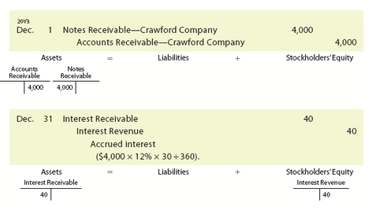</img>

| Date | Account | Debit | Credit |
|------|---------|-------|--------|
| Dec. 1 | Notes Receivable | 4,000 | |
| | Accounts Receivable—Crawford Company | | 4,000 |
| | *Received 90-day, 12% note to settle account.* | | |
| Dec. 31 | Interest Receivable | 40 | |
| | Interest Revenue | | 40 |
| | *Accrued interest on note ($4,000 × 12% × 30/360 = $40).* | | |

The receipt of the maturity value of the note on its due date of March 1, 20Y4, is recorded as follows:

[La recepción del valor al vencimiento de la nota en su fecha de vencimiento del 1 de marzo de 20Y4 se registra de la siguiente manera:]

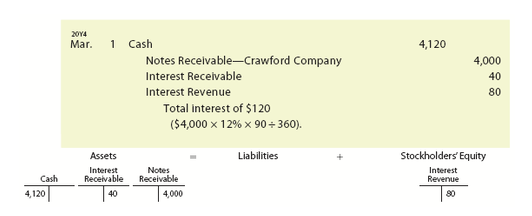</img>

| Date | Account | Debit | Credit |
|------|---------|-------|--------|
| Mar. 1 | Cash | 4,120 | |
| | Notes Receivable | | 4,000 |
| | Interest Receivable | | 40 |
| | Interest Revenue | | 80 |
| | *Collected note and interest ($4,000 × 12% × 90/360 = $120; $120 – $40 accrued = $80).* | | |

The interest revenue account is closed at the end of each accounting period. The amount of interest revenue is normally reported in the "Other revenue and expense" section of the income statement.

[La cuenta de Ingresos por Intereses se cierra al final de cada período contable. El monto de los ingresos por intereses normalmente se reporta en la sección de "Otros ingresos y gastos" del estado de resultados.]

---

## Pathways Challenge

### This Is Accounting!

### Economic Activity

[**Desafío Pathways - ¡Esto es Contabilidad! - Actividad Económica**]

When a company sells goods or services on credit, it is exposed to credit risk—the risk that the account will be uncollectible and, thus, the company will not receive what it is owed. Some types of accounts receivable are more susceptible to credit risk than others. For example, Wynn Resorts (WYNN) operates resorts and casinos located in Las Vegas, Nevada, and Macau, China. Casino revenue represents over 71% of its total revenue. A major portion of its casino accounts receivable comes from international customers.

[Cuando una empresa vende bienes o servicios a crédito, está expuesta al riesgo de crédito —el riesgo de que la cuenta sea incobrable y, por lo tanto, la empresa no reciba lo que se le debe. Algunos tipos de cuentas por cobrar son más susceptibles al riesgo de crédito que otros. Por ejemplo, Wynn Resorts (WYNN) opera centros turísticos y casinos ubicados en Las Vegas, Nevada, y Macao, China. Los ingresos de los casinos representan más del 71% de sus ingresos totales. Una parte importante de sus cuentas por cobrar de casinos proviene de clientes internacionales.]

#### Critical Thinking/Judgment

[**Pensamiento Crítico/Juicio**]

1. On its balance sheet, should Wynn Resorts report casino accounts receivable separately from its other business-related accounts receivable?  
(En su balance general, ¿debería Wynn Resorts reportar las cuentas por cobrar de casinos por separado de sus otras cuentas por cobrar relacionadas con el negocio?)

2. Do you think accounts receivable from international casino customers are riskier than local casino customers? If so, why?  
(¿Cree que las cuentas por cobrar de clientes internacionales de casinos son más riesgosas que las de clientes locales? Si es así, ¿por qué?)

3. What percent of Wynn Resorts' casino accounts receivable would you estimate to be uncollectible?  
(¿Qué porcentaje de las cuentas por cobrar de casinos de Wynn Resorts estimaría que es incobrable?)

4. What percent of Wynn Resorts' other business-related accounts receivable would you estimate to be uncollectible?  
(¿Qué porcentaje de las otras cuentas por cobrar relacionadas con el negocio de Wynn Resorts estimaría que es incobrable?)

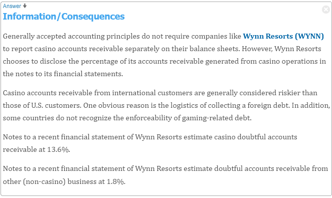</img>

---

## Check Up Corner 8-3

### Notes Receivable

[**Esquina de Verificación 8-3 - Notas por Cobrar**]

Icebreaker Company receives a 120-day, 6% note for $40,000, dated May 14, in settlement of a $40,000 account that is past due.

[Icebreaker Company recibe una nota de 120 días al 6% por $40,000, fechada el 14 de mayo, en liquidación de una cuenta de $40,000 que está vencida.]

**a.** Determine the due date of the note.
**b.** Determine the maturity value of the note.
**c.** Journalize the entries to record the (1) receipt of the note and (2) collection at maturity.

[**a.** Determine la fecha de vencimiento de la nota.
**b.** Determine el valor al vencimiento de la nota.
**c.** Registre en el diario los asientos para registrar (1) la recepción de la nota y (2) el cobro al vencimiento.]

---

### Solution - Check Up Corner 8-3

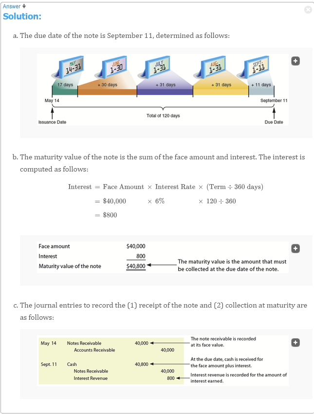</img>

[**Solución - Esquina de Verificación 8-3**]

**a. Due Date Calculation**

| Days remaining in May (31 – 14) | 17 days |
|---|---|
| Add days in June | 30 |
| Add days in July | 31 |
| Add days in August | 31 |
| Add days in September (due date) | 11 |
| **Term of note** | **120 days** |

**Due Date: September 11**

**b. Maturity Value Calculation**

| | Amount |
|---|---|
| Face amount | $40,000 |
| Interest ($40,000 × 6% × 120/360) | 800 |
| **Maturity value** | **$40,800** |

**c. Journal Entries**

| Date | Account | Debit | Credit |
|------|---------|-------|--------|
| May 14 | Notes Receivable | 40,000 | |
| | Accounts Receivable | | 40,000 |
| | *Received 120-day, 6% note to settle account.* | | |
| Sept. 11 | Cash | 40,800 | |
| | Notes Receivable | | 40,000 |
| | Interest Revenue | | 800 |
| | *Collected note and interest.* | | |

---

<h1 id="569405" style="color:#E65100;">
  <a href="#Chapter_008" style="color:inherit; text-decoration:none;">
    8-7 Reporting Receivables on the Balance Sheet
  </a>
</h1>

All receivables that are expected to be realized in cash within a year are reported in the "Current assets" section of the balance sheet. Current assets are normally reported in the order of their liquidity, beginning with cash and cash equivalents.

[Todas las cuentas por cobrar que se espera que se realicen en efectivo dentro de un año se reportan en la sección de "Activos corrientes" del balance general. Los activos corrientes normalmente se reportan en el orden de su liquidez, comenzando con efectivo y equivalentes de efectivo.]

**Objective 7** - Describe the reporting of receivables on the balance sheet.

[**Objetivo 7** - Describir la presentación de informes de las cuentas por cobrar en el balance general.]

The balance sheet presentation for receivables for Under Armour (UAA) follows:

[La presentación en el balance general de las cuentas por cobrar para Under Armour (UAA) es la siguiente:]

---

**Link to Under Armour:**

<!-- 📍 IMAGEN: Under Armour Balance Sheet Presentation for Receivables (coordenadas [128, 413, 846, 718]) -->

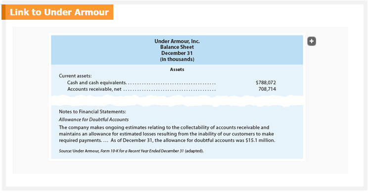

---

In Under Armour's financial statements, accounts receivable is reported at the net realizable value on the balance sheet with a note showing the amount of the allowance for doubtful accounts. A company may choose to subtract the allowance for doubtful accounts from accounts receivable on the balance sheet to report the net realizable value of receivables.

[En los estados financieros de Under Armour, las cuentas por cobrar se reportan al valor neto realizable en el balance general con una nota que muestra el monto de la provisión para cuentas dudosas. Una empresa puede optar por restar la provisión para cuentas dudosas de las cuentas por cobrar en el balance general para reportar el valor neto realizable de las cuentas por cobrar.]

Other disclosures, such as unusual credit risks within the receivables, are reported in the financial statement notes. For example, if the majority of the receivables are due from one customer or are due from customers located in one area of the country or one industry, these facts are disclosed.

[Otras divulgaciones, como riesgos crediticios inusuales dentro de las cuentas por cobrar, se reportan en las notas a los estados financieros. Por ejemplo, si la mayoría de las cuentas por cobrar son debidas por un solo cliente o son debidas por clientes ubicados en una zona del país o en una industria, estos hechos se divulgan.]

---

## Analysis for Decision Making

### Accounts Receivable Turnover and Days' Sales in Receivables

Two financial measures that are useful in evaluating efficiency in collecting receivables are the following:

[Dos medidas financieras que son útiles para evaluar la eficiencia en el cobro de cuentas por cobrar son las siguientes:]

- accounts receivable turnover  
(rotación de cuentas por cobrar)

- days' sales in receivables  
(días de ventas en cuentas por cobrar)

**Objective 8** - Describe and illustrate the use of the accounts receivable turnover and days' sales in receivables to evaluate a company's efficiency in collecting its receivables.

[**Objetivo 8** - Describir e ilustrar el uso de la rotación de cuentas por cobrar y los días de ventas en cuentas por cobrar para evaluar la eficiencia de una empresa en el cobro de sus cuentas por cobrar.]

The **accounts receivable turnover** (A measure of how frequently during the year the accounts receivable are being converted to cash, computed as sales divided by average accounts receivable.) measures how frequently during the year the accounts receivable are being converted to cash. For example, with credit terms of n/30, the accounts receivable should turn over about 12 times per year.

[La **rotación de cuentas por cobrar** (una medida de la frecuencia con la que durante el año las cuentas por cobrar se convierten en efectivo, calculada como ventas divididas entre el promedio de cuentas por cobrar) mide la frecuencia con la que durante el año las cuentas por cobrar se convierten en efectivo. Por ejemplo, con términos de crédito de n/30, las cuentas por cobrar deberían rotar aproximadamente 12 veces al año.]

The accounts receivable turnover is computed as follows:

[La rotación de cuentas por cobrar se calcula de la siguiente manera:]

$$\text{Accounts Receivable Turnover} = \frac{\text{Sales}}{\text{Average Accounts Receivable}}$$

The average accounts receivable can be determined by adding the beginning and ending accounts receivable balances and dividing by 2. For example, consider the following financial data (in millions) for Under Armour, Inc. (UAA):

[El promedio de cuentas por cobrar se puede determinar sumando los saldos inicial y final de cuentas por cobrar y dividiendo por 2. Por ejemplo, considere los siguientes datos financieros (en millones) para Under Armour, Inc. (UAA):]

| | Year 2 | Year 1 |
|---|---|---|
| Sales | $5,267 | $5,193 |
| **Accounts receivable:** | | |
| Beginning of year | 653 | 610 |
| End of year | 709 | 653 |

The accounts receivable turnover for Years 1 and 2 can be computed as follows (rounding to one decimal place):

[La rotación de cuentas por cobrar para los Años 1 y 2 se puede calcular de la siguiente manera (redondeando a un decimal):]

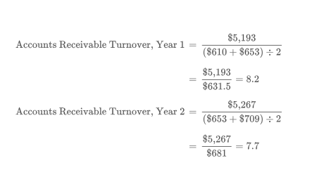</img>

| | Year 2 | Year 1 |
|---|---|---|
| Average accounts receivable | ($653 + $709) ÷ 2 = **$681** | ($610 + $653) ÷ 2 = **$631.5** |
| Accounts receivable turnover | $5,267 ÷ $681 = **7.7** | $5,193 ÷ $631.5 = **8.2** |

The accounts receivable turnover has declined in Year 2. This suggests that Under Armour is allowing customers to take longer to pay their accounts.

[La rotación de cuentas por cobrar ha disminuido en el Año 2. Esto sugiere que Under Armour está permitiendo que los clientes tarden más en pagar sus cuentas.]

The **days' sales in receivables** (An estimate of the length of time the accounts receivable have been outstanding, computed as average accounts receivable divided by average daily sales.) is an estimate of the length of time the accounts receivable have been outstanding. With credit terms of n/30, the days' sales in receivables should be about 30 days. It is computed as follows:

[Los **días de ventas en cuentas por cobrar** (una estimación del tiempo que las cuentas por cobrar han estado pendientes, calculada como el promedio de cuentas por cobrar dividido entre las ventas diarias promedio) es una estimación del tiempo que las cuentas por cobrar han estado pendientes. Con términos de crédito de n/30, los días de ventas en cuentas por cobrar deberían ser de aproximadamente 30 días. Se calcula de la siguiente manera:]

$$\text{Days' Sales in Receivables} = \frac{\text{Average Accounts Receivable}}{\text{Average Daily Sales}}$$

Average daily sales are determined by dividing sales by 365 days. For example, using the preceding data for Under Armour, the days' sales in receivables for Years 1 and 2 is computed as follows (rounding all computations to one decimal place):

[Las ventas diarias promedio se determinan dividiendo las ventas entre 365 días. Por ejemplo, utilizando los datos anteriores para Under Armour, los días de ventas en cuentas por cobrar para los Años 1 y 2 se calculan de la siguiente manera (redondeando todos los cálculos a un decimal):]

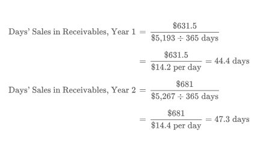</img>

| | Year 2 | Year 1 |
|---|---|---|
| Average daily sales | $5,267 ÷ 365 = **$14.4** | $5,193 ÷ 365 = **$14.2** |
| Days' sales in receivables | $681 ÷ $14.4 = **47.3 days** | $631.5 ÷ $14.2 = **44.4 days** |

The days' sales in receivables confirms that Under Armour's efficiency in collecting accounts receivable declined from Year 1 to Year 2. Lengthening the credit terms or selling in markets where longer credit terms are standard could cause this decline.

[Los días de ventas en cuentas por cobrar confirman que la eficiencia de Under Armour en el cobro de cuentas por cobrar disminuyó del Año 1 al Año 2. El alargamiento de los términos de crédito o la venta en mercados donde los términos de crédito más largos son estándar podrían causar esta disminución.]

The efficiency in collecting accounts receivable has declined when the accounts receivable turnover decreases or the days' sales in receivables increases.

[La eficiencia en el cobro de cuentas por cobrar ha disminuido cuando la rotación de cuentas por cobrar disminuye o los días de ventas en cuentas por cobrar aumentan.]

The efficiency in collecting accounts receivable can be compared across companies in similar industries. For example, the accounts receivable turnover and days' sales in receivables for Under Armour can be compared to a competitor, such as Columbia Sportswear Company (COLM), as shown in Exhibit 8.

[La eficiencia en el cobro de cuentas por cobrar se puede comparar entre empresas de industrias similares. Por ejemplo, la rotación de cuentas por cobrar y los días de ventas en cuentas por cobrar de Under Armour se pueden comparar con un competidor, como Columbia Sportswear Company (COLM), como se muestra en la Figura 8.]

---

## Exhibit 8

### Accounts Receivable Turnover and Days' Sales in Receivables for Under Armour and Columbia Sportswear

[**Figura 8** - Rotación de Cuentas por Cobrar y Días de Ventas en Cuentas por Cobrar para Under Armour y Columbia Sportswear]

<!-- 📍 IMAGEN: Exhibit 8 - Accounts Receivable Turnover and Days' Sales in Receivables for Under Armour and Columbia Sportswear (coordenadas [126, 62, 849, 277]) -->

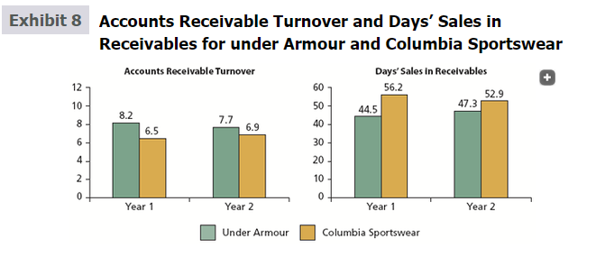

---

**Make a Decision**

### Accounts Receivable Turnover and Days' Sales in Receivables

[**Tome una Decisión - Rotación de Cuentas por Cobrar y Días de Ventas en Cuentas por Cobrar**]

- Analyze and compare Amazon.com to Best Buy (MAD 8-1) (Continuing company analysis)
- Analyze Ralph Lauren (MAD 8-2)
- Analyze L Brands (MAD 8-3)
- Compare Ralph Lauren and L Brands (MAD 8-4)
- Analyze DISH Network (MAD 8-5)

---

<h1 id="038402" style="color:#E65100;">
  <a href="#Chapter_008" style="color:inherit; text-decoration:none;">
    8-8a Let’s Review Chapter Summary
  </a>
</h1>

**1.** Receivables include all money claims against other entities. Receivables are normally classified as accounts receivable, notes receivable, or other receivables.  

[**1.** Las cuentas por cobrar incluyen todos los derechos de cobro contra otras entidades. Las cuentas por cobrar normalmente se clasifican como cuentas por cobrar, notas por cobrar u otras cuentas por cobrar.]

**2.** The operating expense recorded from uncollectible receivables is called bad debt expense. The two methods of accounting for uncollectible receivables are the direct write-off method and the allowance method.

[**2.** El gasto operativo registrado por cuentas por cobrar incobrables se llama gasto por deudas incobrables. Los dos métodos de contabilidad para cuentas por cobrar incobrables son el método de cancelación directa y el método de provisión.]

**3.** Under the direct write-off method, the entry to write off an account debits Bad Debt Expense and credits Accounts Receivable. Neither an allowance account nor an adjusting entry is needed at the end of the period.

[**3.** Bajo el método de cancelación directa, el asiento para cancelar una cuenta debita Gasto por Deudas Incobrables y acredita Cuentas por Cobrar. No se necesita una cuenta de provisión ni un asiento de ajuste al final del período.]

**4.** Under the allowance method, an adjusting entry is made for uncollectible accounts. When an account is determined to be uncollectible, it is written off against the allowance account. The allowance account is a contra asset account that normally has a credit balance after the adjusting entry has been posted. The estimate of uncollectibles may be based on a percent of sales or an analysis of receivables. Exhibit 3 compares and contrasts these two methods.

[**4.** Bajo el método de provisión, se realiza un asiento de ajuste para cuentas incobrables. Cuando se determina que una cuenta es incobrable, se cancela contra la cuenta de provisión. La cuenta de provisión es una cuenta de contra activo que normalmente tiene un saldo acreedor después de que se ha trasladado el asiento de ajuste. La estimación de incobrables puede basarse en un porcentaje de ventas o en un análisis de cuentas por cobrar. La Figura 3 compara y contrasta estos dos métodos.]

**5.** Exhibit 4 illustrates the differences between the direct write-off and allowance methods of accounting for uncollectible accounts.

[**5.** La Figura 4 ilustra las diferencias entre los métodos de cancelación directa y de provisión de contabilidad para cuentas incobrables.]

**6.** A note received to settle an account receivable is journalized as a debit to Notes Receivable and a credit to Accounts Receivable. When a note is paid at maturity, Cash is debited, Notes Receivable is credited, and Interest Revenue is credited. If the maker of a note fails to pay, the dishonored note is journalized by debiting an account receivable for the amount due from the maker of the note.

[**6.** Una nota recibida para liquidar una cuenta por cobrar se registra en el diario como un débito a Notas por Cobrar y un crédito a Cuentas por Cobrar. Cuando una nota se paga al vencimiento, se debita Efectivo, se acredita Notas por Cobrar y se acredita Ingresos por Intereses. Si el suscriptor de una nota no paga, la nota deshonrada se registra en el diario debitando una cuenta por cobrar por el monto adeudado por el suscriptor de la nota.]

**7.** All receivables that are expected to be realized in cash within a year are reported in the "Current assets" section of the balance sheet. In addition to the allowance for doubtful accounts, additional receivable disclosures include the market (fair) value and unusual credit risks.

[**7.** Todas las cuentas por cobrar que se espera que se realicen en efectivo dentro de un año se reportan en la sección de "Activos corrientes" del balance general. Además de la provisión para cuentas dudosas, las divulgaciones adicionales de cuentas por cobrar incluyen el valor de mercado (razonable) y los riesgos crediticios inusuales.]

**8.** Accounts receivable turnover measures how frequently during the year the accounts receivable are being converted to cash. It is computed as sales divided by average accounts receivable. The days' sales in receivables is an estimate of the length of time the accounts receivable have been outstanding. It is computed by dividing average accounts receivable by average daily sales.

[**8.** La rotación de cuentas por cobrar mide la frecuencia con la que durante el año las cuentas por cobrar se convierten en efectivo. Se calcula como ventas divididas entre el promedio de cuentas por cobrar. Los días de ventas en cuentas por cobrar es una estimación del tiempo que las cuentas por cobrar han estado pendientes. Se calcula dividiendo el promedio de cuentas por cobrar entre las ventas diarias promedio.]

---

<h1 id="242091" style="color:#E65100;">
  <a href="#Chapter_008" style="color:inherit; text-decoration:none;">
    8-8b Key Terms
  </a>
</h1>

[**8-8b Términos Clave**]

| English Term | Español | Definition (English) | Definición (Español) |
|---|---|---|---|
| accounts receivable | cuentas por cobrar | Amounts that customers owe for which a formal, written instrument of credit has not been issued; amounts due from customers for goods or services sold on account. | Montos que los clientes deben para los cuales no se ha emitido un instrumento formal de crédito por escrito; montos adeudados por clientes por bienes o servicios vendidos a crédito. |
| accounts receivable turnover | rotación de cuentas por cobrar | A measure of how frequently during the year the accounts receivable are being converted to cash, computed as sales divided by average accounts receivable. | Una medida de la frecuencia con la que durante el año las cuentas por cobrar se convierten en efectivo, calculada como ventas divididas entre el promedio de cuentas por cobrar. |
| aging the receivables | envejecimiento de las cuentas por cobrar | The process of analyzing the accounts receivable and classifying them according to various age groupings, with the due date being the base point for determining age. | El proceso de analizar las cuentas por cobrar y clasificarlas según varias agrupaciones de edad, siendo la fecha de vencimiento el punto base para determinar la edad. |
| Allowance for Doubtful Accounts | Provisión para Cuentas Dudosas | A contra asset account for accounts receivable in which is recorded the estimate for uncollectible accounts when using the allowance method. | Una cuenta de contra activo para cuentas por cobrar en la que se registra la estimación para cuentas incobrables cuando se utiliza el método de provisión. |
| allowance method | método de provisión | The method of accounting for uncollectible receivables that recognizes an expense by estimating future uncollectible accounts at the end of the accounting period. | El método de contabilidad para cuentas por cobrar incobrables que reconoce un gasto estimando cuentas incobrables futuras al final del período contable. |
| bad debt expense | gasto por deudas incobrables | The operating expense incurred because of the failure to collect receivables. | El gasto operativo incurrido debido al fracaso en el cobro de cuentas por cobrar. |
| days' sales in receivables | días de ventas en cuentas por cobrar | An estimate of the length of time the accounts receivable have been outstanding, computed as average accounts receivable divided by average daily sales. | Una estimación del tiempo que las cuentas por cobrar han estado pendientes, calculada como el promedio de cuentas por cobrar dividido entre las ventas diarias promedio. |
| direct write-off method | método de cancelación directa | The method of accounting for uncollectible receivables that recognizes an expense only when an account is determined to be worthless. | El método de contabilidad para cuentas por cobrar incobrables que reconoce un gasto solo cuando se determina que una cuenta no tiene valor. |
| dishonored note receivable | nota por cobrar deshonrada | A note that the maker fails to pay on the due date. | Una nota que el suscriptor no paga en la fecha de vencimiento. |
| maturity value | valor al vencimiento | The amount that is due at the maturity or due date of a note, which is the sum of the face amount and any interest. | El monto que debe pagarse en la fecha de vencimiento de una nota, que es la suma del monto nominal y cualquier interés. |
| net realizable value | valor neto realizable | The amount of accounts receivable that is expected to be collected or realized, computed as accounts receivable less allowance for doubtful accounts. | El monto de las cuentas por cobrar que se espera cobrar o realizar, calculado como cuentas por cobrar menos la provisión para cuentas dudosas. |
| notes receivable | notas por cobrar | Amounts that customers owe for which a formal, written instrument of credit has been issued; a promissory note received from a customer. | Montos que los clientes deben para los cuales se ha emitido un instrumento formal de crédito por escrito; un pagaré recibido de un cliente. |
| receivables | cuentas por cobrar | All money claims against other entities, including people, business firms, and other organizations. | Todos los derechos de cobro contra otras entidades, incluyendo personas, empresas y otras organizaciones. |

---

