<h1 id="Chapter_009" style="color:#42A5F5;">Indice</h1>

##### [Capitulo 9-1 Nature of Fixed Assets](#911677)

##### [Capitulo 9-1a Classifying Costs](#901867)

##### [Capitulo 9-1b The Cost of Fixed Assets](#578596)

##### [Capitulo 9-1c Leasing Fixed Assets](#570887)

##### [Capitulo 9-2 Accounting for Depreciation](#191266)

##### [Capitulo 9-2a Factors in Computing Depreciation Expense](#304992)

##### [Capitulo 9-2b Straight-Line Method](#916407)

##### [Capitulo 9-2c Units-of-Activity Method](#092997)

##### [Capitulo 9-2d Double-Declining-Balance Method](#077121)

<h1 id="911677" style="color:#E65100;">
  <a href="#Chapter_009" style="color:inherit; text-decoration:none;">
    9-1 Nature of Fixed Assets
  </a>
</h1>

Fixed assets are long-term or relatively permanent assets such as equipment, machinery, buildings, and land. Other descriptive titles for fixed assets are plant assets or property, plant, and equipment. Fixed assets have the following characteristics:

[Los activos fijos son activos a largo plazo o relativamente permanentes como equipo, maquinaria, edificios y terreno. Otros títulos descriptivos para los activos fijos son activos planta o propiedades, planta y equipo. Los activos fijos tienen las siguientes características:]

1. They exist physically and, thus, are tangible assets.
2. They are owned and used by the company in its normal operations.
3. They are not offered for sale as part of normal operations.
---
1. Existen físicamente y, por lo tanto, son activos tangibles.
2. Son propiedad de la empresa y se utilizan en sus operaciones normales.
3. No se ofrecen para la venta como parte de las operaciones normales.

**Objective 1** - Define, classify, and account for the cost of fixed assets.

[**Objetivo 1** - Definir, clasificar y contabilizar el costo de los activos fijos.]

Fixed assets are critical to the success of many businesses. For example, computers and Internet servers are critical fixed assets for a business that provides online retail or technology services.

[Los activos fijos son fundamentales para el éxito de muchas empresas. Por ejemplo, las computadoras y los servidores de Internet son activos fijos fundamentales para una empresa que proporciona servicios minoristas en línea o de tecnología.]

---

<h1 id="901867" style="color:#E65100;">
  <a href="#Chapter_009" style="color:inherit; text-decoration:none;">
    9-1a Classifying Costs
  </a>
</h1>

A cost that has been incurred may be classified as a fixed asset, an investment, or an expense. Exhibit 1 shows how to determine the proper classification of a cost and how it should be recorded.

[Un costo que se ha incurrido puede clasificarse como un activo fijo, una inversión o un gasto. La Figura 1 muestra cómo determinar la clasificación adecuada de un costo y cómo debe registrarse.]

---

## Exhibit 1

### Classifying Costs

[**Figura 1** - Clasificación de Costos]

<!-- 📍 IMAGEN: Exhibit 1 - Classifying Costs (coordenadas [123, 267, 835, 431]) -->

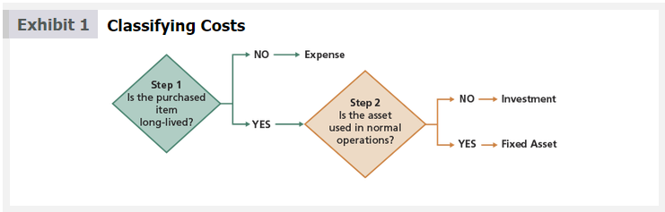

As shown in Exhibit 1, classifying a cost involves the following steps:

[Como se muestra en la Figura 1, la clasificación de un costo implica los siguientes pasos:]

**Step 1.** Is the purchased item long-lived?

[**Paso 1.** ¿El artículo comprado es de larga duración?]

- If yes, the item is recorded as an asset on the balance sheet, either as a fixed asset or an investment. Proceed to Step 2.  
(Si es sí, el artículo se registra como un activo en el balance general, ya sea como un activo fijo o una inversión. Proceda al Paso 2.)

- If no, the item is classified and recorded as an expense.  
(Si es no, el artículo se clasifica y registra como un gasto.)

**Step 2.** Is the asset used in normal operations?

[**Paso 2.** ¿El activo se utiliza en las operaciones normales?]

- If yes, the asset is classified and recorded as a fixed asset.  
(Si es sí, el activo se clasifica y registra como un activo fijo.)

- If no, the asset is classified and recorded as an investment.  
(Si es no, el activo se clasifica y registra como una inversión.)

Items that are classified and recorded as fixed assets include land, buildings, or equipment. Such assets normally last more than a year and are used in the normal operations of the business. However, standby equipment for use during peak periods or when other equipment breaks down is still classified as a fixed asset, even though it is not used very often. In contrast, fixed assets that have been abandoned or are no longer used in operations are not classified as fixed assets.

[Los artículos que se clasifican y registran como activos fijos incluyen terrenos, edificios o equipos. Dichos activos normalmente duran más de un año y se utilizan en las operaciones normales del negocio. Sin embargo, el equipo de respaldo para uso durante períodos pico o cuando otro equipo se descompone todavía se clasifica como un activo fijo, aunque no se use con mucha frecuencia. En contraste, los activos fijos que han sido abandonados o ya no se utilizan en las operaciones no se clasifican como activos fijos.]

---

**Link to McDonald's:** On a recent financial statement, McDonald's reported total property, plant, and equipment of over $39 billion, which consists of land, buildings, and equipment.

[**Enlace a McDonald's:** En un estado financiero reciente, McDonald's reportó propiedades, planta y equipo totales de más de $39 mil millones, que consisten en terrenos, edificios y equipos.]

---

## Business Insight

### Fixed Assets

[**Perspectiva de Negocio - Activos Fijos**]

Fixed assets often represent a significant portion of a company's total assets. The table that follows shows the fixed assets as a percent of total assets for some select companies across a variety of industries. As can be seen, the type of industry will impact the proportion of fixed assets to total assets. Retail has the highest percent of fixed assets to total assets, while software is on the lower end of the scale. High-tech service companies often use fewer fixed assets to deliver their services than will companies that use stores, equipment, planes, cell towers, or theme parks.

[Los activos fijos a menudo representan una parte significativa de los activos totales de una empresa. La tabla que sigue muestra los activos fijos como porcentaje de los activos totales para algunas empresas seleccionadas en una variedad de industrias. Como se puede ver, el tipo de industria afectará la proporción de activos fijos con respecto a los activos totales. El comercio minorista tiene el porcentaje más alto de activos fijos con respecto a los activos totales, mientras que el software está en el extremo inferior de la escala. Las empresas de servicios de alta tecnología a menudo utilizan menos activos fijos para prestar sus servicios que las empresas que utilizan tiendas, equipos, aviones, torres de telefonía celular o parques temáticos.]

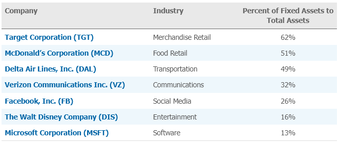</img>

| Company | Industry | Percent of Fixed Assets to Total Assets |
|---|---|---|
| Target Corporation (TGT) | Merchandise Retail | 62% |
| McDonald's Corporation (MCD) | Food Retail | 51% |
| Delta Air Lines, Inc. (DAL) | Transportation | 49% |
| Verizon Communications Inc. (VZ) | Communications | 32% |
| Facebook, Inc. (FB) | Social Media | 26% |
| The Walt Disney Company (DIS) | Entertainment | 16% |
| Microsoft Corporation (MSFT) | Software | 13% |

Fixed assets have important properties that require management attention:

[Los activos fijos tienen propiedades importantes que requieren atención de la administración:]

- Fixed assets require a long-term commitment. Mistakes in acquiring fixed assets can be very costly and difficult to reverse; thus, managers must take special care in acquiring fixed assets.  
(Los activos fijos requieren un compromiso a largo plazo. Los errores en la adquisición de activos fijos pueden ser muy costosos y difíciles de revertir; por lo tanto, los gerentes deben tener especial cuidado al adquirir activos fijos.)

- Fixed assets wear out over time and need to be replaced. Managers must monitor fixed assets and know when to replace fixed assets due to wear and tear or obsolescence.  
(Los activos fijos se desgastan con el tiempo y necesitan ser reemplazados. Los gerentes deben monitorear los activos fijos y saber cuándo reemplazarlos debido al desgaste o la obsolescencia.)

- Fixed assets need to be maintained during use. Managers need to develop maintenance programs to keep the investment in fixed assets productive.  
(Los activos fijos necesitan mantenimiento durante su uso. Los gerentes deben desarrollar programas de mantenimiento para mantener productiva la inversión en activos fijos.)

- Fixed assets often require significant funds to purchase. Managers must acquire funding internally or from other sources to finance the purchase of fixed assets.  
(Los activos fijos a menudo requieren fondos significativos para su compra. Los gerentes deben obtener financiamiento interno o de otras fuentes para financiar la compra de activos fijos.)

Although fixed assets may be sold, they should not be offered for sale as part of normal operations. For example, cars and trucks offered for sale by an automotive dealership are not fixed assets of the dealership. On the other hand, a tow truck used in the normal operations of the dealership is a fixed asset of the dealership.

[Aunque los activos fijos pueden venderse, no deben ofrecerse para la venta como parte de las operaciones normales. Por ejemplo, los automóviles y camiones ofrecidos para la venta por un concesionario de automóviles no son activos fijos del concesionario. Por otro lado, una grúa utilizada en las operaciones normales del concesionario es un activo fijo del concesionario.]

Investments are long-lived assets that are not used in the normal operations and are held for future resale. Such assets are reported on the balance sheet in a section entitled Investments. For example, undeveloped land acquired for future resale would be classified and reported as an investment, not land.

[Las inversiones son activos de larga duración que no se utilizan en las operaciones normales y se mantienen para su futura reventa. Dichos activos se reportan en el balance general en una sección titulada Inversiones. Por ejemplo, un terreno no urbanizado adquirido para su futura reventa se clasificaría y reportaría como una inversión, no como terreno.]

---

<h1 id="578596" style="color:#E65100;">
  <a href="#Chapter_009" style="color:inherit; text-decoration:none;">
    9-1b The Cost of Fixed Assets
  </a>
</h1>

In addition to purchase price, the costs of acquiring fixed assets include all amounts spent getting the asset in place and ready for use. For example, freight costs and the costs of installing equipment are part of the asset's total cost.

[Además del precio de compra, los costos de adquisición de activos fijos incluyen todos los montos gastados para colocar el activo en su lugar y listo para su uso. Por ejemplo, los costos de flete y los costos de instalación de equipos son parte del costo total del activo.]

Exhibit 2 summarizes some of the common costs of acquiring fixed assets. These costs are recorded by debiting the related fixed asset account, such as Building, Machinery and Equipment, Land, and Land Improvements.

[La Figura 2 resume algunos de los costos comunes de adquisición de activos fijos. Estos costos se registran debitando la cuenta de activo fijo relacionada, como Edificio, Maquinaria y Equipo, Terreno y Mejoras del Terreno.]

---

## Exhibit 2

### Costs of Acquiring Fixed Assets

[**Figura 2** - Costos de Adquisición de Activos Fijos]

<!-- 📍 IMAGEN: Exhibit 2 - Costs of Acquiring Fixed Assets (coordenadas [123, 346, 849, 727]) -->

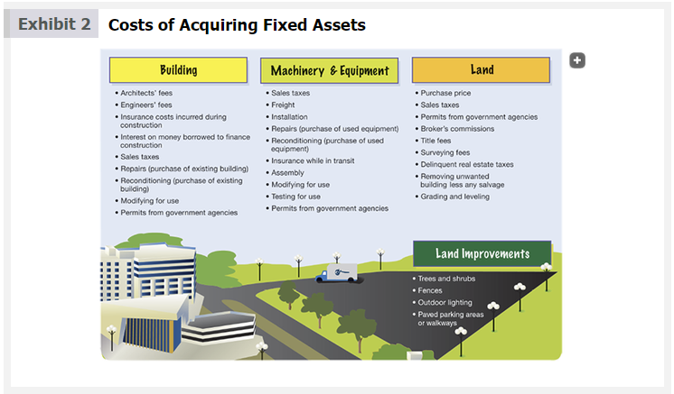

Only costs necessary for preparing the fixed asset for use are included as a cost of the asset. Unnecessary costs that do not increase the asset's usefulness are recorded as an expense. For example, the following costs are included as an expense:

[Solo los costos necesarios para preparar el activo fijo para su uso se incluyen como un costo del activo. Los costos innecesarios que no aumentan la utilidad del activo se registran como un gasto. Por ejemplo, los siguientes costos se incluyen como un gasto:]

- Vandalism  
(Vandalismo)

- Mistakes in installation  
(Errores en la instalación)

- Uninsured theft  
(Robo no asegurado)

- Damage during unpacking and installing  
(Daños durante el desembalaje e instalación)

- Fines for not obtaining proper permits from governmental agencies  
(Multas por no obtener los permisos adecuados de las agencias gubernamentales)

To illustrate, assume Kimble Inc. purchased equipment for $12,000. Freight costs of $600 were incurred to transport the equipment to the installation site. On site, installation costs of $1,500 were incurred, including $500 due to an error in installation. The journal entry to record the equipment is as follows:

[Para ilustrar, suponga que Kimble Inc. compró equipo por $12,000. Se incurrieron costos de flete de $600 para transportar el equipo al sitio de instalación. En el sitio, se incurrieron costos de instalación de $1,500, incluyendo $500 debido a un error en la instalación. El asiento de diario para registrar el equipo es el siguiente:]

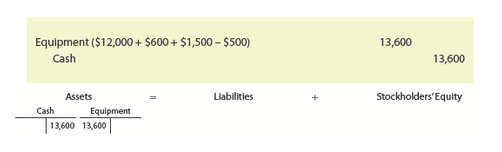</img>

| Date | Account | Debit | Credit |
|------|---------|-------|--------|
| | Equipment | 13,600 | |
| | Cash | | 13,600 |
| | *Purchased equipment and paid freight and installation costs.* | | |

The cost of the error in installing the equipment of $500 is not included in the cost of the equipment, but instead is recorded as an expense.

[El costo del error en la instalación del equipo de $500 no se incluye en el costo del equipo, sino que se registra como un gasto.]

A company may incur costs associated with constructing a fixed asset such as a new building. The direct costs incurred in the construction, such as labor and materials, should be capitalized as a debit to an account entitled Construction in Progress. When the construction is complete, the costs are reclassified by crediting Construction in Progress and debiting the proper fixed asset account such as Building.

[Una empresa puede incurrir en costos asociados con la construcción de un activo fijo como un nuevo edificio. Los costos directos incurridos en la construcción, como mano de obra y materiales, deben capitalizarse como un débito a una cuenta titulada Construcción en Progreso. Cuando la construcción esté completa, los costos se reclasifican acreditando Construcción en Progreso y debitando la cuenta de activo fijo adecuada como Edificio.]

---

<h1 id="570887" style="color:#E65100;">
  <a href="#Chapter_009" style="color:inherit; text-decoration:none;">
    9-1c Leasing Fixed Assets
  </a>
</h1>

A lease is a contract for the use of an asset for a period of time. Leases are often used in business. For example, automobiles, computers, medical equipment, buildings, and airplanes are often leased.

[Un arrendamiento es un contrato para el uso de un activo por un período de tiempo. Los arrendamientos se utilizan a menudo en los negocios. Por ejemplo, los automóviles, las computadoras, los equipos médicos, los edificios y los aviones se arriendan con frecuencia.]

The two parties to a lease contract are as follows:

[Las dos partes en un contrato de arrendamiento son las siguientes:]

- The **lessor** is the party who owns the asset.  
(El **arrendador** es la parte que posee el activo.)

- The **lessee** is the party to whom the rights to use the asset are granted by the lessor.  
(El **arrendatario** es la parte a quien el arrendador concede los derechos de uso del activo.)

Under a lease contract, the lessee pays rent on a periodic basis for the lease term. An advantage of leasing an asset is that the lessee has access to an asset without having to spend funds or obtain financing to buy the asset. In addition, expenses such as maintenance and repair costs may be the responsibility of the lessor. Finally, the risk of incurring additional cost because the asset becomes obsolete before the end of its useful life can be mitigated by leasing an asset.

[Bajo un contrato de arrendamiento, el arrendatario paga una renta de forma periódica durante el plazo del arrendamiento. Una ventaja de arrendar un activo es que el arrendatario tiene acceso a un activo sin tener que gastar fondos u obtener financiamiento para comprar el activo. Además, los gastos como los costos de mantenimiento y reparación pueden ser responsabilidad del arrendador. Finalmente, el riesgo de incurrir en costos adicionales porque el activo se vuelve obsoleto antes del final de su vida útil se puede mitigar mediante el arrendamiento de un activo.]

The Financial Accounting Standards Board (FASB) and the International Accounting Standards Board (IASB) recently completed a project to merge U.S. and international standards on leasing. The new FASB standard distinguishes between finance leases and operating leases. Under both finance and operating leases, the lessee records an asset and liability similar to having purchased the asset. However, the amount of depreciation expense and interest expense will differ for each type of lease. For short-term leases (the lease term is 12 months or less), the lessee records lease payments by debiting Rent Expense and crediting Cash. In some cases, like those illustrated in earlier chapters, Prepaid Rent is initially recorded with an adjusting entry at the end of the period to record Rent Expense. For purposes of this text, we assume that all leases are short-term leases.

[La Junta de Normas de Contabilidad Financiera (FASB) y la Junta de Normas Internacionales de Contabilidad (IASB) completaron recientemente un proyecto para fusionar los estándares estadounidenses e internacionales sobre arrendamientos. La nueva norma FASB distingue entre arrendamientos financieros y arrendamientos operativos. Tanto en los arrendamientos financieros como en los operativos, el arrendatario registra un activo y un pasivo similar a haber comprado el activo. Sin embargo, el monto del gasto de depreciación y el gasto por intereses diferirá para cada tipo de arrendamiento. Para arrendamientos a corto plazo (el plazo del arrendamiento es de 12 meses o menos), el arrendatario registra los pagos del arrendamiento debitando Gasto de Renta y acreditando Efectivo. En algunos casos, como los ilustrados en capítulos anteriores, la Renta Pagada por Adelantado se registra inicialmente con un asiento de ajuste al final del período para registrar el Gasto de Renta. Para los fines de este texto, asumimos que todos los arrendamientos son arrendamientos a corto plazo.]

Regardless of the type of lease, lease terms should be disclosed in the notes to the financial statements. These disclosures should include such items as the length of the lease, termination rights, and renewal options.

[Independientemente del tipo de arrendamiento, los términos del arrendamiento deben divulgarse en las notas a los estados financieros. Estas divulgaciones deben incluir elementos como la duración del arrendamiento, los derechos de terminación y las opciones de renovación.]

---

**Link to McDonald's:** McDonald's recently reported over $13.2 billion of leased assets. The leases are normally for 20 years with an option to renew.

[**Enlace a McDonald's:** McDonald's reportó recientemente más de $13.2 mil millones de activos arrendados. Los arrendamientos son normalmente por 20 años con una opción para renovar.]

---

<h1 id="191266" style="color:#E65100;">
  <a href="#Chapter_009" style="color:inherit; text-decoration:none;">
    9-2 Accounting for Depreciation
  </a>
</h1>

Over time, fixed assets, with the exception of land, lose their ability to provide services. Thus, the costs of fixed assets such as equipment and buildings should be recorded as an expense over their useful lives.

[Con el tiempo, los activos fijos, con la excepción del terreno, pierden su capacidad para proporcionar servicios. Por lo tanto, los costos de los activos fijos como equipos y edificios deben registrarse como un gasto durante su vida útil.]

**Objective 2** - Compute depreciation using the following methods: straight-line, units-of-activity, and double-declining-balance.

[**Objetivo 2** - Calcular la depreciación utilizando los siguientes métodos: línea recta, unidades de actividad y doble saldo decreciente.]

Recording the cost of fixed assets as an expense is called depreciation. Because land has an unlimited life, it is not depreciated.

[Registrar el costo de los activos fijos como un gasto se llama depreciación. Debido a que el terreno tiene una vida ilimitada, no se deprecia.]

Depreciation can be caused by physical or functional factors.

[La depreciación puede ser causada por factores físicos o funcionales.]

- Physical depreciation factors include wear and tear during use or from exposure to weather.  
(Los factores de depreciación física incluyen el desgaste durante el uso o por exposición a la intemperie.)

- Functional depreciation factors include obsolescence and changes in customer needs that cause the asset to no longer provide services for which it was intended. For example, equipment may become obsolete due to changing technology.  
(Los factores de depreciación funcional incluyen la obsolescencia y los cambios en las necesidades de los clientes que hacen que el activo ya no proporcione los servicios para los que fue destinado. Por ejemplo, el equipo puede volverse obsoleto debido a los cambios tecnológicos.)

Two common misunderstandings that exist about depreciation as used in accounting include:

[Dos conceptos erróneos comunes que existen sobre la depreciación tal como se utiliza en contabilidad incluyen:]

- Depreciation does not measure a decline in the market value of a fixed asset. Instead, depreciation is an allocation of a fixed asset's cost to expense over the asset's useful life. Thus, the **book value** (The difference between the cost of a fixed asset and its accumulated depreciation.) of a fixed asset (cost less accumulated depreciation) usually does not agree with the asset's market value. This is justified in accounting because a fixed asset is for use in a company's operations rather than for resale.
- Depreciation does not provide cash to replace fixed assets as they wear out. This misunderstanding may occur because depreciation, unlike most expenses, does not require an outlay of cash when it is recorded.

- La depreciación no mide una disminución en el valor de mercado de un activo fijo. En cambio, la depreciación es una asignación del costo de un activo fijo al gasto durante la vida útil del activo. Por lo tanto, el **valor en libros** (la diferencia entre el costo de un activo fijo y su depreciación acumulada) de un activo fijo (costo menos depreciación acumulada) generalmente no coincide con el valor de mercado del activo. Esto se justifica en contabilidad porque un activo fijo es para uso en las operaciones de una empresa en lugar de para reventa.
- La depreciación no proporciona efectivo para reemplazar los activos fijos a medida que se desgastan. Este concepto erróneo puede ocurrir porque la depreciación, a diferencia de la mayoría de los gastos, no requiere un desembolso de efectivo cuando se registra.

---

<h1 id="304992" style="color:#E65100;">
  <a href="#Chapter_009" style="color:inherit; text-decoration:none;">
    9-2a Factors in Computing Depreciation Expense
  </a>
</h1>

The three factors that determine the depreciation expense for a fixed asset are as follows:

[Los tres factores que determinan el gasto de depreciación para un activo fijo son los siguientes:]

1. The asset's initial cost
2. The asset's expected useful life
3. The asset's estimated residual value
---
1. El costo inicial del activo
2. La vida útil esperada del activo
3. El valor residual estimado del activo]

The **initial cost** (The purchase price of an asset plus all costs to obtain and ready it for use.) of a fixed asset is the purchase price of the asset plus all costs to obtain and ready it for use. This initial cost is determined using the concepts discussed and illustrated earlier in this chapter.

[El **costo inicial** (el precio de compra de un activo más todos los costos para obtenerlo y prepararlo para su uso) de un activo fijo es el precio de compra del activo más todos los costos para obtenerlo y prepararlo para su uso. Este costo inicial se determina utilizando los conceptos discutidos e ilustrados anteriormente en este capítulo.]

The **expected useful life** (The estimated length of time an asset will be used in normal business operations.) of a fixed asset is the estimated length of time the asset will be used in normal operations. It is estimated at the time the asset is placed into service. Estimates of expected useful lives are available from industry trade associations. The Internal Revenue Service also publishes guidelines for useful lives, which may be helpful for financial reporting purposes. However, it is not uncommon for different companies to use a different useful life for similar assets.

[La **vida útil esperada** (el tiempo estimado que un activo se utilizará en las operaciones normales del negocio) de un activo fijo es el tiempo estimado que el activo se utilizará en las operaciones normales. Se estima en el momento en que el activo se pone en servicio. Las estimaciones de vidas útiles esperadas están disponibles en las asociaciones comerciales de la industria. El Servicio de Impuestos Internos también publica pautas para vidas útiles, que pueden ser útiles para fines de información financiera. Sin embargo, no es raro que diferentes empresas utilicen una vida útil diferente para activos similares.]

---

**Link to McDonald's:** McDonald's uses a useful life of up to 40 years for its buildings and from 3–12 years for its equipment.

[**Enlace a McDonald's:** McDonald's utiliza una vida útil de hasta 40 años para sus edificios y de 3 a 12 años para sus equipos.]

The **residual value** (The estimated value of a fixed asset at the end of its useful life.) of a fixed asset is the estimated value of the asset at the end of its useful life. It is estimated at the time the asset is placed into service. Residual value is sometimes referred to as scrap value, salvage value, or trade-in value.

[El **valor residual** (el valor estimado de un activo fijo al final de su vida útil) de un activo fijo es el valor estimado del activo al final de su vida útil. Se estima en el momento en que el activo se pone en servicio. El valor residual a veces se denomina valor de desecho, valor de salvamento o valor de intercambio.]

The difference between a fixed asset's initial cost and its residual value is called the asset's **depreciable cost** (The amount of an asset's cost that will be allocated to depreciation expense over its useful life, determined by the difference between the asset's initial cost and its residual value.). This is the asset's cost that is allocated over its useful life as depreciation expense. If a fixed asset has no residual value, then its entire cost should be allocated to depreciation.

[La diferencia entre el costo inicial de un activo fijo y su valor residual se llama **costo depreciable** del activo (el monto del costo de un activo que se asignará al gasto de depreciación durante su vida útil, determinado por la diferencia entre el costo inicial del activo y su valor residual). Este es el costo del activo que se asigna durante su vida útil como gasto de depreciación. Si un activo fijo no tiene valor residual, entonces todo su costo debe asignarse a la depreciación.]

To illustrate depreciation methods, assume Exeter Company purchased a new forklift in January 1 as follows:

[Para ilustrar los métodos de depreciación, suponga que Exeter Company compró una nueva carretilla elevadora el 1 de enero de la siguiente manera:]

| | Amount |
|---|---|
| Initial cost | $24,000 |
| Expected useful life | 5 years |
| Estimated residual value | $2,000 |

Exhibit 3 shows the relationship between depreciation expense and the forklift's initial cost, expected useful life, and estimated residual value.

[La Figura 3 muestra la relación entre el gasto de depreciación y el costo inicial, la vida útil esperada y el valor residual estimado de la carretilla elevadora.]

---

## Exhibit 3

### Depreciation Expense

[**Figura 3** - Gasto de Depreciación]

<!-- 📍 IMAGEN: Exhibit 3 - Depreciation Expense (coordenadas [122, 249, 852, 622]) -->

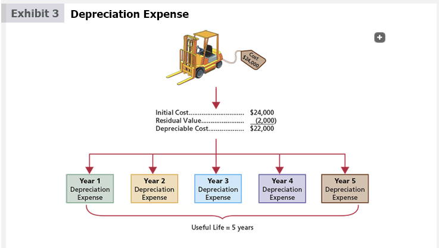

The three depreciation methods used most often are as follows:

[Los tres métodos de depreciación más utilizados son los siguientes:]

- Straight-line depreciation
- Units-of-activity depreciation
- Double-declining-balance depreciation
---
- Depreciación lineal (línea recta)
- Depreciación por unidades de actividad
- Depreciación por doble saldo decreciente

It is not necessary for a company to use only one method of computing depreciation for all of its fixed assets. For example, a company may use one method for depreciating equipment and another method for depreciating buildings.

[No es necesario que una empresa utilice un solo método de cálculo de depreciación para todos sus activos fijos. Por ejemplo, una empresa puede utilizar un método para depreciar equipos y otro método para depreciar edificios.]

---

<h1 id="916407" style="color:#E65100;">
  <a href="#Chapter_009" style="color:inherit; text-decoration:none;">
    9-2b Straight-Line Method
  </a>
</h1>

The **straight-line method** (A method of depreciation that provides for equal periodic depreciation expense over the estimated life of a fixed asset.) provides for the same amount of depreciation expense for each year of the asset's useful life. The annual straight-line depreciation for Exeter's forklift is $4,400, computed as follows:

[El **método de línea recta** (un método de depreciación que proporciona un gasto de depreciación periódico igual durante la vida útil estimada de un activo fijo) proporciona la misma cantidad de gasto de depreciación para cada año de la vida útil del activo. La depreciación anual en línea recta para la carretilla elevadora de Exeter es de $4,400, calculada de la siguiente manera:]

$$\text{Annual Depreciation} = \frac{\text{Cost} - \text{Residual Value}}{\text{Useful Life}} = \frac{\$24,000 - \$2,000}{5 \text{ Years}} = \$4,400$$

The straight-line method reports the same amount of depreciation expense each year, as illustrated in Exhibit 4.

[El método de línea recta reporta la misma cantidad de gasto de depreciación cada año, como se ilustra en la Figura 4.]

---

## Exhibit 4

### Straight-Line Method

[**Figura 4** - Método de Línea Recta]

<!-- 📍 IMAGEN: Exhibit 4 - Straight-Line Method (coordenadas [76, 441, 896, 828]) -->

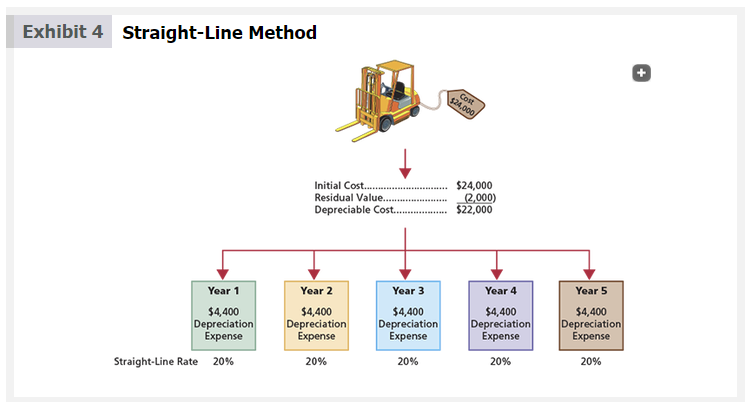

Computing straight-line depreciation may be simplified by converting the annual depreciation to a percentage of depreciable cost. The straight-line percentage is determined by dividing 100% by the number of years of expected useful life, computed as follows:

[Calcular la depreciación en línea recta puede simplificarse convirtiendo la depreciación anual en un porcentaje del costo depreciable. El porcentaje de línea recta se determina dividiendo el 100% por el número de años de vida útil esperada, calculado de la siguiente manera:]

| Expected Years of Useful Life | Straight-Line Percentage |
|---|---|
| 5 years | 20% (100% ÷ 5) |
| 8 years | 12.5% (100% ÷ 8) |
| 10 years | 10% (100% ÷ 10) |
| 20 years | 5% (100% ÷ 20) |
| 25 years | 4% (100% ÷ 25) |

For the preceding equipment, the annual depreciation of $4,400 can be computed by multiplying the depreciable cost of $22,000 by 20% (100% ÷ 5).

[Para el equipo anterior, la depreciación anual de $4,400 se puede calcular multiplicando el costo depreciable de $22,000 por 20% (100% ÷ 5).]

Depreciation of the forklift for the first year using the straight-line method is recorded as follows:

[La depreciación de la carretilla elevadora para el primer año utilizando el método de línea recta se registra de la siguiente manera:]

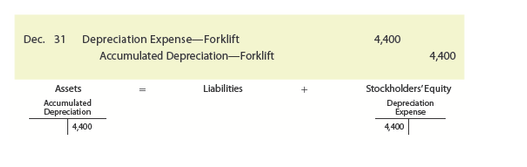</img>

| Date | Account | Debit | Credit |
|------|---------|-------|--------|
| Dec. 31 | Depreciation Expense | 4,400 | |
| | Accumulated Depreciation—Equipment | | 4,400 |
| | *Record depreciation on equipment.* | | |

Accumulated depreciation accounts are called contra accounts, or contra asset accounts. This is because accumulated depreciation accounts are deducted from their related fixed asset accounts on the balance sheet. The difference between the fixed asset account and its related accumulated depreciation account is called the asset's book value or net book value of the asset.

[Las cuentas de depreciación acumulada se llaman cuentas de contra, o cuentas de contra activo. Esto se debe a que las cuentas de depreciación acumulada se deducen de sus cuentas de activo fijo relacionadas en el balance general. La diferencia entre la cuenta de activo fijo y su cuenta de depreciación acumulada relacionada se llama valor en libros del activo o valor en libros neto del activo.]

The book value of the forklift at the end of the first year is $19,600. It would be reported on the balance sheet as follows:

[El valor en libros de la carretilla elevadora al final del primer año es de $19,600. Se reportaría en el balance general de la siguiente manera:]

| | Amount |
|---|---|
| Equipment | $24,000 |
| Accumulated depreciation | (4,400) |
| **Book value** | **$19,600** |

As shown in Exhibit 5, as depreciation expense is recorded each year, the book value of the forklift will decrease. The book value at the end of the asset's useful life will equal its residual value.

[Como se muestra en la Figura 5, a medida que se registra el gasto de depreciación cada año, el valor en libros de la carretilla elevadora disminuirá. El valor en libros al final de la vida útil del activo será igual a su valor residual.]

---

## Exhibit 5

### Straight-Line Method: Depreciation Expense and Book Value

[**Figura 5** - Método de Línea Recta: Gasto de Depreciación y Valor en Libros]

<!-- 📍 IMAGEN: Exhibit 5 - Straight-Line Method: Depreciation Expense and Book Value (página 3) -->

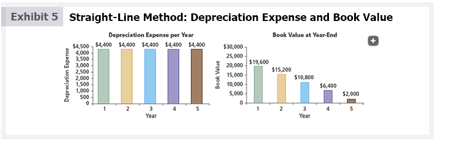

The straight-line method is simple to use. When an asset's revenues are about the same from period to period, straight-line depreciation provides a good matching of depreciation expense with the asset's revenues.

[El método de línea recta es simple de usar. Cuando los ingresos de un activo son aproximadamente los mismos de un período a otro, la depreciación en línea recta proporciona una buena correspondencia del gasto de depreciación con los ingresos del activo.]

---

<h1 id="092997" style="color:#E65100;">
  <a href="#Chapter_009" style="color:inherit; text-decoration:none;">
    9-2c Units-of-Activity Method
  </a>
</h1>

The **units-of-activity method** (A method of depreciation that provides the same amount of depreciation expense for each unit of an asset's activity, which may be expressed in hours, miles driven, or quantity produced.) provides the same amount of depreciation expense for each unit of activity of the asset. Depending on the asset, the units of activity can be expressed in terms of hours, miles driven, or quantity produced. For example, the unit of activity for a truck is normally expressed in miles driven. For manufacturing assets, the units of activity are often expressed as units of product. In this case, the units-of-activity method may be called the units-of-production method or units-of-output method.

[El **método de unidades de actividad** (un método de depreciación que proporciona la misma cantidad de gasto de depreciación para cada unidad de actividad de un activo, que puede expresarse en horas, millas recorridas o cantidad producida) proporciona la misma cantidad de gasto de depreciación para cada unidad de actividad del activo. Dependiendo del activo, las unidades de actividad pueden expresarse en términos de horas, millas recorridas o cantidad producida. Por ejemplo, la unidad de actividad para un camión normalmente se expresa en millas recorridas. Para los activos de fabricación, las unidades de actividad a menudo se expresan como unidades de producto. En este caso, el método de unidades de actividad puede llamarse método de unidades de producción o método de unidades de rendimiento.]

The units-of-activity method is applied in the following two steps:

[El método de unidades de actividad se aplica en los siguientes dos pasos:]

**Step 1.** Determine the depreciation per unit as follows:

[**Paso 1.** Determine la depreciación por unidad de la siguiente manera:]

$$\text{Depreciation per Unit} = \frac{\text{Cost} - \text{Residual Value}}{\text{Total Estimated Units of Activity}}$$

**Step 2.** Compute the depreciation expense as follows:

[**Paso 2.** Calcule el gasto de depreciación de la siguiente manera:]

$$\text{Depreciation Expense} = \text{Depreciation per Unit} \times \text{Units of Activity for Period}$$

To illustrate, assume that Exeter's forklift is estimated to have a useful life of 10,000 operating hours over the life of the asset. During the first year, the forklift was operated 2,100 hours. The units-of-activity depreciation for the year is $4,620, computed as follows:

[Para ilustrar, suponga que la carretilla elevadora de Exeter tiene una vida útil estimada de 10,000 horas de operación durante la vida del activo. Durante el primer año, la carretilla elevadora se operó 2,100 horas. La depreciación por unidades de actividad para el año es de $4,620, calculada de la siguiente manera:]

**Step 1.** Determine the depreciation per hour as follows:

[**Paso 1.** Determine la depreciación por hora de la siguiente manera:]

$$\text{Depreciation per Hour} = \frac{\text{Cost} - \text{Residual Value}}{\text{Total Estimated Units of Activity}} = \frac{\$24,000 - \$2,000}{10,000 \text{ Hours}} = \$2.20 \text{ per Hour}$$

**Step 2.** Compute the depreciation expense as follows:

[**Paso 2.** Calcule el gasto de depreciación de la siguiente manera:]

$$\text{Depreciation Expense} = \text{Depreciation per Unit} \times \text{Units of Activity for Period}$$
$$\qquad = \$2.20 \text{ per Hour} \times 2,100 \text{ Hours} = \$4,620$$

Depreciation for the first year using the units-of-activity method is recorded as follows:

[La depreciación para el primer año utilizando el método de unidades de actividad se registra de la siguiente manera:]

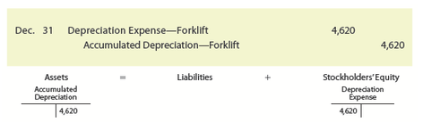</img>

| Date | Account | Debit | Credit |
|------|---------|-------|--------|
| Dec. 31 | Depreciation Expense | 4,620 | |
| | Accumulated Depreciation—Equipment | | 4,620 |
| | *Record depreciation on equipment.* | | |

Assume that during its five-year life, the forklift was used as follows:

[Suponga que durante su vida útil de cinco años, la carretilla elevadora se utilizó de la siguiente manera:]

| Year | Hours |
|---|---|
| Year 1 | 2,100 hours |
| Year 2 | 1,500 |
| Year 3 | 2,600 |
| Year 4 | 1,800 |
| Year 5 | 2,000 |
| **Total** | **10,000 hours** |

Exhibit 6 illustrates the depreciation expense and book value of the forklift over its five-year life using the units-of-activity method.

[La Figura 6 ilustra el gasto de depreciación y el valor en libros de la carretilla elevadora durante su vida útil de cinco años utilizando el método de unidades de actividad.]

---

## Exhibit 6

### Units-of-Activity Method

[**Figura 6** - Método de Unidades de Actividad]

<!-- 📍 IMAGEN: Exhibit 6 - Units-of-Activity Method (página 2) -->

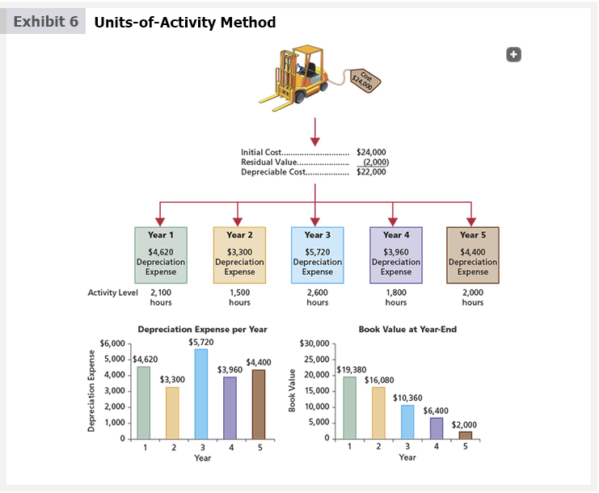

As shown in Exhibit 6, depreciation expense and book value vary each year depending on the hours the forklift is operated. The fixed asset's book value will equal its residual value at the end of the asset's useful life.

[Como se muestra en la Figura 6, el gasto de depreciación y el valor en libros varían cada año dependiendo de las horas que se opera la carretilla elevadora. El valor en libros del activo fijo será igual a su valor residual al final de la vida útil del activo.]

The units-of-activity method is often used when a fixed asset's use varies from year to year. In such cases, the units-of-activity method matches depreciation expense with the asset's revenues.

[El método de unidades de actividad se utiliza a menudo cuando el uso de un activo fijo varía de un año a otro. En tales casos, el método de unidades de actividad hace coincidir el gasto de depreciación con los ingresos del activo.]

---

<h1 id="077121" style="color:#E65100;">
  <a href="#Chapter_009" style="color:inherit; text-decoration:none;">
    9-2d Double-Declining-Balance Method
  </a>
</h1>

The **double-declining-balance method** (A method of depreciation that provides for a declining periodic depreciation expense over the expected useful life of an asset.) provides for a declining periodic expense over the expected useful life of the asset. The double-declining-balance method is applied in the following three steps:

[El **método de doble saldo decreciente** (un método de depreciación que proporciona un gasto de depreciación periódico decreciente durante la vida útil esperada de un activo) proporciona un gasto periódico decreciente durante la vida útil esperada del activo. El método de doble saldo decreciente se aplica en los siguientes tres pasos:]

**Step 1.** Determine the straight-line percentage, using the expected useful life.

[**Paso 1.** Determine el porcentaje de línea recta, utilizando la vida útil esperada.]

**Step 2.** Determine the double-declining-balance rate by multiplying the straight-line rate (from Step 1) by 2.

[**Paso 2.** Determine la tasa de doble saldo decreciente multiplicando la tasa de línea recta (del Paso 1) por 2.]

**Step 3.** Compute the depreciation expense by multiplying the double-declining-balance rate (from Step 2) times the book value of the asset.

[**Paso 3.** Calcule el gasto de depreciación multiplicando la tasa de doble saldo decreciente (del Paso 2) por el valor en libros del activo.]

To illustrate, the purchase of Exeter's forklift is used to compute double-declining-balance depreciation. For the first year, the depreciation is $9,600, computed as follows:

[Para ilustrar, se utiliza la compra de la carretilla elevadora de Exeter para calcular la depreciación por doble saldo decreciente. Para el primer año, la depreciación es de $9,600, calculada de la siguiente manera:]

**Step 1.** Straight-line percentage = 20% (100% ÷ 5)

[**Paso 1.** Porcentaje de línea recta = 20% (100% ÷ 5)]

**Step 2.** Double-declining-balance rate = 40% (20% × 2)

[**Paso 2.** Tasa de doble saldo decreciente = 40% (20% × 2)]

**Step 3.** Depreciation expense = $9,600 ($24,000 × 40%)

[**Paso 3.** Gasto de depreciación = $9,600 ($24,000 × 40%)]

Depreciation of the forklift for the first year using the double-declining-balance method is recorded as follows:

[La depreciación de la carretilla elevadora para el primer año utilizando el método de doble saldo decreciente se registra de la siguiente manera:]

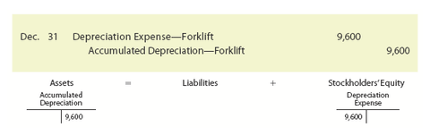</img>

| Date | Account | Debit | Credit |
|------|---------|-------|--------|
| Dec. 31 | Depreciation Expense—Forklift | 9,600 | |
| | Accumulated Depreciation—Forklift | | 9,600 |
| | *Record depreciation on forklift.* | | |

At the beginning of the first year, the book value of the equipment is its initial cost of $24,000. After the first year, the book value declines, and thus, the depreciation also declines. The double-declining-balance depreciation for the full five-year life of the forklift is as follows:

[Al comienzo del primer año, el valor en libros del equipo es su costo inicial de $24,000. Después del primer año, el valor en libros disminuye y, por lo tanto, la depreciación también disminuye. La depreciación por doble saldo decreciente para la vida útil completa de cinco años de la carretilla elevadora es la siguiente:]

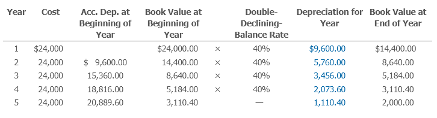</img>

| Year | Cost | Acc. Dep. at Beginning of Year | Book Value at Beginning of Year | Double-Declining-Balance Rate | Depreciation for Year | Book Value at End of Year |
|---|---|---|---|---|---|---|
| 1 | $24,000 | | $24,000.00 | × 40% | $9,600.00 | $14,400.00 |
| 2 | 24,000 | $9,600.00 | 14,400.00 | × 40% | 5,760.00 | 8,640.00 |
| 3 | 24,000 | 15,360.00 | 8,640.00 | × 40% | 3,456.00 | 5,184.00 |
| 4 | 24,000 | 18,816.00 | 5,184.00 | × 40% | 2,073.60 | 3,110.40 |
| 5 | 24,000 | 20,889.60 | 3,110.40 | — | 1,110.40 | 2,000.00 |

When the double-declining-balance method is used, the estimated residual value is not considered. However, the asset should not be depreciated below its estimated residual value. In the preceding example, the estimated residual value was $2,000. Therefore, the depreciation for the fifth year is $1,110.40 ($3,110.40 – $2,000.00) instead of $1,244.16 (40% × $3,110.40).

[Cuando se utiliza el método de doble saldo decreciente, el valor residual estimado no se considera. Sin embargo, el activo no debe depreciarse por debajo de su valor residual estimado. En el ejemplo anterior, el valor residual estimado era de $2,000. Por lo tanto, la depreciación para el quinto año es de $1,110.40 ($3,110.40 – $2,000.00) en lugar de $1,244.16 (40% × $3,110.40).]

Exhibit 7 illustrates the depreciation expense and book value of the forklift over its five-year life using the double-declining-balance method. As shown in Exhibit 7, the double-declining-balance method has higher depreciation in the first year of the asset's life, followed by declining depreciation amounts. For this reason, the double-declining-balance method is called an **accelerated depreciation method** (A depreciation method that provides for a higher depreciation amount in the first year of the asset's use, followed by a gradually declining amount of depreciation.)

[La Figura 7 ilustra el gasto de depreciación y el valor en libros de la carretilla elevadora durante su vida útil de cinco años utilizando el método de doble saldo decreciente. Como se muestra en la Figura 7, el método de doble saldo decreciente tiene una depreciación más alta en el primer año de vida del activo, seguida de montos de depreciación decrecientes. Por esta razón, el método de doble saldo decreciente se llama **método de depreciación acelerada** (un método de depreciación que proporciona un monto de depreciación más alto en el primer año de uso del activo, seguido de un monto de depreciación gradualmente decreciente).]

---

## Exhibit 7

### Double-Declining-Balance Method

[**Figura 7** - Método de Doble Saldo Decreciente]

<!-- 📍 IMAGEN: Exhibit 7 - Double-Declining-Balance Method (páginas 2-3) -->

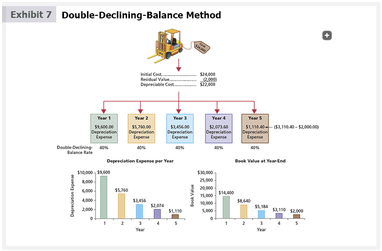

Revenues generated by an asset are often greater in the early years of its use than in later years. In such cases, the double-declining-balance method provides a good matching of depreciation expense with the asset's revenues.

[Los ingresos generados por un activo suelen ser mayores en los primeros años de su uso que en años posteriores. En tales casos, el método de doble saldo decreciente proporciona una buena correspondencia del gasto de depreciación con los ingresos del activo.]

---

