<h1 id="Chapter_001" style="color:#42A5F5;">Indice</h1>

##### [Capitulo Chapter 1: Introduction to Accounting and Business](#963349)

##### [Capitulo 1-1 Nature of Business and Accounting [Naturaleza del Negocio y la Contabilidad]](#669051)

##### [Capitulo 1-1a Types of Businesses [Tipos de Negocios]](#770317)

##### [Capitulo 1-1b Business Activities [Actividades del Negocio]](#714949)

##### [Capitulo 1-1c Role of Accounting in Business [Papel de la Contabilidad en los Negocios]](#605673)

##### [Capitulo 1-1d Role of Ethics in Accounting and Business [Papel de la Ética en la Contabilidad y los Negocios]](#779912)

##### [Capitulo 1-1e Opportunities for Accountants [Oportunidades para Contadores]](#911962)

##### [Capitulo 1-2 Generally Accepted Accounting Principles (GAAP) [Principios de Contabilidad Generalmente Aceptados]](#321465)

##### [Capitulo 1-2a Characteristics of Financial Information [Características de la Información Financiera]](#776084)

##### [Capitulo 1-2b Assumptions [Supuestos]](#805168)

##### [Capitulo 1-2c Principles [Principios]](#584773)

##### [Capitulo 1-3 The Accounting Equation [La Ecuación Contable]](#394719)

##### [Capitulo 1-4 Business Transactions and the Accounting Equation [Transacciones Comerciales y la Ecuación Contable]](#981259)

##### [Capitulo 1-4a Summary [Resumen]](#020166)

##### [Capitulo 1-4b Classifications of Stockholders' Equity [Clasificaciones del Capital Contable de los Accionistas]](#943711)

##### [Capitulo 1-5 Financial Statements [Estados Financieros]](#106292)

##### [Capitulo 1-5a Income Statement [Estado de Resultados]](#388711)

##### [Capitulo 1-5b Statement of Stockholders' Equity [Estado de Cambios en el Capital Contable de los Accionistas]](#230958)

##### [Capitulo 1-5c Balance Sheet [Balance General]](#618874)

##### [Capitulo 1-5d Statement of Cash Flows [Estado de Flujos de Efectivo]](#015759)

##### [Capitulo 1-5e Interrelationships among Financial Statements [Interrelaciones entre los Estados Financieros]](#909174)
---

<h1 id="963349" style="color:#E65100;">
  <a href="#Chapter_001" style="color:inherit; text-decoration:none;">
    Chapter 1: Introduction to Accounting and Business
  </a>
</h1>


## Chapter Introduction


## Twitter, Inc.

When two teams pair up for a game of football, there is often a lot of noise. The band plays, the fans cheer, and fireworks light up the scoreboard. Obviously, the fans are committed and care about the outcome of the game. Just like fans at a football game, the owners of a business want their business to "win" against their competitors in the marketplace. While having your football team win can be a source of pride, winning in the marketplace goes beyond pride and has many tangible benefits. Companies that are winners are better able to serve customers, provide good jobs for employees, and make money for their owners.

Twitter, Inc. (TWTR) is one of the most visible companies on the Internet. It provides a real-time information network where members can post messages, called tweets, for free. Millions post tweets every day throughout the world.

Do you think Twitter is a successful company? Does it make money? How would you know? **Accounting [Contabilidad]** helps to answer these questions.

This textbook introduces you to **accounting [contabilidad]**, the **language of business [lenguaje de los negocios]**. Chapter 1 begins by discussing what a **business [negocio/empresa]** is, how it operates, and the role that **accounting [contabilidad]** plays.

## What's Covered [Lo que se cubre]

### Introduction to Accounting and Business [Introducción a la Contabilidad y los Negocios]

- **Nature of Business [Naturaleza del Negocio]**
- **Nature of Accounting [Naturaleza de la Contabilidad]**
- **Analyzing Business Transactions [Análisis de Transacciones Comerciales]**
- **Financial Statements [Estados Financieros]**

---

1. **Managerial Transactions [Transacciones Gerenciales]** (Obj. 1)
2. **Business and Financial Accounting [Contabilidad Financiera y de Negocios]** (Obj. 5)
3. **Generally Accepted Accounting Principles (GAAP) [Principios de Contabilidad Generalmente Aceptados]** (Obj. 1)
4. **Statement of Stockholders' Equity [Estado de Cambios en el Patrimonio de los Accionistas]** (Obj. 5)
5. **Ethics [Ética]** (Obj. 1)
6. **Accounting Equation [Ecuación Contable]** (Obj. 3)
7. **Balance Sheet [Balance General / Estado de Situación Financiera]** (Obj. 5)
8. **Transactions [Transacciones]** (Obj. 4)
9. **Statement of Cash Flows [Estado de Flujos de Efectivo]** (Obj. 5)

---

## Learning Objectives [Objetivos de Aprendizaje]

**Obj. 1** Describe the nature of **business [negocio]** and the role of **accounting [contabilidad]** and **ethics [ética]** in business.

**Obj. 2** Describe **generally accepted accounting principles (GAAP) [principios de contabilidad generalmente aceptados]** , including the underlying **assumptions [supuestos]** and **principles [principios]** .

**Obj. 3** State the **accounting equation [ecuación contable]** and define each **element [elemento]** of the equation.

**Obj. 4** Describe and illustrate how **business transactions [transacciones comerciales]** can be recorded in terms of the resulting change in the elements of the **accounting equation [ecuación contable]** .

**Obj. 5** Describe the **financial statements [estados financieros]** of a **corporation [corporación]** and explain how they interrelate.

---

## Analysis for Decision Making [Análisis para la Toma de Decisiones]

**Obj. 6** Describe and illustrate the use of the **ratio of liabilities to stockholders' equity [razón de pasivos a capital contable]** in evaluating a company's **financial condition [condición financiera]** .

---

<h1 id="669051" style="color:#E65100;">
  <a href="#Chapter_001" style="color:inherit; text-decoration:none;">
    1-1 Nature of Business and Accounting [Naturaleza del Negocio y la Contabilidad]

  </a>
</h1>

**Objective 1** - Describe the nature of business and the role of accounting and ethics in business.
[Objetivo 1 - Describir la naturaleza del negocio y el papel de la contabilidad y la ética en los negocios.]

**business [negocio/empresa]** (An organization in which basic resources (inputs), such as materials and labor, are assembled and processed to provide goods or services (outputs) to customers.)
[Una organización en la que los recursos básicos (insumos), como materiales y mano de obra, se ensamblan y procesan para proporcionar bienes o servicios (productos) a los clientes.]

**business [negocio/empresa]** is an organization in which basic resources (inputs), such as materials and labor, are assembled and processed to provide goods or services (outputs) to customers. Businesses come in all sizes, from a local coffee house to Starbucks (SBUX), which sells over $15 billion of coffee and related products each year.
[**negocio/empresa** es una organización en la que los recursos básicos (insumos), como materiales y mano de obra, se ensamblan y procesan para proporcionar bienes o servicios (productos) a los clientes. Los negocios vienen en todos los tamaños, desde una cafetería local hasta Starbucks (SBUX), que vende más de $15 mil millones de dólares en café y productos relacionados cada año.]

The objective of most businesses is to earn a **profit [ganancia/utilidad]** .
[El objetivo de la mayoría de los negocios es obtener una **ganancia/utilidad**.]

**profit [ganancia/utilidad]** (The difference between the amounts received from customers for goods or services provided and the amounts paid for the inputs used to provide the goods or services.)
[**ganancia/utilidad** (La diferencia entre las cantidades recibidas de los clientes por los bienes o servicios proporcionados y las cantidades pagadas por los insumos utilizados para proporcionar dichos bienes o servicios).]

Profit is the difference between the amounts received from customers for goods or services and the amounts paid for the inputs used to provide the goods or services. This text focuses on businesses operating to earn a profit. However, many of the same concepts and principles also apply to **not-for-profit organizations [organizaciones sin fines de lucro]** such as hospitals, churches, and government agencies.
[La ganancia es la diferencia entre las cantidades recibidas de los clientes por los bienes o servicios y las cantidades pagadas por los insumos utilizados para proporcionar dichos bienes o servicios. Este texto se centra en negocios que operan para obtener una ganancia. Sin embargo, muchos de los mismos conceptos y principios también se aplican a las **organizaciones sin fines de lucro**, como hospitales, iglesias y agencias gubernamentales.]

<h1 id="770317" style="color:#E65100;">
  <a href="#Chapter_001" style="color:inherit; text-decoration:none;">
    1-1a Types of Businesses [Tipos de Negocios]
  </a>
</h1>


Three types of businesses operating for profit include **service [servicio]** , **retail [venta al por menor / comercio minorista]** , and **manufacturing [fabricación / manufactura]** businesses. Some examples of each type of business follow:
[Tres tipos de negocios que operan con fines de lucro incluyen negocios de **servicio**, **venta al por menor** y **fabricación**. Algunos ejemplos de cada tipo de negocio se presentan a continuación:]

---

### Service businesses [Negocios de servicio]

**Service businesses [Negocios de servicio]** (A business providing services rather than products to customers.)
[Un negocio que proporciona servicios en lugar de productos a los clientes.]

**Service businesses [Negocios de servicio]** provide services rather than products to customers.
[**Los negocios de servicio** proporcionan servicios en lugar de productos a los clientes.]

- **Delta Air Lines (DAL)** (transportation services) [servicios de transporte]
- **The Walt Disney Company (DIS)** (entertainment services) [servicios de entretenimiento]

---

### Retail businesses [Negocios minoristas / de venta al por menor]

**Retail businesses [Negocios minoristas]** (A type of business that purchases products from other businesses and sells them to customers.)
[Un tipo de negocio que compra productos a otros negocios y los vende a los clientes.]

**Retail businesses [Negocios minoristas]** sell products they purchase from other businesses to customers.
[**Los negocios minoristas** venden a los clientes los productos que compran a otros negocios.]

- **Walmart Inc. (WMT)** (general merchandise) [mercancía general]
- **Target Corporation (TGT)** (general merchandise) [mercancía general]

---

### Manufacturing businesses [Negocios de fabricación / manufactura]

**Manufacturing businesses [Negocios de fabricación]** (A type of business that changes basic inputs into products that are sold to customers.)
[Un tipo de negocio que transforma insumos básicos en productos que se venden a los clientes.]

**Manufacturing businesses [Negocios de fabricación]** change basic inputs into products that are sold to customers.
[**Los negocios de fabricación** transforman insumos básicos en productos que se venden a los clientes.]

- **Ford Motor Company (F)** (cars, trucks, vans) [automóviles, camiones, furgonetas]
- **Merck & Co., Inc. (MRK)** (pharmaceutical drugs) [medicamentos farmacéuticos]

---

### Link to Twitter [Enlace a Twitter]

Twitter is a **service company [empresa de servicio]** that provides a platform for individuals to send text messages called tweets.
[Twitter es una **empresa de servicio** que proporciona una plataforma para que las personas envíen mensajes de texto llamados tweets.]

<h1 id="714949" style="color:#E65100;">
  <a href="#Chapter_001" style="color:inherit; text-decoration:none;">
    1-1b Business Activities [Actividades del Negocio]
  </a>
</h1>

Businesses engage in the following three types of activities:
[Los negocios realizan los siguientes tres tipos de actividades:]

- **Operating activities [Actividades operativas / de operación]**
- **Investing activities [Actividades de inversión]**
- **Financing activities [Actividades de financiamiento]**

---

### Operating activities [Actividades operativas / de operación]

**Operating activities [Actividades operativas]** (Activities by which a company generates revenues from customers.)
[Actividades mediante las cuales una empresa genera ingresos de los clientes.]

**Operating activities [Actividades operativas]** are those activities by which the company generates revenues from customers. Operating activities include producing, marketing, and distributing a product or service to customers. For example, operating activities of Dell Technologies Inc. (DVMT) include product development, acquiring component parts, assembly, marketing, and distribution of its products.
[**Las actividades operativas** son aquellas actividades mediante las cuales la empresa genera ingresos de los clientes. Las actividades operativas incluyen producir, comercializar y distribuir un producto o servicio a los clientes. Por ejemplo, las actividades operativas de Dell Technologies Inc. (DVMT) incluyen el desarrollo de productos, la adquisición de piezas componentes, el ensamblaje, la comercialización y la distribución de sus productos.]

---

### Investing activities [Actividades de inversión]

**Investing activities [Actividades de inversión]** (Activities by which a company acquires long-term assets for use in the operating activities of the company.)
[Actividades mediante las cuales una empresa adquiere activos a largo plazo para su uso en las actividades operativas de la empresa.]

**Investing activities [Actividades de inversión]** are those activities by which a company acquires long-term assets for use in the operating activities of the company. For example, the acquisition by Delta Air Lines, Inc. (DAL) of Boeing 787 and Airbus 321 airplanes is an investing activity. Likewise, the purchase of land and the construction of buildings to use for training, maintenance, flight monitoring, and corporate offices are investing activities.
[**Las actividades de inversión** son aquellas actividades mediante las cuales una empresa adquiere activos a largo plazo para su uso en las actividades operativas de la empresa. Por ejemplo, la adquisición por parte de Delta Air Lines, Inc. (DAL) de aviones Boeing 787 y Airbus 321 es una actividad de inversión. Asimismo, la compra de terrenos y la construcción de edificios para usar en capacitación, mantenimiento, monitoreo de vuelos y oficinas corporativas son actividades de inversión.]

---

### Financing activities [Actividades de financiamiento]

**Financing activities [Actividades de financiamiento]** (Activities by which a company obtains funds to start and operate the company.)
[Actividades mediante las cuales una empresa obtiene fondos para iniciar y operar la empresa.]

**Financing activities [Actividades de financiamiento]** include activities by which the company obtains funds to start and operate the company. Funds are normally obtained from **creditors [acreedores]** and **owners [dueños]** . For example, companies can obtain funds by issuing **stock [acciones]** to the public. The payments to creditors and owners are also classified as financing activities.
[**Las actividades de financiamiento** incluyen actividades mediante las cuales la empresa obtiene fondos para iniciar y operar la empresa. Los fondos normalmente se obtienen de **acreedores** y **dueños**. Por ejemplo, las empresas pueden obtener fondos emitiendo **acciones** al público. Los pagos a acreedores y dueños también se clasifican como actividades de financiamiento.]

---

The preceding business activities are summarized in **Exhibit 1 [Figura 1]** .

## Exhibit 1 [Figura 1]


## Business Activities [Actividades del Negocio]

---

<h1 id="605673" style="color:#E65100;">
  <a href="#Chapter_001" style="color:inherit; text-decoration:none;">
    1-1c Role of Accounting in Business [Papel de la Contabilidad en los Negocios]
  </a>
</h1>


The role of **accounting [contabilidad]** in business is to provide information for managers to use in operating the business. In addition, accounting provides information to other users in assessing the economic performance and condition of the business.
[El papel de la **contabilidad** en los negocios es proporcionar información para que los gerentes la usen en la operación del negocio. Además, la contabilidad proporciona información a otros usuarios para evaluar el rendimiento económico y la condición del negocio.]

> **Note [Nota]:** Accounting is an information system that provides reports to users about the economic activities and condition of a business.
> [La contabilidad es un sistema de información que proporciona informes a los usuarios sobre las actividades económicas y la condición de un negocio.]

Thus, **accounting [contabilidad]** (An information system that provides reports to stakeholders about the economic activities and condition of a business.)
[Un sistema de información que proporciona informes a las partes interesadas sobre las actividades económicas y la condición de un negocio.]

can be defined as an information system that provides reports to users about the economic activities and condition of a business. You could think of accounting as the **"language of business" ["lenguaje de los negocios"]** . This is because accounting is the means by which businesses' financial information is communicated to users.
[se puede definir como un sistema de información que proporciona informes a los usuarios sobre las actividades económicas y la condición de un negocio. Se podría pensar en la contabilidad como el **"lenguaje de los negocios"**. Esto se debe a que la contabilidad es el medio mediante el cual la información financiera de los negocios se comunica a los usuarios.]

---

### Link to Twitter [Enlace a Twitter]

Twitter communicates to investors in an **annual report [informe anual]** that includes accounting information.
[Twitter se comunica con los inversores a través de un **informe anual** que incluye información contable.]

---

### The Accounting Process [El Proceso Contable]

The process by which accounting provides information to users is as follows:
[El proceso mediante el cual la contabilidad proporciona información a los usuarios es el siguiente:]

1. **Identify users** [Identificar a los usuarios]
2. **Assess users' information needs** [Evaluar las necesidades de información de los usuarios]
3. **Design the accounting information system** to meet users' needs [Diseñar el sistema de información contable para satisfacer las necesidades de los usuarios]
4. **Record economic data** about business activities and events [Registrar datos económicos sobre las actividades y eventos del negocio]
5. **Prepare accounting reports** for users [Preparar informes contables para los usuarios]

As illustrated in **Exhibit 2 [Figura 2]** , users of accounting information can be divided into two groups: **internal users [usuarios internos]** and **external users [usuarios externos]** .

## Exhibit 2 [Figura 2]


### Accounting as an Information System [La Contabilidad como Sistema de Información]

```
1. Identify Users [Identificar Usuarios]
2. Assess Users' Information Needs [Evaluar Necesidades de Información]
3. Design Accounting System [Diseñar el Sistema Contable]
4. Record Economic Data [Registrar Datos Económicos]
5. Prepare Accounting Reports [Preparar Informes Contables]
```

---

## Managerial Accounting [Contabilidad Gerencial / Administrativa]

**Internal users [Usuarios internos]** of accounting information include managers and employees. These users are directly involved in managing and operating the business. The area of accounting that provides internal users with information is called **managerial accounting [contabilidad gerencial]** or **management accounting [contabilidad administrativa]** .
[Los **usuarios internos** de la información contable incluyen gerentes y empleados. Estos usuarios están directamente involucrados en la gestión y operación del negocio. El área de la contabilidad que proporciona información a los usuarios internos se llama **contabilidad gerencial** o **contabilidad administrativa** .]

**Managerial accounting / management accounting [Contabilidad gerencial / administrativa]** (The branch of accounting that uses both historical and estimated data in providing information that management uses in conducting daily operations, in planning future operations, and in developing overall business strategies.)
[Rama de la contabilidad que utiliza datos tanto históricos como estimados para proporcionar información que la gerencia utiliza en la conducción de las operaciones diarias, en la planificación de operaciones futuras y en el desarrollo de estrategias generales de negocio.]

The objective of **managerial accounting [contabilidad gerencial]** is to provide relevant and timely information for managers' and employees' decision-making needs. Often, such information is sensitive and is not distributed outside the business. Examples of sensitive information might include information about customers, prices, and plans to expand the business.
[El objetivo de la **contabilidad gerencial** es proporcionar información relevante y oportuna para las necesidades de toma de decisiones de gerentes y empleados. A menudo, dicha información es sensible y no se distribuye fuera del negocio. Ejemplos de información sensible podrían incluir información sobre clientes, precios y planes para expandir el negocio.]

**Managerial accountants [Contadores gerenciales]** employed by a business are employed in **private accounting [contabilidad privada]** (The field of accounting whereby accountants are employed by a business firm or a not-for-profit organization.)
[El campo de la contabilidad en el cual los contadores son empleados por una empresa comercial o una organización sin fines de lucro.]

---

## Financial Accounting [Contabilidad Financiera]

**External users [Usuarios externos]** of accounting information include investors, creditors, customers, and the government. These users are not directly involved in managing and operating the business. The area of accounting that provides external users with information is called **financial accounting [contabilidad financiera]** .
[Los **usuarios externos** de la información contable incluyen inversores, acreedores, clientes y el gobierno. Estos usuarios no están directamente involucrados en la gestión y operación del negocio. El área de la contabilidad que proporciona información a los usuarios externos se llama **contabilidad financiera** .]

**Financial accounting [Contabilidad financiera]** (The branch of accounting that is concerned with recording transactions using generally accepted accounting principles (GAAP) for a business or other economic unit and with a periodic preparation of various statements from such records.)
[Rama de la contabilidad que se ocupa de registrar transacciones utilizando los principios de contabilidad generalmente aceptados (GAAP) para un negocio u otra unidad económica y de la preparación periódica de varios estados a partir de dichos registros.]

The objective of **financial accounting [contabilidad financiera]** is to provide relevant and timely information for the decision-making needs of users outside of the business. For example, financial reports on the operations and condition of the business are useful for banks and other creditors in deciding whether to lend money to the business.
[El objetivo de la **contabilidad financiera** es proporcionar información relevante y oportuna para las necesidades de toma de decisiones de los usuarios fuera del negocio. Por ejemplo, los informes financieros sobre las operaciones y la condición del negocio son útiles para los bancos y otros acreedores al decidir si prestar dinero al negocio.]

**General-purpose financial statements [Estados financieros de propósito general]** (A type of financial accounting report that is distributed to external users. The term "general purpose" refers to the wide range of decision-making needs that the reports are designed to serve.)
[Un tipo de informe de contabilidad financiera que se distribuye a los usuarios externos. El término "propósito general" se refiere a la amplia gama de necesidades de toma de decisiones que estos informes están diseñados para servir.]

are one type of financial accounting report that is distributed to external users. The term **general-purpose** [propósito general] refers to the wide range of decision-making needs that these reports are designed to serve. Later in this chapter, general-purpose financial statements are described and illustrated.
[son un tipo de informe de contabilidad financiera que se distribuye a los usuarios externos. El término **propósito general** se refiere a la amplia gama de necesidades de toma de decisiones que estos informes están diseñados para servir. Más adelante en este capítulo, se describen e ilustran los estados financieros de propósito general.]

---

### Link to Twitter [Enlace a Twitter]

Twitter uses **financial accounting [contabilidad financiera]** to prepare and distribute **general-purpose financial statements [estados financieros de propósito general]** .
[Twitter utiliza la **contabilidad financiera** para preparar y distribuir **estados financieros de propósito general** .]


<h1 id="779912" style="color:#E65100;">
  <a href="#Chapter_001" style="color:inherit; text-decoration:none;">
    1-1d Role of Ethics in Accounting and Business [Papel de la Ética en la Contabilidad y los Negocios]
  </a>
</h1>

The objective of **accounting [contabilidad]** is to provide relevant, timely information for user decision making. Accountants must behave in an **ethical [ético]** manner so that the information they provide users will be trustworthy and, thus, useful for decision making. Managers and employees must also behave in an ethical manner in managing and operating a business. Otherwise, no one will be willing to invest in or loan money to the business.
[El objetivo de la **contabilidad** es proporcionar información relevante y oportuna para la toma de decisiones de los usuarios. Los contadores deben comportarse de manera **ética** para que la información que proporcionan a los usuarios sea confiable y, por lo tanto, útil para la toma de decisiones. Los gerentes y empleados también deben comportarse de manera ética en la gestión y operación de un negocio. De lo contrario, nadie estará dispuesto a invertir o prestar dinero al negocio.]

**Ethics [Ética]** (Moral principles that guide the conduct of individuals.)
[Principios morales que guían la conducta de los individuos.]

**Ethics [Ética]** are moral principles that guide the conduct of individuals. Unfortunately, business managers and accountants sometimes behave in an unethical manner. Many of the managers of the companies listed in **Exhibit 3 [Figura 3]** engaged in **accounting or business fraud [fraude contable o comercial]** . These ethical violations led to fines, firings, and lawsuits. In some cases, managers were criminally prosecuted, convicted, and sent to prison.
[La **ética** son principios morales que guían la conducta de los individuos. Desafortunadamente, los gerentes de negocios y los contadores a veces se comportan de manera poco ética. Muchos de los gerentes de las empresas enumeradas en la **Figura 3** participaron en **fraude contable o comercial**. Estas violaciones éticas llevaron a multas, despidos y demandas judiciales. En algunos casos, los gerentes fueron procesados penalmente, condenados y enviados a prisión.]

---

### Exhibit 3 [Figura 3]

## Accounting and Business Frauds [Fraudes Contables y Comerciales]

| Company [Empresa] | Nature of Accounting or Business Fraud [Naturaleza del Fraude Contable o Comercial] | Result [Resultado] |
|-------------------|-----------------------------------------------------------|--------------------|
| Countrywide | CEO misled investors. [El CEO engañó a los inversores.] | CEO paid $22.5 million penalty and was permanently banned from serving as an officer or director of a public company. [El CEO pagó una multa de $22.5 millones y fue prohibido permanentemente de servir como funcionario o director de una empresa pública.] |
| Enron | Fraudulently inflated its financial results. [Infló fraudulentamente sus resultados financieros.] | Bankruptcy. Senior executives criminally convicted. More than $60 billion in stock market losses. [Quiebra. Altos ejecutivos condenados penalmente. Más de $60 mil millones en pérdidas en el mercado de valores.] |
| Goldman Sachs | Misstated and omitted key facts from investors. [Declaró incorrectamente y omitió hechos clave a los inversores.] | Company agreed to pay $550 million fine and reformed business practices. [La empresa acordó pagar una multa de $550 millones y reformó sus prácticas comerciales.] |
| Wells Fargo | Improperly opened customer accounts without their permission. [Abrió cuentas de clientes indebidamente sin su permiso.] | CEO fined $17.5 million and banned from banking industry for life. [El CEO fue multado con $17.5 millones y prohibido de por vida en la industria bancaria.] |
| Xerox Corporation | Recognized $3 billion in sales prior to when it should have been recorded. [Reconoció $3 mil millones en ventas antes de que deberían haberse registrado.] | $10 million fine to SEC. Six executives forced to pay $22 million. [Multa de $10 millones a la SEC. Seis ejecutivos obligados a pagar $22 millones.] |

---

### Business Insight [Perspectiva Empresarial]

## Business Strategies [Estrategias de Negocio]

Businesses normally use a (1) **product-differentiation strategy [estrategia de diferenciación de productos]** or (2) **low-cost strategy [estrategia de bajo costo]** to gain a competitive advantage and maximize their profits.
[Las empresas normalmente utilizan una (1) **estrategia de diferenciación de productos** o (2) **estrategia de bajo costo** para obtener una ventaja competitiva y maximizar sus ganancias.]

Using a **product-differentiation strategy [estrategia de diferenciación de productos]** , a company distinguishes its product(s) in such a way that it is desirable to customers and uniquely different from its competitor's. Using this strategy, a company tries to win over customers to its product(s) and establish customer loyalty. If successful, the company can charge premium prices for its products. For example, Apple Inc. (AAPL) uses a product-differentiation strategy in developing and marketing its products.
[Utilizando una **estrategia de diferenciación de productos**, una empresa distingue su(s) producto(s) de tal manera que sea deseable para los clientes y únicamente diferente al de su competidor. Usando esta estrategia, una empresa intenta ganar clientes para su(s) producto(s) y establecer lealtad del cliente. Si tiene éxito, la empresa puede cobrar precios premium por sus productos. Por ejemplo, Apple Inc. (AAPL) utiliza una estrategia de diferenciación de productos en el desarrollo y comercialización de sus productos.]

Using a **low-cost strategy [estrategia de bajo costo]** , a company offers product(s) to customers at a lower cost (price) than its competitors. The low-cost strategy is normally used for products that are uniform in nature, and thus the company cannot use a product-differentiation strategy. For example, Southwest Airlines Co. (LUV) uses a low-cost strategy in providing airline services to passengers.
[Utilizando una **estrategia de bajo costo**, una empresa ofrece producto(s) a los clientes a un costo (precio) más bajo que sus competidores. La estrategia de bajo costo se usa normalmente para productos que son uniformes en naturaleza, y por lo tanto la empresa no puede usar una estrategia de diferenciación de productos. Por ejemplo, Southwest Airlines Co. (LUV) utiliza una estrategia de bajo costo al proporcionar servicios aéreos a los pasajeros.]

**Risks [Riesgos]** of a product-differentiation strategy are that customers may not value the uniqueness of the company's product, competitors may duplicate the product's uniqueness, or that competitors may develop even more desirable attributes for their products. Risks of the low-cost strategy are that competitors may duplicate the company's low-cost processes or that competitors may develop new processes for achieving even lower costs.
[Los **riesgos** de una estrategia de diferenciación de productos son que los clientes puedan no valorar la singularidad del producto de la empresa, que los competidores puedan duplicar la singularidad del producto, o que los competidores puedan desarrollar atributos aún más deseables para sus productos. Los riesgos de la estrategia de bajo costo son que los competidores puedan duplicar los procesos de bajo costo de la empresa o que los competidores puedan desarrollar nuevos procesos para lograr costos aún más bajos.]

---

### What Went Wrong? [¿Qué salió mal?]

What went wrong for the managers and companies listed in Exhibit 3? The answer normally involved one or both of the following two factors:
[¿Qué salió mal para los gerentes y empresas enumerados en la Figura 3? La respuesta normalmente involucró uno o ambos de los siguientes dos factores:]

1. **Failure of Individual Character [Falla del carácter individual]** : Ethical managers and accountants are honest and fair. However, managers and accountants often face pressures from supervisors to meet company and investor expectations. In many of the cases in Exhibit 3, managers and accountants justified small ethical violations to avoid such pressures. However, these small violations became big violations as the company's financial problems became worse.
   [Los gerentes y contadores éticos son honestos y justos. Sin embargo, los gerentes y contadores a menudo enfrentan presiones de los supervisores para cumplir con las expectativas de la empresa y los inversores. En muchos de los casos en la Figura 3, los gerentes y contadores justificaron pequeñas violaciones éticas para evitar tales presiones. Sin embargo, estas pequeñas violaciones se convirtieron en grandes violaciones a medida que los problemas financieros de la empresa empeoraban.]

2. **Culture of Greed and Ethical Indifference [Cultura de codicia e indiferencia ética]** : By their behavior and attitude, senior managers set the company culture. In most of the companies listed in Exhibit 3, the senior managers created a culture of greed and indifference to the truth.
   [Mediante su comportamiento y actitud, los altos gerentes establecen la cultura de la empresa. En la mayoría de las empresas enumeradas en la Figura 3, los altos gerentes crearon una cultura de codicia e indiferencia a la verdad.]

---

### The Sarbanes-Oxley Act (SOX) [Ley Sarbanes-Oxley]

As a result of the accounting and business frauds shown in Exhibit 3, Congress passed laws to monitor the behavior of accounting and business. For example, the **Sarbanes-Oxley Act (SOX) [Ley Sarbanes-Oxley]** (An act passed by Congress to restore public confidence and trust in the financial statements of companies.)
[Una ley aprobada por el Congreso para restaurar la confianza y la credibilidad pública en los estados financieros de las empresas.]

was enacted. SOX established a new oversight body for the accounting profession called the **Public Company Accounting Oversight Board (PCAOB) [Junta de Supervisión Contable de Empresas Públicas]** (A new oversight body for the accounting profession that was established by the Sarbanes-Oxley Act.)
[Un nuevo organismo de supervisión para la profesión contable establecido por la Ley Sarbanes-Oxley.]

In addition, SOX established standards for **independence [independencia]** , **corporate responsibility [responsabilidad corporativa]** , and **disclosure [divulgación/revelación]** .
[Además, SOX estableció estándares para **independencia**, **responsabilidad corporativa** y **divulgación**.]

---

### Guidelines for Behaving Ethically [Pautas para Comportarse Éticamente]

How does one behave ethically when faced with financial or other types of pressure? Guidelines for behaving ethically follow:
[¿Cómo comportarse éticamente cuando se enfrenta a presiones financieras o de otro tipo? Las pautas para comportarse éticamente son las siguientes:]

1. **Identify an ethical decision** by using your personal ethical standards of honesty and fairness.
   [**Identificar una decisión ética** utilizando sus estándares éticos personales de honestidad y justicia.]

2. **Identify the consequences** of the decision and its effect on others.
   [**Identificar las consecuencias** de la decisión y su efecto en los demás.]

3. **Consider your obligations and responsibilities** to those who will be affected by your decision.
   [**Considerar sus obligaciones y responsabilidades** con aquellos que se verán afectados por su decisión.]

4. **Make a decision that is ethical and fair** to those affected by it.
   [**Tomar una decisión que sea ética y justa** para aquellos afectados por ella.]

---

### Link to Twitter [Enlace a Twitter]

Twitter's **"Code of Business Conduct and Ethics" ["Código de Conducta Comercial y Ética"]** can be found at:
[El **"Código de Conducta Comercial y Ética"** de Twitter se puede encontrar en:]
https://cdn.cms-twdigitalassets.com/content/dam/legal-twitter/asset-download-files/en/code-of-conduct-092018-ext.pdf

---

<h1 id="911962" style="color:#E65100;">
  <a href="#Chapter_001" style="color:inherit; text-decoration:none;">
    1-1e Opportunities for Accountants [Oportunidades para Contadores]
  </a>
</h1>


Numerous career opportunities are available for students majoring in accounting. Currently, the demand for accountants exceeds the number of new graduates entering the job market. This is partly due to the increased regulation of business caused by the accounting and business frauds shown in Exhibit 3. Also, more and more businesses have come to recognize the importance and value of accounting information.
[Numerosas oportunidades profesionales están disponibles para los estudiantes que se especializan en contabilidad. Actualmente, la demanda de contadores supera el número de nuevos graduados que ingresan al mercado laboral. Esto se debe en parte al aumento de la regulación empresarial causado por los fraudes contables y comerciales mostrados en la Figura 3. Además, cada vez más empresas han llegado a reconocer la importancia y el valor de la información contable.]

As indicated earlier, accountants employed by a business are employed in **private accounting [contabilidad privada]** . Private accountants have a variety of possible career options within a company. Some of these career options are shown in **Exhibit 4 [Figura 4]** along with their starting salaries. As shown in Exhibit 4, several private accounting careers have certification options. Accountants who provide audit services, called **auditors [auditores]** , verify the accuracy of financial records, accounts, and systems.
[Como se indicó anteriormente, los contadores empleados por una empresa trabajan en **contabilidad privada**. Los contadores privados tienen una variedad de opciones profesionales posibles dentro de una empresa. Algunas de estas opciones profesionales se muestran en la **Figura 4** junto con sus salarios iniciales. Como se muestra en la Figura 4, varias carreras de contabilidad privada tienen opciones de certificación. Los contadores que proporcionan servicios de auditoría, llamados **auditores**, verifican la precisión de los registros financieros, cuentas y sistemas.]

---

### Exhibit 4 [Figura 4]

## Accounting Career Paths and Salaries [Trayectorias Profesionales en Contabilidad y Salarios]

| Accounting Career Track [Trayectoria Profesional] | Description [Descripción] | Career Options [Opciones Profesionales] | Annual Starting Salaries [Salarios Iniciales Anuales] | Certification [Certificación] |
|---------------------------------------------------|---------------------------|------------------------------------------|--------------------------------------------------------|-------------------------------|
| **Private Accounting [Contabilidad Privada]** | Accountants employed by companies, government, and not-for-profit entities. [Contadores empleados por empresas, gobierno y entidades sin fines de lucro.] | Bookkeeper [Contador/Registrador] Payroll clerk [Empleado de nómina] General accountant [Contador general] Budget analyst [Analista de presupuesto] Cost accountant [Contador de costos] Internal auditor [Auditor interno] Information technology auditor [Auditor de tecnología de la información] | $40,000 $40,000 $49,000 $53,000 $65,000 $48,000 $53,000 | Certified Payroll Professional (CPP) [Profesional Certificado de Nómina] Certified Management Accountant (CMA) [Contador Administrativo Certificado] Certified Internal Auditor (CIA) [Auditor Interno Certificado] Certified Information Systems Auditor (CISA) [Auditor Certificado de Sistemas de Información] |
| **Public Accounting [Contabilidad Pública]** | Accountants employed individually or within a public accounting firm in audit and tax services. [Contadores empleados de forma individual o dentro de una firma de contabilidad pública en servicios de auditoría e impuestos.] | Public Accountant [Contador público] | $49,000 | Certified Public Accountant (CPA) [Contador Público Certificado] |

*Source: Robert Half 2020 U.S. Salary Guide (Finance and Accounting), Robert Half International, Inc. (RHI)*
[Fuente: Robert Half 2020 U.S. Salary Guide (Finanzas y Contabilidad), Robert Half International, Inc.]

---

### Public Accounting [Contabilidad Pública]

Accountants and their staff who provide services on a fee basis are said to be employed in **public accounting [contabilidad pública]** (The field of accounting where accountants and their staff provide services on a fee basis.)
[El campo de la contabilidad donde los contadores y su personal proporcionan servicios sobre la base de honorarios.]

In public accounting, an accountant may practice as an individual or as a member of a public accounting firm. Public accountants who have met a state's education, experience, and examination requirements may become **Certified Public Accountants (CPAs) [Contadores Públicos Certificados]** (Public accountant who has met a state's education, experience, and examination requirements.)
[Contador público que ha cumplido con los requisitos de educación, experiencia y examen de un estado.]

**Certified Public Accountants (CPAs) [Contadores Públicos Certificados]** . CPAs typically perform general accounting, audit, or tax services. CPAs often have slightly better starting salaries than private accountants. Career statistics indicate, however, that these salary differences tend to disappear over time. The **American Institute of Certified Public Accountants (AICPA) [Instituto Americano de Contadores Públicos Certificados]** provides information and resources for students interested in accounting at www.startheregoplaces.com.
[Los CPA típicamente realizan servicios de contabilidad general, auditoría o impuestos. Los CPA a menudo tienen salarios iniciales ligeramente mejores que los contadores privados. Las estadísticas profesionales indican, sin embargo, que estas diferencias salariales tienden a desaparecer con el tiempo. El **Instituto Americano de Contadores Públicos Certificados (AICPA)** proporciona información y recursos para estudiantes interesados en contabilidad en www.startheregoplaces.com.]

---

### Ethics in Action [Ética en Acción]

## Bernie Madoff [Bernie Madoff]

**Bernard L. "Bernie" Madoff** was sentenced to 150 years in prison for defrauding thousands of investors in one of the biggest frauds in American history. Madoff's fraud started several decades earlier when he began a **"Ponzi scheme" ["esquema Ponzi"]** in his investment management firm, Bernard L. Madoff Investment Securities LLC.
[Bernard L. "Bernie" Madoff fue condenado a 150 años de prisión por defraudar a miles de inversores en uno de los fraudes más grandes de la historia estadounidense. El fraude de Madoff comenzó varias décadas antes cuando inició un **"esquema Ponzi"** en su firma de gestión de inversiones, Bernard L. Madoff Investment Securities LLC.]

In a **Ponzi scheme [esquema Ponzi]** , the investment manager uses funds received from new investors to pay a return to existing investors, rather than basing returns on the investments' actual performance. As long as the investment manager is able to attract new investors, he or she will have new funds to pay existing investors and continue the fraud. While most Ponzi schemes collapse quickly when the investment manager runs out of new investors, Madoff's reputation, popularity, and personal contacts provided a steady stream of investors, which allowed the fraud to survive for decades.
[En un **esquema Ponzi**, el administrador de inversiones utiliza los fondos recibidos de nuevos inversores para pagar un rendimiento a los inversores existentes, en lugar de basar los rendimientos en el rendimiento real de las inversiones. Mientras el administrador de inversiones pueda atraer nuevos inversores, tendrá nuevos fondos para pagar a los inversores existentes y continuar con el fraude. Si bien la mayoría de los esquemas Ponzi colapsan rápidamente cuando el administrador de inversiones se queda sin nuevos inversores, la reputación, popularidad y contactos personales de Madoff proporcionaron un flujo constante de inversores, lo que permitió que el fraude sobreviviera durante décadas.]

---

### Accounting as a Foundation [La Contabilidad como Base]

Because all functions within a business use accounting information, experience in private or public accounting provides a solid foundation for a career. Many positions in industry and in government agencies are held by individuals with accounting backgrounds.
[Dado que todas las funciones dentro de una empresa utilizan información contable, la experiencia en contabilidad privada o pública proporciona una base sólida para una carrera. Muchos puestos en la industria y en agencias gubernamentales son ocupados por personas con formación en contabilidad.]

<h1 id="321465" style="color:#E65100;">
  <a href="#Chapter_001" style="color:inherit; text-decoration:none;">
    1-2 Generally Accepted Accounting Principles (GAAP) [Principios de Contabilidad Generalmente Aceptados]

  </a>
</h1>

**Objective 2** - Describe generally accepted accounting principles, including the underlying assumptions and principles.
[Objetivo 2 - Describir los principios de contabilidad generalmente aceptados, incluyendo los supuestos y principios subyacentes.]

Financial information in the United States is based on **generally accepted accounting principles (GAAP) [principios de contabilidad generalmente aceptados]** (Generally accepted guidelines for the preparation of financial statements.)
[Directrices generalmente aceptadas para la preparación de estados financieros.]

GAAP is a collection of accounting standards, principles, and assumptions that define how financial information will be reported.
[GAAP es un conjunto de estándares contables, principios y supuestos que definen cómo se reportará la información financiera.]

**Accounting standards [Estándares contables]** (The rules that determine the accounting for individual business transactions.)
[Las reglas que determinan la contabilidad para transacciones comerciales individuales.]

are the rules that determine the accounting for individual business transactions.
[son las reglas que determinan la contabilidad para transacciones comerciales individuales.]

**Accounting principles [Principios contables]** (Principles that provide the framework upon which accounting standards are constructed.)
[Principios que proporcionan el marco sobre el cual se construyen los estándares contables.]

and **assumptions [supuestos]** (Assumptions that provide the framework upon which accounting standards are constructed.)
[Supuestos que proporcionan el marco sobre el cual se construyen los estándares contables.]

provide the framework upon which accounting standards are constructed.
[proporcionan el marco sobre el cual se construyen los estándares contables.]

---

### Standard-Setting Bodies [Organismos Normativos]

Within the United States, the **Financial Accounting Standards Board (FASB) [Junta de Normas de Contabilidad Financiera]** (The authoritative body that has the primary responsibility for developing accounting principles.)
[El organismo autorizado que tiene la responsabilidad principal de desarrollar los principios contables.]

has the primary responsibility for developing accounting standards. The FASB maintains an electronic database, called the **Accounting Standards Codification [Codificación de Normas de Contabilidad]** (An electronic database maintained by the Financial Accounting Standards Board (FASB) that contains all of the accounting standards that make up GAAP.)
[Una base de datos electrónica mantenida por la FASB que contiene todos los estándares contables que componen los GAAP.]

, that contains all the accounting standards that make up GAAP. Changes in the FASB Codification are made using **Accounting Standards Updates [Actualizaciones de Normas de Contabilidad]** (Published changes to accounting standards that are the source of updates to the Accounting Standards Codification.)
[Cambios publicados a los estándares contables que son la fuente de actualizaciones de la Codificación de Normas de Contabilidad.]

The **Securities and Exchange Commission (SEC) [Comisión de Bolsa y Valores]** (An agency of the U.S. government that has authority over the accounting and financial disclosures for companies whose shares of ownership (stock) are traded and sold to the public.)
[Una agencia del gobierno de EE.UU. que tiene autoridad sobre la contabilidad y las divulgaciones financieras de las empresas cuyas acciones de propiedad (capital) se negocian y venden al público.]

, an agency of the U.S. government, has authority over the accounting and financial disclosures for companies whose shares of ownership (stock) are traded and sold to the public. The SEC normally accepts the accounting standards set forth by the FASB. However, the SEC may issue Staff Accounting Bulletins on accounting matters that may not have been addressed by the FASB.
[tiene autoridad sobre la contabilidad y las divulgaciones financieras de las empresas cuyas acciones se negocian y venden al público. La SEC normalmente acepta los estándares contables establecidos por la FASB. Sin embargo, la SEC puede emitir Boletines de Contabilidad del Personal sobre asuntos contables que pueden no haber sido abordados por la FASB.]

Outside the United States, most countries use accounting standards and principles adopted by the **International Accounting Standards Board (IASB) [Junta de Normas Internacionales de Contabilidad]** (An organization that issues International Financial Reporting Standards for many countries outside the United States.)
[Una organización que emite Normas Internacionales de Información Financiera para muchos países fuera de los Estados Unidos.]

The IASB issues **International Financial Reporting Standards (IFRS) [Normas Internacionales de Información Financiera]** . In some cases, differences exist between FASB and IASB accounting principles. These differences are identified throughout the chapters of this text and in Appendix A.
[La IASB emite las **Normas Internacionales de Información Financiera (IFRS)** . En algunos casos, existen diferencias entre los principios contables de la FASB y la IASB. Estas diferencias se identifican a lo largo de los capítulos de este texto y en el Apéndice A.]

---

### Business Insight [Perspectiva Empresarial]

#### Pathways Commission [Comisión Pathways]

The **Pathways Commission** issued its study titled *Charting a National Strategy for the Next Generation of Accountants*. The Commission was made up of diverse members and was jointly sponsored by the **American Institute of Certified Public Accountants (AICPA) [Instituto Americano de Contadores Públicos Certificados]** and the **American Accounting Association (AAA) [Asociación Americana de Contabilidad]** . The Commission emphasized the importance of accounting for a prosperous society and good decision making. The Commission also emphasized that accountants must be **critical thinkers [pensadores críticos]** who are comfortable addressing the shades of gray required by accounting judgments.
[La **Comisión Pathways** publicó su estudio titulado *Trazando una Estrategia Nacional para la Próxima Generación de Contadores*. La Comisión enfatizó la importancia de la contabilidad para una sociedad próspera y una buena toma de decisiones. La Comisión también enfatizó que los contadores deben ser **pensadores críticos** que se sientan cómodos abordando los matices requeridos por los juicios contables.]

*Source: Charting a National Strategy for the Next Generation of Accountants, The Pathways Commission, July 2012.*

---

### Using Data Analytics [Uso de la Analítica de Datos]

#### What Is It? [¿Qué es?]

A company's success will increasingly rely on the ability to collect, interpret, and gather insights from massive volumes of data.
[El éxito de una empresa dependerá cada vez más de la capacidad de recopilar, interpretar y obtener conocimientos a partir de grandes volúmenes de datos.]

**Data analytics [Analítica de datos]** (The science of analyzing large amounts of raw data, sometimes called "big data," to discover patterns, identify anomalies, or gain other useful insights for decision making.)
[La ciencia de analizar grandes cantidades de datos en bruto, a veces llamados "big data", para descubrir patrones, identificar anomalías u obtener otros conocimientos útiles para la toma de decisiones.]

is the science of analyzing raw data to discover patterns, identify anomalies, or gain other useful insights. The four basic types of data analytics are as follows:
[es la ciencia de analizar datos en bruto para descubrir patrones, identificar anomalías u obtener otros conocimientos útiles. Los cuatro tipos básicos de analítica de datos son los siguientes:]

| Type [Tipo] | Description [Descripción] | Example [Ejemplo] |
|-------------|---------------------------|-------------------|
| **Descriptive analytics [Analítica descriptiva]** | Describes and summarizes outcomes. [Describe y resume resultados.] | a sale report by product, region of country, and customer. [un informe de ventas por producto, región del país y cliente.] |
| **Diagnostic analytics [Analítica diagnóstica]** | Tries to explain results by identifying relationships among data. [Intenta explicar resultados identificando relaciones entre datos.] | determining whether a YouTube video featuring a product increased sales within 48 hours after its first showing. [determinar si un video de YouTube que presenta un producto aumentó las ventas dentro de las 48 horas posteriores a su primera exhibición.] |
| **Predictive analytics [Analítica predictiva]** | Uses statistical methods to predict future outcomes. [Utiliza métodos estadísticos para predecir resultados futuros.] | predicting the effects of methods for creating customer satisfaction on future sales. [predecir los efectos de los métodos para crear satisfacción del cliente en las ventas futuras.] |
| **Prescriptive analytics [Analítica prescriptiva]** | Recommends future actions for achieving company goals and objectives. [Recomienda acciones futuras para lograr las metas y objetivos de la empresa.] | analyzing the effects of energy saving alternatives on meeting the company's goal of reducing greenhouse gas emissions by 25%. [analizar los efectos de las alternativas de ahorro de energía para cumplir con el objetivo de la empresa de reducir las emisiones de gases de efecto invernadero en un 25%.] |

Data analytics is conducted using a variety of mathematical models, algorithms, and visualizations. Because of accounting's role in providing useful information, accountants are increasingly using data analytics to help businesses make better decisions. For this reason, we provide suggestions for the use of data analytics.
[La analítica de datos se realiza utilizando una variedad de modelos matemáticos, algoritmos y visualizaciones. Debido al papel de la contabilidad en proporcionar información útil, los contadores utilizan cada vez más la analítica de datos para ayudar a las empresas a tomar mejores decisiones. Por esta razón, proporcionamos sugerencias para el uso de la analítica de datos.]

---

<h1 id="776084" style="color:#E65100;">
  <a href="#Chapter_001" style="color:inherit; text-decoration:none;">
    1-2a Characteristics of Financial Information [Características de la Información Financiera]

  </a>
</h1>

The primary goal of **financial accounting [contabilidad financiera]** is to provide information that is useful for decision making. To be useful, financial reports must possess two important characteristics: **relevance [relevancia]** and **faithful representation [representación fiel]** .
[El objetivo principal de la **contabilidad financiera** es proporcionar información que sea útil para la toma de decisiones. Para ser útiles, los informes financieros deben poseer dos características importantes: **relevancia** y **representación fiel** .]

---

### Fundamental Characteristics [Características Fundamentales]

**Relevant [Relevante]** (A characteristic of financial reports that pertains to information having the potential to impact decision making.)
[Una característica de los informes financieros que pertenece a la información que tiene el potencial de impactar la toma de decisiones.]

**Relevant [Relevante]** information has the potential to impact decision making.
[La información **relevante** tiene el potencial de impactar la toma de decisiones.]

**Faithful representation [Representación fiel]** (A characteristic of financial reports that pertains to information accurately reflecting an entity's economic activity or condition.)
[Una característica de los informes financieros que pertenece a la información que refleja con precisión la actividad o condición económica de una entidad.]

**Faithful representation [Representación fiel]** means that the information accurately reflects an entity's economic activity or condition.
[**Representación fiel** significa que la información refleja con precisión la actividad o condición económica de una entidad.]

---

### Enhancing Characteristics [Características de Mejora]

The characteristics of relevant and faithful representation are enhanced by the following:
[Las características de relevancia y representación fiel se mejoran con lo siguiente:]

| Characteristic [Característica] | Description [Descripción] |
|--------------------------------|---------------------------|
| **Comparability [Comparabilidad]** (A secondary characteristic of financial information; comparability includes consistent reporting, that allows users to identify similarities and differences among reported items.) [Una característica secundaria de la información financiera; la comparabilidad incluye la presentación de informes consistente, que permite a los usuarios identificar similitudes y diferencias entre los elementos reportados.] | which includes **consistent reporting [informes consistentes]** , allows users to identify similarities and differences among reported items. [que incluye **informes consistentes**, permite a los usuarios identificar similitudes y diferencias entre los elementos reportados.] |
| **Verifiability [Verificabilidad]** (A secondary characteristic of financial information that allows users to agree on the meaning of reported items.) [Una característica secundaria de la información financiera que permite a los usuarios estar de acuerdo sobre el significado de los elementos reportados.] | allows users to agree on the meaning of reported items. [permite a los usuarios estar de acuerdo sobre el significado de los elementos reportados.] |
| **Timeliness [Oportunidad]** (A secondary characteristic of financial information that requires distribution of financial reports in time to influence a user's decision.) [Una característica secundaria de la información financiera que requiere la distribución de informes financieros a tiempo para influir en la decisión de un usuario.] | requires distribution of financial reports in time to influence a user's decision. [requiere la distribución de informes financieros a tiempo para influir en la decisión de un usuario.] |
| **Understandability [Comprensibilidad]** (A secondary characteristic of financial information that requires clear and concise financial reports that facilitate user interpretation and analysis.) [Una característica secundaria de la información financiera que requiere informes financieros claros y concisos que faciliten la interpretación y el análisis del usuario.] | requires clear and concise financial reports that facilitate user interpretation and analysis. [requiere informes financieros claros y concisos que faciliten la interpretación y el análisis del usuario.] |

---

### Business Insight [Perspectiva Empresarial]

## Covid-19 Pandemic [Pandemia de COVID-19]

The coronavirus (COVID-19) pandemic is causing significant disruptions to companies and their business operations in the United States and throughout the world. As a result, the **Financial Accounting Standards Board (FASB) [Junta de Normas de Contabilidad Financiera]** has delayed the effective date of several accounting standards and is considering how to apply **generally accepted accounting principles (GAAP) [principios de contabilidad generalmente aceptados]** to a variety of issues generated by the pandemic. For example, companies with less than 500 employees may have received payroll loans under the **Payroll Protection Program (PPP) [Programa de Protección de Nóminas]** . Some or all of these loans may be forgiven if certain conditions are met. Currently, GAAP does not have specific guidance on the accounting and disclosures for this type of government assistance.
[La pandemia de coronavirus (COVID-19) está causando interrupciones significativas en las empresas y sus operaciones comerciales en los Estados Unidos y en todo el mundo. Como resultado, la **Junta de Normas de Contabilidad Financiera (FASB)** ha retrasado la fecha de vigencia de varias normas contables y está considerando cómo aplicar los **principios de contabilidad generalmente aceptados (GAAP)** a una variedad de issues generados por la pandemia. Por ejemplo, las empresas con menos de 500 empleados pueden haber recibido préstamos de nómina bajo el **Programa de Protección de Nóminas (PPP)** . Algunos o todos estos préstamos pueden ser condonados si se cumplen ciertas condiciones. Actualmente, los GAAP no tienen una guía específica sobre la contabilidad y divulgación de este tipo de asistencia gubernamental.]


<h1 id="805168" style="color:#E65100;">
  <a href="#Chapter_001" style="color:inherit; text-decoration:none;">
    1-2b Assumptions [Supuestos]

  </a>
</h1>

**Financial accounting [Contabilidad financiera]** and **generally accepted accounting principles (GAAP) [principios de contabilidad generalmente aceptados]** are based upon the following assumptions:
[La **contabilidad financiera** y los **principios de contabilidad generalmente aceptados (GAAP)** se basan en los siguientes supuestos:]

- **Monetary unit [Unidad monetaria]**
- **Time period [Período de tiempo]**
- **Business entity [Entidad de negocio]**
- **Going concern [Negocio en marcha]**

---

### Monetary Unit Assumption [Supuesto de Unidad Monetaria]

The **monetary unit assumption [supuesto de unidad monetaria]** (An accounting assumption that requires that financial reports be expressed in a single monetary unit, or currency.)
[Un supuesto contable que requiere que los informes financieros se expresen en una sola unidad monetaria o moneda.]

requires that financial reports be expressed in a single money unit, or currency. This provides a common measurement of the effects of economic events and transactions on an entity. The monetary unit used is normally determined by the country in which the company operates. For example, in the United States, the U.S. dollar is used as the monetary unit.
[requiere que los informes financieros se expresen en una sola unidad monetaria o moneda. Esto proporciona una medida común de los efectos de los eventos económicos y las transacciones en una entidad. La unidad monetaria utilizada normalmente está determinada por el país en el que opera la empresa. Por ejemplo, en los Estados Unidos, el dólar estadounidense se utiliza como unidad monetaria.]

---

### Time Period Assumption [Supuesto de Período de Tiempo]

The **time period assumption [supuesto de período de tiempo]** (An accounting assumption that allows a company to report its economic activities on a regular basis for a specific period of time.)
[Un supuesto contable que permite a una empresa reportar sus actividades económicas de manera regular durante un período de tiempo específico.]

allows a company to report its economic activities on a regular basis for a specific period of time. In doing so, financial condition and changes in financial condition are reported periodically on a consistent basis. In the United States, reports are normally required on a yearly basis supplemented with quarterly reports.
[permite a una empresa reportar sus actividades económicas de manera regular durante un período de tiempo específico. Al hacerlo, la condición financiera y los cambios en la condición financiera se reportan periódicamente de manera consistente. En los Estados Unidos, los informes normalmente se requieren anualmente, complementados con informes trimestrales.]

#### Link to Twitter [Enlace a Twitter]

Twitter publishes quarterly as well as yearly financial reports that are available at https://investor.twitterinc.com.
[Twitter publica informes financieros trimestrales y anuales que están disponibles en https://investor.twitterinc.com.]

---

### Fiscal Year [Año Fiscal]

The annual accounting period adopted by a company is called its **fiscal year [año fiscal]** (The annual accounting period adopted by a business.)
[El período contable anual adoptado por un negocio.]

The fiscal year most commonly used is the calendar year beginning January 1 and ending December 31. However, other periods are not unusual, especially for companies organized as corporations. For example, a corporation may adopt a fiscal year that ends when business activities have reached the lowest point in its annual operating cycle, which allows more time to prepare financial reports. For example, a company's fiscal year could begin August 1, 20Y7, and end on July 31, 20Y8.
[El año fiscal más comúnmente utilizado es el año calendario que comienza el 1 de enero y termina el 31 de diciembre. Sin embargo, otros períodos no son inusuales, especialmente para empresas organizadas como corporaciones. Por ejemplo, una corporación puede adoptar un año fiscal que termina cuando las actividades comerciales han alcanzado su punto más bajo en su ciclo operativo anual, lo que permite más tiempo para preparar los informes financieros.]

---

### Business Entity Assumption [Supuesto de Entidad de Negocio]

The **business entity assumption [supuesto de entidad de negocio]** (A concept of accounting that limits the economic data in the accounting system to data related directly to the activities of the business.)
[Un concepto contable que limita los datos económicos en el sistema contable a datos relacionados directamente con las actividades del negocio.]

limits the economic data in financial reports to that directly related to the activities of the business. In other words, the business is viewed as an entity separate from its owners, creditors, or other businesses. For example, the accountant for a business with one owner would record the activities of the business only and would not record the personal activities, property, or debts of the owner.
[limita los datos económicos en los informes financieros a aquellos directamente relacionados con las actividades del negocio. En otras palabras, el negocio es visto como una entidad separada de sus dueños, acreedores u otros negocios. Por ejemplo, el contador de un negocio con un solo dueño registraría solo las actividades del negocio y no registraría las actividades personales, propiedades o deudas del dueño.]

A business entity may take the form of a **proprietorship [propiedad única]** , **partnership [sociedad]** , **corporation [corporación]** , or **limited liability company (LLC) [compañía de responsabilidad limitada]** . Each of these forms and their major characteristics are listed in **Exhibit 5 [Figura 5]** .
[Una entidad de negocio puede tomar la forma de una **propiedad única**, **sociedad**, **corporación** o **compañía de responsabilidad limitada (LLC)**. Cada una de estas formas y sus características principales se enumeran en la **Figura 5**.]

---

### Exhibit 5 [Figura 5]

## Forms of Business Entities [Formas de Entidades de Negocio]

| Form of Entity [Forma de Entidad] | Characteristics [Características] |
|-----------------------------------|----------------------------------|
| **Proprietorship [Propiedad única]** | 10% of business organizations in the United States (combined with limited liability companies). [10% de las organizaciones comerciales en los Estados Unidos (combinado con compañías de responsabilidad limitada).] |
| **Partnership [Sociedad]** | Combines the skills and resources of more than one person. [Combina las habilidades y recursos de más de una persona.] Generates 90% of business revenues. [Genera el 90% de los ingresos comerciales.] 20% of the business organizations in the United States. [20% de las organizaciones comerciales en los Estados Unidos.] |
| **Corporation [Corporación]** | Ownership is divided into shares called **stock [acciones]** . [La propiedad se divide en acciones llamadas **acciones**.] Can obtain large amounts of resources by issuing stock. [Puede obtener grandes cantidades de recursos mediante la emisión de acciones.] Used by large businesses. [Utilizada por grandes empresas.] |
| **Limited Liability Company (LLC) [Compañía de Responsabilidad Limitada]** | 10% of business organizations in the United States (combined with partnerships). [10% de las organizaciones comerciales en los Estados Unidos (combinado con sociedades).] Often used as an alternative to a partnership. [A menudo se utiliza como una alternativa a la sociedad.] |

The three types of businesses discussed earlier—**service [servicio]** , **retail [venta al por menor]** , and **manufacturing [fabricación]** —may be organized as proprietorships, partnerships, corporations, or limited liability companies.
[Los tres tipos de negocios discutidos anteriormente —**servicio**, **venta al por menor** y **fabricación**— pueden organizarse como propiedades únicas, sociedades, corporaciones o compañías de responsabilidad limitada.]

Because of the large amount of resources required to operate a manufacturing business, most manufacturers such as Ford Motor Company (F) are corporations. Most large retailers such as Walmart (WMT) and The Home Depot (HD) are also corporations. Companies organized as corporations often include **Inc.** as part of their name to indicate that they are incorporated. For example, Twitter's legal name is **Twitter, Inc.**
[Dado la gran cantidad de recursos necesarios para operar un negocio de fabricación, la mayoría de los fabricantes como Ford Motor Company (F) son corporaciones. La mayoría de los grandes minoristas como Walmart (WMT) y The Home Depot (HD) también son corporaciones. Las empresas organizadas como corporaciones a menudo incluyen **Inc.** como parte de su nombre para indicar que están incorporadas. Por ejemplo, el nombre legal de Twitter es **Twitter, Inc.** ]

#### Link to Twitter [Enlace a Twitter]

Although Twitter is organized as a corporation in Delaware, its principal offices are in San Francisco.
[Aunque Twitter está organizado como una corporación en Delaware, sus oficinas principales están en San Francisco.]

---

### Going Concern Assumption [Supuesto de Negocio en Marcha]

The **going concern assumption [supuesto de negocio en marcha]** (An assumption that requires that financial reports be prepared assuming that the entity will continue operating in the future.)
[Un supuesto que requiere que los informes financieros se preparen asumiendo que la entidad continuará operando en el futuro.]

requires that financial reports be prepared assuming that the entity will continue operating into the future. This assumption justifies reporting items such as equipment, buildings, and land at their initial or **historical cost [costo histórico]** rather than liquidation or forced sale values.
[requiere que los informes financieros se preparen asumiendo que la entidad continuará operando en el futuro. Este supuesto justifica reportar elementos como equipos, edificios y terrenos a su **costo histórico** inicial en lugar de valores de liquidación o venta forzosa.]

---

### International Connection [Conexión Internacional]

#### IFRS - International Financial Reporting Standards [Normas Internacionales de Información Financiera]

**IFRS** are considered to be more **"principles-based" ["basadas en principios"]** than U.S. GAAP, which is considered to be more **"rules-based" ["basadas en reglas"]** . For example, U.S. GAAP consists of approximately 17,000 pages, which include numerous industry-specific accounting rules. In contrast, IFRS allow more judgment in deciding how business transactions are recorded. Many believe that the strong regulatory and litigation environment in the United States is the cause for the more rules-based GAAP approach. Regardless, IFRS and GAAP share many common principles.
[Las **IFRS** se consideran más **"basadas en principios"** que los GAAP de EE.UU., que se consideran más **"basadas en reglas"**. Por ejemplo, los GAAP de EE.UU. constan de aproximadamente 17,000 páginas, que incluyen numerosas reglas contables específicas por industria. En contraste, las IFRS permiten un mayor juicio al decidir cómo se registran las transacciones comerciales. Muchos creen que el fuerte entorno regulatorio y de litigios en los Estados Unidos es la causa del enfoque de GAAP más basado en reglas. Independientemente, las IFRS y los GAAP comparten muchos principios comunes.]

---

### Pathways Challenge [Desafío Pathways]

## This Is Accounting! [¡Esto es Contabilidad!]

## Economic Activity [Actividad Económica]

Over 20 years ago, Starbucks (SBUX) and Pepsi (PEP) created a business called **The North American Coffee Partnership**. The business combined Starbucks' expertise in coffee with Pepsi's ability to manufacture, market, and sell ready-to-drink coffee products. Its first product, Frappuccino, took off and today the business dominates the ready-to-drink market with over $2 billion in annual sales.
[Hace más de 20 años, Starbucks (SBUX) y Pepsi (PEP) crearon un negocio llamado **The North American Coffee Partnership**. El negocio combinó la experiencia de Starbucks en café con la capacidad de Pepsi para fabricar, comercializar y vender productos de café listos para beber. Su primer producto, Frappuccino, despegó y hoy el negocio domina el mercado de bebidas listas para beber con más de $2 mil millones en ventas anuales.]

### Critical Thinking/Judgment [Pensamiento Crítico/Juicio]

- Should the $2 billion in annual sales be reported as part of Starbucks' annual report?
  [¿Deberían reportarse los $2 mil millones en ventas anuales como parte del informe anual de Starbucks?]

- Should the $2 billion in annual sales be reported as part of Pepsi's annual report?
  [¿Deberían reportarse los $2 mil millones en ventas anuales como parte del informe anual de Pepsi?]

- Should the $2 billion in annual sales be reported as part of a separate business's annual report?
  [¿Deberían reportarse los $2 mil millones en ventas anuales como parte del informe anual de un negocio separado?]


<h1 id="584773" style="color:#E65100;">
  <a href="#Chapter_001" style="color:inherit; text-decoration:none;">
    1-2c Principles [Principios]
  </a>
</h1>


In addition to the preceding characteristics and assumptions, the following four principles are an integral part of **financial accounting [contabilidad financiera]** :
[Además de las características y supuestos anteriores, los siguientes cuatro principios son parte integral de la **contabilidad financiera**:]

- **Measurement [Medición]**
- **Historical cost [Costo histórico]**
- **Revenue recognition [Reconocimiento de ingresos]**
- **Expense recognition [Reconocimiento de gastos]**

---

### Measurement Principle [Principio de Medición]

The **measurement principle [principio de medición]** (A principle that requires that amounts be objective and verifiable.)
[Un principio que requiere que las cantidades sean objetivas y verificables.]

determines the amount that will be recorded and reported. The measurement principle requires that amounts be **objective [objetivo]** and **verifiable [verificable]** . An amount is objective if it is based upon independent, unbiased evidence. An amount is verifiable if it can be confirmed by a third party. Transactions between two independent parties, called **arm's-length transactions [transacciones en condiciones de plena competencia]** (Transactions between two independent parties.)
[Transacciones entre dos partes independientes.]

provide amounts that are objective and verifiable.
[determina la cantidad que se registrará y reportará. El principio de medición requiere que las cantidades sean **objetivas** y **verificables**. Una cantidad es objetiva si se basa en evidencia independiente e imparcial. Una cantidad es verificable si puede ser confirmada por un tercero. Las transacciones entre dos partes independientes, llamadas **transacciones en condiciones de plena competencia**, proporcionan cantidades que son objetivas y verificables.]

#### Example [Ejemplo]:

To illustrate, assume that Aaron Publishers purchased the following building from Schenk Enterprises on February 20, 20Y1, for $150,000:
[Para ilustrar, suponga que Aaron Publishers compró el siguiente edificio a Schenk Enterprises el 20 de febrero de 20Y1 por $150,000:]

| Description [Descripción] | Amount [Cantidad] |
|---------------------------|-------------------|
| Price listed by Schenk Enterprises on January 1, 20Y1 [Precio listado por Schenk Enterprises el 1 de enero de 20Y1] | $160,000 |
| Aaron Publishers' initial offer to buy on January 31, 20Y1 [Oferta inicial de Aaron Publishers para comprar el 31 de enero de 20Y1] | $140,000 |
| **Aaron Publishers' purchase price on February 20, 20Y1 [Precio de compra de Aaron Publishers el 20 de febrero de 20Y1]** | **$150,000** |
| Estimated selling price on December 31, 20Y3 [Precio de venta estimado el 31 de diciembre de 20Y3] | $220,000 |
| Assessed value for property taxes, December 31, 20Y3 [Valor tasado para impuestos a la propiedad, 31 de diciembre de 20Y3] | $190,000 |

Aaron Publishers would record the building at the February 20, 20Y1, purchase price of $150,000. This amount is both objective and verifiable, as it was the result of a transaction between two independent parties.
[Aaron Publishers registraría el edificio al precio de compra del 20 de febrero de 20Y1 de $150,000. Esta cantidad es tanto objetiva como verificable, ya que fue el resultado de una transacción entre dos partes independientes.]

---

### Historical Cost Principle [Principio de Costo Histórico]

Recording an item at its initial transaction price is called the **historical cost principle [principio de costo histórico]** (A concept of accounting that states that an asset should be recorded and maintained in the accounting records at its initial transaction price.)
[Un concepto contable que establece que un activo debe ser registrado y mantenido en los registros contables a su precio de transacción inicial.]

Under the historical cost principle, amounts do not normally change until another transaction occurs.
[Bajo el principio de costo histórico, las cantidades normalmente no cambian hasta que ocurre otra transacción.]

To illustrate, the fact that the preceding building has an estimated selling price of $220,000 on December 31, 20Y3, indicates that the building's value has increased. However, the $220,000 is not recorded in the accounting records because Aaron Publishers has not sold the building. If, however, Aaron sells the building on January 9, 20Y4, for $240,000, a **profit [ganancia/utilidad]** of $90,000 ($240,000 - $150,000) would be recorded by Aaron Publishers.
[Para ilustrar, el hecho de que el edificio anterior tenga un precio de venta estimado de $220,000 el 31 de diciembre de 20Y3 indica que el valor del edificio ha aumentado. Sin embargo, los $220,000 no se registran en los registros contables porque Aaron Publishers no ha vendido el edificio. Si, sin embargo, Aaron vende el edificio el 9 de enero de 20Y4 por $240,000, una **ganancia/utilidad** de $90,000 ($240,000 - $150,000) sería registrada por Aaron Publishers.]

---

### Revenue Recognition Principle [Principio de Reconocimiento de Ingresos]

**Revenue [Ingreso]** (Increases in owner's equity as a result of providing services or selling goods to customers.)
[Aumentos en el capital contable del dueño como resultado de proporcionar servicios o vender bienes a los clientes.]

is the amount earned (received) from providing services or selling goods to customers. The **revenue recognition principle [principio de reconocimiento de ingresos]** (A concept of accounting that states that revenues are recorded when earned, which is when the services have been performed or products have been delivered to customers.)
[Un concepto contable que establece que los ingresos se registran cuando se ganan, es decir, cuando los servicios han sido realizados o los productos han sido entregados a los clientes.]

determines when revenue is recorded in the accounting records. Normally, revenue is recorded when the services have been performed or goods are delivered to the customer.
[es la cantidad ganada (recibida) por proporcionar servicios o vender bienes a los clientes. El **principio de reconocimiento de ingresos** determina cuándo se registran los ingresos en los registros contables. Normalmente, los ingresos se registran cuando los servicios han sido realizados o los bienes han sido entregados al cliente.]

---

### Expense Recognition Principle [Principio de Reconocimiento de Gastos]

**Expenses [Gastos]** (Amounts used to generate revenue; assets used up or services consumed in the process of generating revenues.)
[Cantidades utilizadas para generar ingresos; activos utilizados o servicios consumidos en el proceso de generar ingresos.]

are amounts used to generate revenue. The **expense recognition principle [principio de reconocimiento de gastos]** (A principle, sometimes called the matching principle, that requires expenses to be recorded in the same period as the related revenue; a concept of accounting in which expenses are matched with the revenue generated during a period by those expenses.)
[Un principio, a veces llamado principio de correspondencia, que requiere que los gastos se registren en el mismo período que el ingreso relacionado; un concepto contable en el que los gastos se corresponden con los ingresos generados durante un período por esos gastos.]

, sometimes called the **matching principle [principio de correspondencia]** , requires expenses to be recorded in the same period as the related revenue. Doing so allows the reporting of a **profit or loss [ganancia o pérdida]** for the period.
[son cantidades utilizadas para generar ingresos. El **principio de reconocimiento de gastos**, a veces llamado **principio de correspondencia**, requiere que los gastos se registren en el mismo período que el ingreso relacionado. Hacerlo permite reportar una **ganancia o pérdida** para el período.]

<h1 id="394719" style="color:#E65100;">
  <a href="#Chapter_001" style="color:inherit; text-decoration:none;">
    1-3 The Accounting Equation [La Ecuación Contable]

  </a>
</h1>


**Objective 3** - State the accounting equation and define each element of the equation.
[Objetivo 3 - Expresar la ecuación contable y definir cada elemento de la ecuación.]

The resources owned by a business are its **assets [activos]** (The resources owned by a business.)
[Los recursos propiedad de un negocio.]

Examples of assets include cash, land, buildings, and equipment. The rights or claims to the assets are divided into two types: (1) the rights of **creditors [acreedores]** and (2) the rights of **owners [dueños]** . The rights of creditors are the debts of the business and are called **liabilities [pasivos]** (The rights of creditors that represent debts of the business.)
[Los derechos de los acreedores que representan las deudas del negocio.]

The rights of owners are called **equity [capital contable / patrimonio]** (The rights of the owners of a business.)
[Los derechos de los dueños de un negocio.]

Since **stockholders [accionistas]** own a corporation, equity is called **stockholders' equity [capital contable de los accionistas / patrimonio de los accionistas]** (The ownership rights of stockholders in a corporation; the stockholders' rights to the assets in a corporation.)
[Los derechos de propiedad de los accionistas en una corporación; los derechos de los accionistas sobre los activos de una corporación.]

For a **proprietorship [propiedad única]** , **partnership [sociedad]** , or **limited liability company (LLC) [compañía de responsabilidad limitada]** , equity is called **owner's equity [capital contable del dueño / patrimonio del dueño]** (The equity for a proprietorship, partnership, or a limited liability company.)
[El capital contable para una propiedad única, sociedad o compañía de responsabilidad limitada.]

---

### The Accounting Equation [La Ecuación Contable]

The following equation shows the relationship among assets, liabilities, and equity:
[La siguiente ecuación muestra la relación entre activos, pasivos y capital contable:]

$$
\text{Assets} = \text{Liabilities} + \text{Equity}
$$

$$
\text{[Activos]} = \text{[Pasivos]} + \text{[Capital Contable]}
$$

This equation is called the **accounting equation [ecuación contable]** (The equation that shows the relationship among assets, liabilities, and equity; expressed as Assets = Liabilities + Equity.)
[La ecuación que muestra la relación entre activos, pasivos y capital contable; expresada como Activos = Pasivos + Capital Contable.]

**Liabilities [Pasivos]** usually are shown before **equity [capital contable]** in the accounting equation because creditors have first rights to the assets.
[Los **pasivos** generalmente se muestran antes que el **capital contable** en la ecuación contable porque los acreedores tienen primeros derechos sobre los activos.]

Throughout this text, we use the **corporate [corporativo]** form of business. However, most of the concepts and principles described and illustrated also apply to proprietorships, partnerships, and limited liability companies.
[A lo largo de este texto, utilizamos la forma **corporativa** de negocio. Sin embargo, la mayoría de los conceptos y principios descritos e ilustrados también se aplican a las propiedades únicas, sociedades y compañías de responsabilidad limitada.]

---

### Solving the Accounting Equation [Resolviendo la Ecuación Contable]

Given any two amounts, the accounting equation may be solved for the third unknown amount. To illustrate, if the assets owned by a corporation amount to $100,000 and the liabilities amount to $30,000, the stockholders' equity is equal to $70,000, computed as follows:
[Dados dos cantidades cualesquiera, la ecuación contable puede resolverse para la tercera cantidad desconocida. Para ilustrar, si los activos propiedad de una corporación ascienden a $100,000 y los pasivos ascienden a $30,000, el capital contable de los accionistas es igual a $70,000, calculado de la siguiente manera:]

$$
\text{Assets} - \text{Liabilities} = \text{Stockholders' Equity}
$$

$$
\text{[Activos]} - \text{[Pasivos]} = \text{[Capital Contable de los Accionistas]}
$$

$$
\$100,000 - \$30,000 = \$70,000
$$

---

### Link to Twitter [Enlace a Twitter]

Twitter's accounting equation for a recent year is:
[La ecuación contable de Twitter para un año reciente es:]

(Information not provided in the original text)
[(Información no proporcionada en el texto original)]

The **accounting equation [ecuación contable]** is useful for reporting the financial condition and changes in financial condition of a company. For this reason, the accounting equation serves as the basis for designing financial accounting and reporting systems.
[La **ecuación contable** es útil para reportar la condición financiera y los cambios en la condición financiera de una empresa. Por esta razón, la ecuación contable sirve como base para diseñar sistemas de contabilidad financiera y de informes.]

---

<h1 id="981259" style="color:#E65100;">
  <a href="#Chapter_001" style="color:inherit; text-decoration:none;">
    1-4 Business Transactions and the Accounting Equation [Transacciones Comerciales y la Ecuación Contable]

  </a>
</h1>


**Objective 4** - Describe and illustrate how business transactions can be recorded in terms of the resulting change in the elements of the accounting equation.
[Objetivo 4 - Describir e ilustrar cómo las transacciones comerciales pueden registrarse en términos del cambio resultante en los elementos de la ecuación contable.]

Paying a monthly bill, such as a telephone bill of $168, affects a business's financial condition because it now has less cash on hand. Such an economic event or condition that directly changes an entity's financial condition or its results of operations is a **business transaction [transacción comercial]** (An economic event or condition that directly changes an entity's financial condition or directly affects its results of operations.)
[Un evento o condición económica que cambia directamente la condición financiera de una entidad o afecta directamente sus resultados de operaciones.]

For example, purchasing land for $50,000 is a business transaction. In contrast, a change in a business's credit rating does not directly affect cash or any other asset, liability, or stockholders' equity amount.
[Por ejemplo, comprar un terreno por $50,000 es una transacción comercial. En contraste, un cambio en la calificación crediticia de un negocio no afecta directamente el efectivo ni ningún otro activo, pasivo o cantidad de capital contable de los accionistas.]

---

### Business Insight [Perspectiva Empresarial]

## The Accounting Equation [La Ecuación Contable]

The accounting equation serves as the basic foundation for the accounting systems of all companies. The accounting equation is used by the smallest business, such as the local convenience store, to the largest business, such as The Coca-Cola Company (KO). Some examples taken from recent financial reports of well-known companies follow:
[La ecuación contable sirve como la base fundamental para los sistemas contables de todas las empresas. La ecuación contable es utilizada desde el negocio más pequeño, como la tienda de conveniencia local, hasta el negocio más grande, como The Coca-Cola Company (KO). Algunos ejemplos tomados de informes financieros recientes de empresas conocidas son los siguientes:]

| Company [Empresa] | Assets [Activos] | = | Liabilities [Pasivos] | + | Stockholders' Equity [Capital Contable] |
|-------------------|----------------:|---|---------------------:|---|----------------------------------------:|
| Alphabet Inc. (GOOG) | $232,792 | = | $55,164 | + | $177,628 |
| The Coca-Cola Company (KO) | $83,216 | = | $64,158 | + | $19,058 |
| DuPont (DD) | $187,855 | = | $93,563 | + | $94,292 |
| eBay (EBAY) | $22,819 | = | $16,538 | + | $6,281 |
| Ford Motor Company (F) | $256,540 | = | $220,608 | + | $35,932 |
| Microsoft Corporation (MSFT) | $286,556 | = | $184,226 | + | $102,330 |
| Southwest Airlines Co. (LUV) | $25,895 | = | $16,063 | + | $9,832 |
| Walmart Inc. (WMT) | $219,295 | = | $146,799 | + | $72,496 |

---

### Introduction to NetSolutions [Introducción a NetSolutions]

All business transactions can be stated in terms of changes in the elements of the accounting equation. How business transactions affect the accounting equation can be illustrated by using some typical transactions. As a basis for illustration, a business organized by Chris Clark is used.
[Todas las transacciones comerciales pueden expresarse en términos de cambios en los elementos de la ecuación contable. Cómo las transacciones comerciales afectan la ecuación contable se puede ilustrar usando algunas transacciones típicas. Como base para la ilustración, se utiliza un negocio organizado por Chris Clark.]

> **Note [Nota]:** All business transactions can be stated in terms of changes in the elements of the accounting equation.
> [Todas las transacciones comerciales pueden expresarse en términos de cambios en los elementos de la ecuación contable.]

Assume that on November 1, 20Y3, Chris Clark organizes a corporation that will be known as **NetSolutions**. The first phase of Chris's business plan is to operate NetSolutions as a service business assisting individuals and small businesses in developing web pages and installing computer software. Chris expects this initial phase of the business to last one to two years. During this period, Chris plans on gathering information on the software and hardware needs of customers. During the second phase of the business plan, Chris plans to expand NetSolutions into a personalized retailer of software and hardware for individuals and small businesses.
[Suponga que el 1 de noviembre de 20Y3, Chris Clark organiza una corporación que se llamará **NetSolutions**. La primera fase del plan de negocios de Chris es operar NetSolutions como un negocio de servicio que ayuda a individuos y pequeñas empresas a desarrollar páginas web e instalar software de computadora. Chris espera que esta fase inicial del negocio dure de uno a dos años. Durante este período, Chris planea recopilar información sobre las necesidades de software y hardware de los clientes. Durante la segunda fase del plan de negocios, Chris planea expandir NetSolutions en un minorista personalizado de software y hardware para individuos y pequeñas empresas.]

Each transaction during NetSolutions' first month of operations is described in the following paragraphs. The effect of each transaction on the accounting equation is then shown.
[Cada transacción durante el primer mes de operaciones de NetSolutions se describe en los siguientes párrafos. Luego se muestra el efecto de cada transacción en la ecuación contable.]

---

### Transaction A [Transacción A]

**Nov. 1, 20Y3** - Chris Clark deposited $25,000 in a bank account in the name of NetSolutions in exchange for shares of **common stock [acciones comunes]** in the corporation.
[1 de noviembre de 20Y3 - Chris Clark depositó $25,000 en una cuenta bancaria a nombre de NetSolutions a cambio de acciones comunes en la corporación.]

A corporation issues **common stock [acciones comunes]** (Certificates issued by a corporation to investors as proof of their ownership rights; an account representing the ownership rights of investors in a corporation; a class of stock issued by a corporation that bears no preference rights.)
[Certificados emitidos por una corporación a los inversores como prueba de sus derechos de propiedad; una cuenta que representa los derechos de propiedad de los inversores en una corporación; una clase de acción emitida por una corporación que no tiene derechos de preferencia.]

to investors as proof of their ownership rights.
[a los inversores como prueba de sus derechos de propiedad.]

This transaction increases **Cash [Efectivo]** under **Assets [Activos]** (on the left side of the equation) by $25,000. To balance the equation, **Common Stock [Acciones Comunes]** under **Stockholders' Equity [Capital Contable de los Accionistas]** (on the right side of the equation) increases by the same amount.
[Esta transacción aumenta **Efectivo** en **Activos** (en el lado izquierdo de la ecuación) en $25,000. Para equilibrar la ecuación, **Acciones Comunes** en **Capital Contable de los Accionistas** (en el lado derecho de la ecuación) aumenta en la misma cantidad.]

**Effect on the accounting equation [Efecto en la ecuación contable]:**

$$
\text{Assets} = \text{Stockholders' Equity}
$$

$$
\text{Cash} = \text{Common Stock}
$$

$$
\$25,000 = \$25,000
$$

The preceding accounting equation is only for the business, NetSolutions. Under the **business entity assumption [supuesto de entidad de negocio]** , Chris's personal assets, such as a home or personal bank account, and personal liabilities are excluded from the equation.
[La ecuación contable anterior es solo para el negocio, NetSolutions. Bajo el **supuesto de entidad de negocio**, los activos personales de Chris, como una casa o cuenta bancaria personal, y sus pasivos personales están excluidos de la ecuación.]

---

### Transaction B [Transacción B]

**Nov. 5, 20Y3** - NetSolutions paid $20,000 for the purchase of land as a future building site.
[5 de noviembre de 20Y3 - NetSolutions pagó $20,000 por la compra de un terreno como futuro sitio para un edificio.]

The land is located in a business park with access to transportation facilities. Chris Clark plans to rent office space and equipment during the first phase of the business plan. During the second phase, Chris plans to build an office and a warehouse for NetSolutions on the land.
[El terreno está ubicado en un parque empresarial con acceso a instalaciones de transporte. Chris Clark planea alquilar espacio de oficina y equipo durante la primera fase del plan de negocios. Durante la segunda fase, Chris planea construir una oficina y un almacén para NetSolutions en el terreno.]

The purchase of the land changes the makeup of the assets, but it does not change the total assets. The items in the equation prior to this transaction and the effect of the transaction follow. The new amounts are called **balances [saldos]** .
[La compra del terreno cambia la composición de los activos, pero no cambia el total de activos. Los elementos en la ecuación antes de esta transacción y el efecto de la transacción se presentan a continuación. Las nuevas cantidades se llaman **saldos**.]

**Effect on the accounting equation [Efecto en la ecuación contable]:**


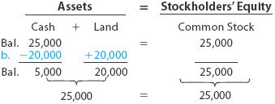</img>

|  | Assets (Activos) |  | = | Stockholders' Equity |  |
|------------------|----------------|----------|---|----------------------|----------|
|                  | Cash | Land | = | Common Stock |  |
| **Bal.**         | 25,000 | – | = | 25,000 |  |
| **Adj.**         | -20,000 | +20,000 | = | 0 |  |
| **Adj. Bal.**    | **5,000** | **20,000** | = | **25,000** |  |
| **Total**        | **25,000** |        | = | **25,000** |  |

$$
\text{Cash} + \text{Land} = \text{Common Stock}
$$

$$
\text{Cash} =  \$25,000 - \$20,000 = \$5,000 \quad 
$$

$$
\quad \text{Land} = \$20,000
$$

Después de la transacción:
- Cash = $5,000
- Land = $20,000
- Common Stock = $25,000

---

### Transaction C [Transacción C]

**Nov. 10, 20Y3** - NetSolutions purchased supplies for $1,350 and agreed to pay the supplier in the near future.
[10 de noviembre de 20Y3 - NetSolutions compró suministros por $1,350 y acordó pagar al proveedor en el futuro cercano.]

You have probably used a credit card to buy clothing or other merchandise. In this type of transaction, you received clothing for a promise to pay your credit card bill in the future. That is, you received an asset and incurred a liability to pay a future bill. NetSolutions entered into a similar transaction by purchasing supplies for $1,350 and agreeing to pay the supplier in the near future. This type of transaction is called a **purchase on account [compra a crédito]** and is often described as follows: *Purchased supplies on account, $1,350*
[Probablemente haya usado una tarjeta de crédito para comprar ropa u otros artículos. En este tipo de transacción, usted recibió ropa a cambio de una promesa de pagar su factura de tarjeta de crédito en el futuro. Es decir, recibió un activo e incurrió en un pasivo para pagar una factura futura. NetSolutions realizó una transacción similar al comprar suministros por $1,350 y acordar pagar al proveedor en el futuro cercano. Este tipo de transacción se llama **compra a crédito** y a menudo se describe de la siguiente manera: *Compró suministros a crédito, $1,350*]

The liability created by a purchase on account is called an **account payable [cuenta por pagar]** (The liability created by a purchase on account.)
[El pasivo creado por una compra a crédito.]

Items such as supplies that will be used in the business in the future are called **prepaid expenses [gastos pagados por adelantado]** (Assets created by making advanced payments for expense items, such as insurance premiums or supplies, that will be used in the business in the future.)
[Activos creados por realizar pagos anticipados por conceptos de gastos, como primas de seguros o suministros, que se utilizarán en el negocio en el futuro.]

which are assets. Thus, the effect of this transaction is to increase assets (Supplies) and liabilities (Accounts Payable) by $1,350.
[que son activos. Por lo tanto, el efecto de esta transacción es aumentar los activos (Suministros) y los pasivos (Cuentas por Pagar) en $1,350.]

**Effect on the accounting equation [Efecto en la ecuación contable]:**

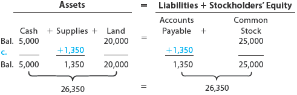</img>

|  | Assets (Activos) |  |  | = | Liabilities | + Stockholders' Equity |  |
|------------------|----------------|----------|----------|---|-------------|------------------------|--------------|
|                  | Cash | Supplies | Land | = | Accounts Payable | Common Stock |
| **Bal.**         | 5,000 | –     | 20,000 | = | –     | 25,000 |
| **Adj.**         | 0     | +1,350 | 0      | = | +1,350 | 0 |
| **Adj. Bal.**    | **5,000** | **1,350** | **20,000** | = | **1,350** | **25,000** |
| **Total**        | **26,350** |        |        | = | **26,350** |        |
``

$$
\text{Cash} + \text{Supplies} + \text{Land} = \text{Accounts Payable} + \text{Common Stock}
$$

$$
\$5,000 + \$1,350 + \$20,000 = \$1,350 + \$25,000
$$

---

### Transaction D [Transacción D]

**Nov. 18, 20Y3** - NetSolutions received cash of $7,500 for providing services to customers.
[18 de noviembre de 20Y3 - NetSolutions recibió efectivo de $7,500 por proporcionar servicios a los clientes.]

You may have earned money by painting houses or mowing lawns. If so, you received money for rendering services to a customer. Likewise, a business earns money by selling goods or services to its customers. This amount is called **revenue [ingreso]** .
[Es posible que haya ganado dinero pintando casas o cortando césped. Si es así, recibió dinero por prestar servicios a un cliente. Del mismo modo, un negocio gana dinero vendiendo bienes o servicios a sus clientes. Esta cantidad se llama **ingreso**.]

During its first month of operations, NetSolutions received cash of $7,500 for providing services to customers. The receipt of cash increases NetSolutions' assets and also increases stockholders' equity in the business. The revenues of $7,500 are recorded in a **Fees Earned [Honorarios Ganados]** column to the right of Common Stock.
[Durante su primer mes de operaciones, NetSolutions recibió efectivo de $7,500 por proporcionar servicios a los clientes. La recepción de efectivo aumenta los activos de NetSolutions y también aumenta el capital contable de los accionistas en el negocio. Los ingresos de $7,500 se registran en una columna de **Honorarios Ganados** a la derecha de Acciones Comunes.]

**Effect on the accounting equation [Efecto en la ecuación contable]:**

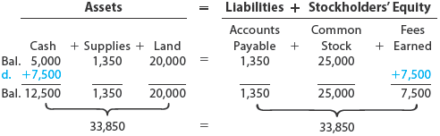</img>

|  | Assets (Activos) |  |  | = | Liabilities | + Stockholders' Equity |  |  |
|------------------|----------------|----------|----------|---|-------------|------------------------|--------------|--------------|
|                  | Cash | Supplies | Land | = | Accounts Payable | Common Stock | Fees Earned |  |
| **Bal.**         | 5,000 | 1,350 | 20,000 | = | 1,350 | 25,000 | – |  |
| **Adj.**         | +7,500 | – | – | = | – | – | +7,500 |  |
| **Adj. Bal.**    | **12,500** | **1,350** | **20,000** | = | **1,350** | **25,000** | **7,500** |  |
| **Total**        | **33,850** |        |        | = | **33,850** |        |        |  |

$$
\text{Cash} + \text{Supplies} + \text{Land} = \text{Accounts Payable} + \text{Common Stock} + \text{Fees Earned}
$$

$$
\$5,000 + \$1,350 + \$20,000 = \$1,350 + \$25,000 + \$7,500
$$

Diferentes términos se utilizan para los diferentes tipos de ingresos:

| English Term [Término en Inglés] | Spanish Translation [Traducción al Español] | Definition [Definición] |
|--------------------------------|---------------------------------------------|------------------------|
| **Fees earned [Honorarios ganados]** | Honorarios ganados | Revenue from providing services. [Ingresos por la prestación de servicios.] |
| **Sales [Ventas]** | Ventas | Revenue from the sale of merchandise. [Ingresos por la venta de mercancía.] |
| **Rent revenue [Ingreso por alquiler]** | Ingreso por alquiler | Earnings from property that is leased to others for use. [Ganancias por propiedades que se alquilan a otros para su uso.] |
| **Interest revenue [Ingreso por intereses]** | Ingreso por intereses | Earnings received for interest. [Ganancias recibidas por intereses.] |

Instead of receiving cash at the time services are provided or goods are sold, a business may accept payment at a later date. Such revenues are described as **fees earned on account [honorarios ganados a crédito]** or **sales on account [ventas a crédito]** . For example, if NetSolutions had provided services on account instead of for cash, transaction (d) would have been described as follows: *Fees earned on account, $7,500*.
[En lugar de recibir efectivo en el momento en que se prestan los servicios o se venden los bienes, una empresa puede aceptar el pago en una fecha posterior. Dichos ingresos se describen como **honorarios ganados a crédito** o **ventas a crédito**. Por ejemplo, si NetSolutions hubiera proporcionado servicios a crédito en lugar de en efectivo, la transacción (d) se habría descrito de la siguiente manera: *Honorarios ganados a crédito, $7,500*.]

In such cases, the firm has an asset, called an **account receivable [cuenta por cobrar]** (An asset, which is a claim against the customer created by selling merchandise or services on credit.)
[Un activo, que es un derecho de cobro contra el cliente creado por la venta de mercancía o servicios a crédito.]

which is a claim against the customer. The effect of the transaction increases Accounts Receivable and Fees Earned. When customers pay their accounts, Cash increases and Accounts Receivable decreases.
[que es un derecho de cobro contra el cliente. El efecto de la transacción aumenta Cuentas por Cobrar y Honorarios Ganados. Cuando los clientes pagan sus cuentas, el Efectivo aumenta y las Cuentas por Cobrar disminuyen.]

---

### Business Insight [Perspectiva Empresarial]

## Round-Tripping [Transacciones circulares]

**Round-tripping** is a situation whereby a company "sells" goods and services to another company and then, under a prearranged agreement, the customer resells the exact same goods and services back to the original company. Round-tripping has been used by companies to artificially inflate their sales. However, such agreements do not have commercial substance, since there is no economic change to either company after the round-trip. Thus, round-tripped sales are not transactions from an accounting perspective.
[**Round-tripping** es una situación en la que una empresa "vende" bienes y servicios a otra empresa y luego, bajo un acuerdo preestablecido, el cliente revende exactamente los mismos bienes y servicios a la empresa original. El round-tripping ha sido utilizado por empresas para inflar artificialmente sus ventas. Sin embargo, tales acuerdos no tienen sustancia comercial, ya que no hay cambio económico para ninguna de las dos empresas después del round-trip. Por lo tanto, las ventas circulares no son transacciones desde una perspectiva contable.]

---

### Transaction E [Transacción E]

**Nov. 30, 20Y3** - NetSolutions paid the following expenses during the month: wages, $2,125; rent, $800; utilities, $450; and miscellaneous, $275.
[30 de noviembre de 20Y3 - NetSolutions pagó los siguientes gastos durante el mes: salarios, $2,125; alquiler, $800; servicios públicos, $450; y varios, $275.]

During the month, NetSolutions spent cash or used up other assets in earning revenue. Assets used in this process of earning revenue are called **expenses [gastos]** . Expenses include supplies used and payments for employee wages, utilities, and other services.
[Durante el mes, NetSolutions gastó efectivo o utilizó otros activos para generar ingresos. Los activos utilizados en este proceso de generación de ingresos se llaman **gastos**. Los gastos incluyen suministros utilizados y pagos por salarios de empleados, servicios públicos y otros servicios.]

NetSolutions paid the following expenses during the month: wages, $2,125; rent, $800; utilities, $450; and miscellaneous, $275. Miscellaneous expenses include small amounts paid for such items as postage, coffee, and newspapers. The effect of expenses is the opposite of revenues in that expenses reduce assets and stockholders' equity. Like fees earned, the expenses are recorded in columns to the right of Common Stock. However, since expenses reduce stockholders' equity, the expenses are entered as negative amounts.
[NetSolutions pagó los siguientes gastos durante el mes: salarios, $2,125; alquiler, $800; servicios públicos, $450; y varios, $275. Los gastos varios incluyen pequeñas cantidades pagadas por artículos como correo, café y periódicos. El efecto de los gastos es el opuesto al de los ingresos, ya que los gastos reducen los activos y el capital contable de los accionistas. Al igual que los honorarios ganados, los gastos se registran en columnas a la derecha de Acciones Comunes. Sin embargo, dado que los gastos reducen el capital contable de los accionistas, los gastos se registran como cantidades negativas.]

**Effect on the accounting equation [Efecto en la ecuación contable]:**

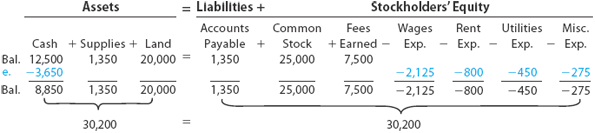</img>


|  | Assets (Activos) |  |  | = | Liabilities + | Stockholders' Equity |  |  |  |  |  |
|------------------|----------------|----------|----------|---|-------------|------------------------|--------------|--------------|--------------|--------------|--------------|
|                  | Cash | Supplies | Land | = | Accounts Payable | Common Stock | Fees Earned | Wages | Rent | Utilities | Miscellaneous |
| **Bal.**         | 12,500 | 1,350 | 20,000 | = | 1,350 | 25,000 | 7,500 | – | – | – | – |
| **Adj.**         | -3,650 | – | – | = | – | – | – | -2,125 | -800 | -450 | -275 |
| **Adj. Bal.**    | **8,850** | **1,350** | **20,000** | = | **1,350** | **25,000** | **7,500** | **-2,125** | **-800** | **-450** | **-275** |
| **Total**        | **30,200** |        |        | = | **30,200** |        |        |        |        |        |        |


Businesses usually record each revenue and expense transaction as it occurs. However, to simplify, NetSolutions' revenues and expenses are summarized for the month in transactions (d) and (e).
[Las empresas generalmente registran cada transacción de ingresos y gastos a medida que ocurre. Sin embargo, para simplificar, los ingresos y gastos de NetSolutions se resumen para el mes en las transacciones (d) y (e).]

---

### Transaction F [Transacción F]

**Nov. 30, 20Y3** - NetSolutions paid creditors on account, $950.
[30 de noviembre de 20Y3 - NetSolutions pagó a los acreedores a crédito, $950.]

When you pay your monthly credit card bill, you decrease the cash and decrease the amount you owe to the credit card company. Likewise, when NetSolutions paid $950 to creditors during the month, it reduced assets and liabilities.
[Cuando paga su factura mensual de tarjeta de crédito, disminuye el efectivo y disminuye el monto que le debe a la compañía de la tarjeta de crédito. Del mismo modo, cuando NetSolutions pagó $950 a los acreedores durante el mes, redujo los activos y los pasivos.]

**Effect on the accounting equation [Efecto en la ecuación contable]:**

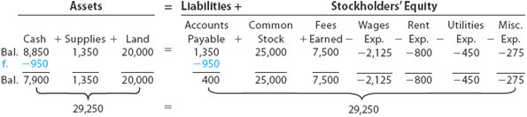</img>

|  | Assets (Activos) |  |  | = | Liabilities + |  Stockholders' Equity |  |  |  |  |  |  |
|------------------|----------------|----------|--------|---|-------------|------------------------|--------------|-------------|--------|------|------------|----------------|
|                  | Cash | Supplies | Land | = | Accounts Payable | Common Stock | Fees Earned | Wages | Rent | Utilities | Miscellaneous |
| **Bal.**         | 8,850 | 1,350 | 20,000 | = | 1,350 | 25,000 | 7,500 | -2,125 | -800 | -450 | -275 |
| **Adj.**         | -950  | 0     | 0      | = | -950  | 0      | 0     | 0      | 0    | 0    | 0 |
| **Adj. Bal.**    | 7,900 | 1,350 | 20,000 | = | 400   | 25,000 | 7,500 | -2,125 | -800 | -450 | -275 |
| **Total**        | **29,250** |        |        | = | **29,250** |        |        |        |        |        |        |


Paying an amount on account is different from paying an expense. The paying of an expense reduces stockholders' equity, as illustrated in transaction (e). Paying an amount on account reduces the amount owed on a liability.
[Pagar una cantidad a crédito es diferente de pagar un gasto. El pago de un gasto reduce el capital contable de los accionistas, como se ilustra en la transacción (e). Pagar una cantidad a crédito reduce el monto adeudado en un pasivo.]

---

### Transaction G [Transacción G]

**Nov. 30, 20Y3** - Chris Clark determined that the cost of supplies on hand at the end of the month was $550.
[30 de noviembre de 20Y3 - Chris Clark determinó que el costo de los suministros disponibles al final del mes era de $550.]

The cost of the supplies on hand (not yet used) at the end of the month is $550. Thus, $800 ($1,350 - $550) of supplies must have been used during the month. This decrease in supplies is recorded as an expense, as follows:
[El costo de los suministros disponibles (aún no utilizados) al final del mes es de $550. Por lo tanto, $800 ($1,350 - $550) de suministros deben haber sido utilizados durante el mes. Esta disminución en los suministros se registra como un gasto, de la siguiente manera:]

**Effect on the accounting equation [Efecto en la ecuación contable]:**

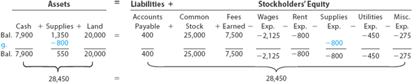</img>

|  | Assets (Activos) |  |  | = | Liabilities +|  Stockholders' Equity |  |  |  |  |  |  |  |
|------------------|----------------|----------|----------|---|-------------|------------------------|--------------|--------------|--------------|--------------|--------------|--------------|--------------|
|                  | Cash | Supplies | Land | = | Accounts Payable | Common Stock | Fees Earned | Wages Exp. | Rent Exp. | Supplies Exp. | Utilities Exp. | Misc. Exp. |
| **Bal.**         | 7,900 | 1,350 | 20,000 | = | 400 | 25,000 | 7,500 | -2,125 | -800 |  | -450 | -275 |
| **Adj.**         | 0     | -800  | 0      | = | 0   | 0      | 0     | 0      | 0    | -800 | 0 | 0 |
| **Adj. Bal.**    | 7,900 | 550   | 20,000 | = | 400 | 25,000 | 7,500 | -2,125 | -800 | -800 | -450 | -275 |
| **Total**        | **28,450** |        |        | = | **28,450** |        |        |        |        |        |        |        |
``


*Note: Supplies decreased from $1,350 to $550, and Supplies Expense of $800 is recorded.*
[*Nota: Los suministros disminuyeron de $1,350 a $550, y se registró un Gasto por Suministros de $800.*]

---

### Transaction H [Transacción H]

**Nov. 30, 20Y3** - Paid dividends, $2,000.
[30 de noviembre de 20Y3 - Pagó dividendos, $2,000.]

**Dividends [Dividendos]** (Distributions of earnings to stockholders; an account representing the distribution of a corporation's earnings to stockholders.)
[Distribuciones de ganancias a los accionistas; una cuenta que representa la distribución de las ganancias de una corporación a los accionistas.]

are distributions of earnings to stockholders. The payment of dividends decreases cash and stockholders' equity. Like expenses, dividends are recorded in a separate column to the right of Common Stock as a negative amount. The effect of the payment of dividends of $2,000 is as follows:
[son distribuciones de ganancias a los accionistas. El pago de dividendos disminuye el efectivo y el capital contable de los accionistas. Al igual que los gastos, los dividendos se registran en una columna separada a la derecha de Acciones Comunes como una cantidad negativa. El efecto del pago de dividendos de $2,000 es el siguiente:]

**Effect on the accounting equation [Efecto en la ecuación contable]:**

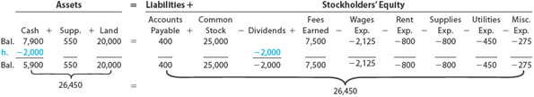</img>

## Accounting Equation

| |     |       |    Assets [Activos]    | = | Liabilities [Pasivos] | + Stockholders' Equity [Capital Contable] |  |     |     |     |     |     |     |
|---|---|---|---|---|---|---|---|---|---|---|---|---|---|
|     | Cash | + | Supplies | + | Land | Accounts Payable | Common Stock | Dividends | Fees Earned | Wages Exp. | Rent Exp. | Supplies Exp. | Utilities Exp. | Misc. Exp. |
| **Bal.** | 7,900 |   | 550 |   | 20,000 | = | 400 | + | 25,000 | 0 | 7,500 | -2,125 | -800 | -800 | -450 | -275 |
| **Adj.** | -2,000 |   | 0 |   | 0 | = | 0 | + | 0 | -2,000 | 0 | 0 | 0 | 0 | 0 | 0 |
| **Adj. Bal.** | **5,900** |   | **550** |   | **20,000** | = | **400** | + | **25,000** | **-2,000** | **7,500** | **-2,125** | **-800** | **-800** | **-450** | **-275** |
| **Total** | **26,450** |   |       |   |       | = | **26,450** |   |       |     |     |     |     |     |     |     |


**Verification [Verificación]:**

$$
\text{Assets} = \text{Liabilities} + \text{Stockholders' Equity}
$$

$$
\$5,900 + \$550 + \$20,000 = \$400 + \$25,000 + \$7,500 - \$2,125 - \$800 - \$800 - \$450 - \$275 - \$2,000
$$

$$
\$26,450 = \$26,450
$$ 

---

### Summary of Transactions [Resumen de Transacciones]

| Transaction | Description [Descripción] | Effect on Equation [Efecto en la Ecuación] |
|-------------|---------------------------|---------------------------------------------|
| A | Investment of cash by owner [Inversión de efectivo por el dueño] | Increase Cash, Increase Common Stock |
| B | Purchase of land for cash [Compra de terreno al contado] | Decrease Cash, Increase Land |
| C | Purchase of supplies on account [Compra de suministros a crédito] | Increase Supplies, Increase Accounts Payable |
| D | Receipt of cash for services [Recepción de efectivo por servicios] | Increase Cash, Increase Fees Earned |
| E | Payment of expenses [Pago de gastos] | Decrease Cash, Increase Expenses (decrease equity) |
| F | Payment to creditors on account [Pago a acreedores a crédito] | Decrease Cash, Decrease Accounts Payable |
| G | Use of supplies and payment of dividends [Uso de suministros y pago de dividendos] | Decrease Supplies, Increase Supplies Expense; Decrease Cash, Increase Dividends |

---

<h1 id="020166" style="color:#E65100;">
  <a href="#Chapter_001" style="color:inherit; text-decoration:none;">
    1-4a Summary [Resumen]

  </a>
</h1>

## 1-4a Summary [Resumen]

The transactions of NetSolutions are summarized in **Exhibit 6 [Figura 6]** . Each transaction is identified by letter, and the balance of each accounting equation element is shown after every transaction.
[Las transacciones de NetSolutions se resumen en la **Figura 6**. Cada transacción se identifica con una letra, y el saldo de cada elemento de la ecuación contable se muestra después de cada transacción.]

---

### Exhibit 6 [Figura 6]

## Summary of Transactions for NetSolutions [Resumen de Transacciones para NetSolutions]

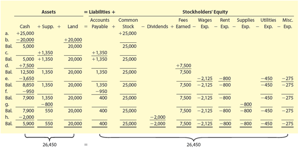</img>

|  | Assets (Activos) |  |  | = | Liabilities | + Stockholders' Equity |  |  |  |  |  |  |  |
|------------------|----------------|----------|----------|---|-------------|------------------------|--------------|--------------|--------------|--------------|--------------|--------------|--------------|
|                  | Cash | Supplies | Land | = | Accounts Payable | Common Stock | Dividends | Fees Earned | Wages Exp. | Rent Exp. | Supplies Exp. | Utilities Exp. | Misc. Exp. |
| **a. Bal.**      | 25,000 | – | – | = | – | 25,000 | – | – | – | – | – | – | – |
| **b. Adj.**      | -20,000 | – | +20,000 | = | – | – | – | – | – | – | – | – | – |
| **c. Bal.**      | 5,000 | – | 20,000 | = | – | 25,000 | – | – | – | – | – | – | – |
| **d. Adj.**      | 0 | +1,350 | 0 | = | +1,350 | 0 | – | – | – | – | – | – | – |
| **e. Bal.**      | 5,000 | 1,350 | 20,000 | = | 1,350 | 25,000 | – | – | – | – | – | – |
| **f. Adj.**      | +7,500 | – | – | = | – | – | – | +7,500 | – | – | – | – | – |
| **g. Bal.**      | 12,500 | 1,350 | 20,000 | = | 1,350 | 25,000 | – | 7,500 | – | – | – | – |
| **h. Adj.**      | -3,650 | – | – | = | -950 | – | -2,000 | – | -2,125 | -800 | -800 | -450 | -275 |
| **Final Bal.**   | **8,850** | **550** | **20,000** | = | **400** | **25,000** | **-2,000** | **7,500** | **-2,125** | **-800** | **-800** | **-450** | **-275** |
| **Total**        | **26,450** |        |        | = | **26,450** |        |        |        |        |        |        |        |        |


*[Image: Summary of transactions A through H showing the accounting equation after each transaction]*
*[Imagen: Resumen de las transacciones A a H mostrando la ecuación contable después de cada transacción]*

---

### Key Observations [Observaciones Clave]

You should note the following:
[Debe tener en cuenta lo siguiente:]

1. **The effect of every transaction is an increase or a decrease in one or more of the accounting equation elements.**
   [El efecto de cada transacción es un aumento o una disminución en uno o más de los elementos de la ecuación contable.]

2. **The two sides of the accounting equation are always equal.**
   [Los dos lados de la ecuación contable son siempre iguales.]

3. **The stockholders' equity [capital contable de los accionistas]** is increased by amounts invested by stockholders (**common stock [acciones comunes]**).
   [El **capital contable de los accionistas** aumenta por las cantidades invertidas por los accionistas (**acciones comunes**).]

4. **The stockholders' equity [capital contable de los accionistas]** is increased by **revenues [ingresos]** and decreased by **expenses [gastos]**.
   [El **capital contable de los accionistas** aumenta por los **ingresos** y disminuye por los **gastos**.]

5. **The stockholders' equity [capital contable de los accionistas]** is decreased by **dividends [dividendos]** paid to stockholders.
   [El **capital contable de los accionistas** disminuye por los **dividendos** pagados a los accionistas.]

---

### Summary Table [Tabla Resumen]

| Transaction | Description [Descripción] | Effect on Equation [Efecto en la Ecuación] |
|-------------|---------------------------|---------------------------------------------|
| A | Investment of cash by owner [Inversión de efectivo por el dueño] | Increase Cash, Increase Common Stock |
| B | Purchase of land for cash [Compra de terreno al contado] | Decrease Cash, Increase Land |
| C | Purchase of supplies on account [Compra de suministros a crédito] | Increase Supplies, Increase Accounts Payable |
| D | Receipt of cash for services [Recepción de efectivo por servicios] | Increase Cash, Increase Fees Earned |
| E | Payment of expenses [Pago de gastos] | Decrease Cash, Increase Expenses (decrease equity) |
| F | Payment to creditors on account [Pago a acreedores a crédito] | Decrease Cash, Decrease Accounts Payable |
| G | Use of supplies [Uso de suministros] | Decrease Supplies, Increase Supplies Expense |
| H | Payment of dividends [Pago de dividendos] | Decrease Cash, Increase Dividends (decrease equity) |

---

### Verification [Verificación]

After all transactions, the accounting equation remains in balance:
[Después de todas las transacciones, la ecuación contable permanece en equilibrio:]

$$
\text{Assets} = \text{Liabilities} + \text{Stockholders' Equity}
$$

$$
\text{Activos} = \text{Pasivos} + \text{Capital Contable}
$$

---

<h1 id="943711" style="color:#E65100;">
  <a href="#Chapter_001" style="color:inherit; text-decoration:none;">
    1-4b Classifications of Stockholders' Equity [Clasificaciones del Capital Contable de los Accionistas]
  </a>
</h1>

**Stockholders' equity [Capital contable de los accionistas]** is classified as:
[El **capital contable de los accionistas** se clasifica como:]

- **Common Stock [Acciones Comunes]**
- **Retained Earnings [Ganancias Retenidas]**

---

### Common Stock [Acciones Comunes]

**Common stock [Acciones comunes]** is shares of ownership distributed to investors of a corporation. It represents the portion of stockholders' equity contributed by investors. For NetSolutions, shares of common stock of $25,000 were distributed to Chris Clark in exchange for investing in the business.
[**Las acciones comunes** son acciones de propiedad distribuidas a los inversores de una corporación. Representan la porción del capital contable de los accionistas contribuida por los inversores. Para NetSolutions, se distribuyeron acciones comunes por valor de $25,000 a Chris Clark a cambio de su inversión en el negocio.]

---

### Retained Earnings [Ganancias Retenidas]

**Retained earnings [Ganancias retenidas]** (The stockholders' equity created from business operations through revenue and expense transactions; an account representing the net income retained in a corporation.)
[El capital contable de los accionistas creado a partir de las operaciones comerciales a través de transacciones de ingresos y gastos; una cuenta que representa el ingreso neto retenido en una corporación.]

is the stockholders' equity created from business operations through revenue and expense transactions. For NetSolutions, retained earnings of $3,050 were created by its November operations (revenue and expense transactions), computed as follows:
[es el capital contable de los accionistas creado a partir de las operaciones comerciales a través de transacciones de ingresos y gastos. Para NetSolutions, se crearon ganancias retenidas de $3,050 mediante sus operaciones de noviembre (transacciones de ingresos y gastos), calculadas de la siguiente manera:]

---

### Retained Earnings Calculation for NetSolutions [Cálculo de Ganancias Retenidas para NetSolutions]

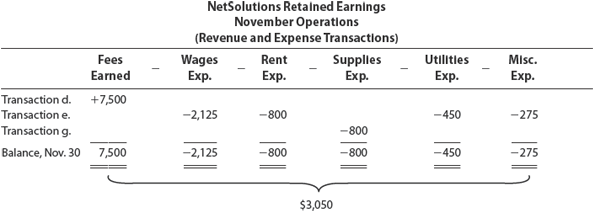</img>


**NetSolutions Retained Earnings [Ganancias Retenidas de NetSolutions]**
**November Operations [Operaciones de Noviembre]**
**(Revenue and Expense Transactions) [(Transacciones de Ingresos y Gastos)]**

| Transaction | Fees Earned | Wages Exp. | Rent Exp. | Supplies Exp. | Utilities Exp. | Misc. Exp. |
|-------------|-------------|------------|-----------|---------------|----------------|-------------|
| Transaction d. | +7,500 | | | | | |
| Transaction e. | | -2,125 | -800 | | -450 | -275 |
| Transaction g. | | | | -800 | | |
| **Balance, Nov. 30** | **+7,500** | **-2,125** | **-800** | **-800** | **-450** | **-275** |

**Calculation [Cálculo]:**

$$
\text{Retained Earnings} = \text{Fees Earned} - \text{All Expenses}
$$

$$
\text{Retained Earnings} = \$7,500 - \$2,125 - \$800 - \$800 - \$450 - \$275
$$

$$
\text{Retained Earnings} = \$7,500 - \$4,450 = \$3,050
$$

---

### Effect of Dividends [Efecto de los Dividendos]

Stockholders' equity created by investments by stockholders (**common stock [acciones comunes]**) and by business operations (**retained earnings [ganancias retenidas]**) are reported separately. Since **dividends [dividendos]** are distributions of earnings to stockholders, dividends reduce retained earnings. NetSolutions paid $2,000 in dividends during November, thus reducing retained earnings to $1,050 ($3,050 - $2,000).
[El capital contable de los accionistas creado por inversiones de los accionistas (**acciones comunes**) y por operaciones comerciales (**ganancias retenidas**) se reporta por separado. Dado que los **dividendos** son distribuciones de ganancias a los accionistas, los dividendos reducen las ganancias retenidas. NetSolutions pagó $2,000 en dividendos durante noviembre, reduciendo así las ganancias retenidas a $1,050 ($3,050 - $2,000).]

**Formula for Retained Earnings after Dividends [Fórmula para Ganancias Retenidas después de Dividendos]:**

$$
\text{Retained Earnings (after dividends)} = \text{Retained Earnings (before dividends)} - \text{Dividends}
$$

$$
\text{Retained Earnings (after dividends)} = \$3,050 - \$2,000 = \$1,050
$$

---

### Exhibit 7 [Figura 7]

## Effects of Transactions on Stockholders' Equity [Efectos de las Transacciones en el Capital Contable de los Accionistas]

</img>

```text
Stockholders' Equity
  ----------------------------------------------------------------

        +                     −              +              −
  ┌───────────────┬──────────────────┬──────────────┬───────────────┐
  │ Investments   │ Distributions    │ Revenues     │ Expenses      │
  └───────────────┴──────────────────┴──────────────┴───────────────┘
          │                 │                │              │
          │                 │                │              │
          ▼                 ▼                ▼              ▼
  ┌───────────────┐   ┌───────────┐   ┌────────────────────────────┐
  │ Common Stock  │   │ Dividends │   │     Net Income (Net Loss)  │
  └───────────────┘   └───────────┘   └────────────────────────────┘
          │                  │                      │
          ▼                  ▼                      ▼

  └───────────────┘       └───────────────────────────────────┘
    Common Stock                   Retained Earnings
```

**The effects of investments by stockholders, dividends, revenues, and expenses on stockholders' equity are as follows:**
[Los efectos de las inversiones de los accionistas, dividendos, ingresos y gastos en el capital contable de los accionistas son los siguientes:]

| Transaction Type | Effect on Stockholders' Equity |
|-----------------|--------------------------------|
| **Investment by stockholders (Common Stock)** | **Increase** [+] |
| **Revenues** | **Increase** [+] |
| **Expenses** | **Decrease** [-] |
| **Dividends** | **Decrease** [-] |

**General Formulas [Fórmulas Generales]:**

$$
\text{Stockholders' Equity} = \text{Common Stock} + \text{Retained Earnings}
$$

$$
\text{Retained Earnings} = \text{Revenues} - \text{Expenses} - \text{Dividends}
$$

$$
\text{Net Income} = \text{Revenues} - \text{Expenses}
$$

---
### Check Up Corner 1-1 [Esquina de Verificación 1-1]

## Business Transactions and the Accounting Equation [Transacciones Comerciales y la Ecuación Contable]

**Drive Time Delivery** is a local delivery service operating in Cleveland, Ohio. On February 1, Drive Time has the following balances:
[**Drive Time Delivery** es un servicio de entrega local que opera en Cleveland, Ohio. El 1 de febrero, Drive Time tiene los siguientes saldos:]

| Account [Cuenta] | Balance [Saldo] |
|-----------------|-----------------|
| Cash [Efectivo] | $32,500 |
| Accounts Receivable [Cuentas por Cobrar] | $5,000 |
| Accounts Payable [Cuentas por Pagar] | $2,500 |
| Common Stock [Acciones Comunes] | $32,500 |
| Fees Earned [Honorarios Ganados] | $5,000 |
| Wages Expense [Gasto por Salarios] | $2,500 |

Drive Time Delivery completed the following transactions during February:
[Drive Time Delivery realizó las siguientes transacciones durante febrero:]

| Transaction | Description [Descripción] |
|-------------|---------------------------|
| **a.** | Received cash from owner as an additional investment in common stock, $20,000 [Recibió efectivo del dueño como inversión adicional en acciones comunes, $20,000] |
| **b.** | Paid creditors on account, $2,000 [Pagó a acreedores a crédito, $2,000] |
| **c.** | Received cash from customers on account, $5,000 [Recibió efectivo de clientes a crédito, $5,000] |
| **d.** | Billed customers for delivery services on account, $18,000 [Facturó a clientes por servicios de entrega a crédito, $18,000] |
| **e.** | Paid wages expense, $10,000 [Pagó gasto por salarios, $10,000] |
| **f.** | Paid utilities expense, $3,000 [Pagó gasto por servicios públicos, $3,000] |
| **g.** | Paid dividends, $4,500 [Pagó dividendos, $4,500] |

**Requirement [Requisito]:**
Indicate the effect that each of these transactions has on the following accounting equation elements: **Cash, Accounts Receivable, Accounts Payable, Common Stock, Dividends, Fees Earned, Wages Expense, Utilities Expense.**
[Indique el efecto que cada una de estas transacciones tiene en los siguientes elementos de la ecuación contable: **Efectivo, Cuentas por Cobrar, Cuentas por Pagar, Acciones Comunes, Dividendos, Honorarios Ganados, Gasto por Salarios, Gasto por Servicios Públicos.** ]

---

### Solution [Solución]

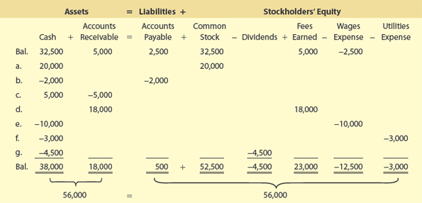</img>

**Step-by-step calculation [Cálculo paso a paso]:**

|  | Assets (Activos) |  | = | Liabilities | + | Stockholders' Equity |  |  |  |  |
|---|---|---|---|---|---|---|---|---|---|---|
|  | Cash | + | Accounts Receivable | = | Accounts Payable | + | Common Stock | + | Fees Earned | - | Wages Exp. | - | Utilities Exp. | - | Dividends |
| **Bal.** | 32,500 | | 5,000 | = | 2,500 | | 32,500 | | 5,000 | | 2,500 | | 0 | | 0 |
| **a.** | +20,000 | | – | = | – | | +20,000 | | – | | – | | – | | – |
| **b.** | -2,000 | | – | = | -2,000 | | – | | – | | – | | – | | – |
| **c.** | +5,000 | | -5,000 | = | – | | – | | – | | – | | – | | – |
| **d.** | – | | +18,000 | = | – | | – | | +18,000 | | – | | – | | – |
| **e.** | -10,000 | | – | = | – | | – | | – | | +10,000 | | – | | – |
| **f.** | -3,000 | | – | = | – | | – | | – | | – | | +3,000 | | – |
| **g.** | -4,500 | | – | = | – | | – | | – | | – | | – | | +4,500 |
| **Final Bal.** | **38,000** | | **18,000** | = | **500** | | **52,500** | | **23,000** | | **12,500** | | **3,000** | | **4,500** |
| **Total** | **56,000** | | | = | | | **56,000** | | | | | | | | |

**Final Balances [Saldos Finales]:**

| Account [Cuenta] | Balance [Saldo] |
|-----------------|-----------------|
| Cash [Efectivo] | $38,000 |
| Accounts Receivable [Cuentas por Cobrar] | $18,000 |
| Accounts Payable [Cuentas por Pagar] | $500 |
| Common Stock [Acciones Comunes] | $52,500 |
| Dividends [Dividendos] | $4,500 |
| Fees Earned [Honorarios Ganados] | $23,000 |
| Wages Expense [Gasto por Salarios] | $12,500 |
| Utilities Expense [Gasto por Servicios Públicos] | $3,000 |

---

### Effects Summary Table [Tabla Resumen de Efectos]

| Transaction | Cash | Accounts Receivable | Accounts Payable | Common Stock | Dividends | Fees Earned | Wages Expense | Utilities Expense |
|-------------|------|---------------------|------------------|--------------|-----------|-------------|---------------|-------------------|
| **a.** | ↑ | | | ↑ | | | | |
| **b.** | ↓ | | ↓ | | | | | |
| **c.** | ↑ | ↓ | | | | | | |
| **d.** | | ↑ | | | | ↑ | | |
| **e.** | ↓ | | | | | | ↑ | |
| **f.** | ↓ | | | | | | | ↑ |
| **g.** | ↓ | | | | ↑ | | | |

**Legend [Leyenda]:**
- ↑ = Increase [Aumento]
- ↓ = Decrease [Disminución]

---

### Accounting Equation Formulas [Fórmulas de la Ecuación Contable]

**Basic Accounting Equation [Ecuación Contable Básica]:**

$$
\text{Assets} = \text{Liabilities} + \text{Stockholders' Equity}
$$

$$
\text{Activos} = \text{Pasivos} + \text{Capital Contable de los Accionistas}
$$

**Expanded Accounting Equation [Ecuación Contable Expandida]:**

$$
\text{Assets} = \text{Liabilities} + \text{Common Stock} + \text{Revenues} - \text{Expenses} - \text{Dividends}
$$

$$
\text{Activos} = \text{Pasivos} + \text{Acciones Comunes} + \text{Ingresos} - \text{Gastos} - \text{Dividendos}
$$

**Net Income Formula [Fórmula del Ingreso Neto]:**

$$
\text{Net Income} = \text{Revenues} - \text{Expenses}
$$

$$
\text{Ingreso Neto} = \text{Ingresos} - \text{Gastos}
$$

**Ending Retained Earnings Formula [Fórmula de Ganancias Retenidas Finales]:**

$$
\text{Ending Retained Earnings} = \text{Beginning Retained Earnings} + \text{Net Income} - \text{Dividends}
$$

$$
\text{Ganancias Retenidas Finales} = \text{Ganancias Retenidas Iniciales} + \text{Ingreso Neto} - \text{Dividendos}
$$

---

### Drive Time Delivery - Initial Accounting Equation [Ecuación Contable Inicial]

**February 1 balances [Saldos del 1 de febrero]:**

$$
\text{Assets} = \text{Liabilities} + \text{Stockholders' Equity}
$$

$$
\text{Cash} + \text{Accounts Receivable} = \text{Accounts Payable} + \text{Common Stock} + \text{Fees Earned} - \text{Wages Expense}
$$

$$
\$32,500 + \$5,000 = \$2,500 + \$32,500 + \$5,000 - \$2,500
$$

$$
\$37,500 = \$37,500
$$

---

### Final Accounting Equation after all transactions [Ecuación Contable Final después de todas las transacciones]

**After transactions a through g [Después de las transacciones a hasta g]:**

$$
\text{Assets} = \text{Liabilities} + \text{Stockholders' Equity}
$$

$$
\text{Cash} + \text{Accounts Receivable} = \text{Accounts Payable} + \text{Common Stock} + \text{Fees Earned} - \text{Wages Expense} - \text{Utilities Expense} - \text{Dividends}
$$

$$
\$38,000 + \$18,000 = \$500 + \$52,500 + \$23,000 - \$12,500 - \$3,000 - \$4,500
$$

$$
\$56,000 = \$56,000
$$

---

### Verification [Verificación]

**Total Assets [Total Activos]:**
$$
\$38,000 + \$18,000 = \$56,000
$$

**Total Liabilities + Stockholders' Equity [Total Pasivos + Capital Contable]:**
$$
\$500 + \$52,500 + \$23,000 - \$12,500 - \$3,000 - \$4,500 = \$56,000
$$

**The accounting equation is in balance [La ecuación contable está en equilibrio]:** ✅

$$
\$56,000 = \$56,000
$$

---

<h1 id="106292" style="color:#E65100;">
  <a href="#Chapter_001" style="color:inherit; text-decoration:none;">
    1-5 Financial Statements [Estados Financieros]
  </a>
</h1>


After transactions have been recorded and summarized, reports are prepared for users. The accounting reports providing this information are called **financial statements [estados financieros]** (Financial reports that summarize the effects of events on a business.)
[Después de que las transacciones han sido registradas y resumidas, se preparan informes para los usuarios. Los informes contables que proporcionan esta información se llaman **estados financieros** (Informes financieros que resumen los efectos de los eventos en un negocio).]

The primary financial statements of a corporation are the:
[Los estados financieros principales de una corporación son:]

1. **Income Statement [Estado de Resultados]**
2. **Statement of Stockholders' Equity [Estado de Cambios en el Capital Contable de los Accionistas]**
3. **Balance Sheet [Balance General]**
4. **Statement of Cash Flows [Estado de Flujos de Efectivo]**

The order in which the financial statements are prepared and the nature of each statement are described in **Exhibit 8 [Figura 8]** .
[El orden en que se preparan los estados financieros y la naturaleza de cada estado se describen en la **Figura 8**.]

---

### Exhibit 8 [Figura 8]

## Financial Statements [Estados Financieros]

| Order Prepared [Orden de Preparación] | Financial Statement [Estado Financiero] | Description of Statement [Descripción del Estado] |
|---------------------------------------|-----------------------------------------|-----------------------------------------------------|
| 1 | **Income Statement [Estado de Resultados]** (A summary of the revenue and expenses for a specific period of time, such as a month or a year.) [Un resumen de los ingresos y gastos para un período de tiempo específico, como un mes o un año.] | A summary of the revenue and expenses for a specific period of time, such as a month or year. [Un resumen de los ingresos y gastos para un período de tiempo específico, como un mes o un año.] |
| 2 | **Statement of Stockholders' Equity [Estado de Cambios en el Capital Contable de los Accionistas]** (A summary of the changes in the stockholders' equity in a corporation that have occurred during a specific period of time, such as a month or a year.) [Un resumen de los cambios en el capital contable de los accionistas en una corporación que han ocurrido durante un período de tiempo específico, como un mes o un año.] | A summary of the changes in stockholders' equity that have occurred during a specific period of time, such as a month or a year. [Un resumen de los cambios en el capital contable de los accionistas que han ocurrido durante un período de tiempo específico, como un mes o un año.] |
| 3 | **Balance Sheet [Balance General]** (A list of the assets, liabilities, and stockholders' equity as of a specific date, usually at the close of the last day of a month or a year.) [Una lista de los activos, pasivos y capital contable de los accionistas a una fecha específica, generalmente al cierre del último día de un mes o un año.] | A list of the assets, liabilities, and stockholders' equity as of a specific date, usually at the close of the last day of a month or a year. [Una lista de los activos, pasivos y capital contable de los accionistas a una fecha específica, generalmente al cierre del último día de un mes o un año.] |
| 4 | **Statement of Cash Flows [Estado de Flujos de Efectivo]** | A summary of the cash receipts and cash payments for a specific period of time, such as a month or a year. [Un resumen de los recibos de efectivo y pagos de efectivo para un período de tiempo específico, como un mes o un año.] |

---

### Exhibit 9 [Figura 9]

## Financial Statements for NetSolutions [Estados Financieros para NetSolutions]

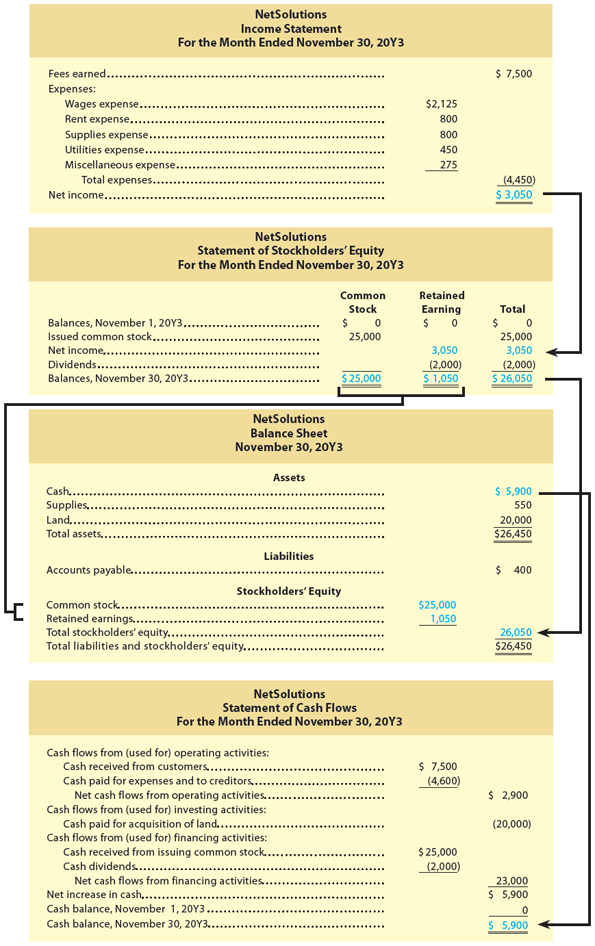</img>

*[Image: Financial statements for NetSolutions including Income Statement, Statement of Stockholders' Equity, Balance Sheet, and Statement of Cash Flows]*
*[Imagen: Estados financieros para NetSolutions que incluyen el Estado de Resultados, Estado de Cambios en el Capital Contable de los Accionistas, Balance General y Estado de Flujos de Efectivo]*


## NetSolutions

### Income Statement [Estado de Resultados]
**For the Month Ended November 30, 20Y3**

| Concept | | Amount ($) |
|---------|---------|------------|
| Fees earned | | 7,500 |
| | | |
| **Expenses:** | | |
| Wages expense | 2,125 | |
| Rent expense | 800 | |
| Supplies expense | 800 | |
| Utilities expense | 450 | |
| Miscellaneous expense | 275 | |
| **Total expenses** | | (4,450) |
| **Net income** | | **3,050** |

---

### Statement of Stockholders' Equity [Estado de Cambios en el Capital Contable]
**For the Month Ended November 30, 20Y3**

| Concept | Common Stock | Retained Earnings | Total |
|---------|--------------|-------------------|-------|
| Balances, November 1, 20Y3 | $0 | $0 | $0 |
| Issued common stock | 25,000 | | 25,000 |
| Net income | | 3,050 | 3,050 |
| Dividends | | (2,000) | (2,000) |
| **Balances, November 30, 20Y3** | **$25,000** | **$1,050** | **$26,050** |

---

### Balance Sheet [Balance General]
**November 30, 20Y3**

| Concept | | Amount ($) |
|---------|---------|------------|
| **Assets** | | |
| Cash | 5,900 | |
| Supplies | 550 | |
| Land | 20,000 | |
| **Total assets** | | **26,450** |
| | | |
| **Liabilities** | | |
| Accounts payable | 400 | |
| | | |
| **Stockholders' Equity** | | |
| Common stock | 25,000 | |
| Retained earnings | 1,050 | |
| **Total stockholders' equity** | | **26,050** |
| | | |
| **Total liabilities and stockholders' equity** | | **26,450** |

---

### Statement of Cash Flows [Estado de Flujos de Efectivo]
**For the Month Ended November 30, 20Y3**

| Concept | | Amount ($) |
|---------|---------|------------|
| **Cash flows from operating activities:** | | |
| Cash received from customers | 7,500 | |
| Cash paid for expenses and to creditors | (4,600) | |
| **Net cash flows from operating activities** | | **2,900** |
| | | |
| **Cash flows from investing activities:** | | |
| Cash paid for acquisition of land | (20,000) | |
| | | |
| **Cash flows from financing activities:** | | |
| Cash received from issuing common stock | 25,000 | |
| Cash dividends | (2,000) | |
| **Net cash flows from financing activities** | | **23,000** |
| | | |
| **Net increase in cash** | | **5,900** |
| Cash balance, November 1, 20Y3 | | 0 |
| **Cash balance, November 30, 20Y3** | | **5,900** |


---

### Important Notes [Notas Importantes]

All financial statements are identified by:
[Todos los estados financieros se identifican por:]

1. **The name of the business** [El nombre del negocio]
2. **The title of the statement** [El título del estado]
3. **The date or period of time** [La fecha o período de tiempo]

**Key distinction [Distinción clave]:**

| Type of Statement [Tipo de Estado] | Period/Date [Período/Fecha] |
|-----------------------------------|----------------------------|
| Income Statement [Estado de Resultados] | **Period of time** [Período de tiempo] |
| Statement of Stockholders' Equity [Estado de Cambios en el Capital Contable] | **Period of time** [Período de tiempo] |
| Statement of Cash Flows [Estado de Flujos de Efectivo] | **Period of time** [Período de tiempo] |
| Balance Sheet [Balance General] | **Specific date** [Fecha específica] |

The data presented in the **income statement, the statement of stockholders' equity, and the statement of cash flows** are for a **period of time**. The data presented in the **balance sheet** are for a **specific date**.
[Los datos presentados en el **estado de resultados, el estado de cambios en el capital contable de los accionistas y el estado de flujos de efectivo** son para un **período de tiempo**. Los datos presentados en el **balance general** son para una **fecha específica**.]

---

### Summary of Financial Statements [Resumen de los Estados Financieros]

| Statement [Estado] | Purpose [Propósito] | Time Period [Período] |
|-------------------|---------------------|----------------------|
| **Income Statement [Estado de Resultados]** | Reports revenues and expenses [Reporta ingresos y gastos] | Period of time [Período de tiempo] |
| **Statement of Stockholders' Equity [Estado de Cambios en el Capital Contable]** | Reports changes in stockholders' equity [Reporta cambios en el capital contable de los accionistas] | Period of time [Período de tiempo] |
| **Balance Sheet [Balance General]** | Reports assets, liabilities, and equity [Reporta activos, pasivos y capital contable] | Specific date [Fecha específica] |
| **Statement of Cash Flows [Estado de Flujos de Efectivo]** | Reports cash receipts and payments [Reporta recibos y pagos de efectivo] | Period of time [Período de tiempo] |

---

### Interrelationships Among Financial Statements [Interrelaciones entre los Estados Financieros]

The four financial statements are interrelated as follows:
[Los cuatro estados financieros están interrelacionados de la siguiente manera:]

1. **Net income (or net loss)** from the **Income Statement** is used in preparing the **Statement of Stockholders' Equity**.
   [**El ingreso neto (o pérdida neta)** del **Estado de Resultados** se utiliza para preparar el **Estado de Cambios en el Capital Contable de los Accionistas**.]

2. **Ending retained earnings** from the **Statement of Stockholders' Equity** is used in preparing the **Balance Sheet**.
   [**Las ganancias retenidas finales** del **Estado de Cambios en el Capital Contable de los Accionistas** se utilizan para preparar el **Balance General**.]

3. **Cash** reported on the **Balance Sheet** should agree with the ending cash balance reported on the **Statement of Cash Flows**.
   [El **efectivo** reportado en el **Balance General** debe concordar con el saldo final de efectivo reportado en el **Estado de Flujos de Efectivo**.]

$$
\text{Net Income (Income Statement)} \rightarrow \text{Retained Earnings (Statement of Stockholders' Equity)} \rightarrow \text{Balance Sheet}
$$

---

<h1 id="388711" style="color:#E65100;">
  <a href="#Chapter_001" style="color:inherit; text-decoration:none;">
    1-5a Income Statement [Estado de Resultados]
  </a>
</h1>


The **income statement [estado de resultados]** reports the revenues and expenses for a period of time, based on the revenue and expense recognition principles. These principles match revenues and their related expenses so that they are reported in the same period. The excess of the revenue over the expenses is called **net income [ingreso neto]** , **net profit [utilidad neta]** , or **earnings [ganancias]** . If the expenses exceed the revenue, the excess is a **net loss [pérdida neta]** .
[El **estado de resultados** reporta los ingresos y gastos durante un período de tiempo, basado en los principios de reconocimiento de ingresos y gastos. Estos principios relacionan los ingresos con sus gastos correspondientes para que se reporten en el mismo período. El exceso de los ingresos sobre los gastos se llama **ingreso neto**, **utilidad neta** o **ganancias**. Si los gastos exceden los ingresos, el exceso es una **pérdida neta**.]

> **Note [Nota]:** When revenues exceed expenses, it is referred to as net income, net profit, or earnings. When expenses exceed revenues, it is referred to as net loss.
> [**Nota:** Cuando los ingresos exceden los gastos, se denomina ingreso neto, utilidad neta o ganancias. Cuando los gastos exceden los ingresos, se denomina pérdida neta.]

**Definitions [Definiciones]:**

| Term [Término] | Definition [Definición] |
|----------------|--------------------------|
| **Net income [Ingreso neto]** (The amount by which revenues exceed expenses.) [La cantidad por la cual los ingresos exceden los gastos.] | The amount by which revenues exceed expenses. [La cantidad por la cual los ingresos exceden los gastos.] |
| **Net profit [Utilidad neta]** (The amount by which revenues exceed expenses.) [La cantidad por la cual los ingresos exceden los gastos.] | The amount by which revenues exceed expenses. [La cantidad por la cual los ingresos exceden los gastos.] |
| **Earnings [Ganancias]** (The amount by which revenues exceed expenses.) [La cantidad por la cual los ingresos exceden los gastos.] | The amount by which revenues exceed expenses. [La cantidad por la cual los ingresos exceden los gastos.] |
| **Net loss [Pérdida neta]** (The amount by which expenses exceed revenues.) [La cantidad por la cual los gastos exceden los ingresos.] | The amount by which expenses exceed revenues. [La cantidad por la cual los gastos exceden los ingresos.] |

---

### Link to Twitter [Enlace a Twitter]

For a recent year, Twitter reported net income of $1,206 million.
[Para un año reciente, Twitter reportó un ingreso neto de $1,206 millones.]

---

### NetSolutions Income Statement [Estado de Resultados de NetSolutions]

The revenue and expenses for NetSolutions were shown in **Exhibit 6 [Figura 6]** as separate increases and decreases. **Net income [Ingreso neto]** for a period increases the stockholders' equity (retained earnings) for the period. A **net loss [pérdida neta]** decreases stockholders' equity (retained earnings) for the period.
[Los ingresos y gastos de NetSolutions se mostraron en la **Figura 6** como aumentos y disminuciones separados. El **ingreso neto** de un período aumenta el capital contable de los accionistas (ganancias retenidas) del período. Una **pérdida neta** disminuye el capital contable de los accionistas (ganancias retenidas) del período.]

The revenue, expenses, and net income of $3,050 for NetSolutions are reported on the income statement in **Exhibit 9 [Figura 9]** . The order in which the expenses are listed in the income statement varies among businesses. Most businesses list expenses in order of size, beginning with the larger items. **Miscellaneous expense [Gastos varios]** is usually shown as the last item, regardless of the amount.
[Los ingresos, gastos e ingreso neto de $3,050 para NetSolutions se reportan en el estado de resultados en la **Figura 9**. El orden en que se enumeran los gastos en el estado de resultados varía entre los negocios. La mayoría de los negocios enumeran los gastos en orden de tamaño, comenzando con los elementos más grandes. Los **gastos varios** generalmente se muestran como el último elemento, independientemente del monto.]

**NetSolutions Income Statement (from Exhibit 9) [Estado de Resultados de NetSolutions (de la Figura 9)]:**

| Concept | | Amount ($) |
|---------|---------|------------|
| Fees earned | | 7,500 |
| | | |
| **Expenses:** | | |
| Wages expense | 2,125 | |
| Rent expense | 800 | |
| Supplies expense | 800 | |
| Utilities expense | 450 | |
| Miscellaneous expense | 275 | |
| **Total expenses** | | (4,450) |
| **Net income** | | **3,050** |

**Formulas [Fórmulas]:**


**Net Income (Ingreso Neto) - when Revenues > Expenses (cuando Ingresos > Gastos):**

$$
\text{Net Income} = \text{Revenues} - \text{Expenses}
$$

$$
\text{Ingreso Neto} = \text{Ingresos} - \text{Gastos}
$$

**Net Loss (Pérdida Neta) - when Expenses > Revenues (cuando Gastos > Ingresos):**

$$
\text{Net Loss} = \text{Expenses} - \text{Revenues}
$$

$$
\text{Pérdida Neta} = \text{Gastos} - \text{Ingresos}
$$


- If the result is positive → **Net Income** (Ingreso Neto)
- If the result is negative → **Net Loss** (Pérdida Neta)

---

### Business Insight [Perspectiva Empresarial]

## Inclusivity [Inclusividad]

Investors and other business stakeholders are increasingly concerned not only about whether a company earns a net income, but also about a company's impact on society. For example, a company that practices **inclusivity [inclusividad]** has as an objective that every person should have equal rights, support, consideration, and opportunities to achieve their full potential. To achieve this objective, an inclusive company will enact policies and procedures that are accommodating and respectful of a person's race, ethnicity, sexual orientation, gender identity, physical abilities, religion, age, and culture.
[Los inversores y otras partes interesadas en los negocios están cada vez más preocupados no solo por si una empresa obtiene un ingreso neto, sino también por el impacto de una empresa en la sociedad. Por ejemplo, una empresa que practica la **inclusividad** tiene como objetivo que cada persona tenga igualdad de derechos, apoyo, consideración y oportunidades para alcanzar su máximo potencial. Para lograr este objetivo, una empresa inclusiva promulgará políticas y procedimientos que sean acogedores y respetuosos con la raza, el origen étnico, la orientación sexual, la identidad de género, las capacidades físicas, la religión, la edad y la cultura de una persona.]

---
<h1 id="230958" style="color:#E65100;">
  <a href="#Chapter_001" style="color:inherit; text-decoration:none;">
    1-5b Statement of Stockholders' Equity [Estado de Cambios en el Capital Contable de los Accionistas]
  </a>
</h1>

The **statement of stockholders' equity [estado de cambios en el capital contable de los accionistas]** reports the changes in stockholders' equity for a period of time. It is prepared after the income statement, because the net income or net loss for the period is reported in the Retained Earnings column. It is prepared before the balance sheet, because the amount of common stock and retained earnings at the end of the period is reported on the balance sheet. Because of this, the statement of stockholders' equity is viewed as the connecting link between the income statement and the balance sheet.
[El **estado de cambios en el capital contable de los accionistas** reporta los cambios en el capital contable de los accionistas durante un período de tiempo. Se prepara después del estado de resultados, porque el ingreso neto o la pérdida neta del período se reporta en la columna de Ganancias Retenidas. Se prepara antes del balance general, porque el monto de las acciones comunes y las ganancias retenidas al final del período se reporta en el balance general. Debido a esto, el estado de cambios en el capital contable de los accionistas se considera el vínculo de conexión entre el estado de resultados y el balance general.]

---

### NetSolutions Transactions [Transacciones de NetSolutions]

NetSolutions had three types of transactions during November that affected its stockholders' equity:
[NetSolutions tuvo tres tipos de transacciones durante noviembre que afectaron su capital contable de los accionistas:]

1. Common stock of $25,000 issued to Chris Clark.
   [Acciones comunes de $25,000 emitidas a Chris Clark.]

2. Revenues and expenses, which resulted in net income of $3,050.
   [Ingresos y gastos, que resultaron en un ingreso neto de $3,050.]

3. Dividends of $2,000 paid to stockholders (Chris Clark).
   [Dividendos de $2,000 pagados a los accionistas (Chris Clark).]

These transactions are summarized in the statement of stockholders' equity for NetSolutions shown in **Exhibit 9**.
[Estas transacciones se resumen en el estado de cambios en el capital contable de los accionistas para NetSolutions que se muestra en la **Figura 9**.]


---

### How the Statement is Prepared [Cómo se Prepara el Estado]

Changes in each stockholders' equity element are reported in a separate column on the statement of stockholders' equity. Since NetSolutions was organized on November 1, there are no beginning balances for Common Stock or Retained Earnings. During November:
[Los cambios en cada elemento del capital contable de los accionistas se reportan en una columna separada en el estado de cambios en el capital contable de los accionistas. Dado que NetSolutions se organizó el 1 de noviembre, no hay saldos iniciales para Acciones Comunes o Ganancias Retenidas. Durante noviembre:]

- **Common Stock [Acciones Comunes]:** $25,000 was issued and is entered in the Common Stock column.
  [**Acciones Comunes:** Se emitieron $25,000 y se ingresan en la columna de Acciones Comunes.]

- **Retained Earnings [Ganancias Retenidas]:** Net income of $3,050 and dividends of $2,000 are entered, yielding an ending balance of $1,050.
  [**Ganancias Retenidas:** Se ingresan el ingreso neto de $3,050 y los dividendos de $2,000, resultando en un saldo final de $1,050.]

- **Total Column [Columna Total]:** Each change is carried over to the Total column.
  [**Columna Total:** Cada cambio se traslada a la columna Total.]

After all changes are entered, the columns are totaled, representing the final balances as of November 30. These ending balances for Common Stock and Retained Earnings and the total stockholders' equity are reported on the November 30, 20Y3, balance sheet shown in Exhibit 9.
[Después de ingresar todos los cambios, se totalizan las columnas, representando los saldos finales al 30 de noviembre. Estos saldos finales de Acciones Comunes y Ganancias Retenidas y el capital contable total de los accionistas se reportan en el balance general del 30 de noviembre de 20Y3 que se muestra en la Figura 9.]

---
### Statement of Stockholders' Equity [Estado de Cambios en el Capital Contable]
**For the Month Ended November 30, 20Y3**

| Concept | Common Stock | Retained Earnings | Total |
|---------|--------------|-------------------|-------|
| Balances, November 1, 20Y3 | $0 | $0 | $0 |
| Issued common stock | 25,000 | | 25,000 |
| Net income | | 3,050 | 3,050 |
| Dividends | | (2,000) | (2,000) |
| **Balances, November 30, 20Y3** | **$25,000** | **$1,050** | **$26,050** |

---

### December Example [Ejemplo de Diciembre]

The ending common stock and retained earnings balances for November become the beginning balances for December. To illustrate, assume that during December NetSolutions issued no common stock, earned net income of $4,055, and paid dividends of $2,000. The statement of stockholders' equity for December would be as follows:
[Los saldos finales de acciones comunes y ganancias retenidas de noviembre se convierten en los saldos iniciales para diciembre. Para ilustrar, suponga que durante diciembre NetSolutions no emitió acciones comunes, obtuvo un ingreso neto de $4,055 y pagó dividendos de $2,000. El estado de cambios en el capital contable de los accionistas para diciembre sería el siguiente:]

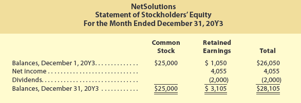

**NetSolutions - Statement of Stockholders' Equity (December):**

| Concept | Common Stock | Retained Earnings | Total |
|---------|--------------|-------------------|-------|
| Balances, December 1, 20Y3 | $25,000 | $1,050 | $26,050 |
| Net income | | 4,055 | 4,055 |
| Dividends | | (2,000) | (2,000) |
| **Balances, December 31, 20Y3** | **$25,000** | **$3,105** | **$28,105** |

---

### Formulas [Fórmulas]

**Basic Formula for Ending Retained Earnings [Fórmula Básica para Ganancias Retenidas Finales]:**

$$
\text{Ending Retained Earnings} = \text{Beginning Retained Earnings} + \text{Net Income} - \text{Dividends}
$$

$$
\text{Ganancias Retenidas Finales} = \text{Ganancias Retenidas Iniciales} + \text{Ingreso Neto} - \text{Dividendos}
$$

**If there is a Net Loss instead of Net Income [Si hay Pérdida Neta en lugar de Ingreso Neto]:**

$$
\text{Ending Retained Earnings} = \text{Beginning Retained Earnings} - \text{Net Loss} - \text{Dividends}
$$

$$
\text{Ganancias Retenidas Finales} = \text{Ganancias Retenidas Iniciales} - \text{Pérdida Neta} - \text{Dividendos}
$$

**Total Stockholders' Equity [Capital Contable Total de los Accionistas]:**

$$
\text{Total Stockholders' Equity} = \text{Common Stock} + \text{Retained Earnings}
$$

$$
\text{Capital Contable Total} = \text{Acciones Comunes} + \text{Ganancias Retenidas}
$$

**Net Income (from Income Statement) [Ingreso Neto (del Estado de Resultados)]:**

$$
\text{Net Income} = \text{Revenues} - \text{Expenses}
$$

$$
\text{Ingreso Neto} = \text{Ingresos} - \text{Gastos}
$$

---

### Retained Earnings Statement [Estado de Ganancias Retenidas]

Instead of a statement of stockholders' equity, companies may prepare a **retained earnings statement [estado de ganancias retenidas]** (A summary of the changes in the retained earnings in a corporation that have occurred during a specific period of time, such as a month or a year.)
[En lugar de un estado de cambios en el capital contable de los accionistas, las empresas pueden preparar un **estado de ganancias retenidas** (Un resumen de los cambios en las ganancias retenidas en una corporación que han ocurrido durante un período de tiempo específico, como un mes o un año).]

This is often the case when a company has few (if any) common stock transactions. In such cases, only retained earnings changes from period to period.
[Este es a menudo el caso cuando una empresa tiene pocas (si es que tiene alguna) transacciones de acciones comunes. En tales casos, solo cambian las ganancias retenidas de un período a otro.]

To illustrate, a retained earnings statement for NetSolutions for December is as follows:
[Para ilustrar, un estado de ganancias retenidas para NetSolutions para diciembre es el siguiente:]

**NetSolutions - Retained Earnings Statement [Estado de Ganancias Retenidas]:**

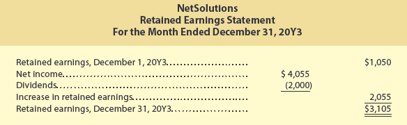

| Concept | | Amount ($) |
|-------------------------------------------|---|-----------:|
| Retained earnings, December 1, 20Y3 | | 1,050 |
| Net income | 4,055 | |
| Dividends | (2,000) | |
| **Retained earnings, December 31, 20Y3** | | **3,105** |

**Formula for Retained Earnings Statement [Fórmula para el Estado de Ganancias Retenidas]:**

$$
\text{Retained Earnings (Ending)} = \text{Retained Earnings (Beginning)} + \text{Net Income} - \text{Dividends}
$$

$$
\text{Ganancias Retenidas (Final)} = \text{Ganancias Retenidas (Inicial)} + \text{Ingreso Neto} - \text{Dividendos}
$$

---

### Key Points Summary [Resumen de Puntos Clave]

| Concept | Effect on Stockholders' Equity |
|---------|--------------------------------|
| **Issuing Common Stock** | Increases Common Stock |
| **Net Income** | Increases Retained Earnings |
| **Net Loss** | Decreases Retained Earnings |
| **Dividends** | Decreases Retained Earnings |

**Order of Preparation [Orden de Preparación]:**

$$
\text{Income Statement} \rightarrow \text{Statement of Stockholders' Equity} \rightarrow \text{Balance Sheet}
$$

$$
\text{Estado de Resultados} \rightarrow \text{Estado de Cambios en el Capital Contable} \rightarrow \text{Balance General}
$$

Since most large companies report a statement of stockholders' equity, the statement of stockholders' equity will be used throughout the remainder of this text.
[Dado que la mayoría de las grandes empresas reportan un estado de cambios en el capital contable de los accionistas, el estado de cambios en el capital contable de los accionistas se utilizará en el resto de este texto.]

---

<h1 id="618874" style="color:#E65100;">
  <a href="#Chapter_001" style="color:inherit; text-decoration:none;">
    1-5c Balance Sheet [Balance General]
  </a>
</h1>

The **balance sheet [balance general]** in **Exhibit 9** reports the amounts of NetSolutions' assets, liabilities, and stockholders' equity as of November 30, 20Y3, in a vertical format. This form of balance sheet is commonly used and is called the **report form [forma de informe]** (A form of balance sheet with the "Liabilities" and "Stockholders' Equity" sections presented below the "Assets" section.)
[El **balance general** en la **Figura 9** reporta los montos de los activos, pasivos y capital contable de los accionistas de NetSolutions al 30 de noviembre de 20Y3, en un formato vertical. Esta forma de balance general se usa comúnmente y se llama **forma de informe** (Una forma de balance general con las secciones de "Pasivos" y "Capital Contable de los Accionistas" presentadas debajo de la sección de "Activos").]


### Balance Sheet [Balance General]
**November 30, 20Y3**

| Concept | | Amount ($) |
|---------|---------|------------|
| **Assets** | | |
| Cash | 5,900 | |
| Supplies | 550 | |
| Land | 20,000 | |
| **Total assets** | | **26,450** |
| | | |
| **Liabilities** | | |
| Accounts payable | 400 | |
| | | |
| **Stockholders' Equity** | | |
| Common stock | 25,000 | |
| Retained earnings | 1,050 | |
| **Total stockholders' equity** | | **26,050** |
| | | |
| **Total liabilities and stockholders' equity** | | **26,450** |

The asset and liability amounts are taken from the last line of the summary of transactions in **Exhibit 6**. The amounts for common stock, retained earnings, and total stockholders' equity are taken from the statement of stockholders' equity.
[Los montos de activos y pasivos se toman de la última línea del resumen de transacciones en la **Figura 6**. Los montos de acciones comunes, ganancias retenidas y capital contable total de los accionistas se toman del estado de cambios en el capital contable de los accionistas.]

The **Assets [Activos]** section of the balance sheet presents assets in the order that they will be converted into cash or used in operations. Cash is presented first, followed by receivables, supplies, prepaid insurance, and other assets. The assets of a more permanent nature are shown next, such as land, buildings, and equipment.
[La sección de **Activos** del balance general presenta los activos en el orden en que se convertirán en efectivo o se utilizarán en las operaciones. El efectivo se presenta primero, seguido de cuentas por cobrar, suministros, seguros pagados por adelantado y otros activos. Los activos de naturaleza más permanente se muestran a continuación, como terrenos, edificios y equipos.]

In the **Liabilities [Pasivos]** section of the balance sheet in Exhibit 9, accounts payable is the only liability. When there are two or more liabilities, each should be listed and the total amount of liabilities presented as follows:
[En la sección de **Pasivos** del balance general en la Figura 9, las cuentas por pagar son el único pasivo. Cuando hay dos o más pasivos, cada uno debe enumerarse y el monto total de los pasivos presentarse de la siguiente manera:]

> **Note:** The following table is a generic example, not related to NetSolutions.
> [**Nota:** La siguiente tabla es un ejemplo genérico, no relacionado con NetSolutions.]

| Liabilities [Pasivos] | Amount ($) |
|----------------------|-----------:|
| Accounts payable [Cuentas por pagar] | $400 |
| Wages payable [Salarios por pagar] | 2,570 |
| **Total liabilities [Total pasivos]** | **$2,970** |

---

### Balance Sheet [Balance General] (Ejemplo Hipotético)
**November 30, 20Y3**

| Concept | | Amount ($) | Changes / Adjust |
|---------|---------|------------|------------------|
| **Assets** | | | |
| Cash | 5,900 | | → no change |
| Supplies | 550 | | → no change |
| Land | 20,000 | | → no change |
| **Total assets** | | **26,450** | → no change |
| | | | |
| **Liabilities** | | | |
| Accounts payable | 400 | | → no change |
| Wages payable | 2,570 | | ↑ +$2,570 |
| **Total liabilities** | | **2,970** | ↑ +$2,570 |
| | | | |
| **Stockholders' Equity** | | | |
| Common stock | 25,000 | | → no change |
| Retained earnings | (1,520) | | ↓ -$2,570 |
| **Total stockholders' equity** | | **23,480** | ↓ -$2,570 |
| | | | |
| **Total liabilities and stockholders' equity** | | **26,450** | → no change |

**Legend [Leyenda]:**
- ↑ = Increase [Aumento]
- ↓ = Decrease [Disminución]
- → = No change [Sin cambio]

---

### Explanation: Why Retained Earnings must decrease [Explicación: Por qué Retained Earnings debe disminuir]

The fundamental accounting equation must always remain in balance:
[La ecuación contable fundamental debe mantenerse siempre en equilibrio:]

$$
\text{Assets} = \text{Liabilities} + \text{Stockholders' Equity}
$$

$$
\text{Activos} = \text{Pasivos} + \text{Capital Contable}
$$

#### Original Balance Sheet (NetSolutions) [Balance General Original (NetSolutions)]:

| Element | Value |
|---------|-------|
| Assets (Activos) | $26,450 |
| Liabilities (Pasivos) | $400 |
| Stockholders' Equity (Capital Contable) | $26,050 |

**Verification [Verificación]:** $400 + $26,050 = **$26,450** ✅

#### When we add Wages payable = $2,570 [Cuando añadimos Wages payable = $2,570]:

If we add a new liability, total liabilities increase:
[Si añadimos un nuevo pasivo, los pasivos totales aumentan:]

| Before (Antes) | After (Después) |
|----------------|-----------------|
| Accounts payable = $400 | Accounts payable = $400 |
| (No Wages payable) | Wages payable = **+$2,570** |
| **Total liabilities = $400** | **Total liabilities = $2,970** |

**Increase in liabilities [Aumento en pasivos]:** **+$2,570**

#### To keep the equation in balance [Para mantener la ecuación en equilibrio]:

Since **Assets do not change** ($26,450 remains the same), **Stockholders' Equity must decrease** by the same amount (+$2,570):
[Dado que los **Activos no cambian** ($26,450 sigue igual), el **Capital Contable debe disminuir** en la misma cantidad (+$2,570):]

$$
\text{Stockholders' Equity} = \text{Assets} - \text{Liabilities}
$$

$$
\text{Stockholders' Equity} = \$26,450 - \$2,970 = \$23,480
$$

#### Where does the decrease occur? [¿Dónde ocurre la disminución?]

Stockholders' Equity is composed of:
[El Capital Contable está compuesto por:]

$$
\text{Stockholders' Equity} = \text{Common Stock} + \text{Retained Earnings}
$$

- **Common Stock** = $25,000 (does not change because no new shares were issued)
  [**Acciones Comunes** = $25,000 (no cambia porque no se emitieron nuevas acciones)]

- **Retained Earnings** must adjust to make the total $23,480:
  [**Ganancias Retenidas** debe ajustarse para que el total sea $23,480:]

$$
\text{Retained Earnings} = \text{Stockholders' Equity} - \text{Common Stock}
$$

$$
\text{Retained Earnings} = \$23,480 - \$25,000 = -\$1,520
$$


---

<h1 id="015759" style="color:#E65100;">
  <a href="#Chapter_001" style="color:inherit; text-decoration:none;">
    1-5d Statement of Cash Flows [Estado de Flujos de Efectivo]
  </a>
</h1>


As discussed earlier, businesses engage in three types of activities. As a result, the **statement of cash flows [estado de flujos de efectivo]** consists of the following three sections, as shown in **Exhibit 9**:
[Como se discutió anteriormente, las empresas realizan tres tipos de actividades. Como resultado, el **estado de flujos de efectivo** consta de las siguientes tres secciones, como se muestra en la **Figura 9**:]

1. **Operating activities [Actividades de operación]**
2. **Investing activities [Actividades de inversión]**
3. **Financing activities [Actividades de financiamiento]**


---

### Cash Flows from Operating Activities [Flujos de Efectivo de las Actividades de Operación]

This section reports a summary of cash receipts and cash payments from operations. The net cash flow from operating activities normally differs from the amount of net income for the period. In **Exhibit 9**, NetSolutions reported net cash flows from operating activities of $2,900 and net income of $3,050. This difference occurs because revenues and expenses may not be recorded at the same time that cash is received from customers or paid to creditors.
[Esta sección reporta un resumen de los recibos de efectivo y los pagos de efectivo de las operaciones. El flujo de efectivo neto de las actividades de operación normalmente difiere del monto del ingreso neto del período. En la **Figura 9**, NetSolutions reportó flujos de efectivo netos de las actividades de operación de $2,900 y un ingreso neto de $3,050. Esta diferencia ocurre porque los ingresos y gastos pueden no registrarse al mismo tiempo que el efectivo se recibe de los clientes o se paga a los acreedores.]

### Statement of Cash Flows [Estado de Flujos de Efectivo]
**For the Month Ended November 30, 20Y3**

| Concept | | Amount ($) |
|---------|---------|------------|
| **Cash flows from operating activities:** | | |
| Cash received from customers | 7,500 | |
| Cash paid for expenses and to creditors | (4,600) | |
| **Net cash flows from operating activities** | | **2,900** |


---

### Cash Flows from Investing Activities [Flujos de Efectivo de las Actividades de Inversión]

This section reports the cash transactions for the acquisition and sale of relatively permanent assets. **Exhibit 9** reports that NetSolutions paid $20,000 for the purchase of land during November.
[Esta sección reporta las transacciones de efectivo por la adquisición y venta de activos relativamente permanentes. La **Figura 9** reporta que NetSolutions pagó $20,000 por la compra de terreno durante noviembre.]

### Statement of Cash Flows [Estado de Flujos de Efectivo]
**For the Month Ended November 30, 20Y3**

| Concept | | Amount ($) |
|---------|---------|------------|
| **Cash flows from investing activities:** | | |
| Cash paid for acquisition of land | (20,000) | |


---

### Cash Flows from Financing Activities [Flujos de Efectivo de las Actividades de Financiamiento]

This section reports the cash transactions related to cash investments by stockholders, borrowings, and dividends. **Exhibit 9** shows that Chris Clark invested $25,000 in exchange for common stock of NetSolutions. NetSolutions also paid $2,000 of dividends during November.
[Esta sección reporta las transacciones de efectivo relacionadas con inversiones de efectivo por parte de los accionistas, préstamos y dividendos. La **Figura 9** muestra que Chris Clark invirtió $25,000 a cambio de acciones comunes de NetSolutions. NetSolutions también pagó $2,000 de dividendos durante noviembre.]

### Statement of Cash Flows [Estado de Flujos de Efectivo]
**For the Month Ended November 30, 20Y3**

| Concept | | Amount ($) |
|---------|---------|------------|
| **Cash flows from financing activities:** | | |
| Cash received from issuing common stock | 25,000 | |
| Cash dividends | (2,000) | |
| **Net cash flows from financing activities** | | **23,000** |


---
### Cash Balance Reconciliation [Reconciliación del Saldo de Efectivo]

**NetSolutions - Statement of Cash Flows [Estado de Flujos de Efectivo]**
**For the Month Ended November 30, 20Y3**

| Concept | | Amount ($) |
|---------|---------|------------|
| **Net increase in cash** | | **5,900** |
| Cash balance, November 1, 20Y3 | | 0 |
| **Cash balance, November 30, 20Y3** | | **5,900** |

---

### Formulas [Fórmulas]

**Net Cash Flow from Financing Activities [Flujo de Efectivo Neto de Actividades de Financiamiento]:**

$$
\text{Net Financing CF} = \text{Cash Inflows from Financing} - \text{Cash Outflows from Financing}
$$

$$
\text{Flujo Neto de Financiamiento} = \text{Entradas de Efectivo por Financiamiento} - \text{Salidas de Efectivo por Financiamiento}
$$

**Explanation [Explicación]:** 
- Cash Inflows [Entradas]: issuing common stock [emisión de acciones comunes], borrowings [préstamos recibidos]
- Cash Outflows [Salidas]: dividends paid [pago de dividendos], loan repayments [pago de préstamos]

**Example [Ejemplo] (NetSolutions):**
$$
25,000 - 2,000 = 23,000
$$

**Positive / Negative Meaning [Significado Positivo / Negativo]:** 
- If positive [si es positivo] $\rightarrow$ more cash in than out [entra más efectivo del que sale] (company receives financing [la empresa recibe financiamiento])
- If negative [si es negativo] $\rightarrow$ more cash out than in [sale más efectivo del que entra] (company returns cash to investors [la empresa devuelve efectivo a los inversores])

---

**Net Increase (Decrease) in Cash [Aumento (Disminución) Neto en Efectivo]:**

$$
\text{Net Increase in Cash} = \text{Operating CF} + \text{Investing CF} + \text{Financing CF}
$$

$$
\text{Aumento Neto en Efectivo} = \text{CF Operación} + \text{CF Inversión} + \text{CF Financiamiento}
$$

**Example [Ejemplo] (NetSolutions):**
$$
2,900 + (-20,000) + 23,000 = 5,900
$$

**Positive / Negative Meaning [Significado Positivo / Negativo]:**
- If positive [si es positivo] $\rightarrow$ cash increased during the period [el efectivo aumentó durante el período]
- If negative [si es negativo] $\rightarrow$ cash decreased during the period [el efectivo disminuyó durante el período]

---

**Ending Cash Balance [Saldo Final de Efectivo]:**

$$
\text{Ending Cash Balance} = \text{Beginning Cash Balance} + \text{Net Increase in Cash}
$$

$$
\text{Saldo Final de Efectivo} = \text{Saldo Inicial de Efectivo} + \text{Aumento Neto en Efectivo}
$$

**Example [Ejemplo] (NetSolutions):**
$$
0 + 5,900 = 5,900
$$

**Positive / Negative Meaning [Significado Positivo / Negativo]:**
- If positive [si es positivo] $\rightarrow$ company has cash available [la empresa tiene efectivo disponible]
- If negative [si es negativo] $\rightarrow$ bank overdraft [sobregiro bancario]

---

### Final Step: Reconciliation from Beginning to Ending Cash [Último Paso: Reconciliación desde el Efectivo Inicial al Final]

| Step [Paso] | Formula [Fórmula] | Example [Ejemplo] |
|-------------|-------------------|-------------------|
| 1. Net increase (decrease) in cash [Aumento (disminución) neto en efectivo] | $\Delta \text{Cash} = \text{CF}_{\text{Operating}} + \text{CF}_{\text{Investing}} + \text{CF}_{\text{Financing}}$ | $2,900 + (-20,000) + 23,000 = 5,900$ |
| 2. Add beginning cash balance [Sumar saldo inicial de efectivo] | $\text{Cash}_{\text{Beginning}} = \text{Saldo Inicial}$ | $0$ |
| 3. Equals ending cash balance [Es igual al saldo final de efectivo] | $\text{Cash}_{\text{Ending}} = \text{Cash}_{\text{Beginning}} + \Delta \text{Cash}$ [Saldo Final = Saldo Inicial + Aumento Neto] | $0 + 5,900 = 5,900$ |

**Name of this table [Nombre de esta tabla]:** Table 1 - Cash Balance Reconciliation [Tabla 1 - Reconciliación del Saldo de Efectivo]

---

### Link to Twitter [Enlace a Twitter]

For a recent year, Twitter reported $1,340 million of cash inflows from operating activities, $2,056 million of cash used for investing activities, $978 million of cash from financing activities, and a net increase in cash of $262 million.
[Para un año reciente, Twitter reportó $1,340 millones de entradas de efectivo por actividades de operación, $2,056 millones de efectivo utilizado en actividades de inversión, $978 millones de efectivo por actividades de financiamiento, y un aumento neto en efectivo de $262 millones.]

---

### NetSolutions Statement of Cash Flows [Estado de Flujos de Efectivo de NetSolutions]

Based on the transactions from **Exhibit 6**, the Statement of Cash Flows for NetSolutions is as follows:
[Basado en las transacciones de la **Figura 6**, el Estado de Flujos de Efectivo para NetSolutions es el siguiente:]

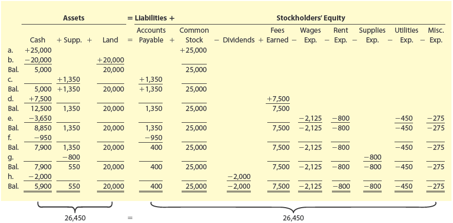</img>


**NetSolutions - Statement of Cash Flows [Estado de Flujos de Efectivo]**
**For the Month Ended November 30, 20Y3 [Para el mes terminado el 30 de noviembre de 20Y3]**

| Concept [Concepto] | Calculation [Cálculo] | Amount ($) [Monto ($)] |
|--------------------|----------------------|------------------------|
| **Cash flows from operating activities [Flujos de efectivo de actividades de operación]:** | | |
| Cash received from customers [Efectivo recibido de clientes] | Transaction (d) | 7,500 |
| Cash paid for expenses and to creditors [Efectivo pagado por gastos y a acreedores] | Transactions (e) + (f) = $3,650 + $950 | (4,600) |
| **Net cash flows from operating activities [Flujo de efectivo neto de actividades de operación]** | $7,500 – $4,600 | **$2,900** |
| | | |
| **Cash flows from investing activities [Flujos de efectivo de actividades de inversión]:** | | |
| Cash paid for acquisition of land [Efectivo pagado por adquisición de terreno] | Transaction (b) | (20,000) |
| **Net cash flows from investing activities [Flujo de efectivo neto de actividades de inversión]** | | **($20,000)** |
| | | |
| **Cash flows from financing activities [Flujos de efectivo de actividades de financiamiento]:** | | |
| Cash received from issuing common stock [Efectivo recibido por emisión de acciones comunes] | Transaction (a) | 25,000 |
| Cash dividends [Dividendos en efectivo] | Transaction (h) | (2,000) |
| **Net cash flows from financing activities [Flujo de efectivo neto de actividades de financiamiento]** | $25,000 – $2,000 | **$23,000** |
| | | |
| **Net increase in cash [Aumento neto en efectivo]** | $2,900 + (–$20,000) + $23,000 | **$5,900** |
| Cash balance, November 1, 20Y3 [Saldo de efectivo, 1 de noviembre de 20Y3] | | 0 |
| **Cash balance, November 30, 20Y3 [Saldo de efectivo, 30 de noviembre de 20Y3]** | $0 + $5,900 | **$5,900** |

---

### Formulas Used in This Statement [Fórmulas Usadas en Este Estado]

**Net Cash Flow from Operating Activities [Flujo de Efectivo Neto de Actividades de Operación]:**

$$
\text{Net Operating CF} = \text{Cash Received from Customers} - \text{Cash Paid for Expenses and to Creditors}
$$

$$
\text{CF Operación Neto} = \text{Efectivo Recibido de Clientes} - \text{Efectivo Pagado por Gastos y a Acreedores}
$$

**Net Cash Flow from Financing Activities [Flujo de Efectivo Neto de Actividades de Financiamiento]:**

$$
\text{Net Financing CF} = \text{Cash Inflows from Financing} - \text{Cash Outflows from Financing}
$$

$$
\text{CF Financiamiento Neto} = \text{Entradas de Efectivo por Financiamiento} - \text{Salidas de Efectivo por Financiamiento}
$$

**Net Increase (Decrease) in Cash [Aumento (Disminución) Neto en Efectivo]:**

$$
\Delta \text{Cash} = \text{Operating CF} + \text{Investing CF} + \text{Financing CF}
$$

$$
\Delta \text{Efectivo} = \text{CF Operación} + \text{CF Inversión} + \text{CF Financiamiento}
$$

**Ending Cash Balance [Saldo Final de Efectivo]:**

$$
\text{Ending Cash} = \text{Beginning Cash} + \Delta \text{Cash}
$$

$$
\text{Saldo Final} = \text{Saldo Inicial} + \Delta \text{Efectivo}
$$

---

### Classification of Individual Transactions [Clasificación de Transacciones Individuales]

| Transaction | Amount ($) | Cash Flow Activity [Actividad de Flujo de Efectivo] |
|-------------|------------|------------------------------------------------------|
| a. | $25,000 | Financing (Issued common stock) [Financiamiento (Emisión de acciones comunes)] |
| b. | –20,000 | Investing (Purchase of land) [Inversión (Compra de terreno)] |
| d. | 7,500 | Operating (Fees earned) [Operación (Honorarios ganados)] |
| e. | –3,650 | Operating (Payment of expenses) [Operación (Pago de gastos)] |
| f. | –950 | Operating (Payment of account payable) [Operación (Pago de cuenta por pagar)] |
| h. | –2,000 | Financing (Paid dividends) [Financiamiento (Pago de dividendos)] |

---

### Key Points [Puntos Clave]

| Section [Sección] | Description [Descripción] |
|-------------------|---------------------------|
| **Operating Activities** | Cash receipts and payments from normal business operations |
| **Investing Activities** | Cash transactions for buying/selling long-term assets |
| **Financing Activities** | Cash transactions with stockholders and creditors (borrowings and dividends) |

**Important Note [Nota Importante]:**
The net cash flow from operating activities ($2,900) differs from net income ($3,050) because:
[El flujo de efectivo neto de las actividades de operación ($2,900) difiere del ingreso neto ($3,050) porque:]
- Revenues may be recorded before cash is received [Los ingresos pueden registrarse antes de recibir el efectivo]
- Expenses may be recorded before cash is paid [Los gastos pueden registrarse antes de pagar el efectivo]

---

### Extending to December: Statement of Cash Flows for a Later Period [Extendiendo a Diciembre: Estado de Flujos de Efectivo para un Período Posterior]

Since November is NetSolutions' first period of operations, the net cash flow for November and the November 30 cash balance are the same amount ($5,900). However, in later periods, the statement of cash flows shows a **beginning cash balance**, an **increase or decrease in cash for the period**, and an **ending cash balance**.
[Dado que noviembre es el primer período de operaciones de NetSolutions, el flujo de efectivo neto de noviembre y el saldo de efectivo del 30 de noviembre son el mismo monto ($5,900). Sin embargo, en períodos posteriores, el estado de flujos de efectivo muestra un **saldo de efectivo inicial**, un **aumento o disminución de efectivo en el período** y un **saldo de efectivo final**].

**Example [Ejemplo]:** Assume that for December NetSolutions has a **decrease in cash of $3,835**. The last three lines of NetSolutions' statement of cash flows for December would be as follows:
[Supongamos que para diciembre NetSolutions tiene una **disminución de efectivo de $3,835**. Las últimas tres líneas del estado de flujos de efectivo de NetSolutions para diciembre serían las siguientes:]

**NetSolutions - Statement of Cash Flows (December) [Estado de Flujos de Efectivo (Diciembre)]**
**For the Month Ended December 31, 20Y3 [Para el mes terminado el 31 de diciembre de 20Y3]**

| Concept [Concepto] | Amount ($) [Monto ($)] | Explanation [Explicación] |
|--------------------|------------------------|---------------------------|
| **Net decrease in cash [Disminución neta en efectivo]** | **($3,835)** | Negative sign means more cash went out than came in during December [El signo negativo significa que salió más efectivo del que entró durante diciembre] |
| Cash balance, December 1, 20Y3 [Saldo de efectivo, 1 de diciembre de 20Y3] | **$5,900** | This is the ending cash balance from November 30 [Este es el saldo final de efectivo del 30 de noviembre] |
| **Cash balance, December 31, 20Y3 [Saldo de efectivo, 31 de diciembre de 20Y3]** | **$2,065** | Calculated as: $5,900 + ($3,835) = $2,065 [Calculado como: $5,900 + ($3,835) = $2,065] |

---

### Explanation of the December Table [Explicación de la Tabla de Diciembre]

This table demonstrates the **accumulative nature** of the Statement of Cash Flows:
[Esta tabla demuestra la **naturaleza acumulativa** del Estado de Flujos de Efectivo:]

| Element [Elemento] | Value [Valor] | Meaning [Significado] |
|--------------------|---------------|----------------------|
| **Cash balance, December 1** | $5,900 | Cash the company had at the start of December (what was left from November) [Efectivo que la empresa tenía al inicio de diciembre (lo que quedó de noviembre)] |
| **Net decrease in cash** | ($3,835) | During December, the company paid out $3,835 more than it received [Durante diciembre, la empresa pagó $3,835 más de lo que recibió] |
| **Cash balance, December 31** | $2,065 | Cash left at the end of December after the decrease [Efectivo restante al final de diciembre después de la disminución] |

**Formula applied [Fórmula aplicada]:**

$$
\text{Cash Dec 31} = \text{Cash Dec 1} + \text{Net Decrease in Cash}
$$

$$
\text{Cash Dec 31} = 5,900 + (-3,835) = 2,065
$$

$$
\text{Saldo 31 Dic} = \text{Saldo 1 Dic} + \text{Disminución Neta en Efectivo}
$$

$$
\text{Saldo 31 Dic} = 5,900 + (-3,835) = 2,065
$$


---

### Visual Summary: November vs. December [Resumen Visual: Noviembre vs. Diciembre]

```
┌─────────────────────────────────────────────────────────────────┐
│                    NOVEMBER (First Month)                       │
├─────────────────────────────────────────────────────────────────┤
│  Cash balance, November 1                 $0                    │
│  Net increase in cash                  +$5,900                  │
│  Cash balance, November 30              $5,900  ──────┐         │
└─────────────────────────────────────────────────────────│───────┘
                                                          │
                                                          ▼ (Carries over)
┌─────────────────────────────────────────────────────────────────┐
│                    DECEMBER (Second Month)                      │
├─────────────────────────────────────────────────────────────────┤
│  Cash balance, December 1                $5,900  ←──────┘       │
│  Net decrease in cash                  ($3,835)                 │
│  Cash balance, December 31              $2,065                  │
└─────────────────────────────────────────────────────────────────┘
```

---

### Key Takeaway [Conclusión Clave]

> **The ending cash balance of one period becomes the beginning cash balance of the next period.**
> [**El saldo de efectivo final de un período se convierte en el saldo de efectivo inicial del período siguiente.**]

This is why the Statement of Cash Flows always shows three lines at the bottom:
[Por eso el Estado de Flujos de Efectivo siempre muestra tres líneas en la parte inferior:]

1. Beginning cash balance [Saldo inicial de efectivo]
2. Net increase or decrease in cash [Aumento o disminución neta en efectivo]
3. Ending cash balance [Saldo final de efectivo]

---

---

<h1 id="909174" style="color:#E65100;">
  <a href="#Chapter_001" style="color:inherit; text-decoration:none;">
    1-5e Interrelationships among Financial Statements [Interrelaciones entre los Estados Financieros]

  </a>
</h1>


Financial statements are prepared in the order of the income statement, statement of stockholders' equity, balance sheet, and statement of cash flows. This order is important because the financial statements are interrelated. These interrelationships for NetSolutions are shown in Exhibit 9 and are described in Exhibit 10.
[Los estados financieros se preparan en el siguiente orden: estado de resultados, estado de cambios en el patrimonio neto, balance general y estado de flujos de efectivo. Este orden es importante porque los estados financieros están interrelacionados. Estas interrelaciones para NetSolutions se muestran en la Figura 9 y se describen en la Figura 10.]

---

## Exhibit 10 [Figura 10]

### Financial Statement Interrelationships [Interrelaciones de los Estados Financieros]

| Financial Statements [Estados Financieros] | Interrelationship [Interrelación] | NetSolutions Example [Ejemplo de NetSolutions] |
|-------------------------------------------|-----------------------------------|--------------------------------------------------|
| **Income Statement** [Estado de Resultados] → **Statement of Stockholders' Equity** [Estado de Cambios en el Patrimonio Neto] | Net income or net loss reported on the income statement is also reported on the statement of stockholders' equity as either an addition (net income) to or deduction (net loss) from the beginning retained earnings. [La utilidad neta o pérdida neta reportada en el estado de resultados también se reporta en el estado de cambios en el patrimonio neto como una adición (utilidad neta) o deducción (pérdida neta) de las ganancias retenidas iniciales.] | NetSolutions' net income of $3,050 for November is added to the beginning retained earnings on November 1, 20Y3, of $0 on the statement of stockholders' equity. [La utilidad neta de NetSolutions de $3,050 para noviembre se suma a las ganancias retenidas iniciales del 1 de noviembre de 20Y3 de $0 en el estado de cambios en el patrimonio neto.] |
| **Statement of Stockholders' Equity** [Estado de Cambios en el Patrimonio Neto] → **Balance Sheet** [Balance General] | Common stock, retained earnings, and total stockholders' equity at the end of the period are reported on the statement of stockholders' equity and balance sheet. [Las acciones comunes, las ganancias retenidas y el patrimonio neto total al final del período se reportan en el estado de cambios en el patrimonio neto y en el balance general.] | NetSolutions' common stock of $25,000, retained earnings of $1,050, and total stockholders' equity of $26,050 as of November 30, 20Y3, are also reported on the balance sheet. [Las acciones comunes de NetSolutions de $25,000, las ganancias retenidas de $1,050 y el patrimonio neto total de $26,050 al 30 de noviembre de 20Y3 también se reportan en el balance general.] |
| **Balance Sheet** [Balance General] → **Statement of Cash Flows** [Estado de Flujos de Efectivo] | The cash reported on the balance sheet is also reported as the end-of-period cash on the statement of cash flows. [El efectivo reportado en el balance general también se reporta como el efectivo al final del período en el estado de flujos de efectivo.] | Cash of $5,900 reported on the balance sheet as of November 30, 20Y3, is also reported on the November statement of cash flows as the end-of-period cash. [El efectivo de $5,900 reportado en el balance general al 30 de noviembre de 20Y3 también se reporta en el estado de flujos de efectivo de noviembre como el efectivo al final del período.] |

---

### Summary of Interrelationships [Resumen de Interrelaciones]

| Connection [Conexión] | What flows [Qué fluye] | Formula [Fórmula] |
|-----------------------|----------------------|-------------------|
| Income Statement → Statement of Stockholders' Equity | Net Income [Utilidad Neta] | $\text{Ending RE} = \text{Beginning RE} + \text{Net Income} - \text{Dividends}$ |
| Statement of Stockholders' Equity → Balance Sheet | Common Stock, Retained Earnings, Total Equity [Acciones Comunes, Ganancias Retenidas, Patrimonio Total] | $\text{Total Equity} = \text{Common Stock} + \text{Retained Earnings}$ |
| Balance Sheet → Statement of Cash Flows | Ending Cash [Efectivo Final] | $\text{Cash (Balance Sheet)} = \text{Ending Cash (SCF)}$ |

---

## Exhibit 11 [Figura 11]

### Balance Sheet as Connecting Link [Balance General como Vínculo de Conexión]

The unique role of the balance sheet as the connecting link between the statement of cash flows, income statement, and statement of stockholders' equity is illustrated in Exhibit 11 for NetSolutions.
[El papel único del balance general como el vínculo de conexión entre el estado de flujos de efectivo, el estado de resultados y el estado de cambios en el patrimonio neto se ilustra en la Figura 11 para NetSolutions.]

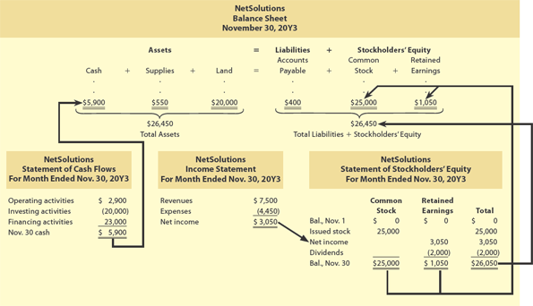</img>

> *[Image: Diagram showing the Balance Sheet as the central link connecting all financial statements]*
> *[Imagen: Diagrama que muestra el Balance General como el vínculo central que conecta todos los estados financieros]*

---

### Importance of Interrelationships [Importancia de las Interrelaciones]

The preceding interrelationships are important in analyzing financial statements and the impact of transactions on a business. In addition, these interrelationships serve as a check on whether the financial statements are prepared correctly. For example, if the ending cash on the statement of cash flows does not agree with the balance sheet cash, then an error has occurred.
[Las interrelaciones anteriores son importantes para analizar los estados financieros y el impacto de las transacciones en un negocio. Además, estas interrelaciones sirven como verificación de si los estados financieros están preparados correctamente. Por ejemplo, si el efectivo final en el estado de flujos de efectivo no coincide con el efectivo del balance general, entonces ha ocurrido un error.]

---

## Check Up Corner 1-2 [Verificación Rápida 1-2]

### Financial Statements [Estados Financieros]

Levart Travel Service's assets and liabilities at December 31, 20Y6, and its revenue and expenses for the year follow.
[Los activos y pasivos de Levart Travel Service al 31 de diciembre de 20Y6, y sus ingresos y gastos del año son los siguientes:]

| Item [Concepto] | Amount ($) [Monto ($)] | Item [Concepto] | Amount ($) [Monto ($)] |
|-----------------|------------------------|-----------------|------------------------|
| Accounts payable [Cuentas por pagar] | $12,200 | Land [Terreno] | $90,000 |
| Accounts receivable [Cuentas por cobrar] | $31,350 | Miscellaneous expense [Gastos varios] | $12,950 |
| Cash [Efectivo] | $53,050 | Office expense [Gastos de oficina] | $63,000 |
| Common stock [Acciones comunes] | $100,000 | Supplies [Suministros] | $3,350 |
| Fees earned [Honorarios ganados] | $263,200 | Wages expense [Gastos de salarios] | $131,700 |

The retained earnings were $30,000 on January 1, 20Y6, the beginning of the year. During the year, no common stock was issued and dividends of $20,000 were paid.
[Las ganancias retenidas fueron $30,000 el 1 de enero de 20Y6, el inicio del año. Durante el año, no se emitieron acciones comunes y se pagaron dividendos de $20,000.]

**a.** Prepare an income statement for the year ended December 31, 20Y6.
[Prepare un estado de resultados para el año terminado el 31 de diciembre de 20Y6.]

**b.** Prepare a statement of stockholders' equity for the year ended December 31, 20Y6.
[Prepare un estado de cambios en el patrimonio neto para el año terminado el 31 de diciembre de 20Y6.]

**c.** Prepare a balance sheet as of December 31, 20Y6.
[Prepare un balance general al 31 de diciembre de 20Y6.]

**d.** Indicate the interrelationships of these three financial statements.
[Indique las interrelaciones de estos tres estados financieros.]

## Solution

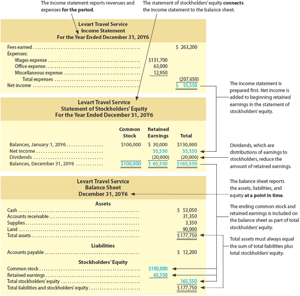</img>

---

## Analysis for Decision Making [Análisis para la Toma de Decisiones]

### Ratio of Liabilities to Stockholders' Equity [Ratio de Pasivos a Patrimonio Neto]

The basic financial statements illustrated in this chapter are useful to bankers, creditors, stockholders, and others in analyzing and interpreting the financial performance and condition of a company. Various tools and techniques that are often used to analyze and interpret a company's financial performance and condition are described and illustrated in the Analysis for Decision Making section. We begin with a method for analyzing the ability of a company to pay its creditors.
[Los estados financieros básicos ilustrados en este capítulo son útiles para banqueros, acreedores, accionistas y otros para analizar e interpretar el rendimiento financiero y la condición de una empresa. Se describen e ilustran varias herramientas y técnicas que se utilizan a menudo para analizar e interpretar el rendimiento financiero y la condición de una empresa. Comenzamos con un método para analizar la capacidad de una empresa para pagar a sus acreedores.]

The relationship between liabilities and stockholders' equity can be expressed as a **ratio of liabilities to stockholders' equity** (A comprehensive leverage ratio that measures the relationship of the claims of creditors to stockholders' equity; a solvency ratio that measures how much of the company is financed by debt and equity, computed as total liabilities divided by total stockholders' equity), as follows:
[La relación entre pasivos y patrimonio neto se puede expresar como un **ratio de pasivos a patrimonio neto** (un ratio de apalancamiento integral que mide la relación de los reclamos de los acreedores con respecto al patrimonio neto; un ratio de solvencia que mide cuánto de la empresa está financiado por deuda y patrimonio, calculado como pasivos totales divididos por patrimonio neto total), de la siguiente manera:]

$$
\text{Ratio of Liabilities to Stockholders' Equity} = \frac{\text{Total Liabilities}}{\text{Total Stockholders' Equity}}
$$

$$
\text{Ratio de Pasivos a Patrimonio Neto} = \frac{\text{Pasivos Totales}}{\text{Patrimonio Neto Total}}
$$

To illustrate, the following data (in millions of dollars) from recent balance sheets of Twitter (TWTR) and Alphabet (GOOG) are used.
[Para ilustrar, se utilizan los siguientes datos (en millones de dólares) de balances generales recientes de Twitter (TWTR) y Alphabet (GOOG).]

| Company [Empresa] | End of Year 1 - Total Liabilities [Fin de Año 1 - Pasivos Totales] | End of Year 1 - Total Stockholders' Equity [Fin de Año 1 - Patrimonio Neto Total] | End of Year 2 - Total Liabilities [Fin de Año 2 - Pasivos Totales] | End of Year 2 - Total Stockholders' Equity [Fin de Año 2 - Patrimonio Neto Total] |
|-------------------|-----------------------------------|---------------------------------------------|-----------------------------------|---------------------------------------------|
| Twitter | $2,365 | $5,047 | $3,357 | $6,806 |
| Alphabet | $44,793 | $152,502 | $55,164 | $177,628 |

The ratios of liabilities to stockholders' equity for Twitter and Alphabet are computed as follows:
[Los ratios de pasivos a patrimonio neto para Twitter y Alphabet se calculan de la siguiente manera:]

**Twitter:**

$$
\text{End of Year 1 [Fin de Año 1]} = \frac{2,365}{5,047} = 0.47
$$

$$
\text{End of Year 2 [Fin de Año 2]} = \frac{3,357}{6,806} = 0.49
$$

**Alphabet:**

$$
\text{End of Year 1 [Fin de Año 1]} = \frac{44,793}{152,502} = 0.29
$$

$$
\text{End of Year 2 [Fin de Año 2]} = \frac{55,164}{177,628} = 0.31
$$

---

### Interpretation of the Ratio [Interpretación del Ratio]

The rights of creditors to a business's assets come before the rights of stockholders. Thus, the lower the ratio of liabilities to stockholders' equity, the better able the company is to withstand poor business conditions and to pay its obligations to creditors.
[Los derechos de los acreedores sobre los activos de un negocio vienen antes que los derechos de los accionistas. Por lo tanto, cuanto menor sea el ratio de pasivos a patrimonio neto, mejor podrá la empresa resistir malas condiciones comerciales y pagar sus obligaciones a los acreedores.]

Alphabet is a very profitable company that requires very little debt. Alphabet's ratio of liabilities to stockholders' equity was 0.29 at the end of Year 1, while increasing slightly to 0.31 at the end of Year 2. Ratios less than 1.0 are protective to creditors. Thus, Alphabet's ratios indicate little creditor risk. In contrast, Twitter's ratio of liabilities to stockholders' equity of 0.49 at the end of Year 2 is over 50% more than that of Alphabet's, indicating more risk to Twitter's creditors. Creditors normally would not be concerned with a liabilities to stockholders' equity ratio of 0.49. In addition, the increase to 0.49 in Year 2 from 0.47 in Year 1 indicates only a minor decrease in protection for creditors.
[Alphabet es una empresa muy rentable que requiere muy poca deuda. El ratio de pasivos a patrimonio neto de Alphabet fue de 0.29 al final del Año 1, mientras que aumentó ligeramente a 0.31 al final del Año 2. Los ratios inferiores a 1.0 son protectores para los acreedores. Por lo tanto, los ratios de Alphabet indican poco riesgo para los acreedores. En contraste, el ratio de pasivos a patrimonio neto de Twitter de 0.49 al final del Año 2 es más del 50% superior al de Alphabet, lo que indica más riesgo para los acreedores de Twitter. Normalmente, los acreedores no se preocuparían por un ratio de pasivos a patrimonio neto de 0.49. Además, el aumento a 0.49 en el Año 2 desde 0.47 en el Año 1 indica solo una disminución menor en la protección para los acreedores.]

---

### Interpretation Guide [Guía de Interpretación]

| Ratio Value [Valor del Ratio] | Meaning [Significado] |
|------------------------------|----------------------|
| Less than 1.0 [Menos de 1.0] | Protective to creditors [Protector para los acreedores] |
| Equal to 1.0 [Igual a 1.0] | Liabilities equal equity [Pasivos igualan al patrimonio] |
| Greater than 1.0 [Mayor de 1.0] | More debt than equity, higher risk [Más deuda que patrimonio, mayor riesgo] |
| Increasing over time [Aumentando con el tiempo] | Decreasing protection for creditors [Disminución de protección para los acreedores] |
| Decreasing over time [Disminuyendo con el tiempo] | Increasing protection for creditors [Aumento de protección para los acreedores] |

---

## Make a Decision [Toma una Decisión]

### Ratio of Liabilities to Stockholders' Equity [Ratio de Pasivos a Patrimonio Neto]

| Activity [Actividad] | Description [Descripción] |
|---------------------|---------------------------|
| MAD 1-1 | Compare Amazon.com to Best Buy [Compara Amazon.com con Best Buy] (Continuing company analysis [Análisis continuo de empresas]) |
| MAD 1-2 | Analyze Target for Three Years [Analiza Target durante tres años] |
| MAD 1-3 | Analyze Walmart for Three Years [Analiza Walmart durante tres años] |
| MAD 1-4 | Compare Target and Walmart [Compara Target y Walmart] |
| MAD 1-5 | Compare Wendy's and Chipotle Mexican Grill [Compara Wendy's y Chipotle Mexican Grill] |

---

## Key Formulas Summary [Resumen de Fórmulas Clave]

**Ratio of Liabilities to Stockholders' Equity [Ratio de Pasivos a Patrimonio Neto]:**

$$
\text{Ratio} = \frac{\text{Total Liabilities}}{\text{Total Stockholders' Equity}}
$$

**From Income Statement to Statement of Stockholders' Equity:**

$$
\text{Ending Retained Earnings} = \text{Beginning Retained Earnings} + \text{Net Income} - \text{Dividends}
$$

**From Statement of Stockholders' Equity to Balance Sheet:**

$$
\text{Total Stockholders' Equity} = \text{Common Stock} + \text{Retained Earnings}
$$

**From Balance Sheet to Statement of Cash Flows:**

$$
\text{Cash (Balance Sheet)} = \text{Ending Cash (Statement of Cash Flows)}
$$

---

